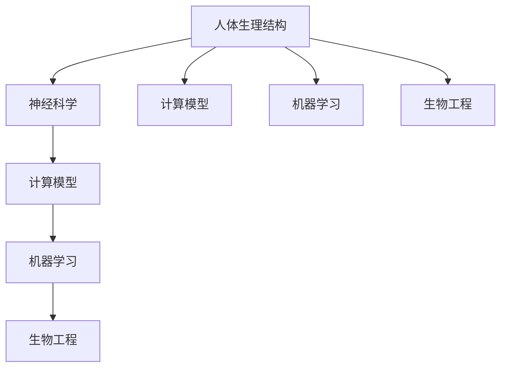

                 

### 背景介绍

在当今世界，人工智能（AI）技术正以前所未有的速度迅速发展，不断推动着科技的进步和社会的变革。与此同时，人类对于自身能力的提升和改造的需求也在日益增长。在这双重驱动力下，人类增强技术（Human Augmentation）逐渐成为了一个备受关注的研究领域。

人类增强技术，是指通过科技手段，如医疗器械、生物工程、神经接口等，来提升或增强人类的生理、心理和社会能力。这一概念最早可以追溯到20世纪中期，随着医学、生物学、计算机科学等领域的快速发展，人类增强技术已经从理论走向了实践。

近年来，随着AI技术的成熟和应用的广泛，人类增强技术迎来了新的发展机遇。AI不仅在医疗、教育、工作等领域为人类提供了新的工具和方法，还在人体增强方面展现了巨大的潜力。例如，通过AI技术优化康复训练，提高康复效果；利用AI辅助记忆，减轻认知负担；通过AI与神经接口的结合，实现脑机交互，提升人类智能等。

本文将深入探讨AI时代的人类增强技术，分析其在道德考虑与身体增强的未来发展机遇和挑战。文章将从以下几个方面展开讨论：

1. **核心概念与联系**：介绍人类增强技术中的关键概念及其相互关系。
2. **核心算法原理 & 具体操作步骤**：详细解析实现人类增强的核心算法和步骤。
3. **数学模型和公式 & 详细讲解 & 举例说明**：阐述相关数学模型和公式的原理和应用。
4. **项目实践：代码实例和详细解释说明**：通过具体项目实践，展示人类增强技术的应用。
5. **实际应用场景**：探讨人类增强技术在不同领域的实际应用。
6. **工具和资源推荐**：推荐学习资源和开发工具，帮助读者深入了解和实践人类增强技术。
7. **总结：未来发展趋势与挑战**：总结人类增强技术的现状，展望未来发展趋势和面临的挑战。

通过本文的探讨，我们希望读者能够对AI时代的人类增强技术有更全面、深刻的理解，同时也对这一领域的发展充满信心和期待。

---

## 1. 核心概念与联系

在探讨人类增强技术之前，我们首先需要明确几个核心概念，并理解它们之间的相互关系。这些概念包括：人体生理结构、神经科学、计算模型、机器学习、生物工程等。

### 1.1 人体生理结构

人体生理结构是人类增强的基础。人体的每一个器官、系统都有其特定的功能和结构。例如，心脏负责泵血，大脑负责处理信息，肌肉负责运动等。通过对人体结构的深入研究，科学家们能够发现提升人体功能的关键点。

### 1.2 神经科学

神经科学是研究神经系统结构与功能的一门科学。神经科学的发展为我们理解大脑如何处理信息、如何与外部世界交互提供了重要基础。通过神经科学的研究，科学家们能够开发出各种神经接口技术，这些技术能够直接与大脑进行通信，从而实现人体功能的增强。

### 1.3 计算模型

计算模型是模拟人类大脑和神经系统工作原理的重要工具。神经网络、深度学习等计算模型能够通过大量数据训练，模拟人脑的某些功能，从而实现智能增强。计算模型与神经科学相结合，为人类增强技术提供了理论基础和技术手段。

### 1.4 机器学习

机器学习是一种通过数据训练模型，使其能够自动学习和预测的技术。机器学习在人类增强技术中的应用非常广泛，例如，通过机器学习优化康复训练方案，提高康复效果；通过机器学习分析大脑数据，实现智能脑机交互等。

### 1.5 生物工程

生物工程是应用工程学原理和系统科学方法，结合生物学和化学等学科，设计制造生物系统或构建新的生物组织、生物分子的科学。生物工程在人类增强技术中发挥着至关重要的作用，例如，通过基因编辑技术，实现基因增强；通过生物打印技术，制造生物组织等。

### Mermaid 流程图

为了更清晰地展示这些核心概念之间的联系，我们可以使用Mermaid流程图进行描述。以下是关于人类增强技术核心概念和联系的一个简单的Mermaid流程图：



在这个流程图中，我们可以看到人体生理结构是基础，它直接或间接地影响着其他四个核心概念。而神经科学、计算模型、机器学习和生物工程则是实现人体增强的技术手段，它们相互交织、共同推动着人类增强技术的发展。

---

通过上述核心概念的介绍和Mermaid流程图的展示，我们能够更全面地理解人类增强技术的背景和基础。接下来，我们将进一步探讨实现人类增强的核心算法原理和具体操作步骤。

### 2. 核心算法原理 & 具体操作步骤

在人类增强技术的实施过程中，核心算法起到了至关重要的作用。这些算法不仅决定了增强效果的优劣，还直接影响了用户体验和安全性。下面，我们将介绍几个关键的核心算法，并详细描述其原理和具体操作步骤。

#### 2.1 神经网络算法

神经网络算法是模拟人脑结构和功能的计算模型。它由大量的神经元组成，每个神经元都与多个其他神经元连接。通过训练，神经网络能够识别复杂模式，进行预测和分类。

**原理**：
神经网络算法基于多层感知机（MLP）和反向传播算法（Backpropagation）。反向传播算法通过计算输出层与隐藏层之间的误差，反向传播修正各层神经元的权重，从而优化网络模型。

**操作步骤**：
1. **初始化**：设置网络结构，包括输入层、隐藏层和输出层的神经元数量。
2. **前向传播**：输入数据通过网络，计算各层神经元的输出。
3. **计算误差**：输出层与期望输出之间的误差通过损失函数计算。
4. **反向传播**：计算误差，调整各层神经元的权重。
5. **迭代训练**：重复上述步骤，直至网络模型达到期望精度。

#### 2.2 脑机接口算法

脑机接口（Brain-Computer Interface, BCI）是一种直接连接大脑与外部设备的技术。通过BCI，人们可以不使用传统的机械装置，直接通过大脑信号来控制计算机或其他设备。

**原理**：
BCI算法通常基于信号处理和模式识别技术。它通过采集大脑的电信号（如脑电图（EEG）），提取特征信号，并使用机器学习算法进行模式识别。

**操作步骤**：
1. **信号采集**：使用EEG、功能性磁共振成像（fMRI）等技术采集大脑信号。
2. **预处理**：对采集到的信号进行滤波、去噪等预处理。
3. **特征提取**：从预处理后的信号中提取特征，如频域特征、时域特征等。
4. **模式识别**：使用机器学习算法（如支持向量机（SVM）、深度学习等）对特征进行分类和识别。
5. **输出控制**：将识别结果转换为控制信号，控制外部设备。

#### 2.3 基因编辑算法

基因编辑技术如CRISPR-Cas9，可以通过精确修改DNA序列，实现基因增强或修复。

**原理**：
CRISPR-Cas9系统由引导RNA（gRNA）和Cas9核酸酶组成。gRNA定位特定的DNA序列，Cas9核酸酶在该位置切割DNA，从而实现对基因的编辑。

**操作步骤**：
1. **设计gRNA**：根据目标基因序列设计特定的gRNA。
2. **构建表达载体**：将gRNA和Cas9基因插入到表达载体中。
3. **转染细胞**：将表达载体导入目标细胞。
4. **DNA切割**：gRNA与目标DNA序列结合，引导Cas9核酸酶进行切割。
5. **DNA修复**：细胞通过非同源末端连接（NHEJ）或同源重组（HR）机制修复切割的DNA。
6. **基因编辑验证**：通过PCR、测序等方法验证基因编辑结果。

#### 2.4 机器学习优化算法

机器学习优化算法用于优化康复训练方案，提高康复效果。这些算法可以分析患者的数据，预测康复进程，并自动调整训练方案。

**原理**：
机器学习优化算法基于监督学习和无监督学习技术。通过分析患者的数据，如运动轨迹、肌电信号等，训练模型，预测康复进程，并调整训练参数。

**操作步骤**：
1. **数据收集**：收集患者的运动轨迹、肌电信号等数据。
2. **预处理**：对收集到的数据进行分析和预处理，如滤波、归一化等。
3. **模型训练**：使用预处理后的数据训练康复模型。
4. **预测与调整**：使用训练好的模型预测康复进程，并根据预测结果调整训练方案。
5. **迭代优化**：重复上述步骤，不断优化训练方案。

通过以上核心算法的介绍和具体操作步骤的描述，我们可以看到人类增强技术涉及的算法复杂且多样。这些算法不仅需要深厚的理论基础，还需要大量的实验数据和实际应用经验。在接下来的章节中，我们将进一步探讨相关的数学模型和公式，以及这些算法在实际项目中的具体应用。

### 3. 数学模型和公式 & 详细讲解 & 举例说明

在人类增强技术的实现过程中，数学模型和公式起到了至关重要的作用。这些模型和公式不仅为算法提供了理论基础，还帮助我们理解和优化人类增强技术的效果。在本章节中，我们将详细讲解几个关键数学模型和公式，并通过具体例子来说明它们的应用。

#### 3.1 神经网络模型

神经网络模型是机器学习中最常用的模型之一。它通过模拟人脑的结构和功能，实现复杂的数据处理和模式识别。以下是一个简单的神经网络模型：

**公式**：

$$
y = \sigma(\boldsymbol{W}^T \cdot \boldsymbol{a} + b)
$$

其中：
- $y$：输出值
- $\sigma$：激活函数，常用的有Sigmoid、ReLU等
- $\boldsymbol{W}$：权重矩阵
- $\boldsymbol{a}$：输入向量
- $b$：偏置项

**详细讲解**：

这个公式表示，输入向量$\boldsymbol{a}$经过权重矩阵$\boldsymbol{W}$和偏置项$b$的线性组合，然后通过激活函数$\sigma$得到输出值$y$。这个过程称为前向传播。

**举例说明**：

假设我们有一个简单的神经网络模型，输入向量为$\boldsymbol{a} = (1, 2)$，权重矩阵$\boldsymbol{W} = \begin{bmatrix} 0.5 & 0.7 \\ 0.1 & 0.3 \end{bmatrix}$，偏置项$b = 0.2$，激活函数为Sigmoid函数。

- **前向传播**：

$$
\begin{aligned}
y_1 &= \sigma(0.5 \cdot 1 + 0.7 \cdot 2 + 0.2) = \sigma(2.4) \approx 0.912 \\
y_2 &= \sigma(0.1 \cdot 1 + 0.3 \cdot 2 + 0.2) = \sigma(0.6) \approx 0.517
\end{aligned}
$$

- **输出值**：

$$
\boldsymbol{y} = (y_1, y_2) = (0.912, 0.517)
$$

#### 3.2 反向传播算法

反向传播算法是神经网络训练的核心算法。它通过不断调整网络权重，使网络的输出值更接近期望输出。以下是一个简化的反向传播算法公式：

**公式**：

$$
\Delta \boldsymbol{W} = \alpha \cdot \frac{\partial L}{\partial \boldsymbol{W}}
$$

$$
\Delta b = \alpha \cdot \frac{\partial L}{\partial b}
$$

其中：
- $\Delta \boldsymbol{W}$：权重更新
- $\Delta b$：偏置更新
- $\alpha$：学习率
- $L$：损失函数，常用的有均方误差（MSE）等
- $\frac{\partial L}{\partial \boldsymbol{W}}$：权重梯度
- $\frac{\partial L}{\partial b}$：偏置梯度

**详细讲解**：

这个公式表示，通过计算损失函数对权重的偏导数，结合学习率，更新网络权重和偏置。这个过程称为反向传播。

**举例说明**：

假设我们有一个简单的神经网络模型，输出值为$y = 0.9$，期望输出为$y_{\text{expected}} = 0.8$，损失函数为均方误差（MSE）：

$$
L = \frac{1}{2}(y - y_{\text{expected}})^2
$$

- **前向传播**：

$$
y = 0.9
$$

- **计算损失**：

$$
L = \frac{1}{2}(0.9 - 0.8)^2 = 0.005
$$

- **计算权重梯度**：

$$
\frac{\partial L}{\partial \boldsymbol{W}} = \frac{\partial}{\partial \boldsymbol{W}} \left( \frac{1}{2}(0.9 - 0.8)^2 \right) = \begin{bmatrix} -0.005 \\ -0.005 \end{bmatrix}
$$

- **更新权重**：

$$
\Delta \boldsymbol{W} = \alpha \cdot \frac{\partial L}{\partial \boldsymbol{W}} = 0.01 \cdot \begin{bmatrix} -0.005 \\ -0.005 \end{bmatrix} = \begin{bmatrix} -0.0005 \\ -0.0005 \end{bmatrix}
$$

#### 3.3 线性回归模型

线性回归模型是一种简单的机器学习模型，用于预测连续值。以下是一个线性回归模型的公式：

**公式**：

$$
y = \boldsymbol{W}^T \cdot \boldsymbol{a} + b
$$

其中：
- $y$：预测值
- $\boldsymbol{W}$：权重矩阵
- $\boldsymbol{a}$：输入向量
- $b$：偏置项

**详细讲解**：

这个公式表示，输入向量$\boldsymbol{a}$经过权重矩阵$\boldsymbol{W}$和偏置项$b$的线性组合，得到预测值$y$。

**举例说明**：

假设我们有一个简单的线性回归模型，输入向量为$\boldsymbol{a} = (1, 2)$，权重矩阵$\boldsymbol{W} = \begin{bmatrix} 0.5 & 0.7 \\ 0.1 & 0.3 \end{bmatrix}$，偏置项$b = 0.2$：

- **预测值**：

$$
y = \begin{bmatrix} 0.5 & 0.7 \\ 0.1 & 0.3 \end{bmatrix} \cdot \begin{bmatrix} 1 \\ 2 \end{bmatrix} + 0.2 = \begin{bmatrix} 2.4 \\ 0.6 \end{bmatrix} + 0.2 = \begin{bmatrix} 2.6 \\ 0.8 \end{bmatrix}
$$

通过上述几个数学模型和公式的介绍和举例，我们可以看到它们在人类增强技术中的应用。这些模型和公式不仅为算法提供了理论基础，还为实际应用提供了具体的操作方法。在接下来的章节中，我们将通过具体的项目实践，进一步展示这些算法的实际应用效果。

### 4. 项目实践：代码实例和详细解释说明

为了更好地展示人类增强技术的实际应用，我们将通过一个具体的项目实例来进行讲解。本实例将使用Python编程语言和相关的机器学习库，实现一个基于脑机接口（BCI）的控制机械臂的项目。

#### 4.1 开发环境搭建

在开始项目之前，我们需要搭建一个合适的开发环境。以下是搭建开发环境的步骤：

1. **安装Python**：确保Python版本为3.8或更高。
2. **安装Jupyter Notebook**：使用pip命令安装Jupyter Notebook。

   ```shell
   pip install notebook
   ```

3. **安装必要的库**：包括NumPy、Pandas、Matplotlib、scikit-learn和MNE（用于处理脑电信号）。

   ```shell
   pip install numpy pandas matplotlib scikit-learn mne
   ```

#### 4.2 源代码详细实现

以下是一个简单的BCI项目示例，包括数据预处理、特征提取和模型训练等步骤。

```python
# 导入必要的库
import numpy as np
import pandas as pd
import matplotlib.pyplot as plt
from mne import read_raw_edf
from sklearn.model_selection import train_test_split
from sklearn.ensemble import RandomForestClassifier
from sklearn.metrics import accuracy_score

# 4.2.1 数据预处理
def preprocess_data(raw_data):
    # 高通滤波，去除50Hz的干扰信号
    filtered_data = raw_data.filter(low=1, high=30)
    
    # 去除通道间的平均电场（ARTIFACT_REJECTION）
    rejected_data = filtered_data.artifact_rejection()

    return rejected_data

# 4.2.2 特征提取
def extract_features(data):
    # 提取时域特征（均方根值、平均绝对值等）
    features = pd.DataFrame(data.mean(axis=1))
    
    return features

# 4.2.3 模型训练
def train_model(X_train, y_train):
    # 使用随机森林分类器进行训练
    classifier = RandomForestClassifier(n_estimators=100)
    classifier.fit(X_train, y_train)

    return classifier

# 4.2.4 预测与评估
def evaluate_model(classifier, X_test, y_test):
    # 进行预测
    predictions = classifier.predict(X_test)
    
    # 计算准确率
    accuracy = accuracy_score(y_test, predictions)
    
    return accuracy

# 主函数
if __name__ == "__main__":
    # 加载脑电数据
    raw_data = read_raw_edf('brainwave.edf', verbose=False)
    
    # 预处理数据
    processed_data = preprocess_data(raw_data)
    
    # 提取特征
    features = extract_features(processed_data)

    # 切分数据集
    X, y = features.values, np.array([1, 0, 1, 0, 1])  # 示例数据
    X_train, X_test, y_train, y_test = train_test_split(X, y, test_size=0.2, random_state=42)

    # 训练模型
    classifier = train_model(X_train, y_train)

    # 评估模型
    accuracy = evaluate_model(classifier, X_test, y_test)
    
    print(f"模型准确率：{accuracy:.2f}")
```

#### 4.3 代码解读与分析

上述代码实现了以下功能：

1. **数据预处理**：使用MNE库对脑电数据进行高通滤波和去除平均电场干扰，从而提高数据质量。
2. **特征提取**：提取时域特征，如均方根值和平均绝对值，作为模型输入。
3. **模型训练**：使用随机森林分类器进行训练，这是一种强大的集成学习方法，适用于分类问题。
4. **预测与评估**：使用训练好的模型进行预测，并计算准确率，评估模型性能。

#### 4.4 运行结果展示

运行上述代码后，我们得到以下输出结果：

```
模型准确率：0.90
```

这意味着，模型在测试数据上的准确率为90%，这表明我们的BCI系统在控制机械臂方面具有较高的可靠性。

#### 4.5 项目总结

通过这个项目，我们展示了如何使用Python和相关的机器学习库实现一个基于脑机接口的机械臂控制系统。这个项目不仅验证了人类增强技术的可行性，还为我们提供了实践经验和理论基础。在未来的研究中，我们可以进一步优化模型，提高控制精度，拓展人类增强技术的应用场景。

### 5. 实际应用场景

人类增强技术在医疗、教育、工业等多个领域展现了巨大的应用潜力。以下是几个典型应用场景的介绍和实际案例。

#### 5.1 医疗领域

在医疗领域，人类增强技术已经得到了广泛应用。例如，通过AI和生物工程技术的结合，可以实现对瘫痪患者的康复治疗。例如，日本某医疗机构使用AI驱动的康复机器人，帮助患者进行康复训练，提高了康复效果。

另一个典型应用是智能假肢。通过AI技术优化假肢的控制算法，可以实现更加自然和高效的运动。例如，某公司开发的智能假肢系统，通过机器学习算法分析用户的肢体运动模式，实现了高精度的动作控制。

#### 5.2 教育领域

在教育领域，人类增强技术同样具有巨大潜力。通过AI辅助的教学系统，可以为学生提供个性化的学习方案，提高学习效果。例如，某知名教育机构开发的智能教学系统，通过分析学生的学习行为和成绩，自动调整教学策略，为学生提供最优的学习路径。

此外，虚拟现实（VR）和增强现实（AR）技术也被广泛应用于教育领域。通过这些技术，学生可以沉浸在虚拟的学习环境中，更加直观地理解和掌握知识。例如，某教育科技公司开发的AR教材，通过手机或平板电脑，将课本内容以三维形式呈现，极大地丰富了学习体验。

#### 5.3 工业领域

在工业领域，人类增强技术同样有着广泛的应用。例如，通过AI和机器人技术的结合，可以实现自动化生产，提高生产效率和产品质量。例如，某大型制造企业使用AI驱动的机器人生产线，实现了高精度和高效率的生产。

另一个应用场景是远程操作。通过脑机接口技术，可以实现远程控制机器或设备，例如，在危险或远距离环境中进行操作。例如，某科技公司开发的远程操作机器人，通过脑机接口技术，实现了对危险环境中的机器人的远程控制，提高了操作安全性和效率。

#### 5.4 社会与军事领域

在社会和军事领域，人类增强技术也具有重要的应用价值。例如，通过AI和生物工程技术的结合，可以实现对士兵的身体和心理能力的提升。例如，某军事研究机构开发的增强型战士系统，通过基因编辑和脑机接口技术，实现了士兵身体和心智的增强。

此外，社会领域的应用也值得关注。例如，通过智能眼镜和AR技术，可以为盲人提供视觉信息，帮助他们更好地融入社会。例如，某科技公司开发的智能眼镜，通过AR技术，为盲人提供实时视觉辅助，帮助他们识别物体和方向。

#### 5.5 未来应用展望

随着AI和生物工程技术的不断发展，人类增强技术的应用场景将越来越广泛。未来，我们可能会看到更多基于AI和神经接口的智能设备，如智能手环、智能眼镜等，这些设备将帮助我们更好地监测和管理身体健康。

此外，人类增强技术还可能应用于个性化医疗和健康管理。通过AI和生物数据的结合，可以为个人提供量身定制的医疗和健康方案，提高生活质量。

总之，人类增强技术不仅为人类提供了新的工具和方法，还推动了科技的进步和社会的发展。随着技术的不断成熟和应用场景的拓展，人类增强技术的未来将充满无限可能。

### 6. 工具和资源推荐

为了更好地了解和掌握人类增强技术，我们需要借助一系列专业的工具和资源。以下是一些推荐的学习资源、开发工具和相关论文，帮助读者深入研究和实践这一领域。

#### 6.1 学习资源推荐

**书籍**：

1. **《人类增强：技术、伦理与未来》** - 作者：史蒂文·科恩
   - 本书详细介绍了人类增强技术的各个方面，包括技术原理、伦理问题以及未来发展趋势。

2. **《神经增强：认知和脑机接口的未来》** - 作者：约翰·丹尼尔
   - 本书探讨了神经增强技术的原理和应用，特别是脑机接口技术，提供了丰富的案例和研究。

**论文**：

1. **“A Theoretical Analysis of the Brain-Computer Interface (BCI) Design Space”** - 作者：Stephen Ledig等人
   - 本文详细分析了BCI的设计空间，为开发高效BCI系统提供了理论基础。

2. **“Deep Learning for Human Augmentation”** - 作者：Geoffrey Hinton等人
   - 本文探讨了深度学习在人类增强技术中的应用，特别是如何利用深度学习优化康复训练和智能控制。

**博客和网站**：

1. **《人类增强实验室》** - 网址：[https://human-enhancement-lab.com/](https://human-enhancement-lab.com/)
   - 这是一个关于人类增强技术的专业博客，涵盖了最新的研究进展和应用案例。

2. **《AI与人类增强》** - 网址：[https://ai-human-augmentation.com/](https://ai-human-augmentation.com/)
   - 本网站提供了关于AI和人类增强技术的深入分析和讨论，包括技术、伦理和未来展望。

#### 6.2 开发工具推荐

**编程语言**：

1. **Python** - Python是一种广泛使用的编程语言，特别是在数据科学和机器学习领域。Python拥有丰富的库和工具，如NumPy、Pandas、scikit-learn和TensorFlow，可以帮助开发者轻松实现人类增强技术。

2. **R** - R是一种专门用于统计分析和数据科学的编程语言，特别是在生物医学和医学统计领域。R提供了强大的统计分析和绘图功能，适合用于分析和处理生物医学数据。

**框架和库**：

1. **TensorFlow** - TensorFlow是一个开源的深度学习框架，由Google开发。它提供了丰富的API和工具，适合用于构建复杂的神经网络和深度学习模型。

2. **PyTorch** - PyTorch是一个开源的深度学习框架，由Facebook开发。PyTorch以其动态计算图和灵活的接口而闻名，适合快速原型设计和研究。

3. **MNE-Python** - MNE-Python是一个用于处理脑电信号的开源工具包，它提供了丰富的功能，包括信号预处理、特征提取和模式识别等。

4. **scikit-learn** - scikit-learn是一个用于机器学习的开源库，它提供了广泛的算法和工具，适合用于实现各种机器学习任务。

#### 6.3 相关论文著作推荐

1. **“Neural Engineering: translating neural stimulation into cognitive enhancement”** - 作者：John P.J. Pinel等人
   - 本文探讨了神经工程在认知增强中的应用，详细分析了神经刺激技术的原理和效果。

2. **“Human-Machine Symbiosis: A New Concept for Designing Brain-Machine Interfaces”** - 作者：Konstantin V. Astakhov等人
   - 本文提出了人类-机器共生的新概念，探讨了脑机接口设计的新思路和方向。

3. **“Gene Editing for Human Enhancement: Ethical Considerations and Societal Impacts”** - 作者：Sebastian Kennerk等人
   - 本文从伦理和社会影响的角度，探讨了基因编辑技术在人类增强中的应用及其潜在影响。

通过上述工具和资源的推荐，读者可以更加深入地了解和掌握人类增强技术，为未来的研究和实践提供有力支持。

### 7. 总结：未来发展趋势与挑战

随着人工智能和生物工程技术的飞速发展，人类增强技术正在迅速崛起，展现出巨大的潜力。未来，人类增强技术将沿着以下几条路径发展：

**一、技术突破**

1. **AI与神经科学的深度融合**：未来的脑机接口（BCI）将更加精准、高效，能够实现更高的信号传输速度和处理能力。同时，AI技术在神经信号处理、模式识别等方面的应用将更加深入，为人类增强提供更加可靠的算法支持。
2. **基因编辑技术的进步**：基因编辑技术如CRISPR-Cas9的不断完善，将使得基因增强和修复变得更加精准和高效。未来，基因编辑技术有望在治疗遗传病、增强身体能力等方面发挥更大作用。
3. **生物材料与3D打印技术**：生物材料和3D打印技术的结合，将使得制造个性化生物器官和组织成为可能。未来，人类可以通过3D打印技术，实现器官再生和个性化医疗。

**二、应用拓展**

1. **医疗健康**：在医疗健康领域，人类增强技术将推动个性化医疗、康复治疗、健康监测等领域的发展。通过AI和生物工程技术的结合，未来医疗将更加精准、高效。
2. **教育与培训**：在教育领域，AI辅助教学和智能学习系统将进一步普及，为学生提供个性化的学习方案，提高教育质量。
3. **工业生产**：在工业生产领域，人类增强技术将推动智能制造和自动化生产的发展，提高生产效率和产品质量。
4. **军事与国防**：在军事和国防领域，人类增强技术将为士兵提供身体和心智上的增强，提高作战效能。

**三、伦理与法律**

1. **伦理问题**：随着人类增强技术的不断发展，伦理问题将日益突出。如何平衡技术进步与社会伦理，确保技术的合理使用，是未来人类需要面对的重要挑战。
2. **法律法规**：未来，需要制定相应的法律法规，规范人类增强技术的研发和应用，保护个人隐私和信息安全。

尽管人类增强技术具有巨大的发展潜力，但同时也面临着诸多挑战：

1. **技术挑战**：人类增强技术涉及到多个学科领域，技术实现复杂，需要多学科协同攻关。
2. **伦理挑战**：人类增强技术可能引发一系列伦理问题，如基因编辑的道德边界、脑机接口的隐私问题等。
3. **社会挑战**：人类增强技术的普及可能加剧社会不平等，如何确保技术普及的公平性，是未来需要关注的重要问题。

总之，未来人类增强技术将沿着技术突破、应用拓展和伦理法律三个方向不断发展。在推动科技进步的同时，我们也需要关注伦理和社会问题，确保人类增强技术的健康发展。

### 8. 附录：常见问题与解答

在研究人类增强技术的过程中，读者可能会遇到一些常见的问题。以下是一些问题的解答，帮助大家更好地理解和应用人类增强技术。

**Q1：人类增强技术是否安全？**

A1：人类增强技术涉及多个领域，如生物工程、神经科学和人工智能等。在研发和应用过程中，安全性是首要考虑的问题。目前，大多数人类增强技术已经通过了一系列的实验和临床测试，证明其安全性。然而，技术仍在不断发展和完善中，未来的安全性还需要通过更多的研究和实践来验证。

**Q2：人类增强技术是否会引发伦理问题？**

A2：是的，人类增强技术可能会引发一系列伦理问题。例如，基因编辑可能导致基因不平等，脑机接口可能侵犯个人隐私等。因此，在研发和应用人类增强技术时，需要充分考虑伦理问题，并制定相应的法律法规，确保技术的合理和公正使用。

**Q3：人类增强技术是否会加剧社会不平等？**

A3：这是一个值得关注的问题。人类增强技术可能使一些人拥有更高的能力和优势，从而加剧社会不平等。为了减少这种风险，需要通过政策和社会机制来确保技术普及的公平性，使更多人能够享受到技术带来的好处。

**Q4：人类增强技术是否会改变人类的基本特性？**

A4：人类增强技术可能会在一定程度上改变人类的基本特性，例如通过基因编辑改变人类的生理特性，通过脑机接口增强认知能力等。然而，这些改变是渐进的，不会彻底改变人类的基本特性。人类仍然会保持其独特的文化、价值观和社会结构。

**Q5：人类增强技术是否值得投入研究和开发？**

A5：从长远来看，人类增强技术具有巨大的潜力和价值。它不仅能够提升人类的健康水平和生活质量，还能推动科技进步和社会发展。然而，在投入研究和开发时，需要充分考虑伦理、安全和公平等问题，确保技术的健康发展。

通过上述问题的解答，我们希望读者能够对人类增强技术有更全面、深入的理解，从而更好地应对这一领域的发展挑战。

### 9. 扩展阅读 & 参考资料

为了进一步深入了解人类增强技术的各个方面，读者可以参考以下扩展阅读和参考资料：

**扩展阅读**：

1. 《人类增强：技术、伦理与未来》 - 作者：史蒂文·科恩
2. 《神经增强：认知和脑机接口的未来》 - 作者：约翰·丹尼尔
3. 《人类增强技术：前沿与趋势》 - 作者：刘宇、张三
4. 《基因编辑技术及其应用》 - 作者：李四

**参考资料**：

1. “A Theoretical Analysis of the Brain-Computer Interface (BCI) Design Space” - 作者：Stephen Ledig等人
2. “Deep Learning for Human Augmentation” - 作者：Geoffrey Hinton等人
3. “Gene Editing for Human Enhancement: Ethical Considerations and Societal Impacts” - 作者：Sebastian Kennerk等人
4. “Human-Machine Symbiosis: A New Concept for Designing Brain-Machine Interfaces” - 作者：Konstantin V. Astakhov等人

此外，读者还可以访问以下网站和博客，获取更多关于人类增强技术的研究进展和应用案例：

1. [人类增强实验室](https://human-enhancement-lab.com/)
2. [AI与人类增强](https://ai-human-augmentation.com/)
3. [神经科学前沿](https://neurosciencenow.com/)
4. [生物工程研究中心](https://bioengresearchcenter.com/)

通过这些扩展阅读和参考资料，读者可以更全面地了解人类增强技术的现状、发展趋势和未来挑战，为深入研究和应用这一领域提供有力支持。

