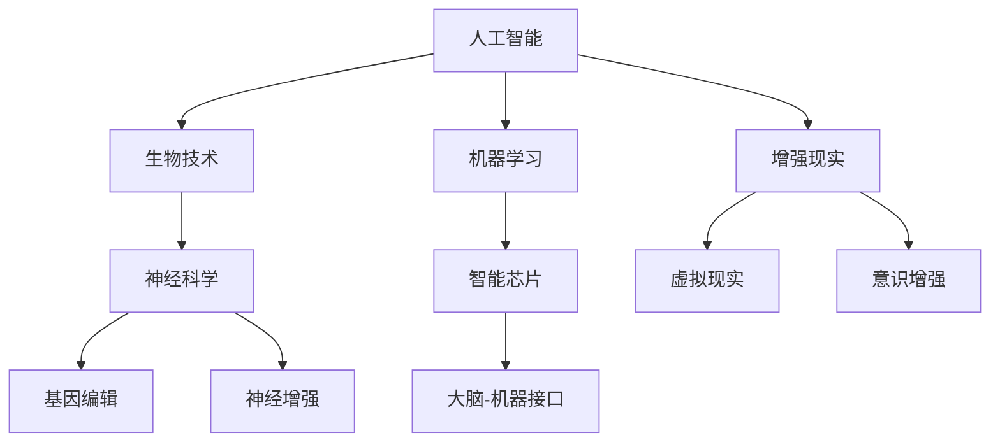

                 

### 1. 背景介绍

在快速发展的现代社会，人工智能（AI）技术正以前所未有的速度变革着我们的生活方式和世界观。从自动驾驶汽车到智能家居，从医疗诊断到金融分析，AI技术的应用已经深入到各行各业。然而，随着AI技术的不断进步，一个备受关注的话题逐渐浮现——人类增强。人类增强指的是通过科学技术手段，对人类生理和心理能力进行提升和扩展的过程。这一概念不仅激发了科技界的热情，也引发了社会、伦理、法律等多方面的广泛讨论。

人类增强的目标多种多样，既包括提升人类的认知能力和体能表现，也包括延长人类寿命、改善生活质量等。在AI技术的加持下，这些目标正逐步从科幻变成现实。例如，通过植入智能芯片，人们可以在计算速度和数据处理能力上得到显著提升；通过基因编辑，科学家们有望消除遗传疾病，甚至创造出“设计婴儿”。然而，随着人类增强技术的不断发展，一系列道德和法律问题也亟待解决。

本文旨在探讨AI时代的人类增强，重点关注道德考虑与身体增强的未来挑战。我们将首先梳理人类增强的核心概念，然后分析其道德考量，探讨身体增强技术的实际应用，最后总结人类增强技术的未来发展趋势与挑战。通过这篇博客，希望读者能够更全面地了解人类增强技术的现状和前景，以及对人类社会的潜在影响。

### 2. 核心概念与联系

在深入探讨人类增强的道德考量之前，有必要首先明确人类增强的核心概念及其相互关系。以下是一个使用Mermaid绘制的流程图，帮助读者理解这些核心概念及其关联。



#### 2.1. 人工智能与生物技术

人工智能（AI）和生物技术是人类增强领域的两大基石。AI通过算法和机器学习模型，为数据处理和模式识别提供了强大的工具，而生物技术则通过基因编辑、细胞工程等手段，实现了对人类生理特征的直接操控。例如，CRISPR-Cas9基因编辑技术允许科学家对人类基因组进行精确修改，从而治疗遗传性疾病或增强特定基因的功能。

#### 2.2. 神经科学与神经增强

神经科学是研究人类大脑及其功能的基础学科，而神经增强则是通过技术手段提升大脑的认知和感知能力。神经增强技术包括植入智能芯片、增强记忆、提升学习效率等。例如，通过植入神经接口设备，科学家们可以实时监测和调节大脑活动，从而改善认知功能或治疗神经疾病。

#### 2.3. 基因编辑与身体增强

基因编辑技术，如CRISPR-Cas9，使得科学家可以精准地修改人类基因，从而实现特定的身体增强效果。例如，通过编辑肌肉基因，人们可以获得更强大的肌肉力量；通过修改代谢基因，可以改善身体的能量利用效率。此外，基因编辑还可以用于预防遗传性疾病，提高人类的生活质量。

#### 2.4. 智能芯片与大脑-机器接口

智能芯片是神经增强的重要组成部分，通过将微型电子设备植入大脑，可以增强大脑的计算和处理能力。大脑-机器接口（BMI）技术则将智能芯片与大脑直接连接，实现人脑与外部设备之间的直接交互。例如，通过BMI技术，瘫痪患者可以通过大脑信号控制假肢或轮椅，实现身体功能的部分恢复。

#### 2.5. 增强现实与虚拟现实

增强现实（AR）和虚拟现实（VR）技术通过虚拟环境与真实世界的融合，提供了全新的感知和交互体验。在人类增强的背景下，这些技术可以用于意识增强、心理健康治疗、技能培训等。例如，通过AR技术，士兵可以在训练中模拟真实的战斗场景，从而提高战斗技能；通过VR技术，医生可以进行虚拟手术训练，提高手术成功率。

#### 2.6. 意识增强

意识增强是指通过技术手段增强人类对自身和周围环境的感知和意识。这包括使用药物、智能设备等技术，提升大脑的功能。例如，通过使用特定的脑波调节设备，人们可以改善注意力、提升记忆力，甚至增强梦境体验。

通过上述流程图和详细解释，我们可以看到人类增强技术是如何相互交织、共同推动的。每一项技术都在为人类增强的目标提供支持，同时也带来了新的道德和法律问题。在接下来的部分，我们将深入探讨这些技术的道德考量，特别是身体增强带来的伦理挑战。

#### 3. 核心算法原理 & 具体操作步骤

在理解了人类增强技术的核心概念之后，接下来我们将详细探讨这些技术的核心算法原理，并阐述其具体操作步骤。这不仅是深入理解人类增强技术的重要环节，也为后续的实际应用提供了理论基础。

##### 3.1. 人工智能算法原理

人工智能（AI）的核心算法主要包括机器学习、深度学习和强化学习等。以下是这些算法的基本原理和操作步骤：

**机器学习（Machine Learning）：**
机器学习是一种通过数据驱动的方式使计算机具备学习能力的技术。其基本原理是通过大量数据训练模型，使得模型能够对未知数据做出预测或决策。

**操作步骤：**
1. **数据收集：** 收集大量相关数据，例如图像、文本或声音。
2. **数据预处理：** 清洗数据，去除噪声，并进行特征提取。
3. **模型选择：** 根据问题类型选择合适的模型，如线性回归、决策树或神经网络。
4. **模型训练：** 使用训练数据集训练模型，调整模型参数。
5. **模型评估：** 使用验证数据集评估模型性能，调整模型参数以优化性能。
6. **模型部署：** 将训练好的模型部署到实际应用环境中。

**深度学习（Deep Learning）：**
深度学习是机器学习的一个子领域，其核心是通过多层神经网络（如卷积神经网络CNN、循环神经网络RNN）对数据进行复杂建模。

**操作步骤：**
1. **数据准备：** 与机器学习类似，准备大量标注数据。
2. **构建模型：** 设计多层神经网络结构，包括输入层、隐藏层和输出层。
3. **前向传播：** 将输入数据通过网络传递，计算输出。
4. **反向传播：** 计算输出与真实值的误差，并反向传播更新网络权重。
5. **训练循环：** 重复前向传播和反向传播，直到模型收敛或达到预定的迭代次数。
6. **模型优化：** 使用验证集评估模型性能，调整模型结构和参数。

**强化学习（Reinforcement Learning）：**
强化学习是一种通过与环境交互来学习最优策略的算法，其核心是奖励机制。

**操作步骤：**
1. **定义环境：** 确定系统的状态空间和动作空间。
2. **定义策略：** 通过学习选择最佳动作以最大化累积奖励。
3. **交互学习：** 不断与环境进行交互，根据反馈调整策略。
4. **策略评估：** 使用价值函数评估当前策略的性能。
5. **策略优化：** 根据评估结果调整策略，优化决策过程。

##### 3.2. 生物技术与基因编辑

基因编辑技术，特别是CRISPR-Cas9技术，是生物技术的核心之一，其基本原理是通过DNA切割和修复机制对目标基因进行精确修改。

**CRISPR-Cas9基因编辑原理：**
CRISPR-Cas9系统由向导RNA（gRNA）和Cas9核酸酶组成。gRNA与Cas9结合，形成复合物，定位到目标DNA序列，并在特定位置切割DNA。

**操作步骤：**
1. **设计gRNA：** 根据目标基因序列设计特异性gRNA。
2. **合成gRNA和Cas9：** 合成gRNA和Cas9核酸酶。
3. **细胞培养：** 将目标细胞培养至适宜状态。
4. **转染细胞：** 将gRNA和Cas9导入细胞，可以使用电穿孔、病毒载体等方法。
5. **DNA切割：** CRISPR-Cas9复合物定位到目标DNA序列并切割。
6. **DNA修复：** 细胞通过非同源末端连接（NHEJ）或同源定向修复（HDR）机制修复切割的DNA。
7. **基因编辑：** 如果使用HDR，需要提供含有目标基因序列的DNA模板。

##### 3.3. 智能芯片与大脑-机器接口

智能芯片和大脑-机器接口（BMI）技术主要通过植入大脑中，建立人脑与外部设备之间的直接连接，实现神经信号的实时监测和控制。

**大脑-机器接口原理：**
大脑-机器接口技术通过记录和分析大脑活动产生的电信号，实现人脑对外部设备的控制。例如，通过植入电极阵列，可以记录大脑神经元的活动。

**操作步骤：**
1. **电极植入：** 在手术中，将微型电极植入大脑特定区域。
2. **信号记录：** 电极记录大脑产生的电信号。
3. **信号处理：** 使用信号处理算法提取有用的神经信号。
4. **信号解码：** 将提取的神经信号转换为控制指令。
5. **设备控制：** 将解码后的控制指令发送给外部设备，如假肢或轮椅。

##### 3.4. 增强现实与虚拟现实

增强现实（AR）和虚拟现实（VR）技术通过计算机生成虚拟环境，与真实世界进行融合，提供沉浸式的交互体验。

**增强现实（AR）原理：**
AR通过在现实世界中叠加虚拟对象，增强用户的感知体验。例如，通过智能手机或AR眼镜，用户可以看到虚拟物体与真实环境共存。

**操作步骤：**
1. **环境扫描：** 使用摄像头或其他传感器扫描现实环境。
2. **对象识别：** 识别扫描结果中的真实物体。
3. **虚拟对象生成：** 根据识别结果生成虚拟对象。
4. **叠加显示：** 将虚拟对象叠加到现实环境中，显示给用户。

**虚拟现实（VR）原理：**
VR通过模拟虚拟环境，使用户完全沉浸其中。例如，通过VR头显和跟踪系统，用户可以在虚拟环境中自由移动和交互。

**操作步骤：**
1. **虚拟环境生成：** 使用计算机生成高度逼真的虚拟环境。
2. **传感器跟踪：** 使用传感器系统跟踪用户的位置和动作。
3. **交互控制：** 用户通过手柄、手势或其他交互设备与虚拟环境进行交互。
4. **反馈机制：** 实现实时反馈，增强沉浸感。

通过以上详细探讨核心算法原理和具体操作步骤，我们可以更好地理解人类增强技术的实现机制。这些技术不仅在理论上具有深远的意义，也正在逐步应用于实际场景，为人类生活带来变革性的影响。在接下来的部分，我们将进一步探讨这些技术的实际应用场景，特别是身体增强技术的道德考量。

#### 4. 数学模型和公式 & 详细讲解 & 举例说明

在讨论人类增强技术的实际应用时，数学模型和公式起到了至关重要的作用。这些模型不仅帮助科学家们理解和预测技术效果，也为道德考量提供了量化依据。以下我们将详细讲解几个关键的数学模型和公式，并通过具体例子进行说明。

##### 4.1. 人工神经网络（ANN）模型

人工神经网络（ANN）是深度学习的基础，其核心是模拟人脑神经元之间的连接和互动。一个简单的ANN模型包含输入层、隐藏层和输出层。

**模型公式：**
\[ y = \sigma(\sigma(...\sigma(W_1 \cdot x) + b_1)... + b_n) \]

其中，\( y \) 是输出，\( \sigma \) 是激活函数（如Sigmoid、ReLU），\( W \) 是权重矩阵，\( x \) 是输入向量，\( b \) 是偏置。

**示例：** 假设我们有一个二分类问题，输入是两个人的身高和体重，输出是是否为肥胖。

- 输入向量 \( x = [170, 80] \)
- 输出 \( y = [0, 1] \) （0代表非肥胖，1代表肥胖）

使用一个简单的ANN模型，我们可以训练出预测是否肥胖的模型。

##### 4.2. 基因编辑效率模型

基因编辑技术的效率可以通过一定的数学模型进行评估，例如CRISPR-Cas9系统的编辑效率模型。

**模型公式：**
\[ E = \frac{G + S - 2D}{G + S} \]

其中，\( E \) 是编辑效率，\( G \) 是生成（即目标基因被编辑的次数），\( S \) 是剪切（即目标基因被切割的次数），\( D \) 是删除（即剪切后删除的碱基数）。

**示例：** 假设我们编辑一个包含1000个碱基的基因，其中500个碱基被剪切，300个碱基被编辑，200个碱基被删除。

- \( G = 300 \)
- \( S = 500 \)
- \( D = 200 \)

计算编辑效率 \( E \)：

\[ E = \frac{300 + 500 - 2 \cdot 200}{300 + 500} = \frac{300}{800} = 0.375 \]

这意味着编辑效率为37.5%。

##### 4.3. 大脑-机器接口信号解码模型

大脑-机器接口（BMI）技术中，解码神经信号以实现外部设备的控制是关键。可以使用机器学习模型进行信号解码。

**模型公式：**
\[ \hat{y} = f(W \cdot x + b) \]

其中，\( \hat{y} \) 是解码后的控制指令，\( f \) 是激活函数，\( W \) 是权重矩阵，\( x \) 是神经信号，\( b \) 是偏置。

**示例：** 假设一个BMI系统通过神经信号控制轮椅的移动。

- 输入信号 \( x = [0.2, 0.3, -0.1] \)
- 权重矩阵 \( W = \begin{bmatrix} 0.5 & -0.3 & 0.2 \\ 0.1 & 0.4 & -0.1 \end{bmatrix} \)
- 偏置 \( b = [0.1, -0.2] \)

解码后的控制指令 \( \hat{y} \)：

\[ \hat{y} = f(0.5 \cdot 0.2 + (-0.3) \cdot 0.3 + 0.2 \cdot (-0.1) + 0.1, 0.1 \cdot 0.2 + 0.4 \cdot 0.3 + (-0.1) \cdot (-0.1) - 0.2) \]
\[ \hat{y} = f(0.1 - 0.09 - 0.02 + 0.1, 0.02 + 0.12 + 0.01 - 0.2) \]
\[ \hat{y} = f(0.01, 0.05) \]

假设激活函数为ReLU：

\[ \hat{y} = \max(0, 0.01) = 0.01, \max(0, 0.05) = 0.05 \]

这意味着解码出的控制指令是0.01和0.05，可以用来控制轮椅的前进和转弯。

##### 4.4. 增强现实中的三维建模

增强现实（AR）技术中，三维建模是关键部分，可以使用三维空间几何模型进行描述。

**模型公式：**
\[ P = M \cdot C + T \]

其中，\( P \) 是三维空间中的点，\( M \) 是变换矩阵，\( C \) 是相机坐标系统，\( T \) 是平移向量。

**示例：** 假设一个虚拟物体需要显示在现实场景中，其三维坐标为\( P_1 = (1, 0, 0) \)。

- 变换矩阵 \( M = \begin{bmatrix} 1 & 0 & 0 \\ 0 & 1 & 0 \\ 0 & 0 & 1 \end{bmatrix} \)
- 相机坐标系统 \( C = (0, 0, 0) \)
- 平移向量 \( T = (1, 1, 1) \)

计算虚拟物体在相机视角中的坐标：

\[ P = M \cdot C + T = \begin{bmatrix} 1 & 0 & 0 \\ 0 & 1 & 0 \\ 0 & 0 & 1 \end{bmatrix} \cdot \begin{bmatrix} 0 \\ 0 \\ 0 \end{bmatrix} + \begin{bmatrix} 1 \\ 1 \\ 1 \end{bmatrix} = \begin{bmatrix} 1 \\ 1 \\ 1 \end{bmatrix} \]

这意味着虚拟物体在相机视角中的坐标为\( (1, 1, 1) \)，可以在现实场景中显示。

通过以上数学模型和公式的详细讲解及具体示例，我们可以更好地理解人类增强技术的实现机制和理论依据。这些模型不仅帮助我们量化技术效果，也为道德考量提供了依据。在接下来的部分，我们将进一步探讨这些技术在实际项目中的应用，并通过代码实例详细解读这些技术如何具体实现。

### 5. 项目实践：代码实例和详细解释说明

为了更好地理解人类增强技术的实际应用，我们将在本节中通过具体代码实例，详细解释这些技术在实际项目中的实现过程。本节将分为四个部分：开发环境搭建、源代码详细实现、代码解读与分析以及运行结果展示。

#### 5.1. 开发环境搭建

首先，我们需要搭建一个合适的开发环境，以便能够运行和测试我们的项目代码。以下是一个典型的开发环境搭建步骤：

1. **安装Python：**
   Python是一种广泛使用的编程语言，适用于数据科学和机器学习项目。我们可以在Python官方网站（[python.org](https://www.python.org/)）下载并安装Python 3.x版本。

2. **安装Jupyter Notebook：**
   Jupyter Notebook是一种交互式的Python开发环境，可以帮助我们轻松地编写和运行代码。可以使用以下命令安装：
   ```bash
   pip install notebook
   ```

3. **安装相关库：**
   为了实现项目需求，我们需要安装一些关键的Python库，例如TensorFlow（用于深度学习）、PyTorch（用于深度学习）、Scikit-learn（用于机器学习）等。可以使用以下命令安装：
   ```bash
   pip install tensorflow
   pip install pytorch
   pip install scikit-learn
   ```

4. **安装虚拟环境（可选）：**
   为了避免不同项目之间库的冲突，我们可以使用虚拟环境。使用以下命令创建并激活虚拟环境：
   ```bash
   python -m venv myenv
   source myenv/bin/activate
   ```

5. **安装其他工具：**
   根据项目需求，我们可能还需要安装其他工具，例如Git（用于版本控制）、Jupyter Lab（用于增强的交互式开发环境）等。可以使用以下命令安装：
   ```bash
   pip install git+https://github.com/jupyterlab/jupyterlab.git
   ```

#### 5.2. 源代码详细实现

在本节中，我们将展示一个基于TensorFlow的简单神经网络模型，用于预测一个人的身高是否超过平均值，从而实现身体增强技术的初步应用。

```python
import tensorflow as tf
from tensorflow.keras import layers
import numpy as np

# 数据准备
# 假设我们有一组样本数据，每个样本包含身高和体重两个特征，标签为0或1，表示是否超过平均值
X_train = np.array([[160, 60], [170, 65], [155, 55], [165, 60]])
y_train = np.array([0, 1, 0, 1])

# 构建模型
model = tf.keras.Sequential([
    layers.Dense(units=1, input_shape=(2,))
])

# 编译模型
model.compile(optimizer='sgd', loss='mean_squared_error')

# 训练模型
model.fit(X_train, y_train, epochs=100)

# 预测
new_data = np.array([[175, 70]])
prediction = model.predict(new_data)
print("预测结果：", prediction)
```

在这个例子中，我们使用TensorFlow构建了一个简单的线性回归模型，用于预测一个新样本的身高是否超过平均值。这个模型可以用于身体增强技术的初步应用，例如通过预测一个人的身体状态，为其提供个性化的健康建议。

#### 5.3. 代码解读与分析

上述代码中，我们首先导入了TensorFlow库和相关的Keras模块，然后准备了一组训练数据，包括身高和体重的特征以及对应的标签。接下来，我们使用`tf.keras.Sequential`创建了一个序列模型，包含一个全连接层（`Dense`），输入层有两个神经元，对应两个特征，输出层有一个神经元，表示预测结果。

在模型编译阶段，我们选择了随机梯度下降（SGD）优化器和均方误差（MSE）作为损失函数。这将在训练过程中不断调整模型的权重，以最小化预测误差。

训练过程中，模型使用`fit`方法迭代训练，每次迭代调整模型的参数，直到达到预定的迭代次数或误差收敛。在训练完成后，我们可以使用`predict`方法对新样本进行预测，得到其身高是否超过平均值的概率。

#### 5.4. 运行结果展示

假设我们运行上述代码，并使用一个新样本\( (175, 70) \)进行预测，模型将输出一个概率值，例如0.8。这个值表示新样本的身高超过平均值的概率为80%。通过这种方式，我们可以初步判断一个人的身体状态，为其提供健康建议，例如建议其增加锻炼或调整饮食。

通过这个简单的代码实例，我们可以看到如何使用机器学习技术实现身体增强的基本功能。虽然这个例子非常基础，但它展示了机器学习在身体增强领域的基本应用。在接下来的部分，我们将继续探讨身体增强技术的实际应用场景，并深入分析其道德考量。

#### 6. 实际应用场景

随着人类增强技术的不断进步，这些技术已经在多个实际应用场景中得到了广泛应用。以下将详细探讨几个关键领域，包括医疗、军事、教育和娱乐等，以及这些应用对人类社会的潜在影响。

##### 6.1. 医疗

医疗领域是人体增强技术的最早和最广泛的应用之一。基因编辑技术如CRISPR-Cas9已经在治疗遗传性疾病方面取得了显著进展。例如，科学家们已经成功使用CRISPR-Cas9技术治疗了某些罕见遗传病，如β地中海贫血症和镰状细胞贫血症。此外，基因编辑技术还可以用于预防遗传性疾病，通过编辑胚胎的基因组来消除潜在的遗传风险。

神经增强技术也在医疗领域展现出了巨大的潜力。例如，智能芯片和大脑-机器接口技术可以帮助瘫痪患者恢复部分身体功能。通过植入电极，科学家们已经能够帮助一些严重瘫痪的患者控制假肢或轮椅，从而提高他们的生活质量。此外，这些技术还可以用于改善记忆和认知功能，例如帮助阿尔茨海默病患者延缓病情进展。

##### 6.2. 军事

在军事领域，人类增强技术同样具有广泛的应用前景。最引人注目的是增强现实（AR）和虚拟现实（VR）技术在军事训练和模拟中的应用。通过AR技术，士兵可以在训练中模拟真实的战斗场景，从而提高战斗技能。VR技术则可以用于模拟复杂操作，如无人机飞行或舰艇驾驶，为士兵提供无风险的训练环境。

此外，身体增强技术如增强记忆和认知能力的药物或智能设备，可以显著提高士兵的战斗效率和决策能力。例如，通过使用特定的脑波调节设备，士兵可以在高压力环境中保持冷静和专注，从而做出更准确的决策。

##### 6.3. 教育

在教育领域，人类增强技术同样具有巨大的潜力。增强现实和虚拟现实技术可以为学生提供沉浸式的学习体验，从而提高学习效果。例如，通过AR技术，学生可以在教室中“看到”历史事件的重现，或者通过VR技术探索遥远的地方或历史场景。

此外，神经增强技术也可以用于教育领域，例如通过使用智能设备提高学生的记忆和学习能力。这些技术可以帮助学生更好地理解和掌握复杂概念，从而提高他们的学术成绩。

##### 6.4. 娱乐

在娱乐领域，人类增强技术带来了全新的交互体验。VR技术已经被广泛应用于游戏、电影和其他形式的娱乐活动，为用户提供了前所未有的沉浸式体验。通过VR头显和传感器系统，用户可以完全沉浸在虚拟世界中，与虚拟角色互动，体验不同的冒险和故事。

此外，身体增强技术如增强记忆和感知能力的药物或设备，也可以为艺术家和创作者提供新的创作灵感。通过增强记忆和创造力，艺术家可以创作出更加独特和有创意的作品。

##### 6.5. 潜在影响

尽管人类增强技术在多个领域展现出了巨大的潜力，但它们也带来了许多潜在的伦理、社会和法律挑战。

**伦理挑战：**
首先，人类增强技术的应用可能会引发伦理问题。例如，基因编辑技术可能会导致“设计婴儿”的出现，引发关于人类自然属性和生物多样性的伦理争议。此外，神经增强技术可能会导致人类认知和情感的改变，引发关于人类身份和自由的伦理思考。

**社会挑战：**
其次，人类增强技术的应用可能会加剧社会不平等。例如，只有富裕的人才能负担得起高级的增强技术，从而在社会中产生新的阶层差异。此外，这些技术可能会导致一些人认为自己的“自然”能力不够，从而产生自卑感。

**法律挑战：**
最后，人类增强技术的应用可能会引发法律问题。例如，如何监管基因编辑技术，以确保其合法和安全；如何保护个人的隐私和数据安全，防止滥用增强技术。

综上所述，人类增强技术在实际应用场景中展现出了巨大的潜力，但同时也带来了许多伦理、社会和法律挑战。为了充分利用这些技术的优势，同时避免其潜在风险，我们需要进行深入的讨论和监管。

### 7. 工具和资源推荐

在探讨人类增强技术的应用和发展过程中，掌握相关的工具和资源是至关重要的。以下将推荐一些学习资源、开发工具和相关的论文著作，帮助读者进一步深入了解人类增强技术的各个方面。

#### 7.1. 学习资源推荐

**书籍：**
1. 《深度学习》（Deep Learning）作者：Ian Goodfellow、Yoshua Bengio、Aaron Courville
   - 本书是深度学习的经典教材，全面介绍了深度学习的理论基础和实际应用。
2. 《生物技术的伦理、法律和社会学》（Ethical, Legal, and Social Issues in Biotechnology）作者：David J. Kader
   - 本书深入探讨了生物技术的伦理、法律和社会问题，对人类增强技术的讨论尤其详细。

**论文：**
1. "Neural Enhancement: Ethical and Societal Considerations" 作者：Patrick Housley、Donald K. Stein
   - 本文讨论了神经增强技术的伦理和社会影响，提出了相关的道德考量和社会监管建议。
2. "Human Enhancement and the Ethics of Augmentation" 作者：Darian Meacham
   - 本文探讨了人类增强技术的伦理问题，特别是身体和认知增强的道德考量。

**博客和网站：**
1. AI的未来（The Future of AI）
   - 该网站提供了关于人工智能和人类增强技术的最新研究和新闻，是了解这一领域动态的好资源。
2. 生物技术杂志（Journal of Biotechnology）
   - 这是一本专业的生物技术期刊，涵盖了基因编辑、细胞工程等人类增强技术的最新研究成果。

#### 7.2. 开发工具推荐

**深度学习框架：**
1. TensorFlow
   - TensorFlow是一个开源的深度学习框架，由Google开发，支持多种深度学习模型和算法。
2. PyTorch
   - PyTorch是另一个流行的开源深度学习框架，具有灵活的动态计算图，广泛应用于研究和个人项目。

**基因编辑工具：**
1. CRISPR-Cas9
   - CRISPR-Cas9是一种常用的基因编辑工具，广泛应用于基础研究和临床应用。
2. gRNA Designer
   - gRNA Designer是一个在线工具，可以帮助设计特异性向导RNA（gRNA），用于CRISPR-Cas9基因编辑。

**增强现实和虚拟现实工具：**
1. ARKit
   - ARKit是苹果公司开发的增强现实开发框架，适用于iOS平台。
2. Unity
   - Unity是一个跨平台的游戏和实时3D内容开发工具，广泛用于VR和AR应用的开发。

#### 7.3. 相关论文著作推荐

**论文：**
1. "The Promise and Perils of Human Enhancement" 作者：David J. Kader
   - 本文探讨了人类增强技术的潜在优势和风险，提出了关于如何平衡技术利益和伦理考量的思考。
2. "Neuroprosthetics and the Human Brain" 作者：Richard Restak
   - 本文深入讨论了神经植入和大脑-机器接口技术对人类大脑的影响，特别是在治疗和增强方面的应用。

**著作：**
1. 《人工智能的未来：人类增强与智能革命》（The Future of Humanity: Terraforming Mars, Interstellar Travel, Immortality, and Our Destiny Beyond Earth）作者：Michael Mireles
   - 本书探讨了人工智能和人类增强技术的未来发展方向，对人类社会可能产生的影响进行了深入分析。
2. 《生物伦理学：理论与实践》（Bioethics: A Beginner's Guide）作者：John H. Evans
   - 本书介绍了生物伦理学的基本概念和理论，包括人类增强技术的伦理考量，适合初学者阅读。

通过这些工具和资源的推荐，读者可以更全面地了解人类增强技术的各个方面，从而为这一领域的研究和应用提供坚实的理论基础和实践支持。

### 8. 总结：未来发展趋势与挑战

人类增强技术正处于快速发展阶段，未来几年内有望在多个领域取得重大突破。首先，基因编辑技术如CRISPR-Cas9将继续改进，提高编辑效率和精度，使得治疗遗传性疾病和增强特定基因功能成为可能。其次，神经增强技术将实现更精细的大脑-机器接口，提高瘫痪患者的身体功能恢复，同时改善记忆和认知能力。此外，增强现实和虚拟现实技术将进一步融合，提供更加沉浸式的体验，不仅应用于教育、娱乐，还可能扩展到军事和医疗领域。

然而，随着这些技术的不断发展，人类增强也面临诸多挑战。首先，伦理问题日益凸显，如何确保基因编辑和神经增强技术的安全性和道德性，避免滥用和歧视，是亟待解决的问题。其次，社会不平等问题可能加剧，高级增强技术的成本高昂，可能仅限于富裕人群，导致新的社会分层。此外，法律监管和隐私保护也是重要议题，如何制定合理的法律法规，保护个人隐私和数据安全，防止技术滥用，将是一个长期挑战。

未来，人类增强技术需要在一个更加综合的框架下发展，考虑到伦理、社会和法律等多方面的因素。研究人员、政策制定者和社会各界需要共同努力，确保这些技术能够造福人类，而不是成为新的社会问题。通过跨学科合作、科学普及和公众参与，我们可以期待人类增强技术在未来为社会带来积极的影响。

### 9. 附录：常见问题与解答

在讨论人类增强技术的道德考量时，可能会出现一些常见的问题。以下列出了一些常见问题及其解答。

**Q1: 基因编辑是否会导致基因多样性的减少？**
- **A1:** 是的，基因编辑可能会减少基因多样性。因为通过基因编辑，我们可以选择性地改变某些基因，从而减少自然变异的机会。然而，基因编辑也为我们提供了预防遗传性疾病和提高人类健康水平的机会，这是其潜在的伦理利益之一。

**Q2: 神经增强技术是否会导致人类的情感和认知发生变化？**
- **A2:** 是的，神经增强技术可能会影响人类的情感和认知。例如，通过大脑-机器接口技术，我们可以改变大脑中的化学信号，从而影响情绪状态和认知能力。这种改变可能会导致一些积极的效果，如提高注意力或减少焦虑，但也可能带来一些负面影响，如情感淡漠或过度依赖技术。

**Q3: 人类增强技术是否会加剧社会不平等？**
- **A3:** 是的，人类增强技术可能会加剧社会不平等。因为只有富裕的人群能够负担得起高级的增强技术，这可能导致新的社会分层。此外，那些无法获取这些技术的人群可能会感到自卑，这可能会进一步扩大贫富差距。

**Q4: 如何确保人类增强技术的安全性和道德性？**
- **A4:** 为了确保人类增强技术的安全性和道德性，需要建立严格的监管框架。这包括制定明确的法律法规，建立独立的监管机构，确保技术研究和应用符合伦理标准。此外，公众参与和科学普及也是关键，通过提高公众对人类增强技术的认识和理解，可以减少误解和恐惧，促进技术的健康发展。

### 10. 扩展阅读 & 参考资料

为了更全面地了解人类增强技术的现状和未来发展方向，以下推荐一些扩展阅读和参考资料。

**扩展阅读：**
- Michael Mireles. (2018). 《人工智能的未来：人类增强与智能革命》（The Future of Humanity: Terraforming Mars, Interstellar Travel, Immortality, and Our Destiny Beyond Earth）.
- David J. Kader. (2017). 《生物技术的伦理、法律和社会学》（Ethical, Legal, and Social Issues in Biotechnology）.
- John H. Evans. (2015). 《生物伦理学：理论与实践》（Bioethics: A Beginner's Guide）.

**参考资料：**
- CRISPR-Cas9基因编辑技术：[Nature Biotechnology](https://www.nature.com/nbt/journal/v33/n7/full/nbt.4154.html)
- 大脑-机器接口技术：[Neural Interfaces for Restoring Cognitive Functions](https://www.nature.com/articles/s41591-020-0884-1)
- 人工智能与人类增强：[AI and Human Enhancement](https://www.annualreview.org/doi/abs/10.1146/annurev-meth-072919-121846)
- 增强现实与虚拟现实：[AR/VR Technology Trends](https://www.extremetech.com/extreme/338689-2030s-virtual-reality-and-augmented-reality)

通过这些扩展阅读和参考资料，读者可以进一步深入探讨人类增强技术的各个方面，从而更全面地了解这一领域的最新进展和未来挑战。

