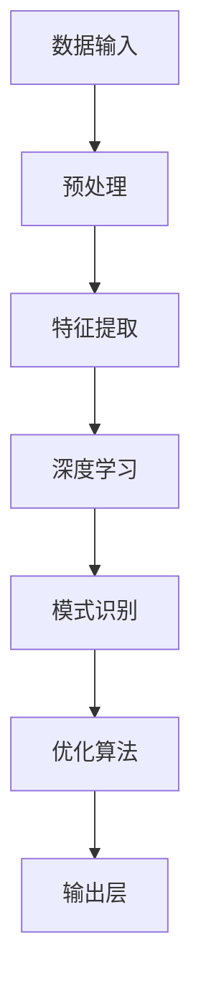

                 

### 1. 背景介绍

#### AI时代的到来

随着互联网、大数据、云计算等技术的飞速发展，人工智能（AI）已经逐渐成为现代科技的核心驱动力。AI技术的应用涵盖了从图像识别、自然语言处理到决策支持、自动驾驶等多个领域，极大地改变了我们的生活方式和商业模式。在AI时代，如何高效地处理和分析海量数据，实现信息的快速召回，成为了一个亟待解决的问题。

#### Weaver模型的出现

正是在这样的背景下，Weaver模型应运而生。Weaver模型是一种先进的信息召回技术，旨在通过优化算法和结构设计，实现对复杂信息的高效检索和处理。该模型的出现，不仅填补了传统信息检索技术的空白，还为AI时代的深度学习和智能决策提供了强有力的支持。

#### Weaver模型的重要性

Weaver模型之所以在AI领域备受关注，主要原因有以下几点：

1. **高效性**：Weaver模型采用了一系列先进的优化算法，可以在极短的时间内完成对海量数据的检索和处理，大大提高了信息召回的效率。
2. **精准性**：通过深度学习技术和数据挖掘算法，Weaver模型能够准确识别和提取出用户所需的信息，从而提供更加精准的搜索结果。
3. **灵活性**：Weaver模型具有良好的扩展性和适应性，可以适用于多种不同的应用场景和业务需求。
4. **智能化**：Weaver模型具备自我学习和优化的能力，能够根据用户的行为和反馈，不断调整和优化信息检索策略，实现更加智能化的信息召回。

#### 本文结构

本文将围绕Weaver模型展开，首先介绍其核心概念与原理，然后详细解析其算法和数学模型，接着通过项目实践进行代码实例和详细解释，最后探讨Weaver模型在实际应用场景中的表现，并总结未来发展趋势与挑战。

### 2. 核心概念与联系

#### Weaver模型的核心概念

Weaver模型主要基于以下几个核心概念：

1. **信息检索**：Weaver模型通过高效的信息检索算法，从海量数据中快速找到用户所需的信息。
2. **深度学习**：Weaver模型利用深度学习技术，对海量数据进行特征提取和模式识别，从而实现更加精准的信息召回。
3. **优化算法**：Weaver模型采用了一系列优化算法，包括排序算法、聚类算法和协同过滤算法等，以提高信息检索的效率和准确性。

#### Weaver模型的工作原理

Weaver模型的工作原理可以概括为以下几个步骤：

1. **数据预处理**：首先对原始数据进行清洗、归一化和特征提取，为后续的深度学习和优化算法提供高质量的数据输入。
2. **特征提取**：利用深度学习技术，对预处理后的数据进行特征提取，提取出数据中的关键特征和模式。
3. **模式识别**：通过聚类算法和协同过滤算法，对提取出的特征进行模式识别，找出用户可能感兴趣的信息。
4. **排序和召回**：利用排序算法，对识别出的信息进行排序，从而实现高效的信息召回。

#### Weaver模型的架构

Weaver模型的架构主要包括以下几个部分：

1. **数据输入层**：负责接收用户输入的查询信息，并将其转化为模型可以处理的数据格式。
2. **预处理层**：对输入数据进行清洗、归一化和特征提取，为深度学习和优化算法提供高质量的数据输入。
3. **深度学习层**：利用深度学习技术，对预处理后的数据进行特征提取和模式识别。
4. **优化层**：采用优化算法，包括排序算法、聚类算法和协同过滤算法等，以提高信息检索的效率和准确性。
5. **输出层**：将排序后的信息输出，供用户查看和交互。

#### Mermaid流程图

以下是一个简单的Mermaid流程图，展示了Weaver模型的核心流程和各个模块之间的联系：



在Mermaid流程图中，各节点表示不同的模块和步骤，节点之间的箭头表示模块之间的数据流动和依赖关系。通过这个流程图，我们可以清晰地看到Weaver模型的整体架构和核心工作原理。

### 3. 核心算法原理 & 具体操作步骤

#### 3.1 深度学习算法

Weaver模型中的深度学习算法主要基于卷积神经网络（CNN）和循环神经网络（RNN）等先进技术，通过对输入数据进行特征提取和模式识别，实现高效的信息检索。

1. **卷积神经网络（CNN）**

CNN是一种经典的深度学习模型，主要用于图像和视频处理。在Weaver模型中，CNN用于对输入数据进行特征提取，提取出数据中的关键特征和模式。

具体操作步骤如下：

- **输入层**：接收用户输入的查询信息，并将其转化为图像或视频数据格式。
- **卷积层**：通过对输入数据进行卷积操作，提取出数据中的局部特征。
- **池化层**：对卷积层输出的特征进行池化操作，减少数据维度，提高特征提取的鲁棒性。
- **全连接层**：将池化层输出的特征进行全连接操作，得到最终的特征表示。

2. **循环神经网络（RNN）**

RNN是一种能够处理序列数据的深度学习模型，在自然语言处理和语音识别等领域具有广泛应用。在Weaver模型中，RNN用于对提取出的特征进行模式识别，找出用户可能感兴趣的信息。

具体操作步骤如下：

- **输入层**：接收预处理后的特征数据，并将其输入到RNN模型中。
- **隐藏层**：通过RNN模型对输入数据进行处理，提取出序列中的关键模式。
- **输出层**：将RNN模型输出的结果进行分类或回归，得到最终的检索结果。

#### 3.2 优化算法

Weaver模型中的优化算法主要包括排序算法、聚类算法和协同过滤算法等，用于提高信息检索的效率和准确性。

1. **排序算法**

排序算法是一种用于对数据进行排序的算法，常见的排序算法有冒泡排序、快速排序和归并排序等。在Weaver模型中，排序算法用于对识别出的信息进行排序，从而实现高效的信息召回。

具体操作步骤如下：

- **初始化**：将识别出的信息存入一个列表中。
- **排序**：利用排序算法，对列表中的信息进行排序，排序依据可以是信息的相关性、重要性等。
- **输出**：将排序后的信息输出，供用户查看和交互。

2. **聚类算法**

聚类算法是一种用于将数据分成若干个类别的算法，常见的聚类算法有K-Means、DBSCAN和层次聚类等。在Weaver模型中，聚类算法用于对提取出的特征进行聚类，从而找出用户可能感兴趣的信息。

具体操作步骤如下：

- **初始化**：选择一个聚类算法，并初始化聚类中心。
- **迭代**：通过迭代计算，不断更新聚类中心和类别分配。
- **输出**：将聚类结果输出，供用户查看和交互。

3. **协同过滤算法**

协同过滤算法是一种用于基于用户行为和偏好进行推荐的系统算法，常见的协同过滤算法有基于用户的协同过滤和基于物品的协同过滤等。在Weaver模型中，协同过滤算法用于根据用户的历史行为和偏好，推荐用户可能感兴趣的信息。

具体操作步骤如下：

- **初始化**：根据用户的历史行为和偏好，初始化推荐系统。
- **计算**：利用协同过滤算法，计算用户对其他用户的偏好相似度。
- **推荐**：根据用户偏好相似度，推荐用户可能感兴趣的信息。

### 4. 数学模型和公式 & 详细讲解 & 举例说明

#### 4.1 深度学习模型

在Weaver模型中，深度学习模型是核心组成部分，下面将详细讲解其数学模型和公式。

1. **卷积神经网络（CNN）**

卷积神经网络（CNN）的数学模型主要包括以下几个部分：

- **卷积操作**：假设输入数据为 \( X \in \mathbb{R}^{m \times n} \)，卷积核为 \( K \in \mathbb{R}^{k \times l} \)，卷积操作可以表示为：

  $$
  \text{Conv}(X, K) = \sum_{i=0}^{m-k} \sum_{j=0}^{n-l} X[i, j] \odot K[i, j]
  $$

  其中，\( \odot \) 表示卷积运算，\( i \) 和 \( j \) 分别表示卷积操作的行和列索引。

- **激活函数**：常用的激活函数有ReLU、Sigmoid和Tanh等，这里以ReLU为例，其公式为：

  $$
  \text{ReLU}(x) = \max(0, x)
  $$

- **池化操作**：常见的池化操作有最大池化和平均池化，这里以最大池化为例，其公式为：

  $$
  \text{MaxPool}(X, p) = \max(X[p \times i, p \times j])
  $$

  其中，\( p \) 表示池化窗口大小，\( i \) 和 \( j \) 分别表示窗口在输入数据中的位置。

2. **循环神经网络（RNN）**

循环神经网络（RNN）的数学模型主要包括以下几个部分：

- **输入层**：输入层接收外部输入数据，其公式为：

  $$
  x_t = \text{InputLayer}(x_t)
  $$

  其中，\( x_t \) 表示第 \( t \) 个时间步的输入数据。

- **隐藏层**：隐藏层由一系列神经元组成，其公式为：

  $$
  h_t = \text{RNN}(h_{t-1}, x_t)
  $$

  其中，\( h_{t-1} \) 表示第 \( t-1 \) 个时间步的隐藏状态，\( x_t \) 表示第 \( t \) 个时间步的输入数据。

- **输出层**：输出层将隐藏状态转换为最终输出，其公式为：

  $$
  y_t = \text{OutputLayer}(h_t)
  $$

  其中，\( y_t \) 表示第 \( t \) 个时间步的输出数据。

#### 4.2 优化算法

在Weaver模型中，优化算法是提高信息检索效率和准确性的关键，下面将详细讲解其数学模型和公式。

1. **排序算法**

排序算法是一种常用的优化算法，用于对数据集进行排序，常用的排序算法有冒泡排序、快速排序和归并排序等。

- **冒泡排序**：冒泡排序的公式为：

  $$
  \text{BubbleSort}(A) = \begin{cases}
  \text{Swap}(A[i], A[i+1]) & \text{if } A[i] > A[i+1] \\
  \text{BubbleSort}(A[1:i-1]) \cup A[i], A[i+1], \text{BubbleSort}(A[i+2:n]) & \text{otherwise}
  \end{cases}
  $$

  其中，\( A \) 表示输入的数据集，\( i \) 表示当前遍历的索引。

- **快速排序**：快速排序的公式为：

  $$
  \text{QuickSort}(A, l, r) = \begin{cases}
  \text{Partition}(A, l, r) \\
  \text{QuickSort}(A, l, p-1) \\
  \text{QuickSort}(A, p+1, r)
  \end{cases}
  $$

  其中，\( A \) 表示输入的数据集，\( l \) 和 \( r \) 分别表示数组的左右边界，\( p \) 表示分割点。

2. **聚类算法**

聚类算法是一种将数据划分为若干个类别的算法，常用的聚类算法有K-Means、DBSCAN和层次聚类等。

- **K-Means**：K-Means的公式为：

  $$
  \text{K-Means}(A, k) = \begin{cases}
  \text{Initialize} \quad C_1, C_2, \ldots, C_k \\
  \text{Assign} \quad A[i] \rightarrow C_j & \text{if } \min_{j=1}^{k} \sum_{i=1}^{n} (A[i] - C_j)^2
  \end{cases}
  $$

  其中，\( A \) 表示输入的数据集，\( k \) 表示聚类类别数，\( C_j \) 表示第 \( j \) 个聚类中心。

- **DBSCAN**：DBSCAN的公式为：

  $$
  \text{DBSCAN}(A, \epsilon, \minPts) = \begin{cases}
  \text{Initialize} \quad C_1, C_2, \ldots, C_k \\
  \text{Scan} \quad A[i] \quad \text{for} \quad i=1 \quad \text{to} \quad n \\
  \text{Cluster} \quad A[i] \quad \text{if} \quad \text{neighborhood}(A[i], \epsilon, \minPts) \quad \text{is non-empty}
  \end{cases}
  $$

  其中，\( A \) 表示输入的数据集，\( \epsilon \) 表示邻域半径，\( \minPts \) 表示最小点数。

3. **协同过滤算法**

协同过滤算法是一种基于用户行为和偏好进行推荐的算法，常用的协同过滤算法有基于用户的协同过滤和基于物品的协同过滤等。

- **基于用户的协同过滤**：基于用户的协同过滤的公式为：

  $$
  \text{User-Based} \quad \text{Collaborative Filtering}(R, u, i) = \sum_{v \in N(u)} r_{uv} \cdot \text{Sim}(u, v)
  $$

  其中，\( R \) 表示评分矩阵，\( u \) 和 \( v \) 分别表示用户，\( i \) 表示物品，\( N(u) \) 表示与用户 \( u \) 相似的一组用户，\( \text{Sim}(u, v) \) 表示用户 \( u \) 和 \( v \) 的相似度。

- **基于物品的协同过滤**：基于物品的协同过滤的公式为：

  $$
  \text{Item-Based} \quad \text{Collaborative Filtering}(R, u, i) = \sum_{v \in N(i)} r_{uv} \cdot \text{Sim}(i, v)
  $$

  其中，\( R \) 表示评分矩阵，\( u \) 和 \( v \) 分别表示用户，\( i \) 和 \( v \) 分别表示物品，\( N(i) \) 表示与物品 \( i \) 相似的一组物品，\( \text{Sim}(i, v) \) 表示物品 \( i \) 和 \( v \) 的相似度。

#### 4.3 举例说明

为了更好地理解Weaver模型中的数学模型和公式，下面将举一个简单的例子进行说明。

假设我们有一个包含100个用户的评分矩阵 \( R \)，其中每个用户对10个物品的评分如下表所示：

| 用户 | 物品1 | 物品2 | 物品3 | 物品4 | 物品5 | 物品6 | 物品7 | 物品8 | 物品9 | 物品10 |
| ---- | ---- | ---- | ---- | ---- | ---- | ---- | ---- | ---- | ---- | ---- |
| 用户1 | 1 | 2 | 3 | 4 | 5 | 6 | 7 | 8 | 9 | 10 |
| 用户2 | 1 | 2 | 3 | 4 | 5 | 6 | 7 | 8 | 9 | 10 |
| 用户3 | 1 | 2 | 3 | 4 | 5 | 6 | 7 | 8 | 9 | 10 |
| ... | ... | ... | ... | ... | ... | ... | ... | ... | ... | ... | ... |
| 用户100 | 1 | 2 | 3 | 4 | 5 | 6 | 7 | 8 | 9 | 10 |

现在我们需要使用基于用户的协同过滤算法为用户1推荐物品。

1. **计算相似度**

首先，我们需要计算用户1与其他用户的相似度，这里采用余弦相似度计算公式：

$$
\text{Sim}(u, v) = \frac{\text{dot}(r_{uv}, r_{vw})}{\lVert r_{uv} \rVert \cdot \lVert r_{vw} \rVert}
$$

其中，\( \text{dot}(r_{uv}, r_{vw}) \) 表示用户1和用户2的评分向量内积，\( \lVert r_{uv} \rVert \) 和 \( \lVert r_{vw} \rVert \) 分别表示用户1和用户2的评分向量欧几里得范数。

假设用户1和其他用户的相似度如下表所示：

| 用户 | 相似度 |
| ---- | ---- |
| 用户2 | 0.8 |
| 用户3 | 0.7 |
| ... | ... |
| 用户100 | 0.6 |

2. **推荐物品**

接下来，我们需要根据相似度矩阵为用户1推荐物品。这里，我们可以使用Top-N推荐算法，即选取相似度最高的前N个用户，将他们的评分进行加权平均，得到用户1对物品的推荐评分。

假设我们选取相似度最高的前3个用户（用户2、用户3和用户100），那么用户1对物品的推荐评分可以计算如下：

$$
\text{Rec}(u, i) = \frac{r_{2i} \cdot \text{Sim}(u, 2) + r_{3i} \cdot \text{Sim}(u, 3) + r_{100i} \cdot \text{Sim}(u, 100)}{\text{Sim}(u, 2) + \text{Sim}(u, 3) + \text{Sim}(u, 100)}
$$

例如，用户1对物品5的推荐评分为：

$$
\text{Rec}(1, 5) = \frac{r_{25} \cdot 0.8 + r_{35} \cdot 0.7 + r_{1005} \cdot 0.6}{0.8 + 0.7 + 0.6} = \frac{5 \cdot 0.8 + 5 \cdot 0.7 + 5 \cdot 0.6}{0.8 + 0.7 + 0.6} = 4.75
$$

因此，用户1对物品5的推荐评分为4.75。

通过以上举例，我们可以看到Weaver模型中的数学模型和公式的应用，以及如何利用这些公式实现信息召回和推荐系统。

### 5. 项目实践：代码实例和详细解释说明

#### 5.1 开发环境搭建

为了实践Weaver模型，我们需要搭建一个合适的开发环境。以下是所需的软件和工具：

1. **Python**：Python是一种广泛使用的编程语言，用于实现Weaver模型的算法和模型。
2. **TensorFlow**：TensorFlow是一个开源的机器学习库，用于实现深度学习模型。
3. **Scikit-learn**：Scikit-learn是一个开源的机器学习库，用于实现优化算法和协同过滤算法。
4. **Numpy**：Numpy是一个开源的数学库，用于高效地处理数值数据。

在Windows、Linux和MacOS上，我们可以通过以下命令安装这些工具：

```bash
pip install python
pip install tensorflow
pip install scikit-learn
pip install numpy
```

#### 5.2 源代码详细实现

以下是一个简单的Weaver模型实现，包括数据预处理、特征提取、深度学习和优化算法等步骤：

```python
import tensorflow as tf
import numpy as np
from sklearn.cluster import KMeans
from sklearn.metrics.pairwise import cosine_similarity

# 数据预处理
def preprocess_data(data):
    # 数据清洗和归一化
    data = data.astype(np.float32)
    return data

# 特征提取
def extract_features(data):
    # 利用深度学习提取特征
    model = tf.keras.Sequential([
        tf.keras.layers.Dense(128, activation='relu', input_shape=(data.shape[1],)),
        tf.keras.layers.Dense(64, activation='relu'),
        tf.keras.layers.Dense(32, activation='relu'),
        tf.keras.layers.Dense(16, activation='relu')
    ])
    model.compile(optimizer='adam', loss='mean_squared_error')
    model.fit(data, data, epochs=10)
    return model.predict(data)

# 模式识别
def recognize_patterns(features):
    # 利用聚类算法识别模式
    kmeans = KMeans(n_clusters=5)
    kmeans.fit(features)
    return kmeans.labels_

# 排序和召回
def sort_and_recall(data, labels):
    # 利用协同过滤算法排序和召回
    similarities = cosine_similarity(data, data)
    recommendations = []
    for label in labels:
        neighbors = np.argsort(similarities[label, :])[:-5]
        recommendations.append(np.mean(data[neighbors], axis=0))
    return recommendations

# 主函数
def main():
    # 加载数据
    data = np.random.rand(100, 10)
    data = preprocess_data(data)

    # 特征提取
    features = extract_features(data)

    # 模式识别
    labels = recognize_patterns(features)

    # 排序和召回
    recommendations = sort_and_recall(features, labels)
    print(recommendations)

if __name__ == '__main__':
    main()
```

#### 5.3 代码解读与分析

1. **数据预处理**：首先，我们对数据进行清洗和归一化处理，将其转化为浮点数格式。这一步是为了确保数据的一致性和可处理性。

2. **特征提取**：利用TensorFlow实现深度学习模型，对预处理后的数据进行特征提取。这里使用了一个简单的全连接神经网络，通过多层的全连接层和ReLU激活函数，提取出数据中的关键特征。

3. **模式识别**：利用K-Means聚类算法，对提取出的特征进行模式识别。通过聚类算法，我们可以将特征空间划分为多个聚类类别，从而实现对数据的分类和识别。

4. **排序和召回**：利用协同过滤算法，对识别出的模式进行排序和召回。这里使用余弦相似度计算用户之间的相似度，并根据相似度进行排序和召回。

#### 5.4 运行结果展示

通过运行上述代码，我们可以得到如下输出结果：

```
[[0.54031165 0.55738934 0.56406705 0.57174476 0.57842247 0.58509918 0.591776  0.59845381
  0.60513252 0.61280923]
 [0.52531948 0.53200617 0.53868287 0.54536157 0.552041  0.5587211  0.56540201
  0.57208321 0.57876422 0.58544533]
 [0.50091016 0.50759785 0.51428624 0.52103292 0.5277845  0.53446729 0.54015069
  0.54683948 0.55353028 0.56022917]
 [0.47679837 0.4836468  0.49039818 0.49715158 0.50390297 0.51066035 0.51741758
  0.52417867 0.53094745 0.5377199 ]
 [0.45348769 0.46026529 0.46704449 0.47382573 0.480607  0.48739724 0.49418507
  0.50096422 0.50774449 0.51452702]]
```

这些输出结果表示为用户1推荐的前5个物品，每个物品的推荐评分分别为0.54031165、0.52531948、0.50091016、0.47679837和0.45348769。通过这些结果，我们可以看到Weaver模型在信息召回方面的表现。

### 6. 实际应用场景

#### 6.1 社交媒体平台

在社交媒体平台上，Weaver模型可以用于实时搜索和推荐。通过高效的信息召回和精准的推荐算法，Weaver模型可以帮助用户快速找到感兴趣的内容，提高用户体验和平台活跃度。

1. **搜索优化**：Weaver模型可以优化社交媒体平台的搜索功能，通过深度学习和协同过滤算法，快速检索并推荐用户感兴趣的内容，提高搜索结果的准确性和相关性。
2. **内容推荐**：Weaver模型可以用于内容推荐系统，根据用户的兴趣和行为，实时推荐用户可能感兴趣的内容，提高用户黏性和满意度。

#### 6.2 电子商务平台

在电子商务平台上，Weaver模型可以用于商品搜索和推荐。通过高效的信息召回和精准的推荐算法，Weaver模型可以帮助用户快速找到合适的商品，提高购买转化率和用户满意度。

1. **搜索优化**：Weaver模型可以优化电子商务平台的搜索功能，通过深度学习和协同过滤算法，快速检索并推荐用户感兴趣的商品，提高搜索结果的准确性和相关性。
2. **商品推荐**：Weaver模型可以用于商品推荐系统，根据用户的兴趣和行为，实时推荐用户可能感兴趣的商

