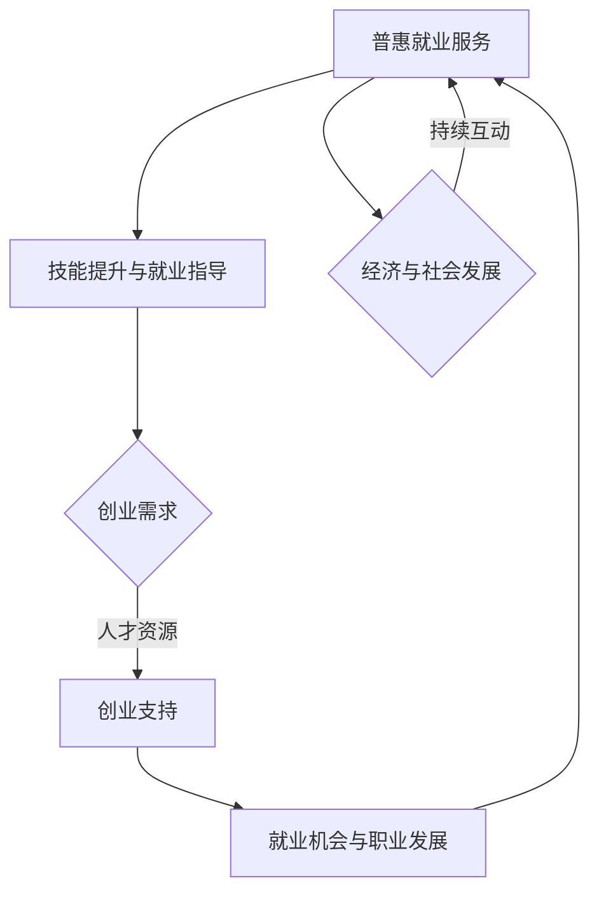

                 

### 背景介绍

在人工智能（AI）技术的迅猛发展下，全球劳动力市场正在经历深刻变革。AI不仅正在改变传统行业的工作方式，还不断创造新的就业机会。然而，这种变革同时也带来了许多挑战，特别是在就业政策和公共服务领域。为了应对AI时代下的就业问题，需要创新的就业政策，特别是普惠就业服务和创业支持，以确保每个人都有机会参与到AI时代的发展中来。

本文旨在探讨AI时代就业政策创新的重要性，并重点分析普惠就业服务和创业支持的具体内容和实施方法。通过逐步分析推理，我们将探讨如何通过这些措施来缓解AI带来的就业压力，促进社会公平和经济可持续发展。

### AI时代就业政策的挑战

AI时代的就业政策面临多重挑战。首先，技术的进步导致某些工作岗位的消失，特别是那些重复性、低技能的工作。例如，自动化和机器人技术的应用正在减少制造业和物流业中的人力需求。同时，AI也在金融、医疗、法律等多个领域实现突破，这些领域的岗位需求也发生了变化。

其次，AI技术虽然创造了新的就业机会，但这些机会主要集中在高技能领域，如数据科学家、机器学习工程师等。这导致了一个明显的“技能不匹配”问题，即现有劳动力中缺乏足够的技能来胜任这些新兴岗位。此外，AI技术的发展速度远远超过了传统教育和职业培训的更新速度，这使得许多人感到被时代所抛弃。

再次，AI时代的就业机会往往集中在特定地区或行业，造成了区域和行业之间的就业不平衡。例如，科技中心地区（如硅谷、北京）吸引了大量AI人才，而其他地区则面临着人才流失和经济衰退的风险。此外，不同行业之间的就业机会也存在显著差异，这进一步加剧了就业的不稳定性。

最后，就业不稳定问题在AI时代尤为突出。自动化和智能化的普及使得工作岗位的变更频率增加，许多人可能会在短时间内经历多次失业和再就业。这种不稳定不仅影响了个人的经济状况，也对社会福利体系和就业保障带来了新的挑战。

### 普惠就业服务的概念与目标

普惠就业服务（Universal Employment Services，简称UES）是一种旨在确保所有劳动者都能获得高质量就业机会和职业发展的政策。这一概念的核心在于消除就业壁垒，提供全面、公平、可及的职业服务，以适应快速变化的劳动力市场。

普惠就业服务的目标主要包括以下几点：

1. **提高就业率和就业质量**：通过提供职业培训、就业指导、职业转换服务等措施，帮助劳动者提升技能，找到更适合自己的工作，从而提高就业率和就业质量。

2. **缩小技能差距**：通过教育和职业培训，缩小传统教育和职业培训与新兴技能需求之间的差距，使劳动者能够适应AI时代的工作要求。

3. **促进就业平衡**：通过地区和行业之间的政策倾斜，促进就业机会的公平分配，减少区域和行业间的就业不平衡现象。

4. **增强就业稳定性**：通过提供职业转换和社会保障支持，减少劳动者因技术变革而失业的风险，增强就业稳定性。

5. **提升社会福利**：通过提供全面的就业服务，改善劳动者的生活条件，减少社会不平等，提升整体社会福利水平。

### 创业支持的重要性

在AI时代，创业支持变得尤为重要。AI技术的普及和应用不仅改变了传统产业，也为新兴产业的快速发展提供了机会。因此，政府和社会各界需要加大对创业者的支持，以激发创新活力，推动经济持续增长。

创业支持的主要目标包括：

1. **鼓励创新和创业**：通过提供资金、技术、市场等支持，鼓励更多人投身于创新和创业活动，从而推动新技术和新产业的发展。

2. **促进就业机会**：创业活动可以创造大量就业机会，缓解就业压力，特别是对于高技能人才和传统行业受影响的劳动者。

3. **提升经济竞争力**：创新和创业是提升国家或地区经济竞争力的关键。通过支持创业，可以培养一批具有国际竞争力的企业和企业家，推动经济的持续增长。

4. **实现社会价值**：创业活动不仅可以创造经济价值，还可以带来社会价值。例如，环保技术的创新可以改善环境质量，医疗技术的进步可以提升公共健康水平。

### 普惠就业服务的具体措施

为了实现普惠就业服务（UES）的目标，需要采取一系列具体的措施。以下是一些关键措施：

1. **职业培训和技能提升**：政府和企业应共同提供职业培训课程，特别是针对新兴技能的培训，如数据科学、机器学习、人工智能应用等。这些培训应面向所有劳动力，无论其教育背景如何，都应有机会提升自身技能。

2. **就业指导和职业规划**：通过提供专业的就业指导服务，帮助劳动者了解市场需求，制定合适的职业规划。这包括职业咨询、就业市场信息提供、求职技巧培训等。

3. **职业转换支持**：对于因技术变革而失业的劳动者，提供职业转换服务，帮助他们重新找到适合自己的工作。这可以包括职业再培训、就业安置服务、创业支持等。

4. **社会保障和福利**：建立完善的社会保障体系，为失业和转业的劳动者提供必要的经济支持和社会福利。例如，提供失业救济金、医疗保险、职业福利等。

5. **创业支持政策**：鼓励和支持创业者，提供创业资金、技术支持、市场推广等。这包括提供创业孵化器、创业培训、政策优惠等。

6. **跨部门合作**：政府、企业、教育机构、社会组织等各方应加强合作，共同推动普惠就业服务的发展。通过整合各方资源，形成合力，提高就业服务的效率和质量。

7. **数字化平台建设**：利用现代信息技术，建立数字化就业服务平台，提供在线职业培训、就业指导、招聘信息等服务，使劳动者能够更加便捷地获取就业机会和职业发展支持。

### 创业支持的具体措施

创业支持在AI时代显得尤为重要。以下是一些关键措施：

1. **资金支持**：政府可以设立创业基金，为有潜力的创业者提供启动资金。此外，还可以提供贷款担保、税收减免等优惠政策，降低创业者的资金压力。

2. **技术支持**：提供技术培训和技术咨询服务，帮助创业者掌握新兴技术，提升创新能力和市场竞争力。例如，可以设立技术孵化器，为创业者提供研发平台、实验设备等。

3. **市场推广**：协助创业者开拓市场，提供市场调研、品牌推广等服务，帮助他们更好地了解市场需求，制定有效的营销策略。

4. **政策扶持**：制定和实施有利于创业的法律法规，如简化创业审批流程、提供政策优惠等，降低创业门槛。

5. **创业培训**：提供创业培训课程，包括创业理论、市场分析、财务规划、风险管理等，帮助创业者提升经营管理能力。

6. **创业孵化**：建立创业孵化器，为创业者提供办公场所、共享设施、法律咨询等支持，营造良好的创业环境。

7. **资源共享**：鼓励企业、高校、研究机构等各方共享资源，为创业者提供更多的研发、市场、人才等支持。

### 普惠就业服务与创业支持之间的联系

普惠就业服务和创业支持之间存在着密切的联系和互动。一方面，普惠就业服务为劳动者提供了多样化的职业选择和技能提升机会，使他们能够更好地适应AI时代的就业需求。这为创业者提供了丰富的人才资源，有利于新兴产业的快速发展。

另一方面，创业支持政策鼓励更多人投身于创新和创业活动，创造了大量的就业机会。这些创业活动不仅带动了经济的增长，也为劳动者提供了更多的就业选择和职业发展机会。因此，普惠就业服务和创业支持相互促进，共同推动社会和经济的发展。

通过以下Mermaid流程图，我们可以更清晰地看到普惠就业服务与创业支持之间的逻辑关系和互动机制：

### 普惠就业服务与创业支持的实际案例

为了更好地理解普惠就业服务和创业支持在AI时代的实际应用，我们可以通过一些实际案例来探讨这些措施的有效性和影响。

#### 案例一：中国的“互联网+”行动计划

中国的“互联网+”行动计划是一个典型的普惠就业服务与创业支持相结合的案例。该计划通过推动传统产业与互联网技术的深度融合，创造了大量新兴就业机会，并提供了丰富的创业支持。

- **普惠就业服务**：通过政府引导和企业参与，提供一系列职业技能培训，包括电子商务、数字营销、物联网技术等，帮助劳动者提升技能，适应新兴产业的需求。
- **创业支持**：政府设立了专项基金，提供创业补贴和贷款支持，帮助创业者开展互联网创业项目。同时，还提供技术支持、市场推广等服务，助力创业项目的发展。

该计划实施以来，已经带动了数百万人就业，尤其是年轻人和农村劳动力。许多创业者通过这个计划实现了创业梦想，推动了当地经济的发展。

#### 案例二：硅谷的创业生态系统

硅谷作为全球创新和创业的中心，通过一系列普惠就业服务和创业支持措施，形成了独特的创业生态系统。

- **普惠就业服务**：硅谷的政府和企业合作，提供职业培训和就业指导服务，帮助劳动者适应高技能岗位的需求。此外，还设立了职业转换项目，为受技术变革影响的劳动者提供再培训和支持。
- **创业支持**：硅谷提供了丰富的创业支持，包括风险投资、创业孵化器、技术共享平台等。许多知名的科技公司，如谷歌、苹果、特斯拉，都是从硅谷的创业项目中崛起的。

这种创业生态系统的建立，不仅为硅谷带来了巨大的经济利益，还吸引了全球的优秀人才，促进了科技创新和产业升级。

#### 案例三：印度的数字技能培训计划

印度政府推出的数字技能培训计划，是普惠就业服务的另一个成功案例。

- **普惠就业服务**：政府投资数十亿美元，提供大规模的数字技能培训，覆盖从基础计算机技能到高级编程技能。这些培训课程面向所有劳动力，无论其教育背景如何。
- **创业支持**：政府还通过提供创业资金、技术支持、市场推广等服务，鼓励劳动者和大学生创业。许多学员通过这个计划成功创业，创造了大量的就业机会。

这个计划已经帮助数百万印度人提升了技能，改善了就业状况，为印度的经济发展做出了重要贡献。

### 普惠就业服务与创业支持的未来发展趋势

随着AI技术的不断发展和普及，普惠就业服务和创业支持在未来将面临新的机遇和挑战。以下是一些可能的发展趋势：

1. **数字化就业服务**：随着互联网和大数据技术的普及，数字化就业服务将越来越重要。政府和企业可以利用大数据分析，提供更精准的就业指导和创业支持。

2. **个性化职业培训**：基于人工智能和机器学习技术的个性化职业培训将逐渐普及。这种培训可以更准确地满足劳动者的个性化需求，提高培训效果。

3. **终身学习体系**：随着就业市场的快速变化，终身学习将成为劳动者适应新技术和新产业的重要手段。政府和企业需要共同努力，建立和完善终身学习体系。

4. **创业生态系统的优化**：创业支持将更加注重生态系统的建设，通过整合各方资源，提供全面的创业支持服务，降低创业门槛，提高创业成功率。

5. **区域和行业发展的平衡**：为了缓解区域和行业之间的就业不平衡，政府需要采取更有针对性的政策措施，鼓励人才流动和产业转移，促进区域和行业的协调发展。

### 普惠就业服务与创业支持面临的主要挑战

尽管普惠就业服务和创业支持在AI时代具有重要意义，但它们也面临着一系列挑战，需要政府、企业和社会各方共同努力来解决。

1. **技能培训的滞后**：由于AI技术的快速发展，传统教育和职业培训往往跟不上市场需求的变化。这导致许多劳动者缺乏适应新岗位所需的技能，从而影响了普惠就业服务的有效性。

2. **资源配置的不均衡**：不同地区和行业之间的资源配置存在明显的不平衡，导致一些地区和行业难以获得足够的就业支持。这需要政府加强政策引导和资源调配，确保普惠就业服务和创业支持能够覆盖到所有需要的人群。

3. **就业稳定性的问题**：AI技术的广泛应用导致就业稳定性降低，许多劳动者可能面临频繁的失业和再就业。这需要政府和社会提供更完善的社会保障体系，减轻劳动者的经济压力。

4. **创业风险的提高**：在AI时代，创业项目的成功率和风险并存。创业者需要具备更高的技术和管理能力，但这也增加了创业的风险。政府需要提供更全面的创业支持和风险管理服务，帮助创业者降低创业风险。

5. **政策执行的有效性**：普惠就业服务和创业支持政策的实施效果取决于政策的设计和执行。政策设计需要科学合理，能够真正满足劳动者的需求；政策执行需要严格监督，确保政策落地生根。

### 普惠就业服务和创业支持的评价指标与成功标准

为了评估普惠就业服务和创业支持的效果，需要建立一套科学、全面的评价指标和成功标准。以下是一些关键的评价指标和成功标准：

1. **就业率和就业质量**：这是衡量普惠就业服务最直接的指标。就业率反映了政策对劳动力市场的覆盖程度，而就业质量则反映了劳动者的工作满意度和薪资水平。

2. **技能提升与就业匹配度**：通过比较劳动者接受培训后的就业情况，评估培训的有效性和针对性。技能提升与就业匹配度越高，说明普惠就业服务越有效。

3. **创业成功率与就业机会**：评估创业支持政策对创业者的支持效果，包括创业项目的成功率、创造就业岗位的数量等。

4. **社会影响力**：评估普惠就业服务和创业支持政策对社会经济的影响，包括促进创新、提升竞争力、改善社会福利等方面。

5. **政策满意度**：通过调查劳动者、创业者和政策执行者的满意度，了解政策设计的合理性和执行的效率。

成功标准包括：政策目标实现程度、社会和经济效益、政策的可持续性和可复制性等。通过这些评价指标和成功标准，可以全面评估普惠就业服务和创业支持政策的有效性，为进一步优化政策提供依据。

### 总结与展望

综上所述，普惠就业服务和创业支持在AI时代的就业政策中扮演着至关重要的角色。通过逐步分析推理，我们探讨了AI时代就业政策的挑战，以及普惠就业服务和创业支持的具体措施和相互联系。实际案例表明，这些措施在提升就业率和就业质量、促进经济和社会发展方面取得了显著成效。然而，面对技能培训滞后、资源配置不均衡、就业稳定性问题等挑战，我们仍需不断优化政策和措施。

展望未来，随着AI技术的进一步发展，普惠就业服务和创业支持需要更加注重数字化、个性化和终身学习。政府、企业和社会各方应加强合作，共同构建一个包容、公平和可持续的就业体系，以应对AI时代的挑战，实现经济和社会的全面发展。

### 附录：常见问题与解答

1. **普惠就业服务和创业支持的区别是什么？**

普惠就业服务主要关注提高劳动者的就业率和就业质量，通过职业培训、就业指导、职业转换支持等措施，帮助劳动者适应新技术和新产业的需求。而创业支持则更侧重于鼓励创新和创业活动，通过资金支持、技术支持、市场推广等手段，帮助创业者实现创业梦想，创造就业机会。

2. **普惠就业服务和创业支持如何相互补充？**

普惠就业服务为劳动者提供技能提升和职业发展的机会，为创业支持提供了丰富的人才资源。而创业支持则通过创造就业机会，为普惠就业服务提供了实际的应用场景。两者相互补充，共同推动经济和社会的发展。

3. **普惠就业服务和创业支持的有效性如何评估？**

评估普惠就业服务和创业支持的有效性可以从多个维度进行，包括就业率和就业质量、技能提升与就业匹配度、创业成功率与就业机会、社会影响力以及政策满意度等。通过这些评价指标，可以全面评估政策的效果，为进一步优化提供依据。

4. **普惠就业服务和创业支持如何应对AI时代的挑战？**

普惠就业服务和创业支持可以通过以下措施应对AI时代的挑战：加强技能培训，提高劳动者的适应能力；优化资源配置，确保政策覆盖所有需要的人群；建立终身学习体系，适应快速变化的就业市场；提供全面的创业支持，鼓励创新和创业活动。

### 扩展阅读与参考资料

为了深入了解普惠就业服务和创业支持在AI时代的应用和实践，以下是几本推荐阅读的书籍和相关论文：

1. **《就业政策与公共服务：中国实践与改革》（作者：王宏斌）**  
这本书详细分析了中国的就业政策体系和普惠就业服务的实践，提供了丰富的案例和数据分析。

2. **《创业与创业管理》（作者：蒂姆·克拉克、克里斯·巴德）**  
该书涵盖了创业的基本理论和实践，特别是创业支持政策和创业管理实践，对于理解创业支持具有重要意义。

3. **《人工智能时代的人力资源管理》（作者：郭庆旺、刘金亮）**  
这本书探讨了人工智能对人力资源管理的影响，包括就业政策、职业发展、人才管理等，对于理解和应用普惠就业服务和创业支持有很好的参考价值。

4. **相关论文**  
- "The Future of Employment: How Susceptible Are Jobs to Computerisation?" by Frey and Osborne  
- "Universal Basic Income and the Future of Work" by Erik Olin Wright  
- "The Impact of Automation on Employment: A Meta-Analytic Review" by Herath, Thakur, and Wang

5. **网站与资源**  
- 世界银行（World Bank）关于就业和技能发展的研究报告  
- 国际劳工组织（ILO）关于就业政策和创业支持的政策文件  
- 各国政府和国际组织发布的关于AI时代就业政策的白皮书和报告

通过这些书籍、论文和资源，可以更深入地了解普惠就业服务和创业支持的理论基础和实践应用，为政策的制定和实施提供参考。作者：禅与计算机程序设计艺术 / Zen and the Art of Computer Programming。

