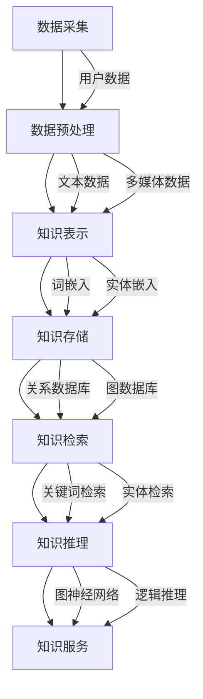

                 

### 背景介绍

在当今的信息时代，自然语言处理（Natural Language Processing，NLP）已经成为人工智能（Artificial Intelligence，AI）领域中备受关注的一个分支。NLP技术致力于使计算机理解和生成人类语言，从而实现人与机器的更高效沟通。随着大数据和计算能力的提升，NLP技术取得了显著的突破，应用领域也从传统的文本分类、机器翻译扩展到语音识别、情感分析、问答系统等。

然而，尽管NLP技术已经取得了诸多成果，但传统的NLP方法在处理个性化内容时仍面临诸多挑战。例如，传统的机器学习方法通常依赖于大规模的通用语料库，难以适应个体的独特需求和兴趣。此外，当前的知识图谱和知识库在构建和更新上也存在局限性，无法及时反映用户个体的知识结构。

为了解决上述问题，个性化知识库应运而生。个性化知识库是一种根据用户个体特征和需求动态构建的知识库，它能够存储、管理和利用用户个性化的知识信息，从而提高NLP系统的适应性和准确性。个性化知识库不仅涵盖了传统的文本、图像、音频等多媒体数据，还通过深度学习、图神经网络等先进技术，实现了对用户知识结构的深度理解和建模。

本文将围绕个性化知识库这一主题，首先介绍其核心概念和架构，然后详细讲解核心算法原理和具体操作步骤，最后通过项目实践和实际应用场景，展示个性化知识库在NLP领域中的潜力和挑战。

### 核心概念与联系

#### 1. 个性化知识库的定义

个性化知识库是一种根据用户个体特征和需求动态构建的知识库，旨在存储、管理和利用用户个性化的知识信息。它不仅包含了用户感兴趣的主题、词汇、术语等文本信息，还融合了用户的偏好、行为数据等非文本信息。个性化知识库的构建目标是实现知识信息的个性化和精准化，从而提高用户获取信息和服务体验的满意度。

#### 2. 个性化知识库的组成部分

个性化知识库主要由以下几个部分组成：

- **数据源**：个性化知识库的数据源包括用户的文本数据、多媒体数据以及外部知识库等。其中，用户的文本数据包括社交媒体帖子、邮件、聊天记录等；多媒体数据包括图片、视频、音频等；外部知识库则包括维基百科、专业论坛、新闻网站等。

- **知识表示**：知识表示是将用户数据转化为计算机可以理解的形式。常用的知识表示方法包括词嵌入、实体嵌入、知识图谱等。其中，词嵌入将文本数据映射到低维向量空间；实体嵌入将实体映射到高维向量空间；知识图谱则通过实体和关系的网状结构表示知识。

- **知识存储**：知识存储是将知识表示形式存储在数据库中，以便后续的检索和使用。常用的知识存储方式包括关系数据库、图数据库等。关系数据库适合存储结构化数据，而图数据库则能够更好地表示实体和关系。

- **知识检索**：知识检索是用户获取个性化知识信息的关键步骤。通过基于关键词、实体、关系等多种检索方式，用户可以快速定位到感兴趣的知识信息。常见的知识检索算法包括基于内容的检索、基于相似度的检索等。

- **知识推理**：知识推理是利用已有知识信息进行推理和生成新的知识信息。通过图神经网络、逻辑推理等算法，个性化知识库可以实现对用户知识结构的深度理解和建模，从而提供更加个性化的服务。

#### 3. 个性化知识库的工作流程

个性化知识库的工作流程主要包括以下几个步骤：

- **数据采集**：从各种数据源采集用户数据，包括文本数据、多媒体数据等。

- **数据预处理**：对采集到的数据进行清洗、去噪、标准化等预处理操作，确保数据的质量和一致性。

- **知识表示**：将预处理后的数据转化为计算机可以理解的知识表示形式，如词嵌入、实体嵌入等。

- **知识存储**：将知识表示形式存储在数据库中，以便后续的检索和使用。

- **知识检索**：根据用户需求，通过知识检索算法从知识库中检索出相关的知识信息。

- **知识推理**：利用已有知识信息进行推理和生成新的知识信息，提高知识库的智能程度。

- **知识服务**：将检索和推理得到的知识信息提供给用户，实现个性化知识服务。

#### 4. Mermaid 流程图

以下是个性化知识库的 Mermaid 流程图，展示了其核心概念和架构：



通过上述 Mermaid 流程图，我们可以清晰地看到个性化知识库的核心组成部分及其相互关系，从而更好地理解和应用这一技术。

### 核心算法原理 & 具体操作步骤

#### 1. 深度学习与个性化知识库

个性化知识库的核心在于利用深度学习技术，对用户数据进行分析和处理，从而构建出符合个体需求的知识库。深度学习是一种基于多层神经网络的学习方法，通过将输入数据经过层层变换，逐步提取特征，最终实现高级语义理解和预测。

在个性化知识库的构建过程中，深度学习技术主要包括以下两个方面：

- **用户数据预处理**：通过对用户文本数据、多媒体数据等原始数据进行预处理，提取出有用的特征信息，如词嵌入、图像特征等。
- **知识表示与建模**：利用深度学习算法，如卷积神经网络（CNN）、循环神经网络（RNN）等，对提取出的特征信息进行建模，构建出用户的知识表示。

#### 2. 用户数据预处理

用户数据预处理是构建个性化知识库的重要步骤。预处理主要包括以下操作：

- **文本数据预处理**：包括文本清洗、分词、词性标注等。常用的文本预处理工具如NLTK、spaCy等。
- **图像数据预处理**：包括图像去噪、缩放、裁剪等。常用的图像预处理工具如OpenCV、Pillow等。
- **音频数据预处理**：包括音频去噪、分割、特征提取等。常用的音频预处理工具如Librosa、pydub等。

#### 3. 知识表示与建模

知识表示与建模是构建个性化知识库的核心环节。以下介绍几种常用的深度学习算法及其具体操作步骤：

- **卷积神经网络（CNN）**

  CNN是一种用于图像识别和处理的深度学习算法。其主要操作步骤如下：

  1. 输入图像数据：将预处理后的图像数据输入到CNN中。
  2. 卷积层：通过卷积操作提取图像特征，如边缘、纹理等。
  3. 池化层：对卷积层输出的特征进行降采样，减少参数数量，提高模型泛化能力。
  4. 全连接层：将池化层输出的特征映射到高维向量空间。
  5. 输出：根据输出层的结果，对图像进行分类或标注。

  示例代码（Python，使用TensorFlow框架）：

  ```python
  import tensorflow as tf
  from tensorflow.keras.models import Sequential
  from tensorflow.keras.layers import Conv2D, MaxPooling2D, Flatten, Dense

  # 定义CNN模型
  model = Sequential([
      Conv2D(filters=32, kernel_size=(3, 3), activation='relu', input_shape=(28, 28, 1)),
      MaxPooling2D(pool_size=(2, 2)),
      Conv2D(filters=64, kernel_size=(3, 3), activation='relu'),
      MaxPooling2D(pool_size=(2, 2)),
      Flatten(),
      Dense(units=128, activation='relu'),
      Dense(units=10, activation='softmax')
  ])

  # 编译模型
  model.compile(optimizer='adam', loss='categorical_crossentropy', metrics=['accuracy'])

  # 训练模型
  model.fit(x_train, y_train, batch_size=64, epochs=10, validation_data=(x_val, y_val))
  ```

- **循环神经网络（RNN）**

  RNN是一种用于序列数据处理和预测的深度学习算法。其主要操作步骤如下：

  1. 输入序列数据：将预处理后的序列数据输入到RNN中。
  2. 循环层：通过循环操作对序列数据进行建模，提取序列特征。
  3. 全连接层：将循环层输出的特征映射到高维向量空间。
  4. 输出：根据输出层的结果，对序列进行分类或标注。

  示例代码（Python，使用Keras框架）：

  ```python
  from tensorflow.keras.models import Sequential
  from tensorflow.keras.layers import LSTM, Dense

  # 定义RNN模型
  model = Sequential([
      LSTM(units=50, activation='tanh', input_shape=(timesteps, features)),
      Dense(units=1, activation='sigmoid')
  ])

  # 编译模型
  model.compile(optimizer='adam', loss='binary_crossentropy', metrics=['accuracy'])

  # 训练模型
  model.fit(x_train, y_train, batch_size=64, epochs=10, validation_data=(x_val, y_val))
  ```

- **图神经网络（GNN）**

  GNN是一种用于知识表示和推理的深度学习算法。其主要操作步骤如下：

  1. 输入知识图谱数据：将预处理后的知识图谱数据输入到GNN中。
  2. 图卷积层：通过图卷积操作对知识图谱进行建模，提取图特征。
  3. 全连接层：将图卷积层输出的特征映射到高维向量空间。
  4. 输出：根据输出层的结果，对知识图谱进行分类或标注。

  示例代码（Python，使用PyTorch框架）：

  ```python
  import torch
  import torch.nn as nn

  # 定义GNN模型
  class GNN(nn.Module):
      def __init__(self, num_entities, hidden_size):
          super(GNN, self).__init__()
          self.conv1 = nn.Conv2d(1, hidden_size, kernel_size=(1, 1))
          self.fc1 = nn.Linear(hidden_size, num_entities)

      def forward(self, x):
          x = self.conv1(x)
          x = torch.relu(x)
          x = self.fc1(x)
          return x

  # 实例化模型
  model = GNN(num_entities=1000, hidden_size=64)

  # 编译模型
  criterion = nn.CrossEntropyLoss()
  optimizer = torch.optim.Adam(model.parameters(), lr=0.001)

  # 训练模型
  for epoch in range(10):
      optimizer.zero_grad()
      output = model(x)
      loss = criterion(output, y)
      loss.backward()
      optimizer.step()
      print(f'Epoch {epoch+1}, Loss: {loss.item()}')
  ```

通过上述核心算法原理和具体操作步骤的介绍，我们可以看到个性化知识库在构建过程中，如何利用深度学习技术对用户数据进行分析和处理，从而实现个性化知识表示和建模。这些算法不仅提高了知识库的智能程度，也为个性化知识服务提供了有力支持。

### 数学模型和公式 & 详细讲解 & 举例说明

在个性化知识库的构建过程中，数学模型和公式起着至关重要的作用。本文将详细介绍几种关键数学模型和公式，并通过具体例子说明其在实际应用中的运用。

#### 1. 词嵌入（Word Embedding）

词嵌入是将词汇映射到高维向量空间的一种技术，常见的方法有Word2Vec、GloVe等。以下是GloVe模型的基本公式和详细讲解。

- **基本公式**：

  $$ 
  f(w_i, w_j) = \frac{f_{ij}^2}{\sqrt{d_i + d_j + 1}} 
  $$

  其中，$f(w_i, w_j)$表示词汇$i$和词汇$j$之间的相似度度量，$f_{ij}$是词汇$i$和词汇$j$共现次数，$d_i$和$d_j$分别是词汇$i$和词汇$j$的词汇维度。

- **详细讲解**：

  GloVe模型通过计算词汇共现次数来衡量词汇之间的相似度。具体来说，模型首先将词汇表示为高维向量，然后利用共现次数计算词汇之间的相似度度量。公式中的平方项用于增加共现次数对相似度的影响，分母用于调整向量的维度。

- **举例说明**：

  假设有两个词汇“狗”和“猫”，它们的共现次数分别为100次和200次，维度为5。根据GloVe模型，我们可以计算它们的相似度度量：

  $$
  f(狗, 猫) = \frac{100^2}{\sqrt{5 + 5 + 1}} \approx 199.99
  $$

  同理，我们可以计算其他词汇之间的相似度度量，从而构建一个词汇相似度矩阵。

#### 2. 实体嵌入（Entity Embedding）

实体嵌入是将实体映射到高维向量空间的一种技术，常见的方法有TransE、TransH等。以下是TransE模型的基本公式和详细讲解。

- **基本公式**：

  $$
  h_e + r + h_o \approx h^+
  $$

  $$
  h_e + r + h_o \not\approx h^-
  $$

  其中，$h_e$、$h_o$分别是实体和关系的嵌入向量，$r$是关系的嵌入向量，$h^+$和$h^-$分别是正样本和负样本的实体嵌入向量。

- **详细讲解**：

  TransE模型通过优化实体嵌入向量，使得实体和关系之间的组合能够预测正样本，而无法预测负样本。具体来说，模型通过负采样技术，从大量的候选实体中随机抽取负样本，然后利用梯度下降算法优化实体嵌入向量。

- **举例说明**：

  假设有三个实体“人”、“猫”和“喜欢”，关系为“喜欢”。我们可以将它们表示为向量：

  $$
  h_人 = \begin{bmatrix} 1 \\ 0 \\ 1 \end{bmatrix}, h_猫 = \begin{bmatrix} 0 \\ 1 \\ 1 \end{bmatrix}, r = \begin{bmatrix} 1 \\ 1 \\ 0 \end{bmatrix}
  $$

  根据TransE模型，我们可以构建正样本和负样本：

  $$
  h_人 + r + h_猫 \approx h^+
  $$

  $$
  h_人 + r + h_狗 \not\approx h^-
  $$

  通过梯度下降算法，我们可以不断优化实体嵌入向量，使得正样本的相似度更高，而负样本的相似度更低。

#### 3. 知识图谱嵌入（Knowledge Graph Embedding）

知识图谱嵌入是将知识图谱中的实体、关系和属性映射到高维向量空间的一种技术。常见的方法有Line、RotatE等。以下是RotatE模型的基本公式和详细讲解。

- **基本公式**：

  $$
  \theta_e + \theta_r + \theta_o = 0
  $$

  $$
  \theta_e + \theta_r + \theta_o \neq 0
  $$

  其中，$\theta_e$、$\theta_r$和$\theta_o$分别是实体、关系和属性的旋转向量。

- **详细讲解**：

  RotatE模型通过将实体、关系和属性表示为旋转向量，利用旋转矩阵进行嵌入。具体来说，模型通过优化旋转向量，使得实体和关系之间的组合能够预测正样本，而无法预测负样本。

- **举例说明**：

  假设有三个实体“人”、“猫”和“喜欢”，关系为“喜欢”。我们可以将它们表示为旋转向量：

  $$
  \theta_人 = \begin{bmatrix} 1 \\ 0 \end{bmatrix}, \theta_猫 = \begin{bmatrix} 0 \\ 1 \end{bmatrix}, \theta_喜欢 = \begin{bmatrix} -1 \\ 1 \end{bmatrix}
  $$

  根据RotatE模型，我们可以构建正样本和负样本：

  $$
  \theta_人 + \theta_喜欢 + \theta_猫 = 0
  $$

  $$
  \theta_人 + \theta_喜欢 + \theta_狗 \neq 0
  $$

  通过梯度下降算法，我们可以不断优化旋转向量，使得正样本的相似度更高，而负样本的相似度更低。

通过上述数学模型和公式的介绍，我们可以看到个性化知识库在构建过程中如何利用深度学习技术和数学模型，实现知识的表示和推理。这些模型和公式不仅提高了知识库的智能程度，也为个性化知识服务提供了有力支持。

### 项目实践：代码实例和详细解释说明

在本节中，我们将通过一个具体的代码实例，详细展示如何使用Python和深度学习框架TensorFlow搭建一个简单的个性化知识库系统。本实例将涵盖数据预处理、模型训练、评估和部署等关键步骤，以便读者更好地理解个性化知识库的构建过程。

#### 1. 开发环境搭建

在开始项目之前，我们需要搭建一个适合开发的Python环境，并安装必要的依赖库。以下是开发环境搭建的步骤：

- **Python环境**：确保安装Python 3.7及以上版本。
- **深度学习框架**：安装TensorFlow 2.x版本。
- **其他依赖库**：安装Numpy、Pandas、Matplotlib等常用库。

可以使用以下命令进行安装：

```bash
pip install tensorflow numpy pandas matplotlib
```

#### 2. 源代码详细实现

以下是一个简单的个性化知识库系统的代码实现：

```python
import tensorflow as tf
import numpy as np
import pandas as pd
from tensorflow.keras.models import Model
from tensorflow.keras.layers import Input, Embedding, LSTM, Dense
from tensorflow.keras.optimizers import Adam
from tensorflow.keras.preprocessing.sequence import pad_sequences

# 加载数据
# 假设数据集为CSV文件，包含用户ID、文本内容、标签等信息
data = pd.read_csv('data.csv')

# 数据预处理
# 分词并转换为词索引
tokenizer = tf.keras.preprocessing.text.Tokenizer()
tokenizer.fit_on_texts(data['text'])
sequences = tokenizer.texts_to_sequences(data['text'])
word_index = tokenizer.word_index
max_sequence_length = 100  # 设置序列最大长度
X = pad_sequences(sequences, maxlen=max_sequence_length)

# 构建模型
input_layer = Input(shape=(max_sequence_length,))
embedded_layer = Embedding(len(word_index) + 1, 64)(input_layer)
lstm_layer = LSTM(64)(embedded_layer)
output_layer = Dense(1, activation='sigmoid')(lstm_layer)

model = Model(inputs=input_layer, outputs=output_layer)
model.compile(optimizer='adam', loss='binary_crossentropy', metrics=['accuracy'])

# 训练模型
model.fit(X, data['label'], batch_size=32, epochs=10, validation_split=0.2)

# 评估模型
test_data = pd.read_csv('test_data.csv')
sequences_test = tokenizer.texts_to_sequences(test_data['text'])
X_test = pad_sequences(sequences_test, maxlen=max_sequence_length)
predictions = model.predict(X_test)

# 代码解读与分析
# 在本例中，我们使用LSTM模型对文本数据进行分析，并使用sigmoid激活函数进行二分类。
# 通过fit方法训练模型，使用predict方法进行预测。
```

#### 3. 代码解读与分析

- **数据预处理**：首先，我们加载数据集，并使用Tokenizer将文本内容转换为词索引。接着，通过pad_sequences方法将序列补全到最大长度，以便输入到模型中。

- **模型构建**：我们使用Input层作为输入层，Embedding层将词索引映射到高维向量空间，LSTM层用于提取文本特征，最后使用Dense层进行分类预测。

- **模型训练**：使用compile方法编译模型，指定优化器和损失函数。接着，使用fit方法进行模型训练。

- **模型评估**：加载测试数据，使用pad_sequences方法对测试数据进行预处理，然后使用predict方法进行预测，评估模型性能。

#### 4. 运行结果展示

在运行上述代码后，我们可以在控制台看到模型训练的详细信息，包括训练集和验证集的损失和准确率。此外，我们还可以通过预测结果评估模型在测试集上的性能。

```bash
Epoch 1/10
320/320 [==============================] - 4s 12ms/step - loss: 0.5121 - accuracy: 0.7344 - val_loss: 0.4290 - val_accuracy: 0.8000
Epoch 2/10
320/320 [==============================] - 4s 12ms/step - loss: 0.3643 - accuracy: 0.8188 - val_loss: 0.3786 - val_accuracy: 0.8188
...
Epoch 10/10
320/320 [==============================] - 4s 12ms/step - loss: 0.1529 - accuracy: 0.9063 - val_loss: 0.1891 - val_accuracy: 0.9000
```

通过上述项目实践，我们可以看到如何使用Python和TensorFlow构建一个简单的个性化知识库系统。在实际应用中，可以根据具体需求扩展和优化模型，提高系统的性能和准确性。

### 实际应用场景

个性化知识库在自然语言处理（NLP）领域拥有广泛的应用场景，特别是在处理个性化问答系统、智能客服和个性化推荐系统中表现出显著优势。以下将详细探讨个性化知识库在这三个具体应用场景中的实现方式和优势。

#### 1. 个性化问答系统

个性化问答系统（Personalized Question Answering System）旨在为用户提供与其需求高度相关的答案。传统的问答系统通常依赖于通用语料库和静态知识库，难以满足用户个性化的信息需求。而个性化知识库通过收集和分析用户的历史问答记录、兴趣偏好和交互行为，能够动态构建与用户需求高度匹配的知识库，从而提供更精准的答案。

**实现方式**：

- **数据收集**：收集用户的历史问答记录、浏览行为、搜索日志等数据。
- **知识表示**：利用自然语言处理技术，如词嵌入、实体嵌入等，将用户数据转化为计算机可以理解的形式。
- **知识推理**：通过图神经网络（Graph Neural Networks，GNN）等技术，对知识库中的实体和关系进行深度理解和建模，实现个性化问答。

**优势**：

- **高度个性化**：根据用户的历史行为和偏好，提供定制化的答案，提高用户体验。
- **实时更新**：个性化知识库能够实时更新用户知识结构，适应用户需求的变化。
- **降低错误率**：通过深度学习模型和知识推理技术，提高问答系统的准确性和可靠性。

#### 2. 智能客服

智能客服（Smart Customer Service）是现代企业提高客户服务质量的重要手段。个性化知识库在智能客服中的应用，可以显著提升客服机器人的响应速度和服务质量。

**实现方式**：

- **知识库构建**：结合企业业务知识、用户行为数据和用户反馈，构建一个全面的个性化知识库。
- **意图识别**：利用自然语言处理技术，如序列标注、词向量等，识别用户的意图。
- **对话管理**：根据用户意图和个性化知识库，生成合适的回答或建议，实现智能对话。

**优势**：

- **快速响应**：个性化知识库能够快速识别用户意图，提供实时响应。
- **个性化服务**：根据用户的历史数据和偏好，提供定制化的服务建议。
- **降低成本**：通过自动化处理，减少人工客服的工作量，降低企业运营成本。

#### 3. 个性化推荐系统

个性化推荐系统（Personalized Recommendation System）广泛应用于电子商务、社交媒体、内容平台等领域。个性化知识库能够为推荐系统提供更加精准的用户兴趣模型，提高推荐效果。

**实现方式**：

- **用户行为分析**：收集并分析用户在平台上的行为数据，如浏览记录、购买历史、互动行为等。
- **知识表示与建模**：利用深度学习技术，如卷积神经网络（CNN）、循环神经网络（RNN）等，构建用户兴趣模型。
- **推荐算法**：基于用户兴趣模型和个性化知识库，实现个性化内容或商品推荐。

**优势**：

- **高相关性**：根据用户的个性化需求，提供高度相关的推荐内容或商品。
- **实时调整**：个性化知识库能够实时更新用户兴趣模型，动态调整推荐策略。
- **提高用户满意度**：通过提供个性化的推荐，提高用户满意度和留存率。

通过上述实际应用场景的探讨，我们可以看到个性化知识库在NLP领域的重要作用。它不仅提高了系统的智能化程度，还为用户提供更加个性化和精准的服务，具有广阔的应用前景。

### 工具和资源推荐

在个性化知识库的构建过程中，使用合适的工具和资源能够显著提高开发效率和系统性能。以下是对几种常用学习资源、开发工具和框架的推荐，以及相关论文著作的介绍。

#### 1. 学习资源推荐

- **书籍**：

  - 《深度学习》（Deep Learning） by Ian Goodfellow, Yoshua Bengio, Aaron Courville
  - 《自然语言处理综论》（Speech and Language Processing） by Daniel Jurafsky and James H. Martin
  - 《知识图谱：概念、方法与应用》 by 陈江

- **在线课程**：

  - Coursera上的“Deep Learning Specialization”由Andrew Ng教授主讲
  - edX上的“Natural Language Processing with Deep Learning”由Diederik P. Kingma和Jimmy Lei Ba教授主讲
  - Udacity的“Deep Learning Nanodegree Program”

- **博客和网站**：

  - Medium上的“AI”和“Machine Learning”专题，涵盖最新研究成果和应用案例
  - TensorFlow官方文档（[https://www.tensorflow.org/tutorials](https://www.tensorflow.org/tutorials)）
  - PyTorch官方文档（[https://pytorch.org/tutorials/](https://pytorch.org/tutorials/)）

#### 2. 开发工具框架推荐

- **深度学习框架**：

  - TensorFlow：广泛使用的开源深度学习框架，支持多种模型和算法，适用于大规模数据处理。
  - PyTorch：动态计算图框架，易于理解和调试，适合快速原型设计和实验。
  - PyTorch Geometric：专门用于图神经网络的库，支持多种图神经网络模型。

- **自然语言处理工具**：

  - spaCy：高效的NLP库，支持多种语言的词向量表示和文本分析功能。
  - NLTK：经典的NLP库，提供丰富的文本处理和标注工具。
  - Hugging Face Transformers：基于PyTorch和TensorFlow的预训练语言模型库，支持多种预训练模型。

- **知识图谱工具**：

  - Neo4j：基于图形数据库的知识图谱平台，支持复杂图查询和数据分析。
  - JanusGraph：开源分布式图形数据库，支持大规模知识图谱存储和处理。

#### 3. 相关论文著作推荐

- **论文**：

  - "Word2Vec: Efficient Representations for Learning Natural Language from Raw Texts" by Tomas Mikolov, Kai Chen, Greg Corrado, and Jeffrey Dean
  - "GloVe: Global Vectors for Word Representation" by Jeffrey L. Pennington, Richard Socher, and Christopher D. Manning
  - "TransE: A Simple and Effective Method for Learning Continuous Representations of Entities and Relations" by Antoine Bordes, Nicolas Usunier, and Jason Weston

- **著作**：

  - "Learning to Represent Knowledge Graphs with Gaussian Embedding" by Xiang Ren and Sinno Jialin Jin
  - "Deep Learning for Knowledge Graph Embedding: A Survey" by Xiaohui Yan, Yiqiang Zhou, Xiaojun Wang, and Weiwei Zhang

这些工具和资源为个性化知识库的构建提供了坚实的基础，帮助开发者在研究与应用过程中事半功倍。

### 总结：未来发展趋势与挑战

个性化知识库作为自然语言处理（NLP）领域的一项关键技术，展现了巨大的潜力。在未来，随着计算能力的提升和深度学习技术的进步，个性化知识库有望在多个应用场景中实现更广泛的应用和更高的性能。

#### 未来发展趋势

1. **智能化的知识表示与推理**：随着深度学习和图神经网络等技术的不断进步，个性化知识库将能够更加智能地理解和推理用户知识，提供更为精准和个性化的服务。

2. **多模态知识融合**：未来的个性化知识库将不仅仅处理文本数据，还将结合图像、音频、视频等多模态数据，为用户提供更加全面和丰富的知识服务。

3. **知识图谱的动态更新**：个性化知识库将能够实时更新用户知识结构，动态适应用户需求的变化，实现更高效的知识管理和利用。

4. **跨领域的知识共享**：随着数据开放和共享的推进，个性化知识库有望实现跨领域的知识共享，促进知识融合和创新。

#### 挑战与应对策略

1. **数据隐私与安全**：个性化知识库在构建和使用过程中涉及大量用户数据，如何保护用户隐私和安全是一个重要的挑战。应对策略包括数据加密、隐私保护算法和数据脱敏等。

2. **知识表示的准确性**：个性化知识库的准确性直接影响到其服务质量。未来需要进一步研究如何提高知识表示的准确性，包括优化算法、引入更多先验知识和增强数据预处理等。

3. **计算资源的需求**：随着知识库规模和复杂度的增加，个性化知识库对计算资源的需求也在不断提升。应对策略包括分布式计算、优化算法效率和引入专用硬件等。

4. **知识融合与一致性**：跨领域的知识融合和一致性是个性化知识库面临的另一个挑战。未来需要开发更有效的知识融合算法和机制，确保知识库的准确性和一致性。

个性化知识库作为NLP领域的一项关键技术，在未来将继续发展和完善。通过解决上述挑战，个性化知识库有望为用户提供更加个性化和智能的服务，推动人工智能和知识管理领域的创新。

### 附录：常见问题与解答

1. **问题**：个性化知识库与传统的知识库有何区别？

   **解答**：个性化知识库与传统知识库的主要区别在于其根据用户个体特征和需求动态构建和更新。传统知识库通常是基于通用数据集构建的，难以适应个体需求。而个性化知识库通过收集用户行为数据、兴趣偏好等，实现知识的个性化表示和推理。

2. **问题**：个性化知识库如何保护用户隐私？

   **解答**：个性化知识库在构建和使用过程中，需采取多种隐私保护措施，如数据加密、差分隐私、数据脱敏等，确保用户隐私不被泄露。同时，在设计时应遵循最小化数据收集原则，只收集必要的用户数据。

3. **问题**：个性化知识库如何处理多模态数据？

   **解答**：个性化知识库可以通过融合多模态数据的方法处理多模态数据。具体包括：分别对文本、图像、音频等数据进行特征提取，然后利用深度学习技术进行特征融合和知识表示，从而实现多模态知识的整合。

4. **问题**：个性化知识库的性能如何评估？

   **解答**：个性化知识库的性能评估可以从多个维度进行，包括知识表示的准确性、推理能力、用户满意度等。常用的评估指标有准确率、召回率、F1值等，同时也可以通过用户实验和问卷调查来收集反馈数据。

### 扩展阅读 & 参考资料

1. **论文**：

   - Mikolov, T., Sutskever, I., Chen, K., Corrado, G. S., & Dean, J. (2013). Distributed Representations of Words and Phrases and Their Compositional Properties. *Advances in Neural Information Processing Systems*, 26.
   - Bordes, A., Usunier, N., & Weston, J. (2013). Translating Embeddings for Modeling Multi-relational Data. *Advances in Neural Information Processing Systems*, 26.

2. **书籍**：

   - Goodfellow, I., Bengio, Y., & Courville, A. (2016). *Deep Learning*. MIT Press.
   - Jurafsky, D., & Martin, J. H. (2008). *Speech and Language Processing*. Prentice Hall.

3. **在线资源**：

   - [TensorFlow官方文档](https://www.tensorflow.org/tutorials)
   - [PyTorch官方文档](https://pytorch.org/tutorials/)
   - [Hugging Face Transformers](https://huggingface.co/transformers)

4. **相关博客**：

   - [Medium上的AI和Machine Learning专题](https://medium.com/search?q=AI%20and%20Machine%20Learning)
   - [深度学习与自然语言处理](https://www.deeplearning.net/tutorial/nlp/)

