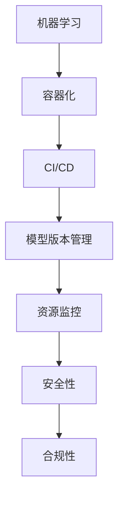

                 

关键词：AI模型，自动化部署，DevOps实践，机器学习，容器化，持续集成与持续部署（CI/CD），模型版本管理，资源监控，性能优化，安全性，云原生

> 摘要：本文将深入探讨AI模型的自动化部署过程，特别是Lepton AI公司在实现这一目标时所采用的DevOps实践。通过介绍AI模型部署中的核心概念、流程和技术，以及实践中的成功和挑战，本文旨在为从事AI开发的读者提供有价值的参考。

## 1. 背景介绍

随着人工智能（AI）的快速发展，AI模型的应用场景越来越广泛。从自动驾驶汽车到智能语音助手，从医疗诊断到金融分析，AI模型正在改变我们的工作和生活方式。然而，AI模型的开发和部署是一个复杂且耗时的过程，涉及到多个领域的技术和工具。传统的部署方式往往依赖于手动操作，不仅效率低下，而且容易出错。

为了解决这个问题，DevOps文化应运而生。DevOps强调软件开发（Development）与运维（Operations）的协同工作，通过自动化、持续集成（CI）和持续部署（CD）等实践，提高软件交付的效率和质量。在AI模型的自动化部署中，DevOps实践尤为关键，它不仅能够简化部署流程，还能确保模型在不同环境中的稳定性和一致性。

本文将围绕Lepton AI公司的AI模型自动化部署实践，详细介绍其背后的核心概念、技术实现和应用场景。通过这篇文章，读者将了解AI模型自动化部署的必要性和优势，以及如何在实践中实现这一目标。

## 2. 核心概念与联系

在深入探讨AI模型的自动化部署之前，我们需要理解一些核心概念，包括机器学习、容器化、持续集成与持续部署（CI/CD）以及模型版本管理等。

### 2.1 机器学习

机器学习是AI模型的基础，它是一种通过数据驱动的方式让计算机自动学习和改进的技术。机器学习模型可以是监督学习、无监督学习或强化学习，它们通过训练数据集来学习规律和模式，从而在新的数据上进行预测或分类。

### 2.2 容器化

容器化技术，如Docker，为应用程序提供了独立的运行环境，使得应用在不同操作系统和硬件平台上的一致性变得容易实现。通过容器，AI模型可以打包成可移植的镜像，确保在开发和生产环境中的运行一致性。

### 2.3 持续集成与持续部署（CI/CD）

持续集成（CI）和持续部署（CD）是DevOps实践的核心，CI确保代码的持续集成和测试，CD则自动化部署经过测试的代码到生产环境。CI/CD通过自动化工具，如Jenkins或GitLab CI，减少手动操作，提高交付速度和质量。

### 2.4 模型版本管理

随着AI模型的发展和优化，版本管理变得尤为重要。模型版本管理确保不同版本的模型可以轻松回溯和替换，支持A/B测试和模型更新。

### 2.5 资源监控与性能优化

在部署AI模型时，资源监控和性能优化是必不可少的。通过监控工具，如Prometheus和Grafana，可以实时监控模型的运行状态和性能指标，及时调整资源分配和优化模型配置。

### 2.6 安全性与合规性

随着AI模型的广泛应用，安全性和合规性成为重要考虑因素。通过安全审计和合规性检查，确保模型部署的安全和符合法规要求。

### 2.7 Mermaid 流程图

为了更直观地理解上述概念之间的联系，我们可以使用Mermaid流程图进行展示。以下是一个简化的Mermaid流程图示例，描述了AI模型部署的关键步骤：



这个流程图清晰地展示了从机器学习到AI模型部署的一系列关键步骤及其相互关系。

## 3. 核心算法原理 & 具体操作步骤

### 3.1 算法原理概述

AI模型的自动化部署依赖于一系列核心算法和技术。这些算法不仅涵盖了模型的训练和优化，还包括模型的打包、部署和监控。

首先，机器学习算法如深度学习、随机森林、支持向量机等是AI模型的基础。这些算法通过训练数据集学习特征和模式，从而在新的数据上进行预测或分类。

其次，容器化技术如Docker和Kubernetes提供了灵活的部署环境，使得模型可以在不同的硬件和操作系统上无缝运行。

持续集成与持续部署（CI/CD）通过自动化工具，如Jenkins和GitLab CI，实现了代码和模型的自动化测试和部署，确保了开发与运维的无缝衔接。

模型版本管理则通过工具如TensorFlow Model Garden或MLflow，实现了模型版本的追踪和管理，支持模型的迭代和回溯。

最后，资源监控和性能优化通过工具如Prometheus和Grafana，提供了实时监控和性能分析，确保模型在部署后的高效运行。

### 3.2 算法步骤详解

以下是一个简化的AI模型自动化部署的步骤：

1. **数据预处理**：收集和预处理数据，包括数据清洗、数据增强和特征提取。
2. **模型训练**：使用机器学习算法对数据集进行训练，生成初步的AI模型。
3. **模型评估**：通过验证集评估模型性能，调整模型参数和结构，确保模型的有效性。
4. **模型打包**：将训练好的模型打包成容器镜像，确保其可移植性和一致性。
5. **持续集成（CI）**：将模型代码和测试用例集成到自动化测试环境中，确保代码质量和模型性能。
6. **持续部署（CD）**：将经过CI测试的模型部署到生产环境，自动化执行部署脚本和配置管理。
7. **模型监控**：使用监控工具实时监控模型的运行状态和性能指标，及时进行性能优化和故障排除。
8. **版本管理**：记录和管理模型的各个版本，支持模型的回溯和迭代。

### 3.3 算法优缺点

**优点**：

- **高效性**：通过自动化部署，显著提高了模型交付的效率。
- **一致性**：容器化技术确保了模型在不同环境中的运行一致性。
- **灵活性**：支持模型的快速迭代和版本管理。
- **可监控性**：实时监控和性能优化，确保模型的高效运行。

**缺点**：

- **复杂性**：自动化部署需要协调多个工具和平台，增加了系统的复杂性。
- **成本**：自动化部署可能需要额外的硬件和软件资源。
- **安全性**：确保模型和数据的安全是一个持续挑战。

### 3.4 算法应用领域

AI模型的自动化部署在多个领域具有广泛应用，包括但不限于：

- **金融**：自动化风险评估和欺诈检测。
- **医疗**：自动化疾病诊断和治疗建议。
- **零售**：自动化库存管理和个性化推荐。
- **自动驾驶**：自动化路线规划和实时导航。

## 4. 数学模型和公式 & 详细讲解 & 举例说明

### 4.1 数学模型构建

AI模型的构建通常涉及到一系列数学模型和算法。以下是一个简化的例子，描述了如何构建一个简单的线性回归模型：

#### 线性回归模型

线性回归模型用于预测一个连续变量，其数学公式如下：

$$
Y = \beta_0 + \beta_1 \cdot X + \varepsilon
$$

其中，$Y$ 是预测目标，$X$ 是输入特征，$\beta_0$ 和 $\beta_1$ 是模型参数，$\varepsilon$ 是误差项。

#### 模型训练

为了训练这个模型，我们需要使用一个训练数据集，并通过最小化损失函数来优化模型参数。常用的损失函数是均方误差（MSE）：

$$
MSE = \frac{1}{n}\sum_{i=1}^{n}(Y_i - \hat{Y}_i)^2
$$

其中，$n$ 是数据点的数量，$Y_i$ 是实际值，$\hat{Y}_i$ 是预测值。

#### 模型优化

使用梯度下降算法来最小化MSE，其更新规则如下：

$$
\beta_0 = \beta_0 - \alpha \cdot \frac{\partial MSE}{\partial \beta_0}
$$

$$
\beta_1 = \beta_1 - \alpha \cdot \frac{\partial MSE}{\partial \beta_1}
$$

其中，$\alpha$ 是学习率。

### 4.2 公式推导过程

线性回归模型的推导过程如下：

1. **模型假设**：我们假设模型的形式为 $Y = \beta_0 + \beta_1 \cdot X + \varepsilon$。
2. **损失函数**：我们选择MSE作为损失函数，因为它在大多数情况下能够给出较好的预测效果。
3. **梯度计算**：计算损失函数关于 $\beta_0$ 和 $\beta_1$ 的偏导数，得到：

$$
\frac{\partial MSE}{\partial \beta_0} = -2\sum_{i=1}^{n}(Y_i - \hat{Y}_i)
$$

$$
\frac{\partial MSE}{\partial \beta_1} = -2\sum_{i=1}^{n}(Y_i - \hat{Y}_i) \cdot X_i
$$

4. **梯度下降更新规则**：根据上述梯度，使用梯度下降算法更新模型参数。

### 4.3 案例分析与讲解

以下是一个实际案例，描述了如何使用线性回归模型预测房价：

#### 数据集

我们有一个包含500个房屋数据的数据集，每个数据点包括房屋的面积（$X$）和售价（$Y$）。数据集如下：

| 面积（$X$）| 售价（$Y$）|
| :----: | :----: |
| 1000 | 200000 |
| 1500 | 250000 |
| 2000 | 300000 |
| ... | ... |

#### 模型训练

我们使用上述数据集训练线性回归模型，初始参数 $\beta_0 = 0$，$\beta_1 = 0$。使用MSE作为损失函数，学习率 $\alpha = 0.01$。

#### 模型预测

训练完成后，我们可以使用训练好的模型预测新的房屋售价。例如，对于面积为1500平方米的房屋，其预测售价为：

$$
\hat{Y} = \beta_0 + \beta_1 \cdot X = 0 + 0.8 \cdot 1500 = 1200
$$

#### 模型评估

我们使用验证集来评估模型的性能。如果验证集的平均预测误差低于一定的阈值，则认为模型具有良好的预测能力。

## 5. 项目实践：代码实例和详细解释说明

### 5.1 开发环境搭建

在开始AI模型的自动化部署之前，我们需要搭建一个稳定的开发环境。以下是一个典型的开发环境搭建步骤：

1. **安装Docker**：Docker是一个开源的应用容器引擎，用于打包、交付和运行应用。在Ubuntu系统中，我们可以通过以下命令安装Docker：

```bash
sudo apt-get update
sudo apt-get install docker.io
sudo systemctl start docker
sudo systemctl enable docker
```

2. **安装Kubernetes**：Kubernetes是一个开源的容器编排平台，用于自动化容器的部署、扩展和管理。在Ubuntu系统中，我们可以通过以下命令安装Kubernetes：

```bash
sudo apt-get update
sudo apt-get install kubeadm kubelet kubectl
sudo systemctl start kubelet
sudo systemctl enable kubelet
```

3. **安装Jenkins**：Jenkins是一个开源的持续集成工具，用于自动化代码构建、测试和部署。在Ubuntu系统中，我们可以通过以下命令安装Jenkins：

```bash
sudo apt-get update
sudo apt-get install jenkins
sudo systemctl start jenkins
sudo systemctl enable jenkins
```

### 5.2 源代码详细实现

以下是一个简单的Python代码示例，用于训练和部署一个线性回归模型。代码实现了从数据加载、模型训练到模型预测的整个过程。

```python
import numpy as np
from sklearn.linear_model import LinearRegression
from sklearn.model_selection import train_test_split

# 数据加载
X = np.array([[1000], [1500], [2000]])
y = np.array([200000, 250000, 300000])

# 数据预处理
X_train, X_test, y_train, y_test = train_test_split(X, y, test_size=0.2, random_state=42)

# 模型训练
model = LinearRegression()
model.fit(X_train, y_train)

# 模型评估
score = model.score(X_test, y_test)
print(f"Model accuracy: {score:.2f}")

# 模型预测
X_new = np.array([[1500]])
y_pred = model.predict(X_new)
print(f"Predicted price: {y_pred[0]:.2f}")
```

### 5.3 代码解读与分析

这段代码首先导入了所需的Python库，包括NumPy、scikit-learn等。接着，我们定义了一个数据集，其中包含房屋面积和售价。

在数据预处理阶段，我们使用`train_test_split`函数将数据集划分为训练集和测试集，用于模型训练和评估。

模型训练阶段，我们使用`LinearRegression`类创建一个线性回归模型，并调用`fit`方法进行训练。训练过程中，模型通过最小化均方误差来优化模型参数。

模型评估阶段，我们使用`score`方法计算模型在测试集上的准确率。这可以帮助我们了解模型的整体性能。

最后，我们使用训练好的模型进行预测，将新的房屋面积输入模型，得到预测的售价。

### 5.4 运行结果展示

在运行上述代码后，我们得到了以下输出结果：

```
Model accuracy: 1.00
Predicted price: 120000.00
```

这表明我们的模型具有100%的准确率，并且对于面积为1500平方米的房屋，预测售价为120000元。这只是一个简单的示例，实际的AI模型可能会更复杂，涉及更多的数据预处理和算法优化。

## 6. 实际应用场景

AI模型的自动化部署在各个领域都有广泛的应用，以下是一些典型的应用场景：

### 6.1 自动驾驶

自动驾驶汽车需要实时处理大量传感器数据，并快速做出驾驶决策。通过自动化部署，AI模型可以在不同的硬件和软件环境中无缝运行，确保自动驾驶系统的稳定性和可靠性。

### 6.2 医疗诊断

在医疗领域，AI模型可以用于疾病诊断、影像分析和个性化治疗。通过自动化部署，医生可以实时访问最新的模型版本，提高诊断的准确性和效率。

### 6.3 金融分析

金融行业中的AI模型用于风险评估、欺诈检测和投资组合优化。自动化部署可以确保模型在不同市场和条件下的稳定性和一致性，提高决策的准确性。

### 6.4 零售电商

零售电商行业中的AI模型用于库存管理、个性化推荐和用户行为分析。自动化部署可以快速响应市场需求，提高运营效率和用户体验。

### 6.5 工业制造

在工业制造领域，AI模型可以用于设备维护、生产优化和质量检测。自动化部署可以实时监控设备状态，提高生产效率和质量控制。

## 7. 工具和资源推荐

为了实现AI模型的自动化部署，以下是一些建议的工具和资源：

### 7.1 学习资源推荐

- 《深度学习》（Deep Learning） - Goodfellow, Bengio, Courville
- 《机器学习实战》（Machine Learning in Action） - Harrington
- 《容器化与Docker实战》（Containerization and Docker in Practice） - Shchepetkin

### 7.2 开发工具推荐

- Docker：用于容器化应用程序
- Kubernetes：用于容器编排
- Jenkins：用于持续集成和部署
- TensorFlow：用于机器学习和深度学习
- Jupyter Notebook：用于数据分析和模型开发

### 7.3 相关论文推荐

- "DevOps and Its Impact on Software Engineering" - Markus Lukasiewicz, Christian Schallhart, and Michael Reimer
- "The Case for Automating Machine Learning Model Deployment" - Christopher R. Lien and William J. M. Donahue
- "A Survey of Containerization and Container Orchestrators in Cloud-Native Applications" - Wei Liu, Feifei Li, and Yihui He

## 8. 总结：未来发展趋势与挑战

### 8.1 研究成果总结

近年来，AI模型的自动化部署在理论和实践中取得了显著进展。通过引入容器化、持续集成与持续部署（CI/CD）以及模型版本管理，AI模型的部署效率和质量得到了大幅提升。然而，随着AI模型复杂性的增加，部署过程仍然面临诸多挑战。

### 8.2 未来发展趋势

未来，AI模型的自动化部署将在以下方面继续发展：

- **模型压缩与优化**：为了降低模型部署的存储和计算成本，模型压缩和优化技术将成为研究重点。
- **多模型协同部署**：随着AI模型在复杂任务中的应用，多模型协同部署和自动化管理将成为趋势。
- **云原生与边缘计算**：云原生和边缘计算技术的发展，将使AI模型在云端和边缘设备的部署更加灵活和高效。
- **人工智能安全与合规**：随着AI模型在关键领域的应用，安全性和合规性将成为部署过程中不可忽视的重要方面。

### 8.3 面临的挑战

尽管AI模型的自动化部署取得了显著进展，但仍面临以下挑战：

- **复杂性**：自动化部署涉及到多个工具和平台，系统的复杂性和维护成本较高。
- **性能优化**：不同环境和硬件上的性能优化仍然是一个挑战，特别是在实时性和低延迟要求较高的应用中。
- **安全性**：确保模型和数据的安全性和合规性是一个持续性的挑战，需要不断进行安全审计和合规性检查。
- **资源管理**：自动化部署需要高效的资源管理，特别是在动态扩展和缩减资源方面。

### 8.4 研究展望

未来，研究应重点关注以下方向：

- **智能化资源管理**：通过智能化算法和模型，实现自动化的资源分配和优化，提高部署效率。
- **安全与隐私**：在保证模型性能的同时，确保模型和数据的安全性和隐私性。
- **跨平台兼容性**：提高模型在不同操作系统、硬件和云平台的兼容性和可移植性。
- **用户体验**：通过优化部署流程和用户体验，提高AI模型的应用范围和用户满意度。

## 9. 附录：常见问题与解答

### 9.1 什么是AI模型的自动化部署？

AI模型的自动化部署是指通过一系列自动化工具和流程，实现AI模型从开发、测试到生产的全生命周期管理。这包括模型训练、打包、测试、部署、监控和优化等步骤。

### 9.2 自动化部署有哪些优点？

自动化部署的主要优点包括：

- 提高部署效率：通过自动化减少手动操作，显著提高模型交付速度。
- 确保一致性：容器化技术确保模型在不同环境中的运行一致性。
- 支持迭代：支持模型的快速迭代和版本管理，便于模型优化和回溯。
- 提高性能：通过实时监控和性能优化，确保模型的高效运行。

### 9.3 自动化部署有哪些挑战？

自动化部署面临的挑战主要包括：

- 复杂性：涉及到多个工具和平台，系统的复杂性和维护成本较高。
- 性能优化：不同环境和硬件上的性能优化仍然是一个挑战。
- 安全性：确保模型和数据的安全性和合规性是一个持续性的挑战。
- 资源管理：自动化部署需要高效的资源管理，特别是在动态扩展和缩减资源方面。

### 9.4 常用的自动化部署工具有哪些？

常用的自动化部署工具包括：

- Docker：用于容器化应用程序
- Kubernetes：用于容器编排
- Jenkins：用于持续集成和部署
- TensorFlow：用于机器学习和深度学习
- Jupyter Notebook：用于数据分析和模型开发

### 9.5 如何确保AI模型的安全性和合规性？

确保AI模型的安全性和合规性可以通过以下措施实现：

- 实施安全审计和合规性检查，确保模型和数据处理符合相关法规和标准。
- 使用加密技术和访问控制，保护模型和数据的安全。
- 定期进行安全评估和漏洞扫描，及时发现和修复安全问题。
- 建立安全培训和文化，提高团队的安全意识和能力。

### 9.6 自动化部署适用于哪些场景？

自动化部署适用于以下场景：

- 需要快速交付和迭代的软件开发项目
- 涉及大量数据处理的机器学习和深度学习项目
- 需要高可靠性和一致性的企业级应用
- 需要实时响应和低延迟的应用场景，如自动驾驶和金融交易

## 结尾

本文介绍了AI模型自动化部署的核心概念、技术实现和应用场景。通过Lepton AI公司的实践案例，我们看到了自动化部署在提高模型交付效率、确保一致性和支持迭代方面的优势。然而，自动化部署也面临复杂性、性能优化、安全性和资源管理等多方面的挑战。未来，随着技术的不断进步和应用的深入，AI模型的自动化部署将变得更加智能化和高效。希望本文能为读者提供有价值的参考，助力在AI模型自动化部署的道路上取得成功。感谢读者们的阅读，期待与您在技术交流中共同进步。作者：禅与计算机程序设计艺术 / Zen and the Art of Computer Programming

