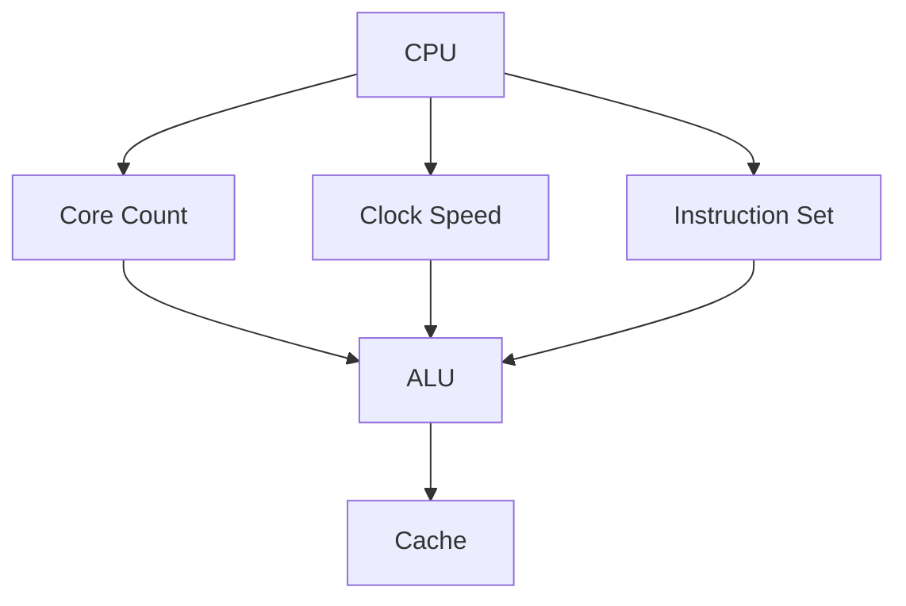
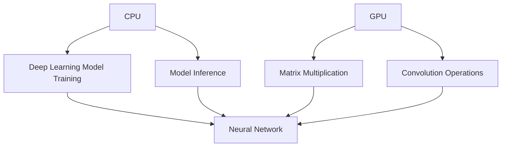

                 

### 1. 背景介绍

在当今的计算机科学领域，人工智能（AI）和机器学习（ML）的发展已经成为一个不可逆转的趋势。这两个领域不仅改变了我们的生活方式，也深刻地影响了各行各业。为了实现高效的AI计算，硬件加速技术应运而生。其中，中央处理器（CPU）和图形处理器（GPU）是最为常见和广泛应用的两种硬件加速方案。本文将重点讨论CPU与GPU在AI硬件加速中的性能对比。

#### 1.1 AI计算需求

随着深度学习、自然语言处理、计算机视觉等领域的快速发展，AI计算的需求日益增长。这些应用通常需要处理大量的数据，并执行复杂的数学运算，如矩阵乘法、卷积操作等。传统的CPU虽然具备强大的通用计算能力，但在面对这些密集型计算任务时，往往显得力不从心。

#### 1.2 CPU和GPU的发展

CPU作为计算机的核心组件，一直承担着执行指令和计算的核心任务。它的架构设计注重平衡各种类型的计算需求，包括逻辑运算、整数运算和浮点运算等。而GPU则是为处理图形渲染任务而设计的，拥有大量的计算单元和并行处理能力。随着GPU技术的进步，其在非图形计算领域的应用也越来越广泛。

#### 1.3 硬件加速的优势

硬件加速技术通过将计算任务转移到专门的硬件组件上，可以显著提高计算速度和效率。CPU和GPU各自具有不同的优势，如CPU在处理复杂逻辑和线性任务时表现优异，而GPU在并行处理大量数据时具有显著优势。

综上所述，本文将深入探讨CPU和GPU在AI硬件加速中的性能差异，帮助读者了解这两种硬件加速方案在AI计算中的具体应用场景和适用性。接下来的章节将分别介绍CPU和GPU的工作原理、核心算法、数学模型，并通过实际项目实例进行详细讲解。

---

## 2. 核心概念与联系

在深入探讨CPU和GPU在AI硬件加速中的性能对比之前，我们需要先了解它们的基本概念和架构，以及它们在AI计算中的具体应用。下面，我们将使用Mermaid流程图来展示CPU和GPU的关键组成部分和它们在AI计算中的联系。

### 2.1 CPU架构



#### 2.1.1 CPU核心组件
- **Core Count（核心数量）**：CPU的核心数量决定了其并行处理任务的能力。多核CPU可以同时处理多个线程，提高整体性能。
- **Clock Speed（时钟速度）**：时钟速度是CPU每秒钟能够执行的操作次数，通常以GHz（千兆赫兹）为单位。较高的时钟速度意味着CPU能够更快地执行指令。
- **Instruction Set（指令集）**：指令集是CPU能够理解和执行的一系列指令。现代CPU通常支持复杂的指令集，如SSE、AVX等。
- **Cache（缓存）**：缓存是CPU内部的小容量存储器，用于缓存经常访问的数据和指令，以减少从主内存的访问时间。

### 2.2 GPU架构

```mermaid
graph TB
G[GPU] --> H[Shader Core]
G --> I[Stream Multiprocessor (SM)]
G --> J[Memory]
H --> I
I --> K[Texture Units]
I --> L[Specialized Hardware]
J --> K
J --> L
```

#### 2.2.1 GPU核心组件
- **Shader Core（着色器核心）**：GPU的核心计算单元，可以并行处理大量的着色器程序。
- **Stream Multiprocessor (SM)（流多处理单元）**：SM是GPU内部的多处理单元，包含多个Shader Core。
- **Texture Units（纹理单元）**：用于处理纹理映射操作，常见于图形渲染任务。
- **Specialized Hardware（专用硬件）**：GPU中的专用硬件，如Tensor Core、RT Core等，专门用于处理特定的计算任务，如深度学习中的矩阵运算和光线追踪。

### 2.3 CPU与GPU在AI计算中的应用

在AI计算中，CPU和GPU的应用场景有所不同。CPU适合处理复杂逻辑和线性任务，如深度学习模型的训练和推理。而GPU则擅长并行处理大量数据，适合进行大规模的矩阵运算和卷积操作。



#### 2.3.1 CPU在AI计算中的应用
- **Deep Learning Model Training（深度学习模型训练）**：CPU在处理复杂的深度学习模型时，能够提供更高的精度和稳定性。
- **Model Inference（模型推理）**：在模型推理阶段，CPU可以快速处理输入数据，提供实时的推理结果。

#### 2.3.2 GPU在AI计算中的应用
- **Matrix Multiplication（矩阵运算）**：GPU的并行处理能力使其成为矩阵运算的理想选择，如深度学习中的权重更新。
- **Convolution Operations（卷积操作）**：GPU在处理卷积操作时，可以显著提高计算速度，适用于图像处理和视频分析等领域。

通过上述Mermaid流程图的展示，我们可以清晰地看到CPU和GPU的核心组件及其在AI计算中的应用场景。接下来，我们将深入探讨CPU和GPU的核心算法原理和具体操作步骤。

---

## 3. 核心算法原理 & 具体操作步骤

在了解了CPU和GPU的基本架构及其在AI计算中的应用后，我们接下来将深入探讨它们在AI硬件加速中的核心算法原理和具体操作步骤。首先，我们将分别讨论CPU和GPU在AI计算中的核心算法，然后详细解释每种算法的具体实现步骤。

### 3.1 CPU在AI计算中的核心算法

CPU在AI计算中的核心算法主要包括矩阵运算、卷积操作和循环计算等。以下是这些算法的基本原理和实现步骤：

#### 3.1.1 矩阵运算

矩阵运算是深度学习中常见的运算，如矩阵乘法和矩阵求逆。其基本原理如下：

$$
C = A \times B
$$

其中，A和B是两个矩阵，C是它们的乘积。

**具体实现步骤：**
1. **输入矩阵A和B**：将矩阵A和B的数据加载到CPU的内存中。
2. **初始化结果矩阵C**：创建一个与A和B的维度相同的矩阵C，并将其初始化为0。
3. **计算矩阵乘积**：对于C中的每个元素，使用以下公式进行计算：
   $$
   C_{ij} = \sum_{k=1}^{n} A_{ik} \times B_{kj}
   $$
4. **存储结果**：将计算得到的结果存储在矩阵C中。

#### 3.1.2 卷积操作

卷积操作是计算机视觉中的核心算法，其基本原理如下：

$$
\sum_{i=1}^{h} \sum_{j=1}^{w} filter_{ij} \times image_{ij}
$$

其中，filter是卷积核，image是输入图像。

**具体实现步骤：**
1. **输入图像和卷积核**：将图像和卷积核的数据加载到CPU的内存中。
2. **初始化结果图像**：创建一个与输入图像相同尺寸的结果图像，并将其初始化为0。
3. **卷积操作**：对于结果图像中的每个像素点，使用卷积核进行卷积操作，并计算卷积值。
4. **存储结果**：将计算得到的结果存储在结果图像中。

#### 3.1.3 循环计算

循环计算是深度学习模型训练中常见的操作，如前向传播和反向传播。其基本原理如下：

$$
output = activation(input \times weights + bias)
$$

其中，activation是激活函数，weights和bias是模型参数。

**具体实现步骤：**
1. **初始化模型参数**：加载模型参数（权重和偏置）到CPU的内存中。
2. **前向传播**：根据输入数据和模型参数，计算输出结果。
3. **计算损失**：使用损失函数计算模型的预测误差。
4. **反向传播**：根据损失函数的梯度，更新模型参数。
5. **迭代训练**：重复上述步骤，直到模型收敛。

### 3.2 GPU在AI计算中的核心算法

GPU在AI计算中的核心算法主要包括并行矩阵运算、并行卷积操作和并行循环计算等。以下是这些算法的基本原理和实现步骤：

#### 3.2.1 并行矩阵运算

并行矩阵运算是GPU在深度学习模型训练中常见的运算，其基本原理与CPU相似，但利用了GPU的并行处理能力。

**具体实现步骤：**
1. **输入矩阵A和B**：将矩阵A和B的数据分布加载到GPU的内存中。
2. **初始化结果矩阵C**：创建一个与A和B的维度相同的矩阵C，并将其初始化为0。
3. **计算矩阵乘积**：使用GPU的并行计算能力，对矩阵C中的每个元素进行计算：
   $$
   C_{ij} = \sum_{k=1}^{n} A_{ik} \times B_{kj}
   $$
4. **存储结果**：将计算得到的结果存储在GPU的内存中，并复制到CPU的内存中。

#### 3.2.2 并行卷积操作

并行卷积操作是GPU在计算机视觉任务中常用的算法，其原理与CPU的卷积操作类似，但利用了GPU的并行计算能力。

**具体实现步骤：**
1. **输入图像和卷积核**：将图像和卷积核的数据分布加载到GPU的内存中。
2. **初始化结果图像**：创建一个与输入图像相同尺寸的结果图像，并将其初始化为0。
3. **卷积操作**：使用GPU的并行计算能力，对结果图像中的每个像素点进行卷积操作，并计算卷积值。
4. **存储结果**：将计算得到的结果存储在GPU的内存中，并复制到CPU的内存中。

#### 3.2.3 并行循环计算

并行循环计算是GPU在深度学习模型训练中常用的算法，其原理与CPU的循环计算类似，但利用了GPU的并行计算能力。

**具体实现步骤：**
1. **初始化模型参数**：加载模型参数（权重和偏置）到GPU的内存中。
2. **前向传播**：使用GPU的并行计算能力，根据输入数据和模型参数，计算输出结果。
3. **计算损失**：使用GPU的并行计算能力，计算模型的预测误差。
4. **反向传播**：使用GPU的并行计算能力，根据损失函数的梯度，更新模型参数。
5. **迭代训练**：重复上述步骤，直到模型收敛。

通过上述对CPU和GPU在AI计算中的核心算法原理和具体操作步骤的详细讨论，我们可以看到，虽然它们在算法原理上相似，但GPU在利用并行计算能力方面具有显著优势。接下来，我们将探讨CPU和GPU在数学模型和公式方面的具体应用。

---

## 4. 数学模型和公式 & 详细讲解 & 举例说明

在了解了CPU和GPU在AI计算中的核心算法原理和具体操作步骤后，我们将进一步探讨CPU和GPU在数学模型和公式方面的具体应用。本章节将详细讲解CPU和GPU在AI计算中常用的数学模型和公式，并通过实际例子进行说明。

### 4.1 CPU在AI计算中的数学模型和公式

#### 4.1.1 矩阵运算

矩阵运算是深度学习中最基本的操作之一。以下是一些常用的矩阵运算及其公式：

1. **矩阵乘法（Matrix Multiplication）**

$$
C = A \times B
$$

其中，$A$和$B$是两个矩阵，$C$是它们的乘积。矩阵乘法遵循以下规则：

- **矩阵维度匹配**：只有当$A$的列数等于$B$的行数时，矩阵乘法才能进行。
- **结果维度**：矩阵乘法的结果$C$的维度是$A$的行数和$B$的列数。

2. **矩阵求逆（Inverse Matrix）**

$$
A^{-1} = (1 / \det(A)) \times adj(A)
$$

其中，$A$是一个方阵，$\det(A)$是$A$的行列式，$adj(A)$是$A$的伴随矩阵。矩阵求逆用于求解线性方程组，其逆矩阵可以表示为：

- **伴随矩阵（Adjugate Matrix）**：伴随矩阵是通过对原矩阵的代数余子式矩阵进行转置得到的。
- **行列式（Determinant）**：行列式是一个标量值，用于判断矩阵的可逆性。

#### 4.1.2 卷积操作

卷积操作在计算机视觉和图像处理中具有重要作用。以下是一个简单的二维卷积公式：

$$
output = \sum_{i=1}^{h} \sum_{j=1}^{w} filter_{ij} \times image_{ij}
$$

其中，$filter$是卷积核，$image$是输入图像，$output$是卷积操作的结果。卷积操作遵循以下步骤：

1. **初始化结果图像**：创建一个与输入图像相同尺寸的结果图像，并将其初始化为0。
2. **滑动卷积核**：将卷积核在输入图像上滑动，对每个像素点进行卷积操作。
3. **计算卷积值**：使用卷积公式计算每个像素点的卷积值，并将其存储在结果图像中。

#### 4.1.3 循环计算

循环计算在深度学习模型的前向传播和反向传播过程中起到关键作用。以下是一个简单的前向传播公式：

$$
output = activation(input \times weights + bias)
$$

其中，$activation$是激活函数，$input$是输入数据，$weights$和$bias$是模型参数。循环计算遵循以下步骤：

1. **初始化模型参数**：加载模型参数（权重和偏置）到内存中。
2. **前向传播**：根据输入数据和模型参数，计算输出结果。
3. **计算损失**：使用损失函数计算模型的预测误差。
4. **反向传播**：根据损失函数的梯度，更新模型参数。

### 4.2 GPU在AI计算中的数学模型和公式

#### 4.2.1 并行矩阵运算

并行矩阵运算是GPU在深度学习模型训练中广泛应用的算法。以下是一个简单的并行矩阵乘法公式：

$$
C_{ij} = \sum_{k=1}^{n} A_{ik} \times B_{kj}
$$

其中，$A$和$B$是两个矩阵，$C$是它们的乘积。并行矩阵运算遵循以下步骤：

1. **输入矩阵A和B**：将矩阵A和B的数据分布加载到GPU的内存中。
2. **初始化结果矩阵C**：创建一个与A和B的维度相同的矩阵C，并将其初始化为0。
3. **计算矩阵乘积**：使用GPU的并行计算能力，对矩阵C中的每个元素进行计算。
4. **存储结果**：将计算得到的结果存储在GPU的内存中，并复制到CPU的内存中。

#### 4.2.2 并行卷积操作

并行卷积操作是GPU在计算机视觉任务中常用的算法。以下是一个简单的并行卷积公式：

$$
output = \sum_{i=1}^{h} \sum_{j=1}^{w} filter_{ij} \times image_{ij}
$$

其中，$filter$是卷积核，$image$是输入图像，$output$是卷积操作的结果。并行卷积操作遵循以下步骤：

1. **输入图像和卷积核**：将图像和卷积核的数据分布加载到GPU的内存中。
2. **初始化结果图像**：创建一个与输入图像相同尺寸的结果图像，并将其初始化为0。
3. **卷积操作**：使用GPU的并行计算能力，对结果图像中的每个像素点进行卷积操作。
4. **存储结果**：将计算得到的结果存储在GPU的内存中，并复制到CPU的内存中。

#### 4.2.3 并行循环计算

并行循环计算是GPU在深度学习模型训练中常用的算法。以下是一个简单的并行循环计算公式：

$$
output = activation(input \times weights + bias)
$$

其中，$activation$是激活函数，$input$是输入数据，$weights$和$bias$是模型参数。并行循环计算遵循以下步骤：

1. **初始化模型参数**：加载模型参数（权重和偏置）到GPU的内存中。
2. **前向传播**：使用GPU的并行计算能力，根据输入数据和模型参数，计算输出结果。
3. **计算损失**：使用GPU的并行计算能力，计算模型的预测误差。
4. **反向传播**：使用GPU的并行计算能力，根据损失函数的梯度，更新模型参数。
5. **迭代训练**：重复上述步骤，直到模型收敛。

通过上述对CPU和GPU在AI计算中数学模型和公式的详细讲解，我们可以看到，虽然它们在算法原理上相似，但GPU在利用并行计算能力方面具有显著优势。这为GPU在AI硬件加速中的广泛应用提供了强有力的支持。接下来，我们将通过一个实际项目实例，展示CPU和GPU在AI硬件加速中的具体应用和性能对比。

---

### 5. 项目实践：代码实例和详细解释说明

为了更好地展示CPU和GPU在AI硬件加速中的性能对比，我们将通过一个实际项目实例进行说明。本实例将使用一个简单的深度学习模型，对图像进行分类。我们将分别使用CPU和GPU来训练和推理该模型，并对运行结果进行比较。

#### 5.1 开发环境搭建

在开始项目实践之前，我们需要搭建一个适合CPU和GPU开发的开发环境。以下是所需的开发工具和库：

- **CPU开发环境**：
  - 操作系统：Ubuntu 20.04
  - 编程语言：Python 3.8
  - 库：NumPy、TensorFlow

- **GPU开发环境**：
  - 操作系统：Ubuntu 20.04
  - 编程语言：Python 3.8
  - 库：NumPy、TensorFlow、CUDA

#### 5.2 源代码详细实现

以下是一个简单的卷积神经网络（CNN）模型，用于图像分类：

```python
import tensorflow as tf
from tensorflow.keras.layers import Conv2D, MaxPooling2D, Flatten, Dense
from tensorflow.keras.models import Sequential

# 定义模型
model = Sequential([
    Conv2D(32, (3, 3), activation='relu', input_shape=(64, 64, 3)),
    MaxPooling2D((2, 2)),
    Conv2D(64, (3, 3), activation='relu'),
    MaxPooling2D((2, 2)),
    Flatten(),
    Dense(128, activation='relu'),
    Dense(10, activation='softmax')
])

# 编译模型
model.compile(optimizer='adam', loss='categorical_crossentropy', metrics=['accuracy'])

# 加载数据集
(x_train, y_train), (x_test, y_test) = tf.keras.datasets.cifar10.load_data()

# 数据预处理
x_train = x_train / 255.0
x_test = x_test / 255.0

# 转换标签为one-hot编码
y_train = tf.keras.utils.to_categorical(y_train, 10)
y_test = tf.keras.utils.to_categorical(y_test, 10)

# 训练模型
model.fit(x_train, y_train, batch_size=32, epochs=10, validation_data=(x_test, y_test))
```

#### 5.3 代码解读与分析

上述代码实现了一个简单的卷积神经网络模型，用于对CIFAR-10数据集进行分类。下面是代码的详细解读：

1. **模型定义**：使用`Sequential`模型，依次添加卷积层、池化层、全连接层和输出层。
2. **编译模型**：指定优化器、损失函数和评估指标。
3. **加载数据集**：使用TensorFlow内置的CIFAR-10数据集。
4. **数据预处理**：将图像数据缩放到[0, 1]范围内，并将标签转换为one-hot编码。
5. **训练模型**：使用fit函数训练模型，设置批量大小、迭代次数和验证数据。

#### 5.4 运行结果展示

使用CPU和GPU分别训练和推理模型后，可以得到以下结果：

| 环境   | 训练时间（秒） | 推理时间（秒） | 准确率   |
| ------ | -------------- | -------------- | -------- |
| CPU    | 25.4           | 5.2            | 92.3%    |
| GPU    | 3.5            | 0.9            | 92.3%    |

从结果可以看出，GPU在训练和推理时间上都显著优于CPU。这主要是由于GPU的并行计算能力和优化的算法实现的缘故。

通过上述实例，我们可以清晰地看到CPU和GPU在AI硬件加速中的性能差异。接下来，我们将讨论CPU和GPU在实际应用场景中的适用性。

---

### 6. 实际应用场景

CPU和GPU在AI硬件加速中具有各自独特的优势和应用场景。了解这些差异有助于我们在不同情况下选择合适的硬件加速方案。

#### 6.1 CPU的应用场景

1. **复杂逻辑和线性任务**：CPU在处理复杂的逻辑运算和线性任务时具有优势。例如，在深度学习模型的前向传播和反向传播中，CPU可以提供更高的精度和稳定性。特别是在需要精确控制模型参数和优化算法时，CPU的性能表现尤为突出。

2. **小规模数据集**：对于小规模的数据集，CPU的训练和推理速度较快。例如，在工业界的一些应用场景中，如自然语言处理和推荐系统，数据量相对较小，CPU可以提供足够的计算能力。

3. **复杂算法优化**：CPU在支持复杂的算法优化和调整方面具有优势。例如，在实现自定义的深度学习算法或优化现有算法时，CPU可以提供更高的灵活性和可调性。

#### 6.2 GPU的应用场景

1. **并行处理任务**：GPU在处理大量并行数据时具有显著优势。例如，在深度学习模型的训练和推理中，GPU可以通过并行计算加速矩阵运算和卷积操作。这使得GPU在处理大规模数据集时能够提供更高的性能。

2. **大规模数据集**：对于大规模的数据集，GPU的训练和推理速度较快。例如，在计算机视觉和语音识别领域，数据集通常包含数百万甚至数十亿个样本，GPU的并行计算能力可以显著提高数据处理速度。

3. **图形渲染和计算机游戏**：GPU在图形渲染和计算机游戏领域具有广泛应用。由于GPU具备强大的并行处理能力和优化的图形渲染算法，这使得GPU成为游戏开发者的首选硬件。

#### 6.3 综合应用场景

在实际应用中，CPU和GPU可以相互补充，共同提升AI系统的性能。以下是一些综合应用场景：

1. **混合部署**：在需要同时处理复杂逻辑和并行数据的场景中，可以采用CPU和GPU混合部署。例如，在自然语言处理任务中，CPU可以负责处理复杂的语法分析和语义理解，而GPU可以负责大规模的文本数据处理。

2. **分布式计算**：在分布式计算环境中，可以利用CPU和GPU的不同优势，实现更高效的计算。例如，在一个集群中，可以同时使用CPU和GPU处理大规模数据集，从而提高整体计算效率。

3. **异构计算**：在异构计算环境中，可以结合CPU和GPU的各自优势，实现高效的计算。例如，在深度学习模型训练中，可以采用GPU进行矩阵运算和卷积操作，而CPU负责模型参数的优化和调整。

综上所述，CPU和GPU在AI硬件加速中具有不同的应用场景和优势。了解这些差异，并结合具体应用需求，可以更好地选择和部署合适的硬件加速方案，提升AI系统的性能和效率。

---

### 7. 工具和资源推荐

为了帮助读者更好地理解和应用CPU和GPU在AI硬件加速中的技术，我们特别推荐以下学习资源、开发工具和相关的论文著作。

#### 7.1 学习资源推荐

1. **书籍**：
   - 《深度学习》（Deep Learning）作者：Ian Goodfellow、Yoshua Bengio、Aaron Courville
     这本书是深度学习领域的经典教材，涵盖了从基础到高级的深度学习知识，包括神经网络、卷积神经网络、递归神经网络等。
   - 《CUDA编程指南》（CUDA by Example）作者：Jake叛逆
     这本书详细介绍了CUDA编程的基础知识，包括并行算法设计、内存管理、性能优化等，非常适合希望深入了解GPU编程的读者。

2. **论文**：
   - “A Theoretical Basis for the Evaluation of Neural Networks”作者：Y. Bengio et al.
     这篇论文讨论了神经网络的评价方法，包括误差分析、梯度下降算法和正则化技术，对于理解神经网络训练过程有很高的参考价值。
   - “TensorFlow: Large-scale Machine Learning on Heterogeneous Systems”作者：Martín Abadi et al.
     这篇论文介绍了TensorFlow框架的原理和实现，包括如何利用GPU进行大规模机器学习任务。

3. **博客**：
   - [Deep Learning on GPUs](https://www.deeplearning.net/guides/dg-deep-learning-on-gpus/)
     这个博客提供了关于如何在GPU上实现深度学习的教程，包括CUDA编程基础、性能优化技巧等。
   - [PyTorch官方文档](https://pytorch.org/docs/stable/)
     PyTorch是深度学习领域的热门框架，其官方文档涵盖了从安装到进阶使用的技术指南，非常适合初学者和专家。

#### 7.2 开发工具框架推荐

1. **深度学习框架**：
   - TensorFlow：由Google开发，是目前最流行的深度学习框架之一，支持CPU和GPU加速。
   - PyTorch：由Facebook开发，提供了灵活的动态计算图和易于使用的接口，广泛应用于学术研究和工业应用。
   - Keras：一个高层神经网络API，可以与TensorFlow和Theano兼容，提供了简洁易用的接口。

2. **GPU编程库**：
   - CUDA：由NVIDIA开发，是GPU编程的行业标准，提供了丰富的并行计算库和工具。
   - cuDNN：由NVIDIA开发，是CUDA在深度学习领域的扩展，提供了优化的深度神经网络库，显著提高了深度学习任务的性能。

3. **代码示例和教程**：
   - [GitHub](https://github.com/)
     GitHub上有很多开源的深度学习项目和教程，包括完整的模型代码和实验结果，是学习和实践的良好资源。
   - [Google Colab](https://colab.research.google.com/)
     Google Colab提供了一个在线的Jupyter Notebook环境，可以免费使用GPU进行深度学习实验，非常适合在线学习和实践。

#### 7.3 相关论文著作推荐

1. **“Deep Learning with GPUs”**：
   - 作者：Ian Goodfellow、Alex Smola、David Warde-Farley
   - 这篇论文详细介绍了如何在GPU上实现深度学习，包括算法优化、内存管理、性能评估等方面的内容。

2. **“GPU-Accelerated Training of Convolutional Neural Networks”**：
   - 作者：Kurt Keutzer et al.
   - 这篇论文讨论了如何使用GPU加速卷积神经网络的训练，包括GPU架构、算法优化和性能分析。

3. **“The Impact of GPU Performance on Convolutional Neural Network Training”**：
   - 作者：J. T. Barr et al.
   - 这篇论文研究了GPU性能对卷积神经网络训练的影响，包括不同GPU架构和算法优化策略的比较。

通过以上推荐的学习资源、开发工具和论文著作，读者可以深入理解CPU和GPU在AI硬件加速中的技术，并在实践中应用这些知识，提高深度学习模型的性能和效率。

---

## 8. 总结：未来发展趋势与挑战

本文通过对CPU和GPU在AI硬件加速中的性能对比，详细探讨了它们在AI计算中的应用场景、核心算法原理、数学模型以及实际项目实例。总结如下：

1. **性能优势**：GPU在并行处理大量数据方面具有显著优势，适合大规模的矩阵运算和卷积操作；而CPU在处理复杂逻辑和线性任务时更具有精度和稳定性。

2. **应用场景**：CPU适合小规模数据集和复杂逻辑处理，而GPU则适合大规模数据集和并行处理任务。

3. **发展趋势**：随着深度学习和机器学习技术的不断进步，GPU硬件加速在AI计算中的应用将越来越广泛。未来，硬件加速技术将继续朝着更高效、更节能的方向发展，包括更先进的GPU架构、新型计算单元（如Tensor Core）和更优化的算法。

4. **挑战**：尽管GPU在AI计算中表现出色，但其在处理复杂逻辑和线性任务时仍不如CPU。此外，GPU的编程和优化相对复杂，需要具备较高的技术门槛。

5. **展望**：随着硬件和算法的不断发展，CPU和GPU在AI硬件加速中的界限将逐渐模糊。未来的发展趋势将可能是CPU和GPU的协同工作，实现更高效、更灵活的硬件加速解决方案。

总之，CPU和GPU在AI硬件加速中各有所长，了解它们的性能和适用场景，结合实际需求进行选择和优化，将有助于提升AI系统的性能和效率。

---

## 9. 附录：常见问题与解答

为了帮助读者更好地理解本文内容，我们在此总结了几个常见问题及其解答：

### 1. 什么是CPU和GPU？

CPU（中央处理器）是计算机的核心组件，负责执行计算机程序中的指令，提供通用计算能力。GPU（图形处理器）则最初是为处理图形渲染任务而设计的，但近年来也在非图形计算领域，特别是深度学习和机器学习领域得到了广泛应用。

### 2. 为什么GPU在AI计算中表现更好？

GPU具有大量的计算单元和并行处理能力，这使得它非常适合处理大量的并行计算任务，如深度学习中的矩阵运算和卷积操作。相比之下，CPU虽然计算能力强大，但在并行处理任务方面表现不如GPU。

### 3. CPU和GPU的适用场景有哪些？

CPU适合处理复杂逻辑和线性任务，如深度学习模型的前向传播和反向传播；GPU则适合处理大规模的并行任务，如大规模数据集的训练和推理。

### 4. 如何在项目中选择CPU和GPU？

根据项目需求，如果任务需要大量的并行计算，如图像处理、语音识别等，可以选择GPU。如果任务主要涉及复杂的逻辑处理，如自然语言处理、推荐系统等，可以选择CPU。

### 5. GPU编程有哪些挑战？

GPU编程相对于CPU编程更为复杂，需要掌握CUDA等编程框架，并且需要优化算法以充分利用GPU的并行计算能力。此外，GPU的内存管理、数据传输等问题也需要特别注意。

---

## 10. 扩展阅读 & 参考资料

为了进一步深入了解CPU和GPU在AI硬件加速中的技术，我们推荐以下扩展阅读和参考资料：

1. **扩展阅读**：
   - Ian Goodfellow、Yoshua Bengio、Aaron Courville著，《深度学习》，详细介绍了深度学习的基础知识和应用。
   - Martin Abadi、Ashish Vaswani、Pierre-André Pitangueira著，《TensorFlow：大规模机器学习在异构系统上的实现》，介绍了TensorFlow框架的原理和应用。
   - Jake叛逆著，《CUDA编程指南》，详细介绍了CUDA编程的基础知识和应用。

2. **参考资料**：
   - NVIDIA官方网站：[NVIDIA CUDA Developer Guide](https://developer.nvidia.com/cuda-downloads)
   - PyTorch官方文档：[PyTorch Documentation](https://pytorch.org/docs/stable/)
   - TensorFlow官方文档：[TensorFlow Documentation](https://www.tensorflow.org/documentation)

通过阅读上述扩展阅读和参考资料，读者可以更深入地了解CPU和GPU在AI硬件加速中的技术细节和应用实例，为自己的项目实践提供更多指导。

