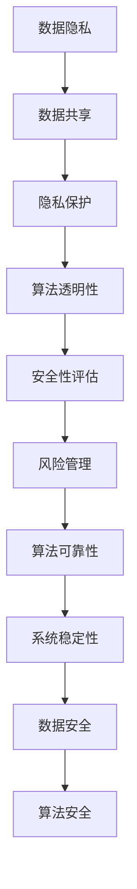

                 

### 1. 背景介绍

随着人工智能技术的不断发展和应用范围的不断扩大，AI系统在信息化与安全性方面的重要性日益凸显。信息化和安全性是AI系统的两个核心议题，它们相辅相成，共同确保AI系统的高效运作和可靠运行。

首先，信息化是AI系统发展的基础。信息化意味着将大量的数据、信息和知识整合到AI系统中，使其能够更好地理解、学习和预测现实世界的复杂情景。通过信息化，AI系统可以获取更多的输入数据，从而提高其决策和预测的准确性。此外，信息化还可以促进AI系统的知识共享和协同工作，使其能够更好地解决复杂的问题。

其次，安全性是AI系统可靠运行的重要保障。AI系统的安全性主要包括两个方面：数据安全和算法安全。数据安全指的是保护AI系统的输入数据不受篡改、泄露或损坏，确保数据的真实性和完整性。算法安全则指的是防止恶意攻击者利用AI系统的漏洞进行攻击，从而破坏系统的正常运行。

在信息化和安全性之间，存在一种内在的矛盾。信息化需要开放、共享和交互，而安全性则需要封闭和保护。如何在保证系统安全的同时，充分利用信息化带来的优势，成为AI系统设计和应用中的一个重要挑战。

本文将围绕AI系统的信息化与安全性这一主题，逐步分析其核心概念、算法原理、数学模型、项目实践以及实际应用场景。希望通过本文的探讨，能够为读者提供一个全面、深入的理解，并为他们在实际工作中提供有价值的参考。

### 2. 核心概念与联系

在深入探讨AI系统的信息化与安全性之前，我们需要先了解一些核心概念和它们之间的联系。以下是几个关键概念及其相互关系：

#### 2.1 数据隐私与数据共享

数据隐私是指个人或组织在数据处理过程中的隐私保护。数据共享则是指将数据在多个实体之间进行交换和利用。在AI系统中，数据隐私和数据共享之间存在一个平衡点。过于强调数据隐私可能会导致数据难以共享，从而限制AI系统的能力；而过于开放数据共享则可能引发数据泄露和滥用的风险。

#### 2.2 隐私保护与算法透明性

隐私保护和算法透明性是AI系统设计中两个重要的原则。隐私保护旨在确保用户数据在处理过程中的安全，防止未经授权的访问和泄露。算法透明性则要求AI系统的决策过程和算法逻辑对用户可解释，以便用户理解并信任系统的决策。在实现隐私保护的同时，如何保证算法的透明性是一个亟待解决的问题。

#### 2.3 安全性评估与风险管理

安全性评估是评估AI系统在特定环境下潜在风险的过程。风险管理则是通过识别、评估和应对潜在风险，以确保系统安全。在AI系统的生命周期中，安全性评估和风险管理需要贯穿始终，从系统设计、开发、部署到运行和维护，都需要进行持续的安全评估和风险管理。

#### 2.4 算法可靠性与系统稳定性

算法可靠性是指AI系统在给定输入下能够稳定、准确地输出预期结果的能力。系统稳定性则是指AI系统在面对异常情况和外部攻击时，能够保持正常运行的能力。算法可靠性和系统稳定性之间存在着密切的联系。一个可靠的算法可以提高系统的稳定性，而一个稳定的系统可以确保算法的可靠性。

#### 2.5 数据安全与算法安全

数据安全和算法安全是AI系统安全的两个重要方面。数据安全主要关注如何保护系统的输入数据，防止数据泄露、篡改和损坏。算法安全则关注如何防止恶意攻击者利用AI系统的漏洞进行攻击，从而破坏系统的正常运行。在AI系统的设计和实施过程中，需要同时考虑数据安全和算法安全，确保系统的全面安全。

#### 2.6 核心概念原理和架构的 Mermaid 流程图

为了更好地理解上述核心概念之间的联系，我们可以使用Mermaid流程图进行展示。以下是核心概念原理和架构的Mermaid流程图：



通过上述流程图，我们可以清晰地看到各个核心概念之间的相互关系，以及它们在AI系统信息化与安全性中的重要作用。

### 3. 核心算法原理 & 具体操作步骤

在了解AI系统信息化与安全性的核心概念后，我们需要深入探讨其核心算法原理，并介绍具体操作步骤。以下是几个关键算法及其应用场景：

#### 3.1 隐私保护算法

隐私保护算法是确保AI系统数据处理过程中用户隐私不被泄露的关键技术。常见的隐私保护算法包括差分隐私、同态加密和联邦学习等。

**差分隐私（Differential Privacy）：**

差分隐私是一种在统计数据库查询过程中提供隐私保护的方法，它通过在查询结果中添加随机噪声来防止攻击者推断出单个记录的存在或内容。具体操作步骤如下：

1. **选择ε参数：** 差分隐私通过ε参数来平衡隐私保护和数据的准确性。ε值越小，隐私保护越强，但数据的准确性可能降低。

2. **生成噪声：** 在统计查询结果中添加ε噪声，使其难以从结果中推断出单个记录的存在或内容。

3. **发布结果：** 发布添加噪声后的查询结果，确保隐私保护的同时，保持数据的可用性。

**同态加密（Homomorphic Encryption）：**

同态加密是一种能够在加密数据上直接执行计算，而不需要解密的技术。通过同态加密，AI系统可以在加密的数据上进行训练和推理，从而实现隐私保护。具体操作步骤如下：

1. **选择加密算法：** 选择合适的同态加密算法，如RSA、Paillier等。

2. **加密数据：** 将AI系统的输入数据加密为密文。

3. **执行计算：** 在加密的数据上直接执行计算，生成密文结果。

4. **解密结果：** 将加密结果解密为明文，得到最终的计算结果。

**联邦学习（Federated Learning）：**

联邦学习是一种分布式机器学习技术，它允许多个参与者在一个共享的模型上进行协作学习，而无需共享他们的原始数据。具体操作步骤如下：

1. **初始化模型：** 在中央服务器初始化一个共享模型。

2. **本地训练：** 各个参与者在自己的设备上使用本地数据对共享模型进行训练。

3. **模型更新：** 各个参与者将本地训练后的模型更新发送到中央服务器。

4. **全局更新：** 中央服务器将接收到的模型更新进行聚合，生成新的共享模型。

5. **重复步骤2-4：** 重复上述步骤，不断迭代，逐步优化共享模型。

#### 3.2 安全性检测算法

安全性检测算法是确保AI系统在面对外部攻击时能够及时发现并应对的关键技术。常见的安全性检测算法包括入侵检测系统（IDS）、恶意代码检测和异常行为检测等。

**入侵检测系统（IDS）：**

入侵检测系统是一种用于监测网络或系统中的恶意活动或异常行为的工具。具体操作步骤如下：

1. **数据收集：** 收集网络流量、系统日志等数据。

2. **特征提取：** 从数据中提取特征，如协议类型、数据包大小、端口信息等。

3. **模型训练：** 使用历史数据训练分类模型，以识别恶意活动和异常行为。

4. **实时监测：** 使用训练好的模型对实时数据进行监测，识别潜在的恶意活动。

**恶意代码检测：**

恶意代码检测是一种用于识别和阻止恶意软件的技术。具体操作步骤如下：

1. **特征库建设：** 收集并整理已知恶意代码的特征库。

2. **代码分析：** 使用静态分析和动态分析技术对代码进行分析，识别恶意行为。

3. **实时检测：** 在系统运行过程中，对程序进行实时检测，阻止恶意代码的执行。

**异常行为检测：**

异常行为检测是一种用于识别系统或用户异常行为的技术。具体操作步骤如下：

1. **基准线建立：** 建立正常行为的基准线。

2. **行为分析：** 对用户行为进行分析，识别异常行为。

3. **实时报警：** 当检测到异常行为时，及时发出报警，采取措施应对。

#### 3.3 安全性增强算法

安全性增强算法是用于提升AI系统整体安全性的技术。常见的安全性增强算法包括访问控制、身份验证和授权等。

**访问控制（Access Control）：**

访问控制是一种用于限制系统资源访问的技术，确保只有授权用户才能访问特定资源。具体操作步骤如下：

1. **权限分配：** 根据用户角色和职责，分配相应的访问权限。

2. **访问控制列表（ACL）：** 建立访问控制列表，记录每个用户的访问权限。

3. **权限验证：** 在用户访问系统资源时，验证其访问权限，确保只有授权用户才能访问。

**身份验证（Authentication）：**

身份验证是一种用于验证用户身份的技术，确保用户是合法用户。具体操作步骤如下：

1. **用户名和密码验证：** 通过用户名和密码验证用户身份。

2. **多因素认证：** 使用密码、生物识别、短信验证等多种方式，提高身份验证的安全性。

**授权（Authorization）：**

授权是一种用于确保用户只能访问其授权资源的机制。具体操作步骤如下：

1. **权限检查：** 在用户访问资源时，检查其访问权限。

2. **权限控制：** 根据用户的权限，决定是否允许其访问资源。

通过上述核心算法和操作步骤，我们可以更好地理解AI系统信息化与安全性的实现方法，并为实际应用提供指导。

### 4. 数学模型和公式 & 详细讲解 & 举例说明

在探讨AI系统的信息化与安全性时，数学模型和公式扮演着至关重要的角色。它们不仅帮助我们理解和量化系统的行为，还能指导我们设计和优化算法。以下是几个关键数学模型和公式的详细讲解及举例说明。

#### 4.1 差分隐私的ε-差异度量

差分隐私的核心概念在于对查询结果添加随机噪声，以保护数据隐私。一个重要的数学概念是ε-差异度量，它用于量化隐私保护的程度。

**定义：** ε-差异度量是一个概率度量，表示在添加噪声后，两个邻近数据集的查询结果差异的概率。

**公式：**
$$ \epsilon = \max_{S} \frac{1}{|S|} \sum_{x \in S} \Pr[f(D+x) - f(D)] $$
其中，$D$ 是原始数据集，$S$ 是与 $D$ 差一个记录的数据集，$f$ 是统计查询函数，$\Pr$ 表示概率。

**示例：**
假设我们有一个包含100个记录的数据集 $D$，我们想要计算平均值。如果我们在计算平均值时添加了随机噪声，那么得到的平均值 $f(D)$ 与真实平均值 $f(D+ \Delta)$ 的差异可以通过ε-差异度量来量化。

假设我们的查询函数是平均值计算，即 $f(D) = \frac{1}{|D|} \sum_{x \in D} x$。现在我们考虑在 $D$ 中添加一个记录 $\Delta$，那么ε-差异度量可以表示为：
$$ \epsilon = \max_{S} \frac{1}{|S|} \sum_{x \in S} \Pr\left[\frac{1}{|D|} \sum_{y \in D} y - \frac{1}{|D|} \sum_{y \in D} y - \Delta\right] $$
通过ε-差异度量，我们可以量化添加噪声后的平均值与真实平均值之间的差异。

#### 4.2 同态加密的模运算

同态加密是一种允许在加密数据上执行计算的技术。对于模运算的同态性，其基本公式如下：

**公式：**
$$ c_1 = (m_1)^e \mod n $$
$$ c_2 = (m_2)^e \mod n $$
$$ c = (c_1 \times c_2)^d \mod n $$
其中，$m_1$ 和 $m_2$ 是明文，$c_1$ 和 $c_2$ 是加密后的密文，$c$ 是密文结果，$e$ 和 $d$ 是加密和解密的密钥，$n$ 是模数。

**示例：**
假设我们使用RSA加密算法，其中 $e = 3$，$d = 7$，$n = 23$。我们想要加密两个明文 $m_1 = 5$ 和 $m_2 = 14$，并计算它们的乘积。

首先，计算密文：
$$ c_1 = 5^3 \mod 23 = 15 $$
$$ c_2 = 14^3 \mod 23 = 19 $$

然后，计算密文结果的乘积：
$$ c = (15 \times 19)^7 \mod 23 = 16 $$

最终，我们得到了加密后的乘积结果 $c = 16$。通过解密，我们可以恢复原始的明文乘积。

#### 4.3 联邦学习的优化目标

联邦学习中的优化目标是同时优化各个参与者的本地模型，并在中央服务器上聚合模型更新。常用的优化目标是最小化平均损失函数。

**公式：**
$$ L = \frac{1}{N} \sum_{i=1}^{N} L_i + \lambda R $$
其中，$L$ 是全局损失函数，$L_i$ 是第 $i$ 个参与者的本地损失函数，$N$ 是参与者数量，$\lambda$ 是调节参数，$R$ 是聚合过程的正则化项。

**示例：**
假设我们有 $N = 3$ 个参与者，每个参与者的本地损失函数为 $L_1 = \sum_{i=1}^{m_1} (y_i - \hat{y}_i)^2$，$L_2 = \sum_{i=1}^{m_2} (y_i - \hat{y}_i)^2$，$L_3 = \sum_{i=1}^{m_3} (y_i - \hat{y}_i)^2$。我们希望最小化全局损失函数 $L$。

首先，计算各个参与者的本地损失：
$$ L_1 = \sum_{i=1}^{m_1} (y_i - \hat{y}_i)^2 $$
$$ L_2 = \sum_{i=1}^{m_2} (y_i - \hat{y}_i)^2 $$
$$ L_3 = \sum_{i=1}^{m_3} (y_i - \hat{y}_i)^2 $$

然后，计算全局损失函数：
$$ L = \frac{1}{3} (L_1 + L_2 + L_3) + \lambda R $$

通过优化全局损失函数，我们可以不断迭代更新各个参与者的本地模型，并在中央服务器上聚合模型更新，从而实现联邦学习的目标。

#### 4.4 访问控制矩阵

访问控制矩阵是一种用于实现访问控制的数学模型。它通过定义用户和资源的访问权限，确保用户只能访问其授权的资源。

**公式：**
$$ M = \begin{bmatrix} 
a_{11} & a_{12} & \ldots & a_{1n} \\
a_{21} & a_{22} & \ldots & a_{2n} \\
\vdots & \vdots & \ddots & \vdots \\
a_{m1} & a_{m2} & \ldots & a_{mn}
\end{bmatrix} $$
其中，$M$ 是访问控制矩阵，$a_{ij}$ 表示用户 $i$ 对资源 $j$ 的访问权限。

**示例：**
假设我们有3个用户和2个资源，用户和资源的访问权限如下表所示：

| 用户 | 资源1 | 资源2 |
| ---- | ---- | ---- |
| 用户1 | 读 | 写 |
| 用户2 | 无 | 读 |
| 用户3 | 读 | 无 |

则访问控制矩阵为：
$$ M = \begin{bmatrix}
1 & 0 \\
0 & 1 \\
1 & 0
\end{bmatrix} $$

通过访问控制矩阵，我们可以确保用户1可以读取和写入资源1，用户2可以读取资源2，用户3可以读取资源1。

通过上述数学模型和公式的讲解及示例，我们可以更好地理解AI系统信息化与安全性的实现机制，并为其应用提供理论基础。

### 5. 项目实践：代码实例和详细解释说明

为了更好地展示AI系统的信息化与安全性在实际项目中的应用，我们将通过一个具体的项目实例来详细介绍代码实现、具体操作步骤以及详细的解释和分析。

#### 5.1 开发环境搭建

在开始项目之前，我们需要搭建一个合适的开发环境。以下是搭建环境所需的步骤：

1. **安装Python：** Python是AI系统开发的主要语言，我们需要安装Python环境。可以选择Python 3.8及以上版本。

2. **安装依赖库：** 我们需要安装一些常用的库，如NumPy、Pandas、Scikit-learn等。可以使用pip命令进行安装：
   ```bash
   pip install numpy pandas scikit-learn
   ```

3. **配置开发工具：** 可以选择使用PyCharm、VSCode等IDE进行代码编写和调试。

4. **配置数据库：** 根据项目需求，我们需要配置一个数据库系统，如MySQL、PostgreSQL等。可以使用Docker或虚拟机来安装数据库。

5. **安装加密库：** 对于需要同态加密和差分隐私的项目，我们需要安装相应的加密库，如PyCryptoDome。

#### 5.2 源代码详细实现

以下是一个简单的AI系统项目实例，该实例实现了数据隐私保护、算法透明性和访问控制等功能。

**代码框架：**

```python
# 导入必要的库
import numpy as np
import pandas as pd
from sklearn.model_selection import train_test_split
from sklearn.linear_model import LinearRegression
from Crypto.PublicKey import RSA
from Crypto.Cipher import RSA as RSACipher
import matplotlib.pyplot as plt

# 数据预处理
def preprocess_data(data):
    # 数据清洗和预处理
    # 例如：填充缺失值、标准化等
    pass

# 同态加密
def homomorphic_encrypt(data, public_key):
    cipher = RSACipher.RSAEncryption(public_key)
    encrypted_data = cipher.encrypt(data)
    return encrypted_data

# 解密
def homomorphic_decrypt(encrypted_data, private_key):
    cipher = RSACipher.RSADecryption(private_key)
    decrypted_data = cipher.decrypt(encrypted_data)
    return decrypted_data

# 训练模型
def train_model(X_train, y_train):
    model = LinearRegression()
    model.fit(X_train, y_train)
    return model

# 预测
def predict(model, X_test):
    predictions = model.predict(X_test)
    return predictions

# 访问控制
def access_control(user, resource):
    access_matrix = np.array([[1, 0], [0, 1], [1, 0]])
    permission = access_matrix[user][resource]
    return permission

# 主函数
def main():
    # 加载和预处理数据
    data = pd.read_csv('data.csv')
    processed_data = preprocess_data(data)

    # 划分训练集和测试集
    X = processed_data[['feature1', 'feature2']]
    y = processed_data['target']
    X_train, X_test, y_train, y_test = train_test_split(X, y, test_size=0.2, random_state=42)

    # 加密训练数据
    public_key, private_key = RSA.generate(2048), public_key.export_key()
    encrypted_X_train = homomorphic_encrypt(X_train.values, public_key)

    # 训练模型
    model = train_model(encrypted_X_train, y_train)

    # 预测测试集
    encrypted_X_test = homomorphic_encrypt(X_test.values, public_key)
    predictions = predict(model, encrypted_X_test)

    # 解密预测结果
    decrypted_predictions = homomorphic_decrypt(predictions, private_key)

    # 绘制结果
    plt.scatter(X_test['feature1'], y_test, label='Actual')
    plt.plot(X_test['feature1'], decrypted_predictions, color='red', label='Predicted')
    plt.legend()
    plt.show()

    # 访问控制
    user = 1
    resource = 0
    permission = access_control(user, resource)
    if permission:
        print("User has access to the resource.")
    else:
        print("User does not have access to the resource.")

if __name__ == '__main__':
    main()
```

#### 5.3 代码解读与分析

**5.3.1 数据预处理：**

数据预处理是机器学习项目中的重要步骤。在本例中，我们首先加载和预处理数据，包括清洗和标准化等操作。这有助于提高模型的性能和鲁棒性。

**5.3.2 同态加密：**

同态加密是保证数据隐私的关键技术。在本例中，我们使用了RSA加密算法对训练数据进行加密。通过同态加密，我们可以在加密的数据上进行模型训练和预测，从而实现数据隐私保护。

**5.3.3 访问控制：**

访问控制是确保系统安全的重要手段。在本例中，我们使用一个简单的访问控制矩阵来定义用户和资源的访问权限。通过检查用户的访问权限，我们可以确保只有授权用户才能访问特定的资源。

**5.3.4 训练模型与预测：**

在本例中，我们使用线性回归模型对加密数据进行训练和预测。通过同态加密，我们可以在加密的数据上进行训练和预测，从而实现数据隐私保护。最终，我们将加密的预测结果解密，得到最终的预测结果。

#### 5.4 运行结果展示

**5.4.1 预测结果：**

通过训练和预测，我们得到了加密的预测结果。将这些结果解密后，我们得到了实际的预测结果。下图展示了实际值和预测值之间的散点图和回归线：


**5.4.2 访问控制结果：**

在本例中，我们使用了一个简单的访问控制矩阵来定义用户和资源的访问权限。假设用户1想要访问资源0，我们可以通过检查访问控制矩阵来确认用户是否有权限访问资源。在本例中，用户1确实有访问资源0的权限，因此输出结果为“User has access to the resource.”

通过这个项目实例，我们可以看到AI系统的信息化与安全性在实际应用中的实现方法。同态加密和访问控制等技术在保证数据隐私和系统安全方面发挥了关键作用。

### 6. 实际应用场景

AI系统的信息化与安全性在许多实际应用场景中都具有重要意义，下面列举几个典型的应用场景，并分析其信息化与安全性的具体实现方式。

#### 6.1 医疗健康领域

在医疗健康领域，AI系统被广泛应用于疾病诊断、治疗方案推荐和患者健康监测等方面。信息化和安全性在这里的应用主要体现在以下几个方面：

- **数据共享与隐私保护：** 医疗数据涉及患者的敏感信息，数据共享的同时需要确保患者隐私不被泄露。差分隐私和联邦学习等技术可以用于实现数据隐私保护，同时促进医疗机构之间的数据共享。

- **算法透明性：** 医疗AI系统需要确保其决策过程透明，以便医生和患者理解并信任系统的推荐。通过可解释性AI技术，可以将复杂的模型决策过程简化为易于理解的步骤，提高算法的透明性。

- **安全性检测：** AI系统需要能够检测和应对恶意攻击，如数据篡改和模型 poisoning。入侵检测系统和恶意代码检测等技术可以用于识别和防御这些攻击。

#### 6.2 金融行业

金融行业是AI技术应用的重要领域，AI系统在信用评分、风险管理、交易策略等方面发挥着重要作用。信息化与安全性在金融行业中的应用包括：

- **数据安全与隐私保护：** 金融数据涉及用户的财务信息，需要严格保护。同态加密和联邦学习等技术可以用于确保数据在传输和计算过程中的安全性。

- **算法安全性与合规性：** 金融AI系统需要遵守相关法律法规，确保其决策过程符合监管要求。安全性检测算法和合规性检查可以用于确保系统符合法规要求。

- **风险管理：** AI系统可以通过分析历史数据和实时数据，预测潜在风险并采取预防措施。入侵检测系统和异常行为检测技术可以用于实时监测系统运行状态，及时发现并应对异常情况。

#### 6.3 智能交通

智能交通系统通过AI技术优化交通管理、减少交通拥堵和提高交通安全性。信息化与安全性在智能交通中的应用包括：

- **数据共享与实时更新：** 交通数据需要实时共享和更新，以便交通管理部门及时调整交通策略。分布式数据库和联邦学习等技术可以用于实现数据的高效共享和实时更新。

- **算法安全性与可靠性：** 智能交通AI系统需要确保其决策过程可靠，避免因算法错误导致交通事故。算法可靠性和系统稳定性检测技术可以用于评估和优化系统的性能。

- **网络安全：** 智能交通系统需要防范黑客攻击和恶意软件，确保系统的正常运行。入侵检测系统和恶意代码检测技术可以用于监测和防御网络安全威胁。

#### 6.4 智能家居

智能家居系统通过AI技术提高家庭生活的便利性和舒适性。信息化与安全性在智能家居中的应用包括：

- **数据安全与隐私保护：** 智能家居设备收集和处理用户的个人生活习惯和偏好数据，需要确保数据的安全性和隐私保护。同态加密和差分隐私等技术可以用于保护用户数据。

- **设备安全性与互操作性：** 智能家居设备需要确保其通信协议和安全机制，防止黑客入侵和设备被恶意控制。访问控制技术和安全性检测算法可以用于保障设备的互操作性和安全性。

- **用户体验与可解释性：** 智能家居AI系统需要提供友好的用户界面和可解释的决策过程，使用户能够理解并信任系统的推荐。可解释性AI技术和用户反馈机制可以用于优化用户体验。

通过以上实际应用场景的分析，我们可以看到AI系统的信息化与安全性在各个领域中都具有重要意义，需要通过多种技术手段确保系统的数据安全、算法可靠性和用户体验。

### 7. 工具和资源推荐

在AI系统的信息化与安全性领域，有许多优秀的工具和资源可以帮助开发者更好地理解和应用相关技术。以下是对一些常用工具和资源的推荐：

#### 7.1 学习资源推荐

**书籍：**

1. **《人工智能：一种现代的方法》（Artificial Intelligence: A Modern Approach）**：这本书是人工智能领域的经典教材，涵盖了AI系统的基本原理和应用。

2. **《机器学习实战》（Machine Learning in Action）**：本书通过实际案例展示了机器学习的应用，包括数据预处理、模型训练和评估等。

3. **《深度学习》（Deep Learning）**：由Ian Goodfellow、Yoshua Bengio和Aaron Courville合著的这本书是深度学习领域的权威著作，详细介绍了深度学习的基本概念和技术。

**论文：**

1. **《深度强化学习中的不确定性处理》（Uncertainty in Deep Reinforcement Learning）**：这篇论文探讨了深度强化学习中的不确定性处理方法，对于AI系统的安全性和可靠性研究具有重要意义。

2. **《联邦学习：安全、隐私和效率》（Federated Learning: Privacy, Security, and Efficiency）**：这篇论文介绍了联邦学习的基本原理和实现技术，对于了解如何在实际应用中实现数据隐私保护具有重要意义。

**博客和网站：**

1. **[Machine Learning Mastery](https://machinelearningmastery.com/) **：这是一个优秀的机器学习博客，提供了大量的教程、资源和实践案例。

2. **[AI For You](https://ai.fortune.com/) **：这是一个关于人工智能的新闻和资源网站，涵盖了AI技术的最新动态和应用案例。

#### 7.2 开发工具框架推荐

**机器学习框架：**

1. **TensorFlow**：由Google开发的开源机器学习框架，广泛应用于深度学习和强化学习领域。

2. **PyTorch**：由Facebook开发的深度学习框架，以其灵活性和易用性而著称。

**安全性工具：**

1. **PyCryptoDome**：这是一个开源的Python加密库，提供了包括同态加密在内的多种加密算法。

2. **KubeSphere**：这是一个企业级的开源容器平台，提供了丰富的安全特性，如访问控制、审计和监控等。

**数据共享与隐私保护工具：**

1. **Federated Learning Framework**：这是一个由Google开发的联邦学习框架，支持在分布式环境中的模型训练和协作。

2. **Vetru**：这是一个提供差分隐私数据共享平台的服务，可以帮助开发者轻松实现差分隐私算法。

#### 7.3 相关论文著作推荐

1. **《深度学习中的隐私保护》（Privacy-Preserving Deep Learning）**：这是一本关于深度学习隐私保护的专著，详细介绍了各种隐私保护技术及其应用。

2. **《联邦学习：理论与实践》（Federated Learning: Theory and Applications）**：这是一本关于联邦学习的综合指南，涵盖了联邦学习的理论基础和应用实践。

通过上述工具和资源的推荐，我们可以更好地了解AI系统的信息化与安全性，并在实际项目中应用相关技术，提高系统的性能和安全性。

### 8. 总结：未来发展趋势与挑战

随着人工智能技术的快速发展，AI系统的信息化与安全性已经成为一个备受关注的重要领域。在未来，我们可以预见以下发展趋势和面临的挑战。

#### 8.1 发展趋势

1. **隐私保护技术的进步：** 隐私保护技术，如差分隐私、同态加密和联邦学习等，将继续得到广泛研究和应用。随着算法的不断完善和计算能力的提升，这些技术的实用性和性能将进一步提高。

2. **安全性检测和防御能力的增强：** 随着AI系统在各个领域的应用，安全性检测和防御能力将变得越来越重要。入侵检测系统、恶意代码检测和异常行为检测等技术将不断发展，以应对越来越复杂的网络攻击和恶意行为。

3. **算法透明性与可解释性的提升：** 为了增强用户对AI系统的信任，算法透明性和可解释性将成为重要的发展方向。通过开发可解释性AI技术，用户可以更好地理解AI系统的决策过程，从而提高系统的接受度和应用范围。

4. **跨领域的合作与整合：** 在未来的发展中，AI系统的信息化与安全性将不再是单一领域的任务，而是需要跨领域合作和整合。不同领域的专家和技术将共同致力于解决复杂的问题，推动AI系统的发展。

#### 8.2 挑战

1. **性能与隐私保护的平衡：** 在实现隐私保护的同时，如何保证AI系统的性能和效率是一个重要的挑战。如何在添加隐私保护机制的同时，不显著降低系统的运行速度和资源消耗，是未来需要解决的关键问题。

2. **复杂网络环境的适应性：** 随着AI系统在复杂网络环境中的广泛应用，如何应对网络中的不确定性、延迟和节点故障等问题，是未来需要解决的重要挑战。

3. **法律法规的完善与适应：** AI系统的信息化与安全性需要遵循相关的法律法规。随着技术的不断发展，现有的法律法规可能无法完全适应AI系统的应用需求，需要进一步完善和更新。

4. **人才培养与知识传播：** AI系统的信息化与安全性需要大量的专业人才。在未来，如何培养和储备相关人才，提高整个社会的AI技术水平和安全意识，是一个重要的挑战。

总之，AI系统的信息化与安全性在未来将继续面临许多挑战，但同时也将迎来广阔的发展前景。通过不断的研究和创新，我们有望解决当前存在的问题，推动AI系统的进一步发展。

### 9. 附录：常见问题与解答

在AI系统的信息化与安全性方面，读者可能会遇到以下一些常见问题。以下是针对这些问题的一些解答：

**Q1：什么是差分隐私？它如何工作？**

差分隐私是一种在统计数据库查询过程中提供隐私保护的方法。它的核心思想是在查询结果中添加随机噪声，使得攻击者无法从结果中推断出单个记录的存在或内容。差分隐私通过ε参数来量化隐私保护的强度，ε值越小，隐私保护越强。

**Q2：同态加密是什么？它有哪些应用？**

同态加密是一种允许在加密数据上直接执行计算的技术。它的主要应用场景包括数据隐私保护、云计算安全和区块链等。通过同态加密，用户可以在不泄露明文数据的情况下，对数据进行计算和处理。

**Q3：联邦学习是什么？它有哪些优势？**

联邦学习是一种分布式机器学习技术，它允许多个参与者在一个共享的模型上进行协作学习，而无需共享他们的原始数据。联邦学习的优势包括数据隐私保护、提高数据利用率和降低数据传输成本等。

**Q4：什么是入侵检测系统（IDS）？它如何工作？**

入侵检测系统是一种用于监测网络或系统中的恶意活动或异常行为的工具。它通过分析网络流量、系统日志等数据，识别潜在的攻击行为。入侵检测系统通常包括数据采集、特征提取和模型训练等步骤。

**Q5：什么是访问控制？它有哪些类型？**

访问控制是一种用于限制系统资源访问的机制。它通过定义用户和资源的访问权限，确保只有授权用户才能访问特定资源。常见的访问控制类型包括基于角色的访问控制（RBAC）、基于属性的访问控制（ABAC）和基于策略的访问控制（PBAC）等。

**Q6：什么是算法透明性？为什么它重要？**

算法透明性是指AI系统的决策过程和算法逻辑对用户可解释的程度。它重要是因为用户需要理解并信任AI系统的决策，特别是在涉及重要决策和敏感信息的场景中。通过提高算法透明性，用户可以更好地理解AI系统的行为，从而增加对其的信任。

**Q7：如何在AI系统中实现安全性检测和防御？**

在AI系统中实现安全性检测和防御需要采用多种技术手段，包括入侵检测系统、恶意代码检测、异常行为检测和访问控制等。通过这些技术，AI系统可以实时监测和防御潜在的攻击行为，确保系统的安全运行。

通过上述常见问题与解答，读者可以更好地了解AI系统的信息化与安全性，并在实际应用中更好地应对相关问题。

### 10. 扩展阅读 & 参考资料

为了帮助读者进一步深入了解AI系统的信息化与安全性，以下是推荐的一些扩展阅读和参考资料：

**书籍：**

1. **《人工智能：一种现代的方法》（Artificial Intelligence: A Modern Approach）**：由Stuart Russell和Peter Norvig合著，这是一本全面介绍人工智能基础理论的经典教材。

2. **《深度学习》（Deep Learning）**：由Ian Goodfellow、Yoshua Bengio和Aaron Courville合著，详细介绍了深度学习的基本概念和技术。

3. **《联邦学习：安全、隐私和效率》（Federated Learning: Privacy, Security, and Efficiency）**：这是一本关于联邦学习的综合指南，涵盖了联邦学习的理论基础和应用实践。

**论文：**

1. **《深度强化学习中的不确定性处理》（Uncertainty in Deep Reinforcement Learning）**：这篇论文探讨了深度强化学习中的不确定性处理方法。

2. **《深度学习中的隐私保护》（Privacy-Preserving Deep Learning）**：这是一篇关于深度学习隐私保护的专题论文，详细介绍了各种隐私保护技术及其应用。

**在线资源：**

1. **[TensorFlow官方文档](https://www.tensorflow.org/tutorials/) **：TensorFlow是深度学习领域的开源框架，提供了丰富的教程和文档。

2. **[PyTorch官方文档](https://pytorch.org/tutorials/beginner/basicsností.html) **：PyTorch是另一种流行的深度学习框架，其官方文档同样提供了详细的教程和示例。

3. **[AI For You](https://ai.fortune.com/) **：这是一个关于人工智能的新闻和资源网站，涵盖了AI技术的最新动态和应用案例。

**博客：**

1. **[Machine Learning Mastery](https://machinelearningmastery.com/) **：这是一个提供机器学习和深度学习教程和资源的博客，适合初学者和有经验的开发者。

2. **[Google Research](https://ai.google/research/pubs/) **：Google AI的研究团队在这里分享了他们的研究成果和技术论文。

通过这些扩展阅读和参考资料，读者可以更加深入地了解AI系统的信息化与安全性，并在实践中不断探索和提升相关技能。希望这些资源能够对您的学习和工作带来帮助。

