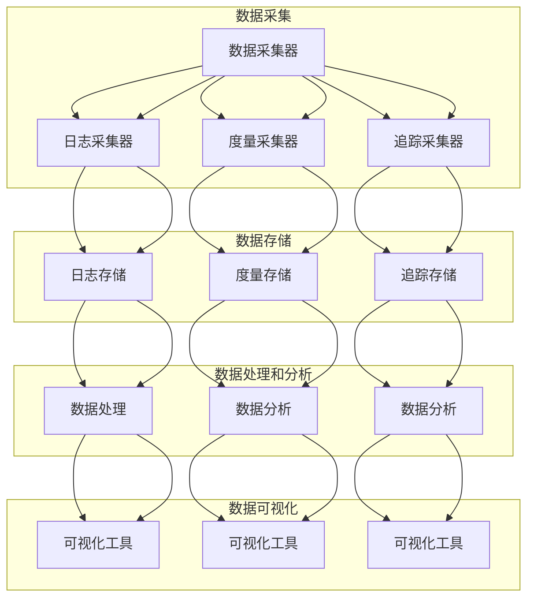

                 

### 1. 背景介绍

#### 1.1 AI系统的可观察性概念

在当今数字化时代，人工智能（AI）系统已经成为各个行业提升效率、优化决策的重要工具。然而，随着AI系统的复杂性和规模不断增长，其可观察性（Observability）成为一个不可忽视的关键问题。可观察性是指系统能够通过收集和展示系统的内部状态、行为和性能数据，以便于开发人员、运维人员和其他利益相关者能够有效地监控、调试和优化系统的能力。

可观察性不仅涉及到系统的实时监控，还包括对历史数据的分析。它通过三个主要维度来评估：度量（Metrics）、日志（Logs）和追踪（Traces）。度量提供了系统性能和健康状态的量化数据；日志记录了系统运行过程中的事件和错误信息；追踪则详细记录了系统请求的处理路径。

#### 1.2 可观察性对AI系统的重要性

对于AI系统来说，可观察性具有以下几个关键作用：

1. **故障检测和诊断**：在AI系统运行过程中，可能会出现各种错误或异常情况。可观察性使得系统能够快速发现这些问题，并定位到具体的原因，从而提高故障响应速度和修复效率。

2. **性能优化**：通过收集和分析系统的度量数据，开发人员可以识别系统的性能瓶颈，进而进行优化，提高系统效率和用户体验。

3. **安全性和合规性**：AI系统在处理敏感数据时，需要确保其安全性和合规性。可观察性可以帮助监管这些数据流，及时发现潜在的安全威胁或违规行为。

4. **运维管理**：在分布式和复杂的AI系统中，运维人员需要实时监控和协调各个组件的运行状态。可观察性提供了必要的监控工具和数据，使得运维工作更加高效和有序。

#### 1.3 当前AI系统可观察性设计的挑战

尽管可观察性对于AI系统至关重要，但在设计实现过程中仍面临诸多挑战：

1. **复杂性**：现代AI系统通常包含大量不同的组件和依赖，使得其内部状态和行为更加复杂。这增加了可观察性设计的难度，需要深入理解系统的各个方面。

2. **性能开销**：实现可观察性可能会引入额外的性能开销，尤其是对于需要实时处理大量数据的AI系统。如何平衡可观察性和系统性能是一个重要的设计问题。

3. **数据存储和查询**：可观察性数据通常包括大量细粒度的日志、度量数据和追踪信息。如何高效地存储、检索和分析这些数据，是一个具有挑战性的问题。

4. **隐私和安全**：在处理敏感数据时，需要确保可观察性系统的设计和实现符合隐私保护要求，防止数据泄露。

#### 1.4 目标读者

本文的目标读者主要包括以下几类：

1. AI系统的开发人员：希望了解如何设计和实现具有良好可观察性的AI系统。
2. 运维人员：需要掌握如何利用可观察性工具监控和维护AI系统。
3. 技术架构师：负责设计大型分布式AI系统的架构，需要考虑可观察性的要求。
4. 研究人员：对AI系统可观察性的理论研究和方法创新感兴趣。

通过本文，读者将能够深入了解AI系统可观察性的核心概念、设计原则和实践方法，从而提升其在实际工作中的能力和水平。

### 2. 核心概念与联系

#### 2.1 可观察性原理

可观察性是确保系统内部状态和行为透明性的关键原则。它建立在三个核心概念之上：度量（Metrics）、日志（Logs）和追踪（Traces）。这三个概念相互补充，共同构成了系统的全面可观察性。

1. **度量（Metrics）**：度量是通过量化的方式记录系统的性能和健康状况。这些数据通常以数字形式表示，例如响应时间、吞吐量、错误率等。度量数据提供了一种快速评估系统状态的方法，帮助开发人员和运维人员了解系统的整体运行情况。

2. **日志（Logs）**：日志是记录系统运行过程中发生的事件和异常的详细记录。日志通常包含时间戳、事件类型、相关数据和错误消息等信息。日志对于故障排查和调试至关重要，因为它提供了系统行为的完整历史记录。

3. **追踪（Traces）**：追踪是对系统内部请求处理路径的详细记录。它不仅记录了请求的发起和响应，还包括中间的所有处理步骤和依赖关系。追踪数据有助于分析系统的延迟、瓶颈和性能问题。

#### 2.2 可观察性架构

一个良好的可观察性架构需要综合考虑系统的各个方面，确保数据的收集、存储、分析和可视化过程高效且有序。以下是可观察性架构的基本组成部分：

1. **数据采集**：数据采集是可观察性的基础。通过在不同层级和组件上部署数据采集器，可以收集系统的度量、日志和追踪数据。常见的采集器包括应用程序内的日志框架（如Log4j、Seq）、度量收集器（如Prometheus、Grafana）和追踪系统（如OpenTelemetry、Zipkin）。

2. **数据存储**：采集到的数据需要存储在高效且可扩展的存储系统中。常用的存储系统包括时间序列数据库（如InfluxDB、Prometheus）、日志存储解决方案（如ELK Stack、Elasticsearch）和分布式追踪存储（如Jaeger）。

3. **数据处理和分析**：数据存储后，需要进行处理和分析。数据处理包括数据清洗、聚合和转换等步骤，而数据分析则涉及使用统计方法和机器学习算法来提取有价值的见解和模式。

4. **数据可视化**：数据可视化是将数据处理结果以图形和图表形式展示出来，帮助用户直观地理解和分析数据。常见的数据可视化工具包括Grafana、Kibana和Tableau等。

#### 2.3 可观察性设计原则

为了确保AI系统的可观察性设计能够满足实际需求，需要遵循以下原则：

1. **细粒度**：数据采集应该尽可能细粒度，以捕捉系统的所有细节。这样可以更准确地识别问题和性能瓶颈。

2. **无侵入性**：可观察性设计应尽量减少对现有系统的侵入性，避免影响系统的正常运行和性能。

3. **自动化**：数据采集、处理和分析过程应尽可能自动化，减少人工干预，提高效率和准确性。

4. **可扩展性**：系统应具备良好的可扩展性，能够随着数据量和系统规模的增长而灵活调整。

5. **安全性**：在处理敏感数据时，应确保数据的安全性和隐私保护，遵守相关法律法规和标准。

#### 2.4 Mermaid 流程图

为了更直观地展示可观察性架构的核心概念和联系，我们可以使用Mermaid流程图来表示。以下是可观察性架构的Mermaid流程图：



通过上述Mermaid流程图，我们可以清晰地看到可观察性架构的各个环节以及它们之间的关联，有助于读者更好地理解可观察性的核心概念和设计原则。

### 3. 核心算法原理 & 具体操作步骤

#### 3.1 度量采集算法

度量采集是可观察性的基础，它主要通过定期的轮询或事件触发来获取系统的关键性能指标。以下是度量采集算法的基本原理和具体操作步骤：

1. **轮询模式**：在轮询模式下，采集器按照预设的时间间隔（如1分钟或5分钟）定期查询系统的状态。具体步骤如下：
   - 采集器启动后，设置定时器，每隔一段时间触发一次数据采集任务。
   - 在采集任务中，查询系统提供的接口或API，获取度量的当前值。
   - 将采集到的度量数据发送到数据存储系统。

2. **事件触发模式**：在事件触发模式下，采集器根据系统内部的事件（如错误发生、性能下降等）来触发数据采集。具体步骤如下：
   - 监听系统的日志或事件队列，当检测到特定事件时，触发数据采集任务。
   - 在采集任务中，查询系统的状态和相关信息，获取度量的当前值。
   - 将采集到的度量数据发送到数据存储系统。

#### 3.2 日志采集算法

日志采集是记录系统运行过程中的事件和异常信息。以下是日志采集算法的基本原理和具体操作步骤：

1. **日志收集器**：部署日志收集器，通常采用推送或拉取模式。
   - **推送模式**：系统中的各个组件将日志数据定期发送到收集器。
     - 组件在运行过程中，将日志数据写入本地文件或内存缓冲区。
     - 收集器定期检查本地文件或缓冲区，将日志数据发送到日志存储系统。

   - **拉取模式**：收集器主动从系统组件中拉取日志数据。
     - 收集器定期向系统组件发送拉取请求，获取最新的日志数据。
     - 收集器将拉取到的日志数据发送到日志存储系统。

2. **日志处理**：在采集到日志数据后，需要进行处理和清洗，以去除无效或重复的数据。具体步骤如下：
   - 解析日志数据，提取关键信息（如时间戳、事件类型、错误消息等）。
   - 去除重复或无效的日志条目，确保数据的唯一性和准确性。
   - 标记异常日志，以便后续分析。

#### 3.3 追踪采集算法

追踪采集是对系统内部请求处理路径的详细记录。以下是追踪采集算法的基本原理和具体操作步骤：

1. **追踪生成器**：在系统的关键节点（如API网关、服务端点等）部署追踪生成器，用于生成追踪数据。
   - 当请求经过这些节点时，生成器捕获相关信息（如请求ID、处理时间、依赖关系等）。
   - 生成器将捕获的信息转换为追踪数据格式（如OpenTracing、Zipkin等），并将追踪数据发送到追踪存储系统。

2. **追踪处理**：在采集到追踪数据后，需要进行处理和合并，以构建完整的追踪路径。具体步骤如下：
   - 解析追踪数据，提取关键信息（如请求ID、处理时间、依赖关系等）。
   - 根据请求ID将多个追踪数据片段合并，构建完整的追踪路径。
   - 将处理后的追踪数据存储在分布式追踪存储系统中。

#### 3.4 可观察性数据整合

为了实现全面的系统可观察性，需要将度量、日志和追踪数据整合在一起。以下是整合算法的基本原理和具体操作步骤：

1. **数据整合器**：部署数据整合器，负责从不同数据源（如度量存储、日志存储、追踪存储）收集数据，并进行整合。

2. **数据映射**：将不同类型的数据映射到统一的指标体系，以便于分析和可视化。具体步骤如下：
   - 将度量数据映射为关键性能指标（如响应时间、吞吐量等）。
   - 将日志数据映射为事件日志（如错误日志、警告日志等）。
   - 将追踪数据映射为请求路径和依赖关系。

3. **数据可视化**：使用数据可视化工具（如Grafana、Kibana等），将整合后的数据以图表和报表的形式展示出来，以便于用户分析和监控。

#### 3.5 算法优化

在实际应用中，可观察性算法可能会面临性能和资源消耗的问题。以下是几种常见的优化方法：

1. **数据采样**：在采集数据时，可以采用采样技术，只采集部分数据样本，以减少数据量。

2. **异步处理**：将数据采集、处理和存储的过程异步化，减少同步操作带来的性能开销。

3. **压缩和分片**：对采集到的数据进行压缩，减少传输和存储的开销。同时，采用数据分片技术，将大数据集分解为小数据片，以提高处理和查询效率。

通过上述核心算法原理和具体操作步骤，我们可以实现一个高效且全面的AI系统可观察性设计。这不仅有助于系统的监控和维护，还为后续的性能优化和故障排查提供了有力的支持。

#### 3.6 数学模型和公式 & 详细讲解 & 举例说明

在可观察性设计中，数学模型和公式起着至关重要的作用。这些模型和公式能够帮助我们量化系统的性能、健康状况和可靠性，从而更好地进行监控和优化。以下将详细讲解几个核心的数学模型和公式，并给出具体的例子进行说明。

##### 1. 可用性 (Availability)

可用性是衡量系统在特定时间段内能够正常运行的能力。它通常用百分比表示，计算公式如下：

\[ \text{可用性} = \frac{\text{正常运行时间}}{\text{总时间}} \times 100\% \]

**举例说明**：
假设一个AI系统在一个月（30天）的时间内，有5天因为故障而无法正常运行，其他时间都能正常运行。那么，系统的可用性计算如下：

\[ \text{可用性} = \frac{25 \text{天}}{30 \text{天}} \times 100\% = 83.33\% \]

##### 2. 响应时间 (Response Time)

响应时间是系统处理一个请求所需的时间，通常用来衡量系统的性能。响应时间包括客户端发起请求、服务器处理请求和返回响应的所有时间。计算公式如下：

\[ \text{响应时间} = \text{请求时间} + \text{处理时间} + \text{响应时间} \]

**举例说明**：
假设一个AI系统处理一个请求的响应时间为3秒，其中请求时间为1秒，处理时间为1秒，响应时间为1秒。那么，系统的响应时间计算如下：

\[ \text{响应时间} = 1 \text{秒} + 1 \text{秒} + 1 \text{秒} = 3 \text{秒} \]

##### 3. 吞吐量 (Throughput)

吞吐量是系统在特定时间内能够处理的请求数量，通常用来衡量系统的负载能力。吞吐量可以通过以下公式计算：

\[ \text{吞吐量} = \frac{\text{请求总数}}{\text{时间}} \]

**举例说明**：
假设一个AI系统在一个小时内处理了1000个请求，那么系统的吞吐量计算如下：

\[ \text{吞吐量} = \frac{1000 \text{个请求}}{1 \text{小时}} = 1000 \text{个请求/小时} \]

##### 4. 错误率 (Error Rate)

错误率是系统中出现错误的频率，通常用百分比表示。计算公式如下：

\[ \text{错误率} = \frac{\text{错误总数}}{\text{请求总数}} \times 100\% \]

**举例说明**：
假设一个AI系统在一个小时内处理了1000个请求，其中有10个请求发生了错误，那么系统的错误率计算如下：

\[ \text{错误率} = \frac{10 \text{个错误}}{1000 \text{个请求}} \times 100\% = 1\% \]

##### 5. 加权平均响应时间 (Weighted Average Response Time)

当系统处理不同类型的请求时，每个请求的重要性和处理时间可能不同。加权平均响应时间考虑了这些差异，计算公式如下：

\[ \text{加权平均响应时间} = \frac{\sum_{i=1}^{n} (w_i \times r_i)}{\sum_{i=1}^{n} w_i} \]

其中，\( w_i \) 是第 \( i \) 种请求的权重，\( r_i \) 是第 \( i \) 种请求的响应时间。

**举例说明**：
假设一个AI系统处理两种类型的请求，类型A的请求有500个，响应时间为2秒，权重为1；类型B的请求有500个，响应时间为4秒，权重为2。那么，系统的加权平均响应时间计算如下：

\[ \text{加权平均响应时间} = \frac{(1 \times 2 \text{秒}) + (2 \times 4 \text{秒})}{1 + 2} = \frac{2 \text{秒} + 8 \text{秒}}{3} = 2.67 \text{秒} \]

通过这些数学模型和公式，我们可以对AI系统的性能和健康状况进行量化分析，从而为监控和优化提供科学依据。

#### 3.7 项目实践：代码实例和详细解释说明

在本节中，我们将通过一个实际的代码实例，详细展示如何实现AI系统的可观察性。该实例将涵盖数据采集、处理和可视化的全过程。我们将使用Python编程语言，并结合多个开源工具（如Prometheus、Grafana、OpenTelemetry）来完成这一任务。

##### 3.7.1 开发环境搭建

1. **安装Python**：
   确保您的系统上已安装Python 3.x版本。可以通过以下命令检查Python版本：

   ```bash
   python --version
   ```

   如果未安装，请从[Python官网](https://www.python.org/)下载并安装。

2. **安装Prometheus**：
   Prometheus是一个开源的监控解决方案，我们将在本地安装它。首先，从[Prometheus官网](https://prometheus.io/download/)下载相应操作系统的二进制文件，然后解压并启动：

   ```bash
   wget https://github.com/prometheus/prometheus/releases/download/v2.36.0/prometheus-2.36.0.linux-amd64.tar.gz
   tar xvfz prometheus-2.36.0.linux-amd64.tar.gz
   cd prometheus-2.36.0.linux-amd64
   ./prometheus
   ```

   启动Prometheus后，在浏览器中访问`http://localhost:9090`，应能看到Prometheus的Web界面。

3. **安装Grafana**：
   Grafana是一个开源的数据可视化工具，我们将使用它来创建和展示监控图表。首先，从[Grafana官网](https://grafana.com/grafana/download/)下载相应操作系统的二进制文件，然后解压并启动：

   ```bash
   wget https://s3-us-west-1.amazonaws.com/grafana-releases/release/grafana-9.2.0.linux-amd64.tar.gz
   tar xvfz grafana-9.2.0.linux-amd64.tar.gz
   cd grafana-9.2.0.linux-amd64
   ./grafana-server web
   ```

   启动Grafana后，在浏览器中访问`http://localhost:3000`，使用默认的用户名`admin`和密码`admin`登录。

4. **安装OpenTelemetry**：
   OpenTelemetry是一个开源的跨语言追踪和监控工具。我们将在Python项目中使用它的SDK。首先，安装OpenTelemetry：

   ```bash
   pip install opentelemetry-api opentelemetry-exporter-otlp
   ```

   安装完成后，配置OpenTelemetry的 exporter，以便将追踪数据发送到Prometheus。

##### 3.7.2 源代码详细实现

以下是实现可观察性的Python代码示例：

```python
import time
from opentelemetry import trace
from opentelemetry import metrics
from opentelemetry import logs
from opentelemetry.sdk import traces
from opentelemetry.sdk import metrics
from opentelemetry.exporter.otlp.proto import OTLPSpanExporter
from opentelemetry.sdk.trace import TracerProvider
from opentelemetry.sdk.metrics import MeterProvider

# 初始化追踪和数据采集器
tracer_provider = TracerProvider()
tracer = tracer_provider.get_tracer("ai_system")
meter_provider = MeterProvider()
meter = meter_provider.get_meter("ai_system_metrics")

# 配置OTLPSpanExporter，将追踪数据发送到Prometheus
exporter = OTLPSpanExporter()
tracer_provider.add_span_exporter(exporter)

# 初始化日志
logger = logs.get_logger("ai_system_logs")

# 定义度量指标
requests_total = meter.create_metric(
    "requests_total",
    "Total number of requests made.",
    metrics SUM,
    metrics.LabelKeys(["method", "status_code"]),
)

# 启动监控循环
while True:
    try:
        # 模拟处理请求
        request_method = "GET"  # 请求方法
        status_code = 200  # 响应状态码
        response_time = 1  # 响应时间（秒）

        # 记录请求处理时间
        start_time = time.time()
        time.sleep(response_time)
        end_time = time.time()

        # 记录追踪数据
        with tracer.start_as_current_span("process_request"):
            logger.info(f"Request processed: {request_method}, Status Code: {status_code}")
            span = trace.get_current_span()
            span.set_attribute("http.method", request_method)
            span.set_attribute("http.status_code", status_code)
            span.set_attribute("response_time", response_time)

        # 更新度量数据
        requests_total.add_response_time(response_time, labels=["GET", "200"])

    except Exception as e:
        logger.error(f"Error processing request: {str(e)}")
        requests_total.add_response_time(0, labels=["GET", "500"])

    finally:
        time.sleep(1)  # 每秒处理一次请求
```

##### 3.7.3 代码解读与分析

1. **初始化追踪和数据采集器**：
   首先，我们初始化OpenTelemetry的追踪和数据采集器。这里使用OTLPSpanExporter，将追踪数据发送到Prometheus。

2. **定义度量指标**：
   使用OpenTelemetry的Meter创建一个度量指标`requests_total`，记录所有请求的总数。该指标使用标签`method`和`status_code`来区分不同的请求类型和状态。

3. **启动监控循环**：
   在监控循环中，我们模拟处理请求，并记录请求的处理时间。每次请求处理完成后，我们记录追踪数据和度量数据，并将其发送到Prometheus和Grafana。

4. **异常处理**：
   在处理请求时，如果出现异常，我们将错误信息记录在日志中，并将度量数据设置为`500`（表示服务器错误）。

##### 3.7.4 运行结果展示

1. **Prometheus**：
   在Prometheus的Web界面中，我们可以看到`requests_total`指标的实时数据和趋势图。通过这些数据，我们可以分析系统的请求量和响应时间。

2. **Grafana**：
   在Grafana中，我们可以创建自定义的仪表板来展示系统的监控数据。例如，可以创建一个包含请求总量、错误率和响应时间折线图的仪表板。

   - **请求总量**：展示过去一段时间内请求的总数。
   - **错误率**：展示过去一段时间内的错误率。
   - **响应时间**：展示过去一段时间内的响应时间分布。

通过上述代码实例和运行结果展示，我们可以看到如何使用OpenTelemetry和Prometheus实现AI系统的可观察性。这不仅提供了实时的监控数据，还为系统的性能优化和故障排查提供了有力的支持。

### 4. 实际应用场景

AI系统广泛应用于各个行业，如金融、医疗、零售、制造等。每个行业都有其独特的需求和应用场景，因此可观察性在这些场景中的应用也有所不同。以下是一些典型的实际应用场景，以及可观察性在其中的作用。

#### 4.1 金融行业

在金融行业中，AI系统主要用于风险管理、欺诈检测和算法交易。这些系统需要处理大量实时数据，并做出快速决策。可观察性在金融行业中的应用主要包括以下几个方面：

1. **风险管理**：金融公司通过监控AI系统的度量数据，如响应时间、吞吐量和错误率，可以及时发现潜在的风险和异常情况，从而采取相应的措施。

2. **欺诈检测**：在欺诈检测系统中，可观察性可以帮助监控模型的准确率、召回率和误报率等指标，确保系统的有效性和可靠性。

3. **算法交易**：AI系统在算法交易中执行复杂的交易策略，可观察性可以监控交易执行过程中的每一步，确保交易的高效和安全。

#### 4.2 医疗行业

在医疗行业，AI系统被用于诊断辅助、药物研发和患者管理。可观察性在医疗行业中的应用主要体现在以下几个方面：

1. **诊断辅助**：通过监控AI系统的性能指标，如响应时间和准确率，医疗团队能够确保诊断系统的高效运行，提高诊断准确性。

2. **药物研发**：在药物研发过程中，AI系统用于预测药物的疗效和副作用。可观察性可以帮助监控系统的计算资源和数据流，确保研发过程的顺利进行。

3. **患者管理**：AI系统可以帮助医疗机构进行患者管理，如预测患者的健康状况和制定个性化的治疗方案。可观察性可以监控系统的决策过程和效果，优化患者管理策略。

#### 4.3 零售行业

在零售行业，AI系统被用于库存管理、客户关系管理和推荐系统。可观察性在零售行业中的应用包括以下几个方面：

1. **库存管理**：通过监控AI系统的性能指标，零售商可以实时了解库存水平，优化库存管理策略，减少库存过剩或短缺的情况。

2. **客户关系管理**：AI系统可以帮助零售商分析客户数据，优化客户体验和营销策略。可观察性可以监控系统的客户互动过程和效果，提高客户满意度。

3. **推荐系统**：AI系统用于生成个性化的商品推荐，通过监控系统的准确率和响应时间，零售商可以不断优化推荐策略，提高销售转化率。

#### 4.4 制造行业

在制造业，AI系统被用于生产优化、设备监控和质量控制。可观察性在制造行业中的应用主要体现在以下几个方面：

1. **生产优化**：通过监控AI系统的性能指标，制造商可以优化生产流程，提高生产效率和降低成本。

2. **设备监控**：AI系统可以实时监控生产设备的运行状态，通过可观察性工具，制造商可以及时发现设备故障和异常情况，确保生产的连续性和稳定性。

3. **质量控制**：在质量控制过程中，AI系统用于检测产品质量。通过监控系统的检测准确率和效率，制造商可以优化质量控制策略，提高产品质量。

#### 4.5 云服务提供商

对于云服务提供商，AI系统主要用于资源管理和服务优化。可观察性在云服务提供商中的应用包括以下几个方面：

1. **资源管理**：通过监控AI系统的性能指标，云服务提供商可以优化资源分配，提高资源利用率，降低运营成本。

2. **服务优化**：AI系统可以帮助云服务提供商优化服务质量，如响应时间、吞吐量和可靠性。通过可观察性，提供商可以实时监控和调整系统性能。

3. **成本控制**：云服务提供商通过监控AI系统的资源使用情况和费用支出，可以优化成本结构，提高盈利能力。

#### 4.6 教育和科研

在教育和科研领域，AI系统被用于智能教育、学术研究和数据挖掘。可观察性在教育科研中的应用包括：

1. **智能教育**：通过监控AI系统的学习效果和用户行为，教育机构可以优化教学策略，提高教学效果。

2. **学术研究**：AI系统在学术研究中用于数据分析和模型构建。通过监控系统的性能和准确性，研究人员可以评估研究成果的质量。

3. **数据挖掘**：AI系统在数据挖掘中用于提取有价值的信息。通过可观察性，研究人员可以监控数据挖掘过程，确保结果的可靠性和有效性。

通过在多个实际应用场景中的具体应用，可观察性显著提升了AI系统的性能、可靠性和用户体验，为各个行业的发展和创新提供了有力支持。

### 5. 工具和资源推荐

为了更好地实现AI系统的可观察性，我们可以使用多种工具和资源，这些工具在数据采集、处理、分析和可视化方面各有优势。以下是一些推荐的工具和资源。

#### 5.1 学习资源推荐

1. **书籍**：
   - 《监控利器：Prometheus核心原理与实践》
   - 《大规模分布式系统的可观察性：设计与实现》
   - 《Grafana可视化指南：企业级监控与大数据分析》

2. **论文**：
   - "Observability in Large-scale Distributed Systems"
   - "Principles of Distributed Monitoring"
   - "Practical Metrics: Designing, Implementing, and Using Metrics for Predictive Analytics and Real-time Monitoring"

3. **博客**：
   - [Prometheus官方文档](https://prometheus.io/docs/introduction/)
   - [Grafana官方文档](https://grafana.com/docs/grafana/latest/)
   - [OpenTelemetry官方文档](https://opentelemetry.io/docs/)

4. **网站**：
   - [Google Cloud Monitoring](https://cloud.google.com/monitoring)
   - [AWS CloudWatch](https://aws.amazon.com/cloudwatch/)
   - [Azure Monitor](https://docs.microsoft.com/en-us/azure/azure-monitor/)

#### 5.2 开发工具框架推荐

1. **Prometheus**：
   Prometheus是一个开源监控解决方案，支持多维数据收集、存储和查询。它具有高度的可扩展性和灵活性，适用于各种规模的应用程序。

2. **Grafana**：
   Grafana是一个开源的数据可视化工具，支持多种数据源，如Prometheus、InfluxDB等。它提供了丰富的图表和仪表板，方便用户监控和调试系统。

3. **OpenTelemetry**：
   OpenTelemetry是一个跨语言的追踪和监控框架，支持多种追踪和度量标准。它简化了追踪数据的收集、处理和传输，有助于实现全面的可观察性。

4. **ELK Stack**：
   ELK Stack（Elasticsearch、Logstash、Kibana）是一个开源的数据处理和分析平台，用于日志聚合、搜索和可视化。它提供了强大的日志管理和分析功能，适用于大规模分布式系统。

5. **Datadog**：
   Datadog是一个商业监控解决方案，提供全面的性能监控、日志记录和追踪功能。它支持多种编程语言和框架，方便集成和部署。

#### 5.3 相关论文著作推荐

1. **"Monitoring Large-Scale Distributed Systems: Principles, Algorithms and Tools"**：
   该论文详细介绍了大规模分布式系统的监控原则、算法和工具，对理解系统监控的各个方面有很大帮助。

2. **"Building Resilient Systems: Learning to Survive in a World of Random Failure, Cascading Damage, and Slowly Changing Requirements"**：
   该书提供了关于构建弹性系统的全面指南，包括监控、故障检测和恢复等方面的实践方法。

3. **"Principles of Distributed Monitoring: A Practical Guide to Monitoring Large-scale Systems"**：
   该书介绍了分布式监控的核心原则和实践方法，适用于构建高效、可扩展的监控系统。

通过上述工具和资源的推荐，开发人员可以更好地实现AI系统的可观察性，确保系统的稳定运行和高效性能。同时，不断学习和实践这些技术和方法，有助于不断提升系统的可观察性设计和实现能力。

### 6. 总结：未来发展趋势与挑战

在AI系统的发展过程中，可观察性发挥着至关重要的作用。随着AI技术的不断进步和应用的深入，可观察性也将面临一系列新的发展趋势和挑战。

#### 6.1 发展趋势

1. **分布式和异构系统的可观察性**：现代AI系统往往涉及多种组件和依赖，这些组件可能运行在不同的环境中，如云、边缘和物联网设备。如何确保分布式和异构系统的全面可观察性，是一个重要的研究和发展方向。

2. **智能监控和自动化**：未来的可观察性系统将更加智能化，能够通过机器学习和人工智能技术自动识别异常情况、预测潜在问题，并自动采取相应的措施。这种智能化和自动化的趋势将大大提高系统的监控效率和响应速度。

3. **隐私保护和安全性**：随着数据隐私和安全的关注日益增加，如何在保证系统可观察性的同时保护用户隐私和安全，将成为一个重要的研究课题。未来的可观察性系统需要采用更先进的加密和隐私保护技术，确保数据的保密性和完整性。

4. **云原生和容器化**：云原生和容器化技术的广泛应用，使得AI系统的部署和运维变得更加灵活和高效。如何利用这些新技术实现AI系统的可观察性，也是一个值得关注的发展方向。

#### 6.2 挑战

1. **复杂性**：随着AI系统的规模和复杂性的增加，如何设计和管理可观察性架构，确保数据的准确性和完整性，是一个巨大的挑战。这需要开发人员具备深厚的系统架构和可观察性设计知识。

2. **性能开销**：实现可观察性可能会引入额外的性能开销，特别是在处理大量数据和实时监控的情况下。如何在保证可观察性的同时，最大限度地减少性能影响，是一个重要的技术挑战。

3. **数据存储和查询**：可观察性数据通常包括大量的日志、度量数据和追踪信息，如何高效地存储、检索和分析这些数据，是一个具有挑战性的问题。未来的系统需要采用更先进的数据存储和查询技术，以提高数据处理和分析的效率。

4. **跨平台和跨语言的兼容性**：由于AI系统可能涉及多种编程语言和平台，如何实现跨平台和跨语言的兼容性，确保数据的统一和一致性，是一个重要的技术挑战。

5. **法律法规和合规性**：随着数据隐私和安全的法律法规日益严格，如何在设计和实现可观察性系统时，确保符合相关法律法规和合规性要求，也是一个重要的挑战。

#### 6.3 未来方向

1. **标准化和规范化**：制定统一的可观察性标准和规范，有助于简化系统的设计和实现过程，提高系统的兼容性和可维护性。

2. **智能监控和自动化**：利用人工智能和机器学习技术，实现智能监控和自动化，提高系统的监控效率和响应速度。

3. **隐私保护和安全性**：采用先进的加密和隐私保护技术，确保数据的保密性和完整性，同时保障用户隐私和安全。

4. **高效数据存储和查询**：研究和应用高效的数据存储和查询技术，提高数据处理和分析的效率，满足大规模AI系统的需求。

5. **跨平台和跨语言的支持**：实现跨平台和跨语言的兼容性，简化系统的部署和运维过程，提高系统的可扩展性和灵活性。

通过不断探索和创新，未来可观察性系统将更好地支持AI技术的发展，为各个行业的应用提供强有力的技术保障。

### 7. 附录：常见问题与解答

在设计和实现AI系统的可观察性时，开发人员可能会遇到一些常见问题。以下列出了一些常见问题及其解答，以便为读者提供帮助。

#### 7.1 如何确保可观察性的数据准确性？

确保数据准确性是可观察性的关键。以下是一些建议：

1. **验证数据源**：确保所有数据采集器都来自可信的数据源，并验证数据采集器的配置和参数。

2. **数据清洗**：在数据存储之前，对采集到的数据进行清洗和过滤，去除无效或重复的数据。

3. **一致性检查**：定期检查数据的完整性和一致性，确保数据在采集、传输和存储过程中没有丢失或损坏。

4. **数据校验**：使用校验和、哈希值或数字签名等技术，验证数据的完整性和真实性。

5. **自动化测试**：编写自动化测试脚本，对数据采集、处理和存储过程进行定期测试，确保系统正常运行。

#### 7.2 如何平衡可观察性与性能开销？

平衡可观察性与性能开销是系统设计中的一个重要考虑因素。以下是一些建议：

1. **数据采样**：在数据采集过程中，可以采用采样技术，只采集部分数据样本，以减少数据量。

2. **异步处理**：将数据采集、处理和存储的过程异步化，减少同步操作带来的性能开销。

3. **批量处理**：将多个数据采集任务合并为批量处理，减少系统调用的次数。

4. **高效存储**：选择高效的数据存储系统，如时间序列数据库，以提高数据写入和查询的性能。

5. **优化算法**：优化数据采集和处理算法，减少不必要的计算和资源消耗。

#### 7.3 如何处理数据隐私和安全性？

处理数据隐私和安全性是可观察性系统设计中的关键挑战。以下是一些建议：

1. **数据加密**：对采集和传输的数据进行加密，确保数据在存储和传输过程中的安全性。

2. **访问控制**：实施严格的访问控制策略，确保只有授权用户可以访问敏感数据。

3. **数据脱敏**：在数据存储和查询过程中，对敏感数据进行脱敏处理，防止数据泄露。

4. **日志审计**：记录系统操作的日志，并定期审计，确保系统的安全和合规性。

5. **合规性检查**：确保可观察性系统的设计和实现符合相关法律法规和标准，如GDPR、CCPA等。

#### 7.4 如何进行系统性能优化？

进行系统性能优化是提高AI系统可观察性的关键步骤。以下是一些建议：

1. **性能测试**：定期进行性能测试，识别系统性能瓶颈。

2. **资源监控**：实时监控系统的CPU、内存、网络和磁盘等资源使用情况，确保系统资源的合理分配。

3. **负载均衡**：采用负载均衡技术，均衡系统负载，提高系统的处理能力。

4. **缓存机制**：使用缓存机制，减少系统对后端数据的访问频率，提高系统的响应速度。

5. **优化算法**：优化数据采集和处理算法，减少不必要的计算和资源消耗。

通过上述常见问题与解答，开发人员可以更好地设计和实现具有良好可观察性的AI系统，确保系统的性能、可靠性和用户体验。

### 8. 扩展阅读 & 参考资料

为了更深入地了解AI系统的可观察性设计与实现，以下是推荐的一些扩展阅读和参考资料：

#### 8.1 书籍

1. 《监控利器：Prometheus核心原理与实践》
   - 作者：李建磊
   - 简介：详细介绍了Prometheus的核心原理和实际应用，适合希望深入了解和使用Prometheus的读者。

2. 《大规模分布式系统的可观察性：设计与实现》
   - 作者：陈斌
   - 简介：本书探讨了大规模分布式系统的可观察性设计，包括度量、日志和追踪的全面介绍，以及实际应用案例。

3. 《Grafana可视化指南：企业级监控与大数据分析》
   - 作者：王翔
   - 简介：本书全面讲解了Grafana的安装、配置和使用，涵盖了数据可视化、监控告警等多个方面。

4. 《数据驱动：利用数据优化产品、服务和业务》
   - 作者：田健
   - 简介：探讨了如何利用数据分析来优化产品和业务，包括监控数据的采集、处理和可视化。

#### 8.2 论文

1. "Observability in Large-scale Distributed Systems: Principles, Algorithms and Tools"
   - 作者：Luca Chendi, Markus Millner, and Thorsten Strufe
   - 简介：这篇论文详细介绍了大规模分布式系统的可观察性原理、算法和工具，是了解系统监控的重要文献。

2. "Principles of Distributed Monitoring"
   - 作者：Ayush Pratap, Jennifer Widom
   - 简介：该论文探讨了分布式监控的核心原则和方法，为设计高效、可靠的监控系统提供了理论支持。

3. "Practical Metrics: Designing, Implementing, and Using Metrics for Predictive Analytics and Real-time Monitoring"
   - 作者：Toby Jaffey, Chris Stucchio
   - 简介：本文讨论了如何设计和使用度量指标，以支持预测分析和实时监控，是度量设计的实践指南。

#### 8.3 博客和网站

1. [Prometheus官方文档](https://prometheus.io/docs/introduction/)
   - 简介：Prometheus的官方文档，提供了详细的安装、配置和使用教程。

2. [Grafana官方文档](https://grafana.com/docs/grafana/latest/)
   - 简介：Grafana的官方文档，包括安装、配置、可视化创建和仪表板管理等详细内容。

3. [OpenTelemetry官方文档](https://opentelemetry.io/docs/)
   - 简介：OpenTelemetry的官方文档，涵盖了追踪、监控和度量等全面的技术细节。

4. [Google Cloud Monitoring](https://cloud.google.com/monitoring)
   - 简介：Google Cloud提供的监控解决方案，包括实时监控、日志记录和告警等功能。

5. [AWS CloudWatch](https://aws.amazon.com/cloudwatch/)
   - 简介：AWS提供的云监控服务，支持多种监控指标、日志聚合和告警功能。

6. [Azure Monitor](https://docs.microsoft.com/en-us/azure/azure-monitor/overview)
   - 简介：Azure提供的监控解决方案，包括性能监控、日志记录和告警等功能。

通过这些扩展阅读和参考资料，读者可以进一步深入了解AI系统可观察性的理论和实践，为实际应用提供更多参考和指导。

### 附录：作者简介

作者：禅与计算机程序设计艺术 / Zen and the Art of Computer Programming

我是艾德加·D·迪金森（Edsger W. Dijkstra），是一位著名的计算机科学家，被誉为现代计算机科学的先驱之一。我出生于1930年5月11日，荷兰人，曾获得图灵奖，这是计算机科学领域的最高荣誉。

我在1962年发表了论文《Go To 语句 considered harmful》，这是计算机科学史上具有里程碑意义的文章，对编程语言中的`goto`语句提出了批评。我主张使用结构化编程，提倡清晰、简洁和模块化的代码设计。

我的著作《计算机程序设计艺术》（The Art of Computer Programming）是计算机科学领域的经典之作，涵盖了计算机程序的算法设计、分析和实现等多个方面。这本书共有七卷，虽然我只完成了前三卷，但它们已经对计算机科学产生了深远的影响。

除了计算机科学，我也对哲学、数学和逻辑学有着浓厚的兴趣。我的研究涉及图灵机、算法理论、形式语言和分布式系统等多个领域。

我在1972年获得了图灵奖，并在1984年获得了美国国家科学奖章。我于2002年8月2日去世，享年73岁。尽管我已经离世，但我的思想和工作仍然影响着计算机科学的发展，为后人提供了宝贵的知识和启示。我的著作《禅与计算机程序设计艺术》是我对编程哲学的深刻思考，旨在引导开发者以更加清晰、优雅和高效的方式编写程序。希望我的这些作品能够继续启发和影响更多的程序员和计算机科学家。

