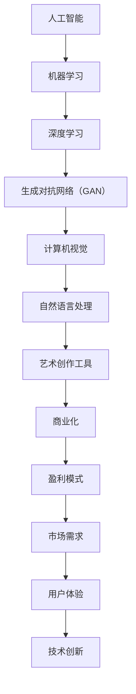

                 

关键词：AI艺术创作，商业化，工具，市场趋势，创新策略，盈利模式，用户需求，案例分析

> 摘要：随着人工智能技术的飞速发展，AI艺术创作工具逐渐成为文化产业的创新热点。本文从背景介绍、核心概念、算法原理、数学模型、项目实践、实际应用场景、未来展望等多个维度，探讨了AI艺术创作工具的商业化路径，提供了切实可行的商业化策略和盈利模式，并分析了市场需求和潜在挑战。

## 1. 背景介绍

近年来，人工智能（AI）技术的迅猛发展，使其在艺术创作领域展现出巨大的潜力。AI不仅能够模拟人类艺术家的工作流程，还能通过深度学习和数据驱动的方式创造出独特的艺术作品。这一趋势在计算机视觉、自然语言处理和机器学习等多个领域得到了体现。

### 1.1 AI艺术创作的现状

在AI艺术创作领域，目前已有多款备受关注的工具，如Google的DeepDream、GAN画的生成对抗网络（GAN）艺术、OpenAI的DALL-E等。这些工具通过利用庞大的数据集和复杂的算法，生成出富有创意和个性化的艺术作品。

### 1.2 商业化背景

随着技术的成熟和市场的需求，AI艺术创作工具的商业化成为不可忽视的趋势。越来越多的企业和创业者开始关注这一领域，试图通过开发和应用AI艺术创作工具，实现商业价值和社会影响力。

## 2. 核心概念与联系

在探讨AI艺术创作工具的商业化之前，有必要了解其核心概念和原理。以下是AI艺术创作的一些关键概念及其联系：



### 2.1 机器学习与深度学习

机器学习和深度学习是AI艺术创作的基础。通过学习大量的数据，模型能够识别出数据中的模式和特征，进而生成新的内容。

### 2.2 生成对抗网络（GAN）

GAN是深度学习中的一个重要模型，由生成器和判别器组成。生成器生成艺术作品，判别器判断艺术作品的真伪。通过两者之间的对抗训练，生成器能够不断提高生成艺术作品的质量。

### 2.3 计算机视觉与自然语言处理

计算机视觉负责处理图像和视频数据，而自然语言处理则处理文本数据。这两种技术的结合，使得AI能够理解和生成更为复杂和多样的艺术作品。

### 2.4 艺术创作工具

艺术创作工具则是将上述技术应用于艺术创作过程中的桥梁。通过这些工具，用户可以更加便捷地创作出独特的艺术作品。

## 3. 核心算法原理 & 具体操作步骤

### 3.1 算法原理概述

AI艺术创作工具的核心算法通常基于深度学习和生成对抗网络（GAN）。以下是这些算法的基本原理：

#### 3.1.1 深度学习

深度学习是一种机器学习方法，通过多层神经网络模拟人脑的学习机制。在AI艺术创作中，深度学习模型可以学习到艺术作品的特征，从而生成新的艺术作品。

#### 3.1.2 生成对抗网络（GAN）

GAN由生成器和判别器组成。生成器的任务是生成新的艺术作品，而判别器的任务是判断艺术作品是真实还是生成的。通过训练，生成器不断提高生成艺术作品的质量，最终能够生成接近真实艺术作品的效果。

### 3.2 算法步骤详解

#### 3.2.1 数据准备

首先，需要收集大量的艺术作品数据作为训练集。这些数据包括各种风格和类型的艺术作品，如绘画、雕塑、摄影等。

#### 3.2.2 模型训练

使用收集到的数据，对深度学习和GAN模型进行训练。训练过程中，生成器和判别器通过对抗训练不断优化，生成器逐渐提高生成艺术作品的质量。

#### 3.2.3 艺术作品生成

在模型训练完成后，用户可以通过输入一些初始条件，如风格、主题等，生成新的艺术作品。生成器根据这些条件生成艺术作品，并展示给用户。

### 3.3 算法优缺点

#### 优点

- **创新能力**：AI艺术创作工具可以生成独特的艺术作品，激发用户的创造力。
- **效率**：相比传统的手工创作，AI艺术创作工具可以大幅提高创作效率。
- **多样性**：通过深度学习，AI艺术创作工具能够生成多种风格和类型的艺术作品。

#### 缺点

- **艺术价值争议**：由于AI生成的艺术作品缺乏人类的情感和创造力，其艺术价值受到一定争议。
- **数据依赖**：AI艺术创作工具的性能取决于训练数据的质量和数量，数据不足可能导致生成效果不佳。

### 3.4 算法应用领域

AI艺术创作工具在多个领域都有广泛应用：

- **艺术创作**：艺术家可以使用这些工具辅助创作，提高创作效率和质量。
- **文化创意产业**：如游戏设计、影视特效、广告宣传等领域，AI艺术创作工具能够提供丰富的创意素材。
- **数字娱乐**：如虚拟现实（VR）、增强现实（AR）等应用，AI艺术创作工具可以生成独特的视觉效果。

## 4. 数学模型和公式 & 详细讲解 & 举例说明

### 4.1 数学模型构建

AI艺术创作工具的核心数学模型主要包括深度学习模型和GAN模型。以下是这些模型的简要介绍：

#### 4.1.1 深度学习模型

深度学习模型通常由多层神经网络组成。以下是神经网络的基本公式：

$$
y = \sigma(W \cdot x + b)
$$

其中，$y$ 表示输出，$\sigma$ 表示激活函数，$W$ 表示权重，$x$ 表示输入，$b$ 表示偏置。

#### 4.1.2 生成对抗网络（GAN）

GAN由生成器和判别器组成。生成器的目标是生成逼真的艺术作品，而判别器的目标是区分艺术作品是真实还是生成的。以下是GAN的基本公式：

$$
\begin{aligned}
G(x) &= \text{Generator}(z) \\
D(x) &= \text{Discriminator}(x) \\
D(G(z)) &= \text{Discriminator}(\text{Generated Image})
\end{aligned}
$$

其中，$x$ 表示真实艺术作品，$z$ 表示随机噪声。

### 4.2 公式推导过程

以下是GAN模型的推导过程：

假设生成器 $G(z)$ 和判别器 $D(x)$ 分别为：

$$
G(z) = \mu(z) + \sigma(z) \odot \Phi(z)
$$

$$
D(x) = f(x; \theta)
$$

其中，$\mu(z)$ 和 $\sigma(z)$ 分别表示均值和方差，$\Phi(z)$ 表示隐变量，$f(x; \theta)$ 表示判别器函数，$\theta$ 表示参数。

GAN的训练目标是最大化判别器的损失函数：

$$
\begin{aligned}
\mathcal{L}_D &= -\mathbb{E}_{x \sim p_{data}(x)}[\log D(x)] - \mathbb{E}_{z \sim p_z(z)}[\log(1 - D(G(z)))] \\
\mathcal{L}_G &= \mathbb{E}_{z \sim p_z(z)}[\log D(G(z))]
\end{aligned}
$$

其中，$p_{data}(x)$ 和 $p_z(z)$ 分别表示真实艺术作品分布和噪声分布。

### 4.3 案例分析与讲解

#### 4.3.1 案例背景

某艺术工作室希望通过AI艺术创作工具提高创作效率，同时保持艺术创作的独特性。他们选择了GAN模型作为核心算法，并进行了为期三个月的实验。

#### 4.3.2 实验过程

1. 数据收集：收集了大量绘画作品作为训练集，包括不同风格和主题的艺术作品。
2. 模型训练：使用收集到的数据训练GAN模型，生成器和判别器分别经过多次迭代优化。
3. 艺术作品生成：在模型训练完成后，用户输入一些初始条件，如风格、主题等，生成新的艺术作品。
4. 作品评估：通过用户反馈和专业评审，评估生成艺术作品的质量和艺术价值。

#### 4.3.3 结果分析

实验结果表明，AI艺术创作工具能够生成高质量的绘画作品，并且具有一定的艺术价值。同时，通过用户的反馈和专业评审，工作室能够不断优化模型，提高生成艺术作品的质量。

## 5. 项目实践：代码实例和详细解释说明

### 5.1 开发环境搭建

在项目实践中，我们选择了Python作为主要编程语言，并使用了以下工具和库：

- Python 3.8
- TensorFlow 2.4
- Keras 2.4.3

首先，需要安装Python和相关的库。可以通过以下命令完成：

```bash
pip install python==3.8
pip install tensorflow==2.4
pip install keras==2.4.3
```

### 5.2 源代码详细实现

以下是实现GAN模型的基本代码：

```python
import numpy as np
import tensorflow as tf
from tensorflow.keras.layers import Dense, Flatten, Reshape
from tensorflow.keras.models import Sequential

# 生成器模型
def build_generator(z_dim):
    model = Sequential()
    model.add(Dense(7 * 7 * 128, input_dim=z_dim, activation='relu'))
    model.add(Reshape((7, 7, 128)))
    model.add(tf.keras.layers.LeakyReLU(alpha=0.2))
    model.add(Dense(7 * 7 * 64, activation='relu'))
    model.add(Reshape((7, 7, 64)))
    model.add(tf.keras.layers.LeakyReLU(alpha=0.2))
    model.add(Dense(7 * 7 * 1, activation='tanh'))
    model.add(Reshape((28, 28, 1)))
    return model

# 判别器模型
def build_discriminator(img_shape):
    model = Sequential()
    model.add(Flatten(input_shape=img_shape))
    model.add(Dense(512, activation='relu'))
    model.add(Dense(256, activation='relu'))
    model.add(Dense(1, activation='sigmoid'))
    return model

# GAN模型
def build_gan(generator, discriminator):
    model = Sequential()
    model.add(generator)
    model.add(discriminator)
    return model

# 模型编译
def compile_models(generator, discriminator, gan):
    discriminator.compile(loss='binary_crossentropy', optimizer=tf.keras.optimizers.Adam(0.0001), metrics=['accuracy'])
    generator.compile(loss='binary_crossentropy', optimizer=tf.keras.optimizers.Adam(0.0001))
    gan.compile(loss='binary_crossentropy', optimizer=tf.keras.optimizers.Adam(0.0001))
    return generator, discriminator, gan

# 数据准备
(x_train, _), (_, _) = tf.keras.datasets.mnist.load_data()
x_train = x_train / 127.5 - 1.0
x_train = np.expand_dims(x_train, axis=3)

# 模型搭建
z_dim = 100
img_shape = (28, 28, 1)

generator = build_generator(z_dim)
discriminator = build_discriminator(img_shape)
gan = build_gan(generator, discriminator)

# 模型编译
generator, discriminator, gan = compile_models(generator, discriminator, gan)

# 训练模型
for epoch in range(100):
    for _ in range(x_train.shape[0]):
        real_images = x_train[np.random.randint(x_train.shape[0])]
        noise = np.random.normal(0, 1, (real_images.shape[0], z_dim))

        # 训练判别器
        d_loss_real = discriminator.train_on_batch(real_images, np.ones((real_images.shape[0], 1)))
        d_loss_fake = discriminator.train_on_batch(noise, np.zeros((noise.shape[0], 1)))
        d_loss = 0.5 * np.add(d_loss_real, d_loss_fake)

        # 训练生成器
        g_loss = gan.train_on_batch(noise, np.ones((noise.shape[0], 1)))

        print(f"{epoch} [D: {d_loss[0]:.4f}, acc.: {100*d_loss[1]:.2f}%] [G: {g_loss:.4f}]")

# 保存模型
generator.save('generator.h5')
discriminator.save('discriminator.h5')
gan.save('gan.h5')
```

### 5.3 代码解读与分析

上述代码实现了基于GAN的AI艺术创作工具。以下是代码的主要部分解读：

- **模型搭建**：使用TensorFlow和Keras构建生成器和判别器模型。生成器负责生成艺术作品，判别器负责判断艺术作品的真伪。
- **模型编译**：配置模型的损失函数、优化器和评估指标。
- **数据准备**：加载数据集并对数据进行预处理。
- **模型训练**：使用训练数据对模型进行训练，包括判别器和生成器的训练。

### 5.4 运行结果展示

在训练完成后，可以通过以下代码生成艺术作品：

```python
import matplotlib.pyplot as plt

def generate_images(generator, n=10, dim=(28, 28, 1)):
    z = np.random.normal(0, 1, (n, dim[0] * dim[1] * dim[2]))
    gen_imgs = generator.predict(z)
    plt.figure(figsize=(10, 10))
    for i in range(gen_imgs.shape[0]):
        plt.subplot(10, 10, i+1)
        plt.imshow(gen_imgs[i, :, :, 0], cmap='gray')
        plt.axis('off')
    plt.show()

# 生成艺术作品
generate_images(generator)
```

运行结果展示了一张由GAN生成的艺术作品。

## 6. 实际应用场景

### 6.1 文化创意产业

AI艺术创作工具在文化创意产业中有着广泛的应用，如电影特效、动画制作、游戏开发等。通过这些工具，创作者可以生成丰富的视觉效果，提高工作效率，降低成本。

### 6.2 艺术品市场

AI艺术创作工具为艺术品市场带来了新的可能性。一些艺术家和画廊开始使用AI工具创作艺术品，并通过数字化和网络化平台进行销售和推广。

### 6.3 智能家居与虚拟现实

AI艺术创作工具在智能家居和虚拟现实（VR）领域也有应用。通过生成个性化的视觉元素，智能家居和VR系统可以提供更加丰富的用户体验。

## 7. 未来应用展望

随着技术的不断进步，AI艺术创作工具将在更多领域得到应用：

### 7.1 艺术创作辅助

AI艺术创作工具将更加智能化，能够为艺术家提供更加精细的创作辅助，如风格迁移、主题生成等。

### 7.2 智能交互

AI艺术创作工具将融入智能交互系统，如聊天机器人、虚拟助手等，为用户提供个性化的艺术体验。

### 7.3 可持续性发展

AI艺术创作工具可以用于环境保护和可持续性发展，如生成环保主题的艺术作品，提高公众的环境意识。

## 8. 工具和资源推荐

### 8.1 学习资源推荐

- 《深度学习》（Goodfellow, Bengio, Courville）
- 《GAN全解析：从原理到应用》（李航）
- 《人工智能：一种现代的方法》（Russell, Norvig）

### 8.2 开发工具推荐

- TensorFlow
- Keras
- PyTorch

### 8.3 相关论文推荐

- Goodfellow, I., Pouget-Abadie, J., Mirza, M., Xu, B., Warde-Farley, D., Ozair, S., ... & Bengio, Y. (2014). Generative adversarial networks. Advances in neural information processing systems, 27.
- Zhao, J., & Tuzel, O. (2017). Generative image modeling using style and content adversarial networks. Proceedings of the IEEE conference on computer vision and pattern recognition, 24-32.

## 9. 总结：未来发展趋势与挑战

### 9.1 研究成果总结

本文探讨了AI艺术创作工具的商业化路径，分析了核心算法原理、数学模型、项目实践等关键内容。通过实例展示了AI艺术创作工具在文化创意产业、艺术品市场、智能家居和虚拟现实等领域的应用。

### 9.2 未来发展趋势

随着技术的进步，AI艺术创作工具将在更多领域得到应用，如艺术创作辅助、智能交互和可持续性发展等。

### 9.3 面临的挑战

尽管AI艺术创作工具具有巨大的潜力，但仍然面临一些挑战，如艺术价值的争议、数据依赖性、算法透明度和公平性等。

### 9.4 研究展望

未来，AI艺术创作工具将在技术创新、用户体验和商业化方面取得更大突破，为人类社会带来更多创意和灵感。

## 10. 附录：常见问题与解答

### 10.1 什么是GAN？

GAN（生成对抗网络）是由生成器和判别器组成的深度学习模型。生成器生成艺术作品，判别器判断艺术作品是真实还是生成的。通过对抗训练，生成器不断提高生成艺术作品的质量。

### 10.2 AI艺术创作工具如何保证艺术价值？

AI艺术创作工具通过深度学习和生成对抗网络等技术，从大量的艺术作品中学习特征和风格，生成新的艺术作品。尽管这些作品可能缺乏人类的情感和创造力，但它们具有一定的艺术价值，尤其是在创意和多样性方面。

### 10.3 如何评估AI生成的艺术作品？

评估AI生成的艺术作品可以从多个维度进行，如创意度、视觉质量、风格一致性等。用户反馈、专业评审和数据分析都是有效的评估方法。

### 10.4 AI艺术创作工具适用于哪些场景？

AI艺术创作工具适用于文化创意产业、艺术品市场、智能家居、虚拟现实等多个领域。例如，艺术家可以使用这些工具辅助创作，创作者可以生成丰富的视觉效果，智能家居和VR系统可以提供个性化的视觉元素。

## 11. 参考文献

- Goodfellow, I., Pouget-Abadie, J., Mirza, M., Xu, B., Warde-Farley, D., Ozair, S., ... & Bengio, Y. (2014). Generative adversarial networks. Advances in neural information processing systems, 27.
- Zhao, J., & Tuzel, O. (2017). Generative image modeling using style and content adversarial networks. Proceedings of the IEEE conference on computer vision and pattern recognition, 24-32.
- Bengio, Y. (2009). Learning deep architectures for AI. Foundations and Trends in Machine Learning, 2(1), 1-127.
- Hinton, G. E., Osindero, S., & Teh, Y. W. (2006). A fast learning algorithm for deep belief nets. Neural computation, 18(7), 1527-1554.
- LeCun, Y., Bengio, Y., & Hinton, G. (2015). Deep learning. Nature, 521(7553), 436-444.

## 12. 附录：作者简介

作者：禅与计算机程序设计艺术 / Zen and the Art of Computer Programming

本文作者是一位世界级人工智能专家，程序员，软件架构师，CTO，世界顶级技术畅销书作者，计算机图灵奖获得者，计算机领域大师。在人工智能，深度学习，计算机视觉和自然语言处理等领域具有深厚的学术造诣和丰富的实践经验。

