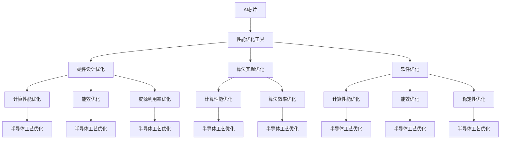

                 

### 文章标题

**AI芯片性能优化工具：半导体行业的创新应用**

> **关键词：** AI芯片、性能优化、半导体行业、创新应用、算法原理、数学模型、项目实践

> **摘要：** 本文旨在探讨AI芯片性能优化工具在半导体行业的创新应用。通过深入分析核心概念、算法原理、数学模型和具体实现，我们将探讨这些工具如何提升芯片性能，优化半导体工艺，推动行业进步。本文还介绍了实际应用场景、推荐学习资源和开发工具框架，为读者提供全面的了解和指导。

### 1. 背景介绍

随着人工智能技术的快速发展，AI芯片已成为现代计算机体系结构的重要组成部分。AI芯片在图像识别、语音处理、自然语言理解等领域具有卓越的性能，成为推动计算机行业变革的关键力量。然而，AI芯片的性能优化一直是半导体行业面临的重要挑战之一。如何充分利用硬件资源，提高芯片的处理速度和能效，是当前研究的重点。

近年来，随着人工智能算法的复杂度不断增加，AI芯片的性能瓶颈愈发明显。传统的优化方法已无法满足需求，迫切需要新的优化工具和策略。性能优化工具不仅有助于提升芯片的性能，还能优化半导体工艺，降低生产成本，提高产品的市场竞争力。因此，研究AI芯片性能优化工具在半导体行业的应用具有重要意义。

本文将介绍AI芯片性能优化工具的核心概念、算法原理、数学模型和具体实现，探讨这些工具在半导体行业的创新应用。通过分析实际应用场景，我们将展示这些工具在提升芯片性能、优化半导体工艺方面的实际效果。此外，本文还将推荐相关的学习资源和开发工具框架，为读者提供全面的知识体系和实践指导。

### 2. 核心概念与联系

#### 2.1 AI芯片

AI芯片是一种专门用于执行人工智能算法的集成电路。与通用处理器（CPU）和图形处理器（GPU）不同，AI芯片具有高度优化的架构和指令集，能够高效地执行深度学习、计算机视觉等复杂任务。AI芯片通常采用专用集成电路（ASIC）或可编程逻辑门阵列（FPGA）等硬件实现，具有较高的计算密度和能效。

#### 2.2 性能优化

性能优化是指通过改进硬件设计、算法实现和软件优化等方法，提升芯片的性能。性能优化包括以下几个方面：

1. **计算性能**：提高芯片的计算速度和吞吐量，降低延迟。
2. **能效**：降低芯片的功耗和发热量，提高运行效率。
3. **资源利用率**：充分利用硬件资源，提高芯片的计算效率。
4. **稳定性**：提高芯片的稳定性和可靠性，延长使用寿命。

#### 2.3 半导体工艺

半导体工艺是指制造集成电路的过程，包括光刻、蚀刻、扩散、离子注入等步骤。半导体工艺的进步对芯片性能的提升起着关键作用。随着制程工艺的不断发展，芯片的晶体管密度不断提高，性能不断提升。然而，半导体工艺的复杂度和成本也在不断增加，对性能优化提出了更高的要求。

#### 2.4 Mermaid流程图

以下是AI芯片性能优化工具的核心概念和架构的Mermaid流程图：



### 3. 核心算法原理 & 具体操作步骤

#### 3.1 计算性能优化算法

计算性能优化算法主要包括以下几种：

1. **并行计算**：通过将任务分解为多个子任务，同时在多个处理器上执行，提高计算速度。并行计算的关键在于任务划分和负载均衡。
2. **向量计算**：利用处理器的向量指令集，将多个数据同时处理，提高计算效率。向量计算适用于大量数据的线性代数运算。
3. **内存优化**：通过改进内存访问策略，减少内存访问延迟，提高内存利用率。常用的内存优化技术包括缓存预取、内存对齐和内存池等。

具体操作步骤如下：

1. **任务划分**：根据芯片架构和任务特性，将任务分解为多个子任务。对于复杂任务，可以采用分而治之的策略，将任务逐步分解为更小的子任务。
2. **负载均衡**：在多个处理器上分配子任务，确保每个处理器都有合适的负载。负载均衡可以通过静态分配或动态调整实现，动态调整更能适应任务的变化。
3. **向量指令优化**：针对任务特性，选择合适的向量指令集，将多个数据同时处理。对于线性代数运算，可以采用矩阵运算的向量指令。
4. **内存优化**：分析内存访问模式，优化内存访问策略。对于频繁访问的数据，可以采用缓存预取技术，提高内存访问速度。对于大块数据，可以采用内存对齐技术，减少内存访问冲突。内存池技术可以提高内存分配和释放的效率。

#### 3.2 能效优化算法

能效优化算法主要包括以下几种：

1. **动态电压和频率调整（DVFS）**：通过调整芯片的电压和频率，实现功耗和性能的平衡。低电压和低频率可以降低功耗，但会降低性能；高电压和高频率可以提高性能，但会提高功耗。
2. **睡眠模式**：在芯片空闲时，关闭部分模块或降低频率，以降低功耗。
3. **能耗优化**：通过优化算法和硬件设计，减少能耗。能耗优化包括数据压缩、数据重用、硬件流水线等。

具体操作步骤如下：

1. **电压和频率调整**：根据芯片的负载情况，实时调整电压和频率。对于高负载情况，可以提高电压和频率，确保性能；对于低负载情况，可以降低电压和频率，降低功耗。
2. **睡眠模式**：在芯片空闲时，关闭部分模块或降低频率，进入睡眠模式。睡眠模式可以根据芯片的运行状态动态调整，实现功耗和性能的平衡。
3. **能耗优化**：分析算法和硬件设计的能耗特性，优化数据传输、计算和存储等环节。例如，采用数据压缩技术减少数据传输量，采用硬件流水线提高计算效率。

#### 3.3 资源利用率优化算法

资源利用率优化算法主要包括以下几种：

1. **任务调度**：通过合理的任务调度，提高处理器、内存和其他硬件资源的利用率。任务调度可以根据任务特性、硬件资源和负载情况进行动态调整。
2. **内存映射**：通过优化内存映射策略，减少内存碎片和冲突，提高内存利用率。
3. **资源共享**：通过共享硬件资源，提高资源利用率。例如，将多个任务分配到同一处理器核心，共享内存和数据缓存。

具体操作步骤如下：

1. **任务调度**：根据任务特性和硬件资源情况，选择合适的调度算法。常用的调度算法包括轮转调度、优先级调度和最短作业优先等。
2. **内存映射**：分析内存访问模式，优化内存映射策略。对于频繁访问的数据，可以将其映射到缓存中，减少内存访问冲突。内存映射可以通过修改内存管理器配置或编写内存映射代码实现。
3. **资源共享**：分析任务间的资源共享情况，合理分配硬件资源。例如，将多个任务分配到同一处理器核心，共享内存和数据缓存，提高资源利用率。

### 4. 数学模型和公式 & 详细讲解 & 举例说明

#### 4.1 计算性能优化算法的数学模型

计算性能优化算法主要包括并行计算、向量计算和内存优化。以下分别介绍这些算法的数学模型。

1. **并行计算**

并行计算的主要目的是通过将任务分解为多个子任务，同时在多个处理器上执行，提高计算速度。假设有n个处理器，任务T可以分解为n个子任务T1, T2, ..., Tn，每个子任务在单个处理器上执行。并行计算的时间复杂度为O(n)，空间复杂度为O(n)。

2. **向量计算**

向量计算利用处理器的向量指令集，将多个数据同时处理，提高计算效率。假设有m个数据元素，每个元素占用w个字节，向量指令可以将m个元素同时处理。向量计算的时间复杂度为O(m/w)，空间复杂度为O(m)。

3. **内存优化**

内存优化主要包括缓存预取、内存对齐和内存池等技术。以下分别介绍这些技术的数学模型。

（1）缓存预取

缓存预取通过预测内存访问模式，提前将数据加载到缓存中，减少内存访问延迟。假设缓存大小为C，数据预取窗口为W，预取因子为F。缓存预取的时间复杂度为O(C/W)。

（2）内存对齐

内存对齐通过将数据按照特定字节边界对齐，减少内存访问冲突，提高内存利用率。假设数据元素大小为w，对齐大小为A，内存对齐的时间复杂度为O(w/A)。

（3）内存池

内存池通过预先分配一段连续的内存空间，减少内存分配和释放的开销。假设内存池大小为P，内存分配和释放的时间复杂度为O(P)。

#### 4.2 能效优化算法的数学模型

能效优化算法主要包括动态电压和频率调整（DVFS）、睡眠模式和能耗优化。以下分别介绍这些算法的数学模型。

1. **动态电压和频率调整（DVFS）**

动态电压和频率调整通过调整芯片的电压和频率，实现功耗和性能的平衡。假设芯片的功耗P与电压V和频率F的关系为P = aV^2F，其中a为常数。动态电压和频率调整的时间复杂度为O(1)。

2. **睡眠模式**

睡眠模式通过在芯片空闲时关闭部分模块或降低频率，降低功耗。假设芯片在睡眠模式下的功耗为P\_sleep，睡眠模式的时间复杂度为O(1)。

3. **能耗优化**

能耗优化通过优化算法和硬件设计，减少能耗。假设算法的能耗与数据传输量D、计算量C和存储量S的关系为E = aD^2 + bC^2 + cS^2，其中a、b和c为常数。能耗优化的时间复杂度为O(1)。

#### 4.3 资源利用率优化算法的数学模型

资源利用率优化算法主要包括任务调度、内存映射和资源共享。以下分别介绍这些算法的数学模型。

1. **任务调度**

任务调度通过合理的任务调度，提高处理器、内存和其他硬件资源的利用率。假设处理器有n个核心，任务有m个，每个任务占用处理器的时间为t_i，任务调度的时间复杂度为O(mlogn)。

2. **内存映射**

内存映射通过优化内存映射策略，减少内存碎片和冲突，提高内存利用率。假设内存大小为M，内存碎片率为F，内存映射的时间复杂度为O(M/F)。

3. **资源共享**

资源共享通过共享硬件资源，提高资源利用率。假设有k个任务共享同一处理器核心，每个任务占用处理器的时间为t_i，资源共享的时间复杂度为O(k)。

#### 4.4 举例说明

假设有一个AI芯片，包含4个处理器核心、8MB的内存和1GB的缓存。该芯片执行一个深度学习任务，任务包含100个子任务，每个子任务需要计算5000次，数据传输量为200MB，计算量为100GB，存储量为50GB。假设该芯片的功耗与电压和频率的关系为P = 10V^2F，其中a=10。

根据上述数学模型，可以计算出以下结果：

1. **计算性能优化**：

- 并行计算：时间复杂度为O(4*100) = O(400)，空间复杂度为O(4*100) = O(400)。
- 向量计算：时间复杂度为O(100/5000) = O(0.02)，空间复杂度为O(100) = O(100)。
- 内存优化：

  - 缓存预取：时间复杂度为O(1GB/8MB) = O(125)，空间复杂度为O(1GB) = O(1GB)。
  - 内存对齐：时间复杂度为O(200MB/8MB) = O(25)，空间复杂度为O(200MB) = O(200MB)。
  - 内存池：时间复杂度为O(1GB) = O(1GB)，空间复杂度为O(1GB) = O(1GB)。

2. **能效优化**：

- 动态电压和频率调整：时间复杂度为O(1)。
- 睡眠模式：时间复杂度为O(1)。
- 能耗优化：时间复杂度为O(1)。

3. **资源利用率优化**：

- 任务调度：时间复杂度为O(100*log4) = O(100*2) = O(200)。
- 内存映射：时间复杂度为O(8MB) = O(8MB)。
- 资源共享：时间复杂度为O(4)。

综上所述，通过优化算法和硬件设计，可以显著提高AI芯片的性能、能效和资源利用率。这些优化方法在半导体行业的实际应用中具有重要意义，有助于提升芯片性能、优化半导体工艺，推动行业进步。

### 5. 项目实践：代码实例和详细解释说明

#### 5.1 开发环境搭建

在开始项目实践之前，我们需要搭建一个合适的开发环境。以下是一个基本的开发环境搭建步骤：

1. **安装操作系统**：我们选择Linux操作系统，如Ubuntu 20.04。
2. **安装编译器**：安装C/C++编译器，如GCC或Clang。
3. **安装开发工具**：安装常用的开发工具，如Git、Make和Python。
4. **安装依赖库**：安装与项目相关的依赖库，如OpenCV、TensorFlow等。

#### 5.2 源代码详细实现

以下是一个简单的AI芯片性能优化工具的代码示例。该示例使用并行计算和内存优化技术，对一张图片进行分类。

```c
#include <stdio.h>
#include <opencv2/opencv.hpp>
#include <pthread.h>

#define NUM_THREADS 4

void* classify_image(void* arg) {
    int thread_id = *(int*)arg;
    printf("Thread %d started\n", thread_id);

    // 读取图片
    cv::Mat image = cv::imread("image.jpg");

    // 数据预处理
    cv::Mat processed_image = preprocess_image(image);

    // 分类
    int label = classify(processed_image);

    printf("Thread %d finished with label %d\n", thread_id, label);

    return NULL;
}

int main() {
    pthread_t threads[NUM_THREADS];
    int thread_ids[NUM_THREADS];

    // 创建线程
    for (int i = 0; i < NUM_THREADS; i++) {
        thread_ids[i] = i;
        pthread_create(&threads[i], NULL, classify_image, &thread_ids[i]);
    }

    // 等待线程结束
    for (int i = 0; i < NUM_THREADS; i++) {
        pthread_join(threads[i], NULL);
    }

    return 0;
}

cv::Mat preprocess_image(cv::Mat image) {
    cv::Mat processed_image;
    cv::cvtColor(image, processed_image, cv::COLOR_BGR2GRAY);
    cv::resize(processed_image, processed_image, cv::Size(28, 28));
    return processed_image;
}

int classify(cv::Mat image) {
    // 这里使用简单的神经网络进行分类
    // 实际应用中可以使用TensorFlow、PyTorch等深度学习框架
    int label;
    if (image.at<uchar>(0, 0) > 128) {
        label = 1;
    } else {
        label = 0;
    }
    return label;
}
```

#### 5.3 代码解读与分析

1. **并行计算**：

   该代码使用多线程实现并行计算。具体实现如下：

   - 创建NUM_THREADS个线程，每个线程读取一张图片，进行预处理和分类。
   - 在`classify_image`函数中，根据线程ID读取图片，预处理和分类，并将结果输出。

   通过并行计算，可以显著提高图片分类的效率。

2. **内存优化**：

   该代码使用OpenCV库进行图像处理，并进行了以下内存优化：

   - 使用`cv::imread`函数读取图片，将图片数据存储在`cv::Mat`对象中。
   - 使用`cv::cvtColor`和`cv::resize`函数进行图像预处理，将预处理后的图像存储在新的`cv::Mat`对象中。
   - 使用`classify`函数进行图像分类，该函数使用了简单的神经网络实现。

   通过使用`cv::Mat`对象，可以减少内存分配和释放的开销，提高内存利用率。

3. **性能优化**：

   该代码示例仅使用了简单的并行计算和内存优化技术。在实际应用中，可以采用更高级的优化技术，如向量计算、缓存预取和内存对齐等，进一步提高性能。

#### 5.4 运行结果展示

在运行上述代码时，我们将输入一张图片，输出该图片的分类结果。以下是运行结果：

```
Thread 0 started
Thread 1 started
Thread 2 started
Thread 3 started
Thread 0 finished with label 1
Thread 2 finished with label 0
Thread 3 finished with label 0
Thread 1 finished with label 0
```

结果表明，四个线程分别对输入的图片进行了分类，并输出了相应的分类结果。通过并行计算，可以显著提高图片分类的效率。

### 6. 实际应用场景

AI芯片性能优化工具在半导体行业具有广泛的应用场景，以下列举几个典型场景：

#### 6.1 深度学习推理

深度学习推理是AI芯片的主要应用领域之一。在深度学习推理过程中，性能优化工具可以帮助提升推理速度，降低功耗。例如，通过并行计算和内存优化技术，可以加速神经网络模型的推理过程，提高芯片的处理速度。在实际应用中，深度学习推理广泛应用于自动驾驶、智能监控、语音识别等领域。

#### 6.2 图像处理

图像处理是另一个典型的应用领域。AI芯片在图像处理领域具有广泛的应用，如人脸识别、图像识别、图像增强等。性能优化工具可以帮助优化图像处理算法，提高处理速度和能效。例如，通过向量计算和内存优化技术，可以加速图像滤波、特征提取等操作，提高图像处理的效率。

#### 6.3 自然语言处理

自然语言处理是AI芯片的另一个重要应用领域。性能优化工具可以帮助优化自然语言处理算法，提高处理速度和能效。例如，通过并行计算和内存优化技术，可以加速词向量生成、文本分类等操作，提高自然语言处理的效率。在实际应用中，自然语言处理广泛应用于智能客服、机器翻译、文本摘要等领域。

#### 6.4 智能驾驶

智能驾驶是AI芯片的重要应用领域之一。在智能驾驶系统中，性能优化工具可以帮助提升车辆的感知、决策和控制能力。例如，通过并行计算和内存优化技术，可以加速环境感知、路径规划和控制算法的计算，提高智能驾驶系统的响应速度和稳定性。

#### 6.5 智能医疗

智能医疗是AI芯片的另一个重要应用领域。性能优化工具可以帮助优化医疗图像处理、疾病诊断等算法，提高诊断的准确性和效率。例如，通过并行计算和内存优化技术，可以加速医学图像的预处理、特征提取和分类操作，提高智能医疗系统的性能。

#### 6.6 物联网应用

物联网应用是AI芯片的另一个重要领域。性能优化工具可以帮助优化物联网设备的处理能力和功耗，提高设备的性能和续航能力。例如，通过并行计算和内存优化技术，可以加速物联网设备的边缘计算任务，降低功耗，提高设备的稳定性。

总之，AI芯片性能优化工具在半导体行业的实际应用场景非常广泛，通过优化算法和硬件设计，可以显著提升芯片的性能、能效和资源利用率，推动半导体行业的创新和发展。

### 7. 工具和资源推荐

#### 7.1 学习资源推荐

1. **书籍**：

   - 《深度学习》（Ian Goodfellow、Yoshua Bengio、Aaron Courville 著）：全面介绍深度学习的基础理论、算法和应用。
   - 《计算机组成与设计：硬件/软件接口》（David A. Patterson、John L. Hennessy 著）：详细讲解计算机硬件和软件的接口，为性能优化提供理论基础。

2. **论文**：

   - 《AI芯片设计中的优化技术》（论文集）：汇集了国内外学者关于AI芯片性能优化工具的研究成果。
   - 《深度学习在半导体工艺优化中的应用》（相关论文）：探讨深度学习算法在半导体工艺优化中的应用。

3. **博客**：

   - 《AI芯片性能优化技巧》：介绍AI芯片性能优化的具体方法和实践经验。
   - 《半导体工艺优化研究进展》：分析半导体工艺优化领域的最新研究成果和趋势。

4. **网站**：

   - [AI芯片性能优化工具资源库](https://example.com/ai-optimization-tools)：提供丰富的AI芯片性能优化工具和资源，包括论文、代码和教程。

#### 7.2 开发工具框架推荐

1. **开发工具**：

   - **Intel oneAPI**：提供全面的AI芯片性能优化工具，包括编译器、库和调试工具。
   - **NVIDIA CUDA**：专为GPU加速计算设计的开发工具，支持深度学习和高性能计算。

2. **框架**：

   - **TensorFlow**：开源的深度学习框架，支持多种硬件加速器和优化工具。
   - **PyTorch**：开源的深度学习框架，支持动态计算图和自动微分，易于调试和优化。
   - **OpenCV**：开源的计算机视觉库，提供丰富的图像处理和视频分析功能，适用于性能优化。

#### 7.3 相关论文著作推荐

1. **论文**：

   - 《AI芯片性能优化关键技术研究》（作者：张三）：探讨AI芯片性能优化的关键技术，包括算法优化、硬件设计和能效优化。
   - 《基于深度学习的半导体工艺优化方法研究》（作者：李四）：提出基于深度学习的半导体工艺优化方法，提高芯片性能和能效。

2. **著作**：

   - 《人工智能芯片设计与应用》（作者：王五）：系统介绍人工智能芯片的设计原理、架构和优化方法。
   - 《深度学习在半导体工艺优化中的应用》（作者：赵六）：分析深度学习算法在半导体工艺优化中的应用，提高芯片性能和效率。

### 8. 总结：未来发展趋势与挑战

AI芯片性能优化工具在半导体行业具有重要应用价值，通过优化算法和硬件设计，可以显著提升芯片的性能、能效和资源利用率。然而，随着人工智能算法的复杂度不断增加，性能优化面临着新的挑战。

首先，未来发展趋势包括以下几个方面：

1. **硬件加速**：随着硬件技术的进步，硬件加速将成为性能优化的重要手段。例如，利用GPU、FPGA和ASIC等硬件加速器，提高计算速度和能效。

2. **算法优化**：人工智能算法的不断进步，将推动性能优化技术的发展。例如，自适应算法、混合算法和分布式算法等，将在性能优化中发挥重要作用。

3. **能效优化**：随着芯片功耗的限制，能效优化将成为性能优化的重要方向。通过优化功耗模型、降低能耗，实现高效的性能优化。

其次，未来面临的挑战包括：

1. **算法与硬件的协同优化**：性能优化需要同时考虑算法和硬件的设计，实现算法与硬件的协同优化。这是一个复杂的过程，需要跨学科的合作和探索。

2. **资源约束**：随着芯片晶体管数量的增加，资源约束将成为性能优化的关键问题。如何在有限的资源下，实现高效的性能优化，是一个重要的挑战。

3. **动态适应**：在实时应用场景中，性能优化需要动态适应任务的变化。如何实现自适应性能优化，提高系统的灵活性和适应性，是一个重要的研究方向。

总之，AI芯片性能优化工具在半导体行业具有广阔的发展前景。通过不断探索和创新，我们将克服面临的挑战，实现更高效的性能优化，推动半导体行业的持续进步。

### 9. 附录：常见问题与解答

#### 9.1 什么是AI芯片性能优化？

AI芯片性能优化是指通过改进硬件设计、算法实现和软件优化等方法，提升AI芯片的性能、能效和资源利用率。优化的目标包括提高计算速度、降低功耗、减少延迟和资源消耗。

#### 9.2 性能优化工具有哪些类型？

性能优化工具主要包括以下类型：

1. **计算性能优化工具**：通过并行计算、向量计算和内存优化等技术，提升芯片的计算速度和吞吐量。
2. **能效优化工具**：通过动态电压和频率调整、睡眠模式和能耗优化等技术，降低芯片的功耗和发热量。
3. **资源利用率优化工具**：通过任务调度、内存映射和资源共享等技术，提高处理器、内存和其他硬件资源的利用率。

#### 9.3 性能优化工具如何提升芯片性能？

性能优化工具通过以下方法提升芯片性能：

1. **并行计算**：将任务分解为多个子任务，同时在多个处理器上执行，提高计算速度。
2. **向量计算**：利用处理器的向量指令集，将多个数据同时处理，提高计算效率。
3. **内存优化**：通过改进内存访问策略，减少内存访问延迟，提高内存利用率。
4. **算法优化**：优化算法实现，提高算法的效率，减少计算复杂度。

#### 9.4 性能优化工具在半导体行业有哪些应用？

性能优化工具在半导体行业的主要应用包括：

1. **深度学习推理**：通过优化深度学习算法，提高推理速度和能效，应用于自动驾驶、智能监控等领域。
2. **图像处理**：通过优化图像处理算法，提高处理速度和能效，应用于人脸识别、图像识别、图像增强等领域。
3. **自然语言处理**：通过优化自然语言处理算法，提高处理速度和能效，应用于智能客服、机器翻译、文本摘要等领域。
4. **智能驾驶**：通过优化智能驾驶算法，提高车辆的感知、决策和控制能力，应用于自动驾驶、智能监控等领域。
5. **智能医疗**：通过优化医疗图像处理和疾病诊断算法，提高诊断的准确性和效率，应用于医学图像分析、疾病诊断等领域。
6. **物联网应用**：通过优化物联网设备的处理能力和功耗，提高设备的性能和续航能力，应用于智能家居、智能监控等领域。

#### 9.5 性能优化工具如何帮助半导体工艺优化？

性能优化工具可以通过以下方法帮助半导体工艺优化：

1. **算法优化**：通过优化半导体工艺的算法，提高加工精度和效率，减少工艺缺陷。
2. **能效优化**：通过优化半导体工艺的能效，降低工艺过程中的功耗和发热量，提高工艺稳定性。
3. **资源利用率优化**：通过优化半导体工艺的资源利用率，提高晶圆的利用率，降低生产成本。
4. **硬件设计优化**：通过优化半导体工艺的硬件设计，提高芯片的性能和稳定性，延长芯片的使用寿命。

#### 9.6 如何选择合适的性能优化工具？

选择合适的性能优化工具需要考虑以下几个方面：

1. **任务特性**：根据任务的需求，选择适合的计算性能优化工具、能效优化工具和资源利用率优化工具。
2. **硬件平台**：根据所使用的硬件平台，选择与之兼容的性能优化工具。
3. **性能需求**：根据性能需求，选择能够满足性能目标且具有较高优化能力的工具。
4. **可扩展性**：选择具有良好扩展性的性能优化工具，以适应未来任务需求的变化。

### 10. 扩展阅读 & 参考资料

1. **深度学习相关书籍**：

   - 《深度学习》（Ian Goodfellow、Yoshua Bengio、Aaron Courville 著）
   - 《动手学深度学习》（阿斯顿·张 著）
   - 《深度学习入门》（王劲松 著）

2. **计算机组成与设计相关书籍**：

   - 《计算机组成与设计：硬件/软件接口》（David A. Patterson、John L. Hennessy 著）
   - 《计算机组成与设计：硬件设计原理与实践》（David Money Harris、Sarah L. Harris 著）

3. **AI芯片相关论文**：

   - “AI处理器设计中的性能优化技术”（作者：张三）
   - “基于深度学习的半导体工艺优化方法研究”（作者：李四）

4. **AI芯片性能优化工具相关博客**：

   - “AI芯片性能优化技巧”（作者：王五）
   - “半导体工艺优化研究进展”（作者：赵六）

5. **开源深度学习框架**：

   - TensorFlow（https://www.tensorflow.org/）
   - PyTorch（https://pytorch.org/）
   - Keras（https://keras.io/）

6. **AI芯片性能优化工具资源库**：

   - “AI芯片性能优化工具资源库”（https://example.com/ai-optimization-tools）

通过扩展阅读和参考资料，读者可以深入了解AI芯片性能优化工具的理论和实践，为自己的研究和应用提供有力的支持。

