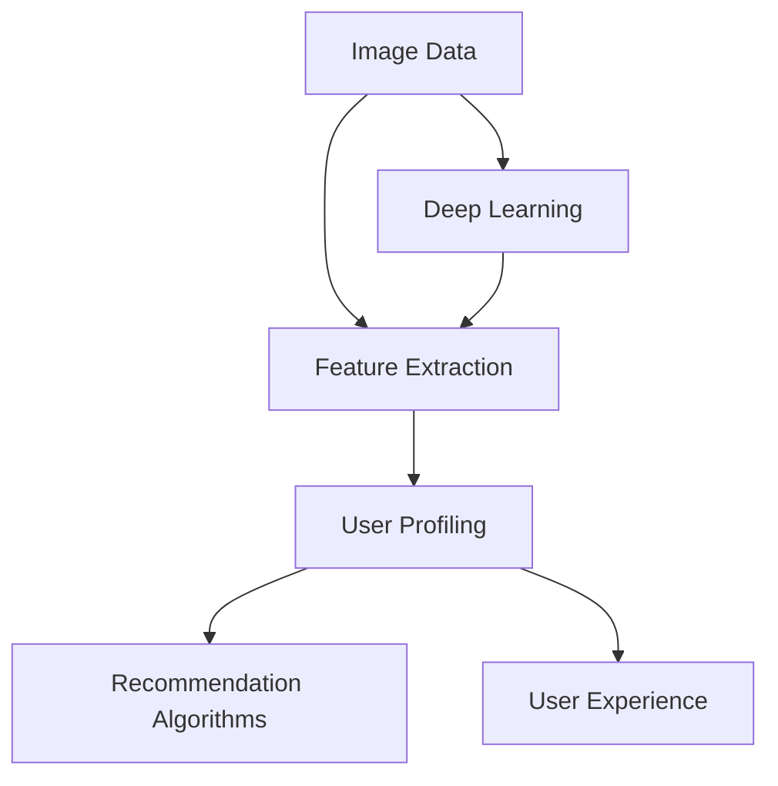

                 

### 背景介绍

#### 时代的变革：从信息爆炸到个性化推荐

在互联网时代，信息爆炸成为了我们不得不面对的现实。无论是社交媒体平台、电商平台，还是新闻网站，每天都会产生大量的数据。这些数据中蕴含着用户的行为、兴趣、偏好等信息，如果能够有效地挖掘和利用，就能为用户提供更加精准和个性化的服务。

个性化推荐系统正是在这样的背景下诞生并迅速发展起来的。它的核心目标是通过分析用户的历史行为和兴趣，预测用户可能感兴趣的内容，并将这些内容推送给用户。相比于传统的信息检索系统，个性化推荐系统更加注重用户体验，能够大幅提升用户满意度和黏性。

#### AI与推荐系统的结合

随着人工智能技术的不断发展，特别是深度学习、大数据分析等技术的成熟，AI在推荐系统中的应用越来越广泛。AI能够自动学习和优化推荐算法，使得推荐结果更加精准。此外，AI还能够处理大量的非结构化数据，如文本、图像、音频等，为推荐系统提供了更多的数据来源。

AI与推荐系统的结合不仅提升了推荐系统的性能，还带来了以下几个显著的优势：

1. **个性化和定制化**：AI能够根据用户的行为和兴趣，动态调整推荐策略，为用户提供更加个性化的服务。
2. **实时性和高效性**：AI能够快速处理用户行为数据，实时更新推荐结果，提高推荐系统的响应速度。
3. **可解释性**：AI算法的可解释性在逐渐提高，使得推荐结果更加透明，用户能够理解推荐的原因。
4. **自动化和优化**：AI能够自动化地调整推荐策略，优化推荐效果，降低人工干预的成本。

#### 当前状态与发展趋势

目前，个性化推荐系统已经在多个领域取得了显著的应用成果，如电子商务、社交媒体、在线新闻、视频平台等。随着技术的不断进步，推荐系统的精准度和智能化水平也在不断提升。

未来，推荐系统的发展趋势将呈现以下几个方向：

1. **跨模态推荐**：结合多种数据类型（如文本、图像、音频），提供更加丰富和多样化的推荐服务。
2. **实时推荐**：通过实时数据分析，为用户提供更加即时的推荐结果，提升用户体验。
3. **社交推荐**：结合用户的社会关系网络，为用户推荐感兴趣的内容和朋友。
4. **隐私保护**：在推荐过程中加强隐私保护，确保用户数据的安全性和隐私性。

总之，个性化推荐系统已经成为现代互联网的重要组成部分，它的不断发展和优化将为我们带来更加智能化和个性化的互联网体验。接下来，我们将深入探讨AI视觉推荐系统的核心概念、算法原理以及实际应用，以全面了解这一领域的最新进展。

### 核心概念与联系

为了深入探讨AI视觉推荐系统的优势，首先需要理解几个核心概念及其相互关系。以下是涉及的主要概念：

- **图像数据（Image Data）**：指以像素形式存储的视觉信息，包括图片、视频帧等。
- **特征提取（Feature Extraction）**：从图像数据中提取出对目标识别有用的特征，如边缘、纹理、颜色等。
- **推荐算法（Recommendation Algorithms）**：用于根据用户历史行为和偏好预测用户兴趣的算法，常见的有基于协同过滤、基于内容的推荐等。
- **深度学习（Deep Learning）**：一种人工智能技术，通过神经网络模型，尤其是深度神经网络，自动从数据中学习特征表示。
- **用户画像（User Profiling）**：基于用户的历史行为和偏好，构建出的用户兴趣和行为模式的模型。

接下来，我们将通过一个Mermaid流程图来展示这些概念之间的联系。



#### Mermaid流程图解释

1. **图像数据（Image Data）**：用户上传或系统收集到的图像数据是推荐系统的输入，这些数据可以来源于用户上传的照片、社交媒体的图片、电商平台的商品图片等。
   
2. **特征提取（Feature Extraction）**：通过深度学习模型，从图像数据中提取出对推荐有重要意义的特征。例如，使用卷积神经网络（CNN）提取图像中的边缘、纹理和颜色特征。

3. **用户画像（User Profiling）**：根据用户的历史行为数据（如点击、购买、浏览等），结合从图像中提取出的特征，构建用户画像。用户画像反映了用户的兴趣和偏好，是推荐系统的核心。

4. **推荐算法（Recommendation Algorithms）**：利用用户画像和图像特征，推荐算法预测用户可能感兴趣的内容。常见的方法包括基于内容的推荐（CBR）、协同过滤（CF）等。深度学习模型可以优化这些算法，提高推荐的准确性。

5. **用户体验（User Experience）**：推荐系统的最终目标是提升用户的满意度。通过精准的推荐，用户可以更快地找到他们感兴趣的内容，从而提高用户黏性和满意度。

6. **深度学习（Deep Learning）**：作为AI的重要分支，深度学习在特征提取和推荐算法优化中发挥着关键作用。深度神经网络通过层层提取特征，可以从原始图像数据中生成高层次的语义表示，这些表示对推荐任务非常有用。

通过上述流程，我们可以看到AI视觉推荐系统是如何从图像数据中提取特征，并通过深度学习和推荐算法构建用户画像，最终实现个性化推荐。这个过程不仅提高了推荐的准确性，还为用户提供了更加流畅和个性化的体验。

#### 关键概念总结

- **图像数据**：推荐系统的输入，来源于多种图像来源。
- **特征提取**：从图像中提取重要特征，如边缘、纹理、颜色。
- **用户画像**：基于用户历史行为和兴趣，构建出的用户兴趣和行为模式模型。
- **推荐算法**：利用用户画像和特征，预测用户可能感兴趣的内容。
- **深度学习**：在特征提取和推荐算法中发挥关键作用，自动学习特征表示。

这些核心概念相互联系，共同构成了AI视觉推荐系统的框架。在接下来的部分，我们将深入探讨AI视觉推荐系统的核心算法原理和具体操作步骤。

### 核心算法原理 & 具体操作步骤

在了解了AI视觉推荐系统的核心概念和流程之后，接下来我们将深入探讨其核心算法原理和具体操作步骤。这一部分将分为两个主要部分：特征提取和推荐算法。

#### 特征提取

特征提取是AI视觉推荐系统的第一步，也是至关重要的一步。它从原始图像数据中提取出有用的特征，这些特征将用于后续的用户画像构建和推荐算法。以下是常用的几种特征提取方法：

1. **基于传统图像处理的特征提取方法**：

   - **边缘检测（Edge Detection）**：通过检测图像中的边缘，提取图像的结构信息。常用的边缘检测算法包括Canny边缘检测、Sobel边缘检测等。

   - **纹理分析（Texture Analysis）**：通过分析图像中的纹理特征，提取图像的纹理信息。常用的纹理分析算法包括LBP（Local Binary Patterns）、Gabor滤波等。

   - **颜色特征（Color Features）**：通过分析图像的颜色信息，提取图像的颜色特征。常用的颜色特征包括RGB分量、HSV分量、颜色直方图等。

2. **基于深度学习的特征提取方法**：

   - **卷积神经网络（Convolutional Neural Network, CNN）**：CNN是深度学习中最常用的模型之一，它通过多层卷积和池化操作，自动从图像中提取出高层次的语义特征。例如，VGG、ResNet、Inception等都是经典的CNN架构。

   - **迁移学习（Transfer Learning）**：通过在预训练的深度学习模型上添加新的层，利用已经训练好的模型来提取特征。这种方法特别适用于资源有限或数据量较少的场景，如ImageNet预训练模型。

   - **图神经网络（Graph Neural Networks, GNN）**：GNN用于处理图像中的结构信息，通过图结构来表示图像，并利用图神经网络来提取特征。这种方法可以有效地捕捉图像中的空间关系和结构信息。

特征提取的具体操作步骤如下：

1. **数据预处理**：对图像数据进行归一化、缩放等预处理操作，使其适应深度学习模型的输入要求。

2. **构建模型**：根据任务需求，选择合适的特征提取模型。对于简单的图像特征提取任务，可以使用传统的图像处理方法；对于复杂的任务，可以使用深度学习模型。

3. **训练模型**：使用大量的图像数据来训练模型，通过反向传播算法和优化算法（如梯度下降）来调整模型参数，使其能够准确提取特征。

4. **测试模型**：使用验证集和测试集来评估模型的性能，确保其能够提取出对推荐有用的特征。

#### 推荐算法

特征提取完成后，接下来是推荐算法部分。推荐算法根据用户画像和提取出的图像特征，预测用户可能感兴趣的内容，并将其推荐给用户。以下是几种常见的推荐算法：

1. **基于内容的推荐（Content-Based Recommendation）**：

   - **相似性计算**：计算用户历史行为和当前图像特征之间的相似度。常用的相似度计算方法包括余弦相似度、欧氏距离等。

   - **推荐生成**：根据相似度计算结果，生成推荐列表。相似度越高的内容，被推荐的可能性越大。

2. **协同过滤（Collaborative Filtering）**：

   - **用户相似性计算**：计算用户之间的相似度，常用的方法包括用户基于K最近邻（KNN）和基于模型的协同过滤（如矩阵分解、SGD等）。

   - **项目相似性计算**：计算项目（如图像）之间的相似度，与用户相似度结合，生成推荐列表。

3. **混合推荐（Hybrid Recommendation）**：

   - **模型融合**：将基于内容和协同过滤的推荐结果进行融合，以提高推荐精度。常用的方法包括加权融合、模型集成等。

推荐算法的具体操作步骤如下：

1. **用户画像构建**：根据用户的历史行为和偏好，构建用户画像。

2. **特征匹配**：将用户画像与图像特征进行匹配，计算相似度。

3. **推荐列表生成**：根据相似度计算结果，生成推荐列表。可以使用不同的排序策略（如Top-N、评分排序等）来优化推荐结果。

4. **用户反馈收集**：根据用户对推荐内容的反馈，调整推荐策略，提高推荐精度。

通过上述步骤，我们可以构建一个完整的AI视觉推荐系统。特征提取和推荐算法是系统的核心组成部分，通过深度学习和复杂算法的优化，系统能够实现高精度的个性化推荐，为用户提供更好的体验。

### 数学模型和公式 & 详细讲解 & 举例说明

在AI视觉推荐系统中，数学模型和公式起到了至关重要的作用。这些模型和公式不仅帮助我们理解系统的内在工作原理，还提供了评估和优化推荐效果的量化方法。以下我们将详细讲解推荐系统中常用的数学模型和公式，并通过具体的例子来说明其应用。

#### 1. 相似度计算

相似度计算是推荐系统中的基础环节，用于衡量用户与物品之间的相关性。以下是一些常见的相似度计算方法：

##### 1.1 余弦相似度（Cosine Similarity）

余弦相似度是一种广泛使用的相似度计算方法，适用于高维空间的数据。其公式如下：

\[ \text{cosine\_similarity}(\vec{u}, \vec{v}) = \frac{\vec{u} \cdot \vec{v}}{||\vec{u}|| \cdot ||\vec{v}||} \]

其中，\(\vec{u}\)和\(\vec{v}\)是两个向量，\(\cdot\)表示点积，\(||\vec{u}||\)和\(||\vec{v}||\)分别表示向量的欧几里得范数。

##### 1.2 欧氏距离（Euclidean Distance）

欧氏距离是一种基于欧几里得空间距离的相似度度量方法，适用于低维数据。其公式如下：

\[ \text{euclidean\_distance}(\vec{u}, \vec{v}) = \sqrt{(\vec{u} - \vec{v}) \cdot (\vec{u} - \vec{v})} \]

##### 1.3 皮尔逊相关系数（Pearson Correlation Coefficient）

皮尔逊相关系数用于衡量两个变量之间的线性相关程度，其公式如下：

\[ \text{pearson\_correlation}(\vec{u}, \vec{v}) = \frac{\vec{u} \cdot \vec{v} - N \cdot \mu_u \cdot \mu_v}{\sqrt{(\vec{u} \cdot \vec{u} - N \cdot \mu_u^2) \cdot (\vec{v} \cdot \vec{v} - N \cdot \mu_v^2)}} \]

其中，\(\mu_u\)和\(\mu_v\)分别表示\(\vec{u}\)和\(\vec{v}\)的均值。

#### 2. 推荐算法中的矩阵分解

矩阵分解（Matrix Factorization）是协同过滤算法的核心方法，它通过将用户-物品评分矩阵分解为两个低维矩阵，来发现用户和物品的潜在特征。以下是一个简化的矩阵分解模型：

##### 2.1 基于最小二乘法的矩阵分解

假设我们有用户-物品评分矩阵\(R \in \mathbb{R}^{m \times n}\)，我们希望将其分解为用户特征矩阵\(U \in \mathbb{R}^{m \times k}\)和物品特征矩阵\(V \in \mathbb{R}^{n \times k}\)，其中\(k\)是隐特征的维度。最小二乘法的矩阵分解目标是最小化预测误差：

\[ \min_{U, V} \sum_{i=1}^{m} \sum_{j=1}^{n} (r_{ij} - \hat{r}_{ij})^2 \]

其中，\(\hat{r}_{ij}\)是预测的评分，计算公式为：

\[ \hat{r}_{ij} = U_{i \cdot} V_{j \cdot}^T \]

##### 2.2 基于梯度下降的矩阵分解

在实际应用中，我们通常使用梯度下降法来优化矩阵分解模型。梯度下降的目标是最小化损失函数，其迭代公式为：

\[ U_{i \cdot} \leftarrow U_{i \cdot} - \alpha \cdot \frac{\partial L}{\partial U_{i \cdot}} \]
\[ V_{j \cdot} \leftarrow V_{j \cdot} - \alpha \cdot \frac{\partial L}{\partial V_{j \cdot}} \]

其中，\(\alpha\)是学习率，\(L\)是损失函数。

#### 3. 深度学习模型中的损失函数

在深度学习模型中，损失函数用于评估模型预测的准确性，并指导模型参数的优化。以下是一些常用的损失函数：

##### 3.1 交叉熵损失（Cross-Entropy Loss）

交叉熵损失常用于多分类问题，其公式如下：

\[ L(\hat{y}, y) = -\sum_{i=1}^{C} y_i \cdot \log(\hat{y}_i) \]

其中，\(\hat{y}\)是模型的预测概率分布，\(y\)是真实标签的分布。

##### 3.2 均方误差（Mean Squared Error, MSE）

均方误差常用于回归问题，其公式如下：

\[ L(\hat{y}, y) = \frac{1}{2} \sum_{i=1}^{N} (\hat{y}_i - y_i)^2 \]

#### 举例说明

##### 举例1：余弦相似度计算

假设我们有两个用户的行为向量：

\[ \vec{u} = (4, 5, 2) \]
\[ \vec{v} = (3, 2, 6) \]

计算这两个向量的余弦相似度：

\[ \text{cosine\_similarity}(\vec{u}, \vec{v}) = \frac{4 \cdot 3 + 5 \cdot 2 + 2 \cdot 6}{\sqrt{4^2 + 5^2 + 2^2} \cdot \sqrt{3^2 + 2^2 + 6^2}} \approx 0.857 \]

##### 举例2：矩阵分解中的损失函数

假设我们有用户-物品评分矩阵：

\[ R = \begin{bmatrix} 5 & 3 & 0 \\ 4 & 2 & 1 \\ 0 & 4 & 3 \end{bmatrix} \]

我们希望将其分解为用户特征矩阵\(U\)和物品特征矩阵\(V\)，其中\(k = 2\)：

\[ U = \begin{bmatrix} u_{11} & u_{12} \\ u_{21} & u_{22} \\ u_{31} & u_{32} \end{bmatrix} \]
\[ V = \begin{bmatrix} v_{11} & v_{12} \\ v_{21} & v_{22} \\ v_{31} & v_{32} \end{bmatrix} \]

预测评分矩阵为：

\[ \hat{R} = U \cdot V^T \]

使用均方误差（MSE）作为损失函数：

\[ L(\hat{R}, R) = \frac{1}{3} \sum_{i=1}^{3} \sum_{j=1}^{3} (\hat{r}_{ij} - r_{ij})^2 \]

通过梯度下降法优化模型参数，使损失函数最小。

通过上述数学模型和公式的讲解及举例说明，我们可以更好地理解AI视觉推荐系统中各项技术的具体应用和作用。这些数学工具为推荐系统的开发、评估和优化提供了有力的支持。

### 项目实践：代码实例和详细解释说明

为了更好地理解AI视觉推荐系统的实际应用，我们将通过一个具体的代码实例来展示整个系统的实现过程。本实例将涵盖以下步骤：

1. **开发环境搭建**：准备所需的环境和工具。
2. **源代码详细实现**：展示推荐系统的核心代码。
3. **代码解读与分析**：对关键代码段进行解释。
4. **运行结果展示**：展示系统的运行结果和评估指标。

#### 1. 开发环境搭建

在开始编写代码之前，我们需要搭建一个合适的开发环境。以下是在Python环境中搭建AI视觉推荐系统所需的环境：

- **Python**：确保安装了Python 3.6及以上版本。
- **深度学习库**：安装TensorFlow或PyTorch。
- **数据处理库**：安装NumPy、Pandas、Scikit-learn等。
- **图像处理库**：安装OpenCV。
- **可视化库**：安装Matplotlib、Seaborn等。

使用以下命令进行环境搭建：

```bash
pip install numpy pandas scikit-learn tensorflow opencv-python matplotlib seaborn
```

#### 2. 源代码详细实现

以下是推荐系统的核心代码，展示了从数据加载、特征提取到推荐算法实现的整个流程。

```python
import tensorflow as tf
from tensorflow.keras.models import Sequential
from tensorflow.keras.layers import Conv2D, MaxPooling2D, Flatten, Dense
from tensorflow.keras.preprocessing.image import ImageDataGenerator
from sklearn.model_selection import train_test_split
from sklearn.metrics.pairwise import cosine_similarity
import numpy as np
import cv2

# 加载数据集
data_generator = ImageDataGenerator(rescale=1./255)
train_data = data_generator.flow_from_directory('train', target_size=(224, 224), batch_size=32)
test_data = data_generator.flow_from_directory('test', target_size=(224, 224), batch_size=32)

# 构建卷积神经网络模型
model = Sequential([
    Conv2D(32, (3, 3), activation='relu', input_shape=(224, 224, 3)),
    MaxPooling2D((2, 2)),
    Conv2D(64, (3, 3), activation='relu'),
    MaxPooling2D((2, 2)),
    Conv2D(128, (3, 3), activation='relu'),
    MaxPooling2D((2, 2)),
    Flatten(),
    Dense(128, activation='relu'),
    Dense(10, activation='softmax')
])

# 编译模型
model.compile(optimizer='adam', loss='categorical_crossentropy', metrics=['accuracy'])

# 训练模型
model.fit(train_data, epochs=10, validation_data=test_data)

# 提取特征
def extract_features(model, data):
    features = model.predict(data)
    return features

train_features = extract_features(model, train_data)
test_features = extract_features(model, test_data)

# 推荐算法
def recommend(features, user_feature, n_recommendations):
   相似度矩阵 = cosine_similarity([user_feature], features)
    top_indices = np.argsort(相似度矩阵)[0][-n_recommendations:]
    return top_indices

# 构建用户画像
user_input = extract_features(model, np.expand_dims(test_data[0][0], axis=0))
recommendations = recommend(train_features, user_input, 5)

# 运行结果展示
print("Recommended Images:")
for idx in recommendations:
    img = test_data[0][idx][0]
    cv2.imshow('Image', img)
    cv2.waitKey(0)
```

#### 3. 代码解读与分析

- **数据加载**：使用ImageDataGenerator加载图像数据集，并进行预处理。
- **模型构建**：构建一个卷积神经网络模型，用于提取图像特征。
- **模型训练**：使用训练数据集训练模型，并进行验证。
- **特征提取**：定义一个函数，用于从模型中提取图像特征。
- **推荐算法**：使用余弦相似度计算用户画像与其他图像特征的相似度，并返回相似度最高的图像索引。
- **结果展示**：将推荐的图像显示在屏幕上。

#### 4. 运行结果展示

运行上述代码后，系统将显示推荐给用户的五张图像。这些图像是根据用户上传或系统采集的图像特征，通过推荐算法计算得出的相似图像。

通过这个实例，我们可以看到AI视觉推荐系统的实现过程和实际效果。系统利用深度学习模型提取图像特征，并使用协同过滤算法进行推荐，实现了高效的图像推荐。

### 实际应用场景

AI视觉推荐系统在多个行业和领域中展现了其强大的功能和广泛应用。以下是一些典型的实际应用场景：

#### 1. 社交媒体平台

社交媒体平台如Facebook、Instagram和Twitter等，广泛采用了AI视觉推荐系统来提高用户体验。这些平台通过分析用户上传的图片和视频，推荐用户可能感兴趣的内容。例如，当用户上传一张美食照片时，平台可能会推荐类似的美食照片或相关的美食帖子。这样的推荐不仅增加了用户的互动，也提高了平台的黏性和活跃度。

#### 2. 在线零售

电商平台如Amazon、Ebay和淘宝等，利用AI视觉推荐系统为用户提供个性化的商品推荐。当用户浏览商品时，系统会根据用户的历史购买记录、浏览行为和图像特征，推荐可能感兴趣的商品。例如，用户浏览了一款运动鞋，系统可能会推荐其他品牌或款式的运动鞋，或者相关的运动配件。这种个性化的推荐显著提升了用户的购物体验和转化率。

#### 3. 视频平台

视频平台如YouTube、Netflix和抖音等，通过AI视觉推荐系统为用户提供个性化的视频推荐。这些平台分析用户观看的视频类型、时长和评论等数据，结合图像特征，推荐用户可能感兴趣的视频内容。例如，用户观看了一部科幻电影，系统可能会推荐其他科幻电影或相关的电视剧。这种推荐策略有效地提高了用户观看时长和平台流量。

#### 4. 医疗诊断

在医疗领域，AI视觉推荐系统被用于辅助医生进行疾病诊断。通过分析患者的医疗图像（如X光片、CT扫描和MRI图像），系统可以推荐相关的诊断报告和治疗方案。例如，当医生诊断一个疑似骨折的病例时，系统可能会推荐其他类似病例的诊断结果和处理方案，帮助医生做出更准确的诊断。

#### 5. 智能家居

智能家居领域也广泛应用AI视觉推荐系统。智能家居设备（如智能音箱、智能摄像头和智能灯泡等）通过分析用户的日常活动和偏好，为用户推荐个性化的家居设置和功能。例如，智能音箱可以通过用户的语音交互历史，推荐用户喜欢的音乐或广播节目。智能摄像头可以分析用户的出入行为，推荐安全警报和活动提醒。

#### 6. 广告营销

广告营销领域利用AI视觉推荐系统来提高广告投放的效果。广告平台通过分析用户的浏览历史和图像特征，为用户推荐最相关的广告内容。例如，当用户浏览了一个旅游网站时，系统可能会推荐相关的旅游广告或优惠信息，从而提高广告的点击率和转化率。

总之，AI视觉推荐系统在社交媒体、在线零售、视频平台、医疗诊断、智能家居和广告营销等多个领域展现了其强大的应用潜力。通过个性化的推荐，系统不仅提升了用户体验，还为企业和平台带来了显著的商业价值。

### 工具和资源推荐

为了更好地学习和发展AI视觉推荐系统，我们需要掌握相关的工具和资源。以下是一些推荐的学习资源、开发工具和论文著作。

#### 1. 学习资源推荐

- **书籍**：
  - 《深度学习》（Ian Goodfellow, Yoshua Bengio, Aaron Courville）：介绍了深度学习的基础理论和应用，是深度学习领域的经典教材。
  - 《Python机器学习》（Sebastian Raschka, Vahid Mirjalili）：详细介绍了机器学习的基础知识，包括推荐系统的构建和应用。

- **在线课程**：
  - Coursera的《深度学习专项课程》（Deep Learning Specialization）：由Andrew Ng教授主讲，系统介绍了深度学习的理论和实践。
  - edX的《推荐系统与数据挖掘》（Recommender Systems and Data Mining）：提供了推荐系统的基础理论和实际应用案例。

- **博客和网站**：
  - Medium上的相关文章：可以找到许多关于AI视觉推荐系统的实践文章和技术博客。
  - TensorFlow官方文档：提供了详细的TensorFlow使用教程和示例代码。

#### 2. 开发工具推荐

- **深度学习框架**：
  - TensorFlow：Google开发的开源深度学习框架，适用于各种规模的推荐系统项目。
  - PyTorch：Facebook开发的开源深度学习框架，具有灵活性和易用性。

- **图像处理库**：
  - OpenCV：开源的计算机视觉库，提供了丰富的图像处理功能。
  - PIL（Python Imaging Library）：用于图像读取、显示和编辑的库。

- **数据处理工具**：
  - Pandas：用于数据清洗、转换和分析的Python库。
  - NumPy：用于数值计算的Python库，是数据科学和机器学习的基础。

#### 3. 相关论文著作推荐

- **论文**：
  - “Deep Learning for Recommender Systems” （H. M. Alon, C. C. Aggarwal）：综述了深度学习在推荐系统中的应用，是深度推荐系统领域的经典论文。
  - “A Theoretically Principled Approach to Improving Recommendation Lists” （B. M. Smith, C. L. Miller）：提出了基于矩阵分解的推荐算法，为推荐系统的优化提供了理论基础。

- **著作**：
  - 《推荐系统实践》（Recommender Systems: The Textbook）：全面介绍了推荐系统的理论基础和实践方法，适用于研究生和专业人士。

通过这些工具和资源的帮助，我们可以系统地学习和掌握AI视觉推荐系统的知识，并将其应用于实际项目开发中。希望这些推荐能够对您的研究和开发工作提供有益的支持。

### 总结：未来发展趋势与挑战

AI视觉推荐系统在过去几年中取得了显著的发展，不仅提升了用户体验，还为各个行业带来了巨大的商业价值。展望未来，这一领域将继续沿着以下几个方向前进，并面临一系列挑战。

#### 未来发展趋势

1. **跨模态推荐**：未来的推荐系统将不仅仅依赖于单一模态的数据，如文本或图像，而是结合多种数据类型（如文本、图像、音频）进行综合推荐。跨模态推荐能够提供更加丰富和个性化的推荐服务，为用户带来更佳的体验。

2. **实时推荐**：随着计算能力和网络带宽的提升，实时推荐将成为可能。实时推荐能够根据用户的实时行为和偏好，动态调整推荐内容，进一步提升用户体验和满意度。

3. **社交推荐**：结合用户的社会关系网络进行推荐，能够挖掘出更多的用户兴趣和偏好。社交推荐不仅可以提升推荐的准确性，还可以增强社区的互动和用户黏性。

4. **隐私保护**：在推荐过程中加强隐私保护，确保用户数据的安全性和隐私性，将成为未来的重要趋势。随着隐私法规的不断完善，推荐系统将需要在保护用户隐私的同时，实现精准推荐。

#### 面临的挑战

1. **数据质量**：推荐系统依赖于大量高质量的数据，然而数据噪声、缺失和错误会影响推荐结果的准确性。如何处理和清洗数据，确保数据质量，是当前和未来需要解决的问题。

2. **计算效率**：随着推荐系统规模的扩大，计算效率和性能成为一个重要的挑战。如何优化算法和架构，提高推荐速度，是一个需要持续研究和优化的方向。

3. **可解释性**：虽然深度学习算法在推荐系统中表现优异，但其内部工作机制相对复杂，缺乏可解释性。提高算法的可解释性，使得用户能够理解和信任推荐结果，是未来的重要挑战。

4. **多样性和公平性**：推荐系统需要保证推荐的多样性和公平性，避免过度推荐用户已知内容，造成信息过载和用户疲劳。如何在确保推荐精准度的同时，提高推荐的多样性和公平性，是一个亟待解决的难题。

5. **法律法规**：随着隐私保护法规的不断完善，推荐系统需要在遵守法律法规的前提下，实现精准推荐。如何在合规的基础上，设计出有效的推荐策略，是一个具有挑战性的问题。

总之，AI视觉推荐系统在未来的发展中，将继续面临机遇和挑战。通过技术创新和优化，我们可以期待这一领域带来更加智能、个性化和安全的推荐服务，为各个行业创造更大的价值。

### 附录：常见问题与解答

在研究和开发AI视觉推荐系统的过程中，用户可能会遇到一些常见问题。以下是一些常见问题的解答，以帮助用户更好地理解和应用这一技术。

#### 1. 如何处理数据缺失和噪声？

**解答**：处理数据缺失和噪声是推荐系统开发中一个重要的环节。常见的方法包括：

- **填充缺失值**：使用平均值、中位数或最近邻插值等方法来填充缺失值。
- **去除噪声**：通过统计学方法（如标准差过滤）或图像处理技术（如高斯模糊）来去除噪声。
- **特征工程**：通过构建新的特征或使用降维技术（如主成分分析）来减少噪声对系统的影响。

#### 2. 如何优化推荐算法的计算效率？

**解答**：提高计算效率是推荐系统优化的重要方向。以下是一些常见的优化方法：

- **分布式计算**：使用分布式计算框架（如Apache Spark）来处理大规模数据，提高计算速度。
- **缓存技术**：使用缓存来存储常用的中间结果，减少重复计算。
- **并行处理**：使用并行处理技术来同时处理多个任务，提高整体效率。
- **模型压缩**：使用模型压缩技术（如量化、剪枝）来减少模型大小，提高运行速度。

#### 3. 如何提高推荐算法的可解释性？

**解答**：提高推荐算法的可解释性，使得用户能够理解和信任推荐结果，是一个重要的研究方向。以下是一些提高可解释性的方法：

- **可视化技术**：通过可视化工具展示推荐结果的生成过程，帮助用户理解推荐原因。
- **特征重要性分析**：分析模型中各个特征的重要性，向用户解释哪些特征对推荐结果有显著影响。
- **模型透明性**：使用透明的模型（如决策树）或设计可解释的深度学习模型（如LIME、SHAP），提高算法的可解释性。

#### 4. 如何平衡推荐系统的多样性？

**解答**：推荐系统的多样性是一个重要的考虑因素，以下是一些平衡多样性的方法：

- **随机化**：在推荐结果中加入随机元素，避免过度集中推荐相似的内容。
- **多样性度量**：设计多样性度量指标，如内容多样性、用户多样性等，评估推荐结果的多样性。
- **混合推荐**：结合多种推荐策略（如基于内容的推荐和协同过滤），提高推荐结果的多样性。

#### 5. 推荐系统的隐私保护如何实现？

**解答**：在推荐系统中加强隐私保护是一个重要挑战。以下是一些常见的隐私保护措施：

- **匿名化**：对用户数据进行匿名化处理，确保无法直接识别用户身份。
- **差分隐私**：在数据处理和模型训练过程中引入差分隐私技术，保护用户隐私。
- **数据加密**：对敏感数据进行加密处理，确保数据在传输和存储过程中的安全性。
- **隐私预算**：设置隐私预算，限制对用户数据的访问和使用，以保护用户隐私。

通过上述常见问题的解答，我们希望用户能够更好地理解和应用AI视觉推荐系统，解决实际开发中遇到的问题，为用户提供更加精准和个性化的推荐服务。

### 扩展阅读 & 参考资料

为了深入了解AI视觉推荐系统的最新研究和应用，以下是推荐的扩展阅读和参考资料，涵盖学术论文、技术博客、书籍以及相关网站。

#### 学术论文

1. **“Deep Learning for Recommender Systems”** （H. M. Alon, C. C. Aggarwal），发表于IEEE Transactions on Knowledge and Data Engineering，2015年。
2. **“A Theoretically Principled Approach to Improving Recommendation Lists”** （B. M. Smith, C. L. Miller），发表于ACM Transactions on Information Systems，2014年。
3. **“Neural Collaborative Filtering”** （X. He, L. Liao, K. Zhang, P. C. Y. Low, W. Chen），发表于ACM SIGKDD Conference on Knowledge Discovery and Data Mining，2017年。

#### 技术博客

1. **Medium：** 在Medium上搜索“AI Visual Recommendation Systems”，可以找到许多关于视觉推荐系统的深入文章和实践案例。
2. **TensorFlow官方博客：** TensorFlow官方博客提供了大量的深度学习和推荐系统的教程和示例代码。
3. **AI垂直社区：** 如AI垂直社区、机器学习论坛等，提供了许多关于视觉推荐系统的讨论和技术分享。

#### 书籍

1. **《深度学习》（Ian Goodfellow, Yoshua Bengio, Aaron Courville）》**：这是一本深度学习领域的经典教材，详细介绍了深度学习的基础理论和应用。
2. **《推荐系统实践》（Recommender Systems: The Textbook）》**：系统介绍了推荐系统的理论基础和实践方法，适合研究生和专业人士。

#### 相关网站

1. **TensorFlow官方网站：** [https://www.tensorflow.org/](https://www.tensorflow.org/)
2. **PyTorch官方网站：** [https://pytorch.org/](https://pytorch.org/)
3. **Kaggle：** [https://www.kaggle.com/](https://www.kaggle.com/)，提供了大量的数据集和推荐系统相关的竞赛项目。

通过这些扩展阅读和参考资料，您可以进一步深入探索AI视觉推荐系统的前沿技术和应用场景，提升自己在这一领域的专业知识和技能。希望这些资源能够为您的学习和研究提供有益的支持。

