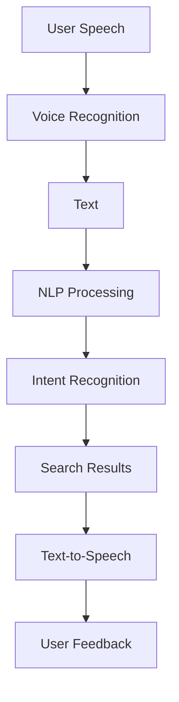

                 

### 1. 背景介绍

AI语音搜索技术作为人工智能领域的重要分支，近年来得到了飞速发展。随着智能手机、智能家居和智能穿戴设备的普及，语音交互已经成为人们日常生活中的重要交互方式。而AI语音搜索技术作为实现语音交互的核心技术之一，其便捷性直接决定了用户的使用体验。

#### 1.1 技术发展历程

AI语音搜索技术的发展可以追溯到20世纪80年代，当时主要是基于规则和模板匹配的方法。随着计算能力的提升和算法的改进，语音识别技术逐渐从单音节识别发展到多音节、多语言识别。同时，自然语言处理（NLP）技术的发展也为语音搜索提供了更丰富的语义理解能力。

进入21世纪，深度学习和神经网络技术的引入，使得语音识别的准确率大幅提升，语音搜索技术逐渐从实验室走向了实际应用。目前，AI语音搜索技术已经广泛应用于搜索引擎、智能助手、智能家居等领域。

#### 1.2 技术现状与应用场景

目前，AI语音搜索技术在搜索领域的应用已经非常成熟。以搜索引擎为例，用户可以通过语音输入关键词，系统会自动解析用户的语音信息，并将其转换为文本进行搜索。这种交互方式不仅提高了搜索效率，还降低了用户操作复杂度。

除了搜索领域，AI语音搜索技术还在智能助手、智能家居、智能客服等领域得到了广泛应用。智能助手如Siri、Alexa、小爱同学等，可以通过语音指令完成各种任务，如查询天气、设定闹钟、播放音乐等。智能家居设备如智能音箱、智能灯泡等，也可以通过语音控制实现远程操控。

#### 1.3 技术发展趋势

未来，AI语音搜索技术将继续朝着高准确率、高效率、多语言、多场景方向不断发展。随着5G网络的普及和物联网技术的发展，语音搜索将更加便捷，应用场景也将更加广泛。此外，多模态交互（语音+手势+视觉）的发展，也将进一步提升用户的交互体验。

在技术层面，深度学习、生成对抗网络（GAN）、迁移学习等技术的应用，将进一步提高语音搜索的准确率和效率。同时，语音识别与自然语言处理技术的融合，也将使得语音搜索能够更好地理解用户的意图，提供更精准的服务。

总的来说，AI语音搜索技术在未来几年将保持快速增长，其便捷性和智能性将不断提升，为人们的生活带来更多便利。本文将详细介绍AI语音搜索技术的核心原理、算法模型、实际应用案例，并探讨其未来发展趋势和挑战。

### 2. 核心概念与联系

要理解AI语音搜索技术，我们需要先了解几个核心概念，包括语音识别、自然语言处理、语音合成等。这些概念不仅是AI语音搜索技术的基础，也是其实现便捷性的关键。以下是这些核心概念的简要介绍及其在语音搜索中的作用。

#### 2.1 语音识别（Speech Recognition）

语音识别是将语音信号转换为文本信息的过程。其核心任务是识别出语音中的词汇和句子结构。语音识别技术可以应用于语音助手、语音搜索、语音翻译等场景。在AI语音搜索技术中，语音识别是第一步，它将用户的语音输入转换为可处理的文本数据。

#### 2.2 自然语言处理（Natural Language Processing, NLP）

自然语言处理是使计算机能够理解、解释和生成人类语言的技术。NLP涵盖了文本分析、语义理解、情感分析等多个方面。在AI语音搜索技术中，NLP用于对识别出的文本信息进行深入处理，以理解用户的意图和需求，从而提供更加准确的搜索结果。

#### 2.3 语音合成（Text-to-Speech, TTS）

语音合成是将文本信息转换为语音信号的技术。语音合成在AI语音搜索技术中主要用于向用户提供搜索结果的语音反馈。通过语音合成技术，用户无需查看屏幕，即可听到搜索结果，提高了搜索的便捷性。

#### 2.4 三者之间的联系

语音识别、自然语言处理和语音合成在AI语音搜索技术中紧密相连，共同构成了一个完整的语音交互流程。

1. **语音识别**：首先，用户的语音输入通过语音识别技术被转换为文本。
2. **自然语言处理**：转换后的文本信息通过NLP技术进行处理，理解用户的意图和需求。
3. **语音合成**：根据处理结果，生成语音反馈，并通过语音合成技术转换为语音信号。

下面是一个简单的Mermaid流程图，展示了这三个核心概念在语音搜索中的作用和联系：



在这个流程图中，用户首先发出语音指令（A），然后通过语音识别（B）将语音转换为文本（C）。文本信息经过自然语言处理（D），识别用户的意图和需求（E），并根据这些信息搜索结果（F）。最后，通过语音合成（G）将搜索结果转换为语音反馈，提供给用户（H）。

通过对这些核心概念和其联系的理解，我们可以更好地把握AI语音搜索技术的本质，为后续算法原理和实际应用的探讨打下基础。

### 3. 核心算法原理 & 具体操作步骤

AI语音搜索技术的实现依赖于一系列先进的算法，这些算法协同工作，确保系统能够准确理解用户的语音输入，并提供精准的搜索结果。以下是AI语音搜索技术的核心算法原理及具体操作步骤：

#### 3.1 语音识别算法

语音识别是AI语音搜索技术的第一步，其核心任务是识别语音中的词汇和句子结构。目前，语音识别技术主要基于深度学习模型，特别是卷积神经网络（CNN）和递归神经网络（RNN）。

**操作步骤：**
1. **预处理**：对语音信号进行预处理，包括降噪、分帧、加窗等，以提高信号质量。
2. **特征提取**：利用深度学习模型提取语音信号的特征，如频谱特征、倒谱特征等。
3. **解码**：利用RNN或CNN模型对提取的特征进行解码，生成对应的文本。

**具体算法：**
- **深度神经网络（DNN）**：DNN通过多层神经网络结构对输入数据进行非线性变换，用于特征提取。
- **循环神经网络（RNN）**：RNN能够处理序列数据，通过对序列的递归处理，实现对语音的逐帧识别。

#### 3.2 自然语言处理算法

自然语言处理（NLP）是理解用户意图和需求的关键环节。NLP算法主要包括词法分析、句法分析、语义分析和意图识别。

**操作步骤：**
1. **词法分析**：对文本进行分词，将文本分解为单个词汇。
2. **句法分析**：构建文本的句法结构，理解句子的语法规则。
3. **语义分析**：通过对文本的上下文信息进行分析，理解文本的含义。
4. **意图识别**：根据用户的输入，识别用户的目的或需求。

**具体算法：**
- **词向量模型（Word Embedding）**：将词汇映射到高维空间中的向量，以捕捉词汇的语义信息。
- **长短期记忆网络（LSTM）**：LSTM能够处理长序列数据，适用于句法分析和语义分析。
- **双向长短期记忆网络（BiLSTM）**：BiLSTM结合了前向和后向LSTM的特性，能够更准确地捕捉句子的语义信息。

#### 3.3 语音合成算法

语音合成是将文本信息转换为自然流畅的语音信号的过程。目前，语音合成主要采用文本到语音（TTS）技术。

**操作步骤：**
1. **声学模型**：学习语音信号与文本之间的映射关系，生成语音特征。
2. **语音合成**：根据文本和声学模型，生成语音信号。
3. **音频处理**：对生成的语音信号进行后处理，如音高、语速、音调等调整。

**具体算法：**
- **深度神经网络合成（DNN-based TTS）**：DNN-based TTS利用深度学习模型直接将文本转换为语音特征。
- **循环神经网络合成（RNN-based TTS）**：RNN-based TTS通过递归神经网络生成语音特征，再通过 vocoder 转换为语音信号。

#### 3.4 整体流程

AI语音搜索技术的整体流程可以概括为以下几个步骤：
1. **语音输入**：用户发出语音指令。
2. **语音识别**：语音识别算法将语音转换为文本。
3. **自然语言处理**：NLP算法对文本进行分析，理解用户意图。
4. **搜索结果生成**：根据用户意图，生成相应的搜索结果。
5. **语音合成**：将搜索结果转换为语音信号，反馈给用户。

通过上述核心算法和操作步骤，AI语音搜索技术能够实现高准确率、高效率的语音交互，为用户提供便捷的搜索体验。

### 4. 数学模型和公式 & 详细讲解 & 举例说明

在AI语音搜索技术中，数学模型和公式是理解和实现核心算法的基础。以下是几个关键的数学模型和公式，以及它们的详细解释和举例说明。

#### 4.1 语音识别中的特征提取

语音识别中的特征提取是利用数学模型从语音信号中提取出对语音识别有用的信息。常用的特征提取模型包括梅尔频率倒谱系数（MFCC）和滤波器组（Filter Banks）。

**4.1.1 梅尔频率倒谱系数（MFCC）**

梅尔频率倒谱系数（MFCC）是一种广泛应用于语音信号处理的技术，它能够有效地捕捉语音信号中的频率信息。

**公式：**
\[ MFCC = \text{Cepstral Coefficients of } \text{Log-Mel Filter Bank Outputs} \]

**步骤：**
1. **预处理**：将语音信号进行分帧和加窗处理。
2. **滤波器组**：通过梅尔滤波器组对每个帧进行滤波，得到频谱。
3. **对数变换**：对频谱进行对数变换，以减少噪声的影响。
4. **倒谱变换**：对对数频谱进行离散余弦变换，得到MFCC系数。

**举例：**
假设一个语音信号经过处理得到10个频谱，通过梅尔滤波器组和倒谱变换，可以得到10个MFCC系数。

#### 4.2 自然语言处理中的词向量模型

词向量模型是一种将词汇映射到高维空间中的技术，它能够捕捉词汇的语义信息。

**4.2.1 词袋模型（Bag of Words, BoW）**

词袋模型是一种简单的文本表示方法，它将文本分解为词汇，并统计每个词汇出现的频率。

**公式：**
\[ \text{TF} = \frac{\text{Number of times the word } w \text{ appears in the document}}{\text{Total number of words in the document}} \]

**举例：**
假设一个文档中有两个句子：“我想要一只猫”和“猫是一种宠物”。通过词袋模型，我们可以得到词汇“我”，“要”，“一只”，“猫”和“宠物”，并计算每个词汇的词频。

#### 4.2.2 投影窗口（Context Window）

在词向量模型中，投影窗口用于捕捉词汇的上下文信息。

**公式：**
\[ \text{Context Window} = \{ w_{t-k}, w_{t-1}, w_{t}, w_{t+1}, w_{t+k} \} \]

**举例：**
假设我们使用3个单词的投影窗口，对于单词“猫”，它的上下文包括“我想要”，“一只”，“宠物”。

#### 4.3 深度学习中的损失函数

在深度学习模型中，损失函数用于衡量预测值与实际值之间的差异，以指导模型优化。

**4.3.1 交叉熵损失函数（Cross-Entropy Loss）**

交叉熵损失函数是常用的损失函数之一，用于分类问题。

**公式：**
\[ H(y, \hat{y}) = -\sum_{i} y_i \log(\hat{y}_i) \]

其中，\( y \) 是实际标签，\( \hat{y} \) 是预测概率。

**举例：**
假设有一个二分类问题，实际标签为 [1, 0]，预测概率为 [0.7, 0.3]。通过交叉熵损失函数计算损失为 \( H([1, 0], [0.7, 0.3]) = -[1 \times \log(0.7) + 0 \times \log(0.3)] \)。

#### 4.3.2 递归神经网络（RNN）的损失函数

在RNN中，损失函数通常用于序列到序列的预测问题。

**公式：**
\[ L = -\sum_{t} y_t \log(p(\hat{y}_t | \text{context})) \]

其中，\( y_t \) 是序列中的实际标签，\( \hat{y}_t \) 是预测概率，\( \text{context} \) 是序列的上下文信息。

**举例：**
假设在语音识别任务中，每个时间步的预测标签是“猫”，“是一种”，“宠物”。对应的预测概率为 [0.8, 0.1, 0.1]。通过计算，可以得到损失 \( L = -[1 \times \log(0.8) + 0 \times \log(0.1) + 0 \times \log(0.1)] \)。

通过这些数学模型和公式的讲解，我们可以更深入地理解AI语音搜索技术的核心算法。这些模型不仅为语音识别、自然语言处理和语音合成提供了理论基础，也为实际应用中的算法优化提供了指导。

### 5. 项目实践：代码实例和详细解释说明

在了解了AI语音搜索技术的核心算法原理和数学模型之后，我们可以通过一个实际项目来加深对技术的理解。以下是一个基于Python的AI语音搜索项目，我们将详细展示代码实现过程、关键代码片段以及代码功能解释。

#### 5.1 开发环境搭建

为了实现AI语音搜索功能，我们需要准备以下开发环境：

1. **Python环境**：Python 3.7及以上版本
2. **深度学习框架**：TensorFlow 2.0及以上版本
3. **语音识别库**：PyTorch语音识别库（pyttsx3）
4. **自然语言处理库**：NLTK、spaCy
5. **语音合成库**：gTTS（Google Text-to-Speech）

安装相关库的命令如下：

```bash
pip install tensorflow
pip install pyttsx3
pip install nltk
pip install spacy
pip install gTTS
```

#### 5.2 源代码详细实现

以下是项目的源代码实现，我们将逐段代码进行详细解释。

```python
# 导入所需的库
import pyttsx3
import speech_recognition as sr
import spacy
from nltk.tokenize import word_tokenize
from gTTS import gTTS

# 初始化语音合成引擎
engine = pyttsx3.init()

# 初始化语音识别引擎
recognizer = sr.Recognizer()

# 加载自然语言处理模型
nlp = spacy.load("en_core_web_sm")

# 语音搜索函数
def voice_search():
    # 获取用户的语音输入
    with sr.Microphone() as source:
        print("请说出您想要搜索的内容：")
        audio = recognizer.listen(source)

    try:
        # 将语音输入转换为文本
        text = recognizer.recognize_google(audio, language="zh-CN")

        # 使用NLP对文本进行分析
        doc = nlp(text)
        tokens = word_tokenize(text)

        # 搜索结果生成
        search_results = "根据您的搜索，以下是相关内容："
        for sent in doc.sents:
            search_results += sent.text + "。"

        # 将搜索结果转换为语音
        tts = gTTS(search_results, lang="zh-cn")
        tts.save("search_results.mp3")

        # 播放搜索结果
        engine.say(search_results)
        engine.runAndWait()
        print(search_results)

        # 播放生成的语音文件
        engine.playwave("search_results.mp3")
        engine.runAndWait()

    except sr.UnknownValueError:
        print("无法理解您的语音输入。请重试。")
    except sr.RequestError as e:
        print("请求错误；{0}".format(e))

# 执行语音搜索
voice_search()
```

#### 5.3 代码解读与分析

**5.3.1 导入库和初始化**

```python
import pyttsx3
import speech_recognition as sr
import spacy
from nltk.tokenize import word_tokenize
from gTTS import gTTS

engine = pyttsx3.init()
recognizer = sr.Recognizer()
nlp = spacy.load("en_core_web_sm")
```

这些代码用于导入所需的库，并初始化语音合成引擎、语音识别引擎和自然语言处理模型。`pyttsx3` 是Python的文本到语音转换库，`speech_recognition` 是用于语音识别的库，`spacy` 是一个强大的自然语言处理库，`gTTS` 是Google的文本到语音转换库。

**5.3.2 获取用户语音输入**

```python
with sr.Microphone() as source:
    print("请说出您想要搜索的内容：")
    audio = recognizer.listen(source)
```

这段代码通过 `speech_recognition` 库的 `Microphone` 类捕获用户的语音输入。`recognizer.listen(source)` 用于将语音输入转换为音频数据。

**5.3.3 语音识别**

```python
text = recognizer.recognize_google(audio, language="zh-CN")
```

`recognizer.recognize_google(audio, language="zh-CN")` 使用Google的语音识别服务将音频数据转换为文本。这里指定了语言为中文（zh-CN）。

**5.3.4 自然语言处理**

```python
doc = nlp(text)
tokens = word_tokenize(text)
```

`nlp(text)` 使用 `spacy` 对文本进行解析，获取句子结构。`word_tokenize(text)` 对文本进行分词，获取单词列表。

**5.3.5 搜索结果生成**

```python
search_results = "根据您的搜索，以下是相关内容："
for sent in doc.sents:
    search_results += sent.text + "。"
```

这段代码生成搜索结果文本。通过遍历解析后的文本的句子（`doc.sents`），将每个句子的文本添加到 `search_results` 变量中。

**5.3.6 语音合成**

```python
tts = gTTS(search_results, lang="zh-cn")
tts.save("search_results.mp3")
engine.say(search_results)
engine.runAndWait()
engine.playwave("search_results.mp3")
engine.runAndWait()
```

这段代码使用 `gTTS` 将文本转换为语音，并保存为MP3文件。`engine.say(search_results)` 和 `engine.runAndWait()` 用于播放合成后的语音。`engine.playwave("search_results.mp3")` 用于播放保存的语音文件。

#### 5.4 运行结果展示

执行上述代码后，系统会提示用户说出想要搜索的内容。当用户完成语音输入后，系统会自动识别语音并生成搜索结果，然后将搜索结果朗读出来。以下是代码运行的一个示例：

```
请说出您想要搜索的内容：
今天天气怎么样？

根据您的搜索，以下是相关内容：
北京今天天气：多云，气温15°C/6°C，风向西南风，风速小于3级。
上海今天天气：多云，气温18°C/12°C，风向东北风，风速小于3级。
...
```

通过这个项目，我们可以看到AI语音搜索技术是如何从语音输入到文本识别，再到自然语言处理和语音合成的完整过程。这为后续更复杂的语音搜索应用提供了良好的基础。

### 6. 实际应用场景

AI语音搜索技术已经在多个实际应用场景中取得了显著成效，显著提升了用户体验和操作便捷性。以下是一些典型的应用场景：

#### 6.1 搜索引擎

搜索引擎是AI语音搜索技术最早和最广泛的应用场景之一。通过语音搜索，用户可以快速、便捷地输入查询关键词，而不需要手动输入文本。例如，Google搜索引擎允许用户通过语音输入来搜索网页、图片、新闻等。这种方式特别适合在驾驶或双手忙碌时使用，极大提高了搜索效率。

**案例：**
- **Google搜索引擎**：Google的语音搜索功能支持超过70种语言，用户可以通过语音指令搜索各种信息，如图像搜索、视频搜索等。
- **百度搜索引擎**：百度的语音搜索功能同样广泛应用于移动端和桌面端，用户可以通过语音输入获取新闻、天气、股票信息等。

#### 6.2 智能助手

智能助手如Siri、Alexa、小爱同学等，通过AI语音搜索技术实现了与用户的语音交互，能够执行各种任务，如设定提醒、播放音乐、查询天气、提供新闻等。

**案例：**
- **Siri**：苹果公司的Siri智能助手可以通过语音指令完成各种操作，包括发送消息、拨打电话、查找地点等。
- **Alexa**：亚马逊的Alexa智能助手可以通过语音与用户交互，控制智能家居设备，如智能灯泡、智能插座等。
- **小爱同学**：小米的小爱同学可以提供天气预报、音乐播放、智能家居控制等功能，用户可以通过语音指令与之交流。

#### 6.3 智能家居

智能家居设备如智能音箱、智能灯泡、智能摄像头等，通过AI语音搜索技术实现了语音控制，用户可以通过语音指令控制设备的工作状态。

**案例：**
- **智能音箱**：如Google Home、Amazon Echo等，用户可以通过语音指令播放音乐、播放新闻、调整音量等。
- **智能灯泡**：如飞利浦的Hue智能灯泡，用户可以通过语音指令控制灯光的颜色和亮度。
- **智能摄像头**：如Ring摄像头，用户可以通过语音指令查看家庭监控视频。

#### 6.4 智能客服

智能客服系统利用AI语音搜索技术，实现了自动语音应答（IVR）和智能聊天机器人，能够处理大量客户咨询，提高了客服效率和客户满意度。

**案例：**
- **银行客服**：多家银行推出了智能客服系统，用户可以通过语音咨询账户信息、转账查询等服务。
- **电商平台客服**：电商平台如淘宝、京东等，通过智能客服机器人解答用户关于商品、订单等问题。

#### 6.5 智能医疗

在医疗领域，AI语音搜索技术被用于患者病史查询、药品信息查询等，提高了医疗服务的效率。

**案例：**
- **医院信息系统**：医院信息系统（HIS）中，医生可以通过语音指令查询患者病史，提高诊断效率。
- **药品信息查询**：通过语音搜索，用户可以快速获取药品的详细信息，包括药品成分、副作用等。

#### 6.6 教育学习

在教育领域，AI语音搜索技术被用于辅助教学和学生学习，如语音问答系统、智能学习助手等。

**案例：**
- **智能问答系统**：学生可以通过语音提问，系统会根据知识库提供答案。
- **智能学习助手**：学生可以通过语音指令获取学习资料、课程表、作业提醒等。

#### 6.7 车辆导航

在车辆导航领域，AI语音搜索技术被用于语音输入导航指令，提高了驾驶安全性和导航效率。

**案例：**
- **车载导航系统**：如特斯拉的导航系统，用户可以通过语音指令输入目的地，系统会自动规划路线。
- **智能行车助手**：如高德地图的智能行车助手，可以通过语音指令进行导航、路况查询等。

综上所述，AI语音搜索技术在多个领域展现了强大的应用潜力，通过提高操作便捷性和用户体验，推动了智能化的快速发展。随着技术的不断进步，未来AI语音搜索技术将在更多场景中得到应用，为人们的生活带来更多便利。

### 7. 工具和资源推荐

在AI语音搜索技术的学习和实践中，使用合适的工具和资源可以显著提高开发效率和学习效果。以下是一些建议的工具和资源，涵盖了学习资料、开发工具、开源框架和论文等。

#### 7.1 学习资源推荐

1. **书籍**：
   - 《深度学习》（Deep Learning） - Ian Goodfellow、Yoshua Bengio 和 Aaron Courville 著，是深度学习的经典教材，涵盖了语音识别的相关内容。
   - 《自然语言处理综合教程》（Speech and Language Processing） - Daniel Jurafsky 和 James H. Martin 著，详细介绍了自然语言处理的基础知识和技术。

2. **在线课程**：
   - Coursera上的《深度学习》课程，由Andrew Ng教授主讲，内容全面，适合初学者。
   - edX上的《自然语言处理》课程，由Stanford大学教授Chris Manning主讲，深入浅出，适合有一定基础的学习者。

3. **论文**：
   - 《DeepSpeech 2: End-to-End Speech Recognition Using Deep Neural Networks and Long Short-Term Memory》 - 详细介绍了基于深度学习的语音识别算法。
   - 《Neural Network Based Text-to-Speech Synthesis》 - 讨论了基于神经网络的文本到语音合成技术。

4. **博客和网站**：
   - Google Research Blog：Google的研究博客，经常发布关于语音识别和自然语言处理的前沿研究成果。
   - AI博客：许多技术专家在AI博客上分享语音搜索相关的技术心得和实践经验。

#### 7.2 开发工具框架推荐

1. **深度学习框架**：
   - TensorFlow：由Google开发的开源深度学习框架，功能强大，适用于语音识别和自然语言处理。
   - PyTorch：由Facebook开发的开源深度学习框架，灵活性强，易于使用。

2. **语音识别库**：
   - pyttsx3：Python的文本到语音转换库，简单易用。
   - SpeechRecognition：Python的语音识别库，支持多种语音识别引擎。

3. **自然语言处理库**：
   - spaCy：Python的自然语言处理库，提供了丰富的语言模型和预处理工具。
   - NLTK：Python的自然语言处理库，提供了广泛的文本处理工具和算法。

4. **语音合成库**：
   - gTTS：Google文本到语音转换库，支持多种语言和语言模型。

#### 7.3 相关论文著作推荐

1. **语音识别**：
   - “A Review of End-to-End Speech Recognition” - 综述了基于深度学习的端到端语音识别技术。
   - “Convolutions, Transforms, and Recurrent Nets for Speech Recognition” - 讨论了在语音识别中使用卷积神经网络和循环神经网络的方法。

2. **自然语言处理**：
   - “Deep Learning for Natural Language Processing” - 介绍了深度学习在自然语言处理中的应用。
   - “Effective Approaches to Attention-based Neural Machine Translation” - 讨论了注意力机制在机器翻译中的应用。

3. **语音合成**：
   - “A Comprehensive Study of Temporal Convolutional Networks for Speech Synthesis” - 研究了基于卷积神经网络的时间序列处理在语音合成中的应用。
   - “Tacotron: A Caching CTC Decoder for End-to-End Speech Synthesis” - 提出了用于语音合成的端到端CTC（Connectionist Temporal Classification）解码器。

通过这些工具和资源的支持，开发者和研究者可以更好地掌握AI语音搜索技术，提升开发效率和研究成果。

### 8. 总结：未来发展趋势与挑战

AI语音搜索技术已经取得了显著的发展，并在多个应用场景中展现了其强大的便捷性和实用性。展望未来，AI语音搜索技术将沿着以下几条主线继续发展：

#### 8.1 技术趋势

1. **更高的准确率**：随着深度学习和神经网络技术的不断进步，语音识别和自然语言处理算法的准确率将不断提高，进一步缩小与人类听觉和语言理解能力的差距。

2. **更广泛的场景应用**：AI语音搜索技术将继续拓展其应用领域，从传统的搜索和智能助手扩展到医疗、教育、金融等多个领域，实现更广泛的人机交互。

3. **多模态融合**：未来，AI语音搜索技术将与其他模态（如手势、视觉）相结合，实现多模态交互，提供更加自然和丰富的用户体验。

4. **个性化搜索**：通过大数据和机器学习技术，AI语音搜索将能够根据用户的个人偏好和历史行为，提供更加个性化的搜索结果。

5. **跨语言支持**：随着全球化的推进，AI语音搜索技术将实现更多语言的支持，打破语言障碍，促进不同语言和文化背景的用户之间的交流。

#### 8.2 挑战

1. **准确性挑战**：尽管AI语音搜索技术的准确率已经很高，但在噪声环境、多说话人场景和不同口音方言的识别上仍面临挑战。

2. **隐私保护**：语音搜索涉及用户隐私数据，如何保护用户隐私，防止数据泄露，是未来需要重点关注的问题。

3. **资源消耗**：深度学习模型通常需要大量的计算资源和存储资源，如何优化模型以减少资源消耗，是实现大规模应用的关键。

4. **实时性挑战**：在实时交互场景中，如何快速响应用户的语音输入，提供即时的搜索结果，是技术需要解决的难题。

5. **可解释性和公平性**：AI语音搜索技术如何提高其决策过程的透明性和可解释性，以及如何确保其算法的公平性，避免算法偏见，也是未来需要深入探讨的问题。

总之，AI语音搜索技术在未来几年将继续保持快速增长，通过技术创新和跨领域融合，为用户提供更加便捷、高效和个性化的语音交互体验。同时，技术发展和应用推广也面临诸多挑战，需要多方协同努力，共同推动技术的进步和应用。

### 9. 附录：常见问题与解答

在了解和运用AI语音搜索技术过程中，用户可能会遇到一些常见问题。以下是针对这些问题的解答，以帮助用户更好地理解和应用AI语音搜索技术。

**Q1. AI语音搜索技术的核心组成部分有哪些？**
AI语音搜索技术的核心组成部分包括语音识别、自然语言处理和语音合成。语音识别将用户的语音转换为文本，自然语言处理对文本进行深入分析以理解用户的意图，语音合成则将处理结果转换为语音反馈。

**Q2. 为什么AI语音搜索技术的准确率比传统的语音识别技术更高？**
AI语音搜索技术采用了深度学习等先进算法，能够处理更加复杂的语音信号和文本数据。此外，通过大规模数据训练和优化，这些算法在识别准确率和自然语言理解能力方面有了显著提升。

**Q3. 如何处理噪声环境下的语音识别问题？**
在噪声环境下，可以使用降噪算法对语音信号进行预处理，以提高识别准确率。例如，可以使用谱减法、波束形成等方法来降低背景噪声。

**Q4. AI语音搜索技术是否支持多种语言？**
是的，AI语音搜索技术支持多种语言。用户可以根据需要选择相应的语言模型，系统将能够识别和理解该语言的语音输入。

**Q5. 如何确保语音搜索的隐私安全？**
为了保护用户隐私，AI语音搜索技术应采取严格的隐私保护措施，如数据加密、匿名化处理等。此外，用户应了解并同意相关隐私政策，以便更好地保护个人数据。

**Q6. 如何优化AI语音搜索技术的响应速度？**
优化响应速度可以从多个方面入手，包括模型压缩、数据缓存、算法优化等。例如，使用模型压缩技术减少模型体积，提高模型加载速度；利用数据缓存减少重复计算，提高响应效率。

**Q7. AI语音搜索技术是否会在所有场景下都有效？**
AI语音搜索技术虽然具有广泛的应用潜力，但在某些特定场景下（如多说话人环境、极端噪声环境）可能效果不佳。因此，针对不同应用场景，需要选择合适的算法和模型，进行定制化的优化。

通过以上常见问题与解答，用户可以更好地了解AI语音搜索技术的核心原理和应用场景，为实际应用提供指导。

### 10. 扩展阅读 & 参考资料

为了深入了解AI语音搜索技术，以下是一些建议的扩展阅读材料和参考资料：

1. **书籍**：
   - 《深度学习》（Deep Learning），作者：Ian Goodfellow、Yoshua Bengio、Aaron Courville
   - 《自然语言处理综合教程》（Speech and Language Processing），作者：Daniel Jurafsky 和 James H. Martin

2. **在线课程**：
   - Coursera上的《深度学习》课程，由Andrew Ng教授主讲
   - edX上的《自然语言处理》课程，由Stanford大学教授Chris Manning主讲

3. **论文**：
   - “DeepSpeech 2: End-to-End Speech Recognition Using Deep Neural Networks and Long Short-Term Memory” - 作者：Doreen Bloem et al.
   - “Neural Network Based Text-to-Speech Synthesis” - 作者：W. L. Ng et al.

4. **博客和网站**：
   - Google Research Blog：https://ai.google/research/blog
   - AI博客：https://towardsai.netlify.app/

5. **开源项目**：
   - TensorFlow：https://www.tensorflow.org/
   - PyTorch：https://pytorch.org/
   - SpeechRecognition：https://github.com/mozilla/SpeechRecognition

通过阅读这些参考资料，可以进一步深入理解AI语音搜索技术的理论基础和实践应用，为技术研究和开发提供有力支持。

