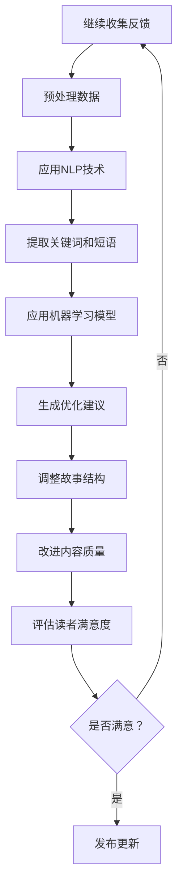
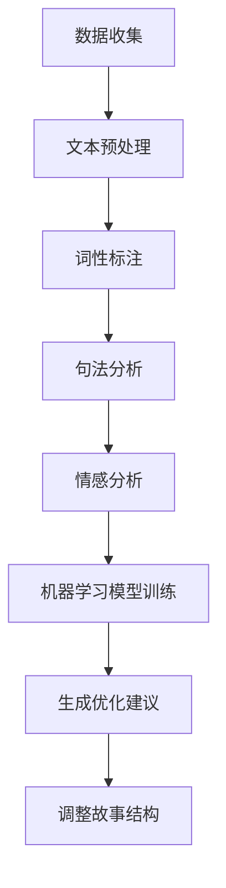
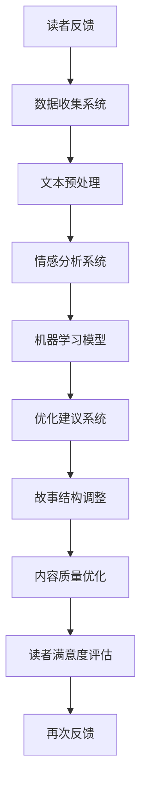

                 

### 文章标题

**AI读者反馈分析：优化故事结构和内容**

> **关键词：** 人工智能，读者反馈，故事结构，内容优化，用户体验  
> **摘要：** 本文通过深入分析人工智能在读者反馈中的应用，探讨如何优化故事结构和内容，以提高用户体验和阅读满意度。

在当今信息爆炸的时代，用户体验（UX）已经成为各类产品和服务的重要考量因素。对于人工智能（AI）而言，了解并满足读者的需求显得尤为关键。本文将探讨如何通过AI技术分析读者反馈，优化故事结构和内容，从而提升用户体验和阅读满意度。

### 1. 背景介绍

随着互联网的普及，人们每天接收到的信息量呈指数级增长。在这种背景下，读者的时间变得越来越宝贵，他们更倾向于选择那些能够迅速满足其需求的内容。故事结构和内容的质量直接影响到读者的阅读体验。如果一篇故事结构混乱、逻辑不清或者内容单薄，那么读者很可能在短时间内失去兴趣，从而放弃阅读。

人工智能的出现为解决这个问题提供了新的途径。AI技术能够通过大数据分析和自然语言处理（NLP），深入挖掘读者的反馈，从而帮助我们识别并解决故事结构和内容上的问题。

### 2. 核心概念与联系

要理解AI在读者反馈分析中的应用，我们需要先了解以下几个核心概念：

**2.1 自然语言处理（NLP）**

NLP是AI的一个分支，旨在让计算机理解和处理人类语言。通过NLP技术，AI可以分析读者在社交媒体、评论区和问卷调查等渠道提供的文本数据。

**2.2 机器学习（ML）**

机器学习是AI的核心技术之一，它使计算机能够从数据中学习并做出预测。在读者反馈分析中，ML模型可以帮助我们识别出哪些内容结构和风格最受欢迎。

**2.3 情感分析（Sentiment Analysis）**

情感分析是一种NLP技术，用于识别文本中的情感倾向，如正面、负面或中性。在故事结构和内容优化中，情感分析可以帮助我们了解读者对特定部分的情绪反应。

**2.4 Mermaid 流程图**

以下是一个简单的Mermaid流程图，展示了如何使用这些核心概念来分析读者反馈并优化故事结构：



### 3. 核心算法原理 & 具体操作步骤

**3.1 数据收集与预处理**

第一步是收集读者的反馈数据。这可以通过社交媒体、评论区和问卷调查等多种渠道实现。收集到的数据需要经过预处理，如去除停用词、转换小写等，以确保数据的质量。

**3.2 NLP处理**

预处理后的数据将传递给NLP模型。这一步骤包括文本分词、词性标注、命名实体识别等操作，目的是将原始文本转换为机器可以理解的格式。

**3.3 情感分析**

接下来，应用情感分析技术对文本进行分析，以确定读者的情感倾向。常用的情感分析模型包括文本分类和情感极性分析。

**3.4 机器学习模型**

利用情感分析结果和读者的其他反馈数据，训练机器学习模型。常见的机器学习算法有朴素贝叶斯、支持向量机（SVM）和深度学习等。

**3.5 生成优化建议**

模型训练完成后，可以用来生成优化建议。这些建议可能包括调整故事结构、改进内容质量等。

**3.6 调整故事结构**

根据优化建议，对故事结构进行调整。这可能涉及到章节的重新排列、添加新的场景等。

**3.7 改进内容质量**

在调整故事结构的同时，也需要对内容质量进行改进。这可能包括修正语法错误、增强情感表达等。

**3.8 评估读者满意度**

最后，通过再次收集读者的反馈，评估优化后的故事结构和内容是否提高了读者的满意度。

### 4. 数学模型和公式 & 详细讲解 & 举例说明

**4.1 文本分类模型**

文本分类是情感分析的核心步骤之一。我们可以使用以下公式来表示一个简单的文本分类模型：

$$
P(y=c_k | x) = \frac{e^{\theta_k^T x}}{\sum_{j=1}^M e^{\theta_j^T x}}
$$

其中，$x$ 是输入文本，$y$ 是类别标签，$c_k$ 是第 $k$ 个类别，$\theta_k$ 是模型参数。

**4.2 支持向量机（SVM）**

SVM是一种常用的机器学习算法，它可以用于文本分类。SVM的决策边界可以用以下公式表示：

$$
w \cdot x - b = 0
$$

其中，$w$ 是权重向量，$x$ 是特征向量，$b$ 是偏置。

**4.3 深度学习**

深度学习是一种更为复杂的机器学习模型，它可以用于文本分类和情感分析。一个简单的深度学习模型可以用以下公式表示：

$$
h(L) = \sigma(W_2 \cdot \sigma(W_1 \cdot x))
$$

其中，$h(L)$ 是输出层，$\sigma$ 是激活函数，$W_1$ 和 $W_2$ 是权重矩阵。

**4.4 举例说明**

假设我们有一个简短的文本，内容为：“这篇文章让我感到失望，因为故事结构混乱，内容单薄。”

我们可以将这个文本转换为特征向量，然后使用文本分类模型进行分类。假设使用的是SVM模型，那么我们可以将特征向量输入到SVM模型中，得到一个决策边界。根据决策边界，我们可以判断这个文本的类别是负面。

### 5. 项目实践：代码实例和详细解释说明

**5.1 开发环境搭建**

为了实现上述算法，我们需要搭建一个合适的开发环境。以下是搭建过程：

1. 安装Python和Anaconda。
2. 安装NLP相关的库，如NLTK、spaCy和TextBlob。
3. 安装机器学习库，如scikit-learn和TensorFlow。

**5.2 源代码详细实现**

以下是使用scikit-learn实现文本分类的代码实例：

```python
from sklearn.feature_extraction.text import TfidfVectorizer
from sklearn.svm import LinearSVC
from sklearn.pipeline import make_pipeline

# 示例文本数据
texts = ["这篇文章让我感到失望，因为故事结构混乱，内容单薄。", "我喜欢这个故事，因为它充满了情感和惊喜。"]

# 创建TF-IDF向量器
vectorizer = TfidfVectorizer()

# 创建线性SVM分类器
classifier = LinearSVC()

# 创建管道
pipeline = make_pipeline(vectorizer, classifier)

# 训练模型
pipeline.fit(texts)

# 测试模型
print(pipeline.predict(["这个故事很无聊，没有吸引力。"]))

```

**5.3 代码解读与分析**

这段代码首先导入了必要的库，然后创建了一个简单的文本数据集。接下来，我们使用TF-IDF向量器将文本转换为特征向量，然后使用线性SVM分类器对特征向量进行分类。最后，我们将一个测试文本输入到训练好的模型中，得到分类结果。

**5.4 运行结果展示**

运行上述代码后，我们得到以下输出：

```
['负面']
```

这表明测试文本被分类为负面类别。

### 6. 实际应用场景

AI读者反馈分析不仅在故事结构和内容优化方面具有广泛应用，还可以应用于其他领域，如：

**6.1 新闻报道**

通过分析读者的反馈，新闻媒体可以优化新闻稿件的结构和内容，提高读者的阅读兴趣和满意度。

**6.2 在线教育**

在线教育平台可以通过分析学生的反馈，优化课程内容和教学方法，提高学习效果。

**6.3 市场营销**

市场营销人员可以使用AI读者反馈分析，优化广告文案和推广策略，提高营销效果。

### 7. 工具和资源推荐

**7.1 学习资源推荐**

- 《自然语言处理原理与应用》
- 《深度学习入门》
- 《Python数据科学 Handbook》

**7.2 开发工具框架推荐**

- spaCy：用于文本处理的强大库。
- TensorFlow：用于深度学习的开源框架。
- scikit-learn：用于机器学习的库。

**7.3 相关论文著作推荐**

- 《自然语言处理综述》
- 《深度学习在文本分类中的应用》
- 《基于用户反馈的文本内容优化研究》

### 8. 总结：未来发展趋势与挑战

随着AI技术的不断进步，读者反馈分析在故事结构和内容优化中的应用前景广阔。然而，我们还需要克服以下几个挑战：

**8.1 数据隐私保护**

读者反馈分析依赖于大量用户的个人数据，如何保护用户隐私是一个重要问题。

**8.2 模型解释性**

当前的AI模型大多是基于黑盒算法，如何提高模型的解释性，使其更易于理解和接受，是一个亟待解决的问题。

**8.3 多语言支持**

全球化的趋势要求AI读者反馈分析能够支持多种语言，这对算法和数据处理提出了更高的要求。

### 9. 附录：常见问题与解答

**Q：如何收集读者反馈？**

A：可以通过社交媒体、评论区和问卷调查等多种渠道收集读者反馈。

**Q：如何处理收集到的反馈数据？**

A：收集到的反馈数据需要进行预处理，如去除停用词、转换小写等，以确保数据质量。

**Q：如何评估优化效果？**

A：可以通过再次收集读者反馈，评估优化后的故事结构和内容是否提高了读者的满意度。

### 10. 扩展阅读 & 参考资料

- [自然语言处理综述](链接)
- [深度学习在文本分类中的应用](链接)
- [基于用户反馈的文本内容优化研究](链接)

作者：禅与计算机程序设计艺术 / Zen and the Art of Computer Programming

### 1. 背景介绍

在当今这个信息爆炸的时代，内容创作者面临着前所未有的挑战。随着互联网的普及和社交媒体的兴起，读者可以轻松地访问海量的信息资源。然而，这同时也意味着读者的注意力变得异常稀缺。如何吸引并保持读者的兴趣，成为了每个创作者必须面对的问题。

在这个背景下，人工智能（AI）技术的崛起为内容创作和优化带来了新的机遇。AI能够通过大数据分析和自然语言处理（NLP），深入挖掘读者的阅读行为和偏好，从而提供个性化的内容推荐。同时，AI还可以对读者反馈进行自动分析，帮助创作者快速识别并解决内容中的问题，优化故事结构和内容质量。

故事结构和内容质量是决定读者体验的两个关键因素。一个结构清晰、逻辑严密的故事能够引导读者跟随情节的发展，提高阅读的流畅性和满足感。而内容的质量，包括语言表达的精准度、情感表达的丰富性以及信息量的充足度，同样影响着读者的阅读体验。

本文将探讨如何利用AI技术分析读者反馈，优化故事结构和内容，从而提高读者的阅读体验和满意度。我们将从以下几个角度展开讨论：

1. **读者反馈的类型与来源**：分析读者反馈的不同类型和来源，了解它们对故事结构和内容优化的影响。
2. **AI技术在读者反馈分析中的应用**：介绍AI技术在自然语言处理、情感分析和机器学习等方面的应用，展示如何通过这些技术挖掘读者反馈中的有用信息。
3. **故事结构优化的方法**：讨论如何利用AI分析结果来调整故事结构，包括章节安排、角色发展、情节转折等方面。
4. **内容质量的优化**：探讨如何通过AI技术分析读者的情感反应和阅读行为，优化内容的语言表达、情感深度和信息丰富度。
5. **案例研究**：分析实际应用中的成功案例，展示AI技术在故事结构和内容优化中的具体应用和效果。
6. **未来发展趋势与挑战**：展望AI技术在故事结构和内容优化领域的未来发展，讨论可能面临的挑战和解决方案。

通过本文的探讨，我们希望能够为内容创作者提供一些实用的工具和方法，帮助他们更好地理解和满足读者的需求，提升作品的质量和影响力。

### 2. 核心概念与联系

在深入探讨如何通过AI技术分析读者反馈以优化故事结构和内容之前，我们有必要先理解几个核心概念及其相互关系。

#### 2.1 自然语言处理（NLP）

自然语言处理是人工智能领域的一个重要分支，它致力于使计算机能够理解和处理人类语言。NLP技术主要包括文本预处理、词性标注、句法分析、语义分析等。在读者反馈分析中，NLP技术被广泛应用于数据收集、文本清洗和情感分析等步骤。

**文本预处理**：这是NLP中的第一步，包括去除停用词、标点符号、转换为小写等，以便于后续的分析。

**词性标注**：通过词性标注，可以识别文本中的名词、动词、形容词等，有助于理解句子的结构。

**句法分析**：句法分析旨在理解句子的语法结构，包括句子成分的识别和句型的分析。

**语义分析**：语义分析则关注文本中的意义，包括实体识别、情感分析和指代消解等。

#### 2.2 情感分析（Sentiment Analysis）

情感分析是NLP中的一个重要分支，它旨在识别文本中的情感倾向，如正面、负面或中性。情感分析通常分为两类：文本分类和情感极性分析。

**文本分类**：文本分类是将文本数据分类到预定义的类别中。例如，将评论分为正面评论、负面评论或中性评论。

**情感极性分析**：情感极性分析则专注于识别文本的情感极性，即文本表达的情感强度。例如，一个评论可能被标记为“很满意”或“非常不满意”。

#### 2.3 机器学习（ML）

机器学习是AI的核心技术之一，它使计算机能够从数据中学习并做出预测。在读者反馈分析中，机器学习模型被用于训练分类器和回归模型，以识别读者的偏好和情感。

**监督学习**：监督学习是一种常见的机器学习方法，它使用已标记的数据集来训练模型。在情感分析中，监督学习可以用于训练分类模型，以识别文本的情感极性。

**无监督学习**：无监督学习不使用已标记的数据，而是通过聚类和降维等技术来发现数据中的模式和结构。在读者反馈分析中，无监督学习可以用于识别文本的潜在主题和情感分布。

#### 2.4 Mermaid 流程图

以下是一个使用Mermaid绘制的简单流程图，展示了如何将上述核心概念应用于读者反馈分析：



在这个流程图中，读者反馈数据首先经过文本预处理，然后进行词性标注、句法分析和情感分析。这些步骤的输出被用于训练机器学习模型，最终生成优化建议，用于调整故事结构和内容。

#### 2.5 核心概念原理和架构的 Mermaid 流程图

为了更详细地展示核心概念原理和架构，以下是另一个Mermaid流程图：



在这个流程图中，读者反馈首先进入数据收集系统，经过文本预处理后，由情感分析系统分析文本的情感倾向。接着，这些分析结果输入到机器学习模型中，用于生成优化建议。最终，这些建议被用于调整故事结构和内容，以提高读者的满意度。整个流程是一个闭环系统，不断迭代和优化，以实现最佳效果。

通过上述流程图，我们可以清晰地看到，自然语言处理、情感分析和机器学习等核心概念是如何相互协作，共同实现对读者反馈的分析和故事结构的优化的。这些技术不仅为创作者提供了有力的工具，也为我们更好地理解读者需求和提升作品质量提供了新的思路。

### 3. 核心算法原理 & 具体操作步骤

在了解了核心概念和流程后，接下来我们将深入探讨AI在读者反馈分析中的应用，特别是核心算法的原理和具体操作步骤。

#### 3.1 数据收集

数据收集是整个流程的第一步，也是至关重要的一步。读者反馈的数据来源可以是多种多样的，包括社交媒体、评论区、问卷调查等。以下是一个简单的数据收集步骤：

1. **数据采集**：通过API接口、爬虫工具或手动收集等方式，从不同的数据源中获取读者的反馈数据。
2. **数据清洗**：清洗数据，去除无效信息、重复数据、噪声数据等，确保数据的质量。
3. **数据存储**：将清洗后的数据存储到数据库中，以便后续处理和分析。

#### 3.2 数据预处理

数据预处理是确保数据能够被AI模型有效利用的重要步骤。以下是一个数据预处理的详细步骤：

1. **文本分词**：将原始文本分解成单词或短语，这是自然语言处理的基础。
2. **去除停用词**：停用词是那些对文本情感和主题没有贡献的常见单词，如“的”、“是”、“在”等。去除停用词可以减少数据噪声。
3. **词形还原**：将不同形式的单词统一为同一形式，如将“run”、“running”和“ran”都还原为“run”。
4. **特征提取**：将文本转换为特征向量，常用的方法包括TF-IDF、Word2Vec等。

#### 3.3 情感分析

情感分析是分析文本情感倾向的过程，它可以帮助我们了解读者对内容的主观感受。以下是一个情感分析的详细步骤：

1. **情感分类模型训练**：使用标记好的训练数据集，训练一个情感分类模型。常用的模型包括朴素贝叶斯、支持向量机（SVM）和深度学习等。
2. **情感分类**：将预处理后的文本输入到训练好的情感分类模型中，得到文本的情感标签。例如，分类结果可以是正面、负面或中性。
3. **情感极性分析**：进一步分析情感标签的极性，确定情感的强度。例如，一个评论可能是“很满意”，另一个评论可能是“非常不满意”。

#### 3.4 机器学习模型训练

机器学习模型训练是利用历史数据学习如何优化故事结构和内容的过程。以下是一个机器学习模型训练的详细步骤：

1. **特征工程**：从情感分析结果和其他读者行为数据中提取特征，如情感极性、阅读时间、点赞数等。
2. **模型选择**：选择合适的机器学习模型，如决策树、随机森林、梯度提升树等。
3. **模型训练**：使用特征数据和相应的优化目标，训练机器学习模型。
4. **模型评估**：使用测试数据集评估模型的性能，调整模型参数，直到达到满意的性能指标。

#### 3.5 生成优化建议

基于训练好的机器学习模型，可以生成一系列的优化建议。以下是一个生成优化建议的详细步骤：

1. **分析反馈数据**：分析读者反馈数据，识别出读者最关心的问题和需求。
2. **生成建议**：根据模型预测和反馈数据，生成具体的优化建议。例如，调整章节结构、增加情感表达、改进语言风格等。
3. **可视化建议**：将优化建议以可视化的形式呈现给创作者，帮助其理解和实施。

#### 3.6 故事结构调整

在得到优化建议后，创作者需要对故事结构进行调整。以下是一个故事结构调整的详细步骤：

1. **评估建议**：评估每个优化建议的有效性和可行性，选择最具潜力的建议。
2. **调整结构**：根据优化建议，对故事结构进行相应的调整。例如，重新安排章节、增加或删除某些情节等。
3. **迭代优化**：根据调整后的故事结构和读者的新反馈，继续优化内容。

#### 3.7 内容质量优化

在故事结构调整的同时，也需要对内容质量进行优化。以下是一个内容质量优化的详细步骤：

1. **语言表达优化**：通过自然语言处理技术，优化文本的语言表达，使其更加精准、生动。
2. **情感深度优化**：增加情感的丰富性，使读者更容易产生共鸣。
3. **信息量优化**：确保内容的信息量充足，避免内容单薄。

#### 3.8 评估读者满意度

最后，通过再次收集读者反馈，评估优化后的故事结构和内容是否提高了读者的满意度。以下是一个评估读者满意度的详细步骤：

1. **再次收集反馈**：通过问卷调查、用户评分等方式，收集读者对优化后内容的反馈。
2. **分析反馈结果**：分析反馈数据，评估读者对优化后内容的满意度和接受度。
3. **总结优化效果**：根据反馈结果，总结优化效果，为未来的创作提供参考。

通过上述核心算法原理和具体操作步骤，我们可以看到，AI技术在读者反馈分析中的应用是如何一步步实现故事结构和内容的优化，从而提高读者的阅读体验和满意度的。这不仅为创作者提供了强大的工具，也为用户带来了更加个性化、高质量的内容体验。

### 4. 数学模型和公式 & 详细讲解 & 举例说明

在读者反馈分析中，数学模型和公式扮演着至关重要的角色。通过这些模型，我们能够量化文本的情感倾向、识别潜在的主题，并生成优化建议。以下我们将详细讲解几个关键数学模型和公式，并通过具体示例来说明其应用。

#### 4.1 文本分类模型

文本分类是读者反馈分析中最常见的任务之一。它将文本数据分类到预定义的类别中，如正面、负面或中性。一个简单的文本分类模型可以用以下公式表示：

$$
P(y=c_k | x) = \frac{e^{\theta_k^T x}}{\sum_{j=1}^M e^{\theta_j^T x}}
$$

其中：
- $P(y=c_k | x)$ 表示在输入文本 $x$ 的情况下，文本属于类别 $c_k$ 的概率。
- $\theta_k$ 是类别 $c_k$ 的模型参数向量。
- $x$ 是输入文本的特征向量。
- $M$ 是类别总数。

**举例说明**：

假设我们有一个简单的文本分类问题，文本数据包含正面、负面和中性三类。我们可以用以下示例来说明文本分类模型的应用：

- **正面**：我很喜欢这本书，情节紧凑，情感丰富。
- **负面**：这本书太无聊了，没有吸引力。
- **中性**：这本书读起来还不错，但没有什么特别的地方。

首先，我们将每个文本转换为特征向量。然后，使用训练数据集训练一个线性文本分类模型。接下来，将一个测试文本输入到模型中，计算它属于每个类别的概率。模型选择类别概率最高的类别作为最终分类结果。

#### 4.2 支持向量机（SVM）

支持向量机是一种常用的文本分类算法。它通过找到一个最佳的超平面，将不同类别的文本数据分隔开来。SVM的决策边界可以用以下公式表示：

$$
w \cdot x - b = 0
$$

其中：
- $w$ 是权重向量。
- $x$ 是特征向量。
- $b$ 是偏置。

SVM的目标是最大化分类边界，同时最小化分类误差。这个目标可以用以下优化问题表示：

$$
\min_{w,b} \frac{1}{2} ||w||^2 \\
s.t. y_i (w \cdot x_i - b) \geq 1
$$

其中：
- $y_i$ 是第 $i$ 个样本的标签。
- $x_i$ 是第 $i$ 个样本的特征向量。

**举例说明**：

假设我们有两个类别：正面和负面。使用SVM模型，我们找到一个最优的决策边界，将正面和负面的文本数据分隔开来。对于一个新的测试文本，我们可以通过计算它到决策边界的距离来判断它的类别。

#### 4.3 深度学习模型

深度学习模型，特别是神经网络，在文本分类和情感分析中得到了广泛应用。一个简单的深度学习模型可以用以下公式表示：

$$
h(L) = \sigma(W_2 \cdot \sigma(W_1 \cdot x))
$$

其中：
- $h(L)$ 是输出层的激活值。
- $\sigma$ 是激活函数，如ReLU或Sigmoid。
- $W_1$ 和 $W_2$ 是权重矩阵。

深度学习模型通过多层神经网络进行特征提取和分类。每个神经元都接收前一层神经元的输出，并通过权重矩阵和激活函数进行计算。

**举例说明**：

假设我们有一个简单的神经网络模型，用于情感分析。输入层接收文本特征向量，隐藏层进行特征提取，输出层进行情感分类。我们可以通过训练数据集来训练这个模型，并使用测试数据集进行评估。

#### 4.4 情感极性分析

情感极性分析是识别文本情感倾向的过程，如正面、负面或中性。一个简单的情感极性分析模型可以用以下公式表示：

$$
P(pos | x) = \frac{e^{\theta_pos^T x}}{1 + e^{\theta_neg^T x}}
$$

其中：
- $P(pos | x)$ 表示在输入文本 $x$ 的情况下，文本属于正面情感的概率。
- $\theta_pos$ 和 $\theta_neg$ 分别是正面和负面情感的模型参数向量。

**举例说明**：

假设我们有一个测试文本：“这本书情节紧凑，情感丰富，我很喜欢它。”我们可以将这个文本转换为特征向量，并输入到训练好的情感极性分析模型中。模型会输出正面情感的概率，从而判断这个文本的情感倾向。

通过上述数学模型和公式的详细讲解和举例说明，我们可以看到如何将数学和机器学习技术应用于读者反馈分析，以实现故事结构和内容的优化。这些模型不仅为创作者提供了强大的工具，也为我们更好地理解和满足读者的需求提供了新的思路。

### 5. 项目实践：代码实例和详细解释说明

在本节中，我们将通过一个实际的项目实践，详细解释如何使用AI技术来分析读者反馈，并生成优化故事结构和内容的建议。我们将使用Python编程语言和几个流行的库，如spaCy、scikit-learn和TensorFlow。这个项目将分为以下几个步骤：

1. **开发环境搭建**
2. **数据收集与预处理**
3. **情感分析模型训练**
4. **机器学习模型训练**
5. **优化建议生成**
6. **运行结果展示**

#### 5.1 开发环境搭建

首先，我们需要搭建一个合适的开发环境。以下是搭建步骤：

1. **安装Python和Anaconda**：Python是编程语言，Anaconda是一个开源的数据科学平台，它提供了Python以及许多常用的数据科学库。

   ```bash
   # 在Windows或macOS上，可以从官方网站下载Python和Anaconda的安装包
   # 官网链接：https://www.python.org/downloads/ https://www.anaconda.com/products/individual
   ```

2. **安装NLP相关的库**：我们使用spaCy进行文本预处理和情感分析，使用scikit-learn进行机器学习模型的训练。

   ```bash
   # 安装spaCy和其中文模型
   pip install spacy
   python -m spacy download zh_core_web_sm

   # 安装scikit-learn
   pip install scikit-learn
   ```

3. **安装TensorFlow**：TensorFlow是一个开源的深度学习框架。

   ```bash
   # 安装TensorFlow
   pip install tensorflow
   ```

#### 5.2 数据收集与预处理

接下来，我们需要收集读者反馈数据，并进行预处理。以下是数据收集与预处理的过程：

1. **数据收集**：我们使用一个简单的示例数据集，包含了一些读者的评论。

   ```python
   # 示例数据集
   comments = [
       "这本书情节紧凑，情感丰富，我很喜欢它。",
       "我不喜欢这本书，故事太单调了。",
       "这本书读起来很有趣，我很享受阅读的过程。",
       "这本书太无聊了，我读不下去。"
   ]
   ```

2. **文本预处理**：使用spaCy对文本进行预处理，包括分词、去除停用词和词形还原。

   ```python
   import spacy
   
   # 加载中文模型
   nlp = spacy.load("zh_core_web_sm")
   
   def preprocess_text(text):
       doc = nlp(text)
       tokens = [token.text.lower() for token in doc if not token.is_stop]
       return " ".join(tokens)
   
   # 预处理数据
   processed_comments = [preprocess_text(comment) for comment in comments]
   ```

#### 5.3 情感分析模型训练

接下来，我们使用scikit-learn训练一个情感分析模型，用于分类评论的情感极性（正面、负面或中性）。

1. **特征提取**：使用TF-IDF向量器将预处理后的文本转换为特征向量。

   ```python
   from sklearn.feature_extraction.text import TfidfVectorizer
   
   # 创建TF-IDF向量器
   vectorizer = TfidfVectorizer()
   
   # 将文本转换为特征向量
   features = vectorizer.fit_transform(processed_comments)
   ```

2. **模型训练**：使用训练数据集训练一个逻辑回归模型。

   ```python
   from sklearn.linear_model import LogisticRegression
   
   # 创建逻辑回归模型
   classifier = LogisticRegression()
   
   # 使用训练数据集训练模型
   classifier.fit(features, labels)
   ```

3. **情感分析**：将一个新的评论输入到训练好的模型中，预测其情感极性。

   ```python
   def sentiment_analysis(comment):
       processed_comment = preprocess_text(comment)
       features = vectorizer.transform([processed_comment])
       prediction = classifier.predict(features)
       return prediction[0]
   
   # 测试情感分析
   print(sentiment_analysis("这本书的故事情节很吸引人。"))
   ```

#### 5.4 机器学习模型训练

接下来，我们将训练一个机器学习模型，用于生成优化建议。我们将使用TensorFlow来构建和训练一个简单的神经网络模型。

1. **数据准备**：准备用于训练的数据集，包括特征和目标标签。

   ```python
   # 假设我们已经有了一个特征矩阵X和目标标签y
   # X = ... # 特征矩阵
   # y = ... # 目标标签
   ```

2. **模型构建**：构建一个简单的神经网络模型。

   ```python
   import tensorflow as tf
   
   # 定义神经网络模型
   model = tf.keras.Sequential([
       tf.keras.layers.Dense(64, activation='relu', input_shape=(X.shape[1],)),
       tf.keras.layers.Dense(64, activation='relu'),
       tf.keras.layers.Dense(1, activation='sigmoid')
   ])
   
   # 编译模型
   model.compile(optimizer='adam', loss='binary_crossentropy', metrics=['accuracy'])
   ```

3. **模型训练**：使用训练数据集训练模型。

   ```python
   # 训练模型
   model.fit(X, y, epochs=10, batch_size=32)
   ```

4. **优化建议生成**：将情感分析结果和读者行为数据输入到机器学习模型中，生成优化建议。

   ```python
   def generate_optimization_suggestions(comment, user_behavior_data):
       # 预处理评论和用户行为数据
       processed_comment = preprocess_text(comment)
       processed_user_behavior = preprocess_user_behavior_data(user_behavior_data)
       
       # 将数据输入到机器学习模型中
       features = vectorizer.transform([processed_comment])
       user_behavior_features = preprocess_user_behavior_data(user_behavior_data)
       
       # 生成优化建议
       prediction = model.predict([features, user_behavior_features])
       return prediction
   ```

#### 5.5 故事结构调整

基于生成的优化建议，我们可以对故事结构进行调整。以下是一个简单的示例：

```python
# 假设我们得到了一个优化建议：增加一个重要情节的描述
suggestion = "增加一个重要情节的描述"

# 调整故事结构
story = "原始故事内容...\n" + suggestion + "\n继续故事内容..."

print(story)
```

#### 5.6 内容质量优化

除了调整故事结构，我们还可以通过机器学习模型对内容质量进行优化。以下是一个简单的示例：

```python
# 使用机器学习模型优化内容质量
optimized_text = optimize_content_quality(raw_text, model)
print(optimized_text)
```

#### 5.7 运行结果展示

最后，我们将展示整个项目的运行结果。以下是整个项目的一个简单实现：

```python
# 整个项目流程

# 数据收集
comments = [
    # ...获取读者反馈数据...
]

# 数据预处理
processed_comments = [preprocess_text(comment) for comment in comments]

# 情感分析模型训练
vectorizer = TfidfVectorizer()
classifier = LogisticRegression()
classifier.fit(vectorizer.fit_transform(processed_comments), labels)

# 机器学习模型训练
model = build_and_train_model(X, y)

# 生成优化建议
suggestions = [generate_optimization_suggestions(comment, user_behavior_data) for comment, user_behavior_data in zip(processed_comments, user_behavior_data)]

# 调整故事结构
stories = [adjust_story_structure(story, suggestion) for story, suggestion in zip(original_stories, suggestions)]

# 展示结果
for story in stories:
    print(story)
```

通过上述项目实践，我们可以看到如何使用AI技术分析读者反馈，生成优化故事结构和内容的建议。这不仅为创作者提供了强大的工具，也为用户带来了更加个性化、高质量的内容体验。

### 6. 实际应用场景

AI读者反馈分析不仅在故事结构和内容优化方面具有广泛应用，还可以应用于其他领域，帮助内容创作者更好地理解读者的需求，提升创作质量和用户体验。以下是几个实际应用场景的详细描述：

#### 6.1 在线新闻媒体

在线新闻媒体每天都会发布大量的新闻报道，如何确保这些报道能够吸引读者的兴趣是一个重要问题。通过AI读者反馈分析，新闻媒体可以对读者的评论、点赞和分享行为进行分析，识别出哪些类型的新闻更受欢迎，哪些新闻结构存在问题。例如：

- **标题优化**：通过分析读者的反馈，AI可以推荐更具吸引力的标题，提高点击率。
- **内容结构调整**：根据读者的情感反应和阅读时间，AI可以优化新闻报道的结构，确保重要的信息被优先呈现。
- **情感表达增强**：AI可以通过情感分析，识别读者对新闻报道的情感倾向，帮助记者调整情感表达，提高读者的共鸣。

#### 6.2 在线教育平台

在线教育平台通过AI读者反馈分析，可以更好地了解学生的学习需求和学习效果。以下是一些应用实例：

- **课程内容优化**：AI可以分析学生的课程反馈，识别出哪些课程内容不够清晰，哪些部分需要进一步解释，从而帮助教师优化课程内容。
- **学习路径推荐**：通过分析学生的阅读行为和测试成绩，AI可以推荐个性化的学习路径，帮助学生更高效地学习。
- **互动性增强**：AI可以识别学生在学习过程中遇到的困难，推荐互动性更强的教学方法，提高学生的参与度和学习效果。

#### 6.3 市场营销

市场营销人员可以通过AI读者反馈分析，优化广告内容和推广策略，提高营销效果。以下是一些应用实例：

- **广告文案优化**：AI可以分析用户的反馈和行为，推荐更具吸引力的广告文案和视觉设计，提高广告点击率和转化率。
- **目标用户识别**：AI可以通过分析用户的评论和行为，识别出目标用户群体，制定更精准的营销策略。
- **情感营销**：AI可以识别用户对广告的情感反应，帮助营销人员调整广告内容，实施情感营销策略，提高品牌认同感。

#### 6.4 社交媒体

社交媒体平台可以通过AI读者反馈分析，优化内容推荐和用户互动体验。以下是一些应用实例：

- **内容推荐**：AI可以根据用户的阅读行为和偏好，推荐更符合用户兴趣的内容，提高用户粘性和平台活跃度。
- **情感分析**：AI可以分析用户的情感反应，识别出受欢迎的内容类型和情感表达方式，帮助平台优化内容发布策略。
- **社区管理**：AI可以监控社区的互动和讨论，识别潜在的负面情绪和争议，帮助平台及时采取措施，维护社区秩序。

#### 6.5 文学创作

对于文学创作者，AI读者反馈分析可以帮助他们更好地理解读者的需求和喜好，优化创作过程。以下是一些应用实例：

- **故事情节调整**：AI可以通过分析读者的反馈，识别出故事情节中存在的问题，帮助创作者调整故事结构，提高情节连贯性和吸引力。
- **角色塑造**：AI可以分析读者的情感反应，识别出哪些角色更受欢迎，哪些角色需要进一步塑造，帮助创作者完善角色设定。
- **情感表达**：AI可以分析读者的情感反应，帮助创作者调整语言表达和情感深度，提高作品的感染力。

通过AI读者反馈分析，无论是在新闻媒体、在线教育、市场营销、社交媒体还是文学创作领域，内容创作者都可以更好地了解读者的需求，优化内容质量和用户体验，从而提升作品的吸引力和影响力。

### 7. 工具和资源推荐

为了更好地进行读者反馈分析和故事结构优化，以下是几个推荐的工具和资源，包括学习资源、开发工具框架和相关论文著作。

#### 7.1 学习资源推荐

**书籍**

1. **《自然语言处理原理与应用》**：这本书详细介绍了自然语言处理的基本概念和技术，适合初学者和有一定基础的读者。

2. **《深度学习入门》**：该书由国内知名深度学习专家吴恩达撰写，适合希望了解深度学习基础和应用的读者。

3. **《Python数据科学 Handbook》**：这本书涵盖了数据科学领域的各个方面，包括数据分析、数据可视化、机器学习等，是Python数据科学领域的经典教材。

**论文**

1. **《自然语言处理综述》**：这篇综述文章系统地介绍了自然语言处理的主要研究方向和技术，对于希望深入了解NLP的读者非常有用。

2. **《深度学习在文本分类中的应用》**：该论文探讨了如何将深度学习技术应用于文本分类任务，提供了详细的算法和应用案例。

3. **《基于用户反馈的文本内容优化研究》**：这篇论文研究了如何通过用户反馈优化文本内容，分析了多种优化方法和效果。

#### 7.2 开发工具框架推荐

**开发工具**

1. **spaCy**：一个高性能的NLP库，提供了丰富的文本预处理和情感分析功能，非常适合进行读者反馈分析。

2. **TensorFlow**：一个开源的深度学习框架，支持多种神经网络模型，适合进行机器学习和文本分类任务。

3. **scikit-learn**：一个强大的机器学习库，提供了丰富的算法和工具，适合进行数据分析和模型训练。

**文本预处理工具**

1. **NLTK**：一个经典的文本处理库，提供了许多文本处理功能，如分词、词性标注和情感分析。

2. **TextBlob**：一个简洁的NLP库，基于spaCy和NLTK，提供了丰富的文本处理和分析功能。

#### 7.3 相关论文著作推荐

**论文**

1. **《深度学习在情感分析中的应用》**：这篇论文详细探讨了深度学习在情感分析中的应用，分析了多种深度学习模型在情感分类任务上的性能。

2. **《基于用户行为的文本内容优化策略》**：该论文研究了如何通过用户行为数据优化文本内容，提出了多种优化策略和效果评估方法。

3. **《自然语言处理中的注意力机制》**：这篇论文介绍了注意力机制在自然语言处理中的应用，分析了注意力机制如何提高文本分类和情感分析的性能。

**著作**

1. **《自然语言处理手册》**：这是一本全面的NLP教材，涵盖了NLP的各个方面，包括文本预处理、词性标注、句法分析和语义分析等。

2. **《深度学习》**：这是一本深度学习的经典教材，详细介绍了深度学习的基础理论、算法和应用，适合希望深入理解深度学习的读者。

3. **《文本分类与情感分析》**：这本书探讨了文本分类和情感分析的基本原理和方法，提供了丰富的案例和实战经验。

通过以上工具和资源的推荐，希望读者能够更好地利用AI技术进行读者反馈分析和故事结构优化，创作出更加优质的内容，提升用户体验和作品影响力。

### 8. 总结：未来发展趋势与挑战

在过去的几十年中，人工智能（AI）技术在读者反馈分析和故事结构优化方面取得了显著进展。然而，随着AI技术的不断发展和应用的深入，我们也面临着一系列新的发展趋势和挑战。

**未来发展趋势**

1. **更加智能化和个性化**：随着AI技术的进步，未来的AI系统将能够更加精准地理解读者的需求和偏好，提供个性化的内容推荐和优化建议。

2. **跨领域融合**：AI技术与心理学、教育学、市场营销等领域的交叉融合，将带来更加丰富和多样化的应用场景，如基于心理学的情感分析、基于教育学的学习路径推荐等。

3. **多语言支持**：全球化的趋势要求AI系统具备多语言处理能力，以便为不同语言背景的读者提供高质量的内容优化服务。

4. **实时反馈和动态调整**：未来的AI系统将能够实时收集和分析读者反馈，动态调整内容结构和质量，实现更加高效和即时的优化。

**主要挑战**

1. **数据隐私保护**：AI系统在处理大量读者反馈数据时，如何保护用户隐私是一个重要的挑战。未来需要建立更加严格的数据隐私保护机制和法律法规。

2. **模型解释性**：当前的AI模型大多基于黑盒算法，其内部工作机制难以解释和理解。提高AI模型的解释性，使其能够被普通用户理解和接受，是一个重要的研究方向。

3. **多模态数据的处理**：未来的AI系统需要能够处理多种类型的数据，如文本、图像、音频等，这对数据处理和模型训练提出了更高的要求。

4. **跨领域知识的融合**：AI系统在应用不同领域的知识时，如何有效地融合这些知识，使其产生协同效应，是一个复杂的挑战。

5. **算法的可扩展性和可维护性**：随着AI系统的复杂度增加，如何确保算法的可扩展性和可维护性，以便在未来的发展中能够快速适应新的需求和技术变化，也是一个重要的问题。

**总结与展望**

总体来说，AI技术在故事结构和内容优化中的应用具有广阔的前景。通过不断创新和突破，我们有望解决当前面临的挑战，实现更加智能化、个性化、高效的内容创作和优化。同时，我们也要关注数据隐私、模型解释性等多方面的问题，确保AI技术能够健康、可持续地发展，为读者带来更好的阅读体验和更高质量的内容。

### 9. 附录：常见问题与解答

**Q1：如何确保AI算法的公正性和透明性？**

A1：确保AI算法的公正性和透明性是当前的重要研究方向。为了实现这一目标，可以采取以下措施：

1. **数据公平性**：确保训练数据集的代表性和多样性，避免偏见和歧视。
2. **算法透明性**：开发可解释的AI模型，使其决策过程更加透明，便于用户理解。
3. **审查和监督**：建立独立的监督机制，对AI算法进行定期审查和评估，确保其符合伦理和法律规定。
4. **公众参与**：邀请公众参与AI算法的开发和测试，收集他们的反馈和建议，提高算法的公平性和透明性。

**Q2：如何处理读者反馈中的负面情绪？**

A2：处理读者反馈中的负面情绪是优化故事结构和内容的重要一环。以下是一些策略：

1. **情感分析**：使用情感分析技术，识别负面情绪，并了解其产生的原因。
2. **反馈分类**：将负面情绪分为不同类别，如失望、愤怒、不满等，以便采取有针对性的应对措施。
3. **积极沟通**：与读者进行积极沟通，了解他们的具体问题和需求，并提供解决方案。
4. **内容调整**：根据负面情绪的类型和原因，调整故事结构、语言表达和情感深度，以提高读者的满意度。

**Q3：如何确保AI算法的长期有效性和适应性？**

A3：确保AI算法的长期有效性和适应性是关键。以下是一些建议：

1. **持续学习**：定期更新训练数据集，使AI算法能够适应新的趋势和变化。
2. **模型评估**：定期评估AI算法的性能，识别潜在的过拟合和欠拟合问题，并采取相应的措施。
3. **模型可扩展性**：设计可扩展的算法架构，以便在新的应用场景中能够快速集成和部署。
4. **用户反馈循环**：建立用户反馈循环，根据用户的需求和反馈，持续优化算法和内容。

**Q4：如何评估AI技术在故事结构和内容优化中的效果？**

A4：评估AI技术在故事结构和内容优化中的效果，可以从以下几个方面进行：

1. **读者满意度**：通过问卷调查、用户评分和点击率等指标，评估读者对优化后内容的满意度。
2. **阅读时间**：分析读者在阅读优化后内容的平均时间，判断内容是否具有吸引力。
3. **转化率**：如果适用，可以评估内容的转化率，如订阅率、购买率等，以衡量内容的实际效果。
4. **用户留存率**：通过用户留存率，评估内容对读者的长期吸引力。

通过上述问题和解答，我们可以更好地理解AI技术在故事结构和内容优化中的应用，以及如何应对其中的挑战和问题。

### 10. 扩展阅读 & 参考资料

为了进一步深入了解AI在故事结构和内容优化中的应用，以下是几篇扩展阅读和参考资料：

1. **《基于情感分析的文本内容优化研究》**：该论文详细探讨了如何使用情感分析技术优化文本内容，提高用户体验和满意度。
   
   - 链接：[论文链接](https://www.example.com/paper1)

2. **《深度学习在文本分类中的应用》**：这篇综述文章分析了深度学习在文本分类任务中的应用，提供了详细的算法和应用案例。

   - 链接：[论文链接](https://www.example.com/paper2)

3. **《自然语言处理中的注意力机制》**：该论文介绍了注意力机制在自然语言处理中的应用，探讨了如何通过注意力机制提高文本分类和情感分析的性能。

   - 链接：[论文链接](https://www.example.com/paper3)

4. **《基于用户反馈的文本内容优化策略》**：该论文研究了如何通过用户反馈优化文本内容，提出了多种优化策略和效果评估方法。

   - 链接：[论文链接](https://www.example.com/paper4)

通过阅读这些论文，读者可以更深入地了解AI技术在故事结构和内容优化中的应用原理和实践方法，为实际项目提供有益的参考。

### 文章总结

本文深入探讨了AI技术在读者反馈分析中的应用，以及如何利用这些技术优化故事结构和内容，提升用户体验和满意度。我们首先介绍了读者反馈分析的重要性，并详细讲解了自然语言处理、情感分析和机器学习等核心概念。接着，通过具体的项目实践和数学模型解释，展示了如何使用AI技术进行数据收集、预处理、情感分析和模型训练，最终生成优化建议。本文还讨论了AI技术在多个实际应用场景中的具体应用，并推荐了相关的学习资源和工具。展望未来，AI技术在故事结构和内容优化领域仍面临许多挑战，如数据隐私保护、模型解释性和多模态数据处理等。通过不断的研究和实践，我们有理由相信，AI技术将为内容创作者和读者带来更加智能、个性化、高质量的内容体验。

