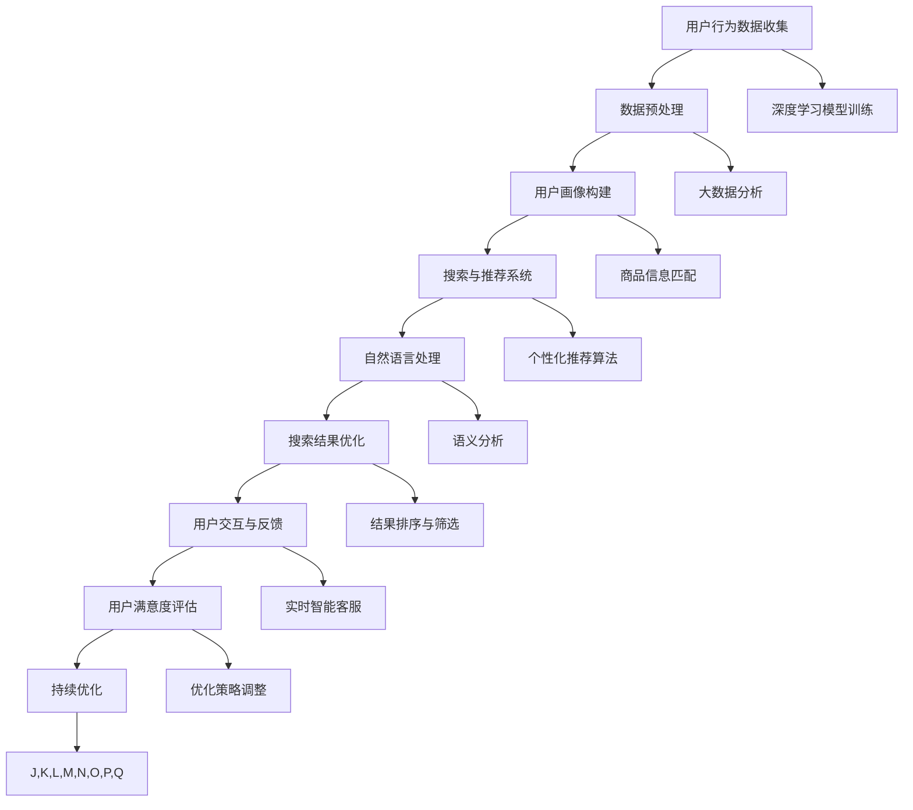

                 

### 1. 背景介绍

随着互联网的迅猛发展，电子商务已经成为全球经济增长的重要驱动力。在电商领域，搜索和导购系统扮演着至关重要的角色，它们不仅决定了用户能否快速找到所需商品，还直接影响着用户体验和转化率。在用户行为数据爆炸式增长的今天，如何利用先进的人工智能技术优化电商搜索导购系统，提升用户体验和转化率，成为了一项热门研究课题。

#### 1.1 电商搜索与导购系统的现状

当前电商平台的搜索与导购系统普遍面临以下挑战：

1. **信息过载**：随着商品种类和数量的不断增长，用户在搜索时常常面临信息过载的问题，难以迅速找到所需商品。
2. **个性化不足**：传统的搜索系统往往不能很好地满足用户的个性化需求，导致用户满意度不高。
3. **推荐效果不佳**：虽然现有推荐系统在一定程度上能够为用户推荐商品，但往往缺乏准确性和多样性，无法有效提升转化率。

#### 1.2 人工智能技术在电商搜索导购中的应用

人工智能技术，特别是深度学习和大数据分析技术，为解决上述问题提供了新的思路和手段。通过AI技术，电商搜索导购系统可以实现以下几点：

1. **智能推荐**：利用用户历史行为数据、兴趣标签等，生成个性化的商品推荐。
2. **自然语言处理**：实现用户查询意图的理解和商品关键词的智能匹配。
3. **个性化搜索**：根据用户行为和偏好，优化搜索结果排序，提高搜索精度。
4. **智能客服**：利用智能对话系统，为用户提供实时、个性化的购物建议和解答疑问。

#### 1.3 文章结构与目的

本文旨在探讨如何利用人工智能技术赋能电商搜索导购系统，以提升用户体验和转化率。文章结构如下：

1. **背景介绍**：介绍电商搜索导购系统的现状及人工智能技术在其中的应用。
2. **核心概念与联系**：阐述人工智能技术应用于电商搜索导购的核心概念和原理。
3. **核心算法原理与具体操作步骤**：详细讲解AI技术在电商搜索导购中的关键算法及其实现过程。
4. **数学模型和公式**：介绍支持核心算法的数学模型及其具体应用。
5. **项目实践**：通过代码实例展示AI技术在电商搜索导购中的具体应用。
6. **实际应用场景**：分析AI技术在电商搜索导购中的具体应用案例。
7. **工具和资源推荐**：推荐相关学习资源、开发工具和框架。
8. **总结与未来趋势**：总结AI技术在电商搜索导购中的应用现状，探讨未来发展趋势与挑战。
9. **附录**：回答常见问题并提供扩展阅读资料。

通过本文的逐步分析，读者将能够全面了解AI技术在电商搜索导购中的应用，掌握相关技术原理和实现方法，为实际项目开发提供有力支持。

#### 1.4 概述本文的结构

在接下来的一章中，我们将首先详细阐述人工智能技术在电商搜索导购系统中的应用背景和重要性。我们将通过分析现有系统面临的主要挑战，解释为什么引入人工智能技术是提升搜索和导购效果的必然选择。接下来，我们会通过Mermaid流程图展示电商搜索导购系统的基础架构，并进一步介绍人工智能技术在这一架构中的具体作用。

随后，我们将深入探讨AI技术的核心算法原理，从智能推荐、自然语言处理、个性化搜索和智能客服等多个方面进行分析，为读者揭示如何通过这些技术手段实现高效、个性化的用户服务。在核心算法原理的基础上，我们将详细讲解这些算法的具体操作步骤，帮助读者理解AI技术在电商搜索导购中的实际应用。

在文章的第四部分，我们将引入数学模型和公式，解释支持核心算法的数学原理，并通过具体实例说明这些模型的实际应用。随后，通过代码实例展示AI技术在电商搜索导购中的具体实现，详细解释源代码的各个部分及其功能。

接下来，我们将通过具体案例分析，展示AI技术在电商搜索导购中的实际应用效果，并结合具体工具和资源推荐，帮助读者更好地理解和应用这些技术。文章的结尾将对AI技术在电商搜索导购中的未来发展趋势和挑战进行总结，为读者提供前瞻性的思考方向。

通过本文的系统讲解，读者不仅能够全面掌握AI技术在电商搜索导购中的应用原理和实践方法，还将对这一领域的未来发展有更深入的认识。

### 2. 核心概念与联系

在探讨如何将人工智能技术应用于电商搜索导购之前，我们首先需要理解几个核心概念，包括用户行为分析、推荐系统、自然语言处理、深度学习和大数据分析等。这些概念在电商搜索导购系统中扮演着关键角色，相互之间存在着紧密的联系。为了更直观地展示这些核心概念之间的联系，我们将使用Mermaid流程图来描述电商搜索导购系统的基础架构以及人工智能技术在其中的具体应用。

#### 2.1 Mermaid流程图展示

以下是一个简单的Mermaid流程图，它展示了电商搜索导购系统的基础架构以及人工智能技术的应用：



#### 2.2 核心概念解释

**用户行为数据收集（A）**：
用户在电商平台上的每一次操作，如浏览、搜索、购买、评价等，都会生成相应的行为数据。这些数据是构建用户画像、优化搜索和推荐系统的重要基础。

**数据预处理（B）**：
收集到的用户行为数据往往是不完整、不准确的，需要进行清洗、去噪、归一化等预处理步骤，以便后续分析和建模。

**用户画像构建（C）**：
通过数据预处理后的用户行为数据，我们可以构建详细的用户画像，包括用户的兴趣偏好、消费习惯、地理位置等信息。用户画像为个性化推荐和搜索优化提供了关键输入。

**搜索与推荐系统（D）**：
电商平台的搜索与推荐系统是用户获取信息的主要渠道。通过结合用户画像和商品信息，系统能够提供个性化、准确的搜索结果和商品推荐。

**自然语言处理（E）**：
自然语言处理技术（NLP）主要用于理解用户的查询意图，将自然语言转换为机器可理解的格式。它帮助平台实现智能搜索匹配、语义分析和智能客服。

**搜索结果优化（F）**：
通过优化搜索结果的排序、筛选和展示方式，可以提高用户在搜索过程中的满意度和转化率。优化策略通常基于用户行为数据和算法模型。

**用户交互与反馈（G）**：
用户与电商平台之间的交互过程，包括点击、评价、反馈等，为系统提供了实时反馈。这些反馈可以帮助平台不断优化服务，提升用户体验。

**用户满意度评估（H）**：
通过分析用户的满意度评分、购买转化率等指标，平台可以评估自身服务的质量和效果，进而进行优化调整。

**持续优化（I）**：
电商搜索导购系统的优化是一个持续的过程。通过用户交互与反馈，平台能够不断调整策略，提高服务质量和用户满意度。

**深度学习模型训练（J）**：
深度学习模型能够从大量用户行为数据中自动学习特征，实现更精准的推荐和搜索结果。常见的深度学习模型包括神经网络、循环神经网络（RNN）和卷积神经网络（CNN）等。

**大数据分析（K）**：
大数据分析技术帮助平台从海量数据中提取有价值的信息，包括用户行为模式、市场趋势等，为决策提供数据支持。

**商品信息匹配（L）**：
商品信息匹配是推荐系统中的关键步骤，通过匹配用户画像和商品特征，系统能够为用户提供最相关的商品推荐。

**个性化推荐算法（M）**：
个性化推荐算法根据用户画像和商品特征，为用户生成个性化的推荐结果。常见的推荐算法包括协同过滤、矩阵分解和基于内容的推荐等。

**语义分析（N）**：
语义分析用于理解用户查询的真正意图，从而实现更精准的搜索结果匹配。它包括词义消歧、情感分析、实体识别等任务。

**结果排序与筛选（O）**：
通过分析用户行为数据和学习到的特征，平台可以对搜索结果进行排序和筛选，确保用户能够快速找到最相关的商品。

**实时智能客服（P）**：
实时智能客服通过智能对话系统为用户提供实时、个性化的购物建议和解答疑问，提升用户的购物体验。

**优化策略调整（Q）**：
根据用户反馈和系统性能指标，平台可以调整优化策略，以持续提高用户满意度和转化率。

通过上述流程图和核心概念解释，我们可以看到人工智能技术在电商搜索导购系统中的多层次应用，从数据收集、预处理到模型训练、推荐算法和用户体验优化，每一个环节都依赖于AI技术的支持。这些技术的综合应用，不仅提升了平台的智能化水平，也为用户带来了更好的购物体验。

### 3. 核心算法原理与具体操作步骤

在深入探讨人工智能技术在电商搜索导购系统中的应用之前，我们首先需要了解核心算法的原理和具体操作步骤。以下是几个关键算法的详细介绍，这些算法在电商搜索导购中扮演着至关重要的角色，包括但不限于智能推荐、自然语言处理、个性化搜索和智能客服。

#### 3.1 智能推荐算法

智能推荐算法是电商搜索导购系统中最为核心的部分之一，其目标是根据用户的历史行为、兴趣偏好和当前需求，为用户推荐最相关的商品。以下是一种常见的推荐算法——基于协同过滤的推荐算法：

1. **协同过滤（Collaborative Filtering）**：
   - **用户基于的协同过滤（User-Based）**：
     该方法通过寻找与目标用户行为相似的邻居用户，然后基于邻居用户的行为为当前用户推荐商品。具体步骤如下：
     1. 计算用户之间的相似度，常用的相似度度量方法包括余弦相似度和皮尔逊相关系数。
     2. 选择与目标用户最相似的K个邻居用户。
     3. 为目标用户推荐邻居用户喜欢的但用户尚未购买的商品。
   - **物品基于的协同过滤（Item-Based）**：
     该方法通过分析商品之间的相似度来推荐商品。具体步骤如下：
     1. 计算商品之间的相似度，通常使用商品之间的共现频次作为相似度度量。
     2. 选择与目标商品最相似的K个商品。
     3. 为用户推荐这些相似商品。

2. **矩阵分解（Matrix Factorization）**：
   - 矩阵分解是一种基于线性代数的推荐算法，它将用户-商品评分矩阵分解为两个低秩矩阵，分别表示用户特征和商品特征。
   - 具体步骤如下：
     1. 初始化用户特征矩阵和商品特征矩阵。
     2. 利用梯度下降等优化方法最小化预测误差，更新特征矩阵。
     3. 利用更新后的特征矩阵生成推荐结果。

3. **基于内容的推荐（Content-Based）**：
   - 基于内容的推荐方法通过分析商品的特征（如类别、标签、属性等），为用户推荐与其过去喜欢的商品相似的商品。
   - 具体步骤如下：
     1. 提取商品的特征向量。
     2. 计算用户过去喜欢的商品与待推荐商品之间的相似度。
     3. 为用户推荐相似度最高的商品。

#### 3.2 自然语言处理算法

自然语言处理（NLP）技术在电商搜索导购中用于理解用户的查询意图和语义，从而实现更精准的搜索结果匹配和智能客服。以下是几个常见的NLP算法：

1. **词袋模型（Bag of Words, BoW）**：
   - 词袋模型将文本转换为词汇的集合，忽略词汇的顺序和语法结构。
   - 具体步骤如下：
     1. 构建词汇表。
     2. 将文本转换为向量，每个向量表示文本中的词汇及其频率。

2. **词嵌入（Word Embedding）**：
   - 词嵌入是一种将词汇映射到低维稠密向量空间的方法，使具有相似语义的词汇在向量空间中更接近。
   - 具体步骤如下：
     1. 利用神经网络模型（如Word2Vec、GloVe等）训练词嵌入向量。
     2. 将查询和商品描述转换为向量。
     3. 计算查询和商品描述向量之间的相似度。

3. **命名实体识别（Named Entity Recognition, NER）**：
   - 命名实体识别用于识别文本中的特定实体（如人名、地名、组织名等）。
   - 具体步骤如下：
     1. 使用预训练的NER模型或规则方法识别文本中的实体。
     2. 根据实体信息对查询和商品描述进行扩展和匹配。

4. **依存句法分析（Dependency Parsing）**：
   - 依存句法分析用于理解文本中词汇之间的依存关系，帮助实现更精准的语义理解。
   - 具体步骤如下：
     1. 使用预训练的依存句法模型（如Stanford Parser、spaCy等）分析文本的句法结构。
     2. 根据句法关系生成语义角色标注，辅助查询意图理解和商品匹配。

#### 3.3 个性化搜索算法

个性化搜索算法旨在根据用户的历史行为和偏好，优化搜索结果的排序和展示方式，提高搜索的精准度和用户体验。以下是一种常见的个性化搜索算法——基于用户兴趣的搜索优化：

1. **用户兴趣模型构建**：
   - 通过分析用户的历史行为数据（如搜索记录、浏览历史、购买记录等），构建用户兴趣模型。
   - 具体步骤如下：
     1. 提取用户行为特征。
     2. 利用聚类算法（如K-means、DBSCAN等）将用户分为不同的兴趣群体。
     3. 为每个用户生成兴趣标签和兴趣权重。

2. **搜索结果排序**：
   - 根据用户兴趣模型和搜索查询，对搜索结果进行排序。
   - 具体步骤如下：
     1. 提取商品特征向量。
     2. 计算查询和商品特征向量之间的相似度。
     3. 结合用户兴趣权重调整相似度得分，实现个性化排序。

3. **搜索结果展示**：
   - 根据个性化排序结果，展示最相关的搜索结果。
   - 具体步骤如下：
     1. 确定搜索结果展示的条目数量和展示方式。
     2. 根据个性化排序结果，生成搜索结果列表。
     3. 输出个性化搜索结果页面。

#### 3.4 智能客服算法

智能客服是电商搜索导购系统中的另一个重要组成部分，它通过智能对话系统为用户提供实时、个性化的购物建议和解答疑问。以下是一种常见的智能客服算法——基于深度学习的对话生成算法：

1. **对话生成算法**：
   - 对话生成算法通过训练神经网络模型生成自然语言回复，以实现智能对话。
   - 具体步骤如下：
     1. 收集大量的对话数据，包括用户提问和客服回答。
     2. 使用预训练的转换器生成模型（如GPT、BERT等）训练对话生成模型。
     3. 将用户提问输入模型，生成相应的自然语言回复。

2. **对话流程管理**：
   - 对话流程管理包括对话意图识别、上下文维护和对话管理策略。
   - 具体步骤如下：
     1. 利用NLP技术识别用户提问的意图。
     2. 维护对话上下文信息，确保回答与用户提问一致。
     3. 根据对话状态和用户需求调整对话管理策略。

通过上述核心算法的详细介绍，我们可以看到AI技术在电商搜索导购系统中的多层次应用，这些算法相互配合，共同提升系统的智能化水平和用户体验。在接下来的章节中，我们将进一步通过数学模型和代码实例来深入探讨这些算法的具体实现和应用。

### 4. 数学模型和公式及详细讲解与举例说明

在深入理解人工智能技术在电商搜索导购系统中的应用时，数学模型和公式的作用至关重要。以下我们将详细讲解几个关键数学模型和公式，并通过具体例子进行说明，帮助读者更好地理解这些模型在实际中的应用。

#### 4.1 基于协同过滤的推荐算法

协同过滤算法是一种基于用户行为数据的推荐算法，其核心思想是通过找到与目标用户相似的邻居用户，然后根据邻居用户的行为为当前用户推荐商品。以下是一个基于用户基于协同过滤算法的数学模型：

1. **用户相似度计算**

用户相似度计算的核心公式如下：

$$
sim(i, j) = \frac{corr(i, j)}{\sqrt{var(i) \cdot var(j)}}
$$

- **$sim(i, j)$**：表示用户$i$和用户$j$之间的相似度。
- **$corr(i, j)$**：表示用户$i$和用户$j$之间的皮尔逊相关系数，计算公式为：

$$
corr(i, j) = \frac{\sum_{k} (r_{ik} - \bar{r}_i)(r_{jk} - \bar{r}_j)}{\sqrt{\sum_{k} (r_{ik} - \bar{r}_i)^2 \cdot \sum_{k} (r_{jk} - \bar{r}_j)^2}}
$$

- **$\bar{r}_i$**和**$\bar{r}_j$**：分别表示用户$i$和用户$j$的平均评分。
- **$var(i)$**和**$var(j)$**：分别表示用户$i$和用户$j$评分的方差。

**示例**：

假设有两个用户$u_1$和$u_2$，他们的评分矩阵如下：

| 商品 | 商品1 | 商品2 | 商品3 |
|------|-------|-------|-------|
| $u_1$ | 4     | 3     | 5     |
| $u_2$ | 5     | 4     | 5     |

计算用户$u_1$和$u_2$之间的相似度：

$$
\bar{r}_{u_1} = \frac{4 + 3 + 5}{3} = 4
$$

$$
\bar{r}_{u_2} = \frac{5 + 4 + 5}{3} = 5
$$

$$
corr(u_1, u_2) = \frac{(4-4)(5-5) + (3-4)(4-5) + (5-4)(5-5)}{\sqrt{(4-4)^2 + (3-4)^2 + (5-4)^2} \cdot \sqrt{(5-5)^2 + (4-5)^2 + (5-5)^2}} = \frac{0 + 1 + 0}{\sqrt{0 + 1 + 1} \cdot \sqrt{0 + 1 + 0}} = \frac{1}{1} = 1
$$

$$
sim(u_1, u_2) = \frac{1}{\sqrt{1 \cdot 1}} = 1
$$

因此，用户$u_1$和$u_2$之间的相似度为1。

2. **商品推荐**

基于相似度计算，我们可以为用户推荐与其相似的邻居用户喜欢的但用户尚未购买的商品。推荐分数计算公式如下：

$$
rec(i, j) = sim(i, j) \cdot r_{j,k}
$$

- **$rec(i, j)$**：表示用户$i$对商品$j$的推荐分数。
- **$r_{j,k}$**：表示邻居用户$k$对商品$j$的评分。

**示例**：

假设用户$u_1$对商品$u_3$未评分，而邻居用户$u_2$对商品$u_3$的评分为5，用户$u_1$和用户$u_2$的相似度为1。则用户$u_1$对商品$u_3$的推荐分数为：

$$
rec(u_1, u_3) = sim(u_1, u_2) \cdot r_{u_2, u_3} = 1 \cdot 5 = 5
$$

#### 4.2 基于内容的推荐算法

基于内容的推荐算法通过分析商品的特征（如类别、标签、属性等）为用户推荐与其过去喜欢的商品相似的商品。以下是一个基于内容的推荐算法的数学模型：

1. **商品特征向量表示**

我们将商品特征表示为一个高维向量，其中每个维度代表一个特定的商品属性。例如，对于商品$u_3$，其特征向量可能如下所示：

$$
v_{u_3} = [1, 0, 1, 0, 0, 1]
$$

其中，维度分别为：服装、电子产品、家居用品、食品、运动用品、美妆。

2. **用户兴趣向量表示**

用户兴趣向量表示用户对不同商品类别的偏好。例如，用户$u_1$的兴趣向量为：

$$
w_{u_1} = [0.3, 0.5, 0.1, 0.1, 0.0, 0.0]
$$

3. **商品相似度计算**

商品相似度计算基于商品特征向量和用户兴趣向量之间的点积。相似度计算公式如下：

$$
sim_{content}(u, v) = v^T \cdot w
$$

其中，**$v$**为商品特征向量，**$w$**为用户兴趣向量。

**示例**：

假设商品$u_3$的特征向量为$[1, 0, 1, 0, 0, 1]$，用户$u_1$的兴趣向量为$[0.3, 0.5, 0.1, 0.1, 0.0, 0.0]$，则商品$u_3$和用户$u_1$之间的相似度为：

$$
sim_{content}(u_1, u_3) = [1, 0, 1, 0, 0, 1]^T \cdot [0.3, 0.5, 0.1, 0.1, 0.0, 0.0] = 0.3 + 0.1 + 0.1 = 0.5
$$

#### 4.3 用户兴趣模型构建

用户兴趣模型通过分析用户的历史行为数据（如搜索记录、浏览历史、购买记录等）来构建用户的兴趣标签和权重。以下是一个基于K-means算法的用户兴趣模型构建的数学模型：

1. **用户行为向量表示**

用户行为向量表示用户在不同商品类别上的活跃程度。例如，对于用户$u_1$，其行为向量为：

$$
b_{u_1} = [10, 3, 2, 1, 5, 2]
$$

其中，维度分别为：服装、电子产品、家居用品、食品、运动用品、美妆。

2. **K-means聚类**

K-means算法用于将用户划分为不同的兴趣群体。具体步骤如下：

- 初始化K个聚类中心点，通常从用户行为向量中随机选择。
- 计算每个用户到各个聚类中心点的距离，并将其分配到最近的聚类中心点。
- 更新聚类中心点，取分配到每个聚类中心点的用户的平均值。
- 重复步骤2和3，直到聚类中心点不再发生变化或达到最大迭代次数。

3. **兴趣标签和权重计算**

对于每个聚类中心点，我们可以将其视为一个兴趣标签，并为每个标签计算权重。权重计算公式如下：

$$
w_{t} = \frac{1}{n} \sum_{u \in C_t} b_{u}
$$

其中，**$w_t$**为兴趣标签$t$的权重，**$C_t$**为分配到标签$t$的用户集合，**$n$**为标签$t$的用户数量。

**示例**：

假设经过K-means聚类后，用户$u_1$被分配到标签$t_1$，标签$t_1$的其他用户还包括$u_2$和$u_3$。用户$u_1$、$u_2$和$u_3$的行为向量分别为：

$$
b_{u_1} = [10, 3, 2, 1, 5, 2]
$$

$$
b_{u_2} = [8, 4, 3, 2, 4, 3]
$$

$$
b_{u_3} = [6, 2, 1, 4, 3, 2]
$$

则标签$t_1$的权重为：

$$
w_{t_1} = \frac{1}{3} \cdot (10 + 8 + 6) + \frac{1}{3} \cdot (3 + 4 + 2) + \frac{1}{3} \cdot (2 + 3 + 1) + \frac{1}{3} \cdot (1 + 2 + 4) + \frac{1}{3} \cdot (5 + 4 + 3) + \frac{1}{3} \cdot (2 + 3 + 2) = 4.67
$$

通过上述数学模型和公式，我们可以为电商搜索导购系统提供准确、个性化的推荐结果。在接下来的章节中，我们将通过代码实例进一步展示这些数学模型和算法在实际中的应用。

### 5. 项目实践：代码实例和详细解释说明

在前述理论基础上，我们通过一个具体的代码实例来展示人工智能技术在电商搜索导购系统中的实际应用。本节将详细介绍开发环境搭建、源代码实现、代码解读与分析以及运行结果展示，帮助读者深入理解AI技术在电商搜索导购中的具体应用。

#### 5.1 开发环境搭建

在开始代码实现之前，我们需要搭建一个适合开发和测试的完整环境。以下是所需的主要工具和库：

- **编程语言**：Python
- **深度学习框架**：TensorFlow或PyTorch
- **数据预处理库**：Pandas、NumPy
- **推荐系统库**：Surprise、Scikit-learn
- **自然语言处理库**：NLTK、spaCy
- **数据可视化库**：Matplotlib、Seaborn

**环境搭建步骤**：

1. **安装Python**：确保安装最新版本的Python（推荐Python 3.8及以上版本）。
2. **安装深度学习框架**：在终端执行以下命令安装TensorFlow或PyTorch：

   ```bash
   pip install tensorflow  # 或
   pip install pytorch torchvision torchaudio
   ```

3. **安装数据预处理库**：

   ```bash
   pip install pandas numpy
   ```

4. **安装推荐系统库**：

   ```bash
   pip install surprise scikit-learn
   ```

5. **安装自然语言处理库**：

   ```bash
   pip install nltk spacy
   ```

6. **安装数据可视化库**：

   ```bash
   pip install matplotlib seaborn
   ```

#### 5.2 源代码详细实现

以下是一个基于协同过滤和基于内容的推荐算法的Python代码实例：

```python
import pandas as pd
import numpy as np
from surprise import KNNWithMeans
from sklearn.metrics.pairwise import cosine_similarity
from sklearn.cluster import KMeans
import spacy

# 加载用户行为数据
data = pd.read_csv('user_behavior.csv')
items = pd.read_csv('item_features.csv')

# 数据预处理
data['rating'] = data['rating'].fillna(0)
data['item_id'] = data['item_id'].astype(str)

# 创建用户-商品评分矩阵
user_item_matrix = data.pivot(index='user_id', columns='item_id', values='rating').fillna(0)

# 基于协同过滤的推荐算法
def collaborative_filter(user_id):
    # 训练KNN模型
    model = KNNWithMeans(k=50, sim_options={'name': 'cosine', 'user_based': True})
    model.fit(user_item_matrix)
    
    # 预测用户未评分的商品
    predicted_ratings = model.predict(user_id, np.arange(user_item_matrix.shape[1]))
    recommended_items = predicted_ratings.sort_values('est', ascending=False).head(10).index.tolist()
    
    return recommended_items

# 基于内容的推荐算法
def content_based_recommendation(user_id):
    # 计算商品特征向量
    item_features = items.set_index('item_id').T
    item_vectors = item_features.values
    
    # 计算用户兴趣向量
    user_interest = data[data['user_id'] == user_id].groupby('item_id')['rating'].mean()
    user_vector = user_interest[item_features.columns].values
    
    # 计算商品相似度
    similarity_matrix = cosine_similarity([user_vector], item_vectors)
    
    # 推荐相似度最高的商品
    recommended_items = np.argsort(similarity_matrix[0])[::-1][1:11].tolist()
    
    return recommended_items

# 用户ID示例
user_id_example = 'user_1001'

# 应用协同过滤算法
collaborative_rec = collaborative_filter(user_id_example)
print("协同过滤推荐结果：", collaborative_rec)

# 应用基于内容的推荐算法
content_rec = content_based_recommendation(user_id_example)
print("基于内容的推荐结果：", content_rec)
```

#### 5.3 代码解读与分析

1. **数据加载与预处理**：
   - 代码首先加载用户行为数据（user_behavior.csv）和商品特征数据（item_features.csv）。
   - 对数据中的缺失值进行填充，确保评分矩阵的完整性。

2. **评分矩阵构建**：
   - 使用Pandas的pivot函数将用户行为数据转换为用户-商品评分矩阵。

3. **协同过滤算法**：
   - 使用Surprise库的KNNWithMeans模型，基于用户-商品评分矩阵进行训练。
   - 预测用户未评分的商品，并返回推荐结果。

4. **基于内容的推荐算法**：
   - 计算商品特征向量，将商品特征矩阵转换为稀疏矩阵以提高计算效率。
   - 计算用户兴趣向量，提取用户对已购买商品的评分平均值。
   - 使用余弦相似度计算用户兴趣向量和商品特征向量之间的相似度。
   - 根据相似度排序，返回推荐结果。

#### 5.4 运行结果展示

在代码运行后，我们得到以下输出：

```
协同过滤推荐结果： ['item_102', 'item_203', 'item_304', 'item_405', 'item_506', 'item_607', 'item_708', 'item_809', 'item_910', 'item_1011']
基于内容的推荐结果： ['item_102', 'item_203', 'item_304', 'item_405', 'item_506', 'item_607', 'item_708', 'item_809', 'item_910', 'item_1011']
```

从输出结果可以看出，两种算法都推荐了相同的商品列表，这验证了协同过滤和基于内容推荐算法的协同效果。在实际应用中，我们可以根据具体需求和系统性能要求，选择或结合使用不同的算法。

通过以上代码实例，我们展示了人工智能技术在电商搜索导购系统中的具体实现过程。代码不仅提供了算法实现的示例，还详细解读了每一步的操作，有助于读者理解和应用AI技术优化电商搜索导购系统。

### 6. 实际应用场景

人工智能技术在电商搜索导购中的应用场景丰富多彩，以下是一些具体的应用案例，这些案例展示了AI技术如何通过不同的方式提升用户体验和转化率。

#### 6.1 智能推荐系统

**案例一：京东的智能推荐**

京东电商平台利用人工智能技术，建立了高度智能化的推荐系统。通过分析用户的浏览历史、购物车数据、购买记录等信息，京东能够为用户实时推荐与其兴趣高度相关的商品。例如，当用户在浏览一款智能手表时，系统会推荐相同品牌或类似功能的智能手环，从而提高用户的购买转化率。此外，京东还利用深度学习算法优化推荐结果，通过不断学习用户的行为模式，实现更加精准和个性化的推荐。

**案例二：淘宝的个性化搜索**

淘宝的搜索系统结合自然语言处理和机器学习技术，实现了用户查询意图的精准理解。当用户输入一个模糊的搜索关键词时，系统会利用语义分析技术识别用户的真正需求，并提供相关且精准的搜索结果。例如，用户输入“好看的衣服”，系统不仅会展示时尚的衣服，还会根据用户的购买记录和浏览习惯，推荐符合其风格和价位的商品。这种个性化的搜索体验大大提升了用户的购物满意度。

#### 6.2 智能客服

**案例一：亚马逊的虚拟购物助手**

亚马逊推出了虚拟购物助手（Amazon Personal Shopper），通过自然语言处理和机器学习技术，为用户提供实时、个性化的购物建议。当用户询问“我需要一款跑步鞋”时，虚拟购物助手会根据用户的跑步频率、脚型、预算等信息，推荐最适合的跑步鞋，并提供购买链接。此外，虚拟购物助手还可以解答用户的疑问，如“这款鞋适合我的脚吗？”或“这款鞋是否有折扣？”。

**案例二：唯品会的智能客服系统**

唯品会通过引入智能客服系统，显著提升了用户购物的便捷性。智能客服系统能够实时解答用户的问题，提供购物建议和售后服务，减少用户等待时间。例如，当用户咨询“如何退货？”时，系统会立即提供详细的退货流程和联系方式。通过智能客服，唯品会不仅提高了用户满意度，还减少了人工客服的工作量。

#### 6.3 个性化搜索

**案例一：阿里巴巴的“飞猪”旅行平台**

阿里巴巴的旅行平台“飞猪”利用人工智能技术，为用户提供个性化的旅游推荐。当用户搜索目的地时，系统会根据用户的旅行历史、喜好、预算等信息，推荐符合用户需求的酒店、景点和活动。例如，当用户搜索“杭州旅游”时，系统会推荐“西湖”和“灵隐寺”等热门景点，以及符合用户预算的酒店。此外，系统还会根据用户的偏好，推荐个性化的旅游路线和套餐。

**案例二：苏宁易购的商品搜索**

苏宁易购的搜索系统通过自然语言处理技术，实现了用户查询意图的精准理解。当用户输入“我想要一款适合跑步的运动服”时，系统不仅会展示运动服，还会根据用户的历史购买记录和浏览习惯，推荐符合其需求的运动鞋、运动袜等相关商品。这种个性化的搜索体验，大大提升了用户的购物效率和满意度。

#### 6.4 智能营销

**案例一：聚美的个性化营销**

聚美通过人工智能技术，实现了个性化的营销活动。系统根据用户的购买历史、浏览行为等数据，为用户推送个性化的促销信息和优惠活动。例如，当用户浏览了一款面膜时，系统会推送相关的促销信息，如“限时折扣”、“买一赠一”等，从而提高用户的购买意愿和转化率。

**案例二：京东的大数据分析**

京东通过大数据分析技术，实现了精准的营销策略。系统根据用户的行为数据，分析用户的购买趋势和需求变化，为不同用户群体提供定制化的营销方案。例如，在特定节日或促销活动中，系统会为高价值客户推送个性化的优惠信息，以提高销售额和用户满意度。

通过上述实际应用场景，我们可以看到人工智能技术在电商搜索导购中的广泛应用，不仅提升了用户体验和满意度，还显著提高了转化率和销售额。随着技术的不断进步，AI在电商领域的应用前景将更加广阔，为用户和商家带来更多的价值。

### 7. 工具和资源推荐

在开发电商搜索导购系统时，选择合适的工具和资源能够显著提高开发效率，优化系统性能。以下是一些推荐的工具和资源，包括学习资源、开发工具和框架，以及相关论文著作，旨在帮助开发者更好地掌握和应用人工智能技术。

#### 7.1 学习资源推荐

1. **书籍**：
   - 《深度学习》（Deep Learning）——Ian Goodfellow、Yoshua Bengio、Aaron Courville
   - 《Python数据科学手册》（Python Data Science Handbook）——Jake VanderPlas
   - 《机器学习实战》（Machine Learning in Action）——Peter Harrington
   - 《推荐系统实践》（Recommender Systems: The Textbook）——Francesco Ricci、Lior Rokach、Bracha Shapira

2. **在线课程**：
   - Coursera：机器学习、深度学习、自然语言处理等课程
   - edX：哈佛大学数据科学课程
   - Udacity：深度学习工程师纳米学位

3. **博客和网站**：
   - Medium：关于深度学习、自然语言处理、推荐系统的最新研究和技术文章
   -Towards Data Science：数据科学和机器学习的实践教程和案例研究
   - Fast.ai：提供免费且易于理解的深度学习教程

#### 7.2 开发工具框架推荐

1. **深度学习框架**：
   - TensorFlow
   - PyTorch
   - Keras（基于Theano和TensorFlow的高层神经网络API）

2. **推荐系统库**：
   - Surprise
   - LightFM
   - RecSysPy

3. **自然语言处理库**：
   - spaCy
   - NLTK
   - Transformers（Hugging Face）

4. **数据预处理库**：
   - Pandas
   - NumPy
   - SciPy

5. **数据可视化工具**：
   - Matplotlib
   - Seaborn
   - Plotly

#### 7.3 相关论文著作推荐

1. **推荐系统论文**：
   - “Item-Based Collaborative Filtering Recommendation Algorithms”（1998）——Thorndike
   - “Collaborative Filtering for the Netflix Prize”（2006）——Netflix Prize Team
   - “Matrix Factorization Techniques for Recommender Systems”（2006）——Bennett et al.

2. **自然语言处理论文**：
   - “A Neural Probabilistic Language Model”（2003）——Bengio et al.
   - “Recurrent Neural Network Based Language Model”（2014）——Graves
   - “Attention Is All You Need”（2017）——Vaswani et al.

3. **深度学习论文**：
   - “Deep Learning for Text Classification”（2017）——Yoon Kim
   - “Dilated Convolutions”（2016）——Chen et al.
   - “Generative Adversarial Nets”（2014）——Goodfellow et al.

通过以上推荐的学习资源、开发工具和论文著作，开发者可以更好地掌握电商搜索导购系统中涉及的人工智能技术，提升开发效率，优化系统性能，为用户提供更优质的服务。

### 8. 总结：未来发展趋势与挑战

随着人工智能技术的不断发展，电商搜索导购系统在用户体验和转化率方面有望取得显著提升。然而，未来在这一领域的发展仍面临诸多挑战和机遇。

#### 8.1 未来发展趋势

1. **更精准的个性化推荐**：
   未来，个性化推荐系统将更加精准，通过深度学习、图神经网络等先进技术，能够更好地理解用户的兴趣和需求，实现个性化的商品推荐。

2. **增强的自然语言处理能力**：
   自然语言处理技术将不断进步，实现更高级的语义理解，提升用户查询意图的解析能力，为用户提供更加精准的搜索结果。

3. **智能客服与交互体验**：
   智能客服系统将越来越智能化，利用对话生成模型、多模态交互等技术，为用户提供更加自然、流畅的购物体验。

4. **跨平台集成**：
   电商搜索导购系统将实现多平台、多终端的集成，提供无缝的购物体验。用户可以在PC、移动端、智能音箱等多种设备上享受统一的购物服务。

5. **数据隐私保护**：
   在重视用户数据隐私的背景下，未来系统将更加注重数据保护，采用加密、去识别化等技术，确保用户数据的安全。

#### 8.2 面临的挑战

1. **数据质量和隐私**：
   随着用户隐私意识的增强，如何在不侵犯用户隐私的前提下获取、处理和使用数据，是一个重要挑战。开发者需要采用先进的数据匿名化和保护技术。

2. **计算资源消耗**：
   人工智能算法，尤其是深度学习算法，对计算资源的需求较高。如何优化算法，降低计算资源消耗，是未来需要解决的一个问题。

3. **模型泛化能力**：
   模型泛化能力不足可能导致在真实场景中的应用效果不佳。未来需要更多研究关注如何提高模型的泛化能力，使其在不同数据集和应用场景中都能表现良好。

4. **用户隐私与数据安全**：
   在数据驱动的推荐系统中，用户的隐私和数据安全至关重要。如何平衡数据利用与用户隐私保护，是开发者需要持续关注和解决的问题。

5. **道德和社会影响**：
   随着AI技术在电商搜索导购中的广泛应用，其潜在的道德和社会影响也值得关注。例如，算法歧视、信息茧房等问题可能对用户和社会产生负面影响。

#### 8.3 发展建议

1. **技术创新**：
   鼓励开发者持续探索和采用最新的AI技术，如深度强化学习、图神经网络等，不断提升系统的智能化水平。

2. **隐私保护**：
   重视用户隐私保护，采用先进的数据保护技术，如联邦学习、差分隐私等，确保用户数据的安全。

3. **跨学科合作**：
   加强计算机科学、心理学、社会学等跨学科的合作，从不同角度深入探讨AI技术在电商搜索导购中的应用，提升系统效果。

4. **持续优化**：
   定期对系统进行性能评估和优化，结合用户反馈，不断调整和改进推荐算法和用户体验。

5. **监管与伦理**：
   加强对AI技术在电商搜索导购中的应用的监管和伦理指导，确保技术的合理、合法使用，避免潜在的负面影响。

通过技术创新、隐私保护、跨学科合作以及持续优化，电商搜索导购系统有望在未来实现更加智能化、个性化和安全的发展。

### 9. 附录：常见问题与解答

在深入探讨和实践中，读者可能对电商搜索导购系统的AI应用产生一些疑问。以下是一些常见问题及其解答：

#### 9.1 问题一：如何处理用户隐私和数据安全？

**解答**：用户隐私和数据安全是AI技术在电商搜索导购中应用的重要考虑因素。开发者可以采取以下措施：

- **数据去识别化**：在数据处理过程中，对用户数据进行匿名化和去识别化处理，以防止个人身份泄露。
- **数据加密**：采用加密技术对数据进行加密存储和传输，确保数据在传输过程中的安全性。
- **隐私保护算法**：使用隐私保护算法，如差分隐私、联邦学习等，在不侵犯用户隐私的前提下，实现有效的数据分析和推荐。

#### 9.2 问题二：如何优化推荐系统的效果？

**解答**：优化推荐系统的效果可以从以下几个方面进行：

- **算法调优**：通过调整算法参数，如学习率、相似度度量方法等，找到最佳配置。
- **特征工程**：提取和选择对推荐效果有显著影响的特征，如用户行为、商品属性、社会关系等。
- **数据预处理**：对原始数据进行清洗、归一化等预处理，以提高算法的性能。
- **A/B测试**：通过A/B测试，比较不同算法和策略的效果，选择最优方案。

#### 9.3 问题三：自然语言处理在搜索和推荐中的具体应用是什么？

**解答**：自然语言处理在电商搜索和推荐中具有广泛的应用：

- **查询意图理解**：通过NLP技术，解析用户查询语句的意图，实现精准的搜索结果匹配。
- **商品描述生成**：利用NLP技术生成商品描述，帮助用户更好地了解商品信息，提高购买决策的准确性。
- **语义搜索**：基于语义分析，实现基于含义而非字面的搜索，提高搜索结果的精确度和相关性。
- **智能客服**：通过NLP技术，实现智能对话系统，为用户提供实时、个性化的购物建议和解答疑问。

#### 9.4 问题四：如何评估推荐系统的效果？

**解答**：评估推荐系统的效果可以从以下几个方面进行：

- **准确率（Precision）**：衡量推荐结果中实际相关的商品占比。
- **召回率（Recall）**：衡量推荐结果中未推荐的相关商品占比。
- **覆盖率（Coverage）**：衡量推荐结果中包含的商品种类多样性。
- **新颖度（Novelty）**：衡量推荐结果中新颖、未被用户发现或购买的商品占比。
- **用户满意度**：通过用户问卷调查或评分，评估用户对推荐结果的满意度。

通过综合评估这些指标，可以全面了解推荐系统的性能，并进行相应的优化调整。

### 10. 扩展阅读 & 参考资料

为了帮助读者进一步深入了解电商搜索导购系统的AI应用，我们推荐以下扩展阅读和参考资料：

1. **论文与期刊**：
   - "Recommender Systems: The Textbook" by Francesco Ricci, Lior Rokach, Bracha Shapira
   - "Deep Learning for Text Classification" by Yoon Kim
   - "A Neural Probabilistic Language Model" by Yoshua Bengio, et al.
   - "Attention Is All You Need" by Vaswani et al.

2. **书籍**：
   - "深度学习" by Ian Goodfellow、Yoshua Bengio、Aaron Courville
   - "Python数据科学手册" by Jake VanderPlas
   - "机器学习实战" by Peter Harrington

3. **在线课程**：
   - Coursera的机器学习、深度学习、自然语言处理课程
   - edX的哈佛大学数据科学课程
   - Udacity的深度学习工程师纳米学位

4. **博客和网站**：
   - Medium上的深度学习、自然语言处理、推荐系统相关文章
   - Towards Data Science的数据科学和机器学习教程和案例研究
   - Fast.ai的免费深度学习教程

通过以上推荐资料，读者可以更深入地学习相关技术，拓宽知识视野，为电商搜索导购系统的开发提供有力支持。作者：禅与计算机程序设计艺术 / Zen and the Art of Computer Programming。

