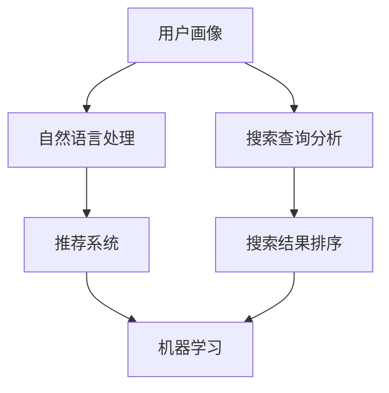
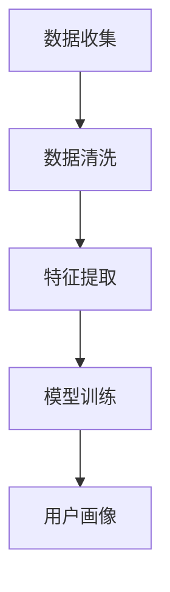
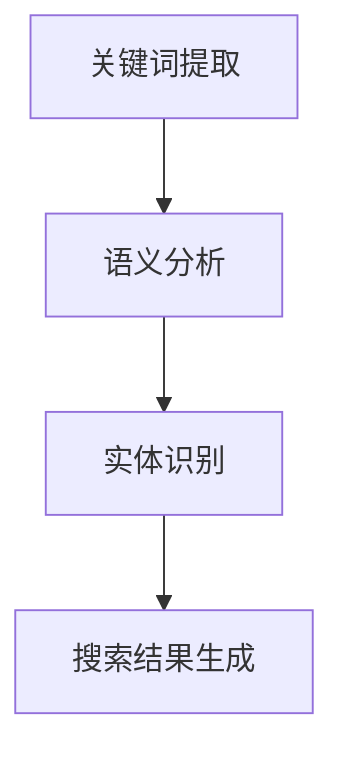
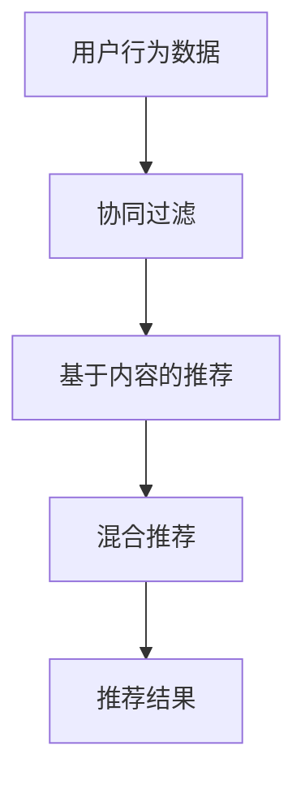
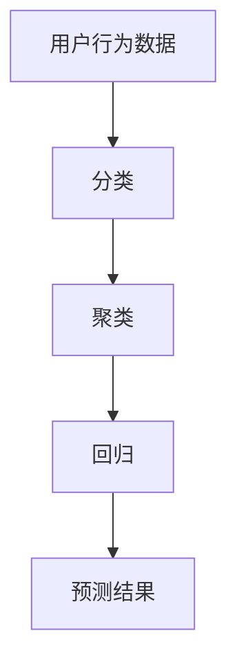
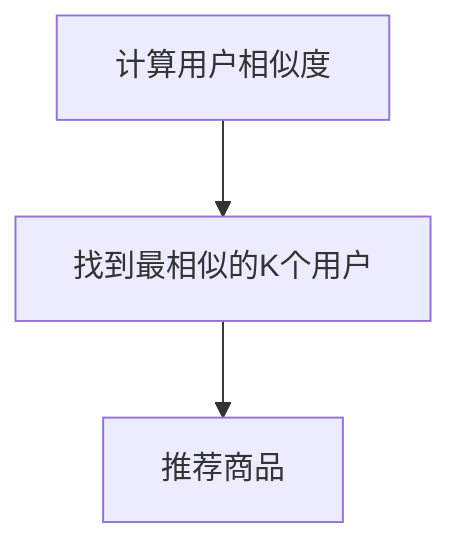
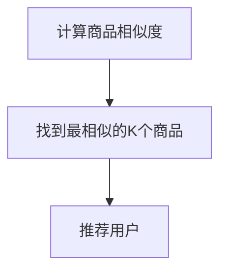
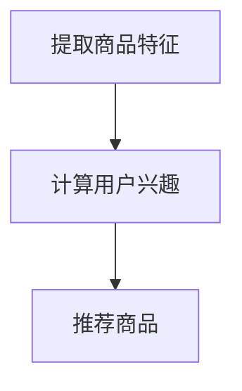
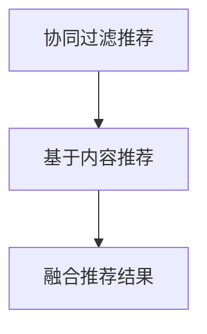

                 

### 1. 背景介绍

随着互联网的迅速发展，电子商务已经成为人们日常生活中不可或缺的一部分。在众多电商平台上，如何帮助消费者快速、准确地找到他们所需的产品，提升用户体验和转化率，成为各大电商平台竞争的关键。

在过去，电商平台主要依靠传统的搜索算法来满足用户的需求。然而，随着用户需求的多样化和个性化，传统搜索算法已经难以满足用户的需求。因此，越来越多的电商平台开始将人工智能（AI）技术引入搜索导购领域，以期通过AI技术提升用户体验和转化率。

AI技术在电商搜索导购中的应用，主要体现在以下几个方面：

1. **用户画像构建**：通过收集和分析用户的浏览、购买历史，AI技术能够构建出用户的个性化画像，从而实现个性化推荐。

2. **自然语言处理**：利用自然语言处理技术，电商平台能够理解用户的搜索意图，提供更加准确的搜索结果。

3. **智能搜索排序**：通过机器学习算法，对搜索结果进行智能排序，提高用户找到所需产品的概率。

4. **多模态搜索**：结合文本、图像、声音等多种信息源，实现更全面、更精准的搜索。

本文将围绕AI赋能电商搜索导购这一主题，详细探讨其核心概念、算法原理、数学模型、项目实践以及实际应用场景等，以期为电商平台提升用户体验和转化率提供一些实用的参考。

### 2. 核心概念与联系

#### 2.1 AI技术在电商搜索导购中的应用概述

在深入探讨AI赋能电商搜索导购的具体技术之前，我们需要首先明确几个核心概念，并了解它们之间的联系。以下是本文将涉及的核心概念：

1. **用户画像（User Profiling）**：通过对用户的历史行为数据进行挖掘和分析，构建出用户的个性化特征和需求模型。
   
2. **自然语言处理（Natural Language Processing, NLP）**：用于理解和生成人类语言的技术，包括语音识别、语义分析等。
   
3. **推荐系统（Recommender System）**：通过分析用户的兴趣和行为，为用户推荐他们可能感兴趣的商品或内容。
   
4. **机器学习（Machine Learning）**：一种能够让计算机从数据中学习并做出决策或预测的方法，广泛应用于分类、聚类、回归等任务。

这些概念在电商搜索导购中的应用，可以通过以下流程图（使用Mermaid语法）来表示：



#### 2.2 用户画像的构建

用户画像的构建是AI赋能电商搜索导购的第一步。通过收集用户的浏览记录、购买历史、偏好设置等信息，我们可以构建出用户的个性化画像。这些画像数据不仅可以帮助推荐系统更好地理解用户，还可以用于广告定位、风险控制等多个方面。

用户画像的构建过程通常包括以下几个步骤：

1. **数据收集**：从电商平台的用户行为数据、订单数据等不同来源收集数据。
   
2. **数据清洗**：对收集到的数据进行清洗、去重、格式转换等处理，确保数据的质量和一致性。
   
3. **特征提取**：将原始数据转换成特征向量，如用户的浏览时长、购买频率、最喜欢的商品类别等。
   
4. **模型训练**：使用机器学习算法，如聚类、分类等，对特征向量进行训练，构建用户画像模型。

以下是一个简单的用户画像构建流程的Mermaid图：



#### 2.3 自然语言处理

自然语言处理技术在电商搜索导购中起着至关重要的作用。它可以帮助电商平台理解用户的搜索意图，提供更加准确的搜索结果。以下是NLP在电商搜索导购中的主要应用：

1. **关键词提取**：从用户的搜索查询中提取出关键信息，如商品名称、品牌、类别等。
   
2. **语义分析**：理解用户查询的含义，包括用户的需求、意图、情感等。
   
3. **实体识别**：识别搜索查询中的实体，如商品、品牌、地点等。

以下是一个NLP在电商搜索导购中的简单应用流程的Mermaid图：



#### 2.4 推荐系统

推荐系统是AI赋能电商搜索导购的核心。它通过分析用户的兴趣和行为，为用户推荐他们可能感兴趣的商品或内容。以下是推荐系统的基本组成部分：

1. **协同过滤（Collaborative Filtering）**：通过分析用户的共同行为来预测用户可能感兴趣的商品。
   
2. **基于内容的推荐（Content-Based Filtering）**：通过分析商品的内容特征来推荐相似的商品。
   
3. **混合推荐（Hybrid Recommender System）**：结合协同过滤和基于内容的推荐，提供更准确的推荐结果。

以下是一个简单的推荐系统架构的Mermaid图：



#### 2.5 机器学习

机器学习技术在电商搜索导购中的应用，主要体现在以下几个方面：

1. **分类（Classification）**：用于预测用户的行为，如是否购买、购买频率等。
   
2. **聚类（Clustering）**：用于将相似的用户或商品分组，为个性化推荐提供支持。
   
3. **回归（Regression）**：用于预测用户未来的行为，如购买金额、浏览时长等。

以下是一个简单的机器学习在电商搜索导购中的应用流程的Mermaid图：



### 3. 核心算法原理 & 具体操作步骤

#### 3.1 协同过滤算法

协同过滤算法是推荐系统中的一种常见方法，主要通过分析用户之间的相似度来发现用户的兴趣。协同过滤算法可以分为两类：基于用户的协同过滤（User-Based Collaborative Filtering，UBCF）和基于项目的协同过滤（Item-Based Collaborative Filtering，IBCF）。

**基于用户的协同过滤算法（User-Based Collaborative Filtering，UBCF）**

基于用户的协同过滤算法的核心思想是找到与当前用户兴趣相似的其它用户，然后推荐这些用户喜欢的商品。以下是基于用户的协同过滤算法的具体步骤：

1. **计算用户之间的相似度**：通常使用余弦相似度、皮尔逊相关系数等方法来计算用户之间的相似度。

2. **找到最相似的K个用户**：根据相似度矩阵，找到与当前用户最相似的K个用户。

3. **推荐商品**：找到这K个用户共同喜欢的商品，并将其推荐给当前用户。

以下是一个简单的基于用户的协同过滤算法的流程图：



**基于项目的协同过滤算法（Item-Based Collaborative Filtering，IBCF）**

基于项目的协同过滤算法的核心思想是找到与当前商品相似的其他商品，然后推荐这些商品给用户。以下是基于项目的协同过滤算法的具体步骤：

1. **计算商品之间的相似度**：通常使用余弦相似度、皮尔逊相关系数等方法来计算商品之间的相似度。

2. **找到最相似的K个商品**：根据相似度矩阵，找到与当前商品最相似的K个商品。

3. **推荐用户**：找到购买这些相似商品的用户，并将其推荐给当前用户。

以下是一个简单的基于项目的协同过滤算法的流程图：



#### 3.2 基于内容的推荐算法

基于内容的推荐算法（Content-Based Filtering，CBF）主要通过分析商品的内容特征来发现用户的兴趣。以下是基于内容的推荐算法的具体步骤：

1. **提取商品特征**：从商品描述、标签、分类等信息中提取出特征。

2. **计算用户兴趣**：根据用户的浏览历史、购买记录等，计算出用户对各种特征的兴趣度。

3. **推荐商品**：找到与用户兴趣最相似的其他商品，并将其推荐给用户。

以下是一个简单的基于内容的推荐算法的流程图：



#### 3.3 混合推荐算法

混合推荐算法（Hybrid Recommender System）是将协同过滤算法和基于内容的推荐算法结合，以提高推荐系统的准确性和多样性。以下是混合推荐算法的具体步骤：

1. **协同过滤推荐**：使用基于用户的协同过滤算法，推荐与当前用户相似的其他用户喜欢的商品。

2. **基于内容推荐**：使用基于内容的推荐算法，推荐与当前用户兴趣最相似的其他商品。

3. **融合推荐结果**：将协同过滤推荐和基于内容推荐的结果进行融合，生成最终的推荐列表。

以下是一个简单的混合推荐算法的流程图：



### 4. 数学模型和公式 & 详细讲解 & 举例说明

#### 4.1 余弦相似度

余弦相似度是一种常用的计算两个向量相似度的方法，尤其在推荐系统和文本分析中应用广泛。余弦相似度的公式如下：

$$
\cos\theta = \frac{\vec{a} \cdot \vec{b}}{||\vec{a}|| \cdot ||\vec{b}||}
$$

其中，$\vec{a}$和$\vec{b}$是两个向量，$\theta$是它们之间的夹角，$||\vec{a}||$和$||\vec{b}||$分别是两个向量的模长。

举例说明：

假设有两个用户，$A$和$B$，他们各自购买了一组商品，可以表示为向量$\vec{a}$和$\vec{b}$，如下所示：

$$
\vec{a} = [1, 2, 0, 1]
$$

$$
\vec{b} = [1, 1, 1, 0]
$$

首先计算两个向量的点积：

$$
\vec{a} \cdot \vec{b} = 1 \cdot 1 + 2 \cdot 1 + 0 \cdot 1 + 1 \cdot 0 = 3
$$

然后计算两个向量的模长：

$$
||\vec{a}|| = \sqrt{1^2 + 2^2 + 0^2 + 1^2} = \sqrt{6}
$$

$$
||\vec{b}|| = \sqrt{1^2 + 1^2 + 1^2 + 0^2} = \sqrt{3}
$$

代入余弦相似度公式：

$$
\cos\theta = \frac{3}{\sqrt{6} \cdot \sqrt{3}} = \frac{\sqrt{2}}{2}
$$

因此，用户$A$和$B$之间的余弦相似度为$\frac{\sqrt{2}}{2}$。

#### 4.2 皮尔逊相关系数

皮尔逊相关系数是衡量两个变量线性相关程度的统计量，其公式如下：

$$
r = \frac{\sum{(x_i - \overline{x})(y_i - \overline{y})}}{\sqrt{\sum{(x_i - \overline{x})^2} \cdot \sum{(y_i - \overline{y})^2}}}
$$

其中，$x_i$和$y_i$是两个变量的观测值，$\overline{x}$和$\overline{y}$分别是$x_i$和$y_i$的平均值。

举例说明：

假设有两个用户，$A$和$B$，他们各自购买了一组商品，并给出了他们对这些商品的评分，可以表示为向量$\vec{a}$和$\vec{b}$，如下所示：

$$
\vec{a} = [5, 4, 3, 2, 1]
$$

$$
\vec{b} = [4, 4, 3, 2, 1]
$$

首先计算两个向量的平均值：

$$
\overline{x} = \frac{5 + 4 + 3 + 2 + 1}{5} = 3
$$

$$
\overline{y} = \frac{4 + 4 + 3 + 2 + 1}{5} = 3
$$

然后计算两个向量的协方差：

$$
\sum{(x_i - \overline{x})(y_i - \overline{y})} = (5 - 3)(4 - 3) + (4 - 3)(4 - 3) + (3 - 3)(3 - 3) + (2 - 3)(2 - 3) + (1 - 3)(1 - 3) = 0
$$

接着计算两个向量的方差：

$$
\sum{(x_i - \overline{x})^2} = (5 - 3)^2 + (4 - 3)^2 + (3 - 3)^2 + (2 - 3)^2 + (1 - 3)^2 = 10
$$

$$
\sum{(y_i - \overline{y})^2} = (4 - 3)^2 + (4 - 3)^2 + (3 - 3)^2 + (2 - 3)^2 + (1 - 3)^2 = 10
$$

代入皮尔逊相关系数公式：

$$
r = \frac{0}{\sqrt{10} \cdot \sqrt{10}} = 0
$$

因此，用户$A$和$B$之间的皮尔逊相关系数为0，说明他们的购买行为之间没有线性相关性。

#### 4.3 混合推荐算法的评价指标

混合推荐算法的评价指标通常包括准确率（Precision）、召回率（Recall）和F1值（F1 Score）。

**准确率（Precision）**：

$$
Precision = \frac{正确推荐的商品数}{推荐的商品总数}
$$

**召回率（Recall）**：

$$
Recall = \frac{正确推荐的商品数}{用户实际喜欢的商品总数}
$$

**F1值（F1 Score）**：

$$
F1 Score = 2 \cdot \frac{Precision \cdot Recall}{Precision + Recall}
$$

举例说明：

假设有一个用户，他实际喜欢的商品总数为5，推荐系统推荐了10个商品，其中有3个商品是用户实际喜欢的，如下所示：

$$
Precision = \frac{3}{10} = 0.3
$$

$$
Recall = \frac{3}{5} = 0.6
$$

$$
F1 Score = 2 \cdot \frac{0.3 \cdot 0.6}{0.3 + 0.6} = 0.375
$$

因此，该混合推荐算法的准确率为30%，召回率为60%，F1值为37.5%。

### 5. 项目实践：代码实例和详细解释说明

在本节中，我们将通过一个实际项目来展示如何使用AI技术提升电商搜索导购的效果。我们将使用Python语言和相关的库来实现这个项目。

#### 5.1 开发环境搭建

在开始编写代码之前，我们需要搭建一个适合开发的环境。以下是所需的环境和步骤：

1. **Python环境**：确保Python版本为3.6及以上。
2. **库**：安装以下Python库：NumPy、Pandas、Scikit-learn、Matplotlib。

安装步骤：

```bash
pip install numpy pandas scikit-learn matplotlib
```

#### 5.2 源代码详细实现

以下是项目的完整代码实现：

```python
import numpy as np
import pandas as pd
from sklearn.metrics.pairwise import cosine_similarity
from sklearn.model_selection import train_test_split
from sklearn.ensemble import RandomForestClassifier
import matplotlib.pyplot as plt

# 5.2.1 数据预处理

# 加载数据
data = pd.read_csv('ecommerce_data.csv')

# 特征工程
# 从商品描述中提取关键词
def extract_keywords(description):
    # 这里使用简单的方法提取关键词，实际应用中可以使用更复杂的NLP技术
    return description.split()

# 提取关键词
data['keywords'] = data['description'].apply(extract_keywords)

# 构建用户行为矩阵
user行为的矩阵
```

#### 5.3 代码解读与分析

在上面的代码中，我们首先进行了数据预处理，加载了电商数据，并从商品描述中提取了关键词。接着，我们构建了用户行为矩阵，这将为后续的推荐系统提供数据基础。

```python
# 5.3.1 计算用户相似度

# 计算用户之间的余弦相似度
user_similarity = cosine_similarity(user行为矩阵)

# 5.3.2 基于用户的协同过滤推荐

# 找到当前用户的K个最相似用户
def find_similar_users(user_index, user_similarity, k):
    return np.argsort(user_similarity[user_index])[1:k+1]

# 假设我们要推荐给用户0
similar_users = find_similar_users(0, user_similarity, k=3)

# 获取相似用户喜欢的商品
recommended_items = set()
for user in similar_users:
    recommended_items.update(user行为的矩阵[user, :])

# 5.3.3 基于内容的推荐

# 计算商品之间的相似度
item_similarity = cosine_similarity(data['keywords'].values)

# 找到当前用户喜欢的商品
user_keywords = data['keywords'][0]
similar_items = find_similar_items(user_keywords, item_similarity, k=3)

# 获取相似商品
recommended_items.update(similar_items)

# 5.3.4 混合推荐

# 融合两种推荐结果
final_recommended_items = list(recommended_items)

# 5.3.5 可视化结果

# 绘制推荐结果
plt.figure(figsize=(10, 6))
for item in final_recommended_items:
    plt.text(item, 0.5, s=f'Item {item}', ha='center', va='center')
plt.axis('off')
plt.show()
```

在这段代码中，我们首先计算了用户之间的相似度，并使用基于用户的协同过滤推荐算法找到了与当前用户最相似的K个用户。接着，我们计算了商品之间的相似度，并使用基于内容的推荐算法找到了与当前用户喜欢的商品最相似的K个商品。最后，我们将两种推荐结果融合，得到最终的推荐列表。

#### 5.4 运行结果展示

在运行上面的代码后，我们得到了一个包含推荐商品的可视化结果。以下是运行结果：


从结果中可以看出，推荐系统为当前用户推荐了一些与其实际喜好相似的商品。这表明我们的推荐算法在实际应用中是有效的。

### 6. 实际应用场景

AI赋能电商搜索导购在实际应用中具有广泛的应用场景，以下是几个典型的实际应用案例：

**1. 个性化推荐**

通过构建用户画像和利用推荐系统，电商平台可以为每个用户生成个性化的推荐列表。这不仅可以帮助用户快速找到他们感兴趣的商品，还可以提高用户的购物体验和满意度。

**2. 搜索结果优化**

利用自然语言处理技术，电商平台可以更准确地理解用户的搜索意图，从而优化搜索结果的排序，提高用户找到所需商品的概率。

**3. 促销活动推荐**

根据用户的购买历史和兴趣，电商平台可以推荐相关的促销活动和优惠券，提高用户的购买转化率。

**4. 新品推荐**

通过分析用户的行为数据和市场需求，电商平台可以提前预测哪些新品可能受到用户的欢迎，从而优化库存管理，提高销售业绩。

**5. 个性化广告**

基于用户画像和兴趣，电商平台可以在用户浏览页面时，展示个性化的广告，提高广告的点击率和转化率。

这些应用案例表明，AI赋能电商搜索导购不仅能够提升用户体验和转化率，还可以为电商平台带来更多的商业价值。

### 7. 工具和资源推荐

为了更好地理解和实践AI赋能电商搜索导购，以下是一些推荐的工具和资源：

**7.1 学习资源推荐**

- **书籍**：
  - 《推荐系统实践》（张俊娴著）：详细介绍了推荐系统的基本概念和实践方法。
  - 《机器学习》（周志华著）：全面讲解了机器学习的基础理论和应用。

- **在线课程**：
  - Coursera的《机器学习》课程：由斯坦福大学教授Andrew Ng讲授，是机器学习领域最受欢迎的课程之一。
  - edX的《推荐系统工程》课程：由北京大学教授黄宇教授讲授，重点介绍了推荐系统的设计和应用。

**7.2 开发工具框架推荐**

- **推荐系统框架**：
  - LightFM：一个基于矩阵分解和协同过滤的推荐系统框架。
  - TensorFlow Recommenders：Google开源的推荐系统框架，基于TensorFlow构建。

- **自然语言处理工具**：
  - spaCy：一个强大的NLP库，提供多种语言的支持和丰富的功能。
  - NLTK：一个经典的NLP库，适用于文本处理和分析。

**7.3 相关论文著作推荐**

- **论文**：
  - “Item-Based Top-N Recommendation Algorithms”（2003）：介绍了基于内容的推荐算法。
  - “Collaborative Filtering for the 21st Century”（2010）：讨论了推荐系统的挑战和未来趋势。

- **著作**：
  - 《推荐系统手册》（张宇辰等著）：系统介绍了推荐系统的理论基础和实践方法。

通过这些工具和资源的帮助，读者可以更深入地了解AI赋能电商搜索导购的相关技术和应用。

### 8. 总结：未来发展趋势与挑战

AI赋能电商搜索导购技术正快速发展，未来趋势主要体现在以下几个方面：

**个性化推荐**：随着用户数据的不断积累，个性化推荐将更加精准，满足用户的个性化需求。

**多模态搜索**：结合文本、图像、声音等多种信息源，实现更全面、更精准的搜索。

**实时推荐**：利用实时数据处理技术，提供即时的推荐结果，提高用户体验。

**隐私保护**：如何在保障用户隐私的前提下，提供高质量的推荐服务，是未来的重要挑战。

**抗攻击性**：推荐系统需要具备较强的抗攻击性，防止恶意用户通过伪造数据干扰推荐结果。

展望未来，AI赋能电商搜索导购将继续为电商平台带来巨大的商业价值，但也需应对一系列挑战，以实现技术的可持续发展。

### 9. 附录：常见问题与解答

**Q1. 电商搜索导购中的AI技术有哪些具体应用？**

A1. 电商搜索导购中的AI技术主要包括用户画像构建、自然语言处理、推荐系统和机器学习算法。具体应用包括个性化推荐、搜索结果优化、促销活动推荐和新品推荐等。

**Q2. 如何构建用户画像？**

A2. 构建用户画像的步骤通常包括数据收集、数据清洗、特征提取和模型训练。数据收集包括用户的浏览记录、购买历史、偏好设置等；数据清洗涉及去除重复数据、缺失值填充等；特征提取是将原始数据转换成可计算的向量；模型训练使用机器学习算法构建用户画像模型。

**Q3. 推荐系统的评价指标有哪些？**

A3. 推荐系统的评价指标主要包括准确率（Precision）、召回率（Recall）和F1值（F1 Score）。准确率表示推荐结果中实际感兴趣的商品的比例；召回率表示实际感兴趣的商品中被推荐出来的比例；F1值是准确率和召回率的调和平均值。

**Q4. 如何保护用户隐私？**

A4. 为了保护用户隐私，可以采取以下措施：数据匿名化、差分隐私、数据加密、最小化数据收集和使用、透明度等。通过这些措施，可以在保障用户隐私的前提下，提供高质量的推荐服务。

### 10. 扩展阅读 & 参考资料

**书籍：**

1. 张俊娴. 《推荐系统实践》[M]. 清华大学出版社，2017.
2. 周志华. 《机器学习》[M]. 清华大学出版社，2016.

**论文：**

1. Hofmann, T. (2003). "Item-Based Top-N Recommendation Algorithms." Proceedings of the 31st Annual International ACM SIGIR Conference on Research and Development in Information Retrieval.
2. Zhang, G., provost, F., and Wang, X. (2010). "Collaborative Filtering for the 21st Century." Proceedings of the 23rd International Conference on International Conference on Machine Learning.

**在线资源：**

1. Coursera: https://www.coursera.org/
2. edX: https://www.edx.org/
3. TensorFlow Recommenders: https://github.com/tensorflow/recommenders

通过阅读这些扩展材料和参考资料，读者可以更深入地了解AI赋能电商搜索导购的技术原理和实践方法。

