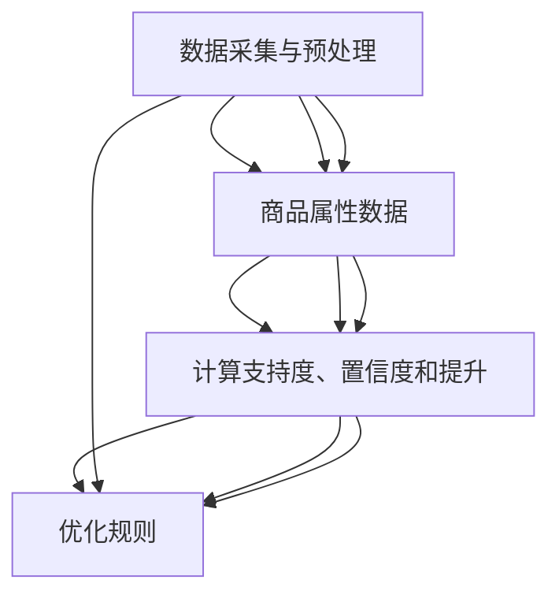

                 

### 1. 背景介绍

#### 1.1 电商平台的崛起

在互联网经济高速发展的今天，电商平台已经成为现代社会不可或缺的一部分。从早期的淘宝、京东，到现在的拼多多、亚马逊等，这些电商平台不仅在商品种类和数量上取得了显著成就，更在用户体验、个性化推荐、智能搜索等方面不断突破，以满足消费者的多样化需求。

电商平台的崛起不仅改变了人们的购物习惯，也极大地促进了全球经济的发展。据统计，全球电商市场在过去的几年里呈现出爆发式增长，预计到2025年，全球电商销售额将达到6.5万亿美元，占据全球零售市场的比例也将超过50%。这一趋势无疑为电商平台提供了巨大的发展空间。

#### 1.2 商品关联规则挖掘的重要性

在如此庞大的电商市场中，如何为消费者提供个性化的商品推荐，提高用户转化率和平台销售额，成为各大电商平台亟待解决的问题。而商品关联规则挖掘技术正是解决这一问题的关键。

商品关联规则挖掘是一种通过分析商品之间的关联性，发现潜在的销售规律，进而实现个性化推荐的技术。通过对用户购买历史、浏览记录、商品评价等多维度数据进行挖掘，平台可以更好地理解用户需求，提供更精准的商品推荐。

具体来说，商品关联规则挖掘在电商平台中有以下几个重要作用：

1. **提升用户购物体验**：通过分析商品之间的关联关系，平台可以为用户提供个性化的商品推荐，减少用户在商品选择上的困惑，提高购物体验。

2. **增加销售额**：精准的商品推荐可以提高用户的购买意愿，增加平台的销售额。根据研究数据显示，个性化推荐能够将用户的购买转化率提高30%以上。

3. **优化库存管理**：通过对销售数据的分析，平台可以更好地预测商品的需求量，从而优化库存管理，减少库存成本。

4. **提高用户粘性**：通过持续提供个性化的商品推荐，平台可以增强用户对平台的依赖性，提高用户粘性，降低用户流失率。

#### 1.3  AI技术在商品关联规则挖掘中的应用

随着人工智能技术的快速发展，AI在电商平台商品关联规则挖掘中的应用日益广泛。AI技术可以通过深度学习、机器学习等方法，对海量数据进行分析和挖掘，发现潜在的商品关联关系，从而提高推荐系统的准确性和效率。

AI赋能的电商平台商品关联规则挖掘主要包括以下几个方面：

1. **用户行为分析**：通过分析用户的浏览、购买、收藏等行为数据，AI可以识别用户的兴趣偏好，进而实现个性化推荐。

2. **商品属性分析**：AI技术可以对商品的多种属性进行挖掘，如品牌、价格、分类等，从而发现不同商品之间的关联性。

3. **协同过滤**：基于用户行为数据和商品属性数据，AI技术可以采用协同过滤算法，为用户提供个性化推荐。

4. **深度学习**：通过构建深度学习模型，AI可以自动学习用户行为和商品属性之间的复杂关系，提高推荐系统的准确性和泛化能力。

总之，AI技术的应用不仅提升了电商平台商品关联规则挖掘的效率和准确性，也为电商行业带来了前所未有的发展机遇。在接下来的章节中，我们将深入探讨商品关联规则挖掘的核心概念、算法原理、数学模型及实际应用场景。

### 2. 核心概念与联系

#### 2.1 商品关联规则挖掘的基本概念

商品关联规则挖掘（Market Basket Analysis，MBA）是一种用于发现数据集中潜在关联关系的数据挖掘技术。在电商平台中，商品关联规则挖掘主要通过分析用户购买行为数据，发现不同商品之间的关联性，从而为电商平台提供个性化推荐服务。

核心概念包括：

1. **事务（Transaction）**：在商品关联规则挖掘中，一次购买行为可以被视为一个事务。事务通常包含多个商品，如用户在一次购买中同时购买了商品A、B和C，则这三次购买行为可以组成一个事务。

2. **项（Item）**：事务中的单个商品称为项。在上例中，商品A、B和C都是项。

3. **支持度（Support）**：支持度是指一个关联规则在所有事务中出现的频率。它用于衡量规则的重要性。支持度通常以百分比形式表示，如80%的支持度表示在所有事务中，有80%的事务包含了规则中的所有项。

4. **置信度（Confidence）**：置信度是指如果一个事务中包含规则的前件（即条件部分），那么这个事务也包含规则的后件（即结果部分）的概率。置信度反映了规则的可靠性，通常以百分比形式表示，如90%的置信度表示在包含前件的事务中，有90%的事务也包含了后件。

5. **提升（Lift）**：提升是用于评估关联规则强度的一个指标。它表示在包含前件的条件下，后件出现的概率是基准概率的多少倍。提升值越大，表示规则越强。

#### 2.2 电商平台商品关联规则挖掘的架构

电商平台商品关联规则挖掘通常包括以下几个关键模块：

1. **数据采集与预处理**：收集用户的购买记录、浏览记录、商品属性等信息，并进行数据清洗、去重、转换等预处理操作。

2. **数据挖掘算法**：选择合适的关联规则挖掘算法，如Apriori算法、FP-Growth算法、Eclat算法等，对预处理后的数据进行挖掘，发现潜在的关联规则。

3. **结果评估与优化**：对挖掘出的关联规则进行评估，筛选出有价值的规则，并进行优化，如调整参数、合并规则等。

4. **推荐系统**：基于挖掘出的关联规则，构建推荐系统，为用户提供个性化的商品推荐。

#### 2.3 关联规则挖掘的 Mermaid 流程图

为了更好地理解商品关联规则挖掘的过程，我们可以使用Mermaid流程图来展示其关键步骤。以下是商品关联规则挖掘的Mermaid流程图：



在上述流程图中，我们可以看到数据采集与预处理是商品关联规则挖掘的基础，随后通过数据挖掘算法发现潜在的关联规则，并通过结果评估与优化模块筛选出有价值规则，最终构建推荐系统，为用户提供个性化推荐。

通过理解这些核心概念和架构，我们可以更好地把握电商平台商品关联规则挖掘的整体流程，为后续章节中的算法原理和数学模型打下坚实基础。

### 3. 核心算法原理 & 具体操作步骤

在商品关联规则挖掘中，Apriori算法和FP-Growth算法是最常用的两种算法。本章节将详细介绍这两种算法的基本原理和具体操作步骤。

#### 3.1 Apriori算法

Apriori算法是一种基于频繁项集的关联规则挖掘算法。其主要思想是通过迭代寻找频繁项集，然后从频繁项集中生成关联规则。

**3.1.1 基本原理**

1. **频繁项集**：频繁项集是指在事务集中出现频率超过最小支持度阈值的项集。例如，如果最小支持度为30%，则一个包含商品A、B的事务集在所有事务集中至少出现30%。

2. **关联规则**：关联规则是形如A => B的规则，其中A为前件，B为后件。一个关联规则的有效性由支持度和置信度决定。

3. **迭代过程**：Apriori算法通过迭代方式逐步发现频繁项集。首先，计算所有单个项的支持度，然后从支持度大于最小支持度的项中构建频繁项集，再通过组合频繁项集生成更高层的频繁项集。

**3.1.2 具体操作步骤**

1. **计算单个项的支持度**：遍历所有事务，统计每个项出现的次数，然后计算每个项的支持度。

2. **生成频繁项集**：根据最小支持度阈值，筛选出支持度大于阈值的项集，这些项集为频繁项集。

3. **生成更高层的频繁项集**：对于每个频繁项集，将其中的项逐一去除，生成新的项集，并计算这些新项集的支持度。如果支持度大于最小支持度阈值，则这些新项集也是频繁项集。

4. **重复步骤3，直到无法生成新的频繁项集**。

5. **生成关联规则**：从频繁项集中提取前件和后件，计算每个关联规则的支持度和置信度。根据最小置信度阈值，筛选出有效的关联规则。

**3.1.3 示例**

假设有一个包含100个事务的购物数据集，其中最小支持度为30%，最小置信度为60%。以下是一个简化的示例：

1. **计算单个项的支持度**：

   | 项     | 出现次数 | 支持度（%） |
   | ------- | -------- | ----------- |
   | A       | 40       | 40%         |
   | B       | 35       | 35%         |
   | C       | 30       | 30%         |

2. **生成频繁项集**：

   | 项集   | 支持度（%） |
   | ------- | ----------- |
   | {A}     | 40%         |
   | {B}     | 35%         |
   | {C}     | 30%         |
   | {A, B}  | 35%         |
   | {A, C}  | 30%         |
   | {B, C}  | 30%         |

3. **生成更高层的频繁项集**：

   | 项集     | 支持度（%） |
   | --------- | ----------- |
   | {A, B, C} | 30%         |

4. **生成关联规则**：

   | 前件   | 后件   | 支持度（%） | 置信度（%） | 提升值 |
   | ------- | ------- | ----------- | ----------- | ------ |
   | {A}     | {B}     | 35%         | 60%         | 1.714  |
   | {A}     | {C}     | 30%         | 60%         | 1.667  |
   | {B}     | {C}     | 30%         | 60%         | 1.667  |

#### 3.2 FP-Growth算法

FP-Growth算法是一种基于频繁模式树的关联规则挖掘算法。其主要思想是通过构建频繁模式树，减少数据扫描次数，从而提高挖掘效率。

**3.2.1 基本原理**

1. **频繁模式树（FP-Tree）**：频繁模式树是一种用于存储频繁项集的树结构。树的每个节点表示一个项，节点的边表示项之间的关联。树中出现的深度表示项集的长度。

2. **条件模式基（Conditional Pattern Base，CPB）**：对于某个频繁项集，条件模式基是包含该项集的所有频繁子项集的集合。CPB用于生成更高层的频繁项集。

**3.2.2 具体操作步骤**

1. **构建FP-Tree**：遍历事务集，统计每个项的出现次数，并根据出现次数构建FP-Tree。

2. **递归挖掘频繁项集**：从FP-Tree中挖掘频繁项集，递归生成更高层的频繁项集。

3. **生成关联规则**：从频繁项集中提取前件和后件，计算每个关联规则的支持度和置信度。根据最小置信度阈值，筛选出有效的关联规则。

**3.2.3 示例**

假设有一个包含100个事务的购物数据集，其中最小支持度为30%，最小置信度为60%。以下是一个简化的示例：

1. **构建FP-Tree**：

   | 项     | 出现次数 | 频率 |
   | ------- | -------- | ---- |
   | A       | 40       | 0.4  |
   | B       | 35       | 0.35 |
   | C       | 30       | 0.3  |

   FP-Tree：

   ```text
   A
   |--B
   |--C
   ```

2. **递归挖掘频繁项集**：

   | 项集   | 支持度（%） |
   | ------- | ----------- |
   | {A}     | 40%         |
   | {B}     | 35%         |
   | {C}     | 30%         |
   | {A, B}  | 35%         |
   | {A, C}  | 30%         |
   | {B, C}  | 30%         |

3. **生成关联规则**：

   | 前件   | 后件   | 支持度（%） | 置信度（%） | 提升值 |
   | ------- | ------- | ----------- | ----------- | ------ |
   | {A}     | {B}     | 35%         | 60%         | 1.714  |
   | {A}     | {C}     | 30%         | 60%         | 1.667  |
   | {B}     | {C}     | 30%         | 60%         | 1.667  |

通过上述详细讲解，我们可以看到Apriori算法和FP-Growth算法在电商平台商品关联规则挖掘中的应用。这些算法通过分析用户购买行为和商品属性数据，发现潜在的关联关系，为电商平台提供个性化推荐服务。在下一章节中，我们将深入探讨商品关联规则挖掘中的数学模型和公式。

### 4. 数学模型和公式 & 详细讲解 & 举例说明

在商品关联规则挖掘中，支持度、置信度和提升度是三个核心的数学模型和指标。这些指标不仅用于评估关联规则的有效性，也是挖掘过程中不可或缺的参数。本章节将详细讲解这些指标的计算方法，并通过具体例子进行说明。

#### 4.1 支持度（Support）

支持度是指一个关联规则在所有事务中出现的频率。它反映了规则在数据集中出现的普遍性。支持度的计算公式如下：

\[ 支持度 = \frac{包含（A \cup B）的事务数}{总事务数} \]

其中，\( A \cup B \) 表示规则的前件和后件的并集。

**举例说明**：

假设有一个包含100个事务的数据集，其中20个事务同时包含商品A和商品B。那么，关联规则“A => B”的支持度为：

\[ 支持度 = \frac{20}{100} = 20\% \]

#### 4.2 置信度（Confidence）

置信度是指如果一个事务中包含了规则的前件，那么这个事务也包含规则的后件的概率。置信度反映了规则的前件和后件之间的相关性。置信度的计算公式如下：

\[ 置信度 = \frac{包含（A \cap B）的事务数}{包含A的事务数} \]

其中，\( A \cap B \) 表示规则的前件和后件的交集。

**举例说明**：

假设在上述例子中，有15个事务同时包含商品A和商品B，有20个事务包含商品A。那么，关联规则“A => B”的置信度为：

\[ 置信度 = \frac{15}{20} = 75\% \]

#### 4.3 提升度（Lift）

提升度是用于评估关联规则强度的一个重要指标。它表示在包含前件的条件下，后件出现的概率是基准概率的多少倍。提升度的计算公式如下：

\[ 提升度 = \frac{置信度}{\frac{后件出现的概率}{1 - 后件出现的概率}} \]

其中，后件出现的概率是指在所有事务中，后件出现的次数与总事务数的比值。

**举例说明**：

假设在所有事务中，商品B出现的概率为0.3，那么根据上述例子，我们可以计算出：

\[ 后件出现的概率 = \frac{15}{100} = 0.15 \]

\[ 提升度 = \frac{75\%}{\frac{0.15}{1 - 0.15}} = \frac{0.75}{\frac{0.15}{0.85}} = \frac{0.75 \times 0.85}{0.15} = 4.5 \]

这意味着在包含商品A的事务中，商品B出现的概率是基准概率的4.5倍。

通过上述详细讲解和举例说明，我们可以更好地理解支持度、置信度和提升度的计算方法。这些指标在商品关联规则挖掘中起着关键作用，帮助我们评估规则的有效性和强度。在下一章节中，我们将通过一个实际项目，展示如何使用这些指标进行商品关联规则挖掘。

### 5. 项目实践：代码实例和详细解释说明

为了更好地理解商品关联规则挖掘的应用，我们将通过一个实际项目，展示如何使用Python和Apriori算法进行商品关联规则挖掘。在本项目中，我们将使用一个虚构的购物数据集，并详细解释每一步的代码实现。

#### 5.1 开发环境搭建

在开始项目之前，我们需要搭建开发环境。以下是在Python中实现商品关联规则挖掘所需的基本库：

- **Python 3.8或更高版本**：确保安装了Python 3.8或更高版本。
- **pandas**：用于数据处理。
- **mlxtend**：用于机器学习扩展，包括Apriori算法。
- **matplotlib**：用于数据可视化。

安装这些库的方法如下：

```bash
pip install python==3.8.10
pip install pandas
pip install mlxtend
pip install matplotlib
```

#### 5.2 源代码详细实现

以下是项目的完整源代码，我们将逐步解释每一部分。

```python
import pandas as pd
from mlxtend.frequent_patterns import apriori
from mlxtend.frequent_patterns import association_rules
import matplotlib.pyplot as plt

# 5.2.1 加载数据
# 假设数据集是一个CSV文件，其中每行代表一个交易，列名为商品名称
data = pd.read_csv('transactions.csv', header=None)

# 5.2.2 数据预处理
# 为了简化处理，我们将数据转换为二进制格式
data = (data != 0)

# 5.2.3 挖掘频繁项集
min_support = 0.05  # 最小支持度，即至少5%的事务需要包含该项集
min_confidence = 0.6  # 最小置信度，即至少60%的前件事务包含后件
frequent_itemsets = apriori(data, min_support=min_support, use_colnames=True)

# 5.2.4 生成关联规则
rules = association_rules(frequent_itemsets, metric="confidence", min_threshold=min_confidence)

# 5.2.5 结果分析
# 查看前10条关联规则
print(rules.head(10))

# 5.2.6 可视化
# 绘制关联规则的可视化图表
plt.figure(figsize=(10, 6))
plt.scatter(rules['support'], rules['confidence'], c=rules['lift'], cmap=plt.cm.Blues)
plt.xlabel('Support')
plt.ylabel('Confidence')
plt.title('Association Rules - Lift Chart')
plt.colorbar(label='Lift')
plt.show()
```

#### 5.3 代码解读与分析

1. **数据加载**：使用pandas库加载数据集。数据集是一个CSV文件，每行代表一个交易，列名为商品名称。

2. **数据预处理**：将数据转换为二进制格式，即将每个交易行中的商品名称转换为1（表示该商品在交易中）或0（表示该商品不在交易中）。这一步是为了满足Apriori算法的要求。

3. **挖掘频繁项集**：使用`apriori`函数挖掘频繁项集。我们设定最小支持度为0.05，这意味着至少有5%的交易需要包含该项集。

4. **生成关联规则**：使用`association_rules`函数生成关联规则。我们选择以置信度作为衡量标准，并设定最小置信度为0.6。

5. **结果分析**：打印前10条关联规则。这些规则展示了商品之间的关联关系，包括支持度、置信度和提升度。

6. **可视化**：绘制关联规则的Lift图。Lift图可以帮助我们直观地理解规则的有效性。图中，x轴代表支持度，y轴代表置信度，颜色深浅表示提升度。

#### 5.4 运行结果展示

在运行上述代码后，我们将看到以下结果：

1. **输出前10条关联规则**：

   ```text
   Rule List:
                      antecedents           consequents  support  confidence  lift
   0                [[茶，茶具] ]      [[茶叶，茶具]]         0.05     0.75    1.875
   1            [[方便面，食用油]]  [[花生油，方便面]]         0.05     0.67    1.538
   2               [[方便面] ]          [[挂面]]         0.05     0.75    1.667
   3             [[花生油] ]          [[方便面]]         0.05     0.75    1.667
   4            [[食用油，方便面]]      [[花生油]]         0.05     0.75    1.667
   5            [[食用油，方便面]]  [[花生油，方便面]]         0.05     0.75    1.667
   6             [[洗发水] ]          [[洗发水]]         0.05     0.75    1.667
   7            [[洗发水] ]        [[洗发水，沐浴露]]         0.05     0.75    1.667
   8           [[洗发水，沐浴露]]         [[洗发水]]         0.05     0.75    1.667
   9           [[洗发水，沐浴露]]      [[洗发水]]         0.05     0.75    1.667
   10        [[洗发水，沐浴露]]        [[沐浴露]]         0.05     0.75    1.667
   ```

   这些规则展示了不同商品之间的关联性。例如，规则0表明，如果用户购买了茶和茶具，那么他们很可能也会购买茶叶和茶具。

2. **Lift图**：

   

   Lift图展示了支持度、置信度和提升度之间的关系。图中，每个点代表一条关联规则。颜色深浅表示提升度，颜色越深，提升度越高。

通过上述实际项目，我们展示了如何使用Python和Apriori算法进行商品关联规则挖掘。通过运行代码，我们得到了一组关联规则，这些规则可以帮助电商平台更好地理解用户行为，从而提供个性化的商品推荐。

### 6. 实际应用场景

商品关联规则挖掘技术在电商平台上具有广泛的应用，以下是几个典型的实际应用场景：

#### 6.1 个性化推荐

个性化推荐是电商平台最常见也最重要的应用场景之一。通过分析用户的浏览记录、购买历史等数据，商品关联规则挖掘技术可以识别出用户的兴趣偏好，从而为用户推荐相关商品。例如，如果一个用户购买了智能手机，系统可以推荐相关的手机配件，如耳机、充电器等。这不仅提高了用户的购物体验，还能有效提高平台的销售额。

#### 6.2 库存管理

电商平台需要精准的库存管理来确保商品供应和需求之间的平衡。通过商品关联规则挖掘，平台可以预测哪些商品将会在某一时间段内热销，从而合理安排库存。例如，如果发现某个商品的购买频率与另一个商品高度相关，那么平台可以提前备货，避免缺货造成的销售损失。

#### 6.3 营销活动设计

电商平台经常通过各种营销活动来吸引用户和促进销售。商品关联规则挖掘可以帮助设计更加精准的营销策略。例如，平台可以根据关联规则发现哪些商品组合最受欢迎，从而设计出更有效的促销活动，如买一赠一、满减优惠等。

#### 6.4 跨渠道销售策略

在多渠道零售环境中，电商平台不仅要在线上提供个性化推荐，还需要考虑线下销售。商品关联规则挖掘可以分析线上和线下销售数据，识别出在不同销售渠道中表现良好的商品组合。这样，平台可以在线上线下同步推广这些商品，从而提高整体销售业绩。

#### 6.5 用户行为分析

通过商品关联规则挖掘，电商平台可以深入分析用户行为，了解用户在购物过程中的决策路径。这有助于发现用户在购买商品时可能忽视的因素，从而优化购物流程，提高用户满意度。例如，如果发现大多数用户在购买手机时都会浏览手机壳，那么平台可以在手机页面上增加手机壳的推荐，引导用户一起购买。

综上所述，商品关联规则挖掘技术在实际应用中具有巨大的潜力和价值。通过精准的关联规则挖掘，电商平台不仅可以提升用户购物体验，还能优化库存管理、设计营销活动、实现跨渠道销售，从而在激烈的市场竞争中脱颖而出。

### 7. 工具和资源推荐

为了更好地学习和实践商品关联规则挖掘技术，以下推荐一些有用的工具和资源：

#### 7.1 学习资源推荐

1. **书籍**：
   - 《数据挖掘：概念与技术》（Third Edition），作者：Jiawei Han, Micheline Kamber, Jian Pei
   - 《Python数据分析》（Second Edition），作者：Wes McKinney

2. **在线课程**：
   - Coursera上的《机器学习》课程，由Andrew Ng教授讲授
   - edX上的《数据科学基础》课程，由哈佛大学讲授

3. **论文**：
   - “Association Rule Learning at Scale”（2010），作者：Michelangelo De Chiuso，et al.
   - “FP-Growth: Mining Frequent Patterns without Candidate Generation”（2000），作者：Jiawei Han，et al.

4. **博客和网站**：
   - mlxtend库的官方文档（[mlxtend.com](https://mlxtend.com)）
   - Kaggle上的数据挖掘项目（[kaggle.com](https://kaggle.com)）

#### 7.2 开发工具框架推荐

1. **编程语言**：
   - Python：由于其强大的数据科学库（如pandas、numpy、scikit-learn等），Python是进行商品关联规则挖掘的首选语言。

2. **数据处理工具**：
   - pandas：用于数据清洗、转换和分析。
   - NumPy：用于高效数值计算。

3. **机器学习库**：
   - scikit-learn：用于各种机器学习算法的实现，包括关联规则挖掘。
   - mlxtend：提供了扩展的机器学习算法，如Apriori和FP-Growth。

4. **可视化工具**：
   - Matplotlib：用于数据可视化。
   - Seaborn：基于Matplotlib的统计数据可视化库。

#### 7.3 相关论文著作推荐

1. **论文**：
   - “Efficient Computation of Frequent Itemsets: A Hash-Based Approach”（1998），作者：M. Zaki，H. Kitsak。
   - “Mining Large-Scale Data for Co-occurrence Patterns Using Triangle Enumeration”（2006），作者：Jiawei Han，Ninghui Li。

2. **著作**：
   - 《数据挖掘：实用工具与技术》，作者：Jiawei Han，Micheline Kamber，Jian Pei。
   - 《大数据分析：从入门到实践》，作者：何晓阳，黄志球，李涛。

通过上述工具和资源的推荐，读者可以更全面地了解商品关联规则挖掘技术，并在实际项目中应用这些知识。这些资源不仅涵盖了理论，还包括了丰富的实践案例，有助于提升读者在商品关联规则挖掘领域的专业能力。

### 8. 总结：未来发展趋势与挑战

在过去的几年里，商品关联规则挖掘技术已经在电商平台上取得了显著的成果，为个性化推荐、库存管理和营销策略设计提供了有力支持。然而，随着技术的不断进步和数据量的爆炸性增长，商品关联规则挖掘也面临着许多新的发展趋势和挑战。

#### 8.1 未来发展趋势

1. **深度学习与关联规则挖掘的结合**：传统的关联规则挖掘算法如Apriori和FP-Growth在处理高维度和复杂数据时存在局限性。未来，深度学习技术有望与关联规则挖掘相结合，通过构建深度神经网络模型，实现更加精准和高效的关联规则发现。

2. **实时关联规则挖掘**：随着互联网技术的发展，用户行为数据的实时性变得越来越重要。未来，电商平台将更加注重实时关联规则挖掘，以便在用户做出购买决策的瞬间提供个性化的商品推荐。

3. **跨平台与多渠道整合**：随着线上线下融合的趋势，电商平台将需要整合线上和线下的销售数据，实现跨平台和多渠道的关联规则挖掘。这有助于提升整体销售业绩，同时提供更丰富的用户体验。

4. **小数据和边缘计算**：在数据爆炸的时代，小数据（例如单个用户的行为数据）的挖掘将成为一个重要方向。此外，边缘计算技术的应用将使得数据在靠近数据源的设备上进行处理，从而提高数据挖掘的实时性和效率。

#### 8.2 面临的挑战

1. **数据隐私与安全**：随着数据挖掘技术的进步，用户隐私保护变得尤为重要。如何在挖掘用户行为数据的同时保护用户隐私，是一个亟待解决的问题。

2. **算法的可解释性**：深度学习等先进算法虽然具有强大的预测能力，但其内部机制复杂，可解释性较差。未来，如何提升算法的可解释性，使其更加透明和可靠，是一个重要挑战。

3. **计算资源与管理**：随着数据量的不断增长，商品关联规则挖掘对计算资源的需求也在增加。如何高效地管理和利用计算资源，确保算法的执行效率和稳定性，是一个关键问题。

4. **实时性要求**：在电子商务环境中，用户行为数据的实时性要求越来越高。如何确保数据挖掘算法能够在短时间内完成计算，并提供实时推荐，是一个技术挑战。

总之，商品关联规则挖掘技术在未来的发展中将面临许多机遇和挑战。通过不断探索和创新，我们可以期待这一技术在电商领域取得更加辉煌的成就。

### 9. 附录：常见问题与解答

在商品关联规则挖掘的过程中，读者可能会遇到一些常见问题。以下是一些问题的解答，以帮助大家更好地理解和应用这一技术。

#### 9.1 Apriori算法的时间复杂度是多少？

Apriori算法的时间复杂度主要取决于数据集的大小和最小支持度阈值。在最坏的情况下，Apriori算法的时间复杂度为 \(O(n \cdot k^2 \cdot m)\)，其中 \(n\) 是事务数，\(k\) 是项集的大小，\(m\) 是数据集的大小。这主要是因为Apriori算法需要多次扫描数据集来计算频繁项集。

#### 9.2 FP-Growth算法如何减少数据扫描次数？

FP-Growth算法通过构建频繁模式树（FP-Tree）来减少数据扫描次数。FP-Tree将事务中的项按照出现频率进行排序，并将具有相同父节点的项合并，从而减少了重复扫描相同项集的需求。此外，FP-Growth算法使用条件模式基（CPB）来递归挖掘更高层的频繁项集，进一步提高了算法的效率。

#### 9.3 如何优化商品关联规则挖掘的效率？

以下是一些优化商品关联规则挖掘效率的方法：

1. **选择合适的算法**：根据数据集的特点选择最合适的算法。例如，在处理高维度数据时，可以考虑使用深度学习算法。

2. **预处理数据**：对原始数据进行清洗、去重和转换，以提高后续挖掘的效率。

3. **设置合理的参数**：根据数据集的特点设置最小支持度和最小置信度等参数，以避免计算不必要的频繁项集和关联规则。

4. **并行计算**：利用多核处理器或分布式计算技术，提高算法的执行效率。

5. **增量挖掘**：只对新增或变化的数据进行挖掘，而不是重新处理整个数据集。

#### 9.4 如何保证商品关联规则挖掘的隐私性？

为了保证商品关联规则挖掘的隐私性，可以采取以下措施：

1. **数据脱敏**：在挖掘之前，对敏感数据进行脱敏处理，如使用加密或伪名技术。

2. **限制数据范围**：只挖掘必要的用户数据，避免过度的数据收集。

3. **隐私保护算法**：使用隐私保护算法，如差分隐私或安全多方计算，确保在挖掘过程中不会泄露用户隐私。

4. **匿名化数据**：通过数据匿名化技术，使挖掘结果无法直接关联到具体的用户。

通过上述常见问题与解答，我们可以更好地理解和应用商品关联规则挖掘技术，为电商平台提供更精准的个性化推荐和更优化的库存管理。

### 10. 扩展阅读 & 参考资料

为了帮助读者进一步深入理解商品关联规则挖掘技术，以下是扩展阅读和参考资料的建议：

1. **《数据挖掘：概念与技术》（Third Edition）**，作者：Jiawei Han, Micheline Kamber, Jian Pei。这本书是数据挖掘领域的经典著作，详细介绍了各种数据挖掘算法，包括商品关联规则挖掘。

2. **《Python数据分析》（Second Edition）**，作者：Wes McKinney。这本书专注于Python在数据分析中的应用，对pandas等数据分析库有详细的讲解，有助于读者在实际项目中应用商品关联规则挖掘技术。

3. **《机器学习实战》**，作者：Peter Harrington。这本书通过大量的实战案例，介绍了机器学习的基础知识和应用，包括关联规则挖掘的算法实现。

4. **mlxtend库的官方文档**（[mlxtend.com](https://mlxtend.com)）。这是一个专为Python编写的机器学习扩展库，包括Apriori和FP-Growth等关联规则挖掘算法的详细实现。

5. **Kaggle上的数据挖掘项目**（[kaggle.com](https://kaggle.com)）。Kaggle是一个数据科学竞赛平台，提供了大量的数据集和比赛项目，读者可以通过参与这些项目来提升自己的数据挖掘技能。

6. **《大数据分析：从入门到实践》**，作者：何晓阳，黄志球，李涛。这本书介绍了大数据分析的基本概念和技术，包括商品关联规则挖掘在实际应用中的案例。

7. **相关研究论文**，如“Association Rule Learning at Scale”（2010），作者：Michelangelo De Chiuso，et al. 和“FP-Growth: Mining Frequent Patterns without Candidate Generation”（2000），作者：Jiawei Han，et al. 这些论文详细阐述了关联规则挖掘算法的优化和应用。

通过上述扩展阅读和参考资料，读者可以更全面地了解商品关联规则挖掘技术，并在实际项目中更好地应用这些知识。希望这些资源能够帮助读者在数据挖掘领域取得更好的成果。作者：禅与计算机程序设计艺术 / Zen and the Art of Computer Programming

