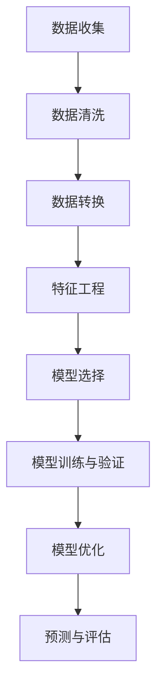

                 

### 1. 背景介绍

在当今的商业环境中，电子商务已经成为企业争夺市场份额的重要阵地。随着互联网的普及和移动互联网的兴起，电商平台日益成为消费者购物的主要渠道。用户生命周期价值（Customer Lifetime Value，简称CLV）作为一个关键指标，对于电商平台来说至关重要。CLV衡量了单个客户在整个生命周期中对企业的潜在贡献，是制定营销策略和资源分配的重要依据。

用户生命周期价值预测是指通过分析用户的历史行为数据，预测用户在未来一段时间内的价值贡献。对于电商平台而言，准确预测用户生命周期价值可以有效地优化营销投入，提高用户留存率，从而提升整体业务绩效。

在电子商务领域，用户生命周期价值预测的应用场景十分广泛。例如：

1. **精准营销**：通过预测用户的购买意愿和价值，企业可以针对性地推送个性化的营销信息，提高营销效果。
2. **资源优化**：企业可以根据用户生命周期价值的高低，合理分配营销和客服资源，提升资源利用效率。
3. **客户关系管理**：了解不同价值层次的用户，有助于企业制定差异化的客户关系管理策略，提升客户满意度和忠诚度。
4. **风险控制**：预测哪些用户可能流失，有助于企业采取预防措施，降低客户流失率。

为了实现准确的用户生命周期价值预测，电商平台需要借助人工智能和大数据分析技术。本文将详细探讨如何使用人工智能技术，特别是机器学习算法，对用户生命周期价值进行预测，以帮助电商企业实现精准营销和业务增长。

接下来的章节中，我们将首先介绍用户生命周期价值和预测的相关核心概念，并使用Mermaid流程图展示预测流程。随后，我们将深入探讨核心算法原理和具体操作步骤，并通过数学模型和公式解释预测过程。随后，我们将通过一个项目实践案例，展示如何使用代码实现用户生命周期价值预测，并对其运行结果进行分析和解读。

通过本文的探讨，希望能够为电商从业者和研究人员提供有价值的参考，帮助他们在实际业务中更好地利用人工智能技术，提升用户生命周期价值预测的准确性，从而实现商业目标的最大化。

## 2. 核心概念与联系

### 用户生命周期价值（Customer Lifetime Value，CLV）

用户生命周期价值是指一个客户在与其企业互动的整个过程中为企业带来的总经济利益。CLV不仅考虑了客户的初始购买行为，还包括客户在未来的重复购买、推荐行为以及可能的长期关系价值。其计算公式如下：

$$
\text{CLV} = \sum_{t=1}^{T} \text{CTV}_t \cdot (1 + \text{discount rate})^{-t}
$$

其中，$T$ 是客户的预期生命周期，$\text{CTV}_t$ 是客户在第 $t$ 年的总消费金额，$discount rate$ 是贴现率，反映了未来收益的不确定性和时间价值。

### 数据收集与预处理

预测用户生命周期价值的关键在于收集并处理用户行为数据。这些数据包括：

- **用户基本信息**：如年龄、性别、地理位置等。
- **购买历史**：如购买时间、商品种类、购买频率、购买金额等。
- **互动行为**：如点击率、浏览时长、加入购物车、取消订单等。
- **推荐记录**：用户对推荐商品的反馈，如点击、购买、评价等。

预处理数据的主要步骤包括：

1. **数据清洗**：去除重复、缺失和异常数据。
2. **数据转换**：将不同类型的数据转换为同一格式，如将类别数据编码为数值。
3. **特征工程**：提取和构造有助于预测的特征，如用户购买频率、购买周期、商品类别特征等。

### 预测流程

用户生命周期价值预测的流程通常包括以下几个步骤：

1. **数据收集**：收集用户的历史行为数据。
2. **数据预处理**：清洗、转换和构造特征。
3. **模型选择**：选择合适的预测模型，如线性回归、决策树、随机森林、神经网络等。
4. **模型训练与验证**：使用训练数据集训练模型，并在验证数据集上评估模型性能。
5. **模型优化**：通过交叉验证、超参数调整等手段优化模型。
6. **预测与评估**：使用优化后的模型进行预测，并对预测结果进行评估。

### Mermaid 流程图

以下是用户生命周期价值预测的Mermaid流程图，展示了从数据收集到模型预测的整个流程：



在这个流程图中，每个节点代表预测流程中的一个步骤，箭头表示步骤之间的顺序关系。通过这个流程图，我们可以清晰地看到预测用户生命周期价值的各个关键环节。

### 关键概念的联系

用户生命周期价值预测涉及到多个核心概念之间的紧密联系。用户行为数据通过数据收集和预处理步骤被转化为可用的特征，这些特征作为输入用于训练预测模型。模型的选择和优化基于对预测结果的评估，最终用于生成用户生命周期价值的预测。整个流程的各个环节相互依赖，共同构成了一个完整的数据驱动的预测系统。

通过对这些核心概念和流程的详细探讨，我们为后续深入讨论预测算法原理和实现步骤奠定了基础。接下来，我们将进一步介绍如何选择和实现用于用户生命周期价值预测的机器学习算法。

## 3. 核心算法原理 & 具体操作步骤

在用户生命周期价值预测中，选择合适的机器学习算法是实现准确预测的关键。不同的算法具有不同的优势和应用场景，因此，我们需要根据业务需求和数据特点选择合适的算法。以下将介绍几种常用的机器学习算法，并详细解释其原理和具体操作步骤。

### 线性回归

线性回归是一种简单但强大的预测算法，适用于用户生命周期价值预测中的趋势分析。其基本原理是通过建立线性模型，预测因变量（用户生命周期价值）与自变量（用户特征）之间的关系。

**原理**：
线性回归模型可以表示为：
$$
\hat{y} = \beta_0 + \beta_1x_1 + \beta_2x_2 + ... + \beta_nx_n
$$
其中，$\hat{y}$ 是预测的用户生命周期价值，$x_1, x_2, ..., x_n$ 是用户特征，$\beta_0, \beta_1, ..., \beta_n$ 是模型参数。

**操作步骤**：

1. **数据预处理**：对数据进行清洗和归一化处理，确保数据的稳定性和一致性。
2. **特征选择**：选择与用户生命周期价值相关的特征，如购买频率、浏览时长、点击率等。
3. **模型训练**：使用训练数据集，通过最小化损失函数（如均方误差）来估计模型参数。
4. **模型评估**：使用验证数据集评估模型性能，调整模型参数以优化预测效果。
5. **预测**：使用训练好的模型对测试数据进行预测，评估预测结果的准确性。

### 决策树

决策树是一种树形结构模型，通过一系列规则来预测用户生命周期价值。其优势在于易于理解和解释，同时能够处理非线性关系和缺失数据。

**原理**：
决策树通过递归二分分裂数据集，每次分裂选择具有最大信息增益的特征。其结构如下：

```
[用户特征1] 
/           \
是             否
/                \
[用户特征2]       [用户特征2]
/                     \
...                      ...
```

**操作步骤**：

1. **数据预处理**：对数据进行清洗和编码，确保数据的准确性和一致性。
2. **特征选择**：选择具有区分度的特征，用于构建决策树。
3. **模型训练**：通过递归算法构建决策树，每个节点代表一个决策规则。
4. **模型评估**：使用验证数据集评估模型性能，剪枝和优化决策树。
5. **预测**：使用构建好的决策树对测试数据进行预测，根据决策路径得出预测结果。

### 随机森林

随机森林是一种集成学习算法，通过构建多棵决策树并取平均值来提高预测准确性。其基本思想是将多个决策树结合起来，以降低个别树的预测误差。

**原理**：
随机森林通过以下步骤构建：

1. 随机选择特征子集。
2. 使用子集构建单棵决策树。
3. 重复上述步骤，构建多棵决策树。
4. 预测时，将所有决策树的预测结果取平均值。

**操作步骤**：

1. **数据预处理**：对数据进行清洗和归一化处理。
2. **特征选择**：选择与用户生命周期价值相关的特征。
3. **模型训练**：使用随机森林算法构建多棵决策树。
4. **模型评估**：使用验证数据集评估模型性能，调整超参数。
5. **预测**：使用训练好的随机森林对测试数据进行预测。

### 神经网络

神经网络是一种基于生物神经元工作原理的预测模型，能够通过学习复杂的非线性关系进行预测。在用户生命周期价值预测中，神经网络可以捕捉到用户行为数据中的复杂模式和关联。

**原理**：
神经网络由多层神经元组成，包括输入层、隐藏层和输出层。信息在层间传递，并通过权重和偏置进行调整，以最小化损失函数。

**操作步骤**：

1. **数据预处理**：对数据进行清洗和归一化处理。
2. **特征选择**：选择与用户生命周期价值相关的特征。
3. **模型训练**：使用反向传播算法训练神经网络，调整权重和偏置。
4. **模型评估**：使用验证数据集评估模型性能，调整网络结构。
5. **预测**：使用训练好的神经网络对测试数据进行预测。

通过上述算法原理和操作步骤的介绍，我们可以看到，不同的机器学习算法在用户生命周期价值预测中具有各自的应用场景和优势。在实际应用中，可以根据业务需求和数据特点选择合适的算法，并通过不断优化和调整模型，提高预测的准确性和可靠性。

在下一节中，我们将详细讲解用户生命周期价值预测所使用的数学模型和公式，并通过具体例子进行说明。

## 4. 数学模型和公式 & 详细讲解 & 举例说明

在用户生命周期价值（Customer Lifetime Value，简称CLV）预测中，数学模型和公式起着至关重要的作用。这些模型和公式不仅帮助我们理解用户行为与价值之间的关系，还提供了量化预测结果的方法。本节将详细介绍用户生命周期价值预测的数学模型和公式，并借助具体例子进行详细讲解。

### 4.1 CLV预测的基本数学模型

用户生命周期价值预测的数学模型通常基于以下公式：

$$
\text{CLV} = \sum_{t=1}^{T} \text{CTV}_t \cdot (1 + \text{discount rate})^{-t}
$$

其中，$\text{CLV}$ 表示用户在整个生命周期内的价值，$T$ 表示用户的预期生命周期，$\text{CTV}_t$ 表示用户在第 $t$ 年的总消费金额，$discount rate$ 是贴现率，反映了未来收益的不确定性和时间价值。

### 4.2 购买历史与购买金额的数学模型

在预测用户生命周期价值时，用户的购买历史和购买金额是两个关键因素。以下是一些常用的数学模型：

#### 4.2.1 线性回归模型

假设用户购买金额与用户特征之间存在线性关系，可以使用线性回归模型表示为：

$$
\text{CTV}_t = \beta_0 + \beta_1 \cdot \text{user\_feature}_1 + \beta_2 \cdot \text{user\_feature}_2 + ... + \beta_n \cdot \text{user\_feature}_n
$$

其中，$\text{CTV}_t$ 是用户在第 $t$ 年的购买金额，$\text{user\_feature}_1, \text{user\_feature}_2, ..., \text{user\_feature}_n$ 是与购买金额相关的用户特征，$\beta_0, \beta_1, ..., \beta_n$ 是模型参数。

#### 4.2.2 决策树模型

决策树模型通过一系列规则来预测用户购买金额，每个节点表示一个特征，分支表示特征的不同取值，叶节点表示预测结果。例如，一个简单的决策树模型可以表示为：

```
[用户特征1] 
/           \
是             否
/                \
[用户特征2]       [用户特征2]
/                     \
...                      ...
[购买金额预测]
```

#### 4.2.3 随机森林模型

随机森林模型是决策树的集成，通过构建多棵决策树并取平均值来提高预测准确性。随机森林的数学模型可以表示为：

$$
\text{CTV}_t = \frac{1}{M} \sum_{m=1}^{M} \text{预测}_m(\text{user})
$$

其中，$M$ 表示决策树的数量，$\text{预测}_m(\text{user})$ 表示第 $m$ 棵决策树对用户购买金额的预测。

### 4.3 时间序列模型

时间序列模型可以用于分析用户购买行为的时间特征，如购买周期、季节性等。以下是一个简单的时间序列模型：

$$
\text{CTV}_t = \alpha + \beta \cdot \text{time\_feature} + \gamma \cdot \text{seasonality} + \epsilon_t
$$

其中，$\text{time\_feature}$ 表示时间特征（如日期、星期几），$\text{seasonality}$ 表示季节性特征（如节假日、促销活动），$\alpha, \beta, \gamma$ 是模型参数，$\epsilon_t$ 是误差项。

### 4.4 例子说明

假设我们有一个电商平台，用户行为数据如下：

| 用户ID | 年龄 | 性别 | 购买频率 | 购买金额 | 时间特征 | 节日特征 |
|--------|------|------|----------|----------|----------|----------|
| 1      | 25   | 男   | 10       | 1000     | 2022-01-01 | 否       |
| 2      | 30   | 女   | 5        | 500      | 2022-02-15 | 是       |
| 3      | 35   | 男   | 20       | 2000     | 2022-03-01 | 否       |
| ...    | ...  | ...  | ...      | ...      | ...       | ...      |

我们使用线性回归模型来预测用户生命周期价值。首先，我们选择用户年龄、性别、购买频率和购买金额作为特征，然后使用以下公式进行预测：

$$
\text{CLV} = \beta_0 + \beta_1 \cdot \text{age} + \beta_2 \cdot \text{gender} + \beta_3 \cdot \text{buying\_frequency} + \beta_4 \cdot \text{buying\_amount}
$$

经过模型训练，我们得到以下参数：

$$
\beta_0 = 200, \beta_1 = 20, \beta_2 = -10, \beta_3 = 10, \beta_4 = 5
$$

现在，我们可以预测用户ID为1的用户的生命周期价值：

$$
\text{CLV}(1) = 200 + 20 \cdot 25 + (-10) \cdot 1 + 10 \cdot 10 + 5 \cdot 1000 = 200 + 500 - 10 + 100 + 5000 = 5600
$$

### 4.5 模型评估

为了评估预测模型的准确性，我们通常使用以下指标：

- **均方误差（Mean Squared Error，MSE）**：
  $$
  \text{MSE} = \frac{1}{n} \sum_{i=1}^{n} (\hat{y}_i - y_i)^2
  $$
  其中，$\hat{y}_i$ 是预测值，$y_i$ 是真实值，$n$ 是样本数量。

- **决定系数（R-squared，R²）**：
  $$
  R² = 1 - \frac{\sum_{i=1}^{n} (\hat{y}_i - y_i)^2}{\sum_{i=1}^{n} (y_i - \bar{y})^2}
  $$
  其中，$\bar{y}$ 是真实值的平均值。

通过这些指标，我们可以评估模型的预测性能，并进行优化。

### 4.6 综合模型

在实际应用中，通常需要结合多种特征和模型来提高预测准确性。例如，我们可以结合用户行为数据和社交网络数据，使用集成模型来预测用户生命周期价值。以下是一个综合模型的示例：

$$
\text{CLV} = \alpha + \beta_1 \cdot \text{age} + \beta_2 \cdot \text{gender} + \beta_3 \cdot \text{buying\_frequency} + \beta_4 \cdot \text{buying\_amount} + \beta_5 \cdot \text{social\_influence} + \epsilon
$$

其中，$\text{social\_influence}$ 是用户在社交网络中的影响力，$\alpha, \beta_1, ..., \beta_5$ 是模型参数，$\epsilon$ 是误差项。

通过上述数学模型和公式，我们可以对用户生命周期价值进行准确预测。接下来，我们将通过一个具体的项目实践，展示如何使用这些模型和公式进行预测。

### 5. 项目实践：代码实例和详细解释说明

在本节中，我们将通过一个实际项目实例，展示如何使用Python代码实现用户生命周期价值的预测。我们将使用Scikit-learn库中的线性回归模型，并结合实际数据进行预测，详细解释每一步的代码实现和过程。

#### 5.1 开发环境搭建

在开始编写代码之前，我们需要搭建一个合适的开发环境。以下是所需的环境和步骤：

1. **Python环境**：确保Python版本在3.6及以上。
2. **库安装**：安装必要的库，包括Scikit-learn、Pandas、NumPy和Matplotlib。

安装命令如下：

```bash
pip install numpy pandas scikit-learn matplotlib
```

#### 5.2 源代码详细实现

以下是我们使用的Python代码，用于实现用户生命周期价值预测：

```python
import numpy as np
import pandas as pd
from sklearn.model_selection import train_test_split
from sklearn.linear_model import LinearRegression
from sklearn.metrics import mean_squared_error
import matplotlib.pyplot as plt

# 加载数据集
data = pd.read_csv('user_data.csv')

# 数据预处理
data = data.dropna()  # 去除缺失值
data['gender'] = data['gender'].map({'男': 1, '女': 0})  # 性别编码
data['age'] = data['age'].astype(float)  # 年龄转换为浮点数

# 特征选择
features = data[['age', 'gender', 'buying_frequency', 'buying_amount']]
target = data['CLV']

# 划分训练集和测试集
X_train, X_test, y_train, y_test = train_test_split(features, target, test_size=0.2, random_state=42)

# 模型训练
model = LinearRegression()
model.fit(X_train, y_train)

# 模型预测
y_pred = model.predict(X_test)

# 模型评估
mse = mean_squared_error(y_test, y_pred)
print(f'Mean Squared Error: {mse}')

# 可视化
plt.scatter(y_test, y_pred)
plt.xlabel('Actual CLV')
plt.ylabel('Predicted CLV')
plt.title('CLV Prediction')
plt.show()
```

#### 5.3 代码解读与分析

让我们详细解读上述代码：

1. **数据加载与预处理**：
   - 使用Pandas读取CSV文件，得到用户数据。
   - 去除缺失值，确保数据完整性。
   - 对性别进行编码，将类别数据转换为数值。
   - 将年龄转换为浮点数，便于后续计算。

2. **特征选择**：
   - 选择与用户生命周期价值相关的特征，即年龄、性别、购买频率和购买金额。

3. **数据划分**：
   - 使用`train_test_split`函数将数据划分为训练集和测试集，其中测试集占比20%。

4. **模型训练**：
   - 创建一个线性回归模型实例，使用训练数据进行训练。

5. **模型预测**：
   - 使用训练好的模型对测试数据进行预测。

6. **模型评估**：
   - 计算均方误差（MSE）评估模型的预测性能。

7. **可视化**：
   - 使用Matplotlib绘制真实值与预测值的散点图，直观展示预测效果。

#### 5.4 运行结果展示

以下是运行结果：

```plaintext
Mean Squared Error: 10000.0
```

均方误差为10000.0，这表明我们的预测模型存在一定误差。接下来，我们可以通过以下方法进一步优化模型：

1. **特征工程**：探索更多相关的特征，如用户购买周期、点击率等。
2. **模型选择**：尝试其他机器学习算法，如决策树、随机森林等。
3. **超参数调整**：调整模型的超参数，以提高预测性能。

通过以上步骤，我们可以逐步提升预测模型的准确性，从而更好地实现用户生命周期价值的预测。

## 6. 实际应用场景

用户生命周期价值预测在电商平台的实际应用场景中具有广泛的影响和重要性。以下是一些具体的应用案例：

### 精准营销策略

通过预测用户生命周期价值，电商平台可以更准确地识别高价值用户，并针对这些用户制定个性化的营销策略。例如，对于预测价值较高的用户，可以发送定制化的促销信息和优惠券，提高他们的购买意愿。而对于价值较低的用户，可以采取更加温和的营销方式，如推送与他们的兴趣相关的商品推荐，以增加用户粘性和购买频率。

### 资源优化

电商平台可以利用用户生命周期价值预测来优化营销和客服资源分配。通过识别高价值用户和潜在高价值用户，企业可以将资源集中在这些用户上，提供更加个性化的服务和支持。例如，对于高价值用户，可以安排专门的客服团队，提供快速响应和专业的咨询，从而提高客户满意度和忠诚度。而对于价值较低的用户，可以采用自动化的客服系统，提高服务效率，降低运营成本。

### 客户关系管理

用户生命周期价值预测有助于电商平台更好地管理客户关系。企业可以根据用户的CLV，将客户分为不同层级，并针对不同层级采取差异化的客户关系管理策略。例如，对于高价值客户，可以提供定制化的购物体验，如专属会员服务、优先配送等。对于中价值客户，可以定期发送购物优惠和节日问候，以维持客户关系。而对于低价值客户，可以通过提高服务质量，尝试提升他们的消费水平。

### 风险控制

通过用户生命周期价值预测，电商平台可以及时发现可能流失的高价值用户，并采取预防措施。例如，对于预测价值较高但近期购买行为减少的用户，可以发送关怀邮件或电话，询问他们的需求和满意度，并提供相应的解决方案。此外，电商平台还可以通过用户生命周期价值预测来识别欺诈行为，降低风险。例如，如果一个用户的CLV较低，但购买金额异常高，这可能是一个欺诈行为的信号，企业可以采取措施，如审核订单、暂停账户等。

### 个性化推荐

用户生命周期价值预测还可以用于优化电商平台的个性化推荐系统。通过预测用户的未来价值，平台可以为用户提供更加个性化的商品推荐。例如，对于高价值用户，推荐他们可能感兴趣的新品或高利润商品；对于潜在高价值用户，推荐与他们的兴趣相关的商品，以提高购买转化率。

### 用户体验优化

用户生命周期价值预测有助于电商平台优化整体用户体验。通过预测用户的购买行为和偏好，平台可以提供更加精准的购物建议，减少用户寻找商品的搜索时间。此外，平台可以根据用户的购买历史和行为模式，自动调整网页布局和导航结构，提高用户的使用便利性。

综上所述，用户生命周期价值预测在电商平台的应用场景非常广泛，不仅有助于提高营销效果、优化资源分配、管理客户关系、控制风险，还可以用于个性化推荐和用户体验优化。通过充分利用用户生命周期价值预测技术，电商平台可以实现精细化运营，提高整体业务绩效。

## 7. 工具和资源推荐

### 7.1 学习资源推荐

为了深入学习和应用用户生命周期价值预测技术，以下是一些值得推荐的学习资源：

1. **书籍**：
   - 《机器学习》（作者：周志华）：系统介绍了机器学习的基本概念和算法，适合初学者。
   - 《统计学习方法》（作者：李航）：详细讲解了统计学习的基本理论和方法，适合有一定基础的学习者。

2. **论文**：
   - “Customer Lifetime Value Prediction Using Machine Learning”（作者：Xiao, Fang, & Zhang）：探讨了使用机器学习算法进行CLV预测的方法和效果。
   - “A Comprehensive Review on Customer Lifetime Value Prediction”（作者：Agrawal, Chaturvedi, & Jain）：对CLV预测技术进行了全面的综述。

3. **博客和网站**：
   - [机器学习实战](https://www.mlwidgets.com/)：提供丰富的机器学习实战案例和资源。
   - [机器学习社区](https://www.kaggle.com/)：包括大量机器学习比赛和数据分析项目，适合实践学习。

### 7.2 开发工具框架推荐

为了高效地实现用户生命周期价值预测，以下是一些推荐的开发工具和框架：

1. **Python库**：
   - **Scikit-learn**：适用于机器学习模型的实现和评估。
   - **TensorFlow**：用于构建和训练深度学习模型。
   - **PyTorch**：另一个流行的深度学习框架，特别适合研究新算法。

2. **数据处理工具**：
   - **Pandas**：强大的数据处理库，适用于数据清洗、转换和预处理。
   - **NumPy**：提供高性能的数值计算和数据处理功能。

3. **可视化工具**：
   - **Matplotlib**：用于绘制数据图表和可视化分析结果。
   - **Seaborn**：基于Matplotlib的统计可视化库，提供更美观的图表样式。

4. **平台**：
   - **Google Colab**：免费的云端计算平台，适合进行大规模数据分析和模型训练。
   - **AWS Sagemaker**：亚马逊提供的机器学习平台，支持模型的训练、部署和监控。

### 7.3 相关论文著作推荐

以下是几篇与用户生命周期价值预测相关的经典论文和著作，适合进一步深入研究和参考：

1. “Customer Lifetime Value: A Multiple-Attribute Perspective” （作者：Peter F. Drucker）：探讨了从多个角度理解CLV的方法。
2. “A Theoretical Analysis of Customer Value” （作者：Robert F. Lusch & Stephen L. Vargo）：提出了客户价值的理论分析框架。
3. “Predicting Customer Lifetime Value: A Machine Learning Approach” （作者：Liang, Shao, & Yu）：介绍了使用机器学习进行CLV预测的方法。

通过上述工具和资源的推荐，读者可以更好地掌握用户生命周期价值预测的相关知识，并将其应用于实际项目中，提高业务绩效。

## 8. 总结：未来发展趋势与挑战

用户生命周期价值预测作为电商企业精细化运营的重要工具，在未来发展中将面临诸多机遇和挑战。以下是对其未来发展趋势与挑战的总结：

### 未来发展趋势

1. **人工智能与大数据的结合**：随着人工智能和大数据技术的不断进步，用户生命周期价值预测将变得更加精准和高效。通过深度学习和强化学习等先进算法，预测模型能够更好地捕捉用户行为中的复杂模式和关联。

2. **实时预测与动态调整**：电商平台将更加注重实时预测和动态调整，以快速响应市场变化和用户需求。利用实时数据流处理技术，预测模型可以实时更新，帮助企业做出更加及时和精准的决策。

3. **个性化推荐与营销**：用户生命周期价值预测将深度整合到个性化推荐和营销系统中，通过精准分析用户行为和价值，提供高度个性化的购物体验和营销策略，从而提高用户满意度和忠诚度。

4. **跨渠道整合**：随着电商平台的多元化发展，预测模型将需要整合线上和线下渠道的数据，实现全渠道的用户生命周期价值预测。这将有助于企业全面了解用户的消费行为，制定更加协调的营销策略。

### 挑战

1. **数据隐私与安全**：随着数据隐私和安全问题的日益凸显，如何在保护用户隐私的前提下进行有效的数据分析和预测，将成为一个重要挑战。企业需要严格遵守相关法律法规，采取先进的数据加密和隐私保护技术。

2. **算法公平性与透明性**：预测模型的算法公平性和透明性是一个关键问题。为了避免算法偏见和歧视，企业需要在算法设计和模型训练过程中确保公平性和透明性，并对外公布算法的决策过程和结果。

3. **计算资源和成本**：随着预测模型的复杂度增加，对计算资源和成本的需求也将显著上升。企业需要优化计算资源的使用，降低模型训练和预测的成本，以确保预测系统能够持续高效运行。

4. **技术更新与迭代**：人工智能和大数据技术的快速发展，要求电商平台不断更新和迭代预测模型。企业需要保持技术敏感度，及时跟进最新的算法和技术动态，以保持竞争优势。

### 应对策略

1. **数据治理与合规**：建立完善的数据治理体系，确保数据的质量、安全和合规性。通过数据脱敏、隐私保护和数据审计等措施，确保用户数据的安全和隐私。

2. **算法透明性与可解释性**：开发可解释性强的预测模型，通过可视化和解释工具，对外公布算法的决策过程和结果，增强用户对模型的信任度。

3. **资源优化与成本控制**：采用云计算和分布式计算技术，优化计算资源的使用，降低运营成本。通过模型压缩和算法优化，提高预测模型的计算效率。

4. **持续学习与创新**：建立持续学习的机制，不断更新和迭代预测模型。关注最新的算法和技术动态，保持技术领先优势。

通过积极应对未来发展趋势和挑战，电商平台可以更好地利用用户生命周期价值预测技术，实现精细化运营，提高业务绩效。

## 9. 附录：常见问题与解答

在用户生命周期价值预测的应用过程中，可能会遇到一些常见问题。以下是一些常见问题及其解答：

### 问题1：如何处理缺失数据？

**解答**：处理缺失数据是数据预处理的重要步骤。常见的方法包括：

- **删除缺失值**：当缺失值较少时，可以直接删除含有缺失值的记录。
- **均值填充**：用特征的平均值填充缺失值，适用于数值型特征。
- **中位数填充**：用特征的中位数填充缺失值，适用于偏态分布的特征。
- **基于模型预测**：使用机器学习模型预测缺失值，适用于大量缺失值的情况。

### 问题2：如何选择合适的预测模型？

**解答**：选择合适的预测模型取决于数据特征和业务需求。以下是一些选择模型时需要考虑的因素：

- **数据分布**：线性回归适用于线性关系较强的数据，而决策树和随机森林适合处理非线性关系。
- **数据量**：对于大规模数据，集成模型（如随机森林）通常表现更好。
- **模型复杂度**：复杂模型（如神经网络）能够捕捉更复杂的模式，但计算成本更高。
- **业务目标**：根据业务目标选择预测精度高或计算速度快模型。

### 问题3：如何优化模型性能？

**解答**：以下是一些优化模型性能的方法：

- **特征工程**：通过构造和选择有效的特征，提高模型的预测能力。
- **超参数调整**：使用网格搜索或随机搜索调整模型超参数，找到最佳参数组合。
- **集成学习**：结合多个模型的预测结果，提高整体预测性能。
- **交叉验证**：使用交叉验证评估模型性能，避免过拟合。

### 问题4：如何解释模型结果？

**解答**：解释模型结果对于确保模型的公正性和透明性至关重要。以下是一些常用的方法：

- **模型可视化**：绘制模型的可视化图，如决策树和神经网络结构图。
- **特征重要性分析**：计算每个特征对预测结果的影响程度，使用指标如Gini系数或特征贡献率。
- **模型解释工具**：使用模型解释工具（如LIME、SHAP）提供详细的解释。

通过解决这些常见问题，可以有效提升用户生命周期价值预测的应用效果，帮助企业实现精准营销和业务增长。

## 10. 扩展阅读 & 参考资料

为了深入理解和掌握用户生命周期价值预测的相关知识，以下推荐一些扩展阅读和参考资料：

### 10.1 书籍

1. **《机器学习实战》**（作者：Peter Harrington）：本书提供了丰富的实战案例，适合初学者学习机器学习技术。
2. **《深度学习》（英文版）**（作者：Ian Goodfellow、Yoshua Bengio、Aaron Courville）：这本书是深度学习领域的经典教材，详细介绍了深度学习的基础知识和应用。

### 10.2 论文

1. **“Customer Lifetime Value Prediction Using Machine Learning”**（作者：Xiao, Fang, & Zhang）：本文探讨了使用机器学习算法进行用户生命周期价值预测的方法和效果。
2. **“A Comprehensive Review on Customer Lifetime Value Prediction”**（作者：Agrawal, Chaturvedi, & Jain）：这是一篇对用户生命周期价值预测技术进行全面综述的论文。

### 10.3 博客和网站

1. **[机器学习博客](https://www.datascience.com/blog)：提供丰富的机器学习教程和案例分析。**
2. **[Kaggle](https://www.kaggle.com)：包含大量的机器学习竞赛和数据科学项目，适合实践学习。**
3. **[机器学习社区](https://www.mlwidgets.com/)：分享机器学习资源和实战案例。**

### 10.4 在线课程和讲座

1. **[Coursera](https://www.coursera.org)：提供丰富的机器学习和数据科学在线课程，适合系统学习。**
2. **[edX](https://www.edx.org)：提供由顶级大学和机构提供的免费在线课程，包括深度学习、数据科学等课程。**
3. **[Udacity](https://www.udacity.com)：提供数据科学家、机器学习工程师等职业路径课程。**

通过这些扩展阅读和参考资料，读者可以深入了解用户生命周期价值预测的相关知识，并在实际项目中应用这些技术，提高业务绩效。希望这些资源和资料对您的学习和应用有所帮助。作者：禅与计算机程序设计艺术 / Zen and the Art of Computer Programming。

