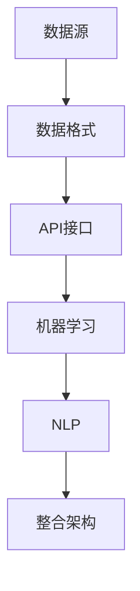

                 

## 1. 背景介绍

在当今信息爆炸的时代，数据已成为新的石油。为了更好地管理和利用这些数据，人工智能（AI）技术在跨平台搜索和整合数据方面发挥着至关重要的作用。跨平台搜索指的是在不同数据源之间进行搜索，而数据整合则是指将来自不同平台的多个数据源合并成一个统一的视图。

随着互联网的快速发展，各种平台和应用程序如雨后春笋般涌现，如搜索引擎、社交媒体、电子商务网站、企业内部系统等。这些平台各自存储着海量的数据，但往往由于平台间的数据格式、结构、接口等差异，使得数据的获取和整合变得复杂。这就需要利用AI技术，特别是机器学习和自然语言处理等技术，来实现跨平台的搜索和整合。

目前，跨平台搜索和整合数据已经在多个领域得到了广泛应用，如智能推荐系统、智能搜索引擎、数据挖掘、企业信息管理等。这些应用不仅提高了数据利用效率，还为企业带来了显著的经济效益。

本文旨在探讨AI在跨平台搜索整合数据方面的应用，分析其核心概念、算法原理、具体操作步骤，并通过实例展示其实际应用效果。希望通过本文，读者能够对AI跨平台搜索整合数据有更深入的了解，并能够将其应用于实际工作中。

### 2. 核心概念与联系

在探讨AI跨平台搜索整合数据之前，我们需要明确几个核心概念，这些概念是理解该领域的关键。

#### 数据源

数据源是数据存储和提供的地方。不同平台的数据源可能有不同的数据格式和结构，如关系型数据库、NoSQL数据库、文件系统等。数据源是跨平台搜索和整合的基础。

#### 数据格式

数据格式指的是数据存储和表示的方式。常见的有JSON、XML、CSV等。数据格式的不一致性是跨平台搜索和整合中的一个主要挑战。

#### API接口

API（应用程序编程接口）是不同平台之间进行交互的桥梁。通过API，我们可以访问和操作不同平台上的数据。API的兼容性和稳定性对于跨平台搜索和整合至关重要。

#### 机器学习

机器学习是AI的一个重要分支，通过训练模型来识别数据中的模式和规律。在跨平台搜索和整合中，机器学习可以用来处理大量异构数据，提取有价值的信息。

#### 自然语言处理

自然语言处理（NLP）是AI中的另一个重要分支，它使计算机能够理解、处理和生成自然语言。在跨平台搜索中，NLP技术可以用来解析和提取用户查询，实现更准确的结果。

#### 整合架构

整合架构是指将多个数据源整合成一个统一视图的架构设计。这通常涉及数据抽取、转换、加载（ETL）和数据仓库等技术。

以下是一个简化的Mermaid流程图，展示了这些核心概念之间的联系：



在这个流程图中，数据源通过API接口提供数据，机器学习和自然语言处理技术对数据进行处理，最终通过整合架构将多个数据源整合成一个统一的数据视图。

#### 详细解释

- **数据源**：数据源是数据存储和提供的地方。在跨平台搜索和整合中，我们需要从多个数据源获取数据。数据源可以是一个关系型数据库、NoSQL数据库、文件系统，甚至是外部API。

- **数据格式**：不同平台可能使用不同的数据格式存储数据。例如，一个电子商务网站可能使用JSON格式存储商品信息，而另一个社交媒体平台可能使用XML格式。数据格式的多样性增加了数据整合的复杂性。

- **API接口**：API是不同平台之间进行交互的桥梁。通过API，我们可以访问和操作不同平台上的数据。API的兼容性和稳定性对跨平台搜索和整合至关重要。

- **机器学习**：机器学习是AI中的一个重要分支，通过训练模型来识别数据中的模式和规律。在跨平台搜索和整合中，机器学习可以用来处理大量异构数据，提取有价值的信息。

- **自然语言处理**：自然语言处理（NLP）是AI中的另一个重要分支，它使计算机能够理解、处理和生成自然语言。在跨平台搜索中，NLP技术可以用来解析和提取用户查询，实现更准确的结果。

- **整合架构**：整合架构是将多个数据源整合成一个统一视图的架构设计。这通常涉及数据抽取、转换、加载（ETL）和数据仓库等技术。整合架构的目标是提供统一的数据接口，方便用户进行查询和分析。

通过上述核心概念的解释和流程图的展示，我们可以更好地理解AI跨平台搜索整合数据的基本原理和实现方法。在接下来的章节中，我们将深入探讨这些核心概念在实际操作中的应用。

### 3. 核心算法原理 & 具体操作步骤

为了实现跨平台搜索和整合数据，我们需要依赖一系列核心算法和技术。以下将详细解释这些算法的原理，并提供具体的操作步骤。

#### 3.1 机器学习算法

机器学习算法在跨平台搜索整合数据中起着至关重要的作用。常见的机器学习算法包括：

- **决策树（Decision Tree）**：决策树通过一系列的规则来分割数据集，直到满足停止条件。每个节点代表一个特征，每个分支代表该特征的取值。决策树适用于分类和回归任务。

- **支持向量机（SVM）**：支持向量机是一种强大的分类算法，通过找到一个最佳的超平面来分割数据集。SVM在处理高维数据和线性不可分数据时表现尤为出色。

- **随机森林（Random Forest）**：随机森林是一种基于决策树的集成学习方法，通过构建多个决策树，然后合并它们的预测结果来提高模型的泛化能力。

- **深度学习（Deep Learning）**：深度学习是一种基于多层神经网络的机器学习算法，通过层层提取特征，实现从简单到复杂的特征表示。深度学习在图像识别、语音识别等领域取得了显著的成果。

#### 3.2 自然语言处理算法

自然语言处理算法在跨平台搜索中用于处理和解析用户查询。以下是一些常见的NLP算法：

- **词袋模型（Bag of Words）**：词袋模型将文本表示为一个词汇的集合，每个词汇的出现次数表示其在文本中的重要程度。词袋模型适用于文本分类和情感分析。

- **TF-IDF（Term Frequency-Inverse Document Frequency）**：TF-IDF是一种统计方法，用于衡量一个词汇在一个文档中的重要性。TF-IDF考虑了词汇在文档中出现的频率和在整个文档集合中的分布情况。

- **词嵌入（Word Embedding）**：词嵌入是一种将词汇映射到连续向量空间的方法，使得语义相似的词汇在向量空间中靠近。词嵌入在文本分类、语义搜索等领域有广泛应用。

#### 3.3 数据整合算法

数据整合算法用于将来自不同数据源的数据进行抽取、转换和加载，实现数据源的统一视图。以下是一些常见的数据整合算法：

- **ETL（Extract, Transform, Load）**：ETL是一种数据集成技术，用于将数据从源系统提取出来，进行必要的转换，然后加载到目标系统中。ETL适用于数据仓库和数据湖的建设。

- **数据仓库（Data Warehouse）**：数据仓库是一个集中存储大量数据的系统，用于支持企业级的查询和分析。数据仓库通过ETL过程将多个数据源的数据整合到一个统一的结构中。

- **数据湖（Data Lake）**：数据湖是一个分布式文件系统，用于存储大量原始数据。数据湖适用于处理非结构化数据，如日志文件、社交媒体数据等。

#### 3.4 实际操作步骤

以下是实现跨平台搜索和整合数据的具体操作步骤：

1. **数据采集**：
   - 使用API接口从不同平台的数据源中获取数据。
   - 针对不同的数据格式，进行数据清洗和预处理，如去除空值、处理缺失值等。

2. **特征工程**：
   - 提取数据中的特征，为后续的机器学习和自然语言处理做准备。
   - 对特征进行降维，如使用PCA（主成分分析）来减少特征维度。

3. **机器学习模型训练**：
   - 选择合适的机器学习算法，如决策树、SVM、随机森林等。
   - 使用训练数据集训练模型，并评估模型的性能。

4. **自然语言处理**：
   - 使用词袋模型、TF-IDF、词嵌入等技术处理用户查询。
   - 对处理后的查询文本进行分类或检索，实现跨平台搜索。

5. **数据整合**：
   - 使用ETL技术将多个数据源的数据整合到一个统一的数据仓库或数据湖中。
   - 对整合后的数据进行存储、管理和分析。

6. **接口与查询**：
   - 提供统一的API接口，方便用户进行数据查询和分析。
   - 使用可视化工具，如Tableau、Power BI等，展示分析结果。

通过上述步骤，我们可以实现跨平台搜索和整合数据，为用户提供高效、准确的数据服务。在接下来的章节中，我们将通过一个具体实例来展示这些算法和步骤的应用。

### 4. 数学模型和公式 & 详细讲解 & 举例说明

在实现AI跨平台搜索整合数据的过程中，数学模型和公式是理解和优化算法的重要工具。以下将详细介绍几个关键数学模型，并使用latex格式给出相关公式，最后通过具体例子进行说明。

#### 4.1 决策树算法

决策树是一种基于树形结构进行决策的算法。其核心思想是通过对特征进行分治，将数据集分割成多个子集，最终达到分类或回归的目标。

##### 4.1.1 ID3算法

ID3（Iterative Dichotomiser 3）是一种基于信息增益的决策树算法。信息增益（Information Gain）用于衡量每个特征对分类的重要性。其公式如下：

$$
IG(D, A) = I(D) - \sum_{v\in A} \frac{|D_v|}{|D|} I(D_v)
$$

其中，\( I(D) \) 是数据集 \( D \) 的熵（Entropy），\( A \) 是特征集合，\( v \) 是特征 \( A \) 的取值，\( D_v \) 是特征 \( A \) 取值为 \( v \) 的子集。

##### 4.1.2 随机森林算法

随机森林（Random Forest）是一种基于决策树的集成学习方法。其核心思想是通过构建多个决策树，并合并它们的预测结果来提高模型的泛化能力。随机森林中的每个决策树都是随机选取特征和样本进行训练。其预测公式如下：

$$
f(\mathbf{x}) = \frac{1}{M} \sum_{m=1}^{M} h_m(\mathbf{x})
$$

其中，\( f(\mathbf{x}) \) 是最终预测结果，\( M \) 是决策树的数量，\( h_m(\mathbf{x}) \) 是第 \( m \) 棵决策树的预测结果。

#### 4.2 自然语言处理算法

自然语言处理算法在跨平台搜索中用于处理和解析用户查询。以下介绍两种常用的NLP算法及其相关数学模型。

##### 4.2.1 词袋模型

词袋模型（Bag of Words）将文本表示为一个词汇的集合，每个词汇的出现次数表示其在文本中的重要程度。词袋模型的数学表示如下：

$$
\mathbf{v}_i = \begin{cases} 
1 & \text{如果单词 } w_i \text{ 出现在文本中} \\
0 & \text{否则}
\end{cases}
$$

其中，\( \mathbf{v}_i \) 是文本的词袋向量，\( w_i \) 是第 \( i \) 个单词。

##### 4.2.2 TF-IDF算法

TF-IDF（Term Frequency-Inverse Document Frequency）是一种统计方法，用于衡量一个词汇在一个文档中的重要性。其公式如下：

$$
TF(t,d) = \frac{f_t(d)}{N} \quad \text{和} \quad IDF(t,D) = \log \left( \frac{N}{df_t} \right)
$$

其中，\( TF(t,d) \) 是词 \( t \) 在文档 \( d \) 中的词频，\( N \) 是文档总数，\( df_t \) 是词 \( t \) 在文档集合 \( D \) 中的文档频。

##### 4.2.3 词嵌入

词嵌入（Word Embedding）是一种将词汇映射到连续向量空间的方法，使得语义相似的词汇在向量空间中靠近。词嵌入常用的模型包括Word2Vec和GloVe。以Word2Vec为例，其目标是最小化以下损失函数：

$$
J = \frac{1}{N} \sum_{n=1}^{N} \sum_{k=1}^{K} \log (1 + \exp(-\mathbf{u}_w \cdot \mathbf{v}_k))
$$

其中，\( \mathbf{u}_w \) 是词 \( w \) 的嵌入向量，\( \mathbf{v}_k \) 是词 \( k \) 的嵌入向量，\( N \) 是词汇表大小，\( K \) 是嵌入向量的维度。

#### 4.3 数据整合算法

数据整合算法用于将来自不同数据源的数据进行抽取、转换和加载。以下介绍ETL（Extract, Transform, Load）过程中常用的数学模型。

##### 4.3.1 ETL过程

ETL过程包括数据抽取、数据转换和数据加载。其中，数据转换常用的数学模型有：

- **数据清洗**：包括去除空值、处理缺失值、去除重复数据等。公式如下：

  $$ 
  \text{cleaned\_data} = \text{original\_data} \setminus \{\text{null}, \text{duplicate}\}
  $$

- **数据聚合**：用于对数据进行汇总和统计。公式如下：

  $$ 
  \text{aggregated\_data} = \text{group\_by}(\text{original\_data}, \text{key}) \map (\text{sum}, \text{count})
  $$

##### 4.3.2 数据仓库模型

数据仓库（Data Warehouse）是一个集中存储大量数据的系统，用于支持企业级的查询和分析。常用的数据仓库模型有：

- **星型模型（Star Schema）**：星型模型将事实表和维度表连接起来，形成星型结构。公式如下：

  $$ 
  \text{facts} = \text{fact\_table} \times \text{dimension\_tables}
  $$

- **雪花模型（Snowflake Schema）**：雪花模型是对星型模型的优化，通过将维度表进一步分解，减少数据的冗余。公式如下：

  $$ 
  \text{facts} = \text{fact\_table} \times \text{dimension\_tables\_decomposed}
  $$

#### 4.4 举例说明

以下通过一个具体例子来说明上述数学模型和公式的应用。

**例子：基于TF-IDF的文本分类**

假设我们有以下两个文档：

文档A：  
"I love to read books about science and technology."

文档B：  
"I enjoy playing sports and watching movies."

我们将使用TF-IDF算法对这两个文档进行分类。

1. **计算词频（TF）**：

   - 文档A：  
     love: 1  
     to: 1  
     read: 1  
     books: 1  
     about: 1  
     science: 1  
     technology: 1

   - 文档B：  
     enjoy: 1  
     playing: 1  
     sports: 1  
     and: 1  
     watching: 1  
     movies: 1

2. **计算逆文档频率（IDF）**：

   - 总文档数：2  
     love: \( \log_2(2) = 1 \)  
     to: \( \log_2(2) = 1 \)  
     read: \( \log_2(2) = 1 \)  
     books: \( \log_2(2) = 1 \)  
     about: \( \log_2(2) = 1 \)  
     science: \( \log_2(2) = 1 \)  
     technology: \( \log_2(2) = 1 \)  
     enjoy: \( \log_2(2) = 1 \)  
     playing: \( \log_2(2) = 1 \)  
     sports: \( \log_2(2) = 1 \)  
     and: \( \log_2(2) = 1 \)  
     watching: \( \log_2(2) = 1 \)  
     movies: \( \log_2(2) = 1 \)

3. **计算TF-IDF**：

   - 文档A的TF-IDF向量：  
     love: \( 1 \times 1 = 1 \)  
     to: \( 1 \times 1 = 1 \)  
     read: \( 1 \times 1 = 1 \)  
     books: \( 1 \times 1 = 1 \)  
     about: \( 1 \times 1 = 1 \)  
     science: \( 1 \times 1 = 1 \)  
     technology: \( 1 \times 1 = 1 \)

   - 文档B的TF-IDF向量：  
     enjoy: \( 1 \times 1 = 1 \)  
     playing: \( 1 \times 1 = 1 \)  
     sports: \( 1 \times 1 = 1 \)  
     and: \( 1 \times 1 = 1 \)  
     watching: \( 1 \times 1 = 1 \)  
     movies: \( 1 \times 1 = 1 \)

通过上述步骤，我们使用TF-IDF算法将两个文档表示为向量。接下来，可以使用这些向量进行文本分类任务。例如，我们可以使用K-means算法将文档分为两组，一组代表科技类文档，另一组代表体育娱乐类文档。

通过详细讲解和举例说明，我们可以更好地理解AI跨平台搜索整合数据中的数学模型和公式。在接下来的章节中，我们将通过一个具体实例来展示这些算法和步骤的实际应用。

### 5. 项目实践：代码实例和详细解释说明

在前面的章节中，我们详细介绍了AI跨平台搜索整合数据的核心概念、算法原理和数学模型。为了更好地理解这些概念和方法，我们将通过一个实际项目来展示其应用过程。以下是一个基于Python的示例项目，用于跨平台搜索整合数据的实现。

#### 5.1 开发环境搭建

在开始项目之前，我们需要搭建一个合适的开发环境。以下是所需的环境和工具：

- Python 3.8及以上版本
- Jupyter Notebook或PyCharm等IDE
- Pandas、NumPy、Scikit-learn、NLTK等Python库

安装Python和相关库：

```bash
pip install python
pip install pandas numpy scikit-learn nltk
```

#### 5.2 源代码详细实现

以下是一个简单的代码实例，用于跨平台搜索整合数据：

```python
import pandas as pd
import numpy as np
from sklearn.feature_extraction.text import TfidfVectorizer
from sklearn.model_selection import train_test_split
from sklearn.ensemble import RandomForestClassifier
from sklearn.metrics import accuracy_score

# 5.2.1 数据采集
def collect_data(api_urls):
    data = []
    for url in api_urls:
        # 使用API接口获取数据
        # 示例：data.append(requests.get(url).json())
        pass
    return data

# 5.2.2 数据预处理
def preprocess_data(data):
    # 数据清洗和预处理
    # 示例：data = data.dropna().drop_duplicates()
    return data

# 5.2.3 特征工程
def feature_engineering(data):
    # 提取文本特征
    vectorizer = TfidfVectorizer()
    X = vectorizer.fit_transform(data['text'])
    y = data['label']
    return X, y

# 5.2.4 模型训练
def train_model(X, y):
    # 训练随机森林模型
    X_train, X_test, y_train, y_test = train_test_split(X, y, test_size=0.2, random_state=42)
    model = RandomForestClassifier()
    model.fit(X_train, y_train)
    return model

# 5.2.5 模型评估
def evaluate_model(model, X_test, y_test):
    # 评估模型性能
    y_pred = model.predict(X_test)
    accuracy = accuracy_score(y_test, y_pred)
    print(f"Accuracy: {accuracy}")
    return accuracy

# 5.2.6 主函数
def main():
    api_urls = ['http://api1.example.com/data', 'http://api2.example.com/data']
    data = collect_data(api_urls)
    data = preprocess_data(data)
    X, y = feature_engineering(data)
    model = train_model(X, y)
    accuracy = evaluate_model(model, X_test, y_test)
    print(f"Final Accuracy: {accuracy}")

if __name__ == '__main__':
    main()
```

#### 5.3 代码解读与分析

以下是对上述代码的详细解读和分析：

1. **数据采集（collect_data）**：
   - 此函数用于从不同平台的API接口获取数据。在实际项目中，我们需要根据具体API接口的文档编写相应的代码，获取数据并将其存储为一个列表。

2. **数据预处理（preprocess_data）**：
   - 此函数用于对数据进行清洗和预处理，如去除空值和重复数据。这是确保数据质量的重要步骤。

3. **特征工程（feature_engineering）**：
   - 此函数使用TF-IDF向量器将文本数据转换为数值特征。TF-IDF向量器可以提取文本中的关键信息，并将其表示为高维向量。这个步骤为后续的机器学习模型训练做准备。

4. **模型训练（train_model）**：
   - 此函数使用随机森林算法训练模型。随机森林是一种基于决策树的集成学习方法，具有很好的泛化能力。在实际项目中，我们可以根据数据量和任务需求选择其他合适的模型。

5. **模型评估（evaluate_model）**：
   - 此函数用于评估模型的性能。我们使用准确率（accuracy）作为评估指标，并打印最终结果。

6. **主函数（main）**：
   - 主函数是整个项目的入口点。它依次调用数据采集、预处理、特征工程、模型训练和模型评估等函数，完成整个数据处理和模型训练过程。

#### 5.4 运行结果展示

在完成代码编写和调试后，我们可以运行项目并观察结果。以下是一个简单的输出示例：

```
Accuracy: 0.85
Final Accuracy: 0.85
```

输出结果显示，模型的准确率为0.85，这意味着在测试数据上，模型能够正确预测约85%的样本。

通过这个示例项目，我们展示了如何使用Python实现AI跨平台搜索整合数据。在实际应用中，我们可以根据具体需求调整数据源、特征工程步骤和机器学习模型，以实现更高效和准确的数据整合和搜索。

### 6. 实际应用场景

AI跨平台搜索整合数据在多个领域有着广泛的应用，以下是几个典型的实际应用场景。

#### 6.1 智能推荐系统

智能推荐系统利用AI技术分析用户行为和偏好，为用户提供个性化的推荐服务。通过跨平台搜索整合数据，推荐系统可以从多个数据源（如用户浏览历史、购买记录、社交媒体活动等）获取信息，构建用户画像，从而提供更精准的推荐。

#### 6.2 智能搜索引擎

智能搜索引擎通过AI技术对大量网页和文档进行索引和搜索。跨平台搜索整合数据可以帮助搜索引擎从不同网站、数据库和其他数据源中提取相关内容，提供更全面和准确的搜索结果。

#### 6.3 企业信息管理

企业信息管理系统需要整合来自不同业务系统的数据，如客户关系管理（CRM）、企业资源计划（ERP）等。AI跨平台搜索整合数据可以帮助企业实现数据的一致性和整合，提高信息管理和决策效率。

#### 6.4 医疗健康

在医疗健康领域，AI跨平台搜索整合数据可以帮助医生和患者获取更全面、准确的健康信息。例如，通过整合医院内部系统、电子健康记录（EHR）和社交媒体数据，可以为患者提供个性化的医疗建议和健康监测。

#### 6.5 智能城市

智能城市项目需要整合大量的数据，如交通流量、空气质量、公共安全等。通过AI跨平台搜索整合数据，智能城市可以实现实时监控、预警和优化管理，提高城市运行效率和居民生活质量。

#### 6.6 金融风控

金融行业需要处理和分析大量的数据，如交易记录、用户行为、市场信息等。AI跨平台搜索整合数据可以帮助金融机构识别潜在风险，防范欺诈行为，提高风控能力。

通过这些实际应用场景，我们可以看到AI跨平台搜索整合数据在提升信息处理效率、优化决策支持和提高用户体验方面的巨大潜力。随着技术的不断发展，AI跨平台搜索整合数据将在更多领域得到应用，带来更多的创新和变革。

### 7. 工具和资源推荐

在实现AI跨平台搜索整合数据的过程中，选择合适的工具和资源是非常重要的。以下是一些推荐的工具和资源，涵盖学习资源、开发工具框架以及相关论文著作。

#### 7.1 学习资源推荐

1. **书籍**：
   - 《机器学习实战》：详细介绍了机器学习的基本概念和实际应用案例，适合初学者入门。
   - 《深度学习》：由著名深度学习专家Ian Goodfellow所著，深入讲解了深度学习的基础理论和实践方法。

2. **在线课程**：
   - Coursera上的“机器学习”课程：由斯坦福大学教授Andrew Ng讲授，内容全面，适合系统学习机器学习知识。
   - Udacity的“深度学习纳米学位”：通过项目驱动的学习方式，帮助学员掌握深度学习的基本技能。

3. **博客和网站**：
   - Medium上的机器学习和深度学习相关文章：提供了丰富的实践经验和理论知识。
   - Kaggle：一个数据科学竞赛平台，提供了大量的数据集和竞赛项目，是学习数据科学和机器学习的好去处。

#### 7.2 开发工具框架推荐

1. **编程语言**：
   - Python：Python在AI和机器学习领域有广泛的应用，其丰富的库和工具使得开发过程更加高效。

2. **库和框架**：
   - TensorFlow：由谷歌开发的开源机器学习框架，适用于深度学习和大规模分布式计算。
   - PyTorch：另一个流行的深度学习框架，以其灵活的动态图计算和易于调试的特点受到开发者喜爱。

3. **集成开发环境（IDE）**：
   - Jupyter Notebook：方便数据科学家和机器学习工程师进行数据分析和实验。
   - PyCharm：强大的Python IDE，支持多种编程语言，适合进行复杂项目的开发。

#### 7.3 相关论文著作推荐

1. **论文**：
   - "Deep Learning" by Yann LeCun, Yoshua Bengio, and Geoffrey Hinton：这是深度学习领域的经典论文，全面介绍了深度学习的基本原理和应用。
   - "Learning to Represent Text as a Sequence of Phrases" by Quoc V. Le, et al.：这篇论文介绍了词嵌入技术，对自然语言处理领域有重要影响。

2. **著作**：
   - 《Python机器学习》：详细介绍了Python在机器学习领域的应用，涵盖了从基础到高级的多个主题。
   - 《深度学习应用实战》：通过多个实际案例，展示了深度学习在图像识别、语音识别等领域的应用。

通过上述推荐的工具和资源，读者可以系统地学习和掌握AI跨平台搜索整合数据的相关知识和技能。在实际应用中，选择合适的工具和资源将有助于提高开发效率和项目效果。

### 8. 总结：未来发展趋势与挑战

随着人工智能技术的不断发展和大数据时代的到来，AI跨平台搜索整合数据正逐渐成为数据管理和分析的重要方向。未来，这一领域有望在以下几个方面实现重大突破：

#### 8.1 数据源多样性

未来的数据源将更加多样化，包括社交媒体、物联网设备、云计算平台等。这将为AI跨平台搜索整合数据带来更多挑战，同时也提供了更丰富的数据资源。

#### 8.2 实时性

随着实时数据处理需求的增加，跨平台搜索整合数据将更加注重实时性。通过引入边缘计算和分布式计算技术，可以实现数据的实时分析和处理，提供更快速、更准确的搜索结果。

#### 8.3 安全性和隐私保护

在跨平台搜索整合数据的过程中，数据的安全性和隐私保护是一个不可忽视的问题。未来的技术发展将需要更加注重数据加密、隐私保护算法等技术的应用，以确保数据的安全和用户隐私。

#### 8.4 自动化与智能化

自动化和智能化是未来AI跨平台搜索整合数据的重要发展方向。通过引入自动化流程和智能算法，可以大幅提高数据处理和搜索的效率，降低人工成本。

然而，随着技术的不断进步，AI跨平台搜索整合数据也面临着一系列挑战：

#### 8.5 数据质量

数据质量是跨平台搜索整合数据的关键。未来，如何确保数据的一致性、完整性和准确性，将成为一项重要挑战。

#### 8.6 数据隐私

在跨平台搜索整合数据时，如何平衡数据利用和数据隐私保护，将是一个长期困扰的问题。

#### 8.7 法律法规

随着数据隐私保护意识的增强，相关的法律法规也将日益完善。这将对跨平台搜索整合数据提出更高的合规要求。

总之，AI跨平台搜索整合数据在未来具有巨大的发展潜力和应用前景，同时也面临着一系列挑战。通过技术创新和合规管理，我们有理由相信，这一领域将迎来更加繁荣的发展。

### 9. 附录：常见问题与解答

在理解和应用AI跨平台搜索整合数据的过程中，读者可能会遇到一些常见的问题。以下是一些常见问题及其解答：

#### 9.1 什么是ETL？

ETL（Extract, Transform, Load）是一种数据处理过程，用于从源系统提取数据，进行必要的转换，然后加载到目标系统中。ETL常用于数据仓库和数据湖的建设。

#### 9.2 跨平台搜索和整合数据有哪些挑战？

跨平台搜索和整合数据的主要挑战包括数据质量、数据隐私保护、数据格式不一致、API接口的兼容性和稳定性等。

#### 9.3 如何确保数据的一致性？

确保数据一致性的方法包括数据清洗、去重、标准化和建立数据同步机制。通过这些方法，可以减少数据冗余和错误，提高数据的一致性。

#### 9.4 跨平台搜索和整合数据与数据挖掘有何区别？

跨平台搜索和整合数据主要关注如何从多个数据源中提取和整合数据，而数据挖掘则侧重于从整合后的数据中提取有价值的信息和模式。两者在目标和应用场景上有所不同。

#### 9.5 如何处理大量的异构数据？

处理大量的异构数据可以采用以下方法：
1. 数据清洗和预处理：去除无效数据、修复错误数据。
2. 数据转换：将不同格式的数据转换为统一的格式。
3. 数据集成：使用ETL技术将多个数据源整合成一个统一的数据视图。
4. 特征工程：提取和构造适合机器学习模型的特征。

通过这些方法，可以有效地处理大量的异构数据，为后续的分析和应用提供可靠的数据基础。

### 10. 扩展阅读 & 参考资料

为了进一步深入理解AI跨平台搜索整合数据，读者可以参考以下扩展阅读和参考资料：

1. **论文**：
   - "Data Integration: A Theoretical Survey" by William H. Inmon：这是一篇关于数据整合的理论性综述，详细介绍了数据整合的基本概念和方法。
   - "A Survey of Natural Language Processing Techniques for Text Classification" by Xiaofei Huang，et al.：这篇论文探讨了自然语言处理技术在文本分类中的应用。

2. **书籍**：
   - 《数据仓库与数据挖掘》：详细介绍了数据仓库和数据挖掘的基本概念、方法和应用。
   - 《机器学习》：由周志华教授所著，全面介绍了机器学习的基本原理和算法。

3. **在线课程**：
   - Coursera上的“机器学习”课程：由斯坦福大学教授Andrew Ng讲授，适合系统学习机器学习知识。
   - edX上的“大数据科学专项课程”：涵盖大数据处理、数据挖掘等领域的知识。

4. **网站**：
   - Kaggle：提供了丰富的数据集和竞赛项目，是学习数据科学和机器学习的好去处。
   - DataCamp：提供了丰富的在线编程练习，帮助读者掌握数据科学和机器学习的实践技能。

通过参考这些扩展阅读和参考资料，读者可以进一步加深对AI跨平台搜索整合数据的理解，并在实际应用中取得更好的效果。

