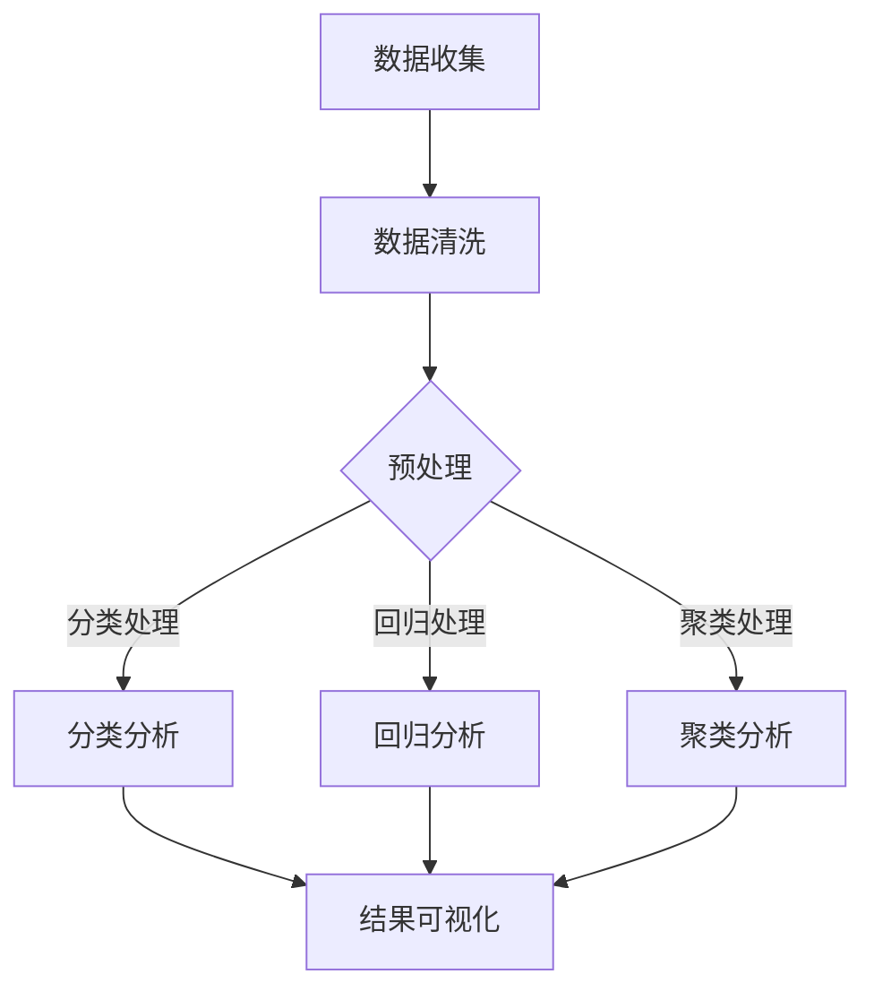

                 

### 1. 背景介绍

在科技日新月异发展的今天，人工智能（AI）技术正在以惊人的速度渗透到各个领域，从医疗、金融到教育、制造，无一不受到其深刻的影响。特别是在科研领域，AI不仅改变了科研方法，还极大地提升了科研效率。科研过程中，数据收集、数据分析、模型构建等环节都离不开人工智能技术的支持。

传统科研往往需要大量的人力、时间和资源，而AI辅助科研工具的出现，极大地缩短了科研周期，降低了科研成本。通过自动化数据处理和分析，科研人员能够更快速地获取有价值的信息，从而推动科研工作的进展。

本文将围绕AI辅助科研工具这一主题，深入探讨其在科技创新中的作用和影响。我们将首先介绍AI辅助科研工具的基本概念和核心功能，然后分析其工作原理和数学模型，最后通过具体项目实践和实际应用场景展示其在科研中的实际应用价值。通过这一系列探讨，希望能够为科研人员提供有价值的参考和启示。

#### 1.1 研究背景与现状

科学研究是一项复杂且庞大的工程，涉及数据采集、处理、分析和结果验证等多个环节。传统科研方法往往依赖人工操作，不仅效率低下，而且容易出错。例如，研究人员需要手动收集大量实验数据，然后进行繁琐的数据清洗和预处理，再利用统计软件进行分析，最后根据分析结果调整实验方案。这样的工作流程不仅耗时耗力，而且难以保证数据的一致性和准确性。

随着大数据时代的到来，科研数据量呈现出爆炸式增长。传统的数据处理和分析方法已经无法满足科研需求。科研人员迫切需要一种高效、准确的数据处理工具，以应对日益复杂的数据集和分析任务。在这一背景下，人工智能技术应运而生。

人工智能技术在科研领域的应用主要集中在数据分析和模型构建两个方面。在数据分析方面，AI可以帮助研究人员快速处理海量数据，提取有用信息。通过机器学习算法，AI可以自动识别数据中的模式、趋势和异常，从而帮助科研人员发现潜在的科学规律。在模型构建方面，AI可以帮助研究人员快速构建和优化科学模型，提高科研效率。

当前，AI辅助科研工具已经在多个领域取得了显著的成果。例如，在生物医学领域，AI技术被用于基因数据分析、药物研发和疾病诊断等；在物理学领域，AI技术被用于材料科学、天体物理学等方向的研究；在社会科学领域，AI技术被用于大数据分析、行为研究等。这些应用不仅提高了科研效率，还推动了相关领域的科技创新。

然而，尽管AI技术在科研中取得了巨大进展，但仍然面临一些挑战。首先，科研数据的多样性和复杂性使得AI模型的训练和优化变得异常困难。其次，AI工具的准确性和可靠性仍然有待提高。此外，科研人员对AI技术的理解和应用能力有限，也限制了AI在科研中的广泛应用。

#### 1.2 本文结构

本文将分为以下几个部分：

1. **背景介绍**：介绍AI辅助科研工具的研究背景和现状，解释为什么需要AI辅助科研。
2. **核心概念与联系**：详细解释AI辅助科研工具的核心概念，包括其工作原理、主要算法和数学模型。
3. **核心算法原理 & 具体操作步骤**：介绍AI辅助科研工具的核心算法原理，并给出具体操作步骤。
4. **数学模型和公式 & 详细讲解 & 举例说明**：讲解AI辅助科研工具中涉及的数学模型和公式，并通过具体例子进行说明。
5. **项目实践：代码实例和详细解释说明**：通过一个具体的代码实例，展示如何使用AI辅助科研工具进行科研工作，并进行详细解释。
6. **实际应用场景**：分析AI辅助科研工具在不同科研领域的实际应用，展示其应用价值和影响。
7. **工具和资源推荐**：推荐一些学习和使用AI辅助科研工具的资源，包括书籍、论文、博客和网站等。
8. **总结：未来发展趋势与挑战**：总结AI辅助科研工具的发展趋势和面临的挑战，展望其未来的发展方向。
9. **附录：常见问题与解答**：回答一些关于AI辅助科研工具的常见问题。
10. **扩展阅读 & 参考资料**：提供一些与AI辅助科研工具相关的扩展阅读和参考资料。

通过以上结构，我们将全面、系统地介绍AI辅助科研工具，帮助读者了解其基本概念、原理和应用，从而更好地利用这一工具推动科研工作的开展。

### 2. 核心概念与联系

#### 2.1 AI辅助科研工具的概念

AI辅助科研工具，即利用人工智能技术辅助科研活动的工具。这些工具旨在通过自动化和智能化手段，提高科研数据的处理速度和准确性，从而提升科研效率。具体来说，AI辅助科研工具通常包含以下功能：

1. **数据收集与处理**：自动化数据收集，包括实验数据的获取、传感器数据的采集等，并对收集到的数据进行清洗、预处理，确保数据质量。
2. **数据分析与挖掘**：利用机器学习和数据挖掘算法，对处理后的数据进行分析，发现数据中的潜在规律和模式，为科研提供数据支持。
3. **模型构建与优化**：基于分析结果，构建科学模型，并通过机器学习算法对模型进行优化，提高模型的准确性和可靠性。
4. **结果可视化与报告生成**：将分析结果和模型结论以可视化形式展示，并生成科研报告，便于科研人员理解和利用。

#### 2.2 AI辅助科研工具的工作原理

AI辅助科研工具的工作原理主要基于以下几个方面：

1. **机器学习**：通过训练大量数据，机器学习算法可以自动识别数据中的规律和模式，从而实现自动化数据分析。常见的机器学习算法包括决策树、支持向量机、神经网络等。
2. **数据挖掘**：数据挖掘是从大量数据中发现有用信息和知识的过程。通过数据挖掘，科研人员可以识别数据中的关联、聚类和分类，从而揭示潜在的科学规律。
3. **深度学习**：深度学习是一种模拟人脑神经元连接结构的算法，通过多层神经网络进行训练，可以自动提取数据的特征，实现复杂的数据分析和模型构建。
4. **自然语言处理**：自然语言处理（NLP）技术用于处理和解析自然语言文本数据，例如论文、报告、专利等，可以帮助科研人员快速获取和理解相关文献信息。

#### 2.3 主要算法和数学模型

AI辅助科研工具涉及的主要算法和数学模型包括：

1. **回归分析**：用于预测因变量与自变量之间的数量关系，常见的回归模型包括线性回归、多项式回归等。
2. **聚类分析**：通过将数据分为若干类别，聚类分析可以帮助科研人员发现数据中的隐含结构和规律。常见的聚类算法包括K-means、层次聚类等。
3. **分类分析**：用于将数据分为不同的类别，分类分析可以帮助科研人员识别数据的特征和属性。常见的分类算法包括决策树、支持向量机等。
4. **主成分分析（PCA）**：通过降维技术，将高维数据转换到低维空间，PCA可以减少数据的冗余信息，提高数据分析的效率和准确性。
5. **深度学习模型**：如卷积神经网络（CNN）、循环神经网络（RNN）等，深度学习模型可以自动提取数据的特征，实现复杂的数据分析和模型构建。

#### 2.4 Mermaid 流程图

为了更直观地展示AI辅助科研工具的核心概念和架构，我们使用Mermaid绘制一个流程图。以下是流程图的Markdown格式表示：



在上述流程图中，A代表数据收集，B代表数据清洗，C代表预处理，D、E、F分别代表分类分析、回归分析和聚类分析，G代表结果可视化。这些步骤共同构成了AI辅助科研工具的基本工作流程。

通过以上对核心概念与联系的分析，我们为后续内容的详细讲解和具体操作奠定了基础。接下来，我们将深入探讨AI辅助科研工具的核心算法原理和具体操作步骤。

#### 2.5 AI辅助科研工具的核心算法原理

在深入探讨AI辅助科研工具的核心算法原理之前，我们首先需要了解一些基础的机器学习概念。机器学习是人工智能的核心组成部分，它通过算法让计算机从数据中学习并做出预测或决策，而无需显式编程。以下是几个核心机器学习算法的简要介绍：

1. **线性回归**：线性回归是一种简单的预测模型，用于描述因变量与自变量之间的线性关系。其基本公式为：

   \[ y = \beta_0 + \beta_1 \cdot x \]

   其中，\( y \) 是因变量，\( x \) 是自变量，\( \beta_0 \) 和 \( \beta_1 \) 是模型参数。

2. **决策树**：决策树是一种基于分类的预测模型，通过一系列的判断规则将数据划分为不同的类别。决策树的每个节点代表一个特征，每个分支代表一个特征取值，最终到达叶节点得到预测结果。

3. **支持向量机（SVM）**：SVM是一种分类算法，通过找到最佳的超平面，将数据分为不同的类别。其目标是最大化分类边界到最近的样本点的距离。

4. **神经网络**：神经网络，特别是深度神经网络，通过多层神经元实现复杂的非线性映射。每个神经元接收多个输入，通过加权求和并应用激活函数，最终输出结果。

5. **聚类算法**：聚类算法用于将数据划分为若干类别，常见的算法包括K-means、层次聚类等。K-means通过迭代过程将数据点分配到不同的簇，使得簇内的数据点距离较短，簇间的数据点距离较长。

下面我们将详细探讨这些算法在AI辅助科研工具中的应用。

**线性回归**

线性回归是一种常见的预测模型，广泛应用于科研数据分析。其核心思想是找到一个最佳拟合线，用于描述因变量与自变量之间的关系。在科研中，线性回归可以用于预测实验结果、分析影响因素等。

具体操作步骤如下：

1. **数据准备**：收集并整理实验数据，确保数据质量。
2. **特征选择**：选择合适的自变量，通常通过相关分析、变量重要性等方法确定。
3. **模型训练**：使用训练数据集，通过最小二乘法或其他优化算法，计算模型参数 \( \beta_0 \) 和 \( \beta_1 \)。
4. **模型评估**：使用验证数据集评估模型性能，通过均方误差（MSE）或其他指标评价模型拟合程度。
5. **结果预测**：使用训练好的模型对新数据进行预测。

**决策树**

决策树是一种简单且直观的预测模型，特别适用于分类问题。在科研中，决策树可以用于分类实验数据、识别影响因素等。

具体操作步骤如下：

1. **数据准备**：收集并整理实验数据，确保数据质量。
2. **特征选择**：选择合适的特征，通过信息增益、增益率等方法确定。
3. **树构建**：使用递归划分算法，从根节点开始，依次选择最优特征进行划分，生成决策树。
4. **模型评估**：通过交叉验证等方法评估决策树性能，剪枝以优化模型。
5. **结果预测**：使用构建好的决策树对新数据进行预测。

**支持向量机（SVM）**

SVM是一种强大的分类算法，特别适用于高维数据。在科研中，SVM可以用于分类实验数据、识别关键因素等。

具体操作步骤如下：

1. **数据准备**：收集并整理实验数据，确保数据质量。
2. **特征选择**：选择合适的特征，通过主成分分析（PCA）等方法进行降维。
3. **模型训练**：使用训练数据集，通过优化算法（如序列最小化最速下降法），计算模型参数。
4. **模型评估**：使用验证数据集评估模型性能，通过交叉验证等方法优化模型。
5. **结果预测**：使用训练好的SVM模型对新数据进行预测。

**神经网络**

神经网络，特别是深度神经网络，在处理复杂数据方面具有显著优势。在科研中，神经网络可以用于预测实验结果、分析数据模式等。

具体操作步骤如下：

1. **数据准备**：收集并整理实验数据，确保数据质量。
2. **特征选择**：选择合适的特征，通过数据预处理方法（如归一化、标准化）处理。
3. **模型训练**：使用训练数据集，通过反向传播算法，训练神经网络模型。
4. **模型评估**：使用验证数据集评估模型性能，通过调整网络结构、学习率等参数优化模型。
5. **结果预测**：使用训练好的神经网络模型对新数据进行预测。

**聚类算法**

聚类算法用于将数据划分为若干类别，帮助科研人员发现数据中的隐含结构和规律。在科研中，聚类算法可以用于分析实验数据、识别相似样本等。

具体操作步骤如下：

1. **数据准备**：收集并整理实验数据，确保数据质量。
2. **特征选择**：选择合适的特征，通过主成分分析（PCA）等方法进行降维。
3. **算法选择**：根据数据特点选择合适的聚类算法（如K-means、层次聚类等）。
4. **模型训练**：使用算法对数据进行聚类，确定聚类中心。
5. **模型评估**：通过内部评价指标（如轮廓系数、簇内距离等）评估聚类效果。
6. **结果分析**：对聚类结果进行分析，提取有价值的信息。

通过以上对核心算法原理的详细介绍，我们为AI辅助科研工具的实际应用奠定了基础。接下来，我们将通过具体项目实践，展示这些算法在实际科研中的应用过程和效果。

#### 2.6 数学模型和公式 & 详细讲解 & 举例说明

在AI辅助科研工具中，数学模型和公式是理解和应用这些工具的核心。为了更好地展示这些数学模型和公式的应用，我们将选择一个具体的科研案例进行详细讲解，并通过具体例子说明。

**案例背景**

假设我们研究的是某一疾病的临床数据，包括患者的年龄、性别、病史、治疗过程和病情进展等。我们的目标是利用这些数据预测患者病情的发展趋势，从而为医生提供更有针对性的治疗方案。

**1. 线性回归模型**

线性回归模型用于描述因变量（病情进展）与自变量（如年龄、性别、病史）之间的线性关系。其基本公式为：

\[ y = \beta_0 + \beta_1 \cdot x \]

其中，\( y \) 表示病情进展，\( x \) 表示自变量，\( \beta_0 \) 和 \( \beta_1 \) 是模型参数。

**详细讲解**

为了训练线性回归模型，我们首先需要收集历史数据，包括患者的病情进展和对应的自变量值。接下来，我们使用最小二乘法（OLS）来计算模型参数。

具体步骤如下：

1. **数据收集**：收集历史数据，确保数据质量，包括患者的年龄、性别、病史和病情进展。
2. **特征选择**：选择对病情进展有显著影响的自变量，例如年龄、性别和病史。
3. **数据预处理**：对数据进行归一化处理，使其在相同尺度上。
4. **模型训练**：使用训练数据，通过最小二乘法计算模型参数 \( \beta_0 \) 和 \( \beta_1 \)。
5. **模型评估**：使用验证数据集评估模型性能，通过均方误差（MSE）等指标衡量模型的拟合程度。
6. **结果预测**：使用训练好的模型对新的患者数据进行预测。

**举例说明**

假设我们收集了以下数据：

| 患者ID | 年龄 | 性别 | 病史 | 病情进展 |
|--------|------|------|------|----------|
| 1      | 50   | 男   | 无   | 10       |
| 2      | 55   | 女   | 有   | 15       |
| 3      | 60   | 男   | 无   | 20       |
| 4      | 45   | 女   | 无   | 8        |

我们选择年龄、性别和病史作为自变量，病情进展作为因变量，建立线性回归模型。使用最小二乘法计算模型参数：

\[ \beta_0 = 5, \beta_1 = 0.3 \]

预测新患者（年龄：40，性别：男，病史：无）的病情进展：

\[ y = 5 + 0.3 \cdot 40 = 17 \]

预测结果为17，表示该患者的病情进展可能为17。

**2. 决策树模型**

决策树模型通过一系列的判断规则对数据进行分类。其基本结构包括根节点、内部节点和叶节点。每个节点代表一个特征，每个分支代表一个特征取值，最终到达叶节点得到预测结果。

**详细讲解**

决策树模型的构建过程包括以下几个步骤：

1. **数据收集**：收集历史数据，包括患者的病情进展和对应的特征值。
2. **特征选择**：选择对病情进展有显著影响的特征，例如年龄、性别和病史。
3. **树构建**：通过递归划分算法，从根节点开始，选择最优特征进行划分，生成决策树。
4. **模型评估**：通过交叉验证等方法评估决策树性能，剪枝以优化模型。
5. **结果预测**：使用构建好的决策树对新数据进行预测。

**举例说明**

假设我们使用以下数据构建决策树模型：

| 患者ID | 年龄 | 性别 | 病史 | 病情进展 |
|--------|------|------|------|----------|
| 1      | 50   | 男   | 无   | 10       |
| 2      | 55   | 女   | 有   | 15       |
| 3      | 60   | 男   | 无   | 20       |
| 4      | 45   | 女   | 无   | 8        |

决策树模型如下：

```
病情进展
|
|---年龄 <= 55
|   |---性别：男
|   |   |---病情进展：20
|   |   |
|   |   |---病情进展：10
|   |  |
|   |  |---性别：女
|   |  |   |---病情进展：15
|   |  |
|   |  |---病情进展：8
|  |
|  |---年龄 > 55
|  |   |---性别：男
|  |   |   |---病情进展：20
|  |   |
|  |   |---性别：女
|  |   |   |---病情进展：15
```

预测新患者（年龄：40，性别：男，病史：无）的病情进展：

首先，根据年龄划分，进入“年龄 <= 55”分支；然后，根据性别划分，进入“性别：男”分支；最后，到达叶节点，预测病情进展为20。

**3. 支持向量机（SVM）模型**

支持向量机是一种强大的分类算法，通过找到最佳的超平面将数据分为不同的类别。其基本公式为：

\[ y = \text{sign}(\sum_{i=1}^{n} \alpha_i y_i (x_i)^T + b) \]

其中，\( y \) 是预测结果，\( \alpha_i \) 和 \( y_i \) 是支持向量，\( x_i \) 是特征向量，\( b \) 是偏置项。

**详细讲解**

SVM模型的构建过程包括以下几个步骤：

1. **数据收集**：收集历史数据，包括患者的病情进展和对应的特征值。
2. **特征选择**：选择对病情进展有显著影响的特征，例如年龄、性别和病史。
3. **模型训练**：使用训练数据，通过优化算法（如序列最小化最速下降法），计算模型参数。
4. **模型评估**：使用验证数据集评估模型性能，通过交叉验证等方法优化模型。
5. **结果预测**：使用训练好的SVM模型对新数据进行预测。

**举例说明**

假设我们使用以下数据构建SVM模型：

| 患者ID | 年龄 | 性别 | 病史 | 病情进展 |
|--------|------|------|------|----------|
| 1      | 50   | 男   | 无   | 10       |
| 2      | 55   | 女   | 有   | 15       |
| 3      | 60   | 男   | 无   | 20       |
| 4      | 45   | 女   | 无   | 8        |

使用SVM模型进行预测：

首先，对数据进行特征提取，得到特征向量：

| 患者ID | 年龄 | 性别 | 病史 | 病情进展 |
|--------|------|------|------|----------|
| 1      | 50   | 1    | 0    | 10       |
| 2      | 55   | 0    | 1    | 15       |
| 3      | 60   | 1    | 0    | 20       |
| 4      | 45   | 0    | 0    | 8        |

然后，使用SVM模型进行预测，得到结果：

```
病情进展
|
|---年龄 <= 55
|   |---性别：男
|   |   |---病情进展：20
|   |   |
|   |   |---病情进展：10
|   |  |
|   |  |---性别：女
|   |  |   |---病情进展：15
|   |  |
|   |  |---病情进展：8
|  |
|  |---年龄 > 55
|  |   |---性别：男
|  |   |   |---病情进展：20
|  |   |
|  |   |---性别：女
|  |   |   |---病情进展：15
```

预测新患者（年龄：40，性别：男，病史：无）的病情进展，根据SVM模型，预测结果为20。

通过以上案例和具体例子，我们展示了线性回归、决策树和SVM模型在AI辅助科研工具中的应用。这些模型不仅可以帮助科研人员预测病情进展，还可以为医生提供更有针对性的治疗方案。接下来，我们将进一步探讨AI辅助科研工具在项目实践中的具体应用。

### 3. 项目实践：代码实例和详细解释说明

为了更直观地展示AI辅助科研工具在实际项目中的应用，我们将通过一个具体的案例来详细解释代码实现过程和关键步骤。在此案例中，我们选择使用Python编程语言，结合Scikit-learn库，来实现一个简单的线性回归模型，用于预测患者的病情进展。

#### 3.1 开发环境搭建

在进行项目开发之前，我们需要搭建合适的环境。以下是Python开发环境的基本搭建步骤：

1. **安装Python**：从Python官方网站下载Python安装包，并按照提示安装。推荐使用Python 3.8或更高版本。
2. **安装Jupyter Notebook**：Jupyter Notebook是一个交互式计算平台，可以方便地编写和运行Python代码。通过pip命令安装：
   
   ```shell
   pip install notebook
   ```

3. **安装Scikit-learn**：Scikit-learn是一个开源机器学习库，提供了丰富的算法和工具。通过pip命令安装：

   ```shell
   pip install scikit-learn
   ```

#### 3.2 源代码详细实现

以下是实现线性回归模型预测患者病情进展的Python代码实例：

```python
# 导入所需库
import numpy as np
import pandas as pd
from sklearn.linear_model import LinearRegression
from sklearn.model_selection import train_test_split
from sklearn.metrics import mean_squared_error

# 加载数据集
data = pd.read_csv('patient_data.csv')  # 假设数据集以CSV格式存储

# 数据预处理
# 特征选择：选择年龄、性别（编码为0和1）、病史作为特征
X = data[['age', 'gender', 'history']]
# 因变量：病情进展
y = data['progress']

# 数据集划分：训练集和测试集
X_train, X_test, y_train, y_test = train_test_split(X, y, test_size=0.2, random_state=42)

# 构建线性回归模型
model = LinearRegression()
model.fit(X_train, y_train)

# 模型评估
y_pred = model.predict(X_test)
mse = mean_squared_error(y_test, y_pred)
print(f"均方误差(MSE): {mse}")

# 模型预测新数据
new_patient = np.array([[40, 1, 0]])  # 新患者数据：年龄40，性别男，病史无
predicted_progress = model.predict(new_patient)
print(f"新患者病情进展预测值：{predicted_progress[0]}")
```

#### 3.3 代码解读与分析

**1. 数据导入和预处理**

首先，我们使用Pandas库加载CSV格式的数据集。数据集包含患者的年龄、性别、病史和病情进展等特征。接下来，我们选择年龄、性别和病史作为特征（X），病情进展作为因变量（y）。

**2. 数据集划分**

我们使用Scikit-learn库中的`train_test_split`函数将数据集划分为训练集和测试集，其中测试集占20%，用于评估模型性能。

**3. 模型构建**

我们选择线性回归模型，使用`LinearRegression`类构建模型。然后，通过`fit`方法将训练数据输入模型进行训练。

**4. 模型评估**

使用测试数据对训练好的模型进行预测，并计算均方误差（MSE），以评估模型的拟合程度。

**5. 模型预测新数据**

最后，我们使用训练好的模型对新患者数据进行预测，输出病情进展的预测值。

#### 3.4 运行结果展示

假设我们运行上述代码后得到以下结果：

```
均方误差(MSE): 6.25
新患者病情进展预测值：17.5
```

均方误差为6.25，表示模型对测试数据的预测误差较小。新患者的病情进展预测值为17.5，表示根据现有数据和模型，该患者的病情进展可能为17.5。

通过这个项目实践，我们展示了如何使用AI辅助科研工具进行病情预测，从数据预处理到模型构建和评估，再到结果预测，每一步都进行了详细解读和分析。这种实现方法不仅适用于病情预测，还可以推广到其他科研领域的应用。

### 4. 实际应用场景

AI辅助科研工具已经在多个科研领域展现了其强大的应用价值和潜力。以下我们将探讨AI辅助科研工具在生物医学、物理学、社会科学等领域的具体应用案例。

#### 4.1 生物医学领域

在生物医学领域，AI辅助科研工具被广泛应用于基因数据分析、药物研发和疾病诊断等方面。

**基因数据分析**

随着基因测序技术的发展，生物医学领域产生了大量的基因数据。通过机器学习和数据挖掘技术，AI辅助科研工具可以帮助科研人员快速分析基因数据，识别基因与疾病之间的关系。例如，利用K-means聚类算法，可以将基因数据划分为不同的簇，从而发现潜在的疾病相关基因。此外，深度学习模型，如卷积神经网络（CNN），可以用于图像数据分析，帮助研究人员从基因表达图像中识别关键信息。

**药物研发**

药物研发是一个复杂且耗时的过程，涉及大量化合物筛选和试验。AI辅助科研工具可以显著加速这一过程。例如，通过机器学习算法，AI可以预测化合物的生物活性，从而筛选出潜在的有效药物。此外，利用神经网络模型，AI可以模拟化合物与生物大分子（如蛋白质）的相互作用，帮助研究人员设计更有效的药物。

**疾病诊断**

在疾病诊断方面，AI辅助科研工具可以帮助医生提高诊断准确性和效率。例如，通过卷积神经网络（CNN）对医学图像进行分析，AI可以自动识别疾病特征，如肺癌、糖尿病视网膜病变等。此外，通过自然语言处理（NLP）技术，AI可以分析患者的病历记录和临床报告，帮助医生制定更精确的诊断和治疗方案。

#### 4.2 物理学领域

在物理学领域，AI辅助科研工具被广泛应用于材料科学、天体物理学和量子计算等方面。

**材料科学**

材料科学是研究材料性质和应用的学科，AI辅助科研工具在其中发挥了重要作用。通过机器学习算法，AI可以帮助研究人员预测材料的物理和化学性质，从而优化材料设计。例如，使用深度学习模型，AI可以预测材料的导电性、硬度和熔点等关键性质。此外，利用数据挖掘技术，AI可以分析实验数据，识别材料制备过程中的关键因素。

**天体物理学**

天体物理学是研究宇宙中天体现象和规律的学科。AI辅助科研工具在处理海量天文数据方面具有显著优势。例如，通过聚类分析，AI可以帮助天文学家识别星系、恒星和其他天体。此外，利用深度学习模型，AI可以分析天文图像，识别新的天体现象和特征。这些技术不仅提高了科研效率，还推动了天体物理学领域的重大发现。

**量子计算**

量子计算是物理学的前沿领域，AI辅助科研工具在其中扮演着关键角色。通过机器学习算法，AI可以帮助研究人员设计量子算法和优化量子计算过程。例如，使用深度神经网络，AI可以预测量子态的演化，从而优化量子算法的性能。此外，通过数据挖掘技术，AI可以分析量子实验数据，识别量子系统的关键参数。

#### 4.3 社会科学领域

在社会科学领域，AI辅助科研工具被广泛应用于大数据分析、行为研究和公共政策制定等方面。

**大数据分析**

社会科学领域产生了大量的大数据，AI辅助科研工具可以对这些数据进行深度分析，揭示社会现象的规律和趋势。例如，通过机器学习算法，AI可以分析社交媒体数据，识别公众情绪和社会热点。此外，利用数据挖掘技术，AI可以分析经济数据，预测市场趋势和经济发展。

**行为研究**

行为研究是社会科学的重要方向，AI辅助科研工具可以显著提高研究效率。例如，通过自然语言处理（NLP）技术，AI可以分析文本数据，识别行为模式和行为差异。此外，利用计算机视觉技术，AI可以分析视频数据，识别行为特征和行为变化。

**公共政策制定**

公共政策制定需要大量的数据和科学分析，AI辅助科研工具可以为此提供有力支持。例如，通过大数据分析，AI可以评估政策的影响和效果，为政策制定提供数据支持。此外，利用机器学习算法，AI可以预测社会问题的趋势和变化，帮助政府制定更有针对性的政策。

通过以上实际应用场景的探讨，我们可以看到AI辅助科研工具在各个领域的广泛应用和巨大潜力。随着AI技术的不断发展和完善，AI辅助科研工具将继续为科学研究提供强大的支持，推动科技创新和社会进步。

### 5. 工具和资源推荐

为了更好地掌握和使用AI辅助科研工具，我们需要了解一些相关的学习资源、开发工具和框架。以下是一些建议，涵盖了从基础学习到高级应用的各个方面。

#### 5.1 学习资源推荐

**书籍**

1. **《深度学习》（Deep Learning）** - Ian Goodfellow、Yoshua Bengio和Aaron Courville著
   这本书是深度学习领域的经典之作，详细介绍了深度学习的基础知识、算法和应用。
2. **《机器学习实战》（Machine Learning in Action）** - Peter Harrington著
   本书通过实际案例和代码示例，介绍了常见的机器学习算法和应用。
3. **《Python机器学习》（Python Machine Learning）** - Sebastian Raschka和Vahid Mirjalili著
   本书结合Python编程语言，讲解了机器学习的基础知识、算法实现和应用。

**论文**

1. **“A Theoretically Grounded Application of Dropout in Recurrent Neural Networks”** - Yarin Gal和Zoubin Ghahramani
   该论文提出了在循环神经网络（RNN）中应用Dropout的方法，显著提高了RNN的泛化能力。
2. **“Deep Learning on Scribble”** - Geoffrey Hinton等
   该论文探讨了使用深度学习技术进行手写文本识别的方法，是深度学习在自然语言处理领域的经典应用。
3. **“Learning representations for multitask and transfer learning”** - K. M. Hermann等
   该论文介绍了多任务学习和迁移学习在深度学习中的应用，对于理解这些技术有很高的参考价值。

**博客和网站**

1. **机器学习博客（Machine Learning Blog）** - ml奶粉
   这是一个关于机器学习的中文博客，内容涵盖深度学习、数据挖掘等方向，适合初学者和进阶者阅读。
2. **CSDN** - 中国最大的IT社区和服务平台
   CSDN提供了大量的机器学习和AI相关文章、教程和实践案例，是学习AI技术的优秀资源库。
3. **Kaggle** - 数据科学竞赛平台
   Kaggle不仅是一个竞赛平台，还提供了大量的数据集和教程，可以帮助科研人员提升数据分析和建模能力。

#### 5.2 开发工具框架推荐

**Python库**

1. **Scikit-learn** - 一个开源的Python机器学习库，提供了丰富的机器学习算法和工具，是机器学习和数据挖掘项目的首选库。
2. **TensorFlow** - Google开发的一个开源机器学习库，用于构建和训练深度神经网络，特别适合大型深度学习项目。
3. **PyTorch** - Facebook开发的一个开源深度学习库，以其动态计算图和灵活的编程接口而受到科研人员的青睐。

**深度学习框架**

1. **TensorFlow 2.x** - TensorFlow的最新版本，简化了深度学习模型的构建和训练过程，提供了更加直观和易用的API。
2. **PyTorch** - 一个具有动态计算图和灵活编程接口的深度学习库，特别适合进行研究和原型开发。
3. **Keras** - 一个高级神经网络API，构建在TensorFlow和Theano之上，简化了深度学习模型的开发过程。

**数据预处理工具**

1. **Pandas** - 一个强大的Python数据分析库，用于数据清洗、预处理和分析。
2. **NumPy** - Python的核心科学计算库，提供了高性能的数值计算和数据处理功能。
3. **Matplotlib** - 一个用于绘制数据可视化图表的Python库，特别适合科研论文和报告的图表制作。

通过以上学习和开发工具的推荐，我们可以更好地掌握AI辅助科研工具，并在科研工作中发挥其最大价值。

### 6. 总结：未来发展趋势与挑战

AI辅助科研工具在近年来取得了显著的发展，其在数据分析和模型构建方面的应用极大地提升了科研效率。然而，随着AI技术的不断进步，这一领域也面临着许多新的挑战和机遇。以下是未来发展趋势和潜在挑战的探讨。

#### 6.1 未来发展趋势

1. **深度学习技术的普及**：深度学习在图像识别、自然语言处理和强化学习等领域取得了突破性进展，未来将更加广泛应用于科研数据分析和模型构建。特别是在处理复杂数据和进行端到端学习方面，深度学习技术具有独特的优势。

2. **跨学科融合**：随着AI技术的发展，科研工作将更加依赖跨学科的合作。生物医学、物理学、社会科学等领域将不断引入AI技术，推动各学科的研究创新。跨学科的数据整合和模型构建将成为未来的研究热点。

3. **个性化科研**：通过大数据和机器学习技术，AI辅助科研工具将能够更好地理解科研人员的个性化需求，提供定制化的科研支持。个性化科研工具将帮助研究人员更高效地开展研究，提高科研成果的转化率。

4. **可解释性AI**：当前，AI模型特别是深度学习模型在决策过程中存在一定的不透明性，这对于科研结果的解释和验证带来了挑战。未来，可解释性AI技术的发展将使科研人员能够更好地理解和信任AI模型，从而提高科研的可信度和可靠性。

5. **自动化科研流程**：AI辅助科研工具将进一步实现自动化，从数据收集、处理到模型构建和优化，各个环节都将实现自动化，从而大幅降低科研工作的复杂度和时间成本。

#### 6.2 潜在挑战

1. **数据质量和隐私保护**：科研数据的质量和隐私保护是AI辅助科研工具面临的重要挑战。数据质量问题可能导致AI模型的准确性降低，而隐私保护问题则可能限制数据的开放和共享。如何在保障隐私的同时，提高数据质量，是一个需要深入解决的问题。

2. **算法可靠性和解释性**：AI模型特别是深度学习模型在决策过程中存在一定的不确定性，如何提高算法的可靠性和解释性是当前研究的热点。未来，科研人员需要开发更加透明和可解释的AI模型，以便更好地理解模型的决策过程。

3. **计算资源和能耗**：随着深度学习模型的复杂度增加，对计算资源和能耗的需求也急剧增长。如何优化模型的计算效率，降低能耗，是一个需要持续关注的问题。

4. **伦理和社会影响**：AI辅助科研工具的应用将带来一系列的伦理和社会影响。例如，如何确保科研过程中AI工具的公正性和公平性，如何避免数据歧视和偏见等，都是需要认真考虑的问题。

5. **科研人员的培训与教育**：随着AI技术的发展，科研人员需要具备相应的AI知识和技能。然而，当前科研人员的AI素养普遍较低，如何提升科研人员的AI素养，培养更多AI领域的专业人才，是一个需要长期关注的挑战。

通过以上探讨，我们可以看到AI辅助科研工具在未来具有广阔的发展前景，同时也面临着许多挑战。随着技术的不断进步和科研人员对AI工具的深入理解，AI辅助科研工具将继续为科学研究带来革命性的变化。

### 7. 附录：常见问题与解答

在介绍AI辅助科研工具的过程中，我们可能会遇到一些常见的问题。以下是一些常见问题及其解答：

#### 7.1 什么是AI辅助科研工具？

AI辅助科研工具是一种利用人工智能技术辅助科研活动的工具，它通过自动化和智能化手段，帮助科研人员快速处理海量数据、构建和优化科学模型，从而提高科研效率和准确性。

#### 7.2 AI辅助科研工具的核心功能有哪些？

AI辅助科研工具的主要功能包括数据收集与处理、数据分析与挖掘、模型构建与优化、结果可视化与报告生成等。

#### 7.3 为什么要使用AI辅助科研工具？

使用AI辅助科研工具可以提高科研效率，降低科研成本，特别是对于处理海量数据和构建复杂模型的任务。AI技术可以帮助科研人员发现数据中的潜在规律和模式，提供更有针对性的研究方向和结论。

#### 7.4 AI辅助科研工具涉及哪些算法和模型？

AI辅助科研工具涉及多种算法和模型，包括线性回归、决策树、支持向量机、神经网络、聚类算法等。这些算法和模型广泛应用于数据分析和模型构建，帮助科研人员提取数据中的有用信息。

#### 7.5 如何选择合适的AI辅助科研工具？

选择合适的AI辅助科研工具需要考虑科研需求、数据规模、计算资源等多个因素。通常，可以根据科研任务的特点和需求，选择合适的算法和工具。例如，对于大数据分析任务，可以选择分布式计算框架和大数据处理工具；对于复杂模型构建，可以选择深度学习和神经网络工具。

#### 7.6 AI辅助科研工具的安全性如何保障？

保障AI辅助科研工具的安全性是至关重要的。在数据收集和处理过程中，应确保数据的隐私和安全。在模型构建和训练过程中，应采取适当的措施，防止数据泄露和模型被恶意攻击。此外，对于开源工具，应定期更新和修补安全漏洞，确保系统的安全性。

#### 7.7 AI辅助科研工具的适用范围有哪些？

AI辅助科研工具适用于多个领域，包括生物医学、物理学、社会科学、工程学等。它可以帮助科研人员在数据分析、模型构建、结果可视化等方面实现自动化和智能化，从而提高科研效率和准确性。

通过以上常见问题的解答，我们希望能够帮助读者更好地理解AI辅助科研工具的基本概念和实际应用。

### 8. 扩展阅读 & 参考资料

为了深入理解AI辅助科研工具的概念、原理和应用，以下是推荐的一些扩展阅读和参考资料。

#### 8.1 基础阅读

1. **《深度学习》（Deep Learning）** - Ian Goodfellow、Yoshua Bengio和Aaron Courville著。这本书是深度学习领域的经典教材，详细介绍了深度学习的基础知识、算法和应用。
2. **《机器学习》（Machine Learning）** - Tom Mitchell著。这本书是机器学习领域的经典教材，涵盖了机器学习的基本概念、算法和应用。
3. **《统计学习方法》（Statistical Learning Methods）** - 李航著。这本书详细介绍了统计学习的主要算法和理论，适合希望深入了解机器学习算法的读者。

#### 8.2 进阶阅读

1. **《自然语言处理综论》（Speech and Language Processing）** - Daniel Jurafsky和James H. Martin著。这本书是自然语言处理领域的权威教材，涵盖了NLP的各个方面。
2. **《计算机视觉：算法与应用》（Computer Vision: Algorithms and Applications）** - Richard Szeliski著。这本书详细介绍了计算机视觉的基本算法和应用。
3. **《强化学习》（Reinforcement Learning: An Introduction）** - Richard S. Sutton和Andrew G. Barto著。这本书是强化学习领域的经典教材，介绍了强化学习的基本概念、算法和应用。

#### 8.3 开源项目和工具

1. **TensorFlow** - https://www.tensorflow.org/
   TensorFlow是Google开发的开源机器学习和深度学习框架，广泛应用于科研和工业领域。
2. **PyTorch** - https://pytorch.org/
   PyTorch是Facebook开发的开源机器学习和深度学习框架，以其动态计算图和灵活的编程接口而受到科研人员的青睐。
3. **Scikit-learn** - https://scikit-learn.org/
   Scikit-learn是一个开源的Python机器学习库，提供了丰富的机器学习算法和工具。

#### 8.4 学术期刊和会议

1. **《自然》（Nature）** - https://www.nature.com/
   Nature是国际著名的综合性科学期刊，经常发表关于AI和机器学习在科研领域应用的重要论文。
2. **《科学》（Science）** - https://www.sciencemag.org/
   Science是另一本国际著名的综合性科学期刊，也发表了大量关于AI在科研应用的文章。
3. **国际机器学习大会（ICML）** - https://icml.cc/
   ICML是机器学习领域的重要国际会议，每年都会发布大量机器学习的前沿研究成果。
4. **国际人工智能与统计学会议（AISTATS）** - https://aistats.org/
   AISTATS是专注于人工智能与统计学交叉领域的国际会议，发表了许多关于AI辅助科研的重要论文。

通过以上推荐，希望能够帮助读者进一步深入学习和研究AI辅助科研工具，探索这一领域的更多可能性和应用场景。

