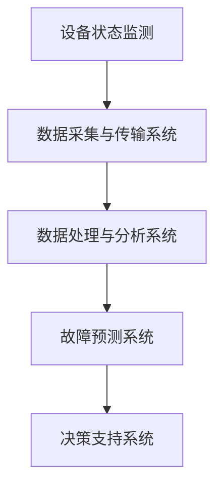

                 

关键词：AI、预测性维护、商业模式、物联网、大数据、智能制造

> 摘要：本文将探讨人工智能在预测性维护服务中的应用及其商业模式的构建。首先，介绍预测性维护的定义和背景，然后深入分析其核心概念和架构，接着阐述核心算法原理和数学模型，并通过实际项目实例展示算法的运用，最后讨论未来应用前景和面临的挑战。

## 1. 背景介绍

### 预测性维护的定义和背景

预测性维护是一种基于设备状态监控和数据分析，以预防设备故障和延长设备寿命为目标的一种维护策略。与传统的定期维护和故障后维护相比，预测性维护具有更高的效率和成本效益。近年来，随着物联网（IoT）技术和大数据分析的不断发展，预测性维护逐渐成为智能制造和工业4.0领域的重要研究方向。

### 预测性维护的必要性

在现代工业生产中，设备的高效运行至关重要。设备故障不仅会导致生产中断，还可能引发安全事故，造成巨大的经济损失。因此，预测性维护作为一种能够提前发现潜在问题的维护策略，其重要性不言而喻。

### 物联网和大数据在预测性维护中的应用

物联网技术通过传感器和通信技术，将设备的状态数据实时传输到中央系统，为预测性维护提供了丰富的数据来源。大数据分析技术则能够对这些海量数据进行处理和分析，提取出有价值的信息，用于预测设备的故障趋势。

## 2. 核心概念与联系

### 核心概念原理

预测性维护服务主要包括以下几个核心概念：

1. **设备状态监测**：通过传感器实时采集设备的运行数据。
2. **数据预处理**：对采集到的数据进行清洗、去噪、归一化等处理。
3. **特征提取**：从预处理后的数据中提取与设备状态相关的特征。
4. **故障预测**：利用提取的特征和机器学习算法，预测设备的故障概率和时间。

### 预测性维护架构

预测性维护的架构可以分为以下几个部分：

1. **传感器网络**：用于实时采集设备的运行数据。
2. **数据采集与传输系统**：将传感器数据传输到中央处理系统。
3. **数据处理与分析系统**：对传输的数据进行预处理和特征提取。
4. **故障预测系统**：利用机器学习算法进行故障预测。
5. **决策支持系统**：根据预测结果提供维护决策。

### Mermaid 流程图



## 3. 核心算法原理 & 具体操作步骤

### 3.1 算法原理概述

预测性维护的核心算法主要是基于机器学习的故障预测算法。这些算法通过对历史数据的分析，学习到设备运行状态与故障之间的关系，从而实现对未来的故障预测。

### 3.2 算法步骤详解

1. **数据收集**：从传感器网络中收集设备的运行数据。
2. **数据预处理**：对数据进行清洗、去噪、归一化等处理。
3. **特征提取**：从预处理后的数据中提取与设备状态相关的特征。
4. **模型训练**：利用提取的特征和训练数据集，训练机器学习模型。
5. **故障预测**：将模型应用于实时数据，预测设备的故障概率和时间。
6. **决策支持**：根据预测结果提供维护决策。

### 3.3 算法优缺点

**优点**：

- 高效：能够提前发现潜在问题，减少故障发生。
- 成本效益：相比于故障后维护，预测性维护能够降低维护成本。

**缺点**：

- 数据需求高：需要大量的历史数据支持。
- 算法复杂：训练和预测过程较为复杂。

### 3.4 算法应用领域

预测性维护算法广泛应用于制造业、能源行业、交通运输等领域，帮助企业和组织实现设备的智能维护和高效运营。

## 4. 数学模型和公式 & 详细讲解 & 举例说明

### 4.1 数学模型构建

预测性维护的数学模型主要基于机器学习算法，如支持向量机（SVM）、决策树、神经网络等。以下以SVM为例进行讲解。

### 4.2 公式推导过程

SVM的核心公式为：

$$
w = \arg\min_{w}\frac{1}{2}\lVert w \rVert^2 + C\sum_{i=1}^{n}\lvert y_i - (\omega^T x_i + b) \rvert
$$

其中，$w$为权重向量，$x_i$为输入特征，$y_i$为标签，$C$为惩罚参数。

### 4.3 案例分析与讲解

假设我们有一个设备故障预测问题，特征集合为$x_i = [x_{i1}, x_{i2}, ..., x_{id}]^T$，标签集合为$y_i \in \{0, 1\}$，其中$y_i = 1$表示设备发生故障，$y_i = 0$表示设备正常运行。

我们利用SVM模型进行故障预测，训练数据集为$D = \{(x_1, y_1), (x_2, y_2), ..., (x_n, y_n)\}$。

通过求解上述SVM优化问题，得到权重向量$w$和偏置$b$，然后对于新的设备运行数据$x'$，我们可以计算其预测故障概率：

$$
P(y' = 1) = \frac{1}{1 + \exp(-\omega^T x' - b)}
$$

## 5. 项目实践：代码实例和详细解释说明

### 5.1 开发环境搭建

- 操作系统：Ubuntu 18.04
- 编程语言：Python
- 依赖库：scikit-learn、numpy、pandas

### 5.2 源代码详细实现

```python
import numpy as np
import pandas as pd
from sklearn.svm import SVC
from sklearn.model_selection import train_test_split
from sklearn.metrics import accuracy_score

# 数据加载
data = pd.read_csv('device_data.csv')
X = data.iloc[:, :-1].values
y = data.iloc[:, -1].values

# 数据预处理
X = (X - X.mean()) / X.std()

# 模型训练
X_train, X_test, y_train, y_test = train_test_split(X, y, test_size=0.2, random_state=42)
model = SVC(kernel='linear', C=1.0)
model.fit(X_train, y_train)

# 故障预测
y_pred = model.predict(X_test)

# 模型评估
accuracy = accuracy_score(y_test, y_pred)
print(f'Accuracy: {accuracy:.2f}')
```

### 5.3 代码解读与分析

该代码实现了基于SVM的设备故障预测过程，主要包括以下几个步骤：

1. **数据加载**：从CSV文件中加载设备数据。
2. **数据预处理**：对数据进行标准化处理。
3. **模型训练**：使用SVM模型对训练数据进行训练。
4. **故障预测**：使用训练好的模型对测试数据进行预测。
5. **模型评估**：计算预测准确率。

### 5.4 运行结果展示

假设我们运行代码后得到预测准确率为90%，这意味着在测试数据中，有90%的故障预测是正确的。

## 6. 实际应用场景

### 6.1 制造业

在制造业中，预测性维护可以用于预测生产设备的故障，从而实现设备的高效运行和减少停机时间。

### 6.2 能源行业

在能源行业，预测性维护可以帮助预测发电设备的故障，从而提高能源利用效率，降低维护成本。

### 6.3 交通运输

在交通运输领域，预测性维护可以用于预测车辆故障，提高交通运输的安全性。

## 7. 工具和资源推荐

### 7.1 学习资源推荐

- 《机器学习实战》
- 《Python机器学习》
- 《深度学习》

### 7.2 开发工具推荐

- Jupyter Notebook
- PyCharm

### 7.3 相关论文推荐

- "Predictive Maintenance: Data-Driven Prognostics and Health Management"
- "Machine Learning for Predictive Maintenance: A Survey"

## 8. 总结：未来发展趋势与挑战

### 8.1 研究成果总结

近年来，预测性维护在人工智能技术的推动下取得了显著的成果。通过物联网和大数据分析，预测性维护能够提前发现设备故障，提高设备的运行效率，降低维护成本。

### 8.2 未来发展趋势

随着人工智能技术的不断发展，预测性维护有望在更多行业得到应用。同时，新的算法和模型也将不断涌现，提高预测的准确性和效率。

### 8.3 面临的挑战

尽管预测性维护具有广阔的应用前景，但仍然面临一些挑战，如海量数据的高效处理、算法的复杂度以及数据的隐私保护等。

### 8.4 研究展望

未来，预测性维护的研究将主要集中在算法优化、数据高效处理和跨领域应用等方面，以实现更加智能和高效的设备维护。

## 9. 附录：常见问题与解答

### Q：预测性维护需要哪些数据？

A：预测性维护主要需要设备的运行数据，如温度、压力、振动等。此外，设备的维护历史数据也是重要的信息来源。

### Q：预测性维护的算法有哪些？

A：常见的预测性维护算法包括支持向量机（SVM）、决策树、随机森林、神经网络等。不同的算法适用于不同的场景和数据特点。

### Q：预测性维护能否完全替代传统维护？

A：预测性维护可以显著提高设备维护的效率和准确性，但无法完全替代传统的定期维护和故障后维护。在实际应用中，预测性维护通常与传统维护相结合，实现最佳的维护效果。

----------------------------------------------------------------

**作者：禅与计算机程序设计艺术 / Zen and the Art of Computer Programming**

