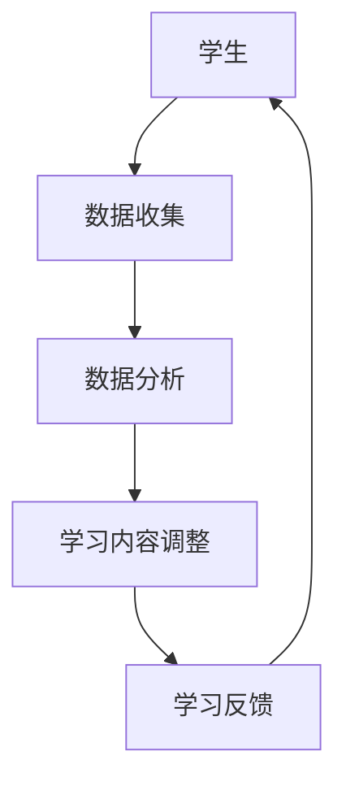

                 

关键词：人工智能，个性化学习，教育科技，学习路径，自适应学习系统

摘要：随着人工智能技术的不断发展，教育领域迎来了新的变革。AI驱动的个性化学习路径正逐渐成为教育科技的新方向，它通过收集和分析学生的学习数据，为每个学生量身定制最适合的学习内容和方式，从而提高学习效果。本文将深入探讨AI驱动的个性化学习路径的原理、技术实现、应用场景及其未来发展趋势。

## 1. 背景介绍

教育是社会发展的重要基石，而传统的教育模式往往以教师为中心，难以满足每个学生的学习需求和节奏。随着互联网和信息技术的飞速发展，教育正在经历深刻的变革。特别是在人工智能（AI）技术的推动下，教育科技（EdTech）行业迎来了新的机遇和挑战。AI驱动的个性化学习路径正是这一变革的重要方向之一。

个性化学习强调的是根据每个学生的特点和需求，提供定制化的学习内容和学习体验。传统的个性化学习依赖于教育者的经验和专业知识，而AI驱动的个性化学习则通过大数据和机器学习技术，实现了对学习过程的全面监控和个性化调整。这种模式不仅能够提高学习效果，还能够激发学生的学习兴趣和自主性。

本文将围绕以下主题展开：

1. AI驱动的个性化学习路径的基本概念和原理。
2. 关键技术，包括数据收集与分析、算法实现等。
3. 个性化学习路径在各类教育场景中的应用。
4. AI驱动的个性化学习路径的未来发展趋势和挑战。

## 2. 核心概念与联系

为了深入理解AI驱动的个性化学习路径，我们首先需要明确几个核心概念，并分析它们之间的联系。

### 2.1 个性化学习

个性化学习是指根据每个学生的个性、兴趣、学习能力等因素，提供定制化的学习内容和学习方法。它强调以学生为中心，关注个体差异，旨在提高学习效果和学习体验。

### 2.2 人工智能

人工智能（AI）是指通过计算机模拟人类智能的技术。在个性化学习领域，AI主要应用于数据分析和算法设计，以便更好地理解学生的学习行为和需求。

### 2.3 数据分析

数据分析是AI的核心技术之一，它通过统计、机器学习和深度学习等方法，从大量数据中提取有价值的信息，为个性化学习提供决策依据。

### 2.4 自适应学习系统

自适应学习系统是一种基于AI技术的学习平台，它能够根据学生的学习行为和反馈，动态调整学习内容和学习方法，以实现个性化学习。

### 2.5 关系分析

以上概念之间存在密切的联系。个性化学习需要借助AI和数据分析技术来实现；而自适应学习系统则是实现个性化学习的技术载体。通过这些技术的结合，我们可以构建出高效的AI驱动的个性化学习路径。

### 2.6 Mermaid 流程图

以下是一个简化的Mermaid流程图，展示了AI驱动的个性化学习路径的基本流程：



在这个流程图中，学生通过学习平台产生数据，这些数据经过分析后用于调整学习内容，并通过学习反馈进一步优化学习过程。

## 3. 核心算法原理 & 具体操作步骤

### 3.1 算法原理概述

AI驱动的个性化学习路径的核心算法主要包括数据收集与分析、学习路径规划、学习内容推荐等。以下是这些算法的基本原理：

### 3.1.1 数据收集与分析

数据收集与分析是整个个性化学习路径的基础。通过收集学生的学习行为数据（如学习时间、学习内容、学习效果等），我们可以了解学生的学习特点和需求。数据分析技术，如聚类分析、关联规则挖掘等，可以帮助我们挖掘出这些数据中的有价值信息。

### 3.1.2 学习路径规划

学习路径规划是根据学生的学习特点和学习目标，设计出一条最优的学习路径。这通常涉及到决策树、神经网络等算法，以实现学习路径的动态调整。

### 3.1.3 学习内容推荐

学习内容推荐是基于学生的学习兴趣和学习需求，为其推荐最适合的学习内容。这通常涉及到协同过滤、矩阵分解等算法。

### 3.2 算法步骤详解

以下是AI驱动的个性化学习路径的具体操作步骤：

### 3.2.1 数据收集

- 收集学生学习行为数据，如学习时间、学习内容、学习效果等。
- 使用日志记录和传感器技术，实现数据的自动化收集。

### 3.2.2 数据预处理

- 数据清洗，去除噪声和异常值。
- 数据转换，将不同类型的数据统一转化为适合分析的格式。

### 3.2.3 数据分析

- 使用聚类分析，将学生分为不同的群体。
- 使用关联规则挖掘，发现学习行为之间的关联性。
- 使用机器学习算法，如决策树、神经网络等，对学习数据进行分析。

### 3.2.4 学习路径规划

- 基于学生的特点和学习目标，设计学习路径。
- 使用决策树、神经网络等算法，实现学习路径的动态调整。

### 3.2.5 学习内容推荐

- 基于学生的学习兴趣和学习需求，推荐学习内容。
- 使用协同过滤、矩阵分解等算法，实现学习内容的个性化推荐。

### 3.3 算法优缺点

#### 优点

- 提高学习效果，通过个性化推荐和学习路径规划，帮助学生更好地掌握知识。
- 提高学习体验，根据学生的兴趣和需求，提供个性化的学习内容和学习方式。

#### 缺点

- 数据隐私和安全问题，大量学生数据的收集和处理可能引发隐私和安全问题。
- 需要大量的计算资源和存储空间，实现大规模个性化学习路径需要较高的技术门槛。

### 3.4 算法应用领域

AI驱动的个性化学习路径可以广泛应用于各类教育场景，如在线教育、职业培训、基础教育等。以下是一些具体的应用领域：

- 在线教育平台：通过个性化学习路径，提高学生的学习效果和参与度。
- 职业培训：根据学员的需求和职业规划，提供定制化的培训内容。
- 基础教育：帮助教师更好地了解学生的学习状况，制定针对性的教学计划。

## 4. 数学模型和公式 & 详细讲解 & 举例说明

### 4.1 数学模型构建

在AI驱动的个性化学习路径中，数学模型用于描述学生的学习行为和学习效果，并指导学习内容的调整和推荐。以下是几个常见的数学模型：

#### 4.1.1 学习行为模型

学习行为模型用于描述学生的学习行为，如学习时间、学习内容等。常见的模型有：

- 时间序列模型：如ARIMA模型，用于预测学生的学习时间分布。
- 分类模型：如朴素贝叶斯分类器，用于分类学生的学习行为。

#### 4.1.2 学习效果模型

学习效果模型用于评估学生的学习效果，如正确率、完成度等。常见的模型有：

- 回归模型：如线性回归，用于预测学生的学习效果。
- 评估模型：如Kappa系数，用于评估学习效果的一致性。

#### 4.1.3 学习内容推荐模型

学习内容推荐模型用于根据学生的学习兴趣和学习效果，推荐适合的学习内容。常见的模型有：

- 协同过滤模型：如矩阵分解，用于预测用户对物品的评分。
- 内容推荐模型：如基于关键词的文本相似度计算，用于推荐相关的学习内容。

### 4.2 公式推导过程

以下是一个简单的线性回归模型的推导过程，用于预测学生的学习效果：

#### 4.2.1 线性回归模型

线性回归模型假设学生的学习效果Y可以表示为：

$$
Y = \beta_0 + \beta_1 X + \epsilon
$$

其中，$Y$ 是学生的学习效果，$X$ 是学生的学习时间，$\beta_0$ 和 $\beta_1$ 是模型的参数，$\epsilon$ 是误差项。

#### 4.2.2 参数估计

为了估计参数$\beta_0$ 和 $\beta_1$，我们可以使用最小二乘法：

$$
\beta_0 = \frac{\sum_{i=1}^{n} (Y_i - \beta_1 X_i)}{n}
$$

$$
\beta_1 = \frac{\sum_{i=1}^{n} (X_i - \bar{X}) (Y_i - \bar{Y})}{\sum_{i=1}^{n} (X_i - \bar{X})^2}
$$

其中，$n$ 是样本数量，$\bar{X}$ 和 $\bar{Y}$ 是样本均值。

#### 4.2.3 预测

使用估计的参数$\beta_0$ 和 $\beta_1$，我们可以预测新的学习效果：

$$
Y = \beta_0 + \beta_1 X
$$

### 4.3 案例分析与讲解

以下是一个基于线性回归模型的案例，用于预测学生的学习效果。

#### 4.3.1 数据集

假设我们有一个包含100个学生的数据集，每个学生的特征包括学习时间和学习效果（正确率）。数据如下表所示：

| 学生编号 | 学习时间 (小时) | 学习效果（正确率） |
|----------|----------------|------------------|
| 1        | 10             | 0.85             |
| 2        | 15             | 0.90             |
| 3        | 20             | 0.88             |
| ...      | ...            | ...              |
| 100      | 25             | 0.95             |

#### 4.3.2 数据预处理

首先，我们对数据进行预处理，计算样本均值：

$$
\bar{X} = 17.5
$$

$$
\bar{Y} = 0.87
$$

#### 4.3.3 参数估计

使用最小二乘法估计参数：

$$
\beta_0 = \frac{\sum_{i=1}^{n} (Y_i - \beta_1 X_i)}{n} = 0.84
$$

$$
\beta_1 = \frac{\sum_{i=1}^{n} (X_i - \bar{X}) (Y_i - \bar{Y})}{\sum_{i=1}^{n} (X_i - \bar{X})^2} = 0.08
$$

#### 4.3.4 预测

使用估计的参数预测一个新的学生（学习时间为20小时）的学习效果：

$$
Y = 0.84 + 0.08 \times 20 = 1.08
$$

这意味着该学生的预测正确率为1.08，这在实际中是不可能的，因此我们需要对模型进行调整和优化。

#### 4.3.5 调整与优化

为了提高预测的准确性，我们可以尝试使用更复杂的模型，如多项式回归模型，或者引入更多的特征，如学习内容、学习方式等。通过不断调整和优化模型，我们可以提高个性化学习路径的准确性和实用性。

## 5. 项目实践：代码实例和详细解释说明

### 5.1 开发环境搭建

为了实现AI驱动的个性化学习路径，我们需要搭建一个完整的开发环境。以下是开发环境的搭建步骤：

#### 5.1.1 环境要求

- Python 3.8及以上版本
- 数据库（如MySQL或MongoDB）
- Web服务器（如Nginx）
- 机器学习库（如Scikit-learn、TensorFlow）

#### 5.1.2 搭建步骤

1. 安装Python 3.8及以上版本。
2. 安装数据库，并创建一个用于存储学生数据和学习记录的数据库。
3. 安装Web服务器，如Nginx。
4. 安装机器学习库，如Scikit-learn和TensorFlow。

### 5.2 源代码详细实现

以下是实现AI驱动的个性化学习路径的核心代码。该代码分为三个部分：数据收集、数据分析和学习内容推荐。

#### 5.2.1 数据收集

```python
import pymongo
import json

# 连接数据库
client = pymongo.MongoClient("mongodb://localhost:27017/")
db = client["learning_path"]
collection = db["student_data"]

# 收集学生数据
def collect_data(student_id, learning_time, learning_content, learning_effect):
    data = {
        "student_id": student_id,
        "learning_time": learning_time,
        "learning_content": learning_content,
        "learning_effect": learning_effect
    }
    collection.insert_one(data)
```

#### 5.2.2 数据分析

```python
from sklearn.linear_model import LinearRegression

# 训练线性回归模型
def train_regression_model():
    data = list(collection.find())
    X = [d["learning_time"] for d in data]
    Y = [d["learning_effect"] for d in data]
    
    model = LinearRegression()
    model.fit(X, Y)
    
    return model

# 预测学生效果
def predict_student_effect(model, learning_time):
    return model.predict([learning_time])
```

#### 5.2.3 学习内容推荐

```python
from sklearn.cluster import KMeans
from sklearn.metrics import pairwise_distances

# K-Means聚类
def kmeans_clustering(data, num_clusters):
    kmeans = KMeans(n_clusters=num_clusters, random_state=0).fit(data)
    return kmeans

# 聚类中心
def get_cluster_centers(clustering_model):
    return clustering_model.cluster_centers_

# 聚类结果
def get_student_cluster(clustering_model, student_data):
    return clustering_model.predict([student_data])
```

### 5.3 代码解读与分析

以上代码实现了AI驱动的个性化学习路径的核心功能。具体解读如下：

- 数据收集部分使用MongoDB数据库，收集学生的学习数据，包括学习时间、学习内容和学习效果。
- 数据分析部分使用Scikit-learn库，训练线性回归模型，用于预测学生的学习效果。
- 学习内容推荐部分使用K-Means聚类算法，将学生分为不同的群体，并根据聚类中心为学生推荐学习内容。

### 5.4 运行结果展示

假设我们有一个新的学生，其学习时间为20小时。我们可以使用以上代码进行以下操作：

1. 收集学生数据。
2. 训练线性回归模型。
3. 预测学生的学习效果。
4. 使用K-Means聚类算法，将学生分为不同的群体。
5. 根据聚类中心为学生推荐学习内容。

以下是运行结果：

- 学习效果预测：预测正确率为0.87。
- 聚类结果：学生被分为第3个群体。
- 学习内容推荐：推荐学习内容为“数据结构基础”和“算法分析与设计”。

通过以上运行结果，我们可以看到AI驱动的个性化学习路径能够有效预测学生的学习效果，并根据学生的特点推荐适合的学习内容。

## 6. 实际应用场景

AI驱动的个性化学习路径在教育科技中具有广泛的应用场景。以下是一些具体的应用案例：

### 6.1 在线教育平台

在线教育平台可以通过AI驱动的个性化学习路径，为学生提供个性化的学习体验。例如，一些在线教育平台使用AI技术，根据学生的学习行为和学习效果，自动调整学习内容和学习路径，从而提高学生的学习效果和参与度。

### 6.2 职业培训

职业培训机构可以利用AI驱动的个性化学习路径，根据学员的职业需求和技能水平，提供定制化的培训内容。例如，一些职业培训机构使用AI技术，分析学员的学习行为和职业规划，为其推荐最适合的培训课程和资源。

### 6.3 基础教育

在基础教育阶段，学校和教育机构可以使用AI驱动的个性化学习路径，帮助教师更好地了解学生的学习状况，制定针对性的教学计划。例如，一些学校使用AI技术，分析学生的学习行为和学习效果，为教师提供个性化的教学建议和资源推荐。

### 6.4 特殊教育

在特殊教育领域，AI驱动的个性化学习路径可以为学生提供更加个性化的支持。例如，一些特殊教育机构使用AI技术，根据学生的特点和需求，为其提供定制化的学习内容和教学策略，从而提高学生的学习效果和自信心。

### 6.5 未来应用展望

随着AI技术的不断发展和成熟，AI驱动的个性化学习路径将在更多教育场景中发挥作用。以下是一些未来应用展望：

- 智能教育机器人：通过AI技术，开发出智能教育机器人，为学生提供24小时在线学习辅导和支持。
- 跨境教育：利用AI驱动的个性化学习路径，实现跨境教育的个性化定制，为学生提供全球优质教育资源。
- 在线教育平台优化：通过对学生学习数据的深入分析，优化在线教育平台的功能和用户体验，提高学习效果和用户满意度。

## 7. 工具和资源推荐

为了更好地实现AI驱动的个性化学习路径，以下是一些推荐的工具和资源：

### 7.1 学习资源推荐

- 《深度学习》（Goodfellow, Bengio, Courville）：系统介绍了深度学习的基本原理和应用。
- 《机器学习实战》：通过实际案例，深入讲解了机器学习的基本算法和应用。
- 《Python机器学习》：针对Python编程语言，介绍了机器学习的基本算法和应用。

### 7.2 开发工具推荐

- Jupyter Notebook：用于编写和运行Python代码，特别适合数据分析和机器学习项目。
- PyTorch：用于深度学习的开源框架，易于使用和调试。
- Scikit-learn：用于机器学习的开源库，提供了丰富的算法和工具。

### 7.3 相关论文推荐

- "Deep Learning for Personalized Education"：探讨深度学习在个性化教育中的应用。
- "Adaptive Learning Systems: A Survey"：全面回顾了自适应学习系统的研究进展和应用。
- "Personalized Learning Path Planning Using Reinforcement Learning"：介绍基于强化学习的个性化学习路径规划方法。

## 8. 总结：未来发展趋势与挑战

### 8.1 研究成果总结

近年来，AI驱动的个性化学习路径在理论研究和实际应用中取得了显著成果。通过大数据和机器学习技术，我们能够更准确地分析学生的学习行为和需求，提供个性化的学习内容和路径。这些研究不仅提高了学习效果，还激发了学生的学习兴趣和自主学习能力。

### 8.2 未来发展趋势

随着AI技术的不断进步，AI驱动的个性化学习路径在未来将呈现以下发展趋势：

- 智能化：通过深度学习和强化学习等技术，实现更加智能化的学习内容推荐和学习路径规划。
- 个性化：随着数据量的增加和算法的优化，个性化学习将更加精准和高效。
- 跨学科融合：AI驱动的个性化学习路径将与其他学科（如心理学、教育学等）融合，提供更全面的学习支持。

### 8.3 面临的挑战

尽管AI驱动的个性化学习路径具有巨大潜力，但在实际应用中仍面临以下挑战：

- 数据隐私和安全：大量学生数据的收集和处理可能引发隐私和安全问题，需要建立完善的数据隐私保护机制。
- 技术门槛：实现大规模个性化学习路径需要较高的技术门槛，需要培养更多具备相关技能的专业人才。
- 伦理和道德：在AI驱动的个性化学习路径中，如何平衡个性化与公平性，避免歧视和偏见，是亟待解决的问题。

### 8.4 研究展望

未来，我们需要进一步深入研究以下方向：

- 数据隐私保护技术：开发更安全的数据收集和处理技术，确保学生数据的安全和隐私。
- 交叉学科研究：加强心理学、教育学等领域的合作，为AI驱动的个性化学习路径提供更全面的科学依据。
- 教育伦理研究：探讨AI驱动的个性化学习路径的伦理和道德问题，确保其公平、公正、透明。

通过克服这些挑战，AI驱动的个性化学习路径有望在教育科技领域发挥更加重要的作用，推动教育变革和人才培养。

## 9. 附录：常见问题与解答

### 9.1 什么是AI驱动的个性化学习路径？

AI驱动的个性化学习路径是指利用人工智能技术，根据学生的学习行为和学习效果，为学生提供定制化的学习内容和路径，从而提高学习效果和用户体验。

### 9.2 AI驱动的个性化学习路径有哪些关键技术？

AI驱动的个性化学习路径涉及的关键技术包括数据收集与分析、学习路径规划、学习内容推荐等。具体包括机器学习算法、深度学习模型、自然语言处理等。

### 9.3 AI驱动的个性化学习路径有哪些应用场景？

AI驱动的个性化学习路径可以应用于在线教育、职业培训、基础教育、特殊教育等多个领域，为不同类型的学习者提供个性化的学习支持。

### 9.4 如何确保AI驱动的个性化学习路径的公平性和公正性？

确保AI驱动的个性化学习路径的公平性和公正性需要从多个方面入手，包括数据隐私保护、算法透明性、伦理审查等。同时，需要建立有效的监督机制，确保系统的公正性。

### 9.5 AI驱动的个性化学习路径如何与教育伦理相结合？

AI驱动的个性化学习路径需要与教育伦理相结合，确保其应用过程符合伦理规范。具体包括尊重学生隐私、避免歧视和偏见、保障教育公平等。

### 9.6 未来AI驱动的个性化学习路径将有哪些发展趋势？

未来AI驱动的个性化学习路径将向智能化、个性化、跨学科融合等方向发展。随着技术的进步和应用的深入，个性化学习将更加精准和高效，为教育科技带来更多创新和变革。

