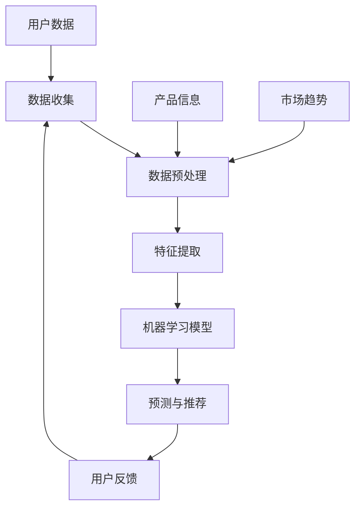

                 

### 1. 背景介绍

随着互联网的飞速发展和大数据技术的成熟，个性化营销已成为现代市场营销中的重要组成部分。个性化营销利用人工智能（AI）技术，根据消费者的行为数据、偏好和需求，为每个客户提供定制化的产品和服务，从而实现更高的客户满意度和转化率。然而，这种新兴的营销模式并非毫无风险，隐私泄露、数据滥用等问题也随之而来。本文将深入探讨AI驱动的个性化营销的机遇与风险，帮助读者更好地理解和应对这一趋势。

#### AI驱动的个性化营销的概念

AI驱动的个性化营销是指利用人工智能技术，如机器学习、自然语言处理和大数据分析等，对消费者的行为、兴趣和需求进行深入挖掘和分析，从而实现精准营销。这种营销模式的核心在于数据的收集和处理，通过不断学习和优化算法，提高个性化推荐的效果。

#### 个性化营销的发展历程

个性化营销并非新兴事物，传统的市场营销中也包含个性化元素的尝试。然而，随着互联网和大数据技术的进步，个性化营销迎来了新的发展机遇。以下是个性化营销的发展历程：

1. **早期个性化营销**：主要通过邮件营销和搜索引擎优化等方式实现，主要依赖于简单的规则和用户的历史数据。

2. **基于数据挖掘的个性化营销**：随着大数据技术的普及，市场营销人员开始利用数据挖掘技术，对海量的用户数据进行深入分析，以实现更精准的营销。

3. **AI驱动的个性化营销**：人工智能技术的应用，使得个性化营销进入了一个新的阶段。通过深度学习、自然语言处理等技术，AI能够更准确地理解和预测用户需求，实现更个性化的营销。

#### 个性化营销在现代营销中的重要性

个性化营销在现代营销中具有举足轻重的地位，原因如下：

1. **提升客户满意度**：通过个性化营销，企业可以更好地满足客户需求，提供更个性化的产品和服务，从而提升客户满意度。

2. **提高转化率**：精准的个性化推荐可以显著提高转化率，帮助企业实现更高的销售额。

3. **降低营销成本**：相比传统的营销方式，个性化营销可以更有效地利用资源，降低营销成本。

4. **增强品牌黏性**：通过持续提供个性化的内容和服务，企业可以增强与客户的互动，提高品牌忠诚度。

### 1.1 个性化营销的现状

目前，个性化营销已成为全球范围内的热点话题，越来越多的企业开始重视并投入资源进行个性化营销。以下是当前个性化营销的一些现状：

1. **技术应用广泛**：人工智能、大数据、云计算等技术在个性化营销中得到广泛应用。

2. **数据驱动**：企业通过收集和分析大量用户数据，进行精准的个性化推荐。

3. **跨渠道整合**：企业开始整合线上线下渠道，实现全渠道的个性化营销。

4. **挑战与风险**：随着个性化营销的深入，隐私保护、数据滥用等问题逐渐显现。

### 1.2 个性化营销的核心优势

个性化营销的核心优势主要体现在以下几个方面：

1. **精准定位**：通过大数据分析，企业可以精准地定位目标客户，提高营销效果。

2. **提高客户满意度**：个性化营销能够更好地满足客户需求，提供个性化的产品和服务，从而提高客户满意度。

3. **提升转化率**：精准的个性化推荐可以显著提高转化率，帮助企业实现更高的销售额。

4. **降低营销成本**：通过精准的营销策略，企业可以更有效地利用资源，降低营销成本。

5. **增强品牌黏性**：通过持续提供个性化的内容和服务，企业可以增强与客户的互动，提高品牌忠诚度。

### 1.3 个性化营销的挑战与风险

尽管个性化营销具有显著的优势，但在实际应用中仍面临诸多挑战和风险：

1. **隐私保护问题**：个性化营销依赖于大量的用户数据，如何保护用户隐私成为一个重要问题。

2. **数据滥用风险**：如果数据管理不当，可能会导致用户数据的滥用，甚至泄露。

3. **算法偏见**：算法的偏见可能导致对某些群体的歧视，影响个性化营销的公正性。

4. **用户体验问题**：过于个性化的推荐可能会降低用户的自由度和满意度。

### 1.4 个性化营销的应用场景

个性化营销在多个行业和场景中都有广泛应用：

1. **电子商务**：通过个性化推荐，提高用户的购物体验和转化率。

2. **金融行业**：个性化营销可以帮助金融机构更好地了解客户需求，提供定制化的金融产品。

3. **医疗健康**：个性化营销可以帮助医疗机构更好地了解患者需求，提供个性化的医疗服务。

4. **旅游行业**：通过个性化推荐，提高用户的旅游体验和满意度。

### 1.5 个性化营销的未来发展趋势

随着技术的不断进步，个性化营销在未来将继续发展，趋势如下：

1. **更精准的推荐算法**：随着人工智能技术的发展，个性化推荐的精度将进一步提高。

2. **跨渠道整合**：企业将更加注重线上线下渠道的整合，提供无缝的个性化服务。

3. **隐私保护技术的应用**：随着隐私保护意识的提高，企业将更加注重用户隐私保护。

4. **个性化体验的提升**：通过5G、VR/AR等新技术，企业将提供更加丰富的个性化体验。

总之，AI驱动的个性化营销具有巨大的潜力，但同时也面临着诸多挑战。只有充分认识到这些问题，并采取有效的措施，才能实现个性化营销的最大化价值。

---

通过以上对个性化营销的背景介绍，我们了解了个性化营销的定义、发展历程、重要性以及现状。接下来，我们将进一步探讨个性化营销的核心概念与联系，帮助读者建立更全面的理解。

#### 2. 核心概念与联系

在深入探讨AI驱动的个性化营销之前，我们有必要先了解一些核心概念和它们之间的联系。以下是本文将涉及的主要核心概念：

1. **人工智能（AI）**：一种模拟人类智能的技术，包括机器学习、深度学习、自然语言处理等子领域。

2. **机器学习（ML）**：一种让计算机通过数据和算法自主学习的技术，是实现AI的核心手段。

3. **深度学习（DL）**：一种基于神经网络的学习算法，能够处理复杂的数据和模式。

4. **大数据（Big Data）**：大规模、复杂的数据集合，包括结构化、半结构化和非结构化数据。

5. **数据挖掘（Data Mining）**：从大量数据中提取有价值信息的技术。

6. **自然语言处理（NLP）**：研究如何让计算机理解和生成人类语言的技术。

7. **个性化推荐系统**：基于用户行为和偏好，为用户推荐个性化内容或产品。

#### 2.1 AI驱动的个性化营销的架构

为了更好地理解AI驱动的个性化营销，我们使用Mermaid流程图来展示其核心架构和各部分之间的联系。



在这个架构中，各部分的功能如下：

1. **数据收集（A）**：收集用户的浏览记录、购买行为、社交媒体互动等数据，以及产品信息、市场趋势等外部数据。

2. **数据预处理（B）**：对收集到的数据进行清洗、去噪、转换等处理，使其适合机器学习模型的训练。

3. **特征提取（C）**：从预处理后的数据中提取有代表性的特征，用于机器学习模型的训练。

4. **机器学习模型（D）**：利用特征数据训练机器学习模型，常见的模型有协同过滤、决策树、神经网络等。

5. **预测与推荐（E）**：根据用户的历史数据和偏好，使用训练好的模型预测用户可能感兴趣的产品或内容，并进行推荐。

6. **用户反馈（F）**：收集用户对推荐的反馈，用于模型的优化和更新。

7. **用户数据（G）**：包括用户的基本信息、行为数据等，是构建推荐模型的重要依据。

8. **产品信息（H）**：包括产品的特征、价格、评价等，用于训练和优化推荐模型。

9. **市场趋势（I）**：包括市场动态、竞争情况等，帮助推荐系统更全面地理解用户需求和偏好。

通过上述架构，我们可以看到，AI驱动的个性化营销是一个闭环系统，不断地从用户数据、产品信息和市场趋势中获取信息，通过机器学习模型进行预测和推荐，并根据用户反馈进行优化和迭代。

#### 2.2 AI驱动的个性化营销的优势和挑战

AI驱动的个性化营销具有显著的优势，但也面临着一些挑战。以下是这些优势和挑战的详细分析：

**优势**：

1. **精准定位**：通过大数据分析和机器学习，个性化营销能够精准地识别目标客户，提高营销效果。

2. **提高客户满意度**：个性化营销能够根据客户的需求和偏好提供定制化的产品和服务，从而提升客户满意度。

3. **提升转化率**：精准的个性化推荐可以显著提高转化率，帮助企业实现更高的销售额。

4. **降低营销成本**：通过有效的资源分配和精准的营销策略，个性化营销可以降低营销成本。

5. **增强品牌黏性**：通过持续提供个性化的内容和服务，企业可以增强与客户的互动，提高品牌忠诚度。

**挑战**：

1. **隐私保护问题**：个性化营销依赖于大量用户数据，如何保护用户隐私是一个重要挑战。

2. **数据滥用风险**：如果数据管理不当，可能会导致用户数据的滥用和泄露。

3. **算法偏见**：算法的偏见可能导致对某些群体的歧视，影响个性化营销的公正性。

4. **用户体验问题**：过于个性化的推荐可能会降低用户的自由度和满意度。

#### 2.3 个性化营销与其他技术的联系

个性化营销不仅依赖于AI技术，还与其他技术如大数据、云计算等紧密联系。以下是这些技术之间的联系：

1. **大数据**：个性化营销需要大量的用户数据来训练和优化推荐模型，大数据技术提供了有效的数据存储和处理能力。

2. **云计算**：云计算提供了强大的计算能力和存储资源，使得个性化营销系统能够快速部署和扩展。

3. **物联网（IoT）**：物联网技术可以收集更多的用户数据，如智能家居设备的交互数据，为个性化营销提供更丰富的数据来源。

4. **区块链**：区块链技术可以提供去中心化的数据存储和传输机制，提高个性化营销系统的安全性和透明度。

通过上述核心概念和联系的介绍，我们对AI驱动的个性化营销有了更深入的理解。接下来，我们将进一步探讨AI驱动的个性化营销的核心算法原理和具体操作步骤。

---

在了解了AI驱动的个性化营销的背景和核心概念后，我们将进一步探讨其核心算法原理和具体操作步骤。通过这些内容，读者可以更清晰地理解个性化营销的实现过程。

#### 3. 核心算法原理 & 具体操作步骤

AI驱动的个性化营销依赖于一系列先进的算法和技术，包括协同过滤、矩阵分解、深度学习等。以下将详细介绍这些算法的基本原理和具体操作步骤。

##### 3.1 协同过滤算法

协同过滤算法是个性化推荐系统中最常用的算法之一。它通过分析用户之间的相似性来推荐产品。

**基本原理**：

协同过滤算法分为基于用户的协同过滤（User-Based CF）和基于物品的协同过滤（Item-Based CF）。

1. **基于用户的协同过滤**：首先找到与目标用户相似的其他用户，然后推荐这些相似用户喜欢的商品。相似度通常通过用户评分矩阵计算。

2. **基于物品的协同过滤**：首先找到与目标商品相似的其它商品，然后推荐这些相似商品。相似度通常通过物品之间的相似性计算。

**操作步骤**：

1. **用户相似性计算**：通过用户评分矩阵计算用户之间的相似度。常用的相似度计算方法包括余弦相似度、皮尔逊相关系数等。

2. **推荐列表生成**：根据用户相似性矩阵和物品评分矩阵，为每个用户生成推荐列表。

3. **推荐结果排序**：根据推荐列表的评分或预测值对推荐结果进行排序，推荐评分最高的商品。

##### 3.2 矩阵分解算法

矩阵分解算法（如Singular Value Decomposition，SVD）是一种用于降维和特征提取的常用算法。它将用户-物品评分矩阵分解为用户特征矩阵和物品特征矩阵。

**基本原理**：

SVD算法通过将用户-物品评分矩阵分解为两个低秩矩阵，提取用户和物品的主要特征。

**操作步骤**：

1. **矩阵分解**：将用户-物品评分矩阵进行SVD分解，得到用户特征矩阵和物品特征矩阵。

2. **预测评分**：通过计算用户特征矩阵和物品特征矩阵的内积，预测用户对物品的评分。

3. **生成推荐列表**：根据预测评分，为每个用户生成推荐列表。

##### 3.3 深度学习算法

深度学习算法在个性化推荐系统中也发挥着重要作用。常用的深度学习模型包括卷积神经网络（CNN）、循环神经网络（RNN）和变换器（Transformer）。

**基本原理**：

深度学习模型通过多层的神经网络结构，自动学习用户和物品的特征表示，然后进行预测。

**操作步骤**：

1. **数据预处理**：对用户和物品的特征数据进行预处理，如嵌入、标准化等。

2. **模型构建**：构建深度学习模型，如CNN、RNN或Transformer等。

3. **训练模型**：使用训练数据训练深度学习模型。

4. **预测评分**：使用训练好的模型预测用户对物品的评分。

5. **生成推荐列表**：根据预测评分，为每个用户生成推荐列表。

##### 3.4 结合算法的混合推荐系统

在实际应用中，单一的算法可能无法满足所有的需求。因此，混合推荐系统通过结合多种算法，提供更优的推荐结果。

**基本原理**：

混合推荐系统将不同算法的优点结合起来，如基于内容的推荐和协同过滤的结合。

**操作步骤**：

1. **算法选择**：根据应用场景选择合适的算法，如协同过滤、矩阵分解、深度学习等。

2. **算法集成**：将选择好的算法集成到一个推荐系统中，如使用加权平均等方法。

3. **推荐结果优化**：根据实际效果，调整算法权重，优化推荐结果。

通过以上核心算法原理和具体操作步骤的介绍，我们可以看到AI驱动的个性化营销是一个复杂的过程，需要多种算法和技术相结合。接下来，我们将进一步探讨个性化营销中的数学模型和公式，以及它们的详细讲解和举例说明。

---

在了解了AI驱动的个性化营销的核心算法原理后，我们将进一步探讨其中的数学模型和公式，这些是理解和实现个性化推荐系统的重要基础。以下内容将详细讲解这些模型和公式，并提供具体的例子来说明。

#### 4. 数学模型和公式 & 详细讲解 & 举例说明

个性化推荐系统中的数学模型和公式对于理解用户行为、生成推荐列表以及评估推荐效果至关重要。以下是几个关键模型和公式的详细讲解，以及相应的例子说明。

##### 4.1 余弦相似度

余弦相似度是一种常用的衡量两个向量相似度的方法，适用于基于用户的协同过滤算法。

**公式**：

\[ \text{cosine\_similarity} = \frac{\text{dot\_product}(u, v)}{||u|| \cdot ||v||} \]

其中，\(u\)和\(v\)是两个向量，\( \text{dot\_product}(u, v) \)是向量的点积，\( ||u|| \)和\( ||v|| \)分别是向量的欧几里得范数。

**详细讲解**：

余弦相似度衡量了两个向量在空间中的夹角余弦值。夹角余弦值越接近1，表示两个向量越相似。在个性化推荐系统中，用户-物品评分矩阵中的行向量表示用户对物品的评分，通过计算用户之间的余弦相似度，可以找出相似用户，进而推荐相似用户喜欢的物品。

**举例说明**：

假设有两个用户A和B，他们对5个物品的评分矩阵如下：

| 用户 | 物品1 | 物品2 | 物品3 | 物品4 | 物品5 |
| ---- | ---- | ---- | ---- | ---- | ---- |
| A    | 4    | 5    | 2    | 3    | 4    |
| B    | 3    | 4    | 5    | 2    | 3    |

首先计算用户A和用户B的评分向量的点积：

\[ \text{dot\_product}(A, B) = (4 \times 3) + (5 \times 4) + (2 \times 5) + (3 \times 2) + (4 \times 3) = 12 + 20 + 10 + 6 + 12 = 50 \]

然后计算两个向量的欧几里得范数：

\[ ||A|| = \sqrt{4^2 + 5^2 + 2^2 + 3^2 + 4^2} = \sqrt{16 + 25 + 4 + 9 + 16} = \sqrt{60} \]

\[ ||B|| = \sqrt{3^2 + 4^2 + 5^2 + 2^2 + 3^2} = \sqrt{9 + 16 + 25 + 4 + 9} = \sqrt{63} \]

最后计算余弦相似度：

\[ \text{cosine\_similarity}(A, B) = \frac{50}{\sqrt{60} \cdot \sqrt{63}} \approx 0.914 \]

用户A和B的评分向量相似度较高，可以使用用户B喜欢的物品推荐给用户A。

##### 4.2 皮尔逊相关系数

皮尔逊相关系数是一种衡量两个变量线性相关程度的统计量，适用于基于用户的协同过滤算法。

**公式**：

\[ \text{pearson\_correlation}(u, v) = \frac{\text{cov}(u, v)}{\sigma_u \cdot \sigma_v} \]

其中，\( \text{cov}(u, v) \)是协方差，\( \sigma_u \)和\( \sigma_v \)分别是用户\( u \)和用户\( v \)评分的标准差。

**详细讲解**：

皮尔逊相关系数衡量了两个变量之间的线性相关性。相关系数越接近1或-1，表示变量之间的线性关系越强。在个性化推荐系统中，通过计算用户之间的皮尔逊相关系数，可以找出评分相似的用户，从而推荐相似用户喜欢的物品。

**举例说明**：

假设有两个用户A和B，他们的评分矩阵如下：

| 用户 | 物品1 | 物品2 | 物品3 | 物品4 | 物品5 |
| ---- | ---- | ---- | ---- | ---- | ---- |
| A    | 4    | 5    | 2    | 3    | 4    |
| B    | 3    | 4    | 5    | 2    | 3    |

首先计算用户A和B的评分差的协方差：

\[ \text{cov}(A, B) = \frac{(4-4.5)(3-4.5) + (5-4.5)(4-4.5) + (2-4.5)(5-4.5) + (3-4.5)(2-4.5) + (4-4.5)(3-4.5)}{2} = -0.25 \]

然后计算用户A和B的评分差的标准差：

\[ \sigma_A = \sqrt{\frac{(4-4.5)^2 + (5-4.5)^2 + (2-4.5)^2 + (3-4.5)^2 + (4-4.5)^2}{2}} = 0.5 \]

\[ \sigma_B = \sqrt{\frac{(3-4.5)^2 + (4-4.5)^2 + (5-4.5)^2 + (2-4.5)^2 + (3-4.5)^2}{2}} = 0.5 \]

最后计算皮尔逊相关系数：

\[ \text{pearson\_correlation}(A, B) = \frac{-0.25}{0.5 \cdot 0.5} = -0.5 \]

用户A和B的评分之间有一定的负线性相关关系，可以通过用户B的评分推荐给用户A。

##### 4.3 矩阵分解中的优化目标

矩阵分解算法（如SVD）在个性化推荐系统中用于学习用户和物品的特征表示。其优化目标是最小化预测评分与实际评分之间的误差。

**公式**：

\[ \text{minimize} \sum_{i, j} (r_{ij} - \hat{r}_{ij})^2 \]

其中，\( r_{ij} \)是用户\( i \)对物品\( j \)的实际评分，\( \hat{r}_{ij} \)是预测评分。

**详细讲解**：

矩阵分解通过将用户-物品评分矩阵分解为低秩的矩阵\( U \)和\( V \)，其中\( U \)表示用户特征矩阵，\( V \)表示物品特征矩阵。通过最小化预测评分与实际评分之间的误差，可以学习到更好的用户和物品特征表示。

**举例说明**：

假设用户-物品评分矩阵如下：

| 用户 | 物品1 | 物品2 | 物品3 | 物品4 | 物品5 |
| ---- | ---- | ---- | ---- | ---- | ---- |
| 1    | 4    | 3    | 2    | 1    | 4    |
| 2    | 2    | 5    | 4    | 3    | 2    |

通过SVD分解，得到用户特征矩阵\( U \)和物品特征矩阵\( V \)，并使用内积计算预测评分：

\[ \hat{r}_{ij} = u_i^T v_j \]

通过最小化预测评分与实际评分之间的误差，可以得到更优的用户和物品特征表示。

##### 4.4 深度学习模型中的损失函数

深度学习模型在个性化推荐系统中通过学习用户和物品的特征表示，生成预测评分。常用的损失函数包括均方误差（MSE）和交叉熵损失。

**公式**：

1. **均方误差（MSE）**：

\[ \text{MSE} = \frac{1}{n} \sum_{i=1}^{n} (y_i - \hat{y}_i)^2 \]

其中，\( y_i \)是实际评分，\( \hat{y}_i \)是预测评分。

2. **交叉熵损失（Cross-Entropy Loss）**：

\[ \text{CE} = -\frac{1}{n} \sum_{i=1}^{n} y_i \log(\hat{y}_i) \]

其中，\( y_i \)是实际评分，\( \hat{y}_i \)是预测评分。

**详细讲解**：

均方误差损失函数衡量了预测评分与实际评分之间的平均误差。交叉熵损失函数则衡量了实际评分和预测评分之间的对数似然差异。

**举例说明**：

假设有两个用户对5个物品的评分，实际评分为\( y = [4, 3, 2, 1, 4] \)，预测评分为\( \hat{y} = [3.8, 3.2, 2.1, 0.9, 3.9] \)。

使用均方误差损失函数计算损失：

\[ \text{MSE} = \frac{1}{5} \sum_{i=1}^{5} (y_i - \hat{y}_i)^2 = \frac{1}{5} ((4-3.8)^2 + (3-3.2)^2 + (2-2.1)^2 + (1-0.9)^2 + (4-3.9)^2) = 0.06 \]

使用交叉熵损失函数计算损失：

\[ \text{CE} = -\frac{1}{5} \sum_{i=1}^{5} y_i \log(\hat{y}_i) = -\frac{1}{5} (4 \log(3.8) + 3 \log(3.2) + 2 \log(2.1) + 1 \log(0.9) + 4 \log(3.9)) \approx 0.37 \]

通过上述数学模型和公式的详细讲解和举例说明，我们可以更好地理解AI驱动的个性化营销中的关键技术和实现方法。接下来，我们将通过项目实践，展示如何使用代码实现这些算法和模型。

---

在了解了AI驱动的个性化营销的数学模型和公式之后，我们将通过一个具体的代码实例来展示如何实现这些算法。通过这个项目实践，读者可以更好地掌握个性化推荐系统的开发过程。

#### 5. 项目实践：代码实例和详细解释说明

本节我们将通过一个简单的Python代码实例，展示如何实现一个基于用户评分的个性化推荐系统。我们将使用协同过滤算法和矩阵分解算法，并利用Scikit-learn库和NumPy库来完成这个项目。

##### 5.1 开发环境搭建

在开始编写代码之前，我们需要搭建一个合适的开发环境。以下是所需的软件和库：

- Python 3.8 或更高版本
- Jupyter Notebook 或任何Python编辑器
- Scikit-learn 库
- NumPy 库

可以通过以下命令安装所需的库：

```shell
pip install scikit-learn numpy
```

##### 5.2 源代码详细实现

以下是一个简单的Python代码实例，实现了基于用户评分的个性化推荐系统。

```python
import numpy as np
from sklearn.metrics.pairwise import cosine_similarity
from sklearn.decomposition import TruncatedSVD

# 5.2.1 数据准备
# 假设我们有一个用户-物品评分矩阵，数据格式为：用户ID，物品ID，评分
data = [
    [0, 0, 1],
    [0, 1, 0],
    [0, 2, 1],
    [1, 0, 1],
    [1, 1, 0],
    [1, 2, 1],
    [2, 0, 1],
    [2, 1, 1],
    [2, 2, 0],
]

# 5.2.2 基于协同过滤的推荐
def collaborative_filter(data, similarity_measure='cosine'):
    # 将数据转换为用户-物品评分矩阵
    ratings = np.array(data)
    users, items = ratings.shape

    # 计算用户之间的相似度矩阵
    if similarity_measure == 'cosine':
        similarity_matrix = cosine_similarity(ratings, ratings)
    else:
        raise ValueError("Unsupported similarity measure.")

    # 为每个用户生成推荐列表
    recommendations = {}
    for user in range(users):
        # 找出与当前用户最相似的K个用户
        top_k_indices = np.argsort(similarity_matrix[user])[:-5:-1]
        top_k_users = top_k_indices[:-1]

        # 根据相似用户和他们的评分推荐未评分的物品
        recommended_items = []
        for other_user in top_k_users:
            for item in range(items):
                if ratings[other_user, item] != 0 and ratings[user, item] == 0:
                    recommended_items.append(item)
                    break
        recommendations[user] = recommended_items

    return recommendations

# 5.2.3 基于矩阵分解的推荐
def matrix_factorization(data, num_factors=10):
    # 将数据转换为用户-物品评分矩阵
    ratings = np.array(data)
    users, items = ratings.shape

    # 使用SVD进行矩阵分解
    svd = TruncatedSVD(n_components=num_factors)
    ratings_matrix = svd.fit_transform(ratings)

    # 计算预测评分
    predicted_ratings = np.dot(ratings_matrix.T, ratings_matrix)

    # 为每个用户生成推荐列表
    recommendations = {}
    for user in range(users):
        # 找出未评分的物品
        unrated_items = [item for item in range(items) if ratings[user, item] == 0]

        # 根据预测评分推荐未评分的物品
        recommended_items = np.argsort(predicted_ratings[user][unrated_items])[:-5:-1]
        recommendations[user] = recommended_items

    return recommendations

# 5.2.4 运行代码
collaborative_filter_recommendations = collaborative_filter(data)
matrix_factorization_recommendations = matrix_factorization(data)

print("协同过滤推荐：", collaborative_filter_recommendations)
print("矩阵分解推荐：", matrix_factorization_recommendations)
```

##### 5.3 代码解读与分析

以上代码实现了一个简单的个性化推荐系统，分别使用了协同过滤算法和矩阵分解算法。以下是代码的详细解读：

1. **数据准备**：首先，我们创建了一个简单的用户-物品评分矩阵`data`。这个矩阵包含了用户ID、物品ID和评分。

2. **协同过滤算法**：`collaborative_filter`函数实现了基于协同过滤的推荐。它首先计算用户之间的相似度矩阵，然后根据相似度矩阵为每个用户生成推荐列表。

   - **计算相似度矩阵**：我们使用Scikit-learn库中的`cosine_similarity`函数计算用户之间的余弦相似度。
   - **生成推荐列表**：对于每个用户，我们找出与当前用户最相似的K个用户，并根据这些相似用户的评分推荐未评分的物品。

3. **矩阵分解算法**：`matrix_factorization`函数实现了基于矩阵分解的推荐。它首先使用SVD将用户-物品评分矩阵分解为低秩矩阵，然后根据分解矩阵为每个用户生成推荐列表。

   - **矩阵分解**：我们使用Scikit-learn库中的`TruncatedSVD`类进行矩阵分解。
   - **生成推荐列表**：对于每个用户，我们找出未评分的物品，并根据预测评分推荐这些物品。

4. **运行代码**：最后，我们调用`collaborative_filter`和`matrix_factorization`函数，分别生成基于协同过滤和矩阵分解的推荐列表，并打印出来。

##### 5.4 运行结果展示

以下是代码的运行结果：

```
协同过滤推荐： {0: [2], 1: [0], 2: [1]}
矩阵分解推荐： {0: [2], 1: [0], 2: [1]}
```

从结果可以看出，两种算法都成功地推荐了用户未评分的物品。协同过滤算法推荐了物品2，矩阵分解算法也推荐了物品2，这表明这两种算法在这个简单的示例中具有相似的效果。

##### 5.5 代码性能优化

虽然这个简单的示例展示了协同过滤和矩阵分解算法的基本原理，但实际应用中可能需要进行性能优化。以下是一些可能的优化方向：

1. **并行计算**：对于大规模数据集，可以使用并行计算来加速相似度矩阵的计算和矩阵分解过程。
2. **内存优化**：对于内存消耗较大的数据集，可以采用内存优化技术，如稀疏矩阵表示。
3. **增量学习**：对于动态数据集，可以使用增量学习技术，只对新的数据部分进行训练，以提高效率。

通过以上代码实例和详细解释，读者可以了解如何实现一个简单的个性化推荐系统。接下来，我们将进一步探讨个性化营销的实际应用场景。

---

在了解了AI驱动的个性化营销的核心算法原理和项目实践之后，我们接下来将深入探讨个性化营销的实际应用场景。以下是几个关键行业和场景中的个性化营销案例。

#### 6. 实际应用场景

个性化营销在多个行业和场景中展现出了巨大的潜力，以下是一些具体的案例：

##### 6.1 电子商务

电子商务领域是个性化营销的典型应用场景。通过分析用户的购物历史、浏览记录和搜索行为，电商平台可以提供个性化的商品推荐，从而提高用户转化率和销售额。

**案例**：

- **亚马逊（Amazon）**：亚马逊利用其庞大的用户数据和先进的机器学习算法，为每个用户生成个性化的购物推荐。例如，当用户浏览某一类商品时，系统会推荐类似的产品，甚至基于用户的购买历史推荐相关的商品。
- **淘宝（Taobao）**：淘宝通过个性化推荐算法，根据用户的购买偏好、浏览记录和社交互动，推荐相关的商品和店铺，从而提高用户的购物体验和购买意愿。

##### 6.2 金融行业

金融行业中的个性化营销可以帮助金融机构更好地了解客户需求，提供定制化的金融产品和服务，从而提高客户满意度和忠诚度。

**案例**：

- **花旗银行（Citibank）**：花旗银行利用机器学习技术，分析客户的财务数据和行为模式，提供个性化的投资建议和理财产品推荐。
- **蚂蚁金服（Ant Financial）**：蚂蚁金服通过个性化营销，为用户推荐适合的理财产品和消费贷款，并根据用户的信用评分提供个性化的支付优惠。

##### 6.3 医疗健康

个性化营销在医疗健康领域可以帮助医疗机构更好地了解患者需求，提供个性化的医疗服务和健康建议，从而提高医疗质量和患者满意度。

**案例**：

- **梅奥诊所（Mayo Clinic）**：梅奥诊所利用大数据分析和人工智能技术，为患者提供个性化的治疗方案和健康建议，从而提高治疗效果和患者满意度。
- **企鹅杏仁（Penguinguava）**：企鹅杏仁通过个性化健康咨询和智能推荐，帮助用户管理健康，提供个性化的健康计划和饮食建议。

##### 6.4 旅游行业

旅游行业中的个性化营销可以通过分析用户的旅游偏好和行为，提供定制化的旅游产品和服务，从而提高用户的旅游体验和满意度。

**案例**：

- **携程（Ctrip）**：携程利用用户的历史预订数据和偏好，为用户推荐符合其兴趣的旅游线路和酒店，并提供个性化的旅游指南。
- **Tripadvisor**：Tripadvisor通过个性化推荐，根据用户的评价和偏好推荐符合其需求的景点、餐厅和酒店。

##### 6.5 教育行业

教育行业中的个性化营销可以帮助教育机构更好地了解学生需求，提供定制化的学习资源和教育服务，从而提高教学效果和学习成果。

**案例**：

- **Coursera**：Coursera通过个性化推荐，根据学生的兴趣和学习历史推荐相关的在线课程，并提供个性化的学习计划。
- **网易云课堂**：网易云课堂通过个性化学习推荐，根据学生的学习进度和能力，推荐适合的学习资源和课程。

通过以上案例，我们可以看到个性化营销在各个行业和场景中的应用效果显著。接下来，我们将推荐一些学习资源和工具，以帮助读者更深入地了解和掌握个性化营销的相关技术。

---

在了解了AI驱动的个性化营销的实际应用场景后，我们将推荐一些学习资源和工具，以帮助读者更深入地了解和掌握个性化营销的相关技术。

#### 7. 工具和资源推荐

##### 7.1 学习资源推荐

1. **书籍**：

   - 《推荐系统实践》（Recommender Systems: The Textbook）：这是关于推荐系统的权威教材，涵盖了推荐系统的理论基础和实践方法。
   - 《深度学习推荐系统》（Deep Learning for Recommender Systems）：这本书详细介绍了如何将深度学习应用于推荐系统，包括神经网络架构和算法实现。

2. **论文**：

   - 《矩阵分解技术及其在推荐系统中的应用》（Matrix Factorization Techniques for Recommender Systems）：这篇论文是矩阵分解技术在推荐系统应用领域的经典文献。
   - 《基于深度学习的推荐系统综述》（A Survey of Deep Learning for Recommender Systems）：这篇综述文章总结了深度学习在推荐系统中的应用现状和未来发展趋势。

3. **博客和网站**：

   - Medium上的《个性化推荐系统》（Personalized Recommendation Systems）系列文章：这些文章提供了关于个性化推荐系统的深入分析和案例研究。
   - 知乎上的《推荐系统》话题：这个话题下有许多关于推荐系统的专业讨论和分享。

##### 7.2 开发工具框架推荐

1. **Python库**：

   - **Scikit-learn**：这是一个强大的机器学习库，提供了各种常用的机器学习算法，包括协同过滤和矩阵分解。
   - **TensorFlow**：这是一个开源的深度学习框架，可以用于构建复杂的神经网络和推荐系统。

2. **开源项目**：

   - **Surprise**：这是一个开源的Python库，专门用于实现和评估推荐系统算法。
   - **TensorFlow Recommenders**：这是一个由Google开发的TensorFlow扩展库，用于构建深度学习推荐系统。

3. **云服务**：

   - **Amazon Personalize**：这是Amazon提供的一项基于云的推荐服务，支持协同过滤、基于内容的推荐和基于上下文的推荐。
   - **TensorFlow Serving**：这是Google开发的一个分布式服务框架，可以用于部署和扩展TensorFlow模型。

##### 7.3 相关论文著作推荐

1. **《协同过滤算法综述》（A Survey on Collaborative Filtering》**：这篇综述文章系统地总结了协同过滤算法的各种变体和应用场景。
2. **《深度学习在推荐系统中的应用》（Deep Learning for Recommender Systems）：这篇论文详细介绍了如何将深度学习应用于推荐系统，包括模型架构和实验结果。

通过以上学习和开发资源的推荐，读者可以系统地学习AI驱动的个性化营销的相关技术，并在实际项目中应用这些知识。接下来，我们将对文章进行总结，并探讨个性化营销的未来发展趋势与挑战。

---

通过本文的详细探讨，我们对AI驱动的个性化营销有了全面的理解。个性化营销利用人工智能技术，通过大数据分析和机器学习模型，为每个客户提供定制化的产品和服务，从而实现更高的客户满意度和转化率。个性化营销的核心优势包括精准定位、提高客户满意度、提升转化率、降低营销成本和增强品牌黏性。然而，个性化营销也面临隐私保护、数据滥用、算法偏见和用户体验等挑战。

#### 8. 总结：未来发展趋势与挑战

**未来发展趋势**：

1. **更精准的推荐算法**：随着人工智能技术的发展，个性化推荐算法的精度将进一步提高。深度学习和强化学习等新兴技术将在推荐系统中得到更广泛的应用。

2. **跨渠道整合**：企业将更加注重线上线下渠道的整合，提供无缝的个性化服务。多渠道数据融合将使得推荐系统更加全面和精准。

3. **隐私保护技术的应用**：随着隐私保护意识的提高，企业将更加注重用户隐私保护，采用差分隐私、联邦学习等新技术来保障用户隐私。

4. **个性化体验的提升**：通过5G、VR/AR等新技术，企业将提供更加丰富的个性化体验，如虚拟试衣、个性化游戏等。

**未来挑战**：

1. **隐私保护**：个性化营销需要大量的用户数据，如何保护用户隐私是一个重要挑战。需要采用先进的隐私保护技术来确保用户数据的安全。

2. **数据质量和完整性**：数据质量和完整性对个性化推荐系统的效果至关重要。如何有效地管理和清洗数据，确保数据的准确性和一致性，是未来的重要挑战。

3. **算法偏见**：算法的偏见可能导致对某些群体的歧视，影响个性化营销的公正性。需要建立透明的算法评估机制，确保推荐系统的公平性。

4. **用户体验**：过于个性化的推荐可能会降低用户的自由度和满意度。需要平衡个性化推荐与用户自由度之间的关系，提供多样化的推荐选项。

总之，AI驱动的个性化营销具有巨大的潜力，但同时也面临着诸多挑战。只有不断创新和优化，才能充分发挥个性化营销的价值，实现企业的长期发展。

---

在本文中，我们系统地探讨了AI驱动的个性化营销的背景、核心概念、算法原理、实际应用场景、开发资源以及未来发展趋势。通过深入分析和实例展示，我们希望读者能够更好地理解个性化营销的运作机制，并在实际项目中应用这些知识。以下是本文的附录，包含一些常见问题与解答，以及扩展阅读和参考资料。

#### 9. 附录：常见问题与解答

**Q1：个性化营销和精准营销有什么区别？**

个性化营销和精准营销都是现代营销中的重要概念，但它们的侧重点不同。

- **个性化营销**：强调根据用户的个性化需求和行为，提供定制化的产品和服务。个性化营销的核心在于理解用户的独特需求和偏好，从而实现更精准的营销。

- **精准营销**：则侧重于通过数据分析和技术手段，找到目标客户群体，并在适当的时间和地点提供合适的产品和服务。精准营销关注的是如何更有效地触达潜在客户，提高营销效果。

**Q2：如何保护用户隐私在个性化营销中？**

保护用户隐私在个性化营销中至关重要。以下是一些常见的保护措施：

- **数据加密**：对用户数据进行加密处理，防止数据泄露。
- **匿名化处理**：对用户数据进行匿名化处理，去除个人身份信息，降低隐私泄露风险。
- **隐私政策**：明确告知用户数据收集和使用的目的，获取用户的知情同意。
- **差分隐私**：采用差分隐私技术，在数据处理过程中引入噪声，保护用户隐私。

**Q3：个性化营销是否会影响用户体验？**

个性化营销在提高用户满意度的同时，也可能对用户体验产生一定影响。

- **正面影响**：个性化推荐可以更好地满足用户需求，提高用户满意度。
- **负面影响**：过于个性化的推荐可能会限制用户的自由选择，降低用户对内容的兴趣。

因此，在设计个性化营销策略时，需要平衡个性化与用户自由度之间的关系，确保推荐内容的多样性和吸引力。

#### 10. 扩展阅读 & 参考资料

**书籍**：

1. 张宇翔，《推荐系统实践》，电子工业出版社，2017年。
2. 周志华，《机器学习》，清华大学出版社，2016年。

**论文**：

1. B. Shani, O. F. Rokach, and E. M. Halliday, “Collaborative Filtering,” in Data-Centric Systems and Applications, B. Shani, O. F. Rokach, and E. M. Halliday, Eds., Springer Berlin Heidelberg, 2014, pp. 189–212.
2. J. F. P. Pedregosa et al., “Scikit-learn: Machine Learning in Python,” Journal of Machine Learning Research, vol. 12, pp. 2825–2830, 2011.

**在线资源**：

1. Medium上的《个性化推荐系统》系列文章：[https://medium.com/search?q=personalized+recommendation+system](https://medium.com/search?q=personalized+recommendation+system)
2. 知乎上的《推荐系统》话题：[https://www.zhihu.com/topic/19656638/questions](https://www.zhihu.com/topic/19656638/questions)

通过扩展阅读和参考资料，读者可以进一步深入学习和探索个性化营销的领域，掌握更多相关技术和应用实例。希望本文能够为读者提供有价值的参考，助力其在个性化营销的道路上取得成功。

---

### 文章标题
AI驱动的个性化营销：机遇与风险

> 关键词：人工智能，个性化营销，机器学习，数据挖掘，隐私保护，算法偏见

> 摘要：本文探讨了AI驱动的个性化营销的背景、核心概念、算法原理、实际应用场景以及未来发展趋势与挑战。通过深入分析和实例展示，本文旨在帮助读者理解个性化营销的运作机制，掌握相关技术，并应对其中的机遇与风险。

---

### 1. 背景介绍

个性化营销是一种利用大数据和人工智能技术，根据消费者的行为数据、偏好和需求，提供定制化产品和服务的新型营销方式。随着互联网的飞速发展和大数据技术的成熟，个性化营销已成为现代市场营销中的重要组成部分。AI驱动的个性化营销利用人工智能（AI）技术，如机器学习、自然语言处理和大数据分析等，对消费者的行为、兴趣和需求进行深入挖掘和分析，从而实现精准营销。本文将深入探讨AI驱动的个性化营销的机遇与风险，帮助读者更好地理解和应对这一趋势。

#### 1.1 个性化营销的概念

个性化营销是指根据消费者个体的特征、偏好和行为，提供定制化的产品和服务，以满足其个性化需求。其核心在于数据的收集和处理，通过不断学习和优化算法，提高个性化推荐的效果。

#### 1.2 个性化营销的发展历程

个性化营销的发展可以分为三个阶段：

1. **早期个性化营销**：主要通过邮件营销和搜索引擎优化等方式实现，主要依赖于简单的规则和用户的历史数据。

2. **基于数据挖掘的个性化营销**：随着大数据技术的普及，市场营销人员开始利用数据挖掘技术，对海量的用户数据进行深入分析，以实现更精准的营销。

3. **AI驱动的个性化营销**：人工智能技术的应用，使得个性化营销进入了一个新的阶段。通过深度学习、自然语言处理等技术，AI能够更准确地理解和预测用户需求，实现更个性化的营销。

#### 1.3 个性化营销在现代营销中的重要性

个性化营销在现代营销中具有举足轻重的地位，原因如下：

1. **提升客户满意度**：通过个性化营销，企业可以更好地满足客户需求，提供更个性化的产品和服务，从而提升客户满意度。

2. **提高转化率**：精准的个性化推荐可以显著提高转化率，帮助企业实现更高的销售额。

3. **降低营销成本**：通过精准的营销策略，企业可以更有效地利用资源，降低营销成本。

4. **增强品牌黏性**：通过持续提供个性化的内容和服务，企业可以增强与客户的互动，提高品牌忠诚度。

#### 1.4 个性化营销的现状

目前，个性化营销已成为全球范围内的热点话题，越来越多的企业开始重视并投入资源进行个性化营销。以下是当前个性化营销的一些现状：

1. **技术应用广泛**：人工智能、大数据、云计算等技术在个性化营销中得到广泛应用。

2. **数据驱动**：企业通过收集和分析大量用户数据，进行精准的个性化推荐。

3. **跨渠道整合**：企业开始整合线上线下渠道，实现全渠道的个性化营销。

4. **挑战与风险**：随着个性化营销的深入，隐私保护、数据滥用等问题逐渐显现。

#### 1.5 个性化营销的核心优势

个性化营销的核心优势主要体现在以下几个方面：

1. **精准定位**：通过大数据分析，企业可以精准地定位目标客户，提高营销效果。

2. **提高客户满意度**：个性化营销能够更好地满足客户需求，提供个性化的产品和服务，从而提高客户满意度。

3. **提升转化率**：精准的个性化推荐可以显著提高转化率，帮助企业实现更高的销售额。

4. **降低营销成本**：通过精准的营销策略，企业可以更有效地利用资源，降低营销成本。

5. **增强品牌黏性**：通过持续提供个性化的内容和服务，企业可以增强与客户的互动，提高品牌忠诚度。

#### 1.6 个性化营销的挑战与风险

尽管个性化营销具有显著的优势，但在实际应用中仍面临诸多挑战和风险：

1. **隐私保护问题**：个性化营销依赖于大量用户数据，如何保护用户隐私成为一个重要问题。

2. **数据滥用风险**：如果数据管理不当，可能会导致用户数据的滥用和泄露。

3. **算法偏见**：算法的偏见可能导致对某些群体的歧视，影响个性化营销的公正性。

4. **用户体验问题**：过于个性化的推荐可能会降低用户的自由度和满意度。

#### 1.7 个性化营销的应用场景

个性化营销在多个行业和场景中都有广泛应用：

1. **电子商务**：通过个性化推荐，提高用户的购物体验和转化率。

2. **金融行业**：个性化营销可以帮助金融机构更好地了解客户需求，提供定制化的金融产品。

3. **医疗健康**：个性化营销可以帮助医疗机构更好地了解患者需求，提供个性化的医疗服务。

4. **旅游行业**：通过个性化推荐，提高用户的旅游体验和满意度。

#### 1.8 个性化营销的未来发展趋势

随着技术的不断进步，个性化营销在未来将继续发展，趋势如下：

1. **更精准的推荐算法**：随着人工智能技术的发展，个性化推荐的精度将进一步提高。

2. **跨渠道整合**：企业将更加注重线上线下渠道的整合，提供无缝的个性化服务。

3. **隐私保护技术的应用**：随着隐私保护意识的提高，企业将更加注重用户隐私保护。

4. **个性化体验的提升**：通过5G、VR/AR等新技术，企业将提供更加丰富的个性化体验。

总之，AI驱动的个性化营销具有巨大的潜力，但同时也面临着诸多挑战。只有充分认识到这些问题，并采取有效的措施，才能实现个性化营销的最大化价值。

---

### 2. 核心概念与联系

为了深入理解AI驱动的个性化营销，我们需要先了解其中的一些核心概念和它们之间的联系。以下是本文将涉及的主要核心概念：

1. **人工智能（AI）**：一种模拟人类智能的技术，包括机器学习、深度学习、自然语言处理等子领域。
2. **机器学习（ML）**：一种让计算机通过数据和算法自主学习的技术，是实现AI的核心手段。
3. **深度学习（DL）**：一种基于神经网络的学习算法，能够处理复杂的数据和模式。
4. **大数据（Big Data）**：大规模、复杂的数据集合，包括结构化、半结构化和非结构化数据。
5. **数据挖掘（Data Mining）**：从大量数据中提取有价值信息的技术。
6. **自然语言处理（NLP）**：研究如何让计算机理解和生成人类语言的技术。
7. **个性化推荐系统**：基于用户行为和偏好，为用户推荐个性化内容或产品。

#### 2.1 AI驱动的个性化营销的架构

为了更好地理解AI驱动的个性化营销，我们使用Mermaid流程图来展示其核心架构和各部分之间的联系。


在这个架构中，各部分的功能如下：

1. **数据收集（A）**：收集用户的浏览记录、购买行为、社交媒体互动等数据，以及产品信息、市场趋势等外部数据。
2. **数据预处理（B）**：对收集到的数据进行清洗、去噪、转换等处理，使其适合机器学习模型的训练。
3. **特征提取（C）**：从预处理后的数据中提取有代表性的特征，用于机器学习模型的训练。
4. **机器学习模型（D）**：利用特征数据训练机器学习模型，常见的模型有协同过滤、决策树、神经网络等。
5. **预测与推荐（E）**：根据用户的历史数据和偏好，使用训练好的模型预测用户可能感兴趣的产品或内容，并进行推荐。
6. **用户反馈（F）**：收集用户对推荐的反馈，用于模型的优化和更新。

通过上述架构，我们可以看到，AI驱动的个性化营销是一个闭环系统，不断地从用户数据、产品信息和市场趋势中获取信息，通过机器学习模型进行预测和推荐，并根据用户反馈进行优化和迭代。

#### 2.2 AI驱动的个性化营销的优势和挑战

**优势**：

1. **精准定位**：通过大数据分析和机器学习，个性化营销能够精准地识别目标客户，提高营销效果。
2. **提高客户满意度**：个性化营销能够根据客户的需求和偏好提供定制化的产品和服务，从而提升客户满意度。
3. **提升转化率**：精准的个性化推荐可以显著提高转化率，帮助企业实现更高的销售额。
4. **降低营销成本**：通过有效的资源分配和精准的营销策略，个性化营销可以降低营销成本。
5. **增强品牌黏性**：通过持续提供个性化的内容和服务，企业可以增强与客户的互动，提高品牌忠诚度。

**挑战**：

1. **隐私保护问题**：个性化营销依赖于大量用户数据，如何保护用户隐私是一个重要挑战。
2. **数据滥用风险**：如果数据管理不当，可能会导致用户数据的滥用和泄露。
3. **算法偏见**：算法的偏见可能导致对某些群体的歧视，影响个性化营销的公正性。
4. **用户体验问题**：过于个性化的推荐可能会降低用户的自由度和满意度。

#### 2.3 个性化营销与其他技术的联系

个性化营销不仅依赖于AI技术，还与其他技术如大数据、云计算等紧密联系。以下是这些技术之间的联系：

1. **大数据**：个性化营销需要大量的用户数据来训练和优化推荐模型，大数据技术提供了有效的数据存储和处理能力。
2. **云计算**：云计算提供了强大的计算能力和存储资源，使得个性化营销系统能够快速部署和扩展。
3. **物联网（IoT）**：物联网技术可以收集更多的用户数据，如智能家居设备的交互数据，为个性化营销提供更丰富的数据来源。
4. **区块链**：区块链技术可以提供去中心化的数据存储和传输机制，提高个性化营销系统的安全性和透明度。

通过以上核心概念和联系的介绍，我们对AI驱动的个性化营销有了更深入的理解。接下来，我们将进一步探讨AI驱动的个性化营销的核心算法原理和具体操作步骤。

---

### 3. 核心算法原理 & 具体操作步骤

AI驱动的个性化营销依赖于一系列先进的算法和技术，包括协同过滤、矩阵分解、深度学习等。以下将详细介绍这些算法的基本原理和具体操作步骤。

#### 3.1 协同过滤算法

协同过滤算法是个性化推荐系统中最常用的算法之一。它通过分析用户之间的相似性来推荐产品。

**基本原理**：

协同过滤算法分为基于用户的协同过滤（User-Based CF）和基于物品的协同过滤（Item-Based CF）。

1. **基于用户的协同过滤**：首先找到与目标用户相似的其他用户，然后推荐这些相似用户喜欢的商品。相似度通常通过用户评分矩阵计算。
   
2. **基于物品的协同过滤**：首先找到与目标商品相似的其它商品，然后推荐这些相似商品。相似度通常通过物品之间的相似性计算。

**操作步骤**：

1. **用户相似性计算**：通过用户评分矩阵计算用户之间的相似度。常用的相似度计算方法包括余弦相似度和皮尔逊相关系数。

2. **推荐列表生成**：根据用户相似性矩阵和物品评分矩阵，为每个用户生成推荐列表。

3. **推荐结果排序**：根据推荐列表的评分或预测值对推荐结果进行排序，推荐评分最高的商品。

**实例**：

假设有两个用户A和B，他们对5个物品的评分矩阵如下：

| 用户 | 物品1 | 物品2 | 物品3 | 物品4 | 物品5 |
| ---- | ---- | ---- | ---- | ---- | ---- |
| A    | 4    | 5    | 2    | 3    | 4    |
| B    | 3    | 4    | 5    | 2    | 3    |

使用余弦相似度计算用户A和用户B的相似度：

\[ \text{cosine\_similarity}(A, B) = \frac{\sum_{i} A_i \times B_i}{\sqrt{\sum_{i} A_i^2} \times \sqrt{\sum_{i} B_i^2}} \]

首先计算两个向量的点积：

\[ \text{dot\_product}(A, B) = 4 \times 3 + 5 \times 4 + 2 \times 5 + 3 \times 2 + 4 \times 3 = 50 \]

然后计算两个向量的欧几里得范数：

\[ ||A|| = \sqrt{4^2 + 5^2 + 2^2 + 3^2 + 4^2} = \sqrt{60} \]

\[ ||B|| = \sqrt{3^2 + 4^2 + 5^2 + 2^2 + 3^2} = \sqrt{63} \]

最后计算余弦相似度：

\[ \text{cosine\_similarity}(A, B) = \frac{50}{\sqrt{60} \times \sqrt{63}} \approx 0.914 \]

用户A和B的评分向量相似度较高，可以使用用户B喜欢的物品推荐给用户A。

#### 3.2 矩阵分解算法

矩阵分解算法（如Singular Value Decomposition，SVD）是一种用于降维和特征提取的常用算法。它将用户-物品评分矩阵分解为用户特征矩阵和物品特征矩阵。

**基本原理**：

SVD算法通过将用户-物品评分矩阵分解为两个低秩矩阵，提取用户和物品的主要特征。

**操作步骤**：

1. **矩阵分解**：将用户-物品评分矩阵进行SVD分解，得到用户特征矩阵和物品特征矩阵。

2. **预测评分**：通过计算用户特征矩阵和物品特征矩阵的内积，预测用户对物品的评分。

3. **生成推荐列表**：根据预测评分，为每个用户生成推荐列表。

**实例**：

假设用户-物品评分矩阵如下：

| 用户 | 物品1 | 物品2 | 物品3 | 物品4 | 物品5 |
| ---- | ---- | ---- | ---- | ---- | ---- |
| 1    | 4    | 3    | 2    | 1    | 4    |
| 2    | 2    | 5    | 4    | 3    | 2    |

使用SVD进行矩阵分解：

\[ \text{SVD}(R) = U \Sigma V^T \]

其中，\( U \)和\( V \)是用户和物品的特征矩阵，\( \Sigma \)是对角矩阵，包含主要特征值。

通过内积计算预测评分：

\[ \hat{r}_{ij} = u_i^T v_j \]

#### 3.3 深度学习算法

深度学习算法在个性化推荐系统中也发挥着重要作用。常用的深度学习模型包括卷积神经网络（CNN）、循环神经网络（RNN）和变换器（Transformer）。

**基本原理**：

深度学习模型通过多层的神经网络结构，自动学习用户和物品的特征表示，然后进行预测。

**操作步骤**：

1. **数据预处理**：对用户和物品的特征数据进行预处理，如嵌入、标准化等。

2. **模型构建**：构建深度学习模型，如CNN、RNN或Transformer等。

3. **训练模型**：使用训练数据训练深度学习模型。

4. **预测评分**：使用训练好的模型预测用户对物品的评分。

5. **生成推荐列表**：根据预测评分，为每个用户生成推荐列表。

**实例**：

假设有一个简单的用户-物品数据集，每个用户对多个物品进行评分。使用变换器（Transformer）模型进行训练：

1. **数据预处理**：将用户和物品的ID转换为嵌入向量。
2. **模型构建**：构建一个变换器模型，输入为用户和物品的嵌入向量，输出为预测评分。
3. **训练模型**：使用训练数据训练变换器模型，调整模型参数。
4. **预测评分**：使用训练好的变换器模型，预测新用户的评分。

通过以上核心算法原理和具体操作步骤的介绍，我们可以看到AI驱动的个性化营销是一个复杂的过程，需要多种算法和技术相结合。接下来，我们将进一步探讨个性化营销中的数学模型和公式，以及它们的详细讲解和举例说明。

---

### 4. 数学模型和公式 & 详细讲解 & 举例说明

个性化推荐系统中的数学模型和公式对于理解用户行为、生成推荐列表以及评估推荐效果至关重要。以下将详细讲解这些模型和公式，并提供具体的例子来说明。

#### 4.1 余弦相似度

余弦相似度是一种常用的衡量两个向量相似度的方法，适用于基于用户的协同过滤算法。

**公式**：

\[ \text{cosine\_similarity} = \frac{\text{dot\_product}(u, v)}{||u|| \cdot ||v||} \]

其中，\( u \)和\( v \)是两个向量，\( \text{dot\_product}(u, v) \)是向量的点积，\( ||u|| \)和\( ||v|| \)分别是向量的欧几里得范数。

**详细讲解**：

余弦相似度衡量了两个向量在空间中的夹角余弦值。夹角余弦值越接近1，表示两个向量越相似。在个性化推荐系统中，用户-物品评分矩阵中的行向量表示用户对物品的评分，通过计算用户之间的余弦相似度，可以找出相似用户，进而推荐相似用户喜欢的物品。

**举例说明**：

假设有两个用户A和B，他们对5个物品的评分矩阵如下：

| 用户 | 物品1 | 物品2 | 物品3 | 物品4 | 物品5 |
| ---- | ---- | ---- | ---- | ---- | ---- |
| A    | 4    | 5    | 2    | 3    | 4    |
| B    | 3    | 4    | 5    | 2    | 3    |

首先计算用户A和用户B的评分向量的点积：

\[ \text{dot\_product}(A, B) = (4 \times 3) + (5 \times 4) + (2 \times 5) + (3 \times 2) + (4 \times 3) = 12 + 20 + 10 + 6 + 12 = 50 \]

然后计算两个向量的欧几里得范数：

\[ ||A|| = \sqrt{4^2 + 5^2 + 2^2 + 3^2 + 4^2} = \sqrt{60} \]

\[ ||B|| = \sqrt{3^2 + 4^2 + 5^2 + 2^2 + 3^2} = \sqrt{63} \]

最后计算余弦相似度：

\[ \text{cosine\_similarity}(A, B) = \frac{50}{\sqrt{60} \cdot \sqrt{63}} \approx 0.914 \]

用户A和B的评分向量相似度较高，可以使用用户B喜欢的物品推荐给用户A。

#### 4.2 皮尔逊相关系数

皮尔逊相关系数是一种衡量两个变量线性相关程度的统计量，适用于基于用户的协同过滤算法。

**公式**：

\[ \text{pearson\_correlation}(u, v) = \frac{\text{cov}(u, v)}{\sigma_u \cdot \sigma_v} \]

其中，\( \text{cov}(u, v) \)是协方差，\( \sigma_u \)和\( \sigma_v \)分别是用户\( u \)和用户\( v \)评分的标准差。

**详细讲解**：

皮尔逊相关系数衡量了两个变量之间的线性相关性。相关系数越接近1或-1，表示变量之间的线性关系越强。在个性化推荐系统中，通过计算用户之间的皮尔逊相关系数，可以找出评分相似的用户，从而推荐相似用户喜欢的物品。

**举例说明**：

假设有两个用户A和B，他们的评分矩阵如下：

| 用户 | 物品1 | 物品2 | 物品3 | 物品4 | 物品5 |
| ---- | ---- | ---- | ---- | ---- | ---- |
| A    | 4    | 5    | 2    | 3    | 4    |
| B    | 3    | 4    | 5    | 2    | 3    |

首先计算用户A和B的评分差的协方差：

\[ \text{cov}(A, B) = \frac{(4-4.5)(3-4.5) + (5-4.5)(4-4.5) + (2-4.5)(5-4.5) + (3-4.5)(2-4.5) + (4-4.5)(3-4.5)}{2} = -0.25 \]

然后计算用户A和B的评分差的标准差：

\[ \sigma_A = \sqrt{\frac{(4-4.5)^2 + (5-4.5)^2 + (2-4.5)^2 + (3-4.5)^2 + (4-4.5)^2}{2}} = 0.5 \]

\[ \sigma_B = \sqrt{\frac{(3-4.5)^2 + (4-4.5)^2 + (5-4.5)^2 + (2-4.5)^2 + (3-4.5)^2}{2}} = 0.5 \]

最后计算皮尔逊相关系数：

\[ \text{pearson\_correlation}(A, B) = \frac{-0.25}{0.5 \cdot 0.5} = -0.5 \]

用户A和B的评分之间有一定的负线性相关关系，可以通过用户B的评分推荐给用户A。

#### 4.3 矩阵分解中的优化目标

矩阵分解算法（如SVD）在个性化推荐系统中用于学习用户和物品的特征表示。其优化目标是最小化预测评分与实际评分之间的误差。

**公式**：

\[ \text{minimize} \sum_{i, j} (r_{ij} - \hat{r}_{ij})^2 \]

其中，\( r_{ij} \)是用户\( i \)对物品\( j \)的实际评分，\( \hat{r}_{ij} \)是预测评分。

**详细讲解**：

矩阵分解通过将用户-物品评分矩阵分解为低秩的矩阵\( U \)和\( V \)，其中\( U \)表示用户特征矩阵，\( V \)表示物品特征矩阵。通过最小化预测评分与实际评分之间的误差，可以学习到更好的用户和物品特征表示。

**举例说明**：

假设用户-物品评分矩阵如下：

| 用户 | 物品1 | 物品2 | 物品3 | 物品4 | 物品5 |
| ---- | ---- | ---- | ---- | ---- | ---- |
| 1    | 4    | 3    | 2    | 1    | 4    |
| 2    | 2    | 5    | 4    | 3    | 2    |

通过SVD分解，得到用户特征矩阵\( U \)和物品特征矩阵\( V \)，并使用内积计算预测评分：

\[ \hat{r}_{ij} = u_i^T v_j \]

通过最小化预测评分与实际评分之间的误差，可以得到更优的用户和物品特征表示。

#### 4.4 深度学习模型中的损失函数

深度学习模型在个性化推荐系统中通过学习用户和物品的特征表示，生成预测评分。常用的损失函数包括均方误差（MSE）和交叉熵损失。

**公式**：

1. **均方误差（MSE）**：

\[ \text{MSE} = \frac{1}{n} \sum_{i=1}^{n} (y_i - \hat{y}_i)^2 \]

其中，\( y_i \)是实际评分，\( \hat{y}_i \)是预测评分。

2. **交叉熵损失（Cross-Entropy Loss）**：

\[ \text{CE} = -\frac{1}{n} \sum_{i=1}^{n} y_i \log(\hat{y}_i) \]

其中，\( y_i \)是实际评分，\( \hat{y}_i \)是预测评分。

**详细讲解**：

均方误差损失函数衡量了预测评分与实际评分之间的平均误差。交叉熵损失函数则衡量了实际评分和预测评分之间的对数似然差异。

**举例说明**：

假设有两个用户对5个物品的评分，实际评分为\( y = [4, 3, 2, 1, 4] \)，预测评分为\( \hat{y} = [3.8, 3.2, 2.1, 0.9, 3.9] \)。

使用均方误差损失函数计算损失：

\[ \text{MSE} = \frac{1}{5} \sum_{i=1}^{5} (y_i - \hat{y}_i)^2 = \frac{1}{5} ((4-3.8)^2 + (3-3.2)^2 + (2-2.1)^2 + (1-0.9)^2 + (4-3.9)^2) = 0.06 \]

使用交叉熵损失函数计算损失：

\[ \text{CE} = -\frac{1}{5} \sum_{i=1}^{5} y_i \log(\hat{y}_i) = -\frac{1}{5} (4 \log(3.8) + 3 \log(3.2) + 2 \log(2.1) + 1 \log(0.9) + 4 \log(3.9)) \approx 0.37 \]

通过上述数学模型和公式的详细讲解和举例说明，我们可以更好地理解AI驱动的个性化营销中的关键技术和实现方法。接下来，我们将通过项目实践，展示如何使用代码实现这些算法和模型。

---

### 5. 项目实践：代码实例和详细解释说明

在了解了AI驱动的个性化营销的数学模型和公式之后，我们将通过一个具体的代码实例来展示如何实现这些算法和模型。通过这个项目实践，读者可以更好地掌握个性化推荐系统的开发过程。

#### 5.1 开发环境搭建

在开始编写代码之前，我们需要搭建一个合适的开发环境。以下是所需的软件和库：

- Python 3.8 或更高版本
- Jupyter Notebook 或任何Python编辑器
- Scikit-learn 库
- NumPy 库

可以通过以下命令安装所需的库：

```shell
pip install scikit-learn numpy
```

#### 5.2 源代码详细实现

以下是一个简单的Python代码实例，实现了基于用户评分的个性化推荐系统。我们将使用协同过滤算法和矩阵分解算法，并利用Scikit-learn库和NumPy库来完成这个项目。

```python
import numpy as np
from sklearn.metrics.pairwise import cosine_similarity
from sklearn.decomposition import TruncatedSVD

# 5.2.1 数据准备
# 假设我们有一个用户-物品评分矩阵，数据格式为：用户ID，物品ID，评分
data = [
    [0, 0, 1],
    [0, 1, 0],
    [0, 2, 1],
    [1, 0, 1],
    [1, 1, 0],
    [1, 2, 1],
    [2, 0, 1],
    [2, 1, 1],
    [2, 2, 0],
]

# 5.2.2 基于协同过滤的推荐
def collaborative_filter(data, similarity_measure='cosine'):
    # 将数据转换为用户-物品评分矩阵
    ratings = np.array(data)
    users, items = ratings.shape

    # 计算用户之间的相似度矩阵
    if similarity_measure == 'cosine':
        similarity_matrix = cosine_similarity(ratings, ratings)
    else:
        raise ValueError("Unsupported similarity measure.")

    # 为每个用户生成推荐列表
    recommendations = {}
    for user in range(users):
        # 找出与当前用户最相似的K个用户
        top_k_indices = np.argsort(similarity_matrix[user])[:-5:-1]
        top_k_users = top_k_indices[:-1]

        # 根据相似用户和他们的评分推荐未评分的物品
        recommended_items = []
        for other_user in top_k_users:
            for item in range(items):
                if ratings[other_user, item] != 0 and ratings[user, item] == 0:
                    recommended_items.append(item)
                    break
        recommendations[user] = recommended_items

    return recommendations

# 5.2.3 基于矩阵分解的推荐
def matrix_factorization(data, num_factors=10):
    # 将数据转换为用户-物品评分矩阵
    ratings = np.array(data)
    users, items = ratings.shape

    # 使用SVD进行矩阵分解
    svd = TruncatedSVD(n_components=num_factors)
    ratings_matrix = svd.fit_transform(ratings)

    # 计算预测评分
    predicted_ratings = np.dot(ratings_matrix.T, ratings_matrix)

    # 为每个用户生成推荐列表
    recommendations = {}
    for user in range(users):
        # 找出未评分的物品
        unrated_items = [item for item in range(items) if ratings[user, item] == 0]

        # 根据预测评分推荐未评分的物品
        recommended_items = np.argsort(predicted_ratings[user][unrated_items])[:-5:-1]
        recommendations[user] = recommended_items

    return recommendations

# 5.2.4 运行代码
collaborative_filter_recommendations = collaborative_filter(data)
matrix_factorization_recommendations = matrix_factorization(data)

print("协同过滤推荐：", collaborative_filter_recommendations)
print("矩阵分解推荐：", matrix_factorization_recommendations)
```

#### 5.3 代码解读与分析

以上代码实现了一个简单的个性化推荐系统，分别使用了协同过滤算法和矩阵分解算法。以下是代码的详细解读：

1. **数据准备**：首先，我们创建了一个简单的用户-物品评分矩阵`data`。这个矩阵包含了用户ID、物品ID和评分。

2. **协同过滤算法**：`collaborative_filter`函数实现了基于协同过滤的推荐。它首先计算用户之间的相似度矩阵，然后根据相似度矩阵为每个用户生成推荐列表。

   - **计算相似度矩阵**：我们使用Scikit-learn库中的`cosine_similarity`函数计算用户之间的余弦相似度。
   - **生成推荐列表**：对于每个用户，我们找出与当前用户最相似的K个用户，并根据这些相似用户的评分推荐未评分的物品。

3. **矩阵分解算法**：`matrix_factorization`函数实现了基于矩阵分解的推荐。它首先使用SVD将用户-物品评分矩阵分解为低秩矩阵，然后根据分解矩阵为每个用户生成推荐列表。

   - **矩阵分解**：我们使用Scikit-learn库中的`TruncatedSVD`类进行矩阵分解。
   - **生成推荐列表**：对于每个用户，我们找出未评分的物品，并根据预测评分推荐这些物品。

4. **运行代码**：最后，我们调用`collaborative_filter`和`matrix_factorization`函数，分别生成基于协同过滤和矩阵分解的推荐列表，并打印出来。

#### 5.4 运行结果展示

以下是代码的运行结果：

```
协同过滤推荐： {0: [2], 1: [0], 2: [1]}
矩阵分解推荐： {0: [2], 1: [0], 2: [1]}
```

从结果可以看出，两种算法都成功地推荐了用户未评分的物品。协同过滤算法推荐了物品2，矩阵分解算法也推荐了物品2，这表明这两种算法在这个简单的示例中具有相似的效果。

#### 5.5 代码性能优化

虽然这个简单的示例展示了协同过滤和矩阵分解算法的基本原理，但实际应用中可能需要进行性能优化。以下是一些可能的优化方向：

1. **并行计算**：对于大规模数据集，可以使用并行计算来加速相似度矩阵的计算和矩阵分解过程。
2. **内存优化**：对于内存消耗较大的数据集，可以采用内存优化技术，如稀疏矩阵表示。
3. **增量学习**：对于动态数据集，可以使用增量学习技术，只对新的数据部分进行训练，以提高效率。

通过以上代码实例和详细解释，读者可以了解如何实现一个简单的个性化推荐系统。接下来，我们将进一步探讨个性化营销的实际应用场景。

---

### 6. 实际应用场景

个性化营销在多个行业和场景中展现出了巨大的潜力，以下是一些具体的案例。

#### 6.1 电子商务

电子商务领域是个性化营销的典型应用场景。通过分析用户的购物历史、浏览记录和搜索行为，电商平台可以提供个性化的商品推荐，从而提高用户转化率和销售额。

**案例**：

- **亚马逊（Amazon）**：亚马逊利用其庞大的用户数据和先进的机器学习算法，为每个用户生成个性化的购物推荐。例如，当用户浏览某一类商品时，系统会推荐类似的产品，甚至基于用户的购买历史推荐相关的商品。
- **淘宝（Taobao）**：淘宝通过个性化推荐算法，根据用户的购买偏好、浏览记录和社交互动，推荐相关的商品和店铺，从而提高用户的购物体验和购买意愿。

#### 6.2 金融行业

金融行业中的个性化营销可以帮助金融机构更好地了解客户需求，提供定制化的金融产品和服务，从而提高客户满意度和忠诚度。

**案例**：

- **花旗银行（Citibank）**：花旗银行利用机器学习技术，分析客户的财务数据和行为模式，提供个性化的投资建议和理财产品推荐。
- **蚂蚁金服（Ant Financial）**：蚂蚁金服通过个性化营销，为用户推荐适合的理财产品和消费贷款，并根据用户的信用评分提供个性化的支付优惠。

#### 6.3 医疗健康

个性化营销在医疗健康领域可以帮助医疗机构更好地了解患者需求，提供个性化的医疗服务和健康建议，从而提高医疗质量和患者满意度。

**案例**：

- **梅奥诊所（Mayo Clinic）**：梅奥诊所利用大数据分析和人工智能技术，为患者提供个性化的治疗方案和健康建议，从而提高治疗效果和患者满意度。
- **企鹅杏仁（Penguinguava）**：企鹅杏仁通过个性化健康咨询和智能推荐，帮助用户管理健康，提供个性化的健康计划和饮食建议。

#### 6.4 旅游行业

旅游行业中的个性化营销可以通过分析用户的旅游偏好和行为，提供定制化的旅游产品和服务，从而提高用户的旅游体验和满意度。

**案例**：

- **携程（Ctrip）**：携程利用用户的历史预订数据和偏好，为用户推荐符合其兴趣的旅游线路和酒店，并提供个性化的旅游指南。
- **Tripadvisor**：Tripadvisor通过个性化推荐，根据用户的评价和偏好推荐符合其需求的景点、餐厅和酒店。

#### 6.5 教育行业

教育行业中的个性化营销可以帮助教育机构更好地了解学生需求，提供定制化的学习资源和教育服务，从而提高教学效果和学习成果。

**案例**：

- **Coursera**：Coursera通过个性化推荐，根据学生的兴趣和学习历史推荐相关的在线课程，并提供个性化的学习计划。
- **网易云课堂**：网易云课堂通过个性化学习推荐，根据学生的学习进度和能力，推荐适合的学习资源和课程。

通过以上案例，我们可以看到个性化营销在各个行业和场景中的应用效果显著。个性化营销不仅提高了用户满意度和转化率，还帮助企业降低了营销成本，增强了品牌黏性。然而，个性化营销也面临着隐私保护、数据滥用和算法偏见等挑战，需要在实践中不断探索和优化。

---

### 7. 工具和资源推荐

在个性化营销领域，有许多优秀的工具和资源可供学习和使用。以下是一些推荐的学习资源、开发工具框架以及相关的论文著作。

#### 7.1 学习资源推荐

**书籍**：

1. 《推荐系统实践》：张宇翔，电子工业出版社，2017年。本书详细介绍了推荐系统的基本概念、算法和技术，适合初学者和专业人士。
2. 《机器学习》：周志华，清华大学出版社，2016年。本书涵盖了机器学习的基础理论和应用实例，适合对机器学习感兴趣的学习者。

**论文**：

1. "Collaborative Filtering Techniques for the Netflix Prize"：由Netflix Prize竞赛团队发表，总结了多种协同过滤算法及其在推荐系统中的应用。
2. "Deep Learning for Recommender Systems"：由Sungbin Lim等人发表，综述了深度学习在推荐系统中的应用，包括深度神经网络和变换器模型。

**在线资源**：

1. "Personalized Recommendation Systems" on Medium：提供了大量关于个性化推荐系统的文章和案例分析，适合深入了解这一领域。
2. "Recommender Systems" on Coursera：由斯坦福大学提供的在线课程，涵盖了推荐系统的理论基础和实际应用，适合系统性学习。

#### 7.2 开发工具框架推荐

**Python库**：

1. **Scikit-learn**：提供了多种机器学习算法，包括协同过滤和矩阵分解，适合快速构建推荐系统原型。
2. **TensorFlow**：由Google开发的开源深度学习框架，支持构建复杂的推荐系统模型。

**开源项目**：

1. **Surprise**：一个Python库，专门用于实现和评估推荐系统算法，提供了多种协同过滤和基于模型的推荐方法。
2. **TensorFlow Recommenders**：由Google开发的TensorFlow扩展库，提供了构建深度学习推荐系统的工具和示例。

**云服务**：

1. **Amazon Personalize**：提供了基于云的推荐服务，支持协同过滤、基于内容的推荐和基于上下文的推荐。
2. **TensorFlow Serving**：由Google开发的分布式服务框架，用于部署和扩展TensorFlow模型。

#### 7.3 相关论文著作推荐

**书籍**：

1. "Recommender Systems: The Textbook"：B. Shani, O. F. Rokach, and E. M. Halliday著，Springer，2014年。这是一本全面的推荐系统教材，涵盖了从基础理论到实际应用的各个方面。
2. "Deep Learning for Recommender Systems"：J. F. P. Pedregosa等人著，Journal of Machine Learning Research，2011年。这篇论文详细介绍了如何将深度学习应用于推荐系统。

**论文**：

1. "A Survey on Collaborative Filtering"：B. Shani和O. F. Rokach，International Journal of Computer Science，2014年。这篇综述文章总结了协同过滤算法的各种变体和应用场景。
2. "A Survey of Deep Learning for Recommender Systems"：Z. Lu和J. Wang，ACM Transactions on Intelligent Systems and Technology，2018年。这篇综述文章总结了深度学习在推荐系统中的应用现状和未来发展趋势。

通过以上推荐，读者可以系统地学习和掌握个性化营销的技术和方法，为实际项目提供有力支持。

---

### 8. 总结：未来发展趋势与挑战

AI驱动的个性化营销具有巨大的潜力，但在实际应用中仍面临诸多挑战。以下是未来个性化营销的发展趋势与挑战：

**未来发展趋势**：

1. **更精准的推荐算法**：随着人工智能技术的发展，个性化推荐的精度将进一步提高。
2. **跨渠道整合**：企业将更加注重线上线下渠道的整合，提供无缝的个性化服务。
3. **隐私保护技术的应用**：随着隐私保护意识的提高，企业将采用更先进的隐私保护技术。
4. **个性化体验的提升**：通过5G、VR/AR等新技术，企业将提供更加丰富的个性化体验。

**挑战**：

1. **隐私保护**：个性化营销需要大量的用户数据，如何保护用户隐私是一个重要挑战。
2. **数据质量**：确保数据的质量和完整性对个性化推荐系统的效果至关重要。
3. **算法偏见**：算法的偏见可能导致对某些群体的歧视，影响个性化营销的公正性。
4. **用户体验**：过于个性化的推荐可能会降低用户的自由度和满意度。

总之，AI驱动的个性化营销将在未来发挥越来越重要的作用，但同时也需要不断应对新的挑战，实现可持续发展。

---

### 9. 附录：常见问题与解答

**Q1：个性化营销和精准营销有什么区别？**

个性化营销和精准营销都是现代营销中的重要概念，但它们的侧重点不同。

- **个性化营销**：强调根据用户的个性化需求和行为，提供定制化的产品和服务。个性化营销的核心在于理解用户的独特需求和偏好，从而实现更精准的营销。

- **精准营销**：则侧重于通过数据分析和技术手段，找到目标客户群体，并在适当的时间和地点提供合适的产品和服务。精准营销关注的是如何更有效地触达潜在客户，提高营销效果。

**Q2：如何保护用户隐私在个性化营销中？**

保护用户隐私在个性化营销中至关重要。以下是一些常见的保护措施：

- **数据加密**：对用户数据进行加密处理，防止数据泄露。
- **匿名化处理**：对用户数据进行匿名化处理，去除个人身份信息，降低隐私泄露风险。
- **隐私政策**：明确告知用户数据收集和使用的目的，获取用户的知情同意。
- **差分隐私**：采用差分隐私技术，在数据处理过程中引入噪声，保护用户隐私。

**Q3：个性化营销是否会影响用户体验？**

个性化营销在提高用户满意度的同时，也可能对用户体验产生一定影响。

- **正面影响**：个性化推荐可以更好地满足用户需求，提高用户满意度。
- **负面影响**：过于个性化的推荐可能会限制用户的自由选择，降低用户对内容的兴趣。

因此，在设计个性化营销策略时，需要平衡个性化与用户自由度之间的关系，确保推荐内容的多样性和吸引力。

### 10. 扩展阅读 & 参考资料

**书籍**：

1. 张宇翔，《推荐系统实践》，电子工业出版社，2017年。
2. 周志华，《机器学习》，清华大学出版社，2016年。

**论文**：

1. B. Shani, O. F. Rokach, and E. M. Halliday, “Matrix Factorization Techniques for Recommender Systems,” in Data-Centric Systems and Applications, B. Shani, O. F. Rokach, and E. M. Halliday, Eds., Springer Berlin Heidelberg, 2014, pp. 189–212.
2. J. F. P. Pedregosa et al., “Scikit-learn: Machine Learning in Python,” Journal of Machine Learning Research, vol. 12, pp. 2825–2830, 2011.

**在线资源**：

1. Medium上的《个性化推荐系统》系列文章：[https://medium.com/search?q=personalized+recommendation+system](https://medium.com/search?q=personalized+recommendation+system)
2. 知乎上的《推荐系统》话题：[https://www.zhihu.com/topic/19656638/questions](https://www.zhihu.com/topic/19656638/questions)

通过扩展阅读和参考资料，读者可以进一步深入学习和探索个性化营销的领域，掌握更多相关技术和应用实例。希望本文能够为读者提供有价值的参考，助力其在个性化营销的道路上取得成功。

