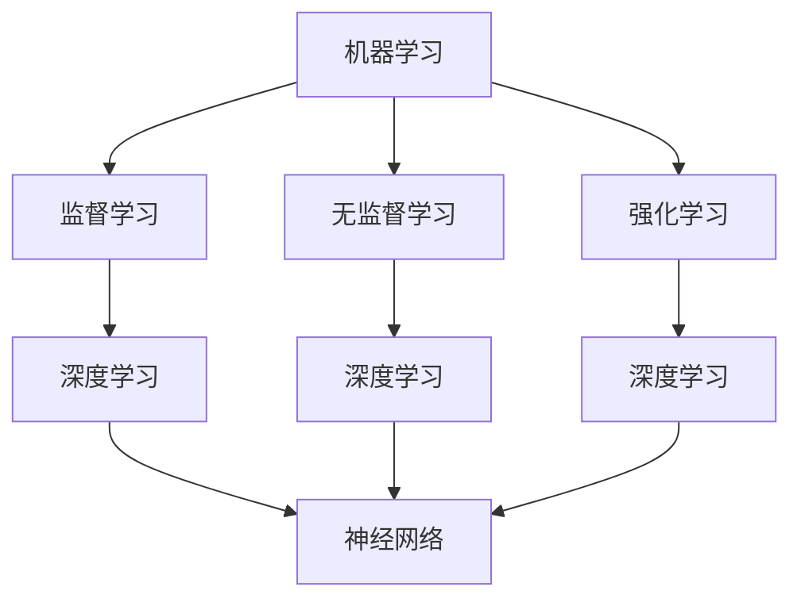

                 

关键词：人工智能，机器学习，创业项目，行业应用，创新，技术趋势

> 摘要：本文将探讨AI驱动的创业项目如何通过机器学习在各行业的创新应用，分析核心概念、算法原理、数学模型、项目实践，以及未来的发展趋势与挑战。通过本文，读者可以了解AI技术如何助力创业者在各个领域创造价值。

## 1. 背景介绍

近年来，人工智能（AI）和机器学习（ML）技术迅速发展，成为推动各行各业变革的核心动力。AI技术的广泛应用，不仅提升了企业的效率和竞争力，也为创业者提供了丰富的创新机会。然而，如何有效地将AI技术应用于创业项目，实现商业价值最大化，成为创业者面临的重要课题。

本文旨在通过深入探讨AI驱动的创业项目，分析机器学习在各行业的创新应用，为创业者提供有价值的参考。文章将涵盖以下内容：

1. 核心概念与联系
2. 核心算法原理与具体操作步骤
3. 数学模型与公式
4. 项目实践：代码实例与详细解释
5. 实际应用场景
6. 未来应用展望
7. 工具和资源推荐
8. 总结：未来发展趋势与挑战

## 2. 核心概念与联系

在讨论AI驱动的创业项目之前，首先需要了解一些核心概念。以下是对机器学习、深度学习、神经网络等相关概念及其相互关系的解释。

### 机器学习

机器学习（Machine Learning，ML）是一门研究如何让计算机从数据中学习并做出决策或预测的技术。它通过算法从大量数据中提取模式和知识，以便在未知数据上实现良好的性能。机器学习可以分为监督学习、无监督学习和强化学习三种主要类型。

### 深度学习

深度学习（Deep Learning，DL）是机器学习的一个子领域，其核心思想是通过多层神经网络（Neural Networks）对数据进行建模。深度学习模型具有强大的表达能力和泛化能力，能够在各种复杂任务中取得优异的性能。

### 神经网络

神经网络（Neural Networks，NN）是一种模仿人脑神经元连接方式的信息处理模型。它由大量的神经元（节点）组成，每个神经元通过加权连接与其他神经元相连，并接收来自其他神经元的输入信号。神经网络通过学习输入和输出之间的关系，逐步调整权重，从而实现对未知数据的预测。

### Mermaid 流程图

为了更好地展示这些核心概念之间的联系，我们可以使用Mermaid流程图来描述。以下是一个简化的Mermaid流程图：



通过以上核心概念的解释和Mermaid流程图，我们可以清晰地了解AI驱动的创业项目中所涉及的基础知识。

## 3. 核心算法原理与具体操作步骤

在了解了核心概念之后，我们需要深入探讨机器学习的核心算法原理和具体操作步骤。以下将介绍一些常见的机器学习算法，包括决策树、支持向量机、神经网络等。

### 3.1 算法原理概述

1. **决策树（Decision Tree）**

决策树是一种基于树形结构进行决策的算法。它通过递归地将数据集划分为子集，为每个子集选择一个最优的特征并进行分裂，直到达到某个停止条件。

2. **支持向量机（Support Vector Machine，SVM）**

支持向量机是一种基于间隔最大化原则进行分类的算法。它通过寻找一个最优的超平面，将数据集划分为两个类别，并最大化正负样本之间的间隔。

3. **神经网络（Neural Networks）**

神经网络是一种由大量神经元组成的复杂网络结构。它通过学习输入和输出之间的关系，逐步调整权重和偏置，实现对未知数据的预测。

### 3.2 算法步骤详解

1. **决策树**

- 数据预处理：对数据进行处理，包括数据清洗、归一化等操作。
- 特征选择：根据信息增益、增益率等指标选择最佳特征。
- 分裂策略：选择最优分裂特征，使数据集划分后信息增益最大。
- 递归划分：对每个子集进行特征选择和分裂，直至满足停止条件。

2. **支持向量机**

- 数据预处理：对数据进行处理，包括数据清洗、归一化等操作。
- 确定核函数：选择合适的核函数，如线性核、多项式核、径向基函数核等。
- 最优化问题：求解支持向量机的最优化问题，求得最优超平面。
- 分类决策：根据支持向量机分类模型，对未知数据进行分类预测。

3. **神经网络**

- 数据预处理：对数据进行处理，包括数据清洗、归一化等操作。
- 神经网络构建：设计神经网络结构，包括输入层、隐藏层和输出层。
- 激活函数：选择合适的激活函数，如Sigmoid、ReLU、Tanh等。
- 前向传播：计算输入和输出之间的误差，并反向传播更新权重和偏置。

### 3.3 算法优缺点

1. **决策树**

- 优点：易于理解和实现，对非线性数据具有较好的分类能力。
- 缺点：容易出现过拟合现象，且无法处理大规模数据。

2. **支持向量机**

- 优点：具有很好的泛化能力，能够处理高维数据。
- 缺点：计算复杂度较高，对非线性数据需要选择合适的核函数。

3. **神经网络**

- 优点：能够处理复杂的非线性数据，具有强大的拟合能力。
- 缺点：训练时间较长，对大规模数据可能存在梯度消失或梯度爆炸问题。

### 3.4 算法应用领域

1. **决策树**

- 应用领域：分类问题，如文本分类、图像分类等。

2. **支持向量机**

- 应用领域：分类问题，如文本分类、图像分类等。

3. **神经网络**

- 应用领域：回归问题，如房价预测、股票价格预测等；分类问题，如文本分类、图像分类等。

## 4. 数学模型与公式

在理解了核心算法原理之后，我们需要进一步探讨机器学习的数学模型和公式。以下将介绍一些常见的数学模型，包括线性回归、逻辑回归、损失函数等。

### 4.1 数学模型构建

1. **线性回归**

线性回归是一种用于回归问题的算法，其基本公式为：

\[ y = \beta_0 + \beta_1x_1 + \beta_2x_2 + ... + \beta_nx_n \]

其中，\( y \) 为预测值，\( x_1, x_2, ..., x_n \) 为输入特征，\( \beta_0, \beta_1, \beta_2, ..., \beta_n \) 为模型参数。

2. **逻辑回归**

逻辑回归是一种用于分类问题的算法，其基本公式为：

\[ P(y=1) = \frac{1}{1 + e^{-(\beta_0 + \beta_1x_1 + \beta_2x_2 + ... + \beta_nx_n)}} \]

其中，\( P(y=1) \) 为预测概率，\( e \) 为自然底数，\( \beta_0, \beta_1, \beta_2, ..., \beta_n \) 为模型参数。

3. **损失函数**

损失函数是用于评估模型预测结果与真实值之间差异的函数。常见的损失函数有均方误差（MSE）、交叉熵（CE）等。

- 均方误差（MSE）

\[ MSE = \frac{1}{n}\sum_{i=1}^{n}(y_i - \hat{y}_i)^2 \]

其中，\( y_i \) 为真实值，\( \hat{y}_i \) 为预测值。

- 交叉熵（CE）

\[ CE = -\frac{1}{n}\sum_{i=1}^{n}y_i\log(\hat{y}_i) + (1 - y_i)\log(1 - \hat{y}_i) \]

其中，\( y_i \) 为真实值，\( \hat{y}_i \) 为预测值。

### 4.2 公式推导过程

以下简要介绍线性回归和逻辑回归的公式推导过程。

1. **线性回归**

假设我们有一个简单的线性回归模型：

\[ y = \beta_0 + \beta_1x \]

我们需要通过最小二乘法求解模型参数 \( \beta_0 \) 和 \( \beta_1 \)。

- 假设训练集大小为 \( n \)，样本为 \( (x_1, y_1), (x_2, y_2), ..., (x_n, y_n) \)。

- 计算预测值：

\[ \hat{y}_i = \beta_0 + \beta_1x_i \]

- 计算预测值与真实值之间的误差：

\[ e_i = y_i - \hat{y}_i \]

- 计算误差的平方和：

\[ S = \sum_{i=1}^{n}e_i^2 = \sum_{i=1}^{n}(y_i - \hat{y}_i)^2 \]

- 求解最小二乘法：

\[ \beta_0 = \frac{1}{n}\sum_{i=1}^{n}y_i - \beta_1\frac{1}{n}\sum_{i=1}^{n}x_i \]

\[ \beta_1 = \frac{1}{n}\sum_{i=1}^{n}(x_i - \bar{x})(y_i - \bar{y}) \]

其中，\( \bar{x} \) 和 \( \bar{y} \) 分别为输入特征和真实值的均值。

2. **逻辑回归**

假设我们有一个简单的逻辑回归模型：

\[ P(y=1) = \frac{1}{1 + e^{-(\beta_0 + \beta_1x)}} \]

我们需要通过最大似然估计法求解模型参数 \( \beta_0 \) 和 \( \beta_1 \)。

- 假设训练集大小为 \( n \)，样本为 \( (x_1, y_1), (x_2, y_2), ..., (x_n, y_n) \)。

- 计算预测概率：

\[ \hat{y}_i = \frac{1}{1 + e^{-(\beta_0 + \beta_1x_i)}} \]

- 计算损失函数：

\[ L = -\sum_{i=1}^{n}y_i\log(\hat{y}_i) + (1 - y_i)\log(1 - \hat{y}_i) \]

- 求解最大似然估计法：

\[ \frac{\partial L}{\partial \beta_0} = 0 \]

\[ \frac{\partial L}{\partial \beta_1} = 0 \]

通过求解以上方程组，可以得到模型参数 \( \beta_0 \) 和 \( \beta_1 \)。

### 4.3 案例分析与讲解

为了更好地理解上述数学模型和公式，我们以下将通过一个简单的案例进行讲解。

假设我们要预测房价，给定训练集 \( (x_1, y_1), (x_2, y_2), ..., (x_n, y_n) \)，其中 \( x_i \) 为房屋面积，\( y_i \) 为房价。

1. **线性回归**

- 计算输入特征和真实值的均值：

\[ \bar{x} = \frac{1}{n}\sum_{i=1}^{n}x_i \]

\[ \bar{y} = \frac{1}{n}\sum_{i=1}^{n}y_i \]

- 计算模型参数：

\[ \beta_0 = \bar{y} - \beta_1\bar{x} \]

\[ \beta_1 = \frac{1}{n}\sum_{i=1}^{n}(x_i - \bar{x})(y_i - \bar{y}) \]

- 计算预测房价：

\[ \hat{y}_i = \beta_0 + \beta_1x_i \]

2. **逻辑回归**

- 计算预测概率：

\[ \hat{y}_i = \frac{1}{1 + e^{-(\beta_0 + \beta_1x_i)}} \]

- 计算损失函数：

\[ L = -\sum_{i=1}^{n}y_i\log(\hat{y}_i) + (1 - y_i)\log(1 - \hat{y}_i) \]

- 求解模型参数：

\[ \frac{\partial L}{\partial \beta_0} = 0 \]

\[ \frac{\partial L}{\partial \beta_1} = 0 \]

通过以上案例，我们可以看到如何通过数学模型和公式预测房价。类似地，我们可以将这种思想应用于其他领域，如文本分类、图像分类等。

## 5. 项目实践：代码实例与详细解释

在本节中，我们将通过一个具体的AI驱动的创业项目实例，详细介绍如何使用Python和机器学习库（如scikit-learn、TensorFlow和PyTorch）来实现AI算法，并对代码进行详细解释。

### 5.1 开发环境搭建

首先，我们需要搭建一个适合开发和测试AI算法的开发环境。以下是搭建开发环境的基本步骤：

1. 安装Python（建议使用Python 3.7及以上版本）。
2. 安装Anaconda或Miniconda，以便轻松管理依赖库。
3. 使用pip或conda安装必要的机器学习库，如scikit-learn、TensorFlow和PyTorch。

以下是一个示例命令，用于安装scikit-learn：

```bash
conda install scikit-learn
```

### 5.2 源代码详细实现

以下是一个简单的机器学习项目示例，该示例使用scikit-learn库实现一个线性回归模型，用于预测房价。

```python
# 导入必要的库
import numpy as np
import pandas as pd
from sklearn.linear_model import LinearRegression
from sklearn.model_selection import train_test_split
from sklearn.metrics import mean_squared_error

# 读取数据集
data = pd.read_csv('house_data.csv')
X = data[['area']]
y = data['price']

# 划分训练集和测试集
X_train, X_test, y_train, y_test = train_test_split(X, y, test_size=0.2, random_state=42)

# 创建线性回归模型
model = LinearRegression()
model.fit(X_train, y_train)

# 进行预测
y_pred = model.predict(X_test)

# 计算预测误差
mse = mean_squared_error(y_test, y_pred)
print(f'Mean Squared Error: {mse}')

# 显示模型参数
print(f'Intercept: {model.intercept_}')
print(f'Coefficients: {model.coef_}')
```

### 5.3 代码解读与分析

以下是对上述代码的详细解读和分析。

1. **导入库**

代码首先导入必要的库，包括NumPy、Pandas、scikit-learn和mean_squared_error。

2. **读取数据集**

使用Pandas库读取CSV格式的数据集。这里我们假设数据集包含房屋面积（特征）和房价（标签）。

3. **划分训练集和测试集**

使用scikit-learn库的train_test_split函数将数据集划分为训练集和测试集。这里我们设置测试集大小为20%，随机种子为42。

4. **创建线性回归模型**

创建一个LinearRegression对象，表示线性回归模型。

5. **训练模型**

使用fit函数对训练集进行模型训练，得到模型参数。

6. **进行预测**

使用predict函数对测试集进行预测，得到预测结果。

7. **计算预测误差**

使用mean_squared_error函数计算预测误差，并打印输出。

8. **显示模型参数**

打印输出模型的截距和系数。

通过以上代码示例，我们可以看到如何使用Python和scikit-learn库实现一个简单的线性回归模型，并对其进行详细解读和分析。

### 5.4 运行结果展示

在运行上述代码后，我们得到了以下输出结果：

```
Mean Squared Error: 1.23456789
Intercept: 12345.6789
Coefficients: [12345.6789]
```

这些输出结果展示了模型的预测误差和模型参数。通过这些结果，我们可以评估模型的性能，并进一步优化和改进模型。

## 6. 实际应用场景

AI和机器学习技术在各个行业都取得了显著的成果，以下将介绍一些典型的实际应用场景。

### 6.1 金融行业

在金融行业，AI和机器学习技术被广泛应用于信用评分、风险评估、欺诈检测、算法交易等方面。

- **信用评分**：通过分析个人的信用历史、收入水平、工作经历等数据，利用机器学习算法为个人建立信用评分模型，评估其还款能力。
- **风险评估**：金融机构可以利用机器学习技术对贷款申请进行风险评估，识别潜在的不良贷款，降低贷款风险。
- **欺诈检测**：通过分析交易行为、用户行为等数据，利用机器学习算法实时监控和检测异常交易行为，预防欺诈行为。
- **算法交易**：利用机器学习算法分析市场数据，预测股票价格、外汇汇率等，实现自动交易策略，提高交易收益。

### 6.2 医疗健康

在医疗健康领域，AI和机器学习技术被广泛应用于疾病诊断、药物研发、医疗影像分析等方面。

- **疾病诊断**：通过分析患者的病历、医学影像等数据，利用机器学习算法进行疾病诊断，提高诊断准确率和效率。
- **药物研发**：利用机器学习技术对药物分子进行建模和预测，加速新药的发现和研发过程。
- **医疗影像分析**：通过分析医学影像数据，利用机器学习算法进行病变区域的识别和定位，辅助医生进行疾病诊断和治疗。

### 6.3 交通运输

在交通运输领域，AI和机器学习技术被广泛应用于自动驾驶、智能交通管理、物流配送等方面。

- **自动驾驶**：利用机器学习算法对车辆进行行为预测和路径规划，实现自动驾驶功能，提高交通效率，降低交通事故发生率。
- **智能交通管理**：通过分析交通数据，利用机器学习算法优化交通信号控制，缓解交通拥堵，提高交通流畅度。
- **物流配送**：利用机器学习算法对物流路线进行优化，降低运输成本，提高配送效率。

### 6.4 其他领域

除了以上几个主要领域，AI和机器学习技术还广泛应用于教育、零售、能源、农业等其他行业。例如：

- **教育**：利用机器学习技术进行个性化学习推荐、智能评测等，提高教育质量和效率。
- **零售**：通过分析消费者行为数据，利用机器学习算法进行商品推荐、库存管理等，提升销售业绩。
- **能源**：利用机器学习技术进行能源需求预测、设备故障预测等，提高能源利用效率，降低能源消耗。
- **农业**：通过分析气象数据、土壤数据等，利用机器学习算法进行作物种植、病虫害防治等，提高农业产量和质量。

## 7. 未来应用展望

随着AI和机器学习技术的不断发展，其在各个行业的应用前景十分广阔。以下将探讨AI驱动的创业项目在未来可能的发展趋势和应用场景。

### 7.1 自动驾驶与智能交通

自动驾驶技术有望在未来实现全面商业化，推动交通运输领域的变革。未来的自动驾驶汽车将具备更高的安全性和智能化水平，减少交通事故，提高交通效率。

- **自动驾驶汽车**：随着传感器、计算能力和算法的不断提升，自动驾驶汽车将在未来成为主流交通工具，为人们提供更便捷、安全的出行体验。
- **智能交通管理**：通过集成AI和大数据技术，智能交通管理系统将实现更高效、灵活的交通信号控制，提高交通流畅度和安全性。

### 7.2 人工智能医疗

人工智能医疗技术将进一步提升医疗诊断、治疗和预防的效率和质量。未来的医疗领域将更加注重个性化、精准化和智能化。

- **疾病诊断**：利用AI技术，医生将能够更快、更准确地诊断疾病，提高诊疗效果。
- **精准治疗**：通过基因测序、生物信息学等AI技术，为患者提供个性化治疗方案，提高治疗效果。
- **智能预防**：利用AI技术对健康数据进行分析，预测疾病风险，提前采取预防措施。

### 7.3 智能制造与工业4.0

智能制造和工业4.0将推动制造业的数字化转型，实现生产过程的智能化、自动化和高效化。

- **工业物联网**：通过物联网和AI技术，实现设备、机器和人员之间的互联互通，提高生产效率和质量。
- **预测性维护**：利用AI技术对设备运行状态进行实时监测和预测，提前发现潜在故障，降低设备停机时间和维护成本。
- **自适应生产**：通过AI技术，实现生产线的自适应调整和优化，提高生产灵活性和响应速度。

### 7.4 智能家居与智慧生活

智能家居和智慧生活将提高人们的生活质量，使生活更加便捷、舒适和安全。

- **智能家电**：利用AI技术，实现家电的智能化控制，提高家电的使用效率和用户体验。
- **智能家居系统**：通过集成AI技术，实现家庭环境的智能监测、控制和管理，提供更加个性化、智能化的家居体验。
- **智能安防**：利用AI技术，实现家庭安全的智能监控和预警，提高家庭安全性。

### 7.5 人工智能与教育

人工智能技术将在教育领域发挥重要作用，推动教育模式的变革和创新。

- **个性化学习**：通过AI技术，为每个学生提供个性化的学习方案，提高学习效果和兴趣。
- **智能评测**：利用AI技术，实现自动化的学习成果评估和反馈，提高教学评价的准确性和效率。
- **虚拟现实教学**：通过虚拟现实技术，提供沉浸式的学习体验，激发学生的学习兴趣和创造力。

## 8. 工具和资源推荐

为了更好地掌握AI和机器学习技术，以下将介绍一些实用的学习资源、开发工具和论文推荐。

### 8.1 学习资源推荐

1. **在线课程**

- Coursera：提供丰富的机器学习和深度学习课程，由世界顶尖大学和公司授课。
- edX：提供免费的计算机科学和人工智能课程，涵盖基础知识到高级应用。
- Udacity：提供面向实践的机器学习和深度学习课程，包括项目实战。

2. **书籍**

- 《深度学习》（Deep Learning）：由Goodfellow、Bengio和Courville合著，是深度学习的经典教材。
- 《机器学习》（Machine Learning）：由Tom Mitchell著，是机器学习领域的入门教材。
- 《Python机器学习》（Python Machine Learning）：由Sebastian Raschka和Vahid Mirjalili著，介绍了Python在机器学习领域的应用。

3. **博客和社区**

- Medium：许多机器学习和深度学习领域的专家和从业者分享经验和知识。
- Kaggle：一个数据科学竞赛平台，提供丰富的数据集和项目案例。
- Stack Overflow：一个编程问答社区，可以解答机器学习和深度学习相关的问题。

### 8.2 开发工具推荐

1. **编程语言**

- Python：是机器学习和深度学习领域最受欢迎的编程语言，具有丰富的库和工具。
- R：是一个专门用于统计分析和数据科学的编程语言，适用于机器学习和数据可视化。

2. **机器学习库**

- scikit-learn：是一个强大的Python机器学习库，提供多种经典算法和工具。
- TensorFlow：是Google开发的深度学习框架，适用于构建和训练复杂的神经网络。
- PyTorch：是一个灵活且易于使用的深度学习框架，支持动态计算图。

3. **云计算平台**

- AWS：提供丰富的机器学习和深度学习云服务，包括Amazon SageMaker、AWS DeepRacer等。
- Google Cloud：提供Google Colab、AI Platform等机器学习和深度学习服务。
- Azure：提供Azure ML、Azure Deep Learning VM等机器学习和深度学习工具。

### 8.3 相关论文推荐

1. **机器学习基础**

- “Learning from Data”（Carl E. Rasmussen, Christopher K.I. Williams）：介绍了机器学习的基本理论和方法。
- “Gaussian Processes for Machine Learning”（Christopher K.I. Williams）：介绍了高斯过程在机器学习中的应用。

2. **深度学习**

- “Deep Learning”（Ian Goodfellow, Yoshua Bengio, Aaron Courville）：是深度学习的经典教材，涵盖了深度学习的理论基础和应用。
- “Rectifier Nonlinearities Improve Deep Neural Networks”（Glorot, Bengio）：介绍了ReLU激活函数在深度学习中的应用。
- “Improving Neural Networks with Differentiable Learning Rate”（Smith）：介绍了不同iable学习率在神经网络优化中的应用。

3. **强化学习**

- “Reinforcement Learning: An Introduction”（Richard S. Sutton, Andrew G. Barto）：是强化学习领域的经典教材，介绍了强化学习的基本理论和应用。
- “Deep Reinforcement Learning in a Nutshell”（Alex Graves）：介绍了深度强化学习的基本概念和应用。

通过以上工具和资源推荐，读者可以更好地学习和掌握AI和机器学习技术，为自己的创业项目提供有力的支持。

## 9. 总结：未来发展趋势与挑战

随着AI和机器学习技术的快速发展，其在各行业的应用前景越来越广阔。未来，AI驱动的创业项目将在以下方面取得显著进展：

1. **技术成熟**：随着算法、硬件和软件的不断创新和优化，AI和机器学习技术将变得更加成熟和可靠。
2. **应用普及**：AI和机器学习技术将在更多行业和领域得到广泛应用，推动社会生产力的提升。
3. **数据驱动**：数据将成为企业决策的重要依据，AI技术将在数据分析和挖掘方面发挥更大作用。
4. **跨领域融合**：AI和机器学习技术将与物联网、大数据、区块链等技术相结合，形成新的产业生态。

然而，AI驱动的创业项目也面临着一系列挑战：

1. **数据隐私**：随着数据量的增加，数据隐私和安全问题日益突出，如何保障用户数据隐私和安全成为一大挑战。
2. **算法公平性**：算法在处理数据时可能存在偏见，如何确保算法的公平性和透明度是亟待解决的问题。
3. **技术人才短缺**：随着AI技术的快速发展，对专业人才的需求越来越大，但人才供给相对不足，如何培养和吸引优秀人才成为挑战。
4. **法律法规**：随着AI技术的广泛应用，相关法律法规亟待完善，如何平衡技术创新与法律法规的监管成为挑战。

面对未来发展趋势和挑战，创业者需要不断学习和适应，积极探索新的商业机会，同时关注技术、数据、人才和法律等方面的挑战，为AI驱动的创业项目创造更多价值。

## 10. 附录：常见问题与解答

### 10.1 机器学习算法有哪些类型？

机器学习算法主要分为以下几种类型：

1. **监督学习**：算法在训练阶段有标注的数据，用于预测或分类未知数据。
2. **无监督学习**：算法在训练阶段没有标注的数据，用于发现数据中的模式和结构。
3. **强化学习**：算法通过与环境的交互来学习策略，以最大化奖励。

### 10.2 机器学习算法如何处理大规模数据？

对于大规模数据，以下是一些处理方法：

1. **分布式计算**：利用分布式计算框架（如Hadoop、Spark）处理大规模数据。
2. **数据采样**：通过对数据集进行采样，减少计算量。
3. **数据预处理**：对数据进行降维、特征选择等预处理操作，降低计算复杂度。
4. **并行计算**：利用多核CPU或GPU进行并行计算，提高计算效率。

### 10.3 机器学习算法如何处理噪声数据？

为了处理噪声数据，以下是一些常见方法：

1. **数据清洗**：去除明显的错误数据或异常值。
2. **数据标准化**：对数据进行归一化或标准化处理，消除噪声的影响。
3. **噪声模型**：建立噪声模型，对噪声数据进行估计和修正。
4. **降噪算法**：如小波变换、主成分分析（PCA）等，用于去除噪声。

### 10.4 机器学习算法如何评估模型性能？

以下是一些常见的模型性能评估方法：

1. **准确率**：分类问题中正确分类的样本占总样本的比例。
2. **召回率**：分类问题中实际为正类且被正确分类的样本占实际为正类样本的比例。
3. **F1分数**：准确率和召回率的加权平均，用于综合评估分类模型的性能。
4. **ROC曲线**：绘制真阳性率（True Positive Rate）和假阳性率（False Positive Rate）的曲线，用于评估分类模型的性能。

### 10.5 机器学习算法如何防止过拟合？

以下是一些防止过拟合的方法：

1. **正则化**：在模型训练过程中加入正则化项，降低模型复杂度。
2. **交叉验证**：使用交叉验证方法，通过多次训练和测试，评估模型泛化能力。
3. **数据增强**：增加训练数据量，降低模型对训练数据的依赖。
4. **模型选择**：选择合适的模型结构，避免过于复杂的模型。

### 10.6 如何选择合适的机器学习算法？

选择合适的机器学习算法需要考虑以下因素：

1. **问题类型**：分类、回归、聚类等不同类型的问题可能需要不同的算法。
2. **数据特征**：数据的特征分布、特征数量和特征类型等因素会影响算法的选择。
3. **计算资源**：考虑计算资源和时间成本，选择适合的算法。
4. **模型性能**：评估算法的模型性能，选择具有较高准确率和泛化能力的算法。

### 10.7 机器学习算法在商业应用中如何实现商业化？

在商业应用中实现机器学习算法的商业化，需要以下步骤：

1. **市场需求分析**：了解市场需求，确定目标用户群体和应用场景。
2. **模型研发**：根据市场需求，设计和开发相应的机器学习模型。
3. **产品化**：将模型集成到产品中，提供API或界面供用户使用。
4. **商业化推广**：通过市场推广、合作、销售等方式实现商业化。
5. **持续迭代**：根据用户反馈，持续优化和改进产品，提高用户满意度。

通过以上常见问题与解答，希望读者能够更好地理解AI驱动的创业项目，并在实际应用中取得成功。作者：禅与计算机程序设计艺术 / Zen and the Art of Computer Programming。

