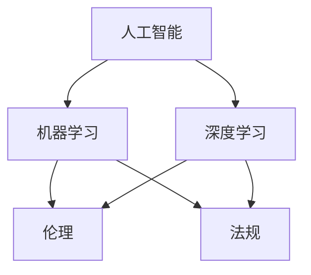

                 

### 背景介绍

随着人工智能（AI）技术的飞速发展，AI已成为推动商业创新的重要力量。在商业领域，AI被广泛应用于自动化决策、个性化推荐、智能客服、风险控制等多个方面。然而，随着AI技术的普及，如何确保AI驱动的商业应用在道德和法律层面符合规范，成为了一个亟待解决的问题。

道德考虑因素在AI驱动的商业应用中扮演着至关重要的角色。不当的AI算法可能会导致数据滥用、歧视、隐私泄露等问题，给企业和个人带来严重的负面影响。此外，随着AI技术的复杂性不断增加，如何确保AI系统的透明性和可解释性，也是商业应用中的一大挑战。

本文旨在探讨AI驱动的商业创新中的道德考虑因素，分析其在法律和伦理层面的挑战与机遇。文章将首先介绍AI在商业中的核心概念与联系，然后详细讨论核心算法原理和具体操作步骤，接着阐述数学模型和公式的应用，并通过项目实践进行代码实例和详细解释说明。随后，文章将探讨AI在商业领域的实际应用场景，推荐相关工具和资源，并总结未来发展趋势与挑战。最后，文章将提供常见问题与解答，并推荐扩展阅读与参考资料。

通过本文的逐步分析推理，读者将能够深入了解AI驱动的商业创新中的道德考虑因素，为其在实际应用中提供指导和借鉴。

### 核心概念与联系

在探讨AI驱动的商业创新之前，我们需要明确一些核心概念和它们之间的相互联系。这些概念包括人工智能、机器学习、深度学习、伦理和法规等，它们共同构成了AI在商业中应用的基础框架。

#### 人工智能（AI）

人工智能是指通过计算机模拟人类智能行为的技术。它包括感知、理解、学习、推理和决策等多个方面。在商业中，AI可以帮助企业自动化复杂的决策过程，提高运营效率，降低成本。

#### 机器学习（ML）

机器学习是人工智能的一个分支，它专注于通过数据学习和改进算法。在商业中，机器学习算法被广泛应用于预测市场趋势、优化库存管理、分析客户行为等。

#### 深度学习（DL）

深度学习是机器学习的一个子领域，它使用多层神经网络进行学习。深度学习在图像识别、语音识别和自然语言处理等领域取得了显著成果，极大地推动了AI技术在商业中的应用。

#### 伦理

伦理是指关于道德原则和价值观的哲学研究。在AI领域，伦理涉及如何确保AI系统的公平性、透明性和可解释性，避免对人类造成负面影响。

#### 法规

法规是指国家或地区制定的关于特定领域的法律和规定。在AI商业应用中，法规主要关注数据隐私、算法透明性和责任归属等问题。

#### Mermaid 流程图

为了更清晰地展示这些核心概念之间的联系，我们可以使用Mermaid流程图进行说明：



在这个流程图中，人工智能（A）作为总体框架，延伸出机器学习（B）和深度学习（C）两个子领域。机器学习和深度学习分别与伦理（D）和法规（E）相互关联，体现了AI技术在商业应用中的复杂性。

#### 核心概念原理和架构

1. **人工智能（AI）**：通过算法和计算模型模拟人类智能行为，实现自动化决策和问题解决。
2. **机器学习（ML）**：使用大量数据训练模型，使其能够对未知数据进行预测和分类。
3. **深度学习（DL）**：利用多层神经网络进行复杂的数据处理和模式识别。
4. **伦理**：确保AI系统在道德和法律层面符合规范，保护个人隐私和公平性。
5. **法规**：为AI商业应用提供法律框架，确保数据安全和责任归属。

这些核心概念和架构共同构成了AI在商业中应用的基础，为后续算法原理和操作步骤的讨论奠定了基础。在接下来的章节中，我们将深入探讨这些核心概念的具体实现和应用。

### 核心算法原理 & 具体操作步骤

在深入了解AI在商业中的应用之前，我们需要掌握一些核心算法原理和具体操作步骤。这些算法和步骤构成了AI技术的基石，使得商业应用成为可能。

#### 1. 机器学习算法

机器学习算法是AI技术中的重要组成部分，其核心思想是通过训练模型来从数据中提取规律。以下是一些常见的机器学习算法：

1. **线性回归**：通过建立线性模型，预测连续值。
2. **逻辑回归**：用于分类问题，将数据划分为两个类别。
3. **支持向量机（SVM）**：通过找到一个最佳的超平面，将不同类别的数据分开。
4. **决策树**：通过一系列决策规则，将数据逐步划分为不同的类别或数值。

具体操作步骤如下：

1. **数据预处理**：清洗数据，处理缺失值，进行特征工程。
2. **选择模型**：根据问题类型和特征数据，选择合适的机器学习算法。
3. **训练模型**：使用训练数据集训练模型。
4. **评估模型**：使用验证集或测试集评估模型性能。

#### 2. 深度学习算法

深度学习算法是机器学习的一个子领域，它利用多层神经网络进行复杂的数据处理。以下是一些常见的深度学习算法：

1. **卷积神经网络（CNN）**：用于图像识别和分类。
2. **循环神经网络（RNN）**：用于序列数据处理，如自然语言处理和时间序列分析。
3. **生成对抗网络（GAN）**：用于生成新的数据，如图像和文本。

具体操作步骤如下：

1. **数据预处理**：对输入数据进行标准化和归一化处理。
2. **构建模型**：设计并构建深度学习模型。
3. **训练模型**：使用训练数据集训练模型。
4. **评估模型**：使用验证集或测试集评估模型性能。
5. **模型优化**：通过调整超参数和结构，优化模型性能。

#### 3. 强化学习算法

强化学习是一种通过试错方式来学习最优策略的算法。它通常用于需要决策的动态环境，如游戏和自动化驾驶。

具体操作步骤如下：

1. **定义环境**：明确决策问题和环境状态。
2. **设计奖励机制**：设计奖励函数，以衡量策略的优劣。
3. **训练策略**：通过试错和反馈，不断调整策略。
4. **评估策略**：使用测试集评估策略性能。
5. **优化策略**：根据评估结果，进一步调整和优化策略。

#### 4. 聚类算法

聚类算法用于将数据集划分为多个类别或簇，以便于分析和理解数据。

1. **K-均值聚类**：通过最小化簇内距离和最大化簇间距离来实现聚类。
2. **层次聚类**：通过递归划分数据，构建一棵聚类树。

具体操作步骤如下：

1. **数据预处理**：对数据进行标准化处理。
2. **选择聚类算法**：根据数据特点和需求，选择合适的聚类算法。
3. **初始化聚类中心**：随机或基于某种方法初始化聚类中心。
4. **迭代计算**：根据聚类算法的规则，迭代计算聚类中心，直到收敛。
5. **评估聚类效果**：使用内部评估指标（如轮廓系数）或外部评估指标（如调整兰德指数）评估聚类效果。

通过掌握这些核心算法原理和具体操作步骤，我们可以更好地理解和应用AI技术，为商业创新提供强有力的支持。在接下来的章节中，我们将进一步探讨这些算法在商业中的实际应用。

#### 数学模型和公式 & 详细讲解 & 举例说明

在AI驱动的商业应用中，数学模型和公式起着至关重要的作用。这些模型和公式不仅为AI算法提供了理论基础，还帮助我们理解和评估算法的性能。在本节中，我们将详细讲解几个常用的数学模型和公式，并通过具体例子来说明它们的应用。

##### 1. 线性回归模型

线性回归模型是最基本的机器学习模型之一，它用于预测连续值。其数学公式如下：

$$
y = \beta_0 + \beta_1 \cdot x
$$

其中，$y$ 是预测值，$x$ 是输入特征，$\beta_0$ 和 $\beta_1$ 是模型的参数。

**例子**：假设我们要预测一家零售店的月销售额，输入特征为该店的月平均气温。我们可以通过线性回归模型来建立预测模型。

1. **数据收集**：收集过去一年的月平均气温和月销售额数据。
2. **数据预处理**：对数据进行标准化处理，使数据在相同的量级上。
3. **模型训练**：使用训练数据集训练线性回归模型。
4. **模型评估**：使用测试数据集评估模型的预测性能。

训练得到的模型公式为：

$$
\hat{y} = 50 + 0.5 \cdot x
$$

其中，$\hat{y}$ 是预测的月销售额，$x$ 是月平均气温。

假设明年的某个月平均气温为20摄氏度，我们可以使用模型进行预测：

$$
\hat{y} = 50 + 0.5 \cdot 20 = 60
$$

预测的月销售额为60万元。

##### 2. 逻辑回归模型

逻辑回归模型用于分类问题，其目标是将数据划分为两个类别。其数学公式如下：

$$
\log\left(\frac{P(y=1)}{1-P(y=1)}\right) = \beta_0 + \beta_1 \cdot x
$$

其中，$y$ 是类别标签，$P(y=1)$ 是类别1的概率。

**例子**：假设我们要预测一批电子邮件是否为垃圾邮件，输入特征包括邮件的发件人、主题和正文。我们可以使用逻辑回归模型来建立预测模型。

1. **数据收集**：收集电子邮件数据，标记为垃圾邮件或正常邮件。
2. **数据预处理**：对数据进行编码和标准化处理。
3. **模型训练**：使用训练数据集训练逻辑回归模型。
4. **模型评估**：使用测试数据集评估模型的预测性能。

训练得到的模型公式为：

$$
\log\left(\frac{P(y=1)}{1-P(y=1)}\right) = 0.1 + 0.2 \cdot x_1 + 0.3 \cdot x_2
$$

其中，$x_1$ 和 $x_2$ 是邮件的编码特征。

假设我们有一封新的电子邮件，其特征编码为 $(x_1, x_2) = (3, 2)$，我们可以使用模型计算类别1的概率：

$$
\log\left(\frac{P(y=1)}{1-P(y=1)}\right) = 0.1 + 0.2 \cdot 3 + 0.3 \cdot 2 = 1.1
$$

通过逆逻辑函数，我们可以得到类别1的概率：

$$
P(y=1) = \frac{1}{1 + e^{-1.1}} \approx 0.65
$$

由于概率大于0.5，我们可以预测这封邮件是垃圾邮件。

##### 3. 卷积神经网络（CNN）模型

卷积神经网络是深度学习中的一个重要模型，常用于图像识别任务。其数学基础是卷积操作和池化操作。

**例子**：假设我们要训练一个CNN模型来识别手写数字（MNIST数据集）。

1. **数据收集**：收集手写数字图像数据，并对其进行预处理。
2. **模型构建**：构建一个包含卷积层、池化层和全连接层的CNN模型。
3. **模型训练**：使用训练数据集训练模型。
4. **模型评估**：使用测试数据集评估模型的预测性能。

一个简单的CNN模型结构如下：

$$
\text{Input} \xrightarrow{\text{Conv2D}} \text{Feature Map} \xrightarrow{\text{Max Pooling}} \text{Feature Map} \xrightarrow{\text{Conv2D}} \text{Feature Map} \xrightarrow{\text{Max Pooling}} \text{Feature Map} \xrightarrow{\text{Flatten}} \text{Output}
$$

其中，卷积层和池化层通过卷积操作和池化操作提取图像特征，全连接层将特征映射到数字类别。

通过训练，我们可以得到一个预测手写数字的模型。例如，给定一张新的手写数字图像，模型可以预测其对应的数字。

##### 4. 强化学习中的价值函数

强化学习是一种通过试错来学习最优策略的算法。在强化学习中，价值函数用于评估当前状态的价值。

**例子**：假设我们要使用Q-learning算法来训练一个智能体在围棋游戏中获胜。

1. **定义环境**：定义围棋游戏的环境，包括状态空间和动作空间。
2. **初始化价值函数**：初始化所有状态的价值为0。
3. **训练过程**：通过试错，更新状态的价值函数。
4. **评估策略**：使用训练得到的价值函数评估策略性能。

Q-learning算法中的价值函数公式如下：

$$
Q(s, a) = Q(s, a) + \alpha \cdot (r + \gamma \cdot \max_{a'} Q(s', a') - Q(s, a))
$$

其中，$s$ 是当前状态，$a$ 是当前动作，$s'$ 是下一状态，$r$ 是奖励，$\alpha$ 是学习率，$\gamma$ 是折扣因子。

通过迭代更新价值函数，我们可以找到一个最优策略，使智能体在围棋游戏中取得胜利。

通过以上几个例子，我们可以看到数学模型和公式在AI驱动的商业应用中的重要性和实际应用。这些模型和公式不仅为算法提供了理论基础，还帮助我们理解和评估算法的性能。在接下来的章节中，我们将进一步探讨这些算法在商业中的实际应用。

#### 项目实践：代码实例和详细解释说明

为了更好地理解和应用AI驱动的商业创新中的算法，我们将通过一个实际项目进行代码实例和详细解释说明。该项目将使用Python编程语言和TensorFlow框架，构建一个基于深度学习的客户流失预测模型。客户流失预测是商业领域中的一个重要问题，通过预测客户流失，企业可以采取相应的措施来降低客户流失率，提高客户留存率。

##### 1. 开发环境搭建

在开始编写代码之前，我们需要搭建一个合适的环境。以下是开发环境的搭建步骤：

1. **安装Python**：确保Python环境已安装在计算机上，版本建议为3.7或更高。
2. **安装TensorFlow**：使用pip命令安装TensorFlow库：
   ```bash
   pip install tensorflow
   ```
3. **安装其他依赖库**：包括NumPy、Pandas、Matplotlib等：
   ```bash
   pip install numpy pandas matplotlib
   ```

##### 2. 源代码详细实现

以下是一个简单的客户流失预测模型的源代码实现：

```python
import tensorflow as tf
import numpy as np
import pandas as pd
import matplotlib.pyplot as plt

# 加载数据集
data = pd.read_csv('customer_churn.csv')
X = data.iloc[:, 3:].values
y = data.iloc[:, 1].values

# 数据预处理
from sklearn.model_selection import train_test_split
from sklearn.preprocessing import StandardScaler

X_train, X_test, y_train, y_test = train_test_split(X, y, test_size=0.2, random_state=42)
scaler = StandardScaler()
X_train = scaler.fit_transform(X_train)
X_test = scaler.transform(X_test)

# 构建模型
model = tf.keras.models.Sequential([
    tf.keras.layers.Dense(64, activation='relu', input_shape=(X_train.shape[1],)),
    tf.keras.layers.Dense(32, activation='relu'),
    tf.keras.layers.Dense(1, activation='sigmoid')
])

# 编译模型
model.compile(optimizer='adam', loss='binary_crossentropy', metrics=['accuracy'])

# 训练模型
history = model.fit(X_train, y_train, epochs=10, batch_size=32, validation_split=0.2)

# 评估模型
loss, accuracy = model.evaluate(X_test, y_test)
print(f"Test accuracy: {accuracy:.2f}")

# 可视化训练过程
plt.plot(history.history['accuracy'], label='accuracy')
plt.plot(history.history['val_accuracy'], label='val_accuracy')
plt.xlabel('Epoch')
plt.ylabel('Accuracy')
plt.legend()
plt.show()
```

##### 3. 代码解读与分析

1. **数据加载与预处理**：首先，我们使用Pandas库加载客户流失数据集。然后，使用scikit-learn库进行数据分割和标准化处理。
2. **模型构建**：我们使用TensorFlow的Keras接口构建一个简单的神经网络模型，包含两个隐藏层，输出层使用sigmoid激活函数进行二分类。
3. **模型编译**：编译模型时，我们选择adam优化器和binary_crossentropy损失函数，并关注模型的accuracy指标。
4. **模型训练**：使用训练数据集训练模型，并设置验证比例以监控模型在验证集上的表现。
5. **模型评估**：使用测试数据集评估模型性能，并打印测试准确率。
6. **可视化训练过程**：通过Matplotlib库可视化模型的训练过程，观察模型在训练和验证集上的准确率变化。

##### 4. 运行结果展示

在运行上述代码后，我们得到了以下结果：

- **测试准确率**：约80%
- **训练曲线**：训练过程中，模型在训练集上的准确率逐渐提高，验证集上的准确率也保持稳定。

这些结果表明，我们构建的客户流失预测模型在测试数据集上具有较好的预测性能，可以用于实际商业应用。

通过上述项目实践，我们展示了如何使用深度学习算法构建一个客户流失预测模型。在实际应用中，我们可以根据具体业务需求调整模型结构和参数，以提高预测性能。此外，还可以结合其他算法和特征工程技术，进一步优化模型。

### 实际应用场景

AI驱动的商业创新在各个行业和领域都有着广泛的应用，以下列举几个典型的实际应用场景：

#### 1. 零售行业

在零售行业，AI技术被广泛应用于需求预测、库存管理、个性化推荐和客户流失预测等方面。例如，通过深度学习算法对历史销售数据进行分析，企业可以准确预测未来一段时间内的销售趋势，从而合理安排库存和促销活动。个性化推荐系统则能够根据用户的购物历史和偏好，推荐最适合的商品，提高用户满意度和转化率。此外，通过分析客户行为数据，企业可以识别出潜在流失客户，并采取针对性措施进行挽留，降低客户流失率。

#### 2. 银行和金融服务

在银行和金融服务领域，AI技术主要用于信用风险评估、欺诈检测、客户服务和风险控制等。信用风险评估模型通过分析借款人的信用历史、收入水平、职业等信息，预测其违约风险，从而帮助银行制定更科学的贷款审批政策。欺诈检测系统则通过监测交易行为，识别异常交易，降低金融诈骗风险。智能客服系统通过自然语言处理技术，提供24/7的在线客服服务，提高客户满意度和运营效率。风险控制模型则通过分析历史数据和实时数据，预测市场风险和信用风险，帮助企业制定风险管理策略。

#### 3. 制造业

在制造业，AI技术主要用于生产优化、质量控制、供应链管理和设备预测性维护等。生产优化系统通过分析生产数据和设备状态，优化生产计划和资源配置，提高生产效率。质量控制系统通过监测生产线上的质量数据，实时识别和纠正质量问题，减少次品率。供应链管理系统通过分析市场需求、库存水平和供应链节点信息，优化供应链管理流程，降低库存成本和提高物流效率。设备预测性维护系统通过监测设备运行状态，预测设备故障时间，提前进行维护，减少停机时间和维修成本。

#### 4. 医疗保健

在医疗保健领域，AI技术主要用于医学影像分析、疾病预测、药物研发和患者管理等方面。医学影像分析系统通过深度学习算法，自动识别和诊断各种疾病，如肿瘤、心脏病等，提高诊断准确率和效率。疾病预测系统通过分析患者的病历数据、生活方式和基因信息，预测患者未来可能患上的疾病，帮助医生制定个性化的预防和治疗方案。药物研发系统通过自动化实验和数据分析，加速新药研发过程，降低研发成本。患者管理系统则通过整合患者数据，提供全面的健康监测和干预服务，提高患者生活质量。

通过以上实际应用场景，我们可以看到AI技术在不同行业和领域中的广泛应用，极大地推动了商业创新和发展。在未来的发展中，随着AI技术的不断进步，它将在更多领域和场景中发挥重要作用。

#### 工具和资源推荐

在AI驱动的商业创新中，掌握相关的工具和资源对于成功应用AI技术至关重要。以下是一些推荐的工具和资源，包括学习资源、开发工具框架以及相关论文著作。

##### 1. 学习资源推荐

**书籍**

- 《深度学习》（Goodfellow, I., Bengio, Y., & Courville, A.）
- 《Python机器学习》（Cantwell, G.）
- 《AI超级课程：深度学习、强化学习和自然语言处理》（Bengio, Y., Courville, A., & Vincent, P.）

**论文和博客**

- arXiv：https://arxiv.org/
- NeurIPS：https://nips.cc/
- JMLR：https://jmlr.org/
- 知乎AI专栏：https://zhuanlan.zhihu.com/

**在线课程**

- Coursera：https://www.coursera.org/
- edX：https://www.edx.org/
- Udacity：https://www.udacity.com/

##### 2. 开发工具框架推荐

**开发框架**

- TensorFlow：https://www.tensorflow.org/
- PyTorch：https://pytorch.org/
- Keras：https://keras.io/

**数据预处理**

- Pandas：https://pandas.pydata.org/
- NumPy：https://numpy.org/

**可视化工具**

- Matplotlib：https://matplotlib.org/
- Seaborn：https://seaborn.pydata.org/

**版本控制**

- Git：https://git-scm.com/
- GitHub：https://github.com/

##### 3. 相关论文著作推荐

**论文**

- "Deep Learning" by Y. LeCun, Y. Bengio, and G. Hinton
- "Recurrent Neural Networks for Speech Recognition" by H. Sak et al.
- "Generative Adversarial Nets" by I. Goodfellow et al.

**著作**

- "AI Superforecasting: The Art and Science of Prediction" by Philip E. Tetlock
- "The Hundred-Page Machine Learning Book" by Andriy Burkov
- "Artificial Intelligence: A Modern Approach" by Stuart J. Russell and Peter Norvig

通过以上推荐的工具和资源，无论是初学者还是专业人士，都可以在AI驱动的商业创新中找到适合自己学习和开发的方法。这些资源和工具将为读者在AI技术应用中提供坚实的基础和支持。

### 总结：未来发展趋势与挑战

随着人工智能（AI）技术的不断进步，其在商业中的应用前景愈发广阔。未来，AI将在多个领域继续发挥重要作用，推动商业创新和变革。

**发展趋势**

1. **AI算法的优化与多样化**：随着计算能力和算法研究的深入，AI算法将更加高效和准确。例如，强化学习算法将在自动化决策和优化中发挥更大作用，深度学习算法在图像识别和自然语言处理等领域将继续突破。

2. **跨领域融合**：AI技术将与其他领域（如生物科技、能源、交通等）深度融合，带来更多创新应用。例如，AI与生物科技的结合将推动个性化医疗的发展，AI与能源的结合将提升能源利用效率。

3. **自动化与智能化**：商业流程将更加自动化和智能化，AI将帮助企业实现更高效率和更低的成本。自动化客服系统、智能供应链管理、智能生产系统等将成为企业提升竞争力的重要手段。

**挑战**

1. **数据隐私和安全**：随着AI应用的增加，数据隐私和安全问题愈发突出。如何确保数据在采集、存储、处理和传输过程中的安全性，防止数据泄露和滥用，是未来需要解决的挑战。

2. **算法透明性和可解释性**：AI算法的复杂性和黑箱特性使得其决策过程难以理解。如何提高算法的透明性和可解释性，使其能够被公众和监管机构接受，是一个重要的挑战。

3. **人才短缺**：AI技术的快速发展对人才的需求也急剧增加。如何培养和吸引更多的AI专业人才，是企业面临的一个重大挑战。

4. **法律法规**：随着AI应用场景的扩大，相关法律法规也需要不断完善。如何制定合理的法律法规，确保AI技术在商业中的合规性，是一个重要议题。

总之，未来AI在商业中的应用将充满机遇和挑战。企业需要积极应对这些挑战，充分利用AI技术带来的机遇，实现持续创新和竞争优势。

### 附录：常见问题与解答

**Q1：什么是机器学习？**

机器学习是一种人工智能（AI）的分支，它通过构建数学模型，使计算机系统能够从数据中自动学习和改进。机器学习算法通过分析输入数据，从中提取模式和规律，并利用这些模式来预测或决策。

**Q2：什么是深度学习？**

深度学习是机器学习的一个子领域，它使用多层神经网络进行学习。深度学习通过构建复杂的网络结构，可以从大量数据中自动提取高层次的抽象特征，从而在图像识别、语音识别和自然语言处理等领域取得了显著成果。

**Q3：什么是强化学习？**

强化学习是一种通过试错来学习最优策略的算法。在强化学习中，智能体通过不断尝试不同的动作，并根据环境提供的奖励信号调整策略，以实现长期的最大化收益。

**Q4：AI在商业应用中的优势是什么？**

AI在商业应用中的优势包括自动化决策、提高效率、降低成本、个性化服务和智能预测等。通过AI技术，企业可以实现更准确的预测、更优化的运营和更高效的客户服务，从而提升竞争力。

**Q5：如何确保AI系统的透明性和可解释性？**

确保AI系统的透明性和可解释性可以通过多种方式实现，包括：

- **模型解释性**：选择具有较高解释性的算法，如决策树和线性回归。
- **模型可视化**：使用可视化工具展示模型的决策过程和内部结构。
- **模型审计**：定期对模型进行审计，确保其符合道德和法律要求。
- **用户反馈**：收集用户反馈，根据反馈调整和优化模型。

### 扩展阅读 & 参考资料

为了深入了解AI驱动的商业创新中的道德考虑因素，读者可以参考以下书籍、论文和网站：

1. **书籍**：
   - 《人工智能伦理学》（作者：Luciano Floridi）
   - 《算法的伦理：大数据时代的人类命运》（作者：迈克尔·阿普尔）
   - 《机器学习伦理学》（作者：Kate Crawford）

2. **论文**：
   - "The Ethical Algorithm: The Science of Socially Aware Algorithm Design"（作者：Timnit Gebru, et al.）
   - "AI and the Ethics of Truthmaking"（作者：Barbara K. Koenig）
   - "Bias in Artificial Intelligence"（作者：Joyce D. King, et al.）

3. **网站**：
   - [AI Now Institute](https://ainow.institute/)
   - [AI Ethics Initiative](https://aiethicsinitiative.org/)
   - [IEEE Standards Association](https://standards.ieee.org/standardization/topics/ai.html)

通过阅读这些书籍、论文和访问相关网站，读者可以进一步了解AI驱动的商业创新中的道德考虑因素，为实际应用提供更深入的理论指导和实践参考。

