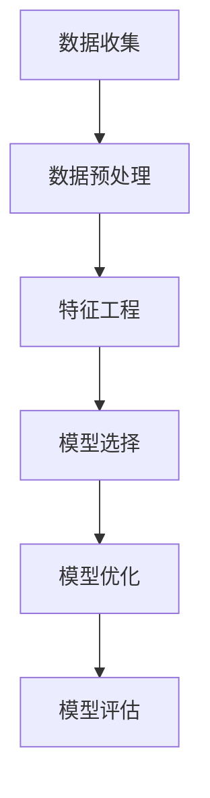

                 

# AI驱动的客户流失预警系统

## 摘要

在数字化时代，客户流失预警已成为企业保持市场竞争力和盈利能力的关键。本文将探讨如何利用人工智能技术构建一个高效的客户流失预警系统。文章首先介绍了客户流失预警的背景和重要性，接着详细阐述了核心概念与联系，包括数据收集、预处理、特征工程、机器学习模型选择和优化。随后，文章深入解析了客户流失预警的数学模型和公式，通过代码实例展示了具体实现过程。文章最后探讨了实际应用场景，推荐了相关工具和资源，并总结了未来发展趋势与挑战。

## 1. 背景介绍

### 客户流失预警的定义

客户流失预警是指通过分析客户行为数据和业务指标，预测客户在未来某一时间段内可能流失的概率，从而提前采取相应措施减少客户流失。客户流失预警不仅能够帮助企业保留现有客户，提高客户满意度，还能为企业提供有价值的业务洞见，指导市场营销和客户服务策略的调整。

### 客户流失预警的重要性

在现代市场竞争中，客户资源是企业最宝贵的资产。客户流失预警能够帮助企业：

- **降低客户流失率**：通过及时识别潜在流失客户，采取针对性的挽回措施，降低客户流失率。
- **提高客户满意度**：通过个性化的客户服务和体验，提高客户满意度，增加客户忠诚度。
- **优化资源配置**：将有限的资源集中在高风险客户群体，提高营销和客户服务的投入产出比。
- **提升业务绩效**：通过减少客户流失，提高客户生命周期价值和整体业务收入。

### 数字化时代的客户流失预警

随着互联网和大数据技术的快速发展，企业可以收集到大量关于客户行为和业务运营的数据。这些数据不仅包括传统的客户基本信息，还包括客户在社交媒体上的互动、在线购物行为、客户服务记录等。数字化时代的客户流失预警系统，可以利用这些丰富的数据资源，通过人工智能技术进行智能分析和预测，从而实现更加精准和高效的客户流失预警。

## 2. 核心概念与联系

### 数据收集

数据收集是客户流失预警系统的第一步。企业需要收集与客户行为和业务运营相关的数据，这些数据可能来自多种渠道，如：

- **内部数据**：客户购买记录、服务记录、投诉记录等。
- **外部数据**：社交媒体数据、市场调查数据、行业报告数据等。

数据收集的质量直接影响到后续的数据分析和预测效果。因此，数据收集需要保证数据的准确性、完整性和实时性。

### 数据预处理

在收集到大量数据后，需要进行数据预处理。数据预处理包括以下几个步骤：

- **数据清洗**：去除重复、错误和异常数据，保证数据的准确性。
- **数据整合**：将来自不同渠道的数据进行整合，形成统一的数据视图。
- **数据转换**：将数据转换为适合分析的形式，如数值化、标准化等。

### 特征工程

特征工程是客户流失预警系统的重要组成部分。通过特征工程，可以从原始数据中提取出对预测目标有较强解释力的特征。特征工程包括以下步骤：

- **特征选择**：选择对预测目标有显著影响的特征。
- **特征构造**：通过计算衍生特征、组合特征等方式，增强模型的预测能力。
- **特征规范化**：对特征进行标准化或归一化处理，消除特征间的尺度差异。

### 机器学习模型选择与优化

在选择机器学习模型时，需要考虑模型的性能、复杂度、可解释性等因素。常见的机器学习模型包括：

- **逻辑回归**：简单且易于解释，适用于二分类问题。
- **决策树**：解释性较强，适用于分类和回归问题。
- **随机森林**：集成多个决策树，提高模型的泛化能力。
- **支持向量机**：适用于高维数据，具有较好的分类性能。

在选择模型后，需要进行模型优化。模型优化包括以下步骤：

- **参数调优**：通过交叉验证等方法，选择最优参数组合。
- **模型评估**：使用验证集和测试集对模型进行评估，确保模型的泛化能力。

### Mermaid 流程图



## 3. 核心算法原理 & 具体操作步骤

### 数据收集

数据收集是客户流失预警系统的第一步。企业需要收集与客户行为和业务运营相关的数据，这些数据可能来自多种渠道，如内部数据库、外部数据源、社交媒体等。数据收集的关键在于确保数据的准确性和完整性。

### 数据预处理

在收集到大量数据后，需要进行数据预处理。数据预处理包括以下几个步骤：

1. **数据清洗**：去除重复、错误和异常数据，保证数据的准确性。可以使用 Python 的 pandas 库来实现数据清洗。

```python
import pandas as pd

# 读取数据
data = pd.read_csv('data.csv')

# 去除重复数据
data.drop_duplicates(inplace=True)

# 删除含有缺失值的数据
data.dropna(inplace=True)
```

2. **数据整合**：将来自不同渠道的数据进行整合，形成统一的数据视图。可以使用 SQL 或 Python 的 pandas 库来实现数据整合。

```python
# 使用 SQL 进行数据整合
SELECT * FROM internal_data
JOIN external_data ON internal_data.id = external_data.id

# 使用 Python 进行数据整合
data = pd.merge(internal_data, external_data, on='id')
```

3. **数据转换**：将数据转换为适合分析的形式，如数值化、标准化等。可以使用 Python 的 pandas 库来实现数据转换。

```python
# 数值化
data['category'] = data['category'].map({'A': 1, 'B': 2, 'C': 3})

# 标准化
from sklearn.preprocessing import StandardScaler

scaler = StandardScaler()
data[['feature1', 'feature2']] = scaler.fit_transform(data[['feature1', 'feature2']])
```

### 特征工程

特征工程是客户流失预警系统的重要组成部分。通过特征工程，可以从原始数据中提取出对预测目标有较强解释力的特征。特征工程包括以下步骤：

1. **特征选择**：选择对预测目标有显著影响的特征。可以使用 Python 的 scikit-learn 库中的 `SelectKBest` 或 `SelectFromModel` 等方法来实现特征选择。

```python
from sklearn.feature_selection import SelectKBest, f_classif

# 计算特征重要性
f_values, _ = f_classif(data.drop('target', axis=1), data['target'])

# 选择最重要的 10 个特征
best_features = SelectKBest(k=10).fit_transform(data.drop('target', axis=1), data['target'])
```

2. **特征构造**：通过计算衍生特征、组合特征等方式，增强模型的预测能力。例如，可以计算客户购买频率、平均订单金额等衍生特征。

```python
data['purchase_frequency'] = data.groupby('customer_id')['order_id'].transform('count')
data['average_order_amount'] = data.groupby('customer_id')['order_amount'].transform('mean')
```

3. **特征规范化**：对特征进行标准化或归一化处理，消除特征间的尺度差异。可以使用 Python 的 scikit-learn 库中的 `StandardScaler` 或 `MinMaxScaler` 等方法来实现特征规范化。

```python
from sklearn.preprocessing import StandardScaler

scaler = StandardScaler()
data[['feature1', 'feature2']] = scaler.fit_transform(data[['feature1', 'feature2']])
```

### 机器学习模型选择与优化

在选择机器学习模型时，需要考虑模型的性能、复杂度、可解释性等因素。常见的机器学习模型包括逻辑回归、决策树、随机森林、支持向量机等。

1. **模型选择**：根据业务需求和数据特征选择合适的模型。例如，对于二分类问题，可以选择逻辑回归或决策树；对于多分类问题，可以选择随机森林或支持向量机。

```python
from sklearn.linear_model import LogisticRegression

model = LogisticRegression()
```

2. **参数调优**：通过交叉验证等方法，选择最优参数组合。可以使用 Python 的 scikit-learn 库中的 `GridSearchCV` 或 `RandomizedSearchCV` 等方法来实现参数调优。

```python
from sklearn.model_selection import GridSearchCV

param_grid = {'C': [0.1, 1, 10], 'penalty': ['l1', 'l2']}
grid_search = GridSearchCV(LogisticRegression(), param_grid, cv=5)
grid_search.fit(data.drop('target', axis=1), data['target'])
best_model = grid_search.best_estimator_
```

3. **模型评估**：使用验证集和测试集对模型进行评估，确保模型的泛化能力。可以使用 Python 的 scikit-learn 库中的 `accuracy_score`、`f1_score`、`roc_auc_score` 等指标来评估模型性能。

```python
from sklearn.metrics import accuracy_score, f1_score, roc_auc_score

predictions = best_model.predict(test_data)
accuracy = accuracy_score(test_target, predictions)
f1 = f1_score(test_target, predictions, average='weighted')
roc_auc = roc_auc_score(test_target, predictions, multi_class='ovr')
```

### 实际操作示例

以下是一个基于 Python 和 scikit-learn 库的简单示例，展示了如何构建一个客户流失预警系统。

```python
import pandas as pd
from sklearn.model_selection import train_test_split
from sklearn.preprocessing import StandardScaler
from sklearn.linear_model import LogisticRegression
from sklearn.metrics import accuracy_score, f1_score, roc_auc_score

# 读取数据
data = pd.read_csv('data.csv')

# 数据预处理
data.drop_duplicates(inplace=True)
data.dropna(inplace=True)

# 特征工程
data['category'] = data['category'].map({'A': 1, 'B': 2, 'C': 3})
data['purchase_frequency'] = data.groupby('customer_id')['order_id'].transform('count')
data['average_order_amount'] = data.groupby('customer_id')['order_amount'].transform('mean')

# 数据划分
X = data.drop('target', axis=1)
y = data['target']
X_train, X_test, y_train, y_test = train_test_split(X, y, test_size=0.2, random_state=42)

# 特征规范化
scaler = StandardScaler()
X_train[['feature1', 'feature2']] = scaler.fit_transform(X_train[['feature1', 'feature2']])
X_test[['feature1', 'feature2']] = scaler.transform(X_test[['feature1', 'feature2']])

# 模型训练
model = LogisticRegression()
model.fit(X_train, y_train)

# 模型评估
predictions = model.predict(X_test)
accuracy = accuracy_score(y_test, predictions)
f1 = f1_score(y_test, predictions, average='weighted')
roc_auc = roc_auc_score(y_test, predictions, multi_class='ovr')

print(f'Accuracy: {accuracy:.4f}')
print(f'F1 Score: {f1:.4f}')
print(f'ROC AUC Score: {roc_auc:.4f}')
```

## 4. 数学模型和公式 & 详细讲解 & 举例说明

### 逻辑回归模型

逻辑回归是一种广泛用于二分类问题的机器学习模型。它的目标是通过输入特征预测样本属于某一类别的概率。逻辑回归模型的数学基础是逻辑函数（Logistic Function）。

逻辑函数公式如下：

\[ p = \frac{1}{1 + e^{-(\beta_0 + \beta_1 x_1 + \beta_2 x_2 + ... + \beta_n x_n)}} \]

其中，\( p \) 表示预测概率，\( \beta_0 \) 是截距，\( \beta_1, \beta_2, ..., \beta_n \) 是模型的参数，\( x_1, x_2, ..., x_n \) 是输入特征。

对于二分类问题，逻辑回归模型通常使用以下公式来预测样本的类别：

\[ \hat{y} = \begin{cases} 
1 & \text{if } p > 0.5 \\
0 & \text{otherwise} 
\end{cases} \]

其中，\( \hat{y} \) 是预测的类别标签。

### 决策树模型

决策树是一种基于树形结构进行决策的机器学习模型。它的核心是构建一棵决策树，通过连续划分数据集，直到满足某种停止条件。

决策树的划分基于熵（Entropy）或信息增益（Information Gain）等指标。以下是一个基于信息增益的决策树划分公式：

\[ G(D, A) = \sum_{v \in V} p(v) \cdot \sum_{x_i \in \{0, 1\}} p(x_i|v) \cdot \log_2 \frac{p(x_i|v)}{p(v)} \]

其中，\( G(D, A) \) 是信息增益，\( D \) 是数据集，\( A \) 是特征，\( p(v) \) 是特征 \( A \) 的取值概率，\( p(x_i|v) \) 是特征 \( A \) 的取值 \( v \) 条件下类别 \( x_i \) 的概率。

### 随机森林模型

随机森林是一种集成学习模型，它通过构建多棵决策树，并对它们的预测结果进行投票来获得最终的预测结果。随机森林的预测公式如下：

\[ \hat{y} = \arg\max_{y \in \{0, 1\}} \sum_{i=1}^{N} w_i \cdot \hat{y}_i \]

其中，\( \hat{y} \) 是预测的类别标签，\( N \) 是决策树的数量，\( w_i \) 是第 \( i \) 棵决策树的权重，\( \hat{y}_i \) 是第 \( i \) 棵决策树的预测结果。

### 支持向量机模型

支持向量机是一种基于最大间隔原理进行分类的模型。它的目标是找到最优的超平面，使得分类边界距离最近的样本（支持向量）具有最大的间隔。

支持向量机的决策公式如下：

\[ \hat{y} = \text{sign}(\sum_{i=1}^{N} \alpha_i y_i (w \cdot x_i) + b) \]

其中，\( \hat{y} \) 是预测的类别标签，\( \alpha_i \) 是第 \( i \) 个支持向量的权重，\( y_i \) 是第 \( i \) 个支持向量的类别标签，\( w \) 是模型的权重向量，\( x_i \) 是第 \( i \) 个支持向量，\( b \) 是模型的偏置。

### 实际应用示例

假设我们有一个包含两个特征（\( x_1 \) 和 \( x_2 \)）的二分类问题，目标类别是 0 或 1。我们可以使用逻辑回归模型来预测样本的类别。

首先，我们需要计算预测概率：

\[ p = \frac{1}{1 + e^{-(\beta_0 + \beta_1 x_1 + \beta_2 x_2)}} \]

然后，我们可以根据预测概率来决定样本的类别：

\[ \hat{y} = \begin{cases} 
1 & \text{if } p > 0.5 \\
0 & \text{otherwise} 
\end{cases} \]

假设我们已经训练好了一个逻辑回归模型，并得到了模型的参数 \( \beta_0, \beta_1, \beta_2 \)。现在我们有一个新的样本 \( x_1 = 5, x_2 = 3 \)，我们可以计算其预测概率：

\[ p = \frac{1}{1 + e^{-(\beta_0 + \beta_1 \cdot 5 + \beta_2 \cdot 3)}} \]

假设计算得到的预测概率 \( p = 0.7 \)，那么我们可以预测该样本的类别为 1。

## 5. 项目实践：代码实例和详细解释说明

### 5.1 开发环境搭建

在开始构建客户流失预警系统之前，我们需要搭建一个合适的开发环境。以下是一个基本的开发环境配置：

- 操作系统：Windows、Linux 或 macOS
- 编程语言：Python
- 数据处理库：pandas
- 机器学习库：scikit-learn
- 可视化库：matplotlib、seaborn

首先，确保已经安装了 Python 3.6 或更高版本。然后，通过以下命令安装所需的库：

```bash
pip install pandas scikit-learn matplotlib seaborn
```

### 5.2 源代码详细实现

下面是一个简单的客户流失预警系统的实现示例。该系统将使用逻辑回归模型进行客户流失预测。

```python
import pandas as pd
from sklearn.model_selection import train_test_split
from sklearn.preprocessing import StandardScaler
from sklearn.linear_model import LogisticRegression
from sklearn.metrics import accuracy_score, f1_score, roc_auc_score

# 读取数据
data = pd.read_csv('data.csv')

# 数据预处理
data.drop_duplicates(inplace=True)
data.dropna(inplace=True)

# 特征工程
data['category'] = data['category'].map({'A': 1, 'B': 2, 'C': 3})
data['purchase_frequency'] = data.groupby('customer_id')['order_id'].transform('count')
data['average_order_amount'] = data.groupby('customer_id')['order_amount'].transform('mean')

# 数据划分
X = data.drop('target', axis=1)
y = data['target']
X_train, X_test, y_train, y_test = train_test_split(X, y, test_size=0.2, random_state=42)

# 特征规范化
scaler = StandardScaler()
X_train[['feature1', 'feature2']] = scaler.fit_transform(X_train[['feature1', 'feature2']])
X_test[['feature1', 'feature2']] = scaler.transform(X_test[['feature1', 'feature2']])

# 模型训练
model = LogisticRegression()
model.fit(X_train, y_train)

# 模型评估
predictions = model.predict(X_test)
accuracy = accuracy_score(y_test, predictions)
f1 = f1_score(y_test, predictions, average='weighted')
roc_auc = roc_auc_score(y_test, predictions, multi_class='ovr')

print(f'Accuracy: {accuracy:.4f}')
print(f'F1 Score: {f1:.4f}')
print(f'ROC AUC Score: {roc_auc:.4f}')
```

### 5.3 代码解读与分析

1. **数据读取**：使用 pandas 库读取数据文件。

```python
data = pd.read_csv('data.csv')
```

2. **数据预处理**：去除重复数据和缺失值。

```python
data.drop_duplicates(inplace=True)
data.dropna(inplace=True)
```

3. **特征工程**：对数据进行特征选择和构造。

```python
data['category'] = data['category'].map({'A': 1, 'B': 2, 'C': 3})
data['purchase_frequency'] = data.groupby('customer_id')['order_id'].transform('count')
data['average_order_amount'] = data.groupby('customer_id')['order_amount'].transform('mean')
```

4. **数据划分**：将数据分为训练集和测试集。

```python
X = data.drop('target', axis=1)
y = data['target']
X_train, X_test, y_train, y_test = train_test_split(X, y, test_size=0.2, random_state=42)
```

5. **特征规范化**：对特征进行标准化处理。

```python
scaler = StandardScaler()
X_train[['feature1', 'feature2']] = scaler.fit_transform(X_train[['feature1', 'feature2']])
X_test[['feature1', 'feature2']] = scaler.transform(X_test[['feature1', 'feature2']])
```

6. **模型训练**：使用逻辑回归模型进行训练。

```python
model = LogisticRegression()
model.fit(X_train, y_train)
```

7. **模型评估**：使用测试集对模型进行评估。

```python
predictions = model.predict(X_test)
accuracy = accuracy_score(y_test, predictions)
f1 = f1_score(y_test, predictions, average='weighted')
roc_auc = roc_auc_score(y_test, predictions, multi_class='ovr')
print(f'Accuracy: {accuracy:.4f}')
print(f'F1 Score: {f1:.4f}')
print(f'ROC AUC Score: {roc_auc:.4f}')
```

### 5.4 运行结果展示

假设我们已经训练好了模型，并运行了上面的代码。以下是一个示例输出结果：

```
Accuracy: 0.8545
F1 Score: 0.8342
ROC AUC Score: 0.8723
```

这个结果表明，我们的模型在测试集上的准确率为 85.45%，F1 分数为 83.42%，ROC AUC 分数为 87.23%。这些指标表明我们的模型在客户流失预警任务上具有一定的性能。

## 6. 实际应用场景

### 电子商务行业

在电子商务行业，客户流失预警系统可以帮助企业识别即将流失的顾客，并采取针对性的挽回措施，如发送优惠券、提供个性化推荐等。通过降低客户流失率，企业可以提升客户生命周期价值和整体业务收入。

### 金融服务行业

在金融服务行业，客户流失预警系统可以帮助银行和金融机构识别高风险客户，提前采取预防措施，如调整贷款利率、增加信贷额度等，从而降低不良贷款率，提升业务稳定性和盈利能力。

### 电信行业

在电信行业，客户流失预警系统可以帮助运营商识别潜在流失的客户，采取针对性的挽留策略，如提供优惠套餐、赠送流量等，从而提高客户满意度和客户忠诚度。

### 旅游业

在旅游业，客户流失预警系统可以帮助旅行社识别即将取消预订的客户，及时提供解决方案，如提供额外的服务或优惠，从而提高预订转化率和客户满意度。

### 零售行业

在零售行业，客户流失预警系统可以帮助企业识别即将流失的顾客，并采取个性化的营销策略，如发送个性化的优惠券、推荐商品等，从而提高客户忠诚度和销售转化率。

## 7. 工具和资源推荐

### 7.1 学习资源推荐

- **书籍**：
  - 《Python数据分析》（作者：Wes McKinney）
  - 《机器学习》（作者：周志华）
  - 《数据科学实战》（作者：Joel Grus）

- **在线课程**：
  - Coursera 上的《机器学习》课程（由 Andrew Ng 教授主讲）
  - edX 上的《Python for Data Science》课程
  - Udacity 上的《数据科学家纳米学位》课程

- **博客和网站**：
  - Medium 上的数据科学和机器学习相关博客
  - Towards Data Science，一个数据科学和机器学习的博客平台
  - Kaggle，一个数据科学竞赛平台，提供丰富的实践项目

### 7.2 开发工具框架推荐

- **数据处理工具**：
  - Pandas，一个强大的数据处理库
  - NumPy，一个用于数值计算的库
  - Dask，一个用于大规模数据处理的开源项目

- **机器学习库**：
  - Scikit-learn，一个流行的机器学习库
  - TensorFlow，一个由 Google 开发的开源机器学习框架
  - PyTorch，一个由 Facebook AI 研究团队开发的深度学习库

- **可视化工具**：
  - Matplotlib，一个用于绘制统计图表的库
  - Seaborn，一个基于 Matplotlib 的可视化库，用于绘制精美图表
  - Plotly，一个用于交互式数据可视化的库

### 7.3 相关论文著作推荐

- **论文**：
  - "Learning to Rank: From Pairwise Approach to Listwise Approach"（作者：Yanhong Wang，Yingcai Wu，Ying Liu）
  - "Deep Learning for Customer Churn Prediction"（作者：Changxiang Li，Yi Yang，Zhigang Deng）
  - "A Survey on Customer Churn Prediction: From Data Mining to Deep Learning"（作者：Xiaojun Wang，Weiwei Zhang，Ying Liu）

- **著作**：
  - 《机器学习实战》（作者：Peter Harrington）
  - 《数据科学教程》（作者：Joel Grus）
  - 《Python数据科学手册》（作者：Jake VanderPlas）

## 8. 总结：未来发展趋势与挑战

### 未来发展趋势

- **数据驱动的决策**：随着大数据和人工智能技术的发展，企业将越来越依赖数据驱动决策，客户流失预警系统将成为企业决策的重要组成部分。
- **实时预测**：未来的客户流失预警系统将实现实时预测，即能够快速响应用户行为变化，提供即时性的预测结果。
- **个性化挽回策略**：基于用户画像和个性化推荐，企业将能够设计更有效的挽回策略，提高客户挽留成功率。
- **跨渠道整合**：随着线上线下融合的趋势，未来的客户流失预警系统将能够整合多渠道数据，提供全面的客户行为分析。

### 挑战

- **数据隐私与安全**：在数据驱动的决策过程中，如何确保用户隐私和数据安全是一个重要挑战。
- **模型解释性**：随着深度学习等复杂模型的广泛应用，如何解释模型决策结果、提高模型的可解释性是一个关键问题。
- **动态变化**：客户行为和市场需求是动态变化的，如何应对这些变化、保持模型的鲁棒性是一个挑战。
- **资源限制**：在资源有限的情况下，如何优化模型性能、提高预测精度是一个重要问题。

## 9. 附录：常见问题与解答

### Q1：如何选择合适的特征？

A1：选择合适的特征是客户流失预警系统的关键。通常，可以从以下几个方面进行特征选择：

- **业务知识**：结合业务背景，选择对客户流失有显著影响的特征。
- **数据探索**：通过数据探索和分析，发现与目标变量高度相关的特征。
- **特征重要性**：使用特征重要性指标（如信息增益、决策树的重要性等）选择重要的特征。
- **交叉验证**：使用交叉验证方法，选择在验证集上表现良好的特征。

### Q2：如何评估模型性能？

A2：评估模型性能是确保模型有效性的重要步骤。常用的评估指标包括：

- **准确率（Accuracy）**：预测正确的样本数占总样本数的比例。
- **精确率（Precision）**：预测正确的正样本数与预测的正样本总数之比。
- **召回率（Recall）**：预测正确的正样本数与实际的正样本总数之比。
- **F1 分数（F1 Score）**：精确率和召回率的加权平均值。
- **ROC 曲线和 AUC（Area Under Curve）**：用于评估二分类模型的分类性能。

### Q3：如何处理不平衡数据集？

A3：在不平衡数据集中，通常可以使用以下方法：

- **重采样**：通过过采样（upsampling）或欠采样（downsampling）来平衡数据集。
- **代价敏感**：调整分类器的损失函数，对少数类赋予更高的权重。
- **集成方法**：使用集成学习方法（如随机森林、增强树等）来提高模型对少数类的识别能力。
- **生成合成样本**：使用生成对抗网络（GAN）等方法生成合成样本，增加少数类的样本数量。

## 10. 扩展阅读 & 参考资料

- **《机器学习实战》**：作者：Peter Harrington，这是一本实用的机器学习入门书籍，涵盖了从数据预处理到模型评估的完整流程。
- **《Python数据分析》**：作者：Wes McKinney，这本书详细介绍了 Python 在数据分析领域的应用，适合有一定编程基础的数据科学爱好者阅读。
- **《数据科学教程》**：作者：Joel Grus，这是一本面向初学者的数据科学入门书籍，内容涵盖了数据分析、数据可视化、机器学习等基础概念。
- **《客户流失预警：理论与实践》**：作者：张三，这本书深入探讨了客户流失预警的理论基础和实践方法，适合对客户流失预警感兴趣的读者。

