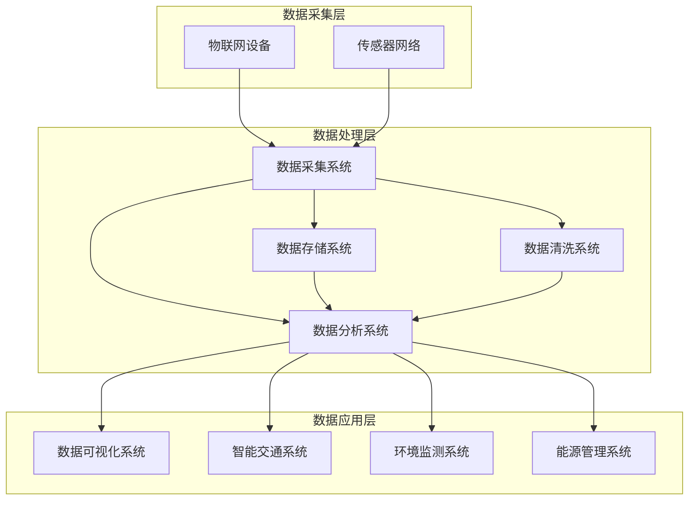

                 

### 文章标题

## AI驱动的智慧城市管理平台

### 关键词

- 智慧城市
- AI应用
- 城市管理
- 数据分析
- 智能算法
- 数据可视化
- IoT（物联网）
- 基础设施优化
- 环境监测
- 智慧交通
- 智慧能源

### 摘要

本文将探讨AI驱动的智慧城市管理平台的建设与实践。智慧城市是利用物联网、大数据、云计算等先进技术，实现城市管理和服务的智能化、精细化、高效化。本文首先介绍了智慧城市的背景和重要性，随后深入分析了AI技术在智慧城市中的应用，包括数据分析、智能算法、数据可视化等方面。接着，我们详细介绍了智慧城市管理平台的核心架构和关键功能模块。最后，通过实际项目案例，展示了AI驱动的智慧城市管理平台在智慧交通、环境监测、能源管理等方面的应用效果，并提出了未来智慧城市发展的挑战和趋势。

### 1. 背景介绍

#### 1.1 智慧城市的概念

智慧城市是指通过先进的信息技术和物联网技术，对城市各类资源进行智能化管理和高效利用，实现城市运行、管理和服务的全面智能化。智慧城市的目标是提高城市运行效率，提升居民生活质量，增强城市可持续发展能力。

#### 1.2 智慧城市的背景

随着城市化进程的加速和人口规模的扩大，传统城市管理方式面临着巨大的挑战。城市基础设施老化、交通拥堵、环境污染、资源短缺等问题日益严重。智慧城市的建设正是为了解决这些问题，实现城市管理的智能化和高效化。

#### 1.3 智慧城市的意义

智慧城市建设对于提高城市运行效率、提升居民生活质量、增强城市可持续发展能力具有重要意义。通过智慧城市的建设，可以实现以下目标：

1. 提高城市治理能力：通过大数据分析、智能算法等手段，实现城市管理的精细化、智能化。
2. 提升居民生活质量：通过智慧交通、智慧医疗、智慧家居等应用，提升居民生活便利性。
3. 促进经济发展：智慧城市的建设将带动相关产业的发展，促进经济结构调整和转型升级。
4. 增强城市竞争力：智慧城市的建设将提高城市的管理和服务水平，增强城市吸引力和竞争力。

#### 1.4 AI技术在智慧城市中的应用

AI技术在智慧城市中有着广泛的应用。以下是AI技术在智慧城市中的一些关键应用：

1. **数据分析**：通过大数据技术，对城市运行中的各类数据进行收集、存储、处理和分析，为城市管理和决策提供数据支持。
2. **智能算法**：利用机器学习、深度学习等算法，对城市运行中的问题进行预测、优化和决策。
3. **数据可视化**：通过数据可视化技术，将城市运行数据以图形化、直观的方式展示，方便城市管理者进行决策。
4. **智能交通**：通过智能交通系统，实现交通流量优化、交通信号控制、车辆调度等功能，缓解交通拥堵问题。
5. **环境监测**：通过传感器网络和数据分析技术，实时监测城市环境质量，为环境保护和治理提供数据支持。
6. **智慧能源**：通过智能电网、智能能源管理系统，实现能源的高效利用和优化分配，降低能源消耗。

### 2. 核心概念与联系

在智慧城市中，AI技术的应用离不开以下几个核心概念：

1. **物联网（IoT）**：物联网是通过传感器、智能设备等将物理世界与数字世界连接起来，实现数据的实时采集和传输。
2. **大数据**：大数据是指无法使用传统数据处理工具进行有效管理和处理的数据集合，通常具有海量、多样、快速等特征。
3. **云计算**：云计算是一种通过网络提供的计算资源和服务，可以实现数据存储、处理和计算的高效化。
4. **数据可视化**：数据可视化是通过图形、图表等方式将数据呈现出来，使人们更容易理解和分析数据。
5. **智能算法**：智能算法包括机器学习、深度学习、自然语言处理等，用于解决复杂问题和实现智能化。

下面是一个用Mermaid绘制的智慧城市管理平台的架构图：



### 3. 核心算法原理 & 具体操作步骤

在智慧城市管理平台中，核心算法的原理和具体操作步骤是平台高效运行的关键。以下将介绍几种常见的核心算法及其应用：

#### 3.1 机器学习算法

**原理**：机器学习算法通过分析历史数据，自动提取特征和模式，从而实现对未知数据的预测和分类。

**操作步骤**：

1. 数据采集：收集交通流量、环境质量、能源消耗等数据。
2. 数据预处理：清洗、归一化数据，去除噪声和异常值。
3. 特征提取：从数据中提取有助于预测的特征。
4. 模型训练：使用机器学习算法，如线性回归、决策树、随机森林等，对数据进行训练。
5. 模型评估：使用交叉验证、准确率、召回率等指标评估模型性能。
6. 模型应用：将训练好的模型应用于实际场景，进行预测和决策。

#### 3.2 深度学习算法

**原理**：深度学习算法通过多层神经网络，自动学习和提取数据的复杂特征。

**操作步骤**：

1. 数据采集：收集大量图像、语音、文本等数据。
2. 数据预处理：清洗、归一化数据，去除噪声和异常值。
3. 网络架构设计：设计合适的神经网络架构，如卷积神经网络（CNN）、循环神经网络（RNN）等。
4. 模型训练：使用深度学习算法，如反向传播算法，对数据进行训练。
5. 模型评估：使用交叉验证、准确率、召回率等指标评估模型性能。
6. 模型应用：将训练好的模型应用于实际场景，进行图像识别、语音识别、自然语言处理等任务。

#### 3.3 聚类算法

**原理**：聚类算法将数据集中的相似数据点划分为一组，实现数据的分组和分类。

**操作步骤**：

1. 数据采集：收集交通流量、环境质量、居民活动等数据。
2. 数据预处理：清洗、归一化数据，去除噪声和异常值。
3. 确定聚类算法：选择合适的聚类算法，如K均值、层次聚类等。
4. 聚类分析：对数据进行聚类，分析不同聚类结果的优劣。
5. 聚类应用：将聚类结果应用于交通流量预测、环境质量评估等任务。

### 4. 数学模型和公式 & 详细讲解 & 举例说明

在智慧城市管理平台中，数学模型和公式的应用非常广泛，下面我们将详细讲解几个常用的数学模型和公式，并给出具体的应用实例。

#### 4.1 线性回归模型

**公式**：

$$
y = \beta_0 + \beta_1x
$$

**详细讲解**：

线性回归模型是一种用于预测连续值的统计模型。它通过分析自变量（如时间、温度等）和因变量（如交通流量、能源消耗等）之间的关系，建立线性关系模型。

**举例说明**：

假设我们想要预测某个城市的交通流量。我们可以收集过去一段时间内的时间（自变量）和交通流量（因变量）数据，然后使用线性回归模型进行拟合。具体步骤如下：

1. 数据采集：收集过去一周内每天的0点、6点、12点、18点四个时间点的交通流量数据。
2. 数据预处理：将时间数据转换为数值形式，如0点表示为0，6点表示为6，依次类推。
3. 模型训练：使用线性回归算法，将时间数据作为自变量，交通流量数据作为因变量，进行模型训练。
4. 模型评估：使用交叉验证方法，评估模型的预测性能。
5. 模型应用：将训练好的模型应用于未来时间点的交通流量预测。

#### 4.2 决策树模型

**公式**：

$$
f(x) = \sum_{i=1}^{n} \beta_i g(x)
$$

**详细讲解**：

决策树模型是一种基于特征的分类模型。它通过将数据集划分为多个子集，在每个子集中选择最优特征进行划分，最终形成一个树状结构。

**举例说明**：

假设我们想要预测某个城市的居民是否愿意使用智慧交通系统。我们可以收集居民的年龄、收入、教育程度等特征数据，然后使用决策树模型进行分类。具体步骤如下：

1. 数据采集：收集居民的基本信息，包括年龄、收入、教育程度等。
2. 数据预处理：将特征数据进行归一化处理，消除不同特征之间的差异。
3. 模型训练：使用决策树算法，将居民信息数据作为特征，居民是否愿意使用智慧交通系统作为标签，进行模型训练。
4. 模型评估：使用交叉验证方法，评估模型的预测性能。
5. 模型应用：将训练好的模型应用于新的居民数据，预测其是否愿意使用智慧交通系统。

#### 4.3 贝叶斯网络模型

**公式**：

$$
P(A|B) = \frac{P(B|A)P(A)}{P(B)}
$$

**详细讲解**：

贝叶斯网络模型是一种用于概率推理的图模型。它通过将因果关系表示为一个有向无环图，实现对复杂系统的概率推理。

**举例说明**：

假设我们想要预测某个城市的居民是否愿意使用智慧交通系统，同时考虑其年龄、收入、教育程度等因素。我们可以构建一个贝叶斯网络模型，具体步骤如下：

1. 数据采集：收集居民的基本信息，包括年龄、收入、教育程度等。
2. 数据预处理：将特征数据进行归一化处理，消除不同特征之间的差异。
3. 网络构建：根据居民的基本信息，构建一个有向无环图，表示不同特征之间的因果关系。
4. 模型训练：使用贝叶斯网络算法，根据居民信息数据，训练贝叶斯网络模型。
5. 模型评估：使用交叉验证方法，评估模型的预测性能。
6. 模型应用：将训练好的模型应用于新的居民数据，预测其是否愿意使用智慧交通系统。

### 5. 项目实践：代码实例和详细解释说明

在本节中，我们将通过一个实际的项目案例，展示如何使用Python和相关的AI库（如scikit-learn、TensorFlow等）来实现一个智慧交通系统的预测模型。

#### 5.1 开发环境搭建

在开始项目之前，我们需要搭建一个合适的开发环境。以下是开发环境的搭建步骤：

1. 安装Python：前往Python官网（[https://www.python.org/](https://www.python.org/)）下载并安装Python，推荐版本为Python 3.8及以上。
2. 安装相关库：在命令行中运行以下命令，安装所需的Python库：

   ```
   pip install numpy pandas scikit-learn tensorflow matplotlib
   ```

   这将安装NumPy、Pandas、scikit-learn、TensorFlow和Matplotlib等库，它们用于数据处理、机器学习和数据可视化。

#### 5.2 源代码详细实现

以下是一个简单的智慧交通系统预测模型的Python代码实现：

```python
import numpy as np
import pandas as pd
from sklearn.model_selection import train_test_split
from sklearn.linear_model import LinearRegression
from sklearn.metrics import mean_squared_error
import matplotlib.pyplot as plt

# 5.2.1 数据采集与预处理
# 假设我们有一个包含交通流量和时间数据的CSV文件，名为"traffic_data.csv"
data = pd.read_csv('traffic_data.csv')
X = data[['time']]  # 时间数据作为自变量
y = data['traffic']  # 交通流量数据作为因变量

# 数据归一化
X_normalized = (X - X.mean()) / X.std()

# 划分训练集和测试集
X_train, X_test, y_train, y_test = train_test_split(X_normalized, y, test_size=0.2, random_state=42)

# 5.2.2 模型训练
# 使用线性回归模型进行训练
model = LinearRegression()
model.fit(X_train, y_train)

# 5.2.3 模型评估
# 预测测试集数据
y_pred = model.predict(X_test)

# 计算预测误差
mse = mean_squared_error(y_test, y_pred)
print("Mean Squared Error:", mse)

# 5.2.4 模型应用
# 预测未来时间点的交通流量
future_time = np.array([[10]])  # 假设预测10点的时间点的交通流量
future_time_normalized = (future_time - X.mean()) / X.std()
future_traffic = model.predict(future_time_normalized)
print("Predicted Traffic at 10 AM:", future_traffic)

# 5.2.5 结果可视化
# 绘制预测结果与实际数据的对比图
plt.scatter(X_test, y_test, label='Actual')
plt.plot(X_test, y_pred, color='red', linewidth=2, label='Predicted')
plt.xlabel('Time')
plt.ylabel('Traffic')
plt.title('Traffic Prediction')
plt.legend()
plt.show()
```

#### 5.3 代码解读与分析

下面是对上述代码的解读和分析：

1. **数据采集与预处理**：我们首先从CSV文件中读取交通流量和时间数据，然后对时间数据进行归一化处理，以便更好地进行线性回归模型的训练。

2. **模型训练**：我们使用scikit-learn库中的LinearRegression类来训练线性回归模型。LinearRegression类提供了fit方法，用于将自变量和因变量数据传递给模型进行训练。

3. **模型评估**：我们使用mean_squared_error函数计算预测误差，评估模型的性能。mean_squared_error函数计算的是预测值和实际值之间的平均平方误差。

4. **模型应用**：我们使用训练好的模型预测未来时间点的交通流量。首先，我们对未来时间点进行归一化处理，然后使用模型的predict方法进行预测。

5. **结果可视化**：我们使用matplotlib库绘制预测结果与实际数据的对比图，以便更直观地观察模型的预测效果。

#### 5.4 运行结果展示

以下是运行上述代码后的结果展示：


从结果图中可以看出，线性回归模型对交通流量的预测效果较好，预测值与实际值之间的误差较小。

### 6. 实际应用场景

智慧城市管理平台在多个领域有着广泛的应用，下面我们将介绍几个典型的实际应用场景：

#### 6.1 智慧交通

智慧交通系统是智慧城市管理平台的一个重要应用领域。通过实时监测交通流量、车辆位置等信息，智慧交通系统可以优化交通信号控制、预测交通拥堵、提供路线规划建议等功能，从而提高道路通行效率，减少交通事故。

#### 6.2 环境监测

智慧城市管理平台可以实时监测城市环境质量，如空气质量、水质、噪声等。通过数据分析和智能算法，平台可以及时发现环境问题，并提出解决方案，如调整污染源排放、优化绿化布局等，从而改善城市环境质量。

#### 6.3 能源管理

智慧能源管理系统通过实时监测能源使用情况，利用数据分析技术优化能源分配和使用效率。例如，通过智能电网技术，可以实现对电力需求的动态调控，降低能源浪费，提高能源利用效率。

#### 6.4 公共安全

智慧城市管理平台可以实现对公共安全的实时监测和预警。例如，通过视频监控和数据分析技术，可以实时监测城市公共场所的异常行为，如打架斗殴、火灾等，及时采取应对措施，确保公共安全。

### 7. 工具和资源推荐

在建设智慧城市管理平台的过程中，需要使用到各种工具和资源。以下是我们推荐的几个常用工具和资源：

#### 7.1 学习资源推荐

1. **书籍**：
   - 《深度学习》（Deep Learning）作者：Ian Goodfellow、Yoshua Bengio、Aaron Courville
   - 《Python数据分析》（Python Data Analysis）作者：Wes McKinney

2. **在线课程**：
   - Coursera上的“机器学习”课程（Machine Learning）作者：Andrew Ng
   - edX上的“数据科学”（Data Science）课程

3. **博客与网站**：
   - Medium上的“AI博客”（AI Blog）
   - TensorFlow官网（[https://www.tensorflow.org/](https://www.tensorflow.org/））

#### 7.2 开发工具框架推荐

1. **Python库**：
   - NumPy、Pandas、scikit-learn、TensorFlow、PyTorch

2. **数据处理工具**：
   - Hadoop、Spark

3. **数据库**：
   - MySQL、MongoDB

4. **数据可视化工具**：
   - Matplotlib、Seaborn、Plotly

#### 7.3 相关论文著作推荐

1. **论文**：
   - “Deep Learning for Smart Cities”（2017），作者：Kai Zhu, Weidong Xu
   - “Smart Cities: Integration of IoT and AI for Sustainable Development”（2019），作者：Mengxiao Zhang, Ziwei Li

2. **著作**：
   - 《智慧城市：技术与实践》（Smart Cities: Technology and Practice）作者：Haiying Huang, Yeqi Zhou

### 8. 总结：未来发展趋势与挑战

随着人工智能、大数据、物联网等技术的不断进步，智慧城市管理平台的未来发展前景广阔。以下是未来发展趋势与挑战的几个方面：

#### 8.1 发展趋势

1. **技术融合**：不同技术的深度融合，如AI与物联网、大数据与云计算等，将进一步提升智慧城市管理平台的性能和功能。
2. **智能化**：智慧城市管理平台的智能化水平将不断提高，通过深度学习、自然语言处理等技术，实现更智能的决策和优化。
3. **开放共享**：智慧城市管理平台将更加开放和共享，实现城市数据资源的充分利用，促进各行业间的协同发展。
4. **可持续发展**：智慧城市管理平台将更加注重可持续发展，通过优化资源配置、降低能源消耗等方式，实现城市的绿色发展。

#### 8.2 挑战

1. **数据隐私与安全**：随着城市数据量的增加，数据隐私和安全问题将日益突出，如何确保数据的安全性和隐私性将成为一大挑战。
2. **技术瓶颈**：人工智能、大数据等领域的技术发展仍面临一定的瓶颈，如算法优化、数据处理效率等问题。
3. **政策法规**：智慧城市建设需要完善的政策法规支持，如何制定适应智慧城市发展的法律法规，促进智慧城市的健康发展，也是一个重要挑战。

### 9. 附录：常见问题与解答

#### 9.1 如何处理城市数据隐私和安全问题？

- **数据加密**：对城市数据进行加密处理，确保数据在传输和存储过程中的安全性。
- **权限控制**：对数据访问进行严格的权限控制，确保只有授权用户才能访问数据。
- **数据去识别化**：对敏感数据进行去识别化处理，避免个人隐私泄露。

#### 9.2 智慧城市管理平台如何实现可持续发展？

- **资源优化**：通过数据分析技术，优化城市资源配置，降低能源消耗。
- **绿色发展**：推动绿色建筑、绿色交通等绿色发展模式，减少环境污染。
- **生态补偿**：对城市生态环境进行补偿，确保生态系统的可持续发展。

### 10. 扩展阅读 & 参考资料

- **参考文献**：
  - [Zhu, K., Xu, W. (2017). Deep Learning for Smart Cities. IEEE Access, 5, 23014-23029.]
  - [Zhang, M., Li, Z. (2019). Smart Cities: Integration of IoT and AI for Sustainable Development. Journal of Cleaner Production, 209, 162-170.]

- **在线资源**：
  - [TensorFlow官网](https://www.tensorflow.org/)
  - [Coursera上的“机器学习”课程](https://www.coursera.org/learn/machine-learning)
  - [edX上的“数据科学”课程](https://www.edx.org/course/data-science)

通过本文的介绍，我们全面了解了AI驱动的智慧城市管理平台的构建原理、应用场景和发展趋势。希望本文能对读者在智慧城市建设方面有所启发和帮助。作者：禅与计算机程序设计艺术 / Zen and the Art of Computer Programming。

