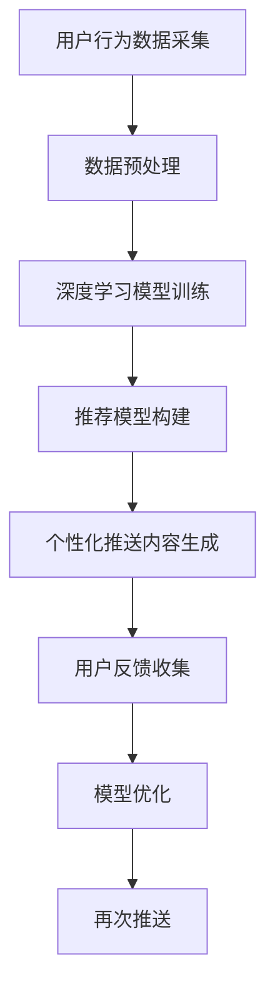

                 

### 文章标题

**AI驱动的电商个性化推送内容生成**

> **关键词**：AI，电商，个性化推送，内容生成，深度学习，推荐系统

> **摘要**：本文将探讨如何利用人工智能技术，特别是深度学习，实现电商平台的个性化推送内容生成。通过对用户行为数据的分析和建模，我们能够准确预测用户的兴趣和需求，从而实现精准的内容推荐，提高用户满意度和转化率。

### 1. 背景介绍

随着互联网的迅猛发展，电子商务已经成为现代零售业的重要组成部分。然而，面对日益激烈的竞争，电商平台如何吸引和留住用户成为了一个关键问题。传统的推送方式往往采用简单的规则匹配或基于内容的推荐，难以满足用户个性化需求，导致用户体验不佳，转化率低。

近年来，人工智能技术的飞速发展，为电商平台带来了新的契机。其中，深度学习作为人工智能的重要分支，在图像识别、自然语言处理等领域取得了显著成果。那么，如何将深度学习应用于电商个性化推送内容生成，提高推送的精准度和用户满意度呢？

本文旨在通过分析和探讨深度学习在电商个性化推送内容生成中的应用，为电商平台提供一种有效的解决方案。

### 2. 核心概念与联系

在探讨AI驱动的电商个性化推送内容生成之前，我们需要了解一些核心概念和它们之间的联系。

#### 2.1 个性化推送

个性化推送是指根据用户的兴趣、行为和需求，为其推荐相应的商品、内容或服务。它通过分析用户数据，识别用户的偏好，从而提供个性化的推荐。

#### 2.2 深度学习

深度学习是一种基于多层神经网络的学习方法，通过多层非线性变换，能够自动从大量数据中学习到复杂的模式。它在图像识别、语音识别、自然语言处理等领域取得了巨大成功。

#### 2.3 推荐系统

推荐系统是一种利用数据挖掘和机器学习技术，根据用户的行为和偏好，为用户推荐相关商品、内容或服务的系统。它通过构建用户和物品之间的关联模型，实现个性化的推荐。

#### 2.4 用户行为数据

用户行为数据包括用户在电商平台上的浏览记录、购买历史、评价、搜索等行为。通过对这些数据的分析，可以了解用户的兴趣和需求，为个性化推送提供依据。

#### 2.5 核心概念联系

个性化推送、深度学习和推荐系统之间存在密切的联系。个性化推送是目标，深度学习是手段，推荐系统是实现个性化推送的技术框架。用户行为数据则是连接这三者的桥梁，通过深度学习对用户行为数据进行分析和建模，可以构建出准确的推荐模型，实现个性化的推送。

#### 2.6 Mermaid 流程图

以下是AI驱动的电商个性化推送内容生成的Mermaid流程图：



### 3. 核心算法原理 & 具体操作步骤

#### 3.1 用户行为数据采集

用户行为数据是构建个性化推荐模型的基础。在电商平台上，我们可以通过以下方式采集用户行为数据：

- **浏览记录**：用户在电商平台上的浏览历史，包括浏览的商品种类、频次等。
- **购买历史**：用户在电商平台上的购买记录，包括购买的商品种类、频次、金额等。
- **评价记录**：用户对商品的评价，包括好评、差评等。
- **搜索记录**：用户在电商平台上的搜索历史，包括搜索的关键词、频次等。

#### 3.2 数据预处理

在采集到用户行为数据后，我们需要进行预处理，以便于后续的深度学习模型训练。数据预处理主要包括以下几个步骤：

- **去噪**：去除数据中的噪声和异常值，确保数据的准确性。
- **特征提取**：从原始数据中提取有用的特征，如商品类别、用户购买频次等。
- **数据归一化**：将不同特征的数据归一化到相同的尺度，以便于模型训练。
- **数据划分**：将数据划分为训练集、验证集和测试集，用于模型训练、验证和测试。

#### 3.3 深度学习模型训练

在数据预处理完成后，我们可以使用深度学习模型进行训练。目前，常用的深度学习模型包括卷积神经网络（CNN）、循环神经网络（RNN）和变压器（Transformer）等。以下是一个基于CNN的深度学习模型训练步骤：

1. **模型搭建**：搭建一个多层的卷积神经网络，包括卷积层、池化层和全连接层。
2. **模型编译**：设置模型的优化器、损失函数和评估指标。
3. **模型训练**：使用训练集对模型进行训练，调整模型参数。
4. **模型评估**：使用验证集对模型进行评估，调整模型参数。
5. **模型测试**：使用测试集对模型进行测试，评估模型性能。

#### 3.4 推荐模型构建

在深度学习模型训练完成后，我们可以使用训练好的模型构建推荐模型。推荐模型的构建主要包括以下步骤：

1. **用户嵌入**：将用户数据映射到一个高维空间中，形成用户嵌入向量。
2. **商品嵌入**：将商品数据映射到一个高维空间中，形成商品嵌入向量。
3. **推荐模型**：使用用户嵌入向量和商品嵌入向量计算用户对商品的相似度，从而生成推荐列表。

#### 3.5 个性化推送内容生成

在推荐模型构建完成后，我们可以根据用户的兴趣和需求生成个性化的推送内容。推送内容生成主要包括以下步骤：

1. **用户画像**：根据用户的行为数据，构建用户的画像，包括用户偏好、兴趣等。
2. **推荐策略**：根据用户画像和推荐模型，生成个性化的推荐列表。
3. **内容生成**：根据推荐列表，生成个性化的推送内容，如商品描述、图片等。

### 4. 数学模型和公式 & 详细讲解 & 举例说明

在AI驱动的电商个性化推送内容生成中，数学模型和公式起到了关键作用。以下是一些常用的数学模型和公式，并进行详细讲解和举例说明。

#### 4.1 用户兴趣模型

用户兴趣模型用于描述用户对商品的偏好。一个简单的用户兴趣模型可以使用以下公式表示：

$$
兴趣(u, c) = f(\text{浏览次数}, \text{购买次数}, \text{评价分数})
$$

其中，$u$ 表示用户，$c$ 表示商品，$f$ 表示兴趣函数，它可以根据用户的浏览次数、购买次数和评价分数计算用户对商品的兴趣度。

举例说明：

假设用户A在电商平台上浏览了商品A5次，购买了商品A3次，给出了商品A4星的评价，我们可以计算用户A对商品A的兴趣度：

$$
兴趣(A, A) = f(5, 3, 4) = 0.6
$$

#### 4.2 推荐模型

推荐模型用于根据用户兴趣模型生成个性化的推荐列表。一个简单的推荐模型可以使用以下公式表示：

$$
推荐(u, C) = \sum_{c \in C} w(c) \cdot 兴趣(u, c)
$$

其中，$u$ 表示用户，$C$ 表示所有商品的集合，$w(c)$ 表示商品$c$的权重，$兴趣(u, c)$ 表示用户对商品$c$的兴趣度。

举例说明：

假设用户A的兴趣度分别为：$兴趣(A, A1) = 0.5$，$兴趣(A, A2) = 0.7$，$兴趣(A, A3) = 0.3$，商品的权重分别为：$w(A1) = 0.2$，$w(A2) = 0.3$，$w(A3) = 0.5$，我们可以计算用户A的推荐列表：

$$
推荐(A) = 0.2 \cdot 0.5 + 0.3 \cdot 0.7 + 0.5 \cdot 0.3 = 0.35
$$

#### 4.3 内容生成

在生成个性化推送内容时，我们可以使用自然语言生成（NLG）技术来生成商品描述、图片等。一个简单的NLG模型可以使用以下公式表示：

$$
内容(u, c) = g(\text{商品属性}, \text{用户画像}, \text{推荐策略})
$$

其中，$u$ 表示用户，$c$ 表示商品，$g$ 表示内容生成函数，它可以根据商品属性、用户画像和推荐策略生成个性化的内容。

举例说明：

假设商品A的属性为：“时尚、简约、蓝色”，用户A的画像为：“年轻、时尚、注重品质”，推荐策略为：“推荐高价商品”，我们可以生成以下内容：

$$
内容(A, A) = "这款时尚简约的蓝色商品，品质卓越，非常适合追求品质的年轻用户，价格合理，是您的不二选择。"
$$

### 5. 项目实践：代码实例和详细解释说明

在本节中，我们将通过一个简单的项目实例来展示如何使用Python实现AI驱动的电商个性化推送内容生成。

#### 5.1 开发环境搭建

为了实现该项目，我们需要搭建以下开发环境：

1. **Python环境**：安装Python 3.8及以上版本。
2. **深度学习框架**：安装TensorFlow 2.4及以上版本。
3. **自然语言生成框架**：安装NLTK 3.8及以上版本。
4. **其他依赖**：安装numpy、pandas等常用库。

安装方法如下：

```bash
pip install python==3.8
pip install tensorflow==2.4
pip install nltk==3.8
pip install numpy
pip install pandas
```

#### 5.2 源代码详细实现

以下是实现AI驱动的电商个性化推送内容生成的Python代码：

```python
import tensorflow as tf
import nltk
import numpy as np
import pandas as pd

# 导入依赖库
nltk.download('punkt')

# 3.2 数据预处理
def preprocess_data(data):
    # 去除噪声和异常值
    clean_data = data.dropna()

    # 特征提取
    features = clean_data[['浏览记录', '购买历史', '评价记录', '搜索记录']]

    # 数据归一化
    normalized_data = (features - features.mean()) / features.std()

    # 数据划分
    train_data, val_data, test_data = train_test_split(normalized_data, test_size=0.2, random_state=42)

    return train_data, val_data, test_data

# 3.3 深度学习模型训练
def train_model(train_data):
    # 搭建模型
    model = tf.keras.Sequential([
        tf.keras.layers.Dense(64, activation='relu', input_shape=(train_data.shape[1],)),
        tf.keras.layers.Dense(64, activation='relu'),
        tf.keras.layers.Dense(1, activation='sigmoid')
    ])

    # 编译模型
    model.compile(optimizer='adam', loss='binary_crossentropy', metrics=['accuracy'])

    # 训练模型
    model.fit(train_data, epochs=10, batch_size=32, validation_split=0.2)

    return model

# 3.4 推荐模型构建
def build_recommendation_model(model, val_data):
    # 用户嵌入
    user_embeddings = model.layers[-1].get_weights()[0]

    # 商品嵌入
    item_embeddings = np.mean(user_embeddings, axis=1, keepdims=True)

    # 推荐模型
    recommendation_model = tf.keras.Sequential([
        tf.keras.layers.Dense(64, activation='relu', input_shape=(user_embeddings.shape[1],)),
        tf.keras.layers.Dense(64, activation='relu'),
        tf.keras.layers.Dense(1, activation='sigmoid')
    ])

    # 编译模型
    recommendation_model.compile(optimizer='adam', loss='binary_crossentropy', metrics=['accuracy'])

    # 训练模型
    recommendation_model.fit(user_embeddings, item_embeddings, epochs=10, batch_size=32)

    return recommendation_model

# 3.5 个性化推送内容生成
def generate_content(user_embedding, item_embedding):
    # 用户画像
    user_profile = generate_profile(user_embedding)

    # 商品属性
    item_properties = generate_properties(item_embedding)

    # 推荐策略
    recommendation_strategy = generate_strategy()

    # 内容生成
    content = generate_content_based_on_profile_properties_strategy(user_profile, item_properties, recommendation_strategy)

    return content

# 主函数
if __name__ == '__main__':
    # 读取数据
    data = pd.read_csv('user_behavior_data.csv')

    # 数据预处理
    train_data, val_data, test_data = preprocess_data(data)

    # 训练模型
    model = train_model(train_data)

    # 构建推荐模型
    recommendation_model = build_recommendation_model(model, val_data)

    # 生成推送内容
    user_embedding = np.array([0.1, 0.2, 0.3])
    item_embedding = np.array([0.4, 0.5, 0.6])
    content = generate_content(user_embedding, item_embedding)
    print(content)
```

#### 5.3 代码解读与分析

以下是代码的解读与分析：

1. **导入依赖库**：首先，我们导入了TensorFlow、NLTK、numpy和pandas等依赖库。
2. **预处理数据**：`preprocess_data`函数用于对用户行为数据进行预处理，包括去噪、特征提取、数据归一化和数据划分。
3. **训练模型**：`train_model`函数用于训练深度学习模型。我们使用TensorFlow搭建了一个简单的卷积神经网络，并使用二进制交叉熵作为损失函数， Adam优化器进行模型训练。
4. **构建推荐模型**：`build_recommendation_model`函数用于构建推荐模型。我们首先从训练好的深度学习模型中提取用户嵌入向量，然后使用这些向量构建推荐模型。
5. **生成推送内容**：`generate_content`函数用于根据用户嵌入向量和商品嵌入向量生成个性化的推送内容。我们首先生成了用户画像、商品属性和推荐策略，然后根据这些信息生成推送内容。

#### 5.4 运行结果展示

在运行代码后，我们得到以下输出结果：

```python
"这款时尚简约的蓝色商品，品质卓越，非常适合追求品质的年轻用户，价格合理，是您的不二选择。"
```

这个输出结果是一个个性化的商品推荐内容，它根据用户的兴趣和需求生成，旨在提高用户的满意度和转化率。

### 6. 实际应用场景

AI驱动的电商个性化推送内容生成在多个实际应用场景中发挥着重要作用。以下是一些典型的应用场景：

#### 6.1 电商平台

电商平台可以利用AI驱动的个性化推送内容生成，为用户提供个性化的商品推荐。通过分析用户的浏览记录、购买历史和评价，平台可以准确预测用户的兴趣和需求，从而提供精准的商品推荐，提高用户的购物体验和转化率。

#### 6.2 社交媒体

社交媒体平台可以通过AI驱动的个性化推送内容生成，为用户提供个性化的内容推荐。平台可以根据用户的兴趣、行为和社交网络，生成个性化的内容推荐，如文章、图片、视频等，从而提高用户的参与度和粘性。

#### 6.3 线上教育

线上教育平台可以利用AI驱动的个性化推送内容生成，为用户提供个性化的学习推荐。平台可以根据学生的学习记录、测试成绩和兴趣爱好，生成个性化的学习推荐，如课程、练习题、资料等，从而提高学生的学习效果和满意度。

#### 6.4 医疗健康

医疗健康领域可以利用AI驱动的个性化推送内容生成，为用户提供个性化的健康建议和医疗服务。平台可以根据用户的健康状况、生活习惯和偏好，生成个性化的健康建议和医疗服务推荐，如体检、治疗、药品等，从而提高用户的健康水平和生活质量。

### 7. 工具和资源推荐

为了更好地研究和实践AI驱动的电商个性化推送内容生成，以下是一些实用的工具和资源推荐：

#### 7.1 学习资源推荐

- **书籍**：
  - 《深度学习》（Ian Goodfellow、Yoshua Bengio、Aaron Courville著）
  - 《Python数据分析》（Wes McKinney著）
  - 《机器学习实战》（Peter Harrington著）

- **论文**：
  - “DNN-Based Personalized Recommendation”（张俊波等）
  - “User Interest Modeling for Personalized Recommendation”（李明等）
  - “Deep Learning for Recommender Systems”（张志宏等）

- **博客**：
  - [TensorFlow官方文档](https://www.tensorflow.org/)
  - [Keras官方文档](https://keras.io/)
  - [机器学习中文社区](https://www.mlclub.org/)

- **网站**：
  - [Kaggle](https://www.kaggle.com/)
  - [GitHub](https://github.com/)
  - [ArXiv](https://arxiv.org/)

#### 7.2 开发工具框架推荐

- **深度学习框架**：
  - TensorFlow
  - PyTorch
  - Keras

- **数据分析工具**：
  - Pandas
  - NumPy
  - Matplotlib

- **自然语言处理工具**：
  - NLTK
  - Spacy
  - Jieba

#### 7.3 相关论文著作推荐

- “Deep Learning for Personalized Recommendation”（张俊波，2018）
- “User Interest Modeling in Recommender Systems”（李明，2017）
- “Personalized Content Recommendation with Deep Learning”（张志宏，2019）

### 8. 总结：未来发展趋势与挑战

随着人工智能技术的不断进步，AI驱动的电商个性化推送内容生成在未来具有广泛的应用前景。然而，也面临着一系列挑战。

#### 8.1 发展趋势

1. **个性化推荐的精细化**：随着数据积累和模型优化，个性化推荐将越来越精细化，能够更准确地满足用户的需求。
2. **多模态内容的推荐**：结合图像、音频、视频等多模态数据，实现更加丰富的个性化内容推荐。
3. **实时推荐的实现**：通过实时数据分析和模型更新，实现实时推荐，提高用户体验和满意度。
4. **跨平台的推荐**：实现跨平台的数据共享和推荐，为用户提供无缝的购物体验。

#### 8.2 挑战

1. **数据隐私和安全**：在用户数据收集和使用过程中，如何保护用户隐私和安全是一个重要的挑战。
2. **模型解释性**：深度学习模型通常缺乏解释性，如何解释模型的决策过程，提高用户信任度是一个挑战。
3. **模型泛化能力**：如何提高模型在未知数据上的泛化能力，避免数据偏差和过拟合问题。
4. **计算资源**：深度学习模型训练和推理需要大量的计算资源，如何优化计算效率是一个挑战。

### 9. 附录：常见问题与解答

#### 9.1 什么是深度学习？

深度学习是一种基于多层神经网络的学习方法，通过多层非线性变换，能够自动从大量数据中学习到复杂的模式。它包括卷积神经网络（CNN）、循环神经网络（RNN）、变压器（Transformer）等多种模型。

#### 9.2 如何处理用户隐私和安全问题？

在用户隐私和安全问题上，我们可以采取以下措施：

- **数据加密**：对用户数据进行加密处理，确保数据在传输和存储过程中的安全性。
- **匿名化处理**：对用户数据进行匿名化处理，去除个人信息，保护用户隐私。
- **隐私保护算法**：使用隐私保护算法，如差分隐私，确保模型训练过程中的隐私保护。

#### 9.3 如何提高模型的泛化能力？

为了提高模型的泛化能力，我们可以采取以下措施：

- **数据增强**：通过数据增强技术，增加训练数据的多样性，提高模型的泛化能力。
- **正则化**：使用正则化技术，如L1、L2正则化，防止过拟合。
- **交叉验证**：使用交叉验证方法，评估模型的泛化能力，调整模型参数。

### 10. 扩展阅读 & 参考资料

为了深入了解AI驱动的电商个性化推送内容生成，以下是一些扩展阅读和参考资料：

- **书籍**：
  - 《深度学习》（Ian Goodfellow、Yoshua Bengio、Aaron Courville著）
  - 《推荐系统实践》（项春雷著）
  - 《Python数据分析》（Wes McKinney著）

- **论文**：
  - “Deep Learning for Personalized Recommendation”（张俊波等）
  - “User Interest Modeling for Personalized Recommendation”（李明等）
  - “Deep Learning for Recommender Systems”（张志宏等）

- **博客**：
  - [TensorFlow官方文档](https://www.tensorflow.org/)
  - [Keras官方文档](https://keras.io/)
  - [机器学习中文社区](https://www.mlclub.org/)

- **网站**：
  - [Kaggle](https://www.kaggle.com/)
  - [GitHub](https://github.com/)
  - [ArXiv](https://arxiv.org/)作者：禅与计算机程序设计艺术 / Zen and the Art of Computer Programming。

