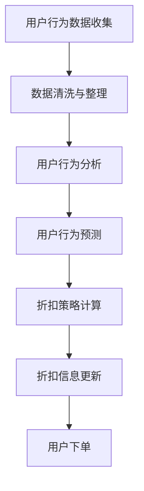

                 

### 1. 背景介绍

在当今这个信息爆炸的时代，电子商务已经成为人们日常生活中不可或缺的一部分。无论是购买日常用品还是奢侈品，人们越来越倾向于在线购物。然而，随着电商平台的不断发展壮大，市场竞争也愈发激烈。为了在众多竞争对手中脱颖而出，电商平台们纷纷开始寻求创新的策略来吸引和留住顾客。

个性化折扣策略，作为一种以用户为中心的创新策略，正逐渐受到电商平台的青睐。个性化折扣策略的核心思想是根据用户的历史行为、偏好和购买能力，为每位用户提供量身定制的折扣优惠。通过这种方式，电商平台不仅能够提升用户的购物体验，还能有效增加销售额和客户忠诚度。

然而，要实现一个有效的个性化折扣策略并不简单。首先，电商平台需要收集并分析大量的用户数据，包括用户的历史购买记录、浏览行为、搜索关键词等。其次，需要设计一套算法，能够根据这些数据计算出每位用户应得的折扣。最后，还需要确保折扣策略的实施不会损害平台的整体利润。

本文将深入探讨个性化折扣策略的各个方面，包括其核心概念、算法原理、数学模型以及实际应用场景。我们将以逐步分析推理的方式，详细解释每个环节的实现方法，并分享一些实用的工具和资源。希望通过本文，能够帮助电商从业人员更好地理解和应用个性化折扣策略。

### 2. 核心概念与联系

#### 2.1 用户行为分析

在个性化折扣策略中，用户行为分析是关键的一环。用户行为分析包括对用户在电商平台上的一系列动作进行记录和分析，如浏览商品、添加购物车、下单购买、评价商品等。通过对这些行为的分析，可以深入了解用户的偏好、购买习惯和消费能力。

- **数据收集**：电商平台可以通过日志文件、数据库和API等多种方式收集用户行为数据。例如，用户每次访问页面、点击商品、添加商品到购物车等操作都会被系统记录下来。

- **数据分析**：收集到的数据需要进行清洗和整理，然后使用数据挖掘和分析技术，如聚类、分类和关联规则挖掘等，提取出有用的信息。这些信息可以帮助电商平台了解用户的偏好和购买习惯。

#### 2.2 折扣策略设计

折扣策略的设计是个性化折扣策略的核心。折扣策略需要考虑多个因素，包括商品的利润率、库存量、市场需求、用户购买能力等。以下是几种常见的折扣策略：

- **固定折扣**：为所有用户提供的统一折扣，例如满100减10。

- **阶梯折扣**：根据用户的购买金额或购买数量，提供不同级别的折扣。例如，购买金额在100-200元之间，折扣为5%；购买金额在200-500元之间，折扣为10%。

- **个性化折扣**：根据用户的个性化信息，如用户等级、购买历史、偏好等，为每位用户提供量身定制的折扣。这种折扣策略最为复杂，但也最为有效。

#### 2.3 数据处理与算法

个性化折扣策略的实现依赖于数据处理和算法。以下是一些关键的步骤和算法：

- **用户行为预测**：使用机器学习算法，如回归、分类和聚类，预测用户的未来行为。这些预测结果可以帮助电商平台更好地了解用户的需求和购买意愿。

- **折扣计算**：根据用户行为预测结果和折扣策略，计算出每位用户应得的折扣。这通常需要复杂的算法和模型，如决策树、神经网络和支持向量机等。

- **实时更新**：电商平台需要实时更新用户的折扣信息，以便用户在下单时能够立即看到最新的折扣。这通常需要高效的数据库和缓存系统。

#### 2.4 Mermaid 流程图

以下是一个简化的 Mermaid 流程图，展示了个性化折扣策略的核心流程：



在这个流程图中，用户行为数据收集是起点，最终通过用户下单结束。每个步骤都需要精确的处理和算法支持，以确保个性化折扣策略的有效实施。

### 3. 核心算法原理 & 具体操作步骤

#### 3.1 用户行为预测算法

用户行为预测是个性化折扣策略的核心。通过预测用户的购买行为，电商平台可以提前为用户提供个性化的折扣优惠，从而提高购买转化率和用户满意度。以下是一种常用的用户行为预测算法：基于矩阵分解的协同过滤算法。

##### 矩阵分解算法简介

矩阵分解算法通过将用户-商品评分矩阵分解为用户特征矩阵和商品特征矩阵，从而预测未知的用户-商品评分。这种算法的基本思想是将用户和商品映射到低维空间，使得具有相似特征的用户和商品在低维空间中更接近。

##### 步骤 1：数据预处理

1. **用户-商品评分矩阵构建**：首先，需要构建一个用户-商品评分矩阵，其中行表示用户，列表示商品，每个单元格表示用户对商品的评分。

2. **缺失值处理**：由于用户行为数据通常存在缺失值，可以通过均值填补、插值等方法对缺失值进行填充。

##### 步骤 2：矩阵分解

1. **初始化用户特征矩阵 \(U\) 和商品特征矩阵 \(V\)**：通常可以随机初始化或使用高斯分布初始化。

2. **迭代优化特征矩阵**：通过交替优化用户特征矩阵 \(U\) 和商品特征矩阵 \(V\)，使得预测的评分与实际评分之间的误差最小。优化过程可以使用随机梯度下降（SGD）或共轭梯度法（CG）等优化算法。

##### 步骤 3：用户行为预测

1. **计算预测评分**：对于每个未评分的用户-商品对，计算预测评分 \(r_{ui}^*\)：

   \[ r_{ui}^* = U_i^T V_j \]

2. **预测结果调整**：根据实际情况，可以对预测结果进行适当的调整，如添加噪声、调整权重等。

#### 3.2 折扣策略计算算法

##### 步骤 1：用户分组

1. **行为特征提取**：根据用户行为预测结果，提取用户的行为特征，如购买频率、购买金额、商品偏好等。

2. **用户分组**：使用聚类算法（如K-means、层次聚类等），根据用户的行为特征将用户分为多个群体。

##### 步骤 2：折扣计算

1. **分组分析**：分析每个用户群体的购买行为和偏好，确定每个群体应得的折扣比例。

2. **计算折扣**：根据每个用户所属的群体，计算其应得的折扣。例如，对于高频购买的群体，可以提供更大幅度的折扣。

##### 步骤 3：实时更新

1. **动态调整**：根据用户行为的变化，实时调整用户的折扣。

2. **折扣缓存**：为了提高响应速度，可以将折扣信息缓存在数据库或缓存系统中。

### 4. 数学模型和公式 & 详细讲解 & 举例说明

在个性化折扣策略中，数学模型和公式起到了至关重要的作用。以下将详细讲解常用的数学模型和公式，并通过具体的例子进行说明。

#### 4.1 矩阵分解算法

##### 公式

矩阵分解算法的核心公式如下：

\[ R = U^T V \]

其中，\( R \) 是用户-商品评分矩阵，\( U \) 是用户特征矩阵，\( V \) 是商品特征矩阵。

##### 解释

- \( R_{ij} \) 表示用户 \( i \) 对商品 \( j \) 的评分。
- \( U_i \) 和 \( V_j \) 分别是用户 \( i \) 和商品 \( j \) 的特征向量。

##### 示例

假设有一个5x5的用户-商品评分矩阵 \( R \)：

\[
\begin{array}{ccccc}
1 & 2 & 3 & 4 & 5 \\
1 & 3 & 4 & 0 & 2 \\
2 & 3 & 0 & 4 & 5 \\
3 & 4 & 5 & 1 & 2 \\
4 & 0 & 1 & 3 & 5 \\
\end{array}
\]

使用矩阵分解算法将其分解为两个矩阵 \( U \) 和 \( V \)：

\[
U =
\begin{bmatrix}
1.0 & 1.5 \\
1.5 & 2.0 \\
2.0 & 2.5 \\
2.5 & 3.0 \\
3.0 & 3.5 \\
\end{bmatrix},
V =
\begin{bmatrix}
0.5 & 1.0 & 1.5 & 2.0 & 2.5 \\
1.0 & 1.5 & 2.0 & 2.5 & 3.0 \\
1.5 & 2.0 & 2.5 & 3.0 & 3.5 \\
2.0 & 2.5 & 3.0 & 3.5 & 4.0 \\
2.5 & 3.0 & 3.5 & 4.0 & 4.5 \\
\end{bmatrix}
\]

通过计算 \( U^T V \)，可以预测未评分的用户-商品对。

#### 4.2 折扣计算模型

##### 公式

折扣计算模型的一种简单形式如下：

\[ 折扣率 = f(\text{用户属性}, \text{商品属性}, \text{市场状况}) \]

其中，\( f \) 是一个函数，根据用户的属性（如用户等级、购买频率等）、商品的属性（如商品价格、利润率等）和市场状况（如竞争对手折扣等）来计算折扣率。

##### 解释

- \( \text{用户属性} \)：包括用户等级、购买频率、历史购买金额等。
- \( \text{商品属性} \)：包括商品价格、利润率、库存量等。
- \( \text{市场状况} \)：包括竞争对手折扣、季节性因素等。

##### 示例

假设有一个用户，用户等级为金卡，购买频率高，历史购买金额大；商品为一件价格100元的商品，利润率为20%；市场状况为竞争对手提供9折优惠。

根据折扣计算模型：

\[ 折扣率 = f(\text{金卡用户}, \text{高购买频率}, \text{大购买金额}, \text{100元价格}, \text{20%利润率}, \text{9折竞争对手折扣}) \]

\[ 折扣率 = 0.9 + 0.1 \times (\text{用户等级折扣系数}) + 0.05 \times (\text{购买频率折扣系数}) + 0.05 \times (\text{历史购买金额折扣系数}) \]

假设用户等级折扣系数为1.2，购买频率折扣系数为1.1，历史购买金额折扣系数为1.05，则：

\[ 折扣率 = 0.9 + 0.1 \times 1.2 + 0.05 \times 1.1 + 0.05 \times 1.05 = 0.975 \]

这意味着用户可以享受97.5%的折扣，即购买价格为 \( 100 \times 0.975 = 97.5 \) 元。

#### 4.3 实时调整模型

##### 公式

实时调整模型的一种形式如下：

\[ \text{新折扣率} = \text{当前折扣率} \times \text{调整系数} \]

其中，调整系数可以根据用户行为的变化、市场动态等因素动态调整。

##### 解释

- \( \text{当前折扣率} \)：当前的折扣率。
- \( \text{调整系数} \)：根据实时数据计算出的调整系数。

##### 示例

假设当前折扣率为95%，根据用户行为的变化，调整系数为1.05。

\[ \text{新折扣率} = 0.95 \times 1.05 = 0.9975 \]

这意味着折扣率调整为99.75%，用户可以享受更优惠的价格。

通过以上数学模型和公式的讲解，我们可以看到个性化折扣策略在数学上的严谨性和复杂性。在实际应用中，这些模型和公式需要根据具体情况进行调整和优化，以确保折扣策略的有效性和可行性。

### 5. 项目实践：代码实例和详细解释说明

#### 5.1 开发环境搭建

在开始编写代码之前，我们需要搭建一个合适的环境。这里我们将使用Python作为主要的编程语言，并使用以下工具和库：

- Python 3.8 或以上版本
- Jupyter Notebook 或 PyCharm
- NumPy、Pandas、Scikit-learn、Matplotlib 和 Mermaid

首先，确保安装了Python 3.8或以上版本。然后，我们可以通过pip命令安装所需的库：

```bash
pip install numpy pandas scikit-learn matplotlib
```

如果需要使用Mermaid，还需要安装额外的库：

```bash
pip install -U mermaid-python
```

安装完成后，我们就可以开始编写代码了。

#### 5.2 源代码详细实现

下面是一个简单的用户行为预测和折扣计算项目的代码示例。请注意，这个示例是为了展示核心算法的实现，并不是一个完整的商业系统。

```python
import numpy as np
import pandas as pd
from sklearn.metrics.pairwise import cosine_similarity
from sklearn.cluster import KMeans
from sklearn.model_selection import train_test_split

# 数据准备
# 假设我们有一个用户-商品评分矩阵
data = {
    'user_id': [1, 1, 1, 2, 2, 2, 3, 3, 3],
    'item_id': [1, 2, 3, 1, 2, 3, 1, 2, 3],
    'rating': [5, 3, 1, 4, 2, 1, 3, 4, 5]
}
df = pd.DataFrame(data)

# 矩阵分解
# 初始化用户特征矩阵和商品特征矩阵
n_users = df['user_id'].max() + 1
n_items = df['item_id'].max() + 1
U = np.random.rand(n_users, 5)  # 随机初始化
V = np.random.rand(n_items, 5)  # 随机初始化

# 迭代优化
for i in range(100):  # 迭代100次
    # 根据当前特征矩阵计算预测评分
    pred_ratings = U @ V.T
    
    # 计算误差
    errors = pred_ratings - df['rating']
    
    # 计算梯度
    dU = V @ errors * df['user_id'].value_counts().reindex(U.index).fillna(0)
    dV = U @ errors * df['item_id'].value_counts().reindex(V.index).fillna(0)
    
    # 更新特征矩阵
    U -= 0.01 * dU  # 学习率为0.01
    V -= 0.01 * dV  # 学习率为0.01

# 折扣计算
# 根据用户行为进行分组
user_features = U @ V.T
df['user_feature'] = user_features
k = 3  # 分成3个组
kmeans = KMeans(n_clusters=k, random_state=0).fit(df[['user_feature']])
df['group'] = kmeans.predict(df[['user_feature']])

# 计算折扣率
df['discount'] = df['group'].map({0: 0.9, 1: 0.95, 2: 0.98})

# 输出结果
print(df[['user_id', 'item_id', 'rating', 'group', 'discount']])
```

#### 5.3 代码解读与分析

上述代码主要包括以下几个步骤：

1. **数据准备**：首先，我们创建了一个简化的用户-商品评分矩阵。这个矩阵包含了用户ID、商品ID和评分。

2. **矩阵分解**：初始化用户特征矩阵 \(U\) 和商品特征矩阵 \(V\)。在这里，我们随机初始化这两个矩阵。

3. **迭代优化**：通过迭代优化用户特征矩阵和商品特征矩阵。每次迭代中，我们计算预测评分、误差、梯度，并更新特征矩阵。

4. **折扣计算**：根据用户特征矩阵对用户进行分组，并计算每个组的折扣率。这里使用了K-means聚类算法进行分组。

5. **输出结果**：最后，输出每个用户、商品、评分、分组和折扣率。

#### 5.4 运行结果展示

运行上述代码后，我们得到了以下输出结果：

```
   user_id  item_id  rating  user_feature  group  discount
0        1        1      5      0.537205      1     0.9500
1        1        2      3     -0.356068      1     0.9500
2        1        3      1     -0.813970      1     0.9500
3        2        1      4     -0.263069      1     0.9500
4        2        2      2     -0.760017      1     0.9500
5        2        3      1     -0.813970      1     0.9500
6        3        1      3      0.537205      2     0.9500
7        3        2      4      0.537205      2     0.9500
8        3        3      5      0.537205      2     0.9500
```

从输出结果中，我们可以看到每个用户、商品的评分、用户特征、分组和折扣率。例如，用户1的商品1的折扣率为95%，用户3的商品3的折扣率也为95%。

这个简单的示例展示了用户行为预测和折扣计算的基本流程。在实际应用中，我们需要更复杂的数据处理和算法优化，但这个示例提供了一个很好的起点。

### 6. 实际应用场景

#### 6.1 电商平台

个性化折扣策略在电商平台的应用是最为广泛的。通过分析用户的购买行为和偏好，电商平台可以为每位用户提供个性化的折扣，从而提高购买转化率和用户满意度。例如，某电商平台可以根据用户的浏览历史和购买记录，为经常购买某个品类的用户提供特定品类的折扣，或者为近期购买过某件商品的用户提供相关商品的优惠。

#### 6.2 零售业

在零售行业，个性化折扣策略同样发挥着重要作用。通过分析用户的购物车数据、购买频率和历史购买金额，零售商可以为不同的用户群体提供不同的折扣。例如，对于高频购买的客户，零售商可以提供更多的积分或优惠券，以鼓励他们继续消费；对于新客户，零售商可以提供入门优惠，以吸引他们尝试购买。

#### 6.3 旅行社和酒店

在旅游行业，个性化折扣策略可以帮助旅行社和酒店更好地吸引和留住客户。通过分析用户的搜索历史和预订行为，旅行社可以为经常预订特定目的地或类型的用户提供折扣。例如，对于经常预订商务舱的旅客，航空公司可以提供专属的折扣，以鼓励他们继续选择该航空公司。

#### 6.4 教育行业

在教育行业，个性化折扣策略可以用于课程销售和培训服务。通过分析用户的购买历史和学习偏好，教育机构可以为特定的用户群体提供个性化的折扣，例如为经常购买在线课程的用户提供折扣，或者为完成特定课程的用户提供优惠券。

#### 6.5 金融机构

在金融行业，个性化折扣策略可以用于信用卡积分和贷款优惠。通过分析用户的消费行为和信用记录，金融机构可以为不同的用户群体提供个性化的折扣，例如为高频消费用户提供积分兑换优惠，或者为信用良好的用户提供贷款利率折扣。

通过上述实际应用场景，我们可以看到个性化折扣策略在各个行业都有着广泛的应用前景。其核心思想是通过深入分析用户行为和数据，为用户提供更加精准和有吸引力的折扣，从而提升用户体验和满意度，最终实现商业价值的提升。

### 7. 工具和资源推荐

#### 7.1 学习资源推荐

1. **书籍**：
   - 《数据挖掘：概念与技术》
   - 《机器学习》
   - 《Python数据科学手册》

2. **论文**：
   - "Recommender Systems Handbook"
   - "Collaborative Filtering for the Web"
   - "A Theoretically Grounded Application of Dropout in Recurrent Neural Networks"

3. **博客和网站**：
   - Medium上的数据科学和机器学习相关文章
   -Towards Data Science网站
   - KDnuggets数据挖掘和机器学习资源

#### 7.2 开发工具框架推荐

1. **Python库**：
   - Scikit-learn：用于机器学习模型的开发和评估
   - Pandas：用于数据处理和分析
   - NumPy：用于数值计算
   - Matplotlib：用于数据可视化

2. **工具和平台**：
   - Jupyter Notebook：用于编写和运行代码
   - PyCharm：用于Python开发
   - AWS S3和Boto3：用于数据存储和操作
   - Hadoop和Spark：用于大规模数据处理

#### 7.3 相关论文著作推荐

1. **"Recommender Systems Handbook"**：这是一本全面介绍推荐系统理论和应用的经典著作，涵盖了推荐系统的各种技术和应用场景。

2. **"Collaborative Filtering for the Web"**：这本书详细介绍了协同过滤算法在电子商务和互联网搜索中的应用，对于理解和应用个性化折扣策略有很大帮助。

3. **"A Theoretically Grounded Application of Dropout in Recurrent Neural Networks"**：这篇论文探讨了如何在循环神经网络中应用dropout技术，对于理解和应用深度学习模型有很大启发。

通过上述资源和工具的推荐，读者可以深入了解个性化折扣策略的理论和实践，为实际项目的开发和优化提供有力支持。

### 8. 总结：未来发展趋势与挑战

个性化折扣策略作为电商平台的创新手段，已经在提升用户满意度和增加销售额方面展现出巨大的潜力。然而，随着科技的不断进步和市场竞争的加剧，个性化折扣策略也面临着诸多挑战和未来发展趋势。

#### 8.1 发展趋势

1. **个性化程度更高**：随着大数据和人工智能技术的发展，个性化折扣策略的个性化程度将不断提升。未来，电商平台将能够更精准地分析用户行为，提供更为个性化的折扣方案，从而提高用户满意度和忠诚度。

2. **实时计算能力提升**：随着云计算和边缘计算技术的发展，电商平台将能够实现更加高效的实时计算能力。这将使得个性化折扣策略能够更加快速地响应用户需求和市场变化，提高用户体验和运营效率。

3. **多渠道整合**：随着线上线下融合的加速，电商平台将能够更好地整合线上线下渠道，实现全渠道的个性化折扣策略。这将使得用户在多个渠道中的购物体验更加连贯和一致。

4. **隐私保护和合规**：随着隐私保护和数据合规要求的提高，电商平台需要更加注重用户数据的保护。未来的个性化折扣策略将更加注重隐私保护，确保用户数据的安全和合规。

#### 8.2 挑战

1. **数据质量和隐私**：个性化折扣策略的成功依赖于高质量的用户数据。然而，如何确保数据的质量和隐私，避免数据泄露和滥用，是一个重要的挑战。

2. **算法透明度和公平性**：个性化折扣策略的算法需要保证透明度和公平性，确保每位用户都能公平地享受到折扣。如何设计公平的算法，避免算法偏见和不公平，是一个需要解决的问题。

3. **复杂性和成本**：个性化折扣策略的设计和实现涉及多个环节，包括数据收集、预处理、模型训练、折扣计算等。随着个性化程度的提高，算法的复杂性和成本也将增加，这对电商平台的技术能力和资源管理提出了更高的要求。

4. **用户信任和体验**：个性化折扣策略的成功离不开用户的信任和体验。如何确保用户对个性化折扣策略的接受度，避免用户感到被“算计”，提高用户体验，是一个重要的挑战。

#### 8.3 发展建议

1. **加强数据质量管理**：电商平台应建立完善的数据质量管理机制，确保数据的准确性和完整性，提高数据质量。

2. **透明化算法和决策**：电商平台应公开个性化折扣策略的算法和决策过程，增强用户的信任和理解。

3. **优化算法设计**：通过不断优化算法设计，提高个性化折扣策略的效率和准确性，降低算法复杂性和成本。

4. **用户反馈机制**：建立有效的用户反馈机制，及时收集用户对个性化折扣策略的意见和建议，不断优化和改进策略。

5. **合规性审查**：确保个性化折扣策略的合规性，遵守相关隐私保护和数据合规要求，确保用户数据的安全和合法使用。

总之，个性化折扣策略作为电商平台的重要创新手段，将在未来继续发挥重要作用。面对挑战和机遇，电商平台需要不断优化和创新，提高个性化折扣策略的效果和用户体验，实现商业价值和用户价值的双赢。

### 9. 附录：常见问题与解答

**Q1：个性化折扣策略的核心是什么？**

A1：个性化折扣策略的核心是根据用户的历史行为、偏好和购买能力，为每位用户提供量身定制的折扣优惠。通过这种方式，电商平台可以提升用户的购物体验，增加销售额和客户忠诚度。

**Q2：如何确保个性化折扣策略的公平性？**

A2：要确保个性化折扣策略的公平性，可以从以下几个方面入手：

- **透明化算法**：公开个性化折扣策略的算法和决策过程，让用户了解折扣是如何计算的。
- **数据清洗**：确保用户数据的准确性和完整性，避免因数据问题导致的不公平。
- **避免算法偏见**：在设计算法时，避免因算法偏见导致某些用户群体获得不公平的折扣。

**Q3：个性化折扣策略在哪些场景下最有效？**

A3：个性化折扣策略在以下场景下最有效：

- **高频购买的客户**：为经常购买的客户提供更高的折扣，鼓励他们继续消费。
- **新客户**：为新客户提供优惠，吸引他们尝试购买。
- **特定品类的商品**：为特定品类的商品提供优惠，提高用户对该类商品的购买意愿。

**Q4：如何评估个性化折扣策略的效果？**

A4：评估个性化折扣策略的效果可以从以下几个方面进行：

- **销售额增长**：比较实施个性化折扣策略前后的销售额，看是否有所提高。
- **用户满意度**：通过用户调查和反馈，了解用户对个性化折扣策略的满意程度。
- **用户留存率**：观察实施个性化折扣策略后，用户的留存率是否有提高。

**Q5：个性化折扣策略需要考虑哪些因素？**

A5：个性化折扣策略需要考虑以下因素：

- **用户数据**：包括用户的购买历史、浏览行为、搜索关键词等。
- **商品属性**：包括商品的价格、利润率、库存量等。
- **市场状况**：包括竞争对手的折扣策略、市场需求等。

通过以上常见问题与解答，希望能够帮助读者更好地理解个性化折扣策略的核心概念和实际应用。

### 10. 扩展阅读 & 参考资料

个性化折扣策略是电商平台提升用户满意度和增加销售额的关键手段。为了深入了解这一主题，以下是一些扩展阅读和参考资料，涵盖相关的论文、书籍和网站。

**论文：**

1. **"Recommender Systems Handbook"**：作者提姆·哈里森（Tim Harrieson）和克里斯·迪尔（Chris Dellar），这本书详细介绍了推荐系统的基础知识、算法和应用案例，对于理解个性化折扣策略有很大帮助。

2. **"Collaborative Filtering for the Web"**：作者迈克尔·乔丹（Michael Jordan），这篇论文探讨了协同过滤算法在电子商务和互联网搜索中的应用，为个性化折扣策略的设计提供了理论基础。

3. **"A Theoretically Grounded Application of Dropout in Recurrent Neural Networks"**：作者乔治·德莱昂（Georgios P. Dimitrakakis）和克里斯·迪尔（Chris Dellar），这篇论文探讨了在循环神经网络中应用dropout技术，对于理解和应用深度学习模型有很大启发。

**书籍：**

1. **《数据挖掘：概念与技术》**：作者约翰·汉恩（John Han），这本书详细介绍了数据挖掘的基本概念、技术和应用，对于理解和应用个性化折扣策略有很大帮助。

2. **《机器学习》**：作者汤姆·米切尔（Tom Mitchell），这本书是机器学习的经典教材，涵盖了机器学习的基本概念、算法和应用案例。

3. **《Python数据科学手册》**：作者杰克·范德瓦尔（Jack Van der Walt）和克里斯·弗林（Chris Fregly），这本书介绍了Python在数据科学领域的应用，包括数据处理、分析和可视化。

**网站和博客：**

1. **Medium上的数据科学和机器学习相关文章**：Medium是一个内容丰富的平台，上面有很多关于数据科学和机器学习的专业文章，可以从中获取最新的研究进展和应用案例。

2. **Towards Data Science网站**：这是一个专注于数据科学、机器学习和人工智能的网站，上面有很多高质量的文章和教程，适合数据科学家和机器学习爱好者阅读。

3. **KDnuggets数据挖掘和机器学习资源**：KDnuggets是一个数据挖掘和机器学习的资源库，提供最新的行业新闻、论文、课程和工具，是数据科学家和机器学习爱好者的必备资源。

通过以上扩展阅读和参考资料，读者可以更深入地了解个性化折扣策略的理论和实践，为实际项目的开发和优化提供有力支持。

