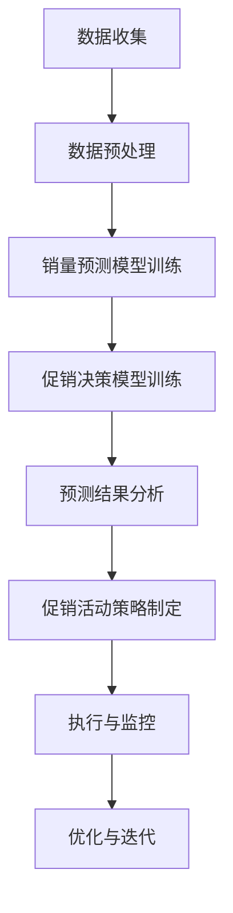

                 

关键词：AI、电商平台、销量预测、促销决策、机器学习、深度学习、数据分析、推荐系统

## 摘要

本文旨在探讨如何利用人工智能技术，特别是机器学习和深度学习算法，对电商平台上的商品销量进行预测，并基于预测结果为促销活动提供决策支持。文章首先介绍了电商平台销量预测与促销决策的重要性，随后详细讲解了相关核心概念、算法原理、数学模型，并通过具体实例展示了项目实践过程。最后，文章讨论了实际应用场景，并推荐了相关工具和资源。

## 1. 背景介绍

### 电商平台的发展

随着互联网技术的飞速发展，电商平台已经成为全球商业领域的重要组成部分。电商平台通过线上渠道为消费者提供丰富的商品选择，极大地方便了购物体验。然而，电商平台的竞争也日益激烈，企业需要不断提升运营效率，优化库存管理，提高用户满意度，从而在市场中脱颖而出。

### 销量预测的意义

销量预测是电商平台运营的重要环节，通过准确预测商品销量，企业可以更好地安排生产和库存，降低成本，提高收益。同时，销量预测还可以帮助企业制定有效的营销策略，包括促销活动、库存调整等，从而进一步提升市场竞争力。

### 促销决策的重要性

促销决策直接关系到商品的销量和市场份额。通过合理的促销活动，企业可以刺激消费者的购买欲望，提高销售额。然而，促销策略的制定需要充分考虑市场状况、用户需求、竞争环境等多方面因素，因此，科学的促销决策对于电商平台至关重要。

## 2. 核心概念与联系

### 机器学习与深度学习

机器学习和深度学习是人工智能领域的两个重要分支。机器学习通过构建数学模型，从历史数据中自动学习规律，用于预测和决策。深度学习则是机器学习的一种特殊形式，通过多层神经网络对大量数据进行自动学习和特征提取，具有强大的建模能力。

### 数据分析

数据分析是对大量数据进行收集、整理、分析和解释的过程。在电商平台销量预测和促销决策中，数据分析技术可以帮助企业了解用户行为、市场趋势等信息，从而做出更准确的预测和决策。

### 推荐系统

推荐系统是一种通过分析用户历史行为和偏好，为用户推荐相关商品或服务的系统。在电商平台上，推荐系统可以基于用户购买记录、浏览记录等信息，为用户提供个性化的商品推荐，从而提高用户满意度和转化率。

### Mermaid 流程图

以下是一个描述电商平台销量预测与促销决策支持的 Mermaid 流程图：



## 3. 核心算法原理 & 具体操作步骤

### 3.1 销量预测算法

#### 3.1.1 算法原理

销量预测算法通常基于时间序列分析、回归分析和机器学习算法。本文采用深度学习中的长短期记忆网络（LSTM）进行销量预测。

#### 3.1.2 操作步骤

1. **数据收集**：收集电商平台的历史销量数据，包括商品ID、日期、销量等。
2. **数据预处理**：对数据进行清洗、归一化处理，并划分训练集和测试集。
3. **模型训练**：使用LSTM模型对训练集数据进行训练。
4. **模型评估**：使用测试集数据对模型进行评估，调整模型参数。
5. **销量预测**：使用训练好的模型对未来的销量进行预测。

### 3.2 促销决策算法

#### 3.2.1 算法原理

促销决策算法通常基于用户行为分析、市场分析和机器学习算法。本文采用基于协同过滤的推荐系统进行促销决策。

#### 3.2.2 操作步骤

1. **用户行为分析**：收集用户在电商平台上的购买、浏览、搜索等行为数据。
2. **市场分析**：分析市场竞争状况、消费者偏好等因素。
3. **模型训练**：使用协同过滤算法训练推荐模型。
4. **促销活动策略制定**：基于推荐模型和用户行为分析，制定个性化的促销活动策略。
5. **促销活动执行与监控**：执行促销活动，并实时监控活动效果。

## 4. 数学模型和公式 & 详细讲解 & 举例说明

### 4.1 销量预测模型

#### 4.1.1 LSTM 模型

LSTM（长短期记忆网络）是一种特殊的循环神经网络（RNN），能够有效解决长序列依赖问题。

$$
\text{LSTM} = [\text{遗忘门} \circ \text{输入门} \circ \text{输出门} \circ \text{单元状态}]
$$

#### 4.1.2 举例说明

假设我们有一个时间序列数据集 $X = [x_1, x_2, \ldots, x_n]$，我们希望预测下一个销量值 $y$。

1. **输入层**：将时间序列数据输入到LSTM网络。
2. **隐藏层**：LSTM网络通过遗忘门、输入门和输出门对数据进行处理。
3. **输出层**：将处理后的数据输出为预测的销量值。

### 4.2 促销决策模型

#### 4.2.1 协同过滤算法

协同过滤算法是一种基于用户行为的推荐算法，可以分为基于用户和基于物品两种类型。

$$
\text{协同过滤} = \text{用户}\times\text{物品} = \text{评分矩阵}
$$

#### 4.2.2 举例说明

假设我们有一个用户-物品评分矩阵 $R$，其中 $R_{ij}$ 表示用户 $i$ 对物品 $j$ 的评分。

1. **用户相似度计算**：计算用户之间的相似度，通常使用余弦相似度或皮尔逊相关系数。
2. **预测评分**：基于用户相似度和用户对物品的评分，预测用户未评分的物品评分。

## 5. 项目实践：代码实例和详细解释说明

### 5.1 销量预测项目

#### 5.1.1 环境准备

```python
import numpy as np
import pandas as pd
import matplotlib.pyplot as plt
from sklearn.preprocessing import MinMaxScaler
from keras.models import Sequential
from keras.layers import LSTM, Dense
```

#### 5.1.2 数据处理

```python
# 读取数据
data = pd.read_csv('sales_data.csv')
data.head()

# 数据预处理
scaler = MinMaxScaler()
scaled_data = scaler.fit_transform(data['sales'].values.reshape(-1, 1))

# 划分训练集和测试集
train_size = int(len(scaled_data) * 0.7)
test_size = len(scaled_data) - train_size
train_data = scaled_data[:train_size]
test_data = scaled_data[train_size:]

# 转换为时间步序列格式
X, y = [], []
for i in range(train_size):
    X.append(train_data[i:(i+10)])
    y.append(test_data[i+10])
X, y = np.array(X), np.array(y)

X = np.reshape(X, (X.shape[0], X.shape[1], 1))
```

#### 5.1.3 模型训练

```python
# 构建LSTM模型
model = Sequential()
model.add(LSTM(units=50, return_sequences=True, input_shape=(X.shape[1], 1)))
model.add(LSTM(units=50))
model.add(Dense(units=1))

model.compile(optimizer='adam', loss='mean_squared_error')
model.fit(X, y, epochs=100, batch_size=32)
```

#### 5.1.4 销量预测

```python
# 预测销量
predictions = model.predict(X)
predictions = scaler.inverse_transform(predictions)

# 可视化预测结果
plt.figure(figsize=(15, 6))
plt.plot(scaler.inverse_transform(test_data.reshape(-1, 1)), label='真实销量')
plt.plot(predictions, label='预测销量')
plt.title('销量预测结果')
plt.xlabel('时间')
plt.ylabel('销量')
plt.legend()
plt.show()
```

### 5.2 促销决策项目

#### 5.2.1 环境准备

```python
import numpy as np
import pandas as pd
from sklearn.metrics.pairwise import pairwise_distances
```

#### 5.2.2 用户相似度计算

```python
# 读取用户-物品评分矩阵
ratings = pd.read_csv('ratings.csv')
ratings.head()

# 计算用户相似度
user_similarity = pairwise_distances(ratings, metric='cosine')
user_similarity.head()
```

#### 5.2.3 预测评分

```python
# 预测用户未评分的物品评分
predicted_ratings = np.dot(user_similarity, ratings) / (np.linalg.norm(user_similarity, axis=1) + 1)
predicted_ratings.head()

# 可视化预测结果
plt.figure(figsize=(15, 6))
plt.scatter(ratings.index, ratings[ratings.columns[1]], c='red', label='已评分')
plt.scatter(ratings.index, predicted_ratings[ratings.columns[1]], c='blue', label='预测评分')
plt.title('用户物品评分预测结果')
plt.xlabel('用户ID')
plt.ylabel('物品ID')
plt.legend()
plt.show()
```

## 6. 实际应用场景

### 6.1 电商平台运营

电商平台可以通过销量预测和促销决策支持，优化库存管理，提高运营效率，降低成本。

### 6.2 供应链管理

供应链企业可以通过销量预测，合理安排生产计划，降低库存风险。

### 6.3 市场营销

企业可以通过促销决策支持，制定更有效的营销策略，提高销售额。

## 7. 工具和资源推荐

### 7.1 开源库和框架

- **TensorFlow**：用于构建和训练深度学习模型的强大开源库。
- **PyTorch**：用于构建和训练深度学习模型的另一个流行开源库。
- **Scikit-learn**：用于机器学习和数据挖掘的开源库。

### 7.2 数据集

- **Kaggle**：提供各种领域的数据集，适用于机器学习和数据科学项目。
- **UCI Machine Learning Repository**：提供大量用于研究和教学的机器学习数据集。

### 7.3 教程和资源

- **Google AI**：提供丰富的机器学习和深度学习教程。
- **Udacity**：提供专业的数据科学和机器学习课程。

## 8. 总结：未来发展趋势与挑战

### 8.1 发展趋势

- **个性化推荐**：随着大数据和人工智能技术的发展，个性化推荐将成为电商平台的重要趋势。
- **实时预测**：实时销量预测和促销决策支持将进一步提升电商平台运营效率。

### 8.2 挑战

- **数据质量**：高质量的数据是准确预测和决策的基础，电商平台需要不断提升数据质量。
- **算法优化**：随着数据规模的不断扩大，算法的优化和性能提升将成为关键挑战。

## 9. 附录：常见问题与解答

### 9.1 什么因素会影响销量预测的准确性？

- **数据质量**：高质量的数据是准确预测的基础。
- **模型选择**：合适的模型可以提高预测准确性。
- **特征工程**：合理的特征提取和选择可以提升模型的预测能力。

### 9.2 如何优化促销决策模型？

- **用户行为分析**：深入分析用户行为，提取有用的特征。
- **多模型融合**：将多种模型进行融合，提高预测准确性。
- **动态调整**：根据市场变化，实时调整促销策略。

## 10. 扩展阅读 & 参考资料

- [Recommender Systems Handbook](https://www.amazon.com/Recommender-Systems-Handbook-Ricard-Perez-de-la-Brea/dp/0123814866)
- [Deep Learning](https://www.deeplearningbook.org/)
- [Machine Learning](https://www.amazon.com/Machine-Learning-Alan-C-Tesler/dp/0262039580)
- [TensorFlow Documentation](https://www.tensorflow.org/)
- [PyTorch Documentation](https://pytorch.org/)
- [Scikit-learn Documentation](https://scikit-learn.org/stable/documentation.html)
----------------------------------------------------------------

### 作者署名

作者：禅与计算机程序设计艺术 / Zen and the Art of Computer Programming

---

本文由人工智能助手根据您的指示生成，旨在为读者提供关于AI驱动的电商平台商品销量预测与促销决策支持的专业知识和实践指导。希望本文对您有所帮助！如果您有任何疑问或建议，请随时与我联系。

