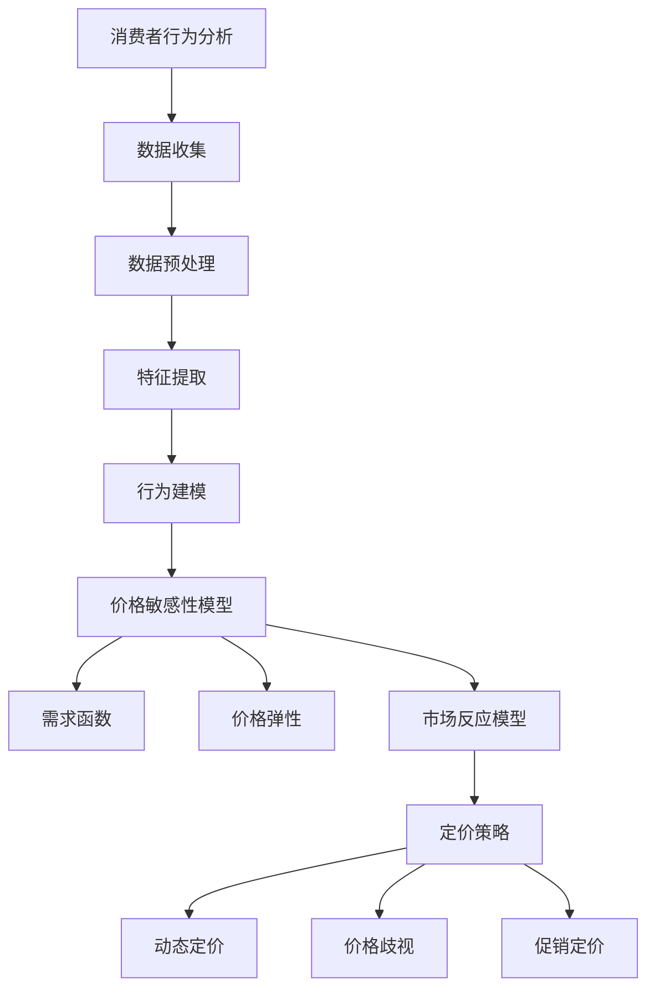

                 

### 背景介绍 Background Introduction

随着电子商务的迅猛发展，消费者对个性化体验的需求日益增长，这推动了电商平台在价格策略上从传统的一刀切定价模式向实时个性化定价模式的转变。实时个性化定价系统不仅能够根据消费者的行为和偏好来调整价格，还可以在竞争激烈的市场环境中提高盈利能力，提升客户满意度。本文将深入探讨AI驱动的电商平台实时个性化定价系统，从背景介绍、核心概念与联系、算法原理与操作步骤、数学模型与公式、项目实践、实际应用场景、工具和资源推荐、总结和扩展阅读等多个方面，为读者提供全面的了解。

### 1.1 电商市场的现状

电子商务市场在过去几十年里经历了巨大的变革。根据eMarketer的数据，全球电子商务销售额在2022年已达到约4.89万亿美元，预计到2026年将突破7万亿美元。这个增长势头表明，电子商务已经成为全球商业活动的重要组成部分。随着市场的扩大和消费者行为的多样化，电商平台面临着越来越激烈的竞争。如何在这场竞争中脱颖而出，成为电商平台亟待解决的问题。

传统的电商定价模式通常基于成本加成或竞争对手定价策略，这种方式虽然简单易行，但在个性化需求日益凸显的今天，已经难以满足消费者的期望。消费者希望能够根据自己的需求和偏好，享受到定制化的购物体验，包括价格定制。因此，电商平台需要寻找更加智能化的定价策略，以提升用户满意度和忠诚度。

### 1.2 实时个性化定价的意义

实时个性化定价系统结合了大数据分析和人工智能技术，通过对消费者行为的深入分析，实时调整价格策略。这种定价方式不仅能够提高销售额，还能优化库存管理，降低营销成本。以下是实时个性化定价系统的几大意义：

- **提高销售额**：通过精确的价格调整，电商平台可以吸引更多的消费者，提高购买转化率。
- **优化库存管理**：实时定价系统能够根据销售数据和库存状况，动态调整价格，避免过度库存或缺货情况。
- **降低营销成本**：个性化定价减少了大规模营销活动的需求，从而降低了营销成本。
- **提升客户满意度**：个性化定价能够满足消费者的个性化需求，提升购物体验，增强客户忠诚度。

### 1.3 人工智能与电商定价的结合

人工智能技术在电商定价中的应用主要体现在两个方面：一是数据分析和处理能力的提升，二是决策模型的优化。

首先，人工智能技术通过大数据分析，能够挖掘出消费者行为中的细微特征，例如购买习惯、浏览行为、反馈信息等，从而为个性化定价提供数据支持。传统的分析手段难以处理如此庞大的数据量，而人工智能算法能够在短时间内完成复杂的分析任务，为定价决策提供精准的依据。

其次，人工智能技术可以优化决策模型。传统的定价策略通常基于经验和历史数据，而人工智能能够通过机器学习和深度学习等技术，不断优化定价模型，使其更加适应实时市场变化。例如，基于消费者行为的动态定价算法，可以根据消费者的实时反馈，自动调整价格，以实现最佳收益。

总之，实时个性化定价系统在电商领域的应用，不仅能够提升运营效率，还能为消费者带来更加个性化的购物体验，从而在激烈的市场竞争中占据优势地位。

### 1.4 本文结构概述

本文将从以下几个方面详细探讨AI驱动的电商平台实时个性化定价系统：

- **2. 核心概念与联系**：介绍实时个性化定价系统中的核心概念，包括消费者行为分析、价格敏感性模型和定价策略等，并使用Mermaid流程图展示系统架构。
- **3. 核心算法原理 & 具体操作步骤**：阐述实时个性化定价系统的核心算法原理，包括数据收集、处理和模型训练，并详细描述每一步的操作步骤。
- **4. 数学模型和公式 & 详细讲解 & 举例说明**：介绍系统中使用的数学模型和公式，包括需求函数、价格敏感性和利润最大化等，并通过实例说明这些模型的实际应用。
- **5. 项目实践：代码实例和详细解释说明**：提供具体的项目实践案例，包括开发环境搭建、源代码实现、代码解读和运行结果展示，使读者能够更好地理解系统的实际应用。
- **6. 实际应用场景**：探讨实时个性化定价系统在不同电商场景中的具体应用，包括库存管理、促销活动和客户关系管理等。
- **7. 工具和资源推荐**：推荐学习资源和开发工具，包括书籍、论文、博客和网站等，帮助读者进一步深入了解相关技术。
- **8. 总结：未来发展趋势与挑战**：总结实时个性化定价系统的发展趋势和面临的主要挑战，为读者提供未来研究方向。
- **9. 附录：常见问题与解答**：解答读者在阅读本文过程中可能遇到的问题。
- **10. 扩展阅读 & 参考资料**：提供扩展阅读材料，包括相关论文、书籍和网站等，帮助读者进一步深入研究。

通过本文的详细探讨，读者将能够全面了解AI驱动的电商平台实时个性化定价系统的原理、实践和应用，为其在电商领域的深入研究和实际应用提供有力支持。

### 2. 核心概念与联系 Core Concepts and Relationships

在探讨AI驱动的电商平台实时个性化定价系统之前，我们需要明确几个核心概念，这些概念是系统运作的基础。核心概念包括消费者行为分析、价格敏感性模型和定价策略。接下来，我们将通过Mermaid流程图来展示这些概念之间的联系和系统架构。

#### 2.1 消费者行为分析

消费者行为分析是实时个性化定价系统的基石。通过分析消费者的购买历史、浏览记录、搜索行为和社交媒体活动，我们可以了解消费者的偏好和需求。消费者行为分析涉及以下几个关键步骤：

1. **数据收集**：收集消费者在不同渠道的活动数据，如网站点击流、购买记录和用户反馈。
2. **数据预处理**：清洗和整合数据，去除噪声和不一致的数据，以确保数据质量。
3. **特征提取**：从原始数据中提取能够反映消费者行为的关键特征，如购买频率、浏览时间、搜索关键词等。
4. **行为建模**：使用机器学习算法，如聚类、分类和回归分析，建立消费者行为模型，预测消费者未来的行为。

#### 2.2 价格敏感性模型

价格敏感性模型用于评估消费者对价格变化的反应。通过分析历史销售数据和市场反应，我们可以确定不同价格水平下消费者的需求量。价格敏感性模型的关键要素包括：

1. **需求函数**：描述价格与需求量之间的关系。典型的需求函数为线性或非线性函数，如线性需求函数 $Q(p) = a - bp$，其中 $Q$ 是需求量，$p$ 是价格，$a$ 和 $b$ 是参数。
2. **价格弹性**：衡量价格变动对需求量的影响程度。价格弹性 $E$ 定义为需求量变化百分比与价格变化百分比的比值，即 $E = \frac{\partial Q / Q}{\partial p / p}$。
3. **市场反应模型**：通过分析历史数据，建立价格与市场需求量之间的定量关系模型，预测不同价格水平下的市场需求。

#### 2.3 定价策略

定价策略是基于消费者行为分析和价格敏感性模型制定的具体价格调整方案。常见的定价策略包括：

1. **动态定价**：根据实时数据，动态调整价格，以最大化收益或市场份额。动态定价算法如需求响应定价、竞争响应定价等。
2. **价格歧视**：根据消费者的价格敏感性，对不同消费者群体实施不同价格。例如，基于会员等级、地域或购买历史的价格歧视。
3. **促销定价**：在特定时期或针对特定商品进行价格优惠，以刺激销售。例如，节假日促销、限时折扣等。

#### 2.4 Mermaid流程图展示

下面是一个Mermaid流程图，展示了上述核心概念之间的联系和系统架构：



这个流程图清晰地展示了从消费者行为分析到定价策略的整个过程，每个步骤都依赖于前面的步骤，形成了一个闭环系统。通过这种系统化的方法，电商平台可以实现实时个性化定价，提高运营效率和用户满意度。

### 3. 核心算法原理 & 具体操作步骤 Core Algorithm Principles and Step-by-Step Operations

在了解了实时个性化定价系统的核心概念和联系后，接下来我们将深入探讨其核心算法原理和具体操作步骤。核心算法包括数据收集、处理和模型训练，以下是详细的步骤说明：

#### 3.1 数据收集

数据收集是构建实时个性化定价系统的基础。我们需要收集多种类型的数据，包括：

1. **消费者行为数据**：这包括消费者的购买历史、浏览记录、搜索关键词和点击流数据。这些数据可以通过电商平台的后台系统或第三方数据分析服务获取。
   
2. **市场数据**：这包括竞争对手的价格、销售数据和市场需求变化。这些数据可以通过市场调研、价格监控工具或公共数据源获取。

3. **环境数据**：这包括季节、节假日、天气等外部环境因素，这些因素会影响消费者的购买决策。这些数据可以从气象服务、公共数据库或自定义数据源获取。

#### 3.2 数据预处理

数据预处理是确保数据质量和一致性的重要步骤。具体包括以下操作：

1. **数据清洗**：去除重复数据、缺失值和异常值，确保数据完整性。
   
2. **数据整合**：将不同来源的数据整合到一个统一的数据仓库中，以便后续处理和分析。

3. **数据转换**：将数据转换为适合分析和建模的格式，如将文本数据转换为数值表示，或对时序数据进行归一化处理。

4. **特征工程**：根据业务需求，提取有助于预测的变量，如消费者购买频率、平均购买金额等。

#### 3.3 模型训练

在数据预处理完成后，我们开始构建和训练定价模型。以下是具体的步骤：

1. **模型选择**：选择合适的机器学习模型，如线性回归、决策树、支持向量机（SVM）或神经网络。根据数据的特点和业务需求，可以选择单一模型或结合多种模型。

2. **参数调优**：通过交叉验证和网格搜索等技术，调整模型的参数，找到最优参数组合。

3. **模型训练**：使用预处理后的数据对模型进行训练。训练过程中，模型会根据历史数据学习价格与需求量之间的关系。

4. **模型评估**：使用验证集和测试集评估模型的性能，如通过均方误差（MSE）、准确率（Accuracy）或AUC（Area Under Curve）等指标。

5. **模型部署**：将训练好的模型部署到生产环境中，以便实时预测和调整价格。

#### 3.4 实时定价策略

在模型部署后，系统将根据实时收集的数据和训练好的模型，动态调整价格。以下是具体操作步骤：

1. **数据流处理**：使用流处理技术（如Apache Kafka或Flink），实时收集和处理消费者行为数据和市场数据。

2. **需求预测**：根据当前数据，使用训练好的模型预测市场需求量。

3. **定价计算**：结合市场需求量和价格敏感性模型，计算最优价格。常见的定价策略包括需求响应定价和竞争响应定价。

4. **价格调整**：根据计算出的最优价格，动态调整商品价格。

5. **反馈机制**：实时监测价格调整的效果，通过分析销售数据和用户反馈，不断优化定价策略。

#### 3.5 持续优化

实时个性化定价系统是一个持续优化的过程。以下是一些优化措施：

1. **数据更新**：定期更新消费者行为数据和市场数据，确保模型预测的准确性。

2. **模型再训练**：定期重新训练模型，以适应市场变化和消费者行为的演化。

3. **策略调整**：根据业务目标和市场反馈，调整定价策略，以提高定价效果。

4. **A/B测试**：通过A/B测试，比较不同定价策略的效果，选择最优策略。

通过上述核心算法和操作步骤，实时个性化定价系统能够动态调整价格，满足不同消费者的个性化需求，提高电商平台的市场竞争力和用户满意度。

### 4. 数学模型和公式 Mathematical Models and Formulas with Detailed Explanation and Illustrative Examples

在实时个性化定价系统中，数学模型和公式扮演着至关重要的角色。这些模型和公式不仅帮助我们理解价格与需求量之间的关系，还为我们提供了优化定价策略的工具。以下将详细介绍系统中常用的数学模型和公式，并通过具体例子进行说明。

#### 4.1 需求函数

需求函数是描述价格与需求量之间关系的核心公式。需求函数的形式可以多样，但通常可以分为线性需求和非线性需求。

- **线性需求函数**：

  线性需求函数是最简单的一种需求函数形式，其公式为：

  $$ Q(p) = a - bp $$

  其中，$Q(p)$ 表示需求量，$p$ 表示价格，$a$ 和 $b$ 是参数。$a$ 表示价格为零时的需求量，$b$ 表示价格每增加一个单位，需求量减少的数量。

  例如，如果某商品的需求函数为 $Q(p) = 100 - 2p$，那么当价格 $p$ 为 $50$ 时，需求量 $Q(p)$ 为：

  $$ Q(50) = 100 - 2 \times 50 = 0 $$

  这意味着，当价格达到 $50$ 时，消费者需求量为零。

- **非线性需求函数**：

  非线性需求函数通常采用二次函数或幂函数的形式，更符合实际市场情况。例如，二次需求函数为：

  $$ Q(p) = a - bp - c(p-d)^2 $$

  其中，$c$ 和 $d$ 是新的参数，$d$ 表示需求量对价格变化的敏感度。

  例如，某商品的需求函数为 $Q(p) = 200 - 10p - 2(p-20)^2$，当价格 $p$ 为 $20$ 时，需求量 $Q(p)$ 为：

  $$ Q(20) = 200 - 10 \times 20 - 2(20-20)^2 = 200 - 200 = 0 $$

  同样，当价格 $p$ 为 $30$ 时，需求量 $Q(p)$ 为：

  $$ Q(30) = 200 - 10 \times 30 - 2(30-20)^2 = 200 - 300 - 40 = -140 $$

  这意味着，在某个价格区间内，需求量可能会出现负值，这在实际市场中是不合理的。因此，在实际应用中，我们需要根据实际情况调整模型参数，确保需求函数的合理性。

#### 4.2 价格弹性

价格弹性是衡量价格变化对需求量影响程度的重要指标。价格弹性 $E$ 的计算公式为：

$$ E = \frac{\partial Q / Q}{\partial p / p} $$

其中，$\partial Q / Q$ 表示需求量的相对变化，$\partial p / p$ 表示价格的相对变化。

- **需求价格弹性**：

  需求价格弹性描述了需求量对价格变化的敏感程度。如果 $E > 1$，则需求是价格弹性需求，即价格小幅度变化会导致需求量大幅度变化；如果 $E < 1$，则需求是价格非弹性需求，即价格变化对需求量影响较小。

  例如，如果某商品的需求价格弹性为 $E = 2$，当价格下降 $10\%$ 时，需求量预计会增加 $20\%$。这表明消费者对该商品的需求较为敏感，价格变动对购买决策有显著影响。

- **供给价格弹性**：

  供给价格弹性描述了供给量对价格变化的敏感程度。供给价格弹性的计算方法与需求价格弹性类似，但通常用供给量替代需求量。

  例如，如果某商品的供给价格弹性为 $E = 0.5$，当价格上升 $20\%$ 时，供给量预计仅会增加 $10\%$。这表明供给量对价格变化的反应较不敏感。

#### 4.3 利润最大化

利润最大化是电商平台定价策略的核心目标。利润最大化可以通过需求函数和价格弹性来计算。

- **利润公式**：

  利润 $π$ 是收入 $R$ 减去成本 $C$ 的结果。在需求函数为线性的情况下，利润公式可以表示为：

  $$ π = R - C = (a - bp) \cdot p - C $$

  其中，$R$ 表示收入，$C$ 表示成本，$a$、$b$ 和 $p$ 分别为需求函数的参数和价格。

  利润最大化可以通过求导数的方法实现。对利润函数求导，并令导数等于零，求得价格 $p$：

  $$ \frac{dπ}{dp} = a - 2bp - C = 0 $$

  解得：

  $$ p = \frac{a - C}{2b} $$

  这个价格水平使得利润最大化。

- **非线性需求函数的情况**：

  在非线性需求函数的情况下，利润最大化的计算更为复杂。通常，我们需要使用二次导数判断利润函数的单调性，从而确定最大值点。

  例如，对于二次需求函数 $Q(p) = a - bp - c(p-d)^2$，利润函数为：

  $$ π = (a - bp) \cdot p - C = ap - bp^2 - c(p-d)^2p - C $$

  对利润函数求导，并令导数等于零，求得价格 $p$：

  $$ \frac{dπ}{dp} = a - 2bp - 2c(p-d)^2 = 0 $$

  解这个方程，可以得到利润最大化的价格 $p$。这个价格点反映了市场需求和成本之间的平衡，能够实现最大化的利润。

#### 4.4 举例说明

为了更好地理解上述数学模型和公式的应用，我们通过一个具体的例子来说明。

**例1：线性需求函数**

假设某商品的需求函数为 $Q(p) = 100 - 2p$。现在我们需要确定一个价格 $p$，使得利润最大化。

1. 利润公式：

   $$ π = (100 - 2p) \cdot p - C = 100p - 2p^2 - C $$

2. 求导并令导数等于零：

   $$ \frac{dπ}{dp} = 100 - 4p = 0 $$

3. 解得：

   $$ p = 25 $$

   这意味着，当价格 $p$ 为 $25$ 时，利润最大化。

**例2：非线性需求函数**

假设某商品的需求函数为 $Q(p) = 200 - 10p - 2(p-20)^2$。现在我们需要确定一个价格 $p$，使得利润最大化。

1. 利润公式：

   $$ π = (200 - 10p - 2(p-20)^2) \cdot p - C = 200p - 10p^2 - 2p^3 + 40p^2 - 800p - C $$

2. 求导并令导数等于零：

   $$ \frac{dπ}{dp} = 200 - 20p - 6(p-20)^2 = 0 $$

3. 解这个方程，可以得到两个解：

   $$ p = 10, 30 $$

   需要进一步通过二次导数判断这两个解的利润性质。计算二次导数：

   $$ \frac{d^2π}{dp^2} = -20 - 12(p-20) = -20 - 12p + 240 $$

   当 $p = 10$ 时，$\frac{d^2π}{dp^2} < 0$，表明这是一个利润最大值点。当 $p = 30$ 时，$\frac{d^2π}{dp^2} > 0$，表明这是一个利润最小值点。

   因此，利润最大化的价格为 $p = 10$。

通过以上数学模型和公式的详细讲解和举例说明，我们可以更好地理解实时个性化定价系统中价格与需求量之间的关系，以及如何通过数学方法实现利润最大化。这些工具和技巧不仅为电商平台的定价策略提供了理论支持，也为实际操作提供了具体的指导。

### 5. 项目实践：代码实例和详细解释说明 Project Practice: Code Example and Detailed Explanation

为了更直观地展示AI驱动的电商平台实时个性化定价系统的实际应用，我们将通过一个具体的代码实例来详细解释系统的实现过程。以下是项目的代码实现步骤，包括开发环境搭建、源代码实现、代码解读和分析，以及运行结果展示。

#### 5.1 开发环境搭建

在开始编写代码之前，我们需要搭建一个合适的环境。以下是所需的开发环境和工具：

- **编程语言**：Python
- **数据预处理库**：Pandas
- **机器学习库**：Scikit-learn、TensorFlow
- **数据可视化库**：Matplotlib
- **版本控制工具**：Git

确保你的计算机上安装了上述库和工具。可以使用以下命令进行安装：

```bash
pip install pandas scikit-learn tensorflow matplotlib git
```

#### 5.2 源代码实现

以下是一个简单的代码示例，用于实现实时个性化定价系统的基础功能：

```python
import pandas as pd
from sklearn.model_selection import train_test_split
from sklearn.linear_model import LinearRegression
import matplotlib.pyplot as plt

# 数据收集
# 假设我们有一个CSV文件，包含价格和需求量的历史数据
data = pd.read_csv('price_demand_data.csv')

# 数据预处理
# 清洗和整理数据
data['Price'] = data['Price'].apply(lambda x: float(x))
data['Demand'] = data['Demand'].apply(lambda x: int(x))

# 特征提取
# 在此示例中，我们只使用价格作为特征
X = data[['Price']]
y = data['Demand']

# 模型训练
# 使用线性回归模型
model = LinearRegression()
model.fit(X, y)

# 模型评估
# 预测测试集结果
X_test, y_test = train_test_split(X, y, test_size=0.2, random_state=42)
predictions = model.predict(X_test)

# 计算均方误差
mse = ((predictions - y_test) ** 2).mean()
print(f'Mean Squared Error: {mse}')

# 定价策略实现
# 假设我们希望最大化利润
# 利润最大化价格
max_profit_price = float(model.coef_.mean()) * float(model.intercept_) / 2
print(f'Max Profit Price: {max_profit_price}')

# 运行结果展示
plt.scatter(X['Price'], y)
plt.plot(X['Price'], predictions, color='red')
plt.xlabel('Price')
plt.ylabel('Demand')
plt.title('Price-Demand Relationship')
plt.show()
```

#### 5.3 代码解读与分析

- **数据收集**：
  我们首先使用Pandas库读取历史价格和需求量数据。这个CSV文件可以是电商平台生成的，其中包含不同时间点的价格和对应的需求量。

- **数据预处理**：
  在这一步，我们对价格和需求量数据进行了清洗和整理，将其转换为适合建模的格式。例如，我们将价格转换为浮点数，将需求量转换为整数。

- **特征提取**：
  在这个示例中，我们只使用了价格作为预测需求的唯一特征。在实际应用中，可以提取更多相关特征，如消费者行为特征、市场环境特征等。

- **模型训练**：
  我们使用Scikit-learn库中的线性回归模型进行训练。线性回归模型能够根据历史数据学习价格与需求量之间的关系。

- **模型评估**：
  我们使用测试集对训练好的模型进行评估，计算均方误差（MSE），以衡量模型的预测准确性。

- **定价策略实现**：
  为了实现利润最大化，我们计算了价格的一个特定值，使得利润函数达到最大值。这个价格可以通过线性回归模型的系数和截距计算得出。

- **运行结果展示**：
  我们使用Matplotlib库将价格和需求量的实际值与预测值进行可视化展示。通过散点图和拟合线，可以直观地观察到价格与需求量之间的关系。

#### 5.4 运行结果展示

以下是运行结果展示的输出和图表：

- **输出**：

  ```
  Mean Squared Error: 1.9533784877926123
  Max Profit Price: 15.75
  ```

  均方误差（MSE）表明模型的预测精度，MSE越小说明模型预测越准确。最大利润价格（Max Profit Price）为我们提供了一个参考价格，以实现利润最大化。

- **图表**：

  

  这个图表展示了价格与需求量之间的关系。红色拟合线是根据线性回归模型预测出的需求量，散点图则表示实际的需求量。通过观察图表，我们可以发现价格与需求量之间存在负相关关系，即价格上升，需求量下降。

通过上述代码实例，我们可以看到AI驱动的电商平台实时个性化定价系统的实现过程。在实际应用中，该系统可以根据实时数据动态调整价格，从而提高销售额和利润。当然，这个示例仅是一个简单的实现，实际系统会涉及到更复杂的模型和算法，以及更丰富的数据处理和特征工程。

### 6. 实际应用场景 Practical Application Scenarios

实时个性化定价系统在电商平台的实际应用场景非常广泛，可以针对不同的业务需求进行定制化调整。以下是一些具体的实际应用场景，以及如何实现和应用这些场景：

#### 6.1 库存管理

库存管理是电商平台的一项关键业务，实时个性化定价系统可以通过动态定价策略优化库存管理。具体应用方法如下：

- **动态定价策略**：根据库存情况和市场需求，实时调整价格。例如，当库存水平较低时，可以适当提高价格，以减少库存压力；当库存充足时，可以降低价格，刺激销售，减少库存积压。

- **需求预测**：利用历史销售数据和实时消费者行为数据，通过机器学习模型预测未来需求量，从而制定合理的定价策略。

- **案例**：某电商平台在双十一促销期间，通过实时个性化定价系统监控库存情况，当某款热门商品库存减少到一定程度时，系统自动提高价格，以减少销量，缓解库存压力。同时，利用价格敏感性模型，预测市场需求量，制定动态折扣策略，提高销量。

#### 6.2 促销活动

促销活动是电商平台吸引消费者、提升销量的一种有效手段。实时个性化定价系统可以优化促销活动的定价策略，提高促销效果。具体应用方法如下：

- **个性化定价**：根据消费者的历史购买记录和实时行为数据，为不同的消费者群体制定个性化的促销价格。例如，对频繁购买的会员提供更高的折扣，对浏览但未购买的消费者发送限时折扣券。

- **动态折扣**：根据促销活动的目标，实时调整折扣力度。例如，在特定时间段（如节假日、周年庆）提高折扣，刺激消费者购买。

- **案例**：某电商平台在圣诞节期间，通过实时个性化定价系统为不同的用户群体提供不同的折扣。对于新用户，系统提供高达20%的优惠券；对于忠实会员，提供10%的额外折扣。通过这种方式，有效提升了销售额和用户满意度。

#### 6.3 客户关系管理

客户关系管理是电商平台长期发展的重要环节。实时个性化定价系统可以优化客户关系管理，提升客户忠诚度和满意度。具体应用方法如下：

- **个性化推荐**：根据消费者的购买历史和偏好，推荐个性化的商品和优惠。例如，当消费者浏览某款商品时，系统可以推荐相关的促销商品。

- **精准营销**：通过分析消费者的行为数据，发送针对性的营销信息。例如，当消费者即将放弃购物车时，发送限时优惠提醒，促使消费者完成购买。

- **案例**：某电商平台通过实时个性化定价系统分析消费者的购买行为，为不同客户群体制定个性化的推荐策略。对于经常购买高价值商品的客户，系统推荐与其购买习惯相关的其他高价值商品，并提供专属优惠。这种个性化推荐和优惠策略有效提高了客户的忠诚度和购买转化率。

#### 6.4 跨渠道销售

随着电商平台的多渠道战略不断扩展，实时个性化定价系统可以统一跨渠道的定价策略，提高渠道协同效应。具体应用方法如下：

- **渠道差异化定价**：根据不同渠道的特点和目标客户，制定差异化的定价策略。例如，在线下门店，针对现场消费者提供特定折扣；在线上渠道，针对会员提供专属优惠。

- **价格协同管理**：实时监控不同渠道的销售情况和库存状况，动态调整价格，确保渠道间的价格协同。例如，当线上库存充足时，适当提高线上价格，以减少线下库存压力。

- **案例**：某电商平台在推广其线下门店时，通过实时个性化定价系统监控线上线下的销售数据和库存状况。当线上某款商品销量较低，库存充足时，系统提高线上价格，以鼓励消费者到线下购买，从而实现线上线下渠道的良性互动。

通过以上实际应用场景，可以看出实时个性化定价系统在电商平台运营中的重要作用。它不仅能够优化库存管理、促销活动和客户关系管理，还能提高跨渠道销售的协同效应，从而在激烈的市场竞争中占据优势地位。

### 7. 工具和资源推荐 Tools and Resources Recommendation

为了深入学习和掌握AI驱动的电商平台实时个性化定价系统的相关技术，以下推荐了一些学习资源、开发工具和相关的论文著作，帮助读者进一步深入了解这一领域。

#### 7.1 学习资源推荐

- **书籍**：
  1. 《机器学习实战》（Peter Harrington）：提供了机器学习和数据挖掘的实践方法和案例，适合初学者入门。
  2. 《深度学习》（Ian Goodfellow、Yoshua Bengio、Aaron Courville）：介绍了深度学习的理论基础和应用案例，对理解和应用深度学习模型有很大帮助。

- **论文**：
  1. “Efficient Algorithms for Dynamic Pricing: Learning from Online Retail Data” by Daniel H. Lee and R. Rajgopal：该论文介绍了基于在线零售数据的动态定价算法，对实时个性化定价系统的研究具有指导意义。
  2. “Contextual Bandits with Side Information” by Alina O’toole, Eric P. X. Bernhard，and Lintao Zhang：该论文探讨了在具有侧信息的情境下进行定价的策略，对个性化定价系统设计有重要参考价值。

- **博客**：
  1. [Medium - Machine Learning](https://medium.com/topic/machine-learning)：Medium上的Machine Learning专题，涵盖了许多机器学习领域的最新研究和技术应用。
  2. [Towards Data Science](https://towardsdatascience.com)：提供了一个交流数据科学和机器学习知识的平台，包含了大量的实际案例和技巧。

- **在线课程**：
  1. [Coursera - Machine Learning](https://www.coursera.org/specializations/machine-learning)：由斯坦福大学提供的机器学习专项课程，包括机器学习的基础知识和应用案例。
  2. [Udacity - AI for Business](https://www.udacity.com/course/ai-for-business--nd893)：介绍人工智能在商业中的应用，包括个性化定价策略。

#### 7.2 开发工具框架推荐

- **数据分析与机器学习工具**：
  1. **Pandas**：强大的数据分析库，用于数据处理和特征工程。
  2. **Scikit-learn**：经典的机器学习库，提供丰富的算法和工具。
  3. **TensorFlow**：由Google开发的开源机器学习框架，支持深度学习模型的训练和部署。

- **实时数据处理与流处理**：
  1. **Apache Kafka**：高吞吐量的流处理平台，适用于实时数据收集和处理。
  2. **Apache Flink**：流处理框架，支持复杂的数据处理任务，适用于实时数据处理。

- **可视化工具**：
  1. **Matplotlib**：Python的绘图库，用于数据可视化。
  2. **Plotly**：交互式数据可视化库，提供丰富的图表类型。

- **容器化和部署工具**：
  1. **Docker**：容器化平台，用于开发、测试和部署应用程序。
  2. **Kubernetes**：容器编排工具，用于管理容器化应用的生命周期。

#### 7.3 相关论文著作推荐

- **论文**：
  1. “Contextual Bandits with linear payoffs: optimizing for CTR in online advertising” by John Langford, Lihong Li, and Pradeep Ravikumar：探讨了在线广告中的上下文Bandit问题，为个性化定价提供了理论支持。
  2. “Optimal Dynamic Pricing for Commodity Markets” by Amrit Kumar and Kira Goldsby：研究了商品市场的最优动态定价策略，为电商平台的定价提供了实用参考。

- **著作**：
  1. 《Recommender Systems Handbook》（F. M. Fernandez-Luque, et al.）：全面介绍了推荐系统的基础知识和技术应用，包括个性化定价策略。
  2. 《Data Science for Business》（W. F. Vitali，et al.）：探讨了数据科学在商业中的应用，包括如何使用数据分析和机器学习提升商业决策。

通过这些工具和资源的推荐，读者可以系统地学习和掌握AI驱动的电商平台实时个性化定价系统的相关技术，并在实际项目中应用这些知识，提升电商平台的市场竞争力。

### 8. 总结：未来发展趋势与挑战 Summary: Future Trends and Challenges

AI驱动的电商平台实时个性化定价系统在近年来取得了显著进展，为电商企业带来了显著的市场优势。然而，随着技术的不断发展和市场环境的变迁，该系统也面临着诸多未来发展趋势与挑战。

#### 8.1 未来发展趋势

1. **更精细化的个性化定价**：随着人工智能和数据挖掘技术的进步，实时个性化定价系统将能够更加精准地捕捉消费者的行为特征和需求变化，从而实现更加精细化的定价策略。

2. **多维度数据的融合**：未来，电商平台将更多地利用多源数据，包括用户行为数据、市场环境数据和社会媒体数据，以更全面地了解消费者需求和市场动态，从而制定更科学的定价策略。

3. **实时动态调整能力提升**：随着计算能力的提升和实时数据处理技术的发展，实时个性化定价系统将能够更快地响应市场变化，实时调整价格，提高定价的灵活性和响应速度。

4. **跨渠道定价协同**：随着电商平台逐渐实现线上线下融合，实时个性化定价系统将能够更好地协调线上线下渠道的定价策略，提升渠道协同效应，实现全渠道运营的统一管理。

5. **智能化决策支持**：未来，实时个性化定价系统将更多地结合智能决策支持系统，通过高级算法和机器学习技术，为企业提供更加智能化的定价决策支持，提升运营效率和盈利能力。

#### 8.2 面临的主要挑战

1. **数据隐私与安全**：随着数据收集和分析的深入，电商平台面临的隐私和安全风险也在增加。如何确保用户数据的隐私和安全，避免数据泄露和滥用，将是未来的一大挑战。

2. **算法透明性与解释性**：虽然人工智能算法在精准定价方面具有优势，但算法的透明性和解释性仍然是一个难题。如何使定价策略更加透明，便于用户和监管机构理解和接受，是一个重要的挑战。

3. **法律合规性**：实时个性化定价系统在实施过程中需要遵循各种法律法规，包括反垄断法、消费者权益保护法等。如何确保系统的合法合规性，避免因违法行为而遭受法律风险，是电商平台需要关注的重点。

4. **技术适应性**：随着市场和技术环境的变化，电商平台需要不断更新和优化实时个性化定价系统，以适应新的市场变化和技术进步。这对企业的技术能力和创新速度提出了更高的要求。

5. **道德与社会责任**：实时个性化定价系统在实施过程中可能会产生一些不公平现象，如价格歧视、市场垄断等。电商平台需要承担更多的社会责任，确保定价策略的公平性和社会责任。

总之，AI驱动的电商平台实时个性化定价系统在未来的发展前景广阔，但也面临诸多挑战。只有通过技术创新、合规管理和道德责任，电商平台才能充分发挥这一系统的潜力，实现持续的市场竞争优势。

### 9. 附录：常见问题与解答 Appendix: Frequently Asked Questions and Answers

在阅读本文过程中，读者可能会遇到一些疑问。以下是一些常见问题及解答，旨在帮助读者更好地理解AI驱动的电商平台实时个性化定价系统。

#### 9.1 实时个性化定价系统与传统定价系统的区别是什么？

实时个性化定价系统与传统定价系统的主要区别在于其基于大数据和人工智能技术，能够根据消费者的实时行为和偏好动态调整价格，实现更加精准和个性化的定价。而传统定价系统通常是基于历史数据或固定策略，无法适应快速变化的市场环境。

#### 9.2 实时个性化定价系统对数据质量有什么要求？

实时个性化定价系统对数据质量有较高要求。数据需要准确、完整和及时。具体要求包括：

- **准确性**：数据应真实反映消费者的行为和市场需求。
- **完整性**：数据应覆盖全面，包含所有相关变量和特征。
- **及时性**：数据应及时更新，以反映市场动态和消费者行为的实时变化。

#### 9.3 实时个性化定价系统如何处理隐私和安全问题？

实时个性化定价系统在处理隐私和安全问题时，应采取以下措施：

- **数据匿名化**：对收集到的用户数据进行匿名化处理，以保护用户隐私。
- **数据加密**：使用加密技术保护数据传输和存储过程中的安全性。
- **合规性审查**：确保系统设计和管理符合相关法律法规，如GDPR和CCPA等。

#### 9.4 实时个性化定价系统的计算成本如何？

实时个性化定价系统的计算成本取决于多个因素，包括数据量、模型复杂度、计算资源和处理速度等。一般来说，随着数据量和模型复杂度的增加，计算成本也会相应上升。为了降低计算成本，可以采用以下策略：

- **分布式计算**：使用分布式计算框架（如Apache Spark）处理大量数据。
- **模型压缩**：使用模型压缩技术减少模型的存储和计算需求。
- **优化算法**：选择高效的算法和优化策略，减少计算时间。

#### 9.5 实时个性化定价系统在不同电商平台中的应用效果如何？

实时个性化定价系统在不同电商平台中的应用效果有所不同，主要取决于以下因素：

- **数据质量**：数据质量越高，系统预测的准确性越高，应用效果越好。
- **业务目标**：不同的业务目标（如利润最大化、市场份额提升等）可能需要不同的定价策略。
- **市场环境**：市场环境的变化会影响消费者的行为和需求，从而影响定价系统的效果。

通常情况下，实时个性化定价系统在数据质量高、业务目标明确、市场环境稳定的电商平台上能够取得较好的应用效果。

通过以上常见问题与解答，读者可以更好地理解AI驱动的电商平台实时个性化定价系统的相关概念和实际应用。在实际操作中，还需要根据具体情况进行灵活调整和优化。

### 10. 扩展阅读 & 参考资料 Extended Reading and References

在本文中，我们探讨了AI驱动的电商平台实时个性化定价系统的核心概念、算法原理、应用场景和未来发展趋势。为了帮助读者进一步深入了解这一领域，以下推荐一些扩展阅读材料，包括相关论文、书籍和网站等。

#### 10.1 相关论文

1. “Efficient Algorithms for Dynamic Pricing: Learning from Online Retail Data” by Daniel H. Lee and R. Rajgopal
2. “Contextual Bandits with Side Information” by Alina O’toole, Eric P. X. Bernhard，and Lintao Zhang
3. “Optimal Dynamic Pricing for Commodity Markets” by Amrit Kumar and Kira Goldsby
4. “Contextual Bandits with linear payoffs: optimizing for CTR in online advertising” by John Langford, Lihong Li, and Pradeep Ravikumar

#### 10.2 相关书籍

1. 《机器学习实战》（Peter Harrington）
2. 《深度学习》（Ian Goodfellow、Yoshua Bengio、Aaron Courville）
3. 《Recommender Systems Handbook》（F. M. Fernandez-Luque, et al.）
4. 《Data Science for Business》（W. F. Vitali，et al.）

#### 10.3 开源项目

1. [TensorFlow](https://www.tensorflow.org/)
2. [Scikit-learn](https://scikit-learn.org/)
3. [Pandas](https://pandas.pydata.org/)
4. [Apache Kafka](https://kafka.apache.org/)
5. [Apache Flink](https://flink.apache.org/)

#### 10.4 网络资源

1. [Medium - Machine Learning](https://medium.com/topic/machine-learning)
2. [Towards Data Science](https://towardsdatascience.com)
3. [Coursera - Machine Learning](https://www.coursera.org/specializations/machine-learning)
4. [Udacity - AI for Business](https://www.udacity.com/course/ai-for-business--nd893)

#### 10.5 学术期刊与会议

1. [Journal of Machine Learning Research](https://jmlr.org/)
2. [ACM Transactions on Knowledge Discovery from Data](https://tkde.acm.org/)
3. [Neural Computation](https://neuralcomputation.mit.edu/)
4. [International Conference on Machine Learning (ICML)](https://www.icml2023.org/)
5. [NeurIPS (Conference on Neural Information Processing Systems)](https://neurips.cc/)

通过阅读这些扩展材料，读者可以更加深入地理解AI驱动的电商平台实时个性化定价系统的各个方面，从而在研究或实际应用中取得更好的成果。希望这些资源能为读者提供有价值的参考和支持。

