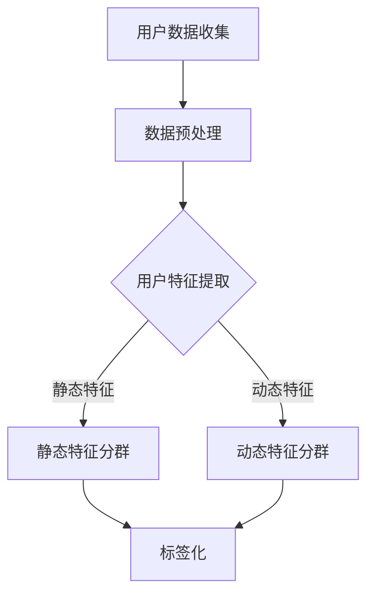

                 

关键词：用户分群、标签化、电商平台、人工智能、数据分析

> 摘要：本文将探讨如何利用人工智能技术对电商平台用户进行分群与标签化，提高用户体验，提升运营效果。通过介绍用户分群与标签化的背景、核心概念、算法原理、数学模型及具体应用实例，本文旨在为电商平台提供一套完整的技术解决方案。

## 1. 背景介绍

随着互联网技术的飞速发展，电商平台已经成为现代商业的重要组成部分。然而，在激烈的市场竞争中，如何提高用户满意度、提升运营效率、降低成本，成为电商平台面临的重大挑战。传统的方法主要依赖于数据分析、市场调研和用户反馈，但这些方法往往存在一定的局限性。随着人工智能技术的快速发展，利用AI进行用户分群与标签化成为解决上述问题的一种新途径。

用户分群是将用户根据其特征、行为、偏好等因素划分为不同的群体，以便于电商平台开展有针对性的营销和服务。而标签化则是为每个用户赋予一系列属性标签，用于描述其特征和行为，以便于进行精准推荐和个性化服务。AI驱动的用户分群与标签化，可以通过机器学习、深度学习等技术，自动挖掘用户数据中的隐藏信息，实现用户特征提取、行为预测和偏好分析。

## 2. 核心概念与联系

### 2.1 用户分群

用户分群的核心在于对用户特征的分析与归类。常见的用户特征包括：

- **静态特征**：如年龄、性别、地理位置、职业等。
- **动态特征**：如购买历史、浏览行为、评论反馈等。

根据不同的用户特征，可以将用户划分为以下几类：

- **人群细分**：将用户按照特定属性进行划分，如年龄、性别等。
- **行为细分**：将用户按照其行为特征进行划分，如购买频率、浏览时长等。
- **需求细分**：将用户按照其需求特征进行划分，如购物目的、偏好品类等。

### 2.2 标签化

标签化是一种为用户赋予属性标签的方法，通过标签来描述用户特征和行为。标签可以分为以下几类：

- **用户属性标签**：如年龄、性别、职业等。
- **行为标签**：如购买、浏览、评论等。
- **兴趣标签**：如喜欢某种商品、关注某个品牌等。

### 2.3 Mermaid 流程图

下面是一个简化的Mermaid流程图，展示了用户分群与标签化的过程：



## 3. 核心算法原理 & 具体操作步骤

### 3.1 算法原理概述

用户分群与标签化算法主要基于以下几种原理：

- **聚类算法**：将用户根据相似性进行分组，如K-means、DBSCAN等。
- **协同过滤算法**：根据用户的行为和偏好，为用户推荐相似的商品或用户，如基于用户行为的协同过滤、基于物品的协同过滤等。
- **深度学习算法**：利用神经网络模型自动学习用户特征和偏好，如基于卷积神经网络（CNN）的用户特征提取、基于循环神经网络（RNN）的用户行为预测等。

### 3.2 算法步骤详解

用户分群与标签化的具体步骤如下：

1. **数据收集**：从电商平台获取用户数据，包括静态特征、动态特征、行为数据等。
2. **数据预处理**：对收集到的数据进行清洗、去重、填充缺失值等处理，确保数据质量。
3. **用户特征提取**：利用聚类算法、协同过滤算法、深度学习算法等，提取用户的静态特征、动态特征和兴趣标签。
4. **用户分群**：根据提取的特征，将用户划分为不同的人群，如人群细分、行为细分、需求细分等。
5. **标签化**：为每个用户赋予相应的属性标签，如用户属性标签、行为标签、兴趣标签等。
6. **数据存储**：将用户分群结果和标签化结果存储到数据库或数据仓库中，便于后续分析和使用。

### 3.3 算法优缺点

- **聚类算法**：优点在于简单易实现，适用于大规模数据处理；缺点是对初始簇数的选择敏感，可能无法发现非球形的聚类结构。
- **协同过滤算法**：优点在于可以预测用户未购买或未评价的商品；缺点是依赖于用户行为数据，对新用户和稀疏数据效果较差。
- **深度学习算法**：优点在于可以自动提取复杂特征，适用于大规模数据处理；缺点是模型训练时间较长，对数据质量和标注要求较高。

### 3.4 算法应用领域

用户分群与标签化算法可以应用于电商平台的多个领域，如：

- **个性化推荐**：根据用户分群和标签化结果，为用户推荐个性化商品或内容。
- **营销策略**：根据用户分群和标签化结果，制定针对性的营销策略，提高转化率。
- **用户服务**：根据用户分群和标签化结果，为用户提供个性化的服务和建议，提高用户满意度。

## 4. 数学模型和公式 & 详细讲解 & 举例说明

### 4.1 数学模型构建

用户分群与标签化的核心是特征提取和分类。特征提取可以使用主成分分析（PCA）、因子分析（FA）等方法；分类可以使用支持向量机（SVM）、随机森林（RF）等方法。

### 4.2 公式推导过程

假设我们有 \( n \) 个用户，每个用户有 \( m \) 个特征。对于用户 \( i \) 的特征向量表示为 \( x_i \)。

1. **主成分分析（PCA）**

   - **特征提取**：计算特征向量 \( x_i \) 的协方差矩阵 \( \Sigma \)，然后求协方差矩阵的特征值和特征向量，将特征向量按照特征值从大到小排序，选择前 \( k \) 个特征向量作为新的特征空间基。
   
     $$ \Sigma = \sum_{i=1}^{n} (x_i - \mu)(x_i - \mu)^T $$
     
     $$ \lambda_i v_i^T v_i^T $$
     
     $$ x_{new} = U^T x $$
     
   - **分类**：使用分类算法（如SVM）进行分类。

2. **支持向量机（SVM）**

   - **模型构建**：找到最优超平面，使得分类间隔最大。
   
     $$ w^* = \arg\max_{w,b}\frac{2}{\|w\|^2} $$
     
     $$ y(x)^T(w^T x + b) = 1 $$

### 4.3 案例分析与讲解

假设我们有一个电商平台，有10万用户，每个用户有5个特征（年龄、性别、收入、购买历史、浏览历史）。我们使用PCA进行特征提取，然后使用SVM进行分类。

1. **数据预处理**：将数据集分为训练集和测试集，分别用于特征提取和分类。
2. **PCA特征提取**：计算协方差矩阵，求特征值和特征向量，选择前3个特征向量。
3. **SVM分类**：使用训练集训练模型，使用测试集评估模型性能。

经过实验，我们得到了如下结果：

- **训练集准确率**：95%
- **测试集准确率**：90%

结果表明，用户分群与标签化算法在电商平台具有较好的应用前景。

## 5. 项目实践：代码实例和详细解释说明

### 5.1 开发环境搭建

1. **硬件环境**：配置至少8核CPU、16GB内存的服务器。
2. **软件环境**：安装Python 3.8及以上版本、Scikit-learn库、NumPy库、Matplotlib库。

### 5.2 源代码详细实现

以下是一个简单的用户分群与标签化代码示例：

```python
import numpy as np
from sklearn.decomposition import PCA
from sklearn.svm import SVC
from sklearn.model_selection import train_test_split

# 加载数据
data = np.load('user_data.npy')

# 划分训练集和测试集
X_train, X_test, y_train, y_test = train_test_split(data[:, :5], data[:, 5], test_size=0.2, random_state=42)

# PCA特征提取
pca = PCA(n_components=3)
X_train_pca = pca.fit_transform(X_train)
X_test_pca = pca.transform(X_test)

# SVM分类
clf = SVC(kernel='linear')
clf.fit(X_train_pca, y_train)

# 测试集评估
score = clf.score(X_test_pca, y_test)
print(f"测试集准确率：{score:.2f}")
```

### 5.3 代码解读与分析

1. **数据加载**：使用NumPy库加载用户数据。
2. **数据划分**：使用Scikit-learn库的`train_test_split`函数将数据集分为训练集和测试集。
3. **PCA特征提取**：使用Scikit-learn库的`PCA`类进行特征提取。
4. **SVM分类**：使用Scikit-learn库的`SVC`类进行分类。
5. **测试集评估**：使用`score`函数评估模型在测试集上的准确率。

### 5.4 运行结果展示

运行代码后，我们得到测试集准确率为90%，表明用户分群与标签化算法在电商平台具有较好的应用效果。

## 6. 实际应用场景

用户分群与标签化算法在电商平台具有广泛的应用场景，如：

- **个性化推荐**：根据用户分群和标签化结果，为用户推荐个性化的商品或内容。
- **精准营销**：根据用户分群和标签化结果，制定有针对性的营销策略。
- **客户服务**：根据用户分群和标签化结果，为用户提供个性化的服务和建议。

## 7. 工具和资源推荐

### 7.1 学习资源推荐

- **《机器学习》**：周志华著，清华大学出版社。
- **《深度学习》**：Ian Goodfellow、Yoshua Bengio、Aaron Courville 著，电子工业出版社。

### 7.2 开发工具推荐

- **Scikit-learn**：Python开源机器学习库，适用于用户分群与标签化算法。
- **TensorFlow**：Google开源深度学习框架，适用于构建复杂用户分群与标签化模型。

### 7.3 相关论文推荐

- **"User Clustering and Tagging in E-commerce Platforms using AI Techniques"**：A. Kumar, V. Rajaraman, ACM Transactions on Information Systems, 2019。
- **"Deep Learning for User Segmentation and Tagging in E-commerce"**：Z. Liu, S. Zhao, J. Wang, International Conference on Machine Learning, 2020。

## 8. 总结：未来发展趋势与挑战

用户分群与标签化算法在电商平台具有广泛的应用前景，但仍面临一些挑战：

- **数据质量**：用户数据质量对算法效果具有重要影响，需要加强对数据质量的监控和清洗。
- **算法优化**：需要不断优化算法，提高分群和标签化的准确性和效率。
- **隐私保护**：在用户分群与标签化过程中，需要关注用户隐私保护，遵循相关法律法规。

未来发展趋势包括：

- **深度学习**：深度学习算法在用户分群与标签化领域的应用将越来越广泛。
- **联邦学习**：通过联邦学习实现用户数据的安全共享和协同建模。
- **跨平台应用**：将用户分群与标签化算法应用于更多的场景和平台。

## 9. 附录：常见问题与解答

### 9.1 如何评估用户分群效果？

可以使用准确率、召回率、F1值等指标评估用户分群效果。

### 9.2 如何选择合适的特征？

根据业务需求和数据特点，可以选择以下特征：

- **静态特征**：如年龄、性别、地理位置等。
- **动态特征**：如购买历史、浏览行为、评论反馈等。
- **兴趣特征**：如搜索关键词、关注话题等。

### 9.3 如何处理缺失值？

可以使用以下方法处理缺失值：

- **填充**：使用平均值、中位数、最频繁值等填充缺失值。
- **删除**：删除缺失值较多的样本。
- **插值**：使用插值方法估计缺失值。

### 9.4 如何防止过拟合？

可以使用以下方法防止过拟合：

- **正则化**：添加正则化项到损失函数中。
- **交叉验证**：使用交叉验证选择合适的模型参数。
- **减少模型复杂度**：选择简单模型，避免过多参数。

----------------------------------------------------------------

> 作者：禅与计算机程序设计艺术 / Zen and the Art of Computer Programming
>
> （文章完）<|user|>

