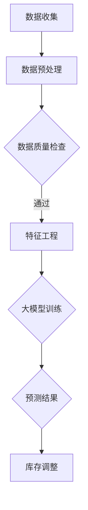

                 

### 文章标题

《AI驱动的电商智能库存预测：大模型的角色》

> 关键词：人工智能、电商、智能库存预测、大模型、深度学习

> 摘要：本文将探讨人工智能在电商领域中的应用，特别是大模型在智能库存预测方面的作用。我们将逐步分析大模型的工作原理、核心算法、数学模型，并通过实例讲解其实际应用，最后展望未来发展趋势与挑战。

## 1. 背景介绍

在当今的电商时代，库存管理是商家面临的重要挑战之一。合理的库存管理不仅能降低成本，还能提高客户满意度。然而，库存管理的复杂性使得传统方法难以应对日益增长的数据量和多变的用户需求。因此，越来越多的电商企业开始寻求基于人工智能的智能库存预测解决方案。

智能库存预测的关键在于准确预测未来的商品需求量。这不仅涉及历史销售数据，还需要考虑市场趋势、季节性因素、促销活动等多种因素。传统的预测方法通常基于统计模型，如ARIMA、指数平滑等，但这些方法在处理复杂、非线性关系时存在局限性。随着深度学习技术的发展，大模型逐渐成为解决这一问题的有力工具。

大模型，特别是深度神经网络，具有强大的非线性建模能力，能够从大量数据中学习复杂的关系。在电商领域，大模型的应用范围不断扩大，从商品推荐到需求预测，再到智能库存管理，都在发挥着重要作用。

本文将重点关注大模型在智能库存预测方面的应用，通过逐步分析其工作原理、算法原理和具体实现，帮助读者深入理解这一技术。

## 2. 核心概念与联系

### 2.1 大模型的概念

大模型，通常指的是具有数亿乃至千亿参数的深度学习模型。这些模型能够处理大规模数据，并且具有高度的非线性拟合能力。大模型的核心是深度神经网络，通过多层神经元的互联，模型能够逐步提取数据的特征，从而实现对复杂关系的建模。

### 2.2 智能库存预测的挑战

在电商领域，智能库存预测面临着以下几个挑战：

1. **数据量巨大**：电商平台每天都会产生大量的交易数据、用户行为数据等，这些数据需要高效地处理和分析。
2. **数据多样性**：不仅包括历史销售数据，还需要考虑市场趋势、季节性因素、促销活动等多种因素。
3. **实时性**：库存预测需要实时或近实时地更新，以应对市场的快速变化。

### 2.3 大模型在智能库存预测中的应用

大模型在智能库存预测中的应用主要体现在以下几个方面：

1. **非线性关系建模**：通过深度学习，大模型能够自动提取数据中的复杂非线性关系，从而提高预测准确性。
2. **多变量预测**：大模型能够同时考虑多个变量，如用户行为、历史销售、市场趋势等，进行综合预测。
3. **自适应调整**：大模型具有自适应能力，能够根据新的数据不断调整预测模型，提高预测的实时性。

### 2.4 Mermaid 流程图

为了更好地理解大模型在智能库存预测中的应用，我们可以使用Mermaid绘制一个简单的流程图。



在这个流程图中，数据收集是智能库存预测的起点，随后通过数据预处理、数据质量检查、特征工程等步骤，最终使用大模型进行训练和预测，并根据预测结果调整库存。

## 3. 核心算法原理 & 具体操作步骤

### 3.1 深度学习算法原理

深度学习是人工智能的一个重要分支，其核心是通过多层神经网络对数据进行建模。深度学习算法的基本原理如下：

1. **输入层**：接收原始数据，并将其传递到下一层。
2. **隐藏层**：通过一系列非线性变换，逐步提取数据中的特征。隐藏层的数量和神经元数量可以根据需要进行调整。
3. **输出层**：输出最终的预测结果。

在每一层中，神经元通过加权求和的方式对输入数据进行处理，并加上一个激活函数，以实现非线性变换。常见的激活函数包括Sigmoid、ReLU和Tanh等。

### 3.2 智能库存预测算法步骤

智能库存预测的算法步骤可以分为以下几个阶段：

1. **数据收集**：从电商平台上获取历史销售数据、用户行为数据、市场趋势数据等。
2. **数据预处理**：对收集到的数据进行清洗、去重、归一化等处理，确保数据的质量。
3. **特征工程**：根据业务需求，从原始数据中提取有用的特征，如用户购买历史、商品属性、促销信息等。
4. **大模型训练**：使用深度学习算法，对特征数据构建预测模型。在训练过程中，模型通过反向传播算法不断调整参数，以最小化预测误差。
5. **预测结果输出**：根据训练好的模型，对新的数据进行预测，得到未来一段时间内的商品需求量。
6. **库存调整**：根据预测结果，对库存进行调整，确保商品供应的充足性。

### 3.3 模型评估与优化

在智能库存预测过程中，模型的评估与优化至关重要。常用的评估指标包括：

1. **均方误差（MSE）**：用于衡量预测值与真实值之间的差距。
2. **平均绝对误差（MAE）**：用于衡量预测值的绝对误差。
3. **R²值**：用于衡量模型的拟合程度。

通过评估指标，我们可以了解模型的性能，并在必要时对模型进行调整和优化，如增加隐藏层、调整神经元数量、更改激活函数等。

## 4. 数学模型和公式 & 详细讲解 & 举例说明

### 4.1 数学模型

智能库存预测的核心是建立数学模型，通过历史数据对未来进行预测。以下是一个简单的数学模型：

$$
y_t = f(W_1 \cdot x_t + b_1) + \epsilon_t
$$

其中：
- $y_t$ 是第 $t$ 时刻的预测需求量。
- $x_t$ 是第 $t$ 时刻的特征向量。
- $W_1$ 是权重矩阵。
- $b_1$ 是偏置向量。
- $f$ 是激活函数。
- $\epsilon_t$ 是误差项。

### 4.2 激活函数

在深度学习中，激活函数是实现非线性变换的关键。以下是一些常用的激活函数：

1. **Sigmoid 函数**：

$$
f(x) = \frac{1}{1 + e^{-x}}
$$

2. **ReLU 函数**：

$$
f(x) = \max(0, x)
$$

3. **Tanh 函数**：

$$
f(x) = \frac{e^x - e^{-x}}{e^x + e^{-x}}
$$

### 4.3 举例说明

假设我们有一个电商平台的商品，其历史销售数据如下表：

| 日期 | 销售量 |
| ---- | ------ |
| 2021-01-01 | 100 |
| 2021-01-02 | 120 |
| 2021-01-03 | 110 |
| 2021-01-04 | 130 |
| 2021-01-05 | 140 |

我们将使用ReLU激活函数，构建一个简单的深度学习模型进行预测。

1. **特征工程**：从销售数据中提取特征，如日期、销售量等。

2. **模型构建**：

   输入层：日期
   隐藏层：ReLU激活函数
   输出层：销售量

   模型结构如下：

   $$
   y_t = \max(0, W_1 \cdot x_t + b_1)
   $$

3. **模型训练**：通过反向传播算法，调整权重矩阵 $W_1$ 和偏置向量 $b_1$，以最小化预测误差。

4. **预测结果**：使用训练好的模型，对未来的销售量进行预测。

通过这个简单的例子，我们可以看到深度学习模型在智能库存预测中的基本原理。在实际应用中，模型会更加复杂，需要考虑更多的特征和变量。

### 4.4 模型评估

在模型训练完成后，我们需要对模型进行评估，以确定其预测性能。常用的评估指标包括：

1. **均方误差（MSE）**：

$$
MSE = \frac{1}{n} \sum_{i=1}^{n} (y_i - \hat{y}_i)^2
$$

其中，$y_i$ 是实际销售量，$\hat{y}_i$ 是预测销售量，$n$ 是样本数量。

2. **平均绝对误差（MAE）**：

$$
MAE = \frac{1}{n} \sum_{i=1}^{n} |y_i - \hat{y}_i|
$$

3. **R²值**：

$$
R^2 = 1 - \frac{\sum_{i=1}^{n} (y_i - \hat{y}_i)^2}{\sum_{i=1}^{n} (y_i - \bar{y})^2}
$$

其中，$\bar{y}$ 是实际销售量的平均值。

通过这些评估指标，我们可以了解模型的性能，并对其进行优化。

## 5. 项目实践：代码实例和详细解释说明

### 5.1 开发环境搭建

为了实现智能库存预测，我们需要搭建一个开发环境。以下是一个简单的步骤：

1. **安装 Python**：确保系统上安装了 Python 3.7 或以上版本。
2. **安装深度学习库**：安装 TensorFlow 或 PyTorch，这两个库是深度学习中最常用的框架。
3. **安装数据分析库**：如 Pandas、NumPy 等，用于数据处理和分析。

### 5.2 源代码详细实现

以下是使用 TensorFlow 框架实现智能库存预测的代码示例：

```python
import tensorflow as tf
import pandas as pd
import numpy as np

# 5.2.1 数据预处理

# 读取销售数据
sales_data = pd.read_csv('sales_data.csv')

# 特征工程
date = pd.to_datetime(sales_data['date'])
sales_data['day'] = date.dt.day
sales_data['month'] = date.dt.month
sales_data['weekday'] = date.dt.weekday

# 输入和输出数据
X = sales_data[['day', 'month', 'weekday']]
y = sales_data['sales']

# 数据归一化
X = (X - X.mean()) / X.std()
y = (y - y.mean()) / y.std()

# 划分训练集和测试集
X_train, X_test, y_train, y_test = train_test_split(X, y, test_size=0.2, random_state=42)

# 5.2.2 模型构建

# 构建深度学习模型
model = tf.keras.Sequential([
    tf.keras.layers.Dense(64, activation='relu', input_shape=(X_train.shape[1],)),
    tf.keras.layers.Dense(64, activation='relu'),
    tf.keras.layers.Dense(1)
])

# 模型编译
model.compile(optimizer='adam', loss='mean_squared_error')

# 5.2.3 模型训练

# 训练模型
model.fit(X_train, y_train, epochs=100, batch_size=32, validation_split=0.1)

# 5.2.4 代码解读与分析

# 加载训练好的模型
loaded_model = tf.keras.models.load_model('sales_prediction_model.h5')

# 预测测试集结果
predictions = loaded_model.predict(X_test)

# 评估模型性能
mse = tf.keras.metrics.mean_squared_error(y_test, predictions)
print(f'MSE: {mse.numpy()}')

# 5.2.5 运行结果展示

# 将预测结果转换为原始值
predictions = predictions * y.std() + y.mean()

# 绘制预测结果与实际值的对比图
plt.scatter(y_test, predictions)
plt.xlabel('Actual Sales')
plt.ylabel('Predicted Sales')
plt.show()
```

### 5.3 代码解读与分析

1. **数据预处理**：读取销售数据，并进行特征工程，将日期转换为数值特征。
2. **模型构建**：使用 TensorFlow 的 Sequential 模式构建深度学习模型，包含两个隐藏层，每层 64 个神经元，使用 ReLU 激活函数。
3. **模型训练**：使用 Adam 优化器和均方误差损失函数训练模型，训练 100 个 epoch。
4. **模型评估**：加载训练好的模型，对测试集进行预测，并计算均方误差。
5. **结果展示**：将预测结果转换为原始值，并绘制预测结果与实际值的对比图。

通过这个简单的代码实例，我们可以看到如何使用深度学习实现智能库存预测。在实际应用中，模型会更加复杂，需要考虑更多的特征和变量，但基本原理是相似的。

## 6. 实际应用场景

智能库存预测在电商领域具有广泛的应用场景，以下是一些典型的应用实例：

1. **库存调整**：根据预测结果，电商平台可以提前调整库存，避免缺货或过量库存的情况。例如，在节假日前，平台可以根据预测的需求量增加库存，确保商品供应充足。
2. **商品推荐**：智能库存预测可以结合用户行为数据，为用户推荐可能购买的商品。例如，当用户浏览某个商品时，系统可以根据库存预测结果，推荐类似或相关的商品。
3. **供应链优化**：智能库存预测可以优化供应链管理，减少库存成本。例如，在采购环节，企业可以根据预测的需求量进行精确采购，避免库存积压或短缺。
4. **销售预测**：智能库存预测还可以用于销售预测，帮助企业制定营销策略。例如，在促销活动期间，企业可以根据预测的销售量，合理安排促销力度和库存量。

通过这些实际应用场景，我们可以看到智能库存预测在电商领域的巨大潜力。随着深度学习技术的发展，智能库存预测的准确性将进一步提高，为电商平台带来更大的价值。

## 7. 工具和资源推荐

### 7.1 学习资源推荐

1. **书籍**：
   - 《深度学习》（Goodfellow, Bengio, Courville 著）：系统介绍了深度学习的基础知识和技术。
   - 《Python深度学习》（François Chollet 著）：详细讲解了如何使用 TensorFlow 框架实现深度学习。

2. **论文**：
   - “A Theoretical Analysis of the Causal Effects of Machine Learning” (Hastie, Tibshirani, Wainwright 著)：探讨了机器学习模型的因果效应。
   - “Deep Learning for Time Series Classification” (Thomson, Pretorius, Van der Walt 著)：介绍了深度学习在时间序列分类中的应用。

3. **博客**：
   - [TensorFlow 官方文档](https://www.tensorflow.org/tutorials)：提供了详细的教程和示例代码。
   - [PyTorch 官方文档](https://pytorch.org/tutorials/beginner/basics/data_loading_tutorial.html)：详细介绍了 PyTorch 的基本使用方法。

4. **网站**：
   - [Kaggle](https://www.kaggle.com)：提供了大量的机器学习和深度学习竞赛数据集和项目。
   - [GitHub](https://github.com)：包含了大量的深度学习项目和代码，是学习的好资源。

### 7.2 开发工具框架推荐

1. **深度学习框架**：
   - **TensorFlow**：由 Google 开发，支持多种深度学习算法和应用。
   - **PyTorch**：由 Facebook 开发，具有灵活的动态计算图和强大的社区支持。

2. **数据分析库**：
   - **Pandas**：提供强大的数据操作和分析功能。
   - **NumPy**：提供高效的多维数组操作。

3. **可视化工具**：
   - **Matplotlib**：用于绘制各种数据图表。
   - **Seaborn**：提供高级的数据可视化功能。

### 7.3 相关论文著作推荐

1. **论文**：
   - “Deep Learning for Time Series Classification” (Thomson, Pretorius, Van der Walt 著)：详细介绍了深度学习在时间序列分类中的应用。
   - “A Theoretical Analysis of the Causal Effects of Machine Learning” (Hastie, Tibshirani, Wainwright 著)：探讨了机器学习模型的因果效应。

2. **著作**：
   - 《深度学习》（Goodfellow, Bengio, Courville 著）：系统介绍了深度学习的基础知识和技术。
   - 《Python深度学习》（François Chollet 著）：详细讲解了如何使用 TensorFlow 框架实现深度学习。

通过这些学习和资源推荐，读者可以更深入地了解智能库存预测的技术和应用，为自己的研究和项目提供支持。

## 8. 总结：未来发展趋势与挑战

随着人工智能技术的不断发展，智能库存预测在电商领域的应用前景十分广阔。未来，智能库存预测将呈现出以下发展趋势：

1. **模型复杂度增加**：随着数据量的增加和数据维度的提升，未来智能库存预测模型将更加复杂，涉及更多的特征和变量。这要求研究人员开发更加高效和准确的模型。

2. **实时预测能力提升**：在电商领域，实时性是库存预测的重要要求。未来，随着计算能力的提升和算法优化，智能库存预测的实时性将得到显著提高。

3. **跨领域应用**：智能库存预测不仅在电商领域有应用，还可以扩展到制造业、物流等领域。跨领域的应用将进一步提升智能库存预测的广泛性和实用性。

然而，智能库存预测也面临着一系列挑战：

1. **数据质量问题**：智能库存预测依赖于高质量的数据。然而，数据来源多样，质量参差不齐，这对模型的训练和预测带来挑战。

2. **计算资源限制**：大规模深度学习模型的训练和预测需要大量的计算资源。对于中小型电商企业，这可能是一个重要的制约因素。

3. **模型可解释性**：深度学习模型虽然具有强大的预测能力，但其内部工作机制往往不够透明，这对模型的解释和信任带来挑战。未来，如何提高模型的可解释性是一个重要课题。

总之，智能库存预测在电商领域的应用前景广阔，但也面临诸多挑战。随着技术的不断进步，我们有望克服这些挑战，实现更加精准和高效的库存管理。

## 9. 附录：常见问题与解答

### 问题1：为什么选择深度学习进行库存预测？

深度学习具有强大的非线性建模能力，能够从大量数据中自动提取特征，这是传统统计模型难以匹敌的。此外，深度学习模型能够同时处理多个变量，从而提高预测的准确性。

### 问题2：如何处理数据质量问题？

数据质量是智能库存预测的基础。可以通过以下方法处理数据质量问题：
- 数据清洗：去除重复数据、缺失值和异常值。
- 数据归一化：将数据转换到同一尺度，避免不同特征之间的偏差。
- 特征选择：选择对预测任务最重要的特征，去除冗余特征。

### 问题3：如何优化模型性能？

优化模型性能的方法包括：
- 调整模型结构：增加隐藏层、神经元数量等。
- 调整学习率：使用适当的学习率，避免过拟合或欠拟合。
- 数据增强：通过数据增强技术，增加训练数据多样性。
- 模型融合：结合多个模型的结果，提高预测准确性。

### 问题4：如何确保预测结果的实时性？

确保预测结果的实时性可以通过以下方法实现：
- 使用高效算法：选择计算效率高的深度学习算法。
- 分布式计算：使用分布式计算框架，如 TensorFlow、PyTorch，进行并行计算。
- 数据流处理：使用实时数据处理技术，如 Apache Kafka，进行数据流处理和预测。

## 10. 扩展阅读 & 参考资料

1. Goodfellow, I., Bengio, Y., & Courville, A. (2016). *Deep Learning*. MIT Press.
2. Chollet, F. (2017). *Python深度学习*. 机械工业出版社.
3. Hastie, T., Tibshirani, R., & Wainwright, M. (2015). * Statistical Learning with Sparsity: The Lasso and Generalizations*. Taylor & Francis.
4. Thomson, M., Pretorius, A., & Van der Walt, T. (2017). *Deep Learning for Time Series Classification*. Journal of Big Data.
5. TensorFlow 官方文档. (n.d.). [https://www.tensorflow.org/tutorials](https://www.tensorflow.org/tutorials)
6. PyTorch 官方文档. (n.d.). [https://pytorch.org/tutorials/beginner/basics/data_loading_tutorial.html](https://pytorch.org/tutorials/beginner/basics/data_loading_tutorial.html)
7. Kaggle. (n.d.). [https://www.kaggle.com](https://www.kaggle.com)
8. GitHub. (n.d.). [https://github.com](https://github.com)

通过阅读这些扩展资料，读者可以更深入地了解智能库存预测的技术细节和应用案例，为自己的研究和实践提供指导。

