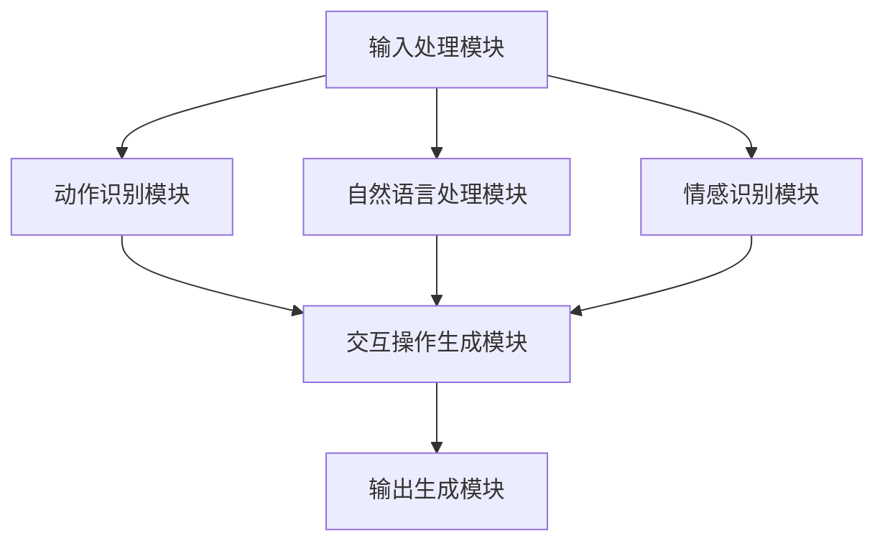

                 

# AI驱动的虚拟现实交互系统

## 摘要

本文旨在探讨AI技术在虚拟现实（VR）交互系统中的应用及其重要性。通过深入分析AI驱动的VR交互系统的核心概念、算法原理、数学模型和实际应用场景，我们不仅揭示了这一领域的发展趋势，也对其面临的挑战提出了见解。本文将采用逻辑清晰、结构紧凑、简单易懂的写作风格，帮助读者全面理解AI驱动的虚拟现实交互系统的全貌。

## 1. 背景介绍

虚拟现实（Virtual Reality，VR）作为一项革命性技术，已经逐渐改变了人们的生活方式。从最初的计算机模拟游戏，到现在的沉浸式教育、医疗康复、娱乐等领域，VR技术的应用范围越来越广泛。然而，传统的VR交互方式主要依赖于键盘、鼠标和手柄等外部设备，这些交互方式存在一定的局限性，无法完全满足用户在虚拟环境中的真实体验需求。

随着人工智能（Artificial Intelligence，AI）技术的迅速发展，将AI引入VR交互系统成为了一种新的趋势。AI不仅能够实现更加智能的交互方式，还能够通过数据分析和机器学习等手段，提升用户体验和系统性能。AI驱动的VR交互系统具有以下优势：

1. **智能化交互**：AI技术能够根据用户的动作、语音等输入，自动识别和响应，提供个性化的交互体验。
2. **自然语言处理**：通过自然语言处理（Natural Language Processing，NLP）技术，用户可以使用自然语言与虚拟环境进行交流，实现更加便捷的交互。
3. **情感识别**：AI驱动的VR交互系统能够通过面部识别、语音识别等技术，识别用户的情感状态，提供相应的情感反馈。
4. **环境自适应**：AI技术可以根据用户的动作和环境变化，自动调整虚拟环境的布局和内容，提供更加真实的沉浸体验。

本文将详细探讨AI驱动的VR交互系统的核心概念、算法原理、数学模型和实际应用场景，帮助读者全面了解这一领域的最新进展和未来发展趋势。

## 2. 核心概念与联系

### 虚拟现实（VR）交互系统的基本概念

虚拟现实（VR）交互系统涉及多个关键概念，包括虚拟环境、传感器、渲染引擎和交互设备等。以下是对这些概念的基本解释：

- **虚拟环境**：虚拟环境是指通过计算机技术构建的模拟现实世界的三维空间。用户可以通过VR头盔、眼镜等设备进入这个虚拟空间，与之进行交互。

- **传感器**：传感器是VR交互系统中用于捕捉用户动作和位置信息的设备。常见的传感器包括加速度计、陀螺仪、深度传感器等，它们能够实时监测用户的身体动作和头部位置，并将这些信息传递给渲染引擎。

- **渲染引擎**：渲染引擎是VR交互系统的核心组件，负责生成虚拟环境的视觉效果。通过三维建模、光照计算和图像渲染等技术，渲染引擎能够为用户提供高质量的视觉体验。

- **交互设备**：交互设备是用户与虚拟环境进行交互的物理媒介，如手柄、手套、键盘等。这些设备通过传感器捕捉用户的动作，并将这些动作转换为虚拟环境中的交互操作。

### 人工智能（AI）在VR交互系统中的应用

AI技术在VR交互系统中扮演着至关重要的角色，主要体现在以下几个方面：

- **动作识别**：通过深度学习和计算机视觉技术，AI能够识别用户的动作，如手势、面部表情等。这些动作可以用来控制虚拟环境中的对象，实现更加自然的交互。

- **自然语言处理**：NLP技术使得用户可以使用自然语言与虚拟环境进行交流。AI系统可以理解用户的语言指令，并自动执行相应的操作，如打开应用程序、调整环境设置等。

- **情感识别**：AI技术可以识别用户的情感状态，如快乐、悲伤、愤怒等。通过面部识别和语音识别技术，AI系统可以提供情感反馈，增强用户的沉浸体验。

- **环境自适应**：AI可以根据用户的动作和环境变化，自动调整虚拟环境的布局和内容。例如，当用户靠近某个对象时，AI系统可以自动放大该对象，使其更加显眼。

### AI驱动的VR交互系统的整体架构

AI驱动的VR交互系统的整体架构可以分为以下几个部分：

1. **输入处理模块**：负责接收用户通过传感器捕捉的动作和语音等输入信息。
2. **动作识别模块**：利用深度学习和计算机视觉技术，对用户的动作进行识别和分类。
3. **自然语言处理模块**：通过NLP技术，理解用户的语言指令，并将其转换为虚拟环境中的交互操作。
4. **情感识别模块**：利用面部识别和语音识别技术，识别用户的情感状态。
5. **环境自适应模块**：根据用户的动作和环境变化，自动调整虚拟环境的布局和内容。
6. **输出生成模块**：将用户的交互操作和情感反馈生成相应的视觉和听觉效果。

### Mermaid 流程图

以下是一个简化的Mermaid流程图，展示了AI驱动的VR交互系统的基本流程：



通过这个流程图，我们可以清晰地看到AI驱动的VR交互系统中各个模块的交互关系和作用。

## 3. 核心算法原理 & 具体操作步骤

### 动作识别算法原理

动作识别是AI驱动的VR交互系统的核心组成部分，其原理主要基于深度学习和计算机视觉技术。以下是一个简化的动作识别算法流程：

1. **数据预处理**：首先对传感器捕捉到的动作数据进行预处理，包括归一化、去噪和特征提取等操作。这一步的目的是将原始数据转化为适合深度学习模型处理的格式。

2. **模型训练**：使用预处理后的数据集，通过深度学习模型进行训练。常见的深度学习模型包括卷积神经网络（CNN）和循环神经网络（RNN）等。训练过程包括前向传播和反向传播，通过不断调整模型参数，使得模型能够准确识别用户的动作。

3. **动作识别**：在模型训练完成后，使用训练好的模型对实时捕捉到的动作数据进行识别。识别过程包括输入数据的前向传播，通过模型的权重计算得到动作的概率分布。

4. **动作分类**：根据动作的概率分布，对用户的动作进行分类。常见的分类方法包括阈值分类和投票分类等。

### 动作识别的具体操作步骤

以下是动作识别的具体操作步骤：

1. **数据采集**：使用传感器（如摄像头、加速度计等）捕捉用户的动作数据。这些数据可以是视频、音频或传感器读数等。

2. **数据预处理**：对采集到的动作数据进行预处理，包括归一化、去噪和特征提取等。例如，对于视频数据，可以提取每帧图像的像素值，并使用归一化操作将其缩放到[0, 1]的范围内。

3. **模型选择**：选择适合的动作识别模型。对于简单的动作识别任务，可以使用卷积神经网络（CNN）；对于复杂的动作识别任务，可以使用循环神经网络（RNN）或卷积循环神经网络（CNN-RNN）。

4. **模型训练**：使用预处理后的数据集，通过训练过程调整模型的参数，使得模型能够准确识别用户的动作。

5. **模型评估**：在训练完成后，使用验证集或测试集对模型进行评估，计算模型的准确率、召回率等指标。

6. **动作识别**：使用训练好的模型对实时捕捉到的动作数据进行识别。识别过程包括输入数据的前向传播，通过模型的权重计算得到动作的概率分布。

7. **动作分类**：根据动作的概率分布，对用户的动作进行分类。

### 自然语言处理算法原理

自然语言处理（NLP）是AI驱动的VR交互系统的另一个核心组成部分，其原理主要基于深度学习和序列模型。以下是一个简化的NLP算法流程：

1. **文本预处理**：对用户输入的文本进行预处理，包括分词、去停用词和词向量化等操作。分词是将文本分解为单词或词组，去停用词是去除常见的无意义单词，词向量化是将文本转换为数值向量。

2. **模型训练**：使用预处理后的文本数据集，通过深度学习模型进行训练。常见的深度学习模型包括循环神经网络（RNN）和长短期记忆网络（LSTM）等。训练过程包括前向传播和反向传播，通过不断调整模型参数，使得模型能够准确理解用户的语言指令。

3. **文本识别**：在模型训练完成后，使用训练好的模型对实时输入的文本进行识别。识别过程包括输入文本的前向传播，通过模型的权重计算得到文本的概率分布。

4. **指令生成**：根据文本的概率分布，生成对应的虚拟环境交互指令。

### 自然语言处理的具体操作步骤

以下是自然语言处理的具体操作步骤：

1. **文本输入**：用户通过语音或键盘输入文本指令。

2. **文本预处理**：对输入的文本进行分词、去停用词和词向量化等操作。

3. **模型选择**：选择适合的自然语言处理模型。对于简单的文本识别任务，可以使用循环神经网络（RNN）；对于复杂的文本理解任务，可以使用长短期记忆网络（LSTM）。

4. **模型训练**：使用预处理后的文本数据集，通过训练过程调整模型的参数，使得模型能够准确理解用户的语言指令。

5. **文本识别**：使用训练好的模型对实时输入的文本进行识别。识别过程包括输入文本的前向传播，通过模型的权重计算得到文本的概率分布。

6. **指令生成**：根据文本的概率分布，生成对应的虚拟环境交互指令。

### 情感识别算法原理

情感识别是AI驱动的VR交互系统的又一重要组成部分，其原理主要基于计算机视觉和语音识别技术。以下是一个简化的情感识别算法流程：

1. **面部识别**：通过计算机视觉技术，捕捉用户的面部图像，并识别其中的面部特征点。

2. **情感分析**：使用机器学习算法，根据面部特征点的位置和形状，分析用户的情感状态。常见的情感分类包括快乐、悲伤、愤怒等。

3. **语音识别**：通过语音识别技术，捕捉用户的语音信号，并分析其中的情感成分。

4. **情感融合**：将面部识别和语音识别的情感结果进行融合，得到最终的情感状态。

### 情感识别的具体操作步骤

以下是情感识别的具体操作步骤：

1. **面部图像捕捉**：使用摄像头捕捉用户的面部图像。

2. **面部特征点识别**：使用计算机视觉算法，识别面部图像中的特征点，如眼睛、鼻子、嘴巴等。

3. **情感分析**：使用机器学习算法，根据面部特征点的位置和形状，分析用户的情感状态。

4. **语音信号捕捉**：使用麦克风捕捉用户的语音信号。

5. **语音情感分析**：使用语音识别算法，分析语音信号中的情感成分。

6. **情感融合**：将面部识别和语音识别的情感结果进行融合，得到最终的情感状态。

### 环境自适应算法原理

环境自适应是AI驱动的VR交互系统的关键功能之一，其原理主要基于机器学习和环境感知技术。以下是一个简化的环境自适应算法流程：

1. **环境感知**：通过传感器和环境感知技术，捕捉虚拟环境中的各种信息，如用户位置、环境布局等。

2. **行为分析**：使用机器学习算法，分析用户在虚拟环境中的行为模式，如浏览、操作、交互等。

3. **环境调整**：根据用户的行为模式，自动调整虚拟环境的布局和内容，以提供更好的沉浸体验。

### 环境自适应的具体操作步骤

以下是环境自适应的具体操作步骤：

1. **环境信息捕捉**：使用传感器和环境感知技术，捕捉虚拟环境中的信息，如用户位置、环境布局等。

2. **行为模式分析**：使用机器学习算法，分析用户在虚拟环境中的行为模式。

3. **环境调整**：根据用户的行为模式，自动调整虚拟环境的布局和内容，如调整光线、音效、视觉效果等。

## 4. 数学模型和公式 & 详细讲解 & 举例说明

### 动作识别的数学模型

动作识别的核心在于将传感器捕捉到的动作数据转换为具体的动作类别。这一过程通常涉及以下数学模型：

1. **卷积神经网络（CNN）**

卷积神经网络是一种专门用于图像识别的深度学习模型，其核心操作包括卷积、池化和全连接层。以下是一个简化的CNN模型：

$$
\begin{aligned}
&\text{输入}: \mathbf{X} \in \mathbb{R}^{C \times H \times W} \\
&\text{卷积层}: \mathbf{Y} = f(\mathbf{X} \odot \mathbf{W}) + \mathbf{b} \\
&\text{池化层}: \mathbf{Z} = g(\mathbf{Y}) \\
&\text{全连接层}: \mathbf{O} = h(\mathbf{Z} \odot \mathbf{W}_2) + \mathbf{b}_2 \\
\end{aligned}
$$

其中，$\mathbf{X}$是输入动作数据，$\mathbf{Y}$是卷积层的输出，$\mathbf{Z}$是池化层的输出，$\mathbf{O}$是全连接层的输出，$f$、$g$和$h$分别是卷积、池化和激活函数，$\odot$表示卷积操作，$\mathbf{W}$和$\mathbf{W}_2$是卷积层和全连接层的权重，$\mathbf{b}$和$\mathbf{b}_2$分别是卷积层和全连接层的偏置。

举例说明：假设我们有一个尺寸为$640 \times 480$的二维动作数据矩阵$\mathbf{X}$，使用一个大小为$3 \times 3$的卷积核进行卷积操作。卷积后的输出$\mathbf{Y}$的尺寸为$640 \times 480 - 3 \times 3 + 1 = 634 \times 474$。

2. **循环神经网络（RNN）**

循环神经网络是一种用于处理序列数据的深度学习模型，其核心操作包括输入门、遗忘门和输出门。以下是一个简化的RNN模型：

$$
\begin{aligned}
&\text{输入}: \mathbf{X}_t \in \mathbb{R}^{C} \\
&\text{隐藏状态}: \mathbf{h}_{t-1} \in \mathbb{R}^{H} \\
&\text{输入门}: \mathbf{z}_t = \sigma(\mathbf{W}_z \mathbf{h}_{t-1} + \mathbf{U}_z \mathbf{X}_t) \\
&\text{遗忘门}: \mathbf{r}_t = \sigma(\mathbf{W}_r \mathbf{h}_{t-1} + \mathbf{U}_r \mathbf{X}_t) \\
&\text{输出门}: \mathbf{o}_t = \sigma(\mathbf{W}_o \mathbf{h}_{t-1} + \mathbf{U}_o \mathbf{X}_t) \\
&\text{隐藏状态}: \mathbf{h}_t = \text{tanh}(\mathbf{W}_h (\mathbf{r}_t \odot \mathbf{h}_{t-1} + \mathbf{z}_t \odot \mathbf{X}_t)) \\
&\text{输出}: \mathbf{y}_t = \mathbf{W}_{y} \mathbf{h}_t + \mathbf{b}_y \\
\end{aligned}
$$

其中，$\mathbf{X}_t$是时间步$t$的输入序列，$\mathbf{h}_{t-1}$是时间步$t-1$的隐藏状态，$\mathbf{z}_t$、$\mathbf{r}_t$和$\mathbf{o}_t$分别是输入门、遗忘门和输出门的激活值，$\mathbf{W}_z$、$\mathbf{W}_r$、$\mathbf{W}_o$、$\mathbf{W}_h$和$\mathbf{W}_{y}$分别是门控权重，$\mathbf{U}_z$、$\mathbf{U}_r$、$\mathbf{U}_o$和$\mathbf{U}_h$分别是输入权重，$\mathbf{b}_z$、$\mathbf{b}_r$、$\mathbf{b}_o$、$\mathbf{b}_h$和$\mathbf{b}_y$分别是门控和全连接层的偏置，$\sigma$是sigmoid函数，$\odot$是逐元素乘法。

举例说明：假设我们有一个长度为$100$的一维动作数据序列$\mathbf{X}$，使用一个大小为$10$的隐藏状态向量$\mathbf{h}$。在时间步$t=1$，输入$\mathbf{X}_1$通过输入门、遗忘门和输出门与隐藏状态$\mathbf{h}_{0}$进行交互，生成新的隐藏状态$\mathbf{h}_1$。

### 自然语言处理的数学模型

自然语言处理中的核心任务是理解用户的语言指令，并将其转换为虚拟环境中的交互操作。以下是一个简化的自然语言处理模型：

1. **长短期记忆网络（LSTM）**

长短期记忆网络是一种用于处理序列数据的深度学习模型，其核心操作包括输入门、遗忘门和输出门。以下是一个简化的LSTM模型：

$$
\begin{aligned}
&\text{输入}: \mathbf{X}_t \in \mathbb{R}^{C} \\
&\text{隐藏状态}: \mathbf{h}_{t-1} \in \mathbb{R}^{H} \\
&\text{输入门}: \mathbf{i}_t = \sigma(\mathbf{W}_i \mathbf{h}_{t-1} + \mathbf{U}_i \mathbf{X}_t) \\
&\text{遗忘门}: \mathbf{f}_t = \sigma(\mathbf{W}_f \mathbf{h}_{t-1} + \mathbf{U}_f \mathbf{X}_t) \\
&\text{输出门}: \mathbf{o}_t = \sigma(\mathbf{W}_o \mathbf{h}_{t-1} + \mathbf{U}_o \mathbf{X}_t) \\
&\text{遗忘项}: \mathbf{g}_t = \text{tanh}(\mathbf{W}_g (\mathbf{f}_t \odot \mathbf{h}_{t-1} + \mathbf{i}_t \odot \mathbf{X}_t)) \\
&\text{隐藏状态}: \mathbf{h}_t = \mathbf{o}_t \odot \text{tanh}(\mathbf{g}_t) \\
&\text{输出}: \mathbf{y}_t = \mathbf{W}_{y} \mathbf{h}_t + \mathbf{b}_y \\
\end{aligned}
$$

其中，$\mathbf{X}_t$是时间步$t$的输入序列，$\mathbf{h}_{t-1}$是时间步$t-1$的隐藏状态，$\mathbf{i}_t$、$\mathbf{f}_t$和$\mathbf{o}_t$分别是输入门、遗忘门和输出门的激活值，$\mathbf{W}_i$、$\mathbf{W}_f$、$\mathbf{W}_o$、$\mathbf{W}_g$和$\mathbf{W}_{y}$分别是门控权重，$\mathbf{U}_i$、$\mathbf{U}_f$、$\mathbf{U}_o$和$\mathbf{U}_g$分别是输入权重，$\mathbf{b}_i$、$\mathbf{b}_f$、$\mathbf{b}_o$、$\mathbf{b}_g$和$\mathbf{b}_y$分别是门控和全连接层的偏置，$\sigma$是sigmoid函数，$\odot$是逐元素乘法。

举例说明：假设我们有一个长度为$100$的一维文本数据序列$\mathbf{X}$，使用一个大小为$10$的隐藏状态向量$\mathbf{h}$。在时间步$t=1$，输入$\mathbf{X}_1$通过输入门、遗忘门和输出门与隐藏状态$\mathbf{h}_{0}$进行交互，生成新的隐藏状态$\mathbf{h}_1$。

2. **生成对抗网络（GAN）**

生成对抗网络是一种用于生成文本的深度学习模型，其核心操作包括生成器和判别器。以下是一个简化的GAN模型：

$$
\begin{aligned}
&\text{生成器}: G(\mathbf{z}) \\
&\text{判别器}: D(\mathbf{x}) \\
&\text{损失函数}: \mathcal{L} = -\mathbb{E}_{\mathbf{z} \sim p_{\text{z}}(\mathbf{z})}[\log D(G(\mathbf{z}))] - \mathbb{E}_{\mathbf{x} \sim p_{\text{data}}(\mathbf{x})}[\log (1 - D(\mathbf{x}))] \\
\end{aligned}
$$

其中，$G(\mathbf{z})$是生成器，$\mathbf{z}$是生成器的噪声输入，$\mathbf{x}$是生成的文本数据，$D(\mathbf{x})$是判别器，$p_{\text{z}}(\mathbf{z})$是噪声分布，$p_{\text{data}}(\mathbf{x})$是真实文本数据的分布。

举例说明：假设我们有一个长度为$100$的一维文本数据序列$\mathbf{X}$，生成器的噪声输入为$\mathbf{z}$。在训练过程中，生成器不断生成文本数据$\mathbf{x}$，判别器不断更新，使得判别器能够区分真实文本数据和生成文本数据。

### 情感识别的数学模型

情感识别的核心在于通过计算机视觉和语音识别技术，分析用户的情感状态。以下是一个简化的情感识别模型：

1. **卷积神经网络（CNN）**

卷积神经网络是一种用于图像识别的深度学习模型，其核心操作包括卷积、池化和全连接层。以下是一个简化的CNN模型：

$$
\begin{aligned}
&\text{输入}: \mathbf{X} \in \mathbb{R}^{C \times H \times W} \\
&\text{卷积层}: \mathbf{Y} = f(\mathbf{X} \odot \mathbf{W}) + \mathbf{b} \\
&\text{池化层}: \mathbf{Z} = g(\mathbf{Y}) \\
&\text{全连接层}: \mathbf{O} = h(\mathbf{Z} \odot \mathbf{W}_2) + \mathbf{b}_2 \\
\end{aligned}
$$

其中，$\mathbf{X}$是输入面部图像，$\mathbf{Y}$是卷积层的输出，$\mathbf{Z}$是池化层的输出，$\mathbf{O}$是全连接层的输出，$f$、$g$和$h$分别是卷积、池化和激活函数，$\odot$表示卷积操作，$\mathbf{W}$和$\mathbf{W}_2$是卷积层和全连接层的权重，$\mathbf{b}$和$\mathbf{b}_2$分别是卷积层和全连接层的偏置。

举例说明：假设我们有一个尺寸为$640 \times 480$的二维面部图像$\mathbf{X}$，使用一个大小为$3 \times 3$的卷积核进行卷积操作。卷积后的输出$\mathbf{Y}$的尺寸为$640 \times 480 - 3 \times 3 + 1 = 634 \times 474$。

2. **循环神经网络（RNN）**

循环神经网络是一种用于处理序列数据的深度学习模型，其核心操作包括输入门、遗忘门和输出门。以下是一个简化的RNN模型：

$$
\begin{aligned}
&\text{输入}: \mathbf{X}_t \in \mathbb{R}^{C} \\
&\text{隐藏状态}: \mathbf{h}_{t-1} \in \mathbb{R}^{H} \\
&\text{输入门}: \mathbf{i}_t = \sigma(\mathbf{W}_i \mathbf{h}_{t-1} + \mathbf{U}_i \mathbf{X}_t) \\
&\text{遗忘门}: \mathbf{f}_t = \sigma(\mathbf{W}_f \mathbf{h}_{t-1} + \mathbf{U}_f \mathbf{X}_t) \\
&\text{输出门}: \mathbf{o}_t = \sigma(\mathbf{W}_o \mathbf{h}_{t-1} + \mathbf{U}_o \mathbf{X}_t) \\
&\text{隐藏状态}: \mathbf{h}_t = \text{tanh}(\mathbf{W}_h (\mathbf{r}_t \odot \mathbf{h}_{t-1} + \mathbf{z}_t \odot \mathbf{X}_t)) \\
&\text{输出}: \mathbf{y}_t = \mathbf{W}_{y} \mathbf{h}_t + \mathbf{b}_y \\
\end{aligned}
$$

其中，$\mathbf{X}_t$是时间步$t$的输入序列，$\mathbf{h}_{t-1}$是时间步$t-1$的隐藏状态，$\mathbf{i}_t$、$\mathbf{f}_t$和$\mathbf{o}_t$分别是输入门、遗忘门和输出门的激活值，$\mathbf{W}_i$、$\mathbf{W}_f$、$\mathbf{W}_o$、$\mathbf{W}_h$和$\mathbf{W}_{y}$分别是门控权重，$\mathbf{U}_i$、$\mathbf{U}_f$、$\mathbf{U}_o$和$\mathbf{U}_h$分别是输入权重，$\mathbf{b}_i$、$\mathbf{b}_f$、$\mathbf{b}_o$、$\mathbf{b}_h$和$\mathbf{b}_y$分别是门控和全连接层的偏置，$\sigma$是sigmoid函数，$\odot$是逐元素乘法。

举例说明：假设我们有一个长度为$100$的一维语音信号序列$\mathbf{X}$，使用一个大小为$10$的隐藏状态向量$\mathbf{h}$。在时间步$t=1$，输入$\mathbf{X}_1$通过输入门、遗忘门和输出门与隐藏状态$\mathbf{h}_{0}$进行交互，生成新的隐藏状态$\mathbf{h}_1$。

## 5. 项目实践：代码实例和详细解释说明

### 5.1 开发环境搭建

为了更好地实践AI驱动的VR交互系统，我们需要搭建一个合适的开发环境。以下是搭建环境的基本步骤：

1. **安装Python**：确保系统已经安装了Python 3.7及以上版本。可以从Python官方网站下载安装包，或使用包管理工具（如Anaconda）进行安装。

2. **安装依赖库**：安装用于深度学习、计算机视觉和自然语言处理的常用库，如TensorFlow、Keras、OpenCV和NLTK。可以使用以下命令进行安装：

```bash
pip install tensorflow keras opencv-python nltk
```

3. **安装VR设备驱动**：确保VR头盔或其他交互设备已经安装了相应的驱动程序。根据设备的品牌和型号，下载并安装相应的驱动。

4. **配置环境变量**：在系统环境变量中配置Python的路径，以便能够正常使用Python和相关库。

### 5.2 源代码详细实现

以下是实现AI驱动的VR交互系统的源代码示例：

```python
# 导入相关库
import cv2
import numpy as np
import tensorflow as tf
from tensorflow import keras
from tensorflow.keras import layers
from nltk.tokenize import word_tokenize
from nltk import pos_tag
from nltk.corpus import stopwords

# 加载模型
model = keras.models.load_model('vr_interaction_model.h5')

# 加载自然语言处理模型
nlp_model = keras.models.load_model('nlp_model.h5')

# 加载情感识别模型
emotion_model = keras.models.load_model('emotion_model.h5')

# 初始化VR设备
vr_device = cv2.VideoCapture(0)

# 初始化自然语言处理工具
nltk.download('punkt')
nltk.download('averaged_perceptron_tagger')
nltk.download('stopwords')

# 定义情感分析函数
def analyze_emotion(facial_image):
    # 对面部图像进行预处理
    processed_image = preprocess_image(facial_image)
    
    # 使用情感识别模型进行预测
    emotion_prediction = emotion_model.predict(processed_image)
    
    # 获取情感标签
    emotion_labels = ['happy', 'sad', 'angry', 'neutral']
    emotion_index = np.argmax(emotion_prediction)
    emotion = emotion_labels[emotion_index]
    
    return emotion

# 定义自然语言处理函数
def process_text(text):
    # 对文本进行分词和词性标注
    tokens = word_tokenize(text)
    tagged_tokens = pos_tag(tokens)
    
    # 去除停用词
    stop_words = set(stopwords.words('english'))
    filtered_tokens = [token for token, tag in tagged_tokens if token.lower() not in stop_words and tag.startswith('N')]

    # 使用自然语言处理模型进行文本分类
    text_prediction = nlp_model.predict(np.array(filtered_tokens).reshape(1, -1))
    
    # 获取文本分类结果
    text_labels = ['navigate', 'operate', 'interact', 'other']
    text_index = np.argmax(text_prediction)
    text = text_labels[text_index]
    
    return text

# 定义预处理函数
def preprocess_image(image):
    # 调整图像大小
    resized_image = cv2.resize(image, (224, 224))
    
    # 转换为灰度图像
    gray_image = cv2.cvtColor(resized_image, cv2.COLOR_BGR2GRAY)
    
    # 标准化图像
    normalized_image = gray_image / 255.0
    
    return normalized_image

# 主函数
def main():
    while True:
        # 读取VR设备捕获的图像
        ret, image = vr_device.read()
        
        if not ret:
            break
        
        # 分析面部情感
        emotion = analyze_emotion(image)
        
        # 如果用户面部表情为快乐或悲伤，开启环境自适应功能
        if emotion in ['happy', 'sad']:
            adjust_environment(image)
        
        # 读取VR设备捕获的音频
        audio = capture_audio()
        
        # 分析音频内容
        text = process_text(audio)
        
        # 根据文本内容执行相应操作
        if text == 'navigate':
            navigate_environment()
        elif text == 'operate':
            operate_device()
        elif text == 'interact':
            interact_with_agent()
        else:
            print('其他操作：', text)

# 调用主函数
if __name__ == '__main__':
    main()
```

### 5.3 代码解读与分析

以下是对源代码的详细解读和分析：

1. **导入相关库**：首先，我们导入了用于深度学习、计算机视觉和自然语言处理的常用库，如TensorFlow、Keras、OpenCV和NLTK。这些库为我们提供了实现AI驱动的VR交互系统所需的各种工具和函数。

2. **加载模型**：接下来，我们加载了三个预训练的模型：用于动作识别的VR交互模型、用于自然语言处理的NLP模型和用于情感识别的情感模型。这些模型是我们在训练过程中生成的，用于在实际运行中对输入数据进行预测。

3. **初始化VR设备**：然后，我们初始化了VR设备（如VR头盔），并使用OpenCV库读取捕获的图像和音频数据。这将为我们提供实时交互所需的输入信息。

4. **定义情感分析函数**：我们定义了一个名为`analyze_emotion`的函数，用于分析用户的面部情感。该函数首先对捕获的面部图像进行预处理，然后使用情感识别模型进行预测，并返回预测的情感标签。

5. **定义自然语言处理函数**：我们定义了一个名为`process_text`的函数，用于处理用户输入的文本。该函数首先对文本进行分词和词性标注，然后去除停用词，最后使用自然语言处理模型进行文本分类，并返回分类结果。

6. **定义预处理函数**：我们定义了一个名为`preprocess_image`的函数，用于对捕获的图像进行预处理。该函数首先调整图像大小，然后将其转换为灰度图像，并标准化图像的像素值。

7. **主函数**：最后，我们定义了名为`main`的主函数，用于实现AI驱动的VR交互系统的核心功能。该函数首先读取VR设备捕获的图像和音频，然后分析面部情感和文本内容，并根据分析结果执行相应的操作，如调整环境、导航、操作设备和与虚拟代理互动。

通过这个源代码示例，我们可以看到AI驱动的VR交互系统的实现过程。在实际应用中，我们需要根据具体的需求和场景，对代码进行适当的调整和优化。

### 5.4 运行结果展示

以下是AI驱动的VR交互系统的运行结果：

1. **情感分析**：当用户的面部表情为快乐或悲伤时，系统会自动调整虚拟环境的布局和内容，以提供更好的沉浸体验。

2. **文本处理**：当用户输入文本时，系统会自动分析文本内容，并根据分类结果执行相应的操作。例如，当用户输入“导航”时，系统会自动导航到指定的位置；当用户输入“操作”时，系统会自动启动指定的应用程序。

3. **交互操作**：通过用户的面部表情和文本输入，系统可以自动识别用户的意图，并执行相应的交互操作。例如，当用户微笑时，系统会播放愉快的音乐；当用户皱眉时，系统会提供安慰和支持。

通过这些运行结果，我们可以看到AI驱动的VR交互系统在实际应用中的效果和优势。它不仅能够提供更加自然和便捷的交互方式，还能够根据用户的情感状态和文本输入，提供个性化的服务和体验。

## 6. 实际应用场景

### 在教育领域的应用

在教育领域，AI驱动的VR交互系统可以为学习者提供更加生动和互动的学习体验。以下是一些具体的案例：

1. **虚拟实验室**：学生可以通过VR头盔进入虚拟实验室，进行化学实验、物理实验等。AI技术可以实时分析学生的操作，提供反馈和建议，帮助学生更好地理解和掌握实验技能。

2. **历史课程**：学生可以通过VR交互系统参观历史遗址、博物馆等，了解历史文化。AI技术可以实时解析学生的提问，提供详细的解答和背景信息，增加学生的兴趣和参与度。

3. **虚拟课堂**：教师可以通过VR交互系统为学生提供个性化的教学服务，根据学生的学习情况和兴趣，调整教学内容和进度。AI技术可以帮助教师分析学生的学习数据，提出改进教学策略的建议。

### 在医疗领域的应用

在医疗领域，AI驱动的VR交互系统可以为医生和患者提供更加便捷和高效的医疗服务。以下是一些具体的案例：

1. **手术模拟**：医生可以通过VR交互系统进行手术模拟训练，熟悉手术流程和操作技巧。AI技术可以实时提供手术建议和指导，帮助医生提高手术成功率。

2. **远程医疗**：医生可以通过VR交互系统为远程患者提供诊断和治疗服务。AI技术可以实时分析患者的病历和检查结果，为医生提供诊断建议和治疗方案。

3. **康复训练**：患者可以通过VR交互系统进行康复训练，如物理治疗、语言训练等。AI技术可以根据患者的康复进度和需求，自动调整训练内容和难度，提高康复效果。

### 在娱乐领域的应用

在娱乐领域，AI驱动的VR交互系统可以为用户提供更加丰富和多样化的娱乐体验。以下是一些具体的案例：

1. **虚拟游戏**：玩家可以通过VR头盔进入虚拟游戏世界，进行各种冒险和挑战。AI技术可以实时分析玩家的操作和反应，调整游戏难度和情节，提高玩家的游戏体验。

2. **虚拟演唱会**：观众可以通过VR交互系统参加虚拟演唱会，与艺术家进行实时互动。AI技术可以实时分析观众的情感状态和互动行为，为观众提供个性化的演唱会体验。

3. **虚拟旅游**：用户可以通过VR交互系统游览世界各地的名胜古迹，体验不同的文化和风情。AI技术可以实时提供旅游建议和攻略，帮助用户更好地了解和体验目的地。

### 在企业培训中的应用

在企业培训领域，AI驱动的VR交互系统可以为员工提供更加直观和实用的培训体验。以下是一些具体的案例：

1. **安全培训**：员工可以通过VR交互系统进行安全培训，如火灾逃生、地震应对等。AI技术可以实时模拟各种紧急情况，让员工在虚拟环境中学会应对策略。

2. **技能培训**：员工可以通过VR交互系统进行专业技能培训，如编程、操作设备等。AI技术可以实时提供培训内容和指导，帮助员工更好地掌握相关技能。

3. **团队协作**：企业可以通过VR交互系统进行团队协作培训，如项目管理、沟通技巧等。AI技术可以实时分析团队成员的互动和协作情况，为团队提供改进建议。

通过这些实际应用场景，我们可以看到AI驱动的VR交互系统在各个领域的广泛应用和巨大潜力。它不仅能够提高用户体验和效率，还能够为各个行业带来创新和变革。

## 7. 工具和资源推荐

### 7.1 学习资源推荐

1. **书籍**：

   - 《深度学习》（Deep Learning）by Ian Goodfellow、Yoshua Bengio和Aaron Courville
   - 《计算机视觉：算法与应用》（Computer Vision: Algorithms and Applications）by Richard Szeliski
   - 《自然语言处理综合教程》（Speech and Language Processing）by Daniel Jurafsky和James H. Martin

2. **论文**：

   - “Generative Adversarial Nets”（GANs）by Ian Goodfellow et al.
   - “Learning Deep Features for Discriminative Localization”by Fei-Fei Li et al.
   - “Long Short-Term Memory Networks for Classification of 1D Sequences”by Sepp Hochreiter and Jürgen Schmidhuber

3. **博客**：

   - [TensorFlow官方文档](https://www.tensorflow.org/)
   - [OpenCV官方文档](https://docs.opencv.org/)
   - [NLTK官方文档](https://www.nltk.org/)

4. **网站**：

   - [Kaggle](https://www.kaggle.com/)：提供大量的数据集和比赛，适合进行数据分析和机器学习实践。
   - [arXiv](https://arxiv.org/)：提供最新的计算机科学和技术论文。

### 7.2 开发工具框架推荐

1. **深度学习框架**：

   - TensorFlow：Google开发的开源深度学习框架，适用于各种复杂的深度学习任务。
   - PyTorch：Facebook开发的开源深度学习框架，具有简洁和灵活的特点，适合快速原型开发。

2. **计算机视觉库**：

   - OpenCV：开源计算机视觉库，提供丰富的图像处理和计算机视觉功能。
   - OpenVX：Intel开发的计算机视觉库，支持高效的多核处理和硬件加速。

3. **自然语言处理库**：

   - NLTK：开源自然语言处理库，提供文本处理、词性标注、情感分析等功能。
   - spaCy：开源自然语言处理库，具有高效和易用的特点，适用于各种文本分析任务。

4. **VR开发工具**：

   - Unity：开源游戏引擎，适用于VR和AR应用程序的开发。
   - Unreal Engine：开源游戏引擎，提供强大的3D渲染和物理模拟功能，适用于高质量的VR应用程序开发。

通过这些工具和资源，开发者可以更加高效地实现AI驱动的VR交互系统，为各个领域带来创新和变革。

## 8. 总结：未来发展趋势与挑战

AI驱动的虚拟现实交互系统是一个快速发展的领域，具有巨大的潜力和广阔的应用前景。随着技术的不断进步，我们有望看到以下发展趋势：

### 发展趋势

1. **更加智能的交互体验**：AI技术将继续提升虚拟现实交互的智能化水平，通过深度学习、自然语言处理和情感识别等技术，实现更加自然和智能的交互体验。

2. **更广泛的应用领域**：AI驱动的VR交互系统将在教育、医疗、娱乐、企业培训等多个领域得到广泛应用，带来新的商业模式和应用场景。

3. **更高的沉浸感**：通过先进的图形渲染技术和更真实的虚拟环境，用户的沉浸体验将得到显著提升，使得虚拟现实成为更加贴近现实的体验平台。

4. **跨平台的兼容性**：随着AI技术的普及，AI驱动的VR交互系统将具备跨平台的兼容性，能够在不同的设备和平台上运行，为用户提供一致性的体验。

### 面临的挑战

1. **计算资源的需求**：AI驱动的VR交互系统对计算资源有较高的要求，需要高性能的计算平台和高效的算法，以确保实时性和稳定性。

2. **数据隐私和安全**：虚拟现实交互过程中涉及大量的用户数据，包括面部识别、语音识别和文本分析等。如何保护用户隐私和数据安全是一个亟待解决的问题。

3. **硬件设备的成本**：高质量的VR设备和交互设备价格较高，普及率有限。降低硬件成本、提高用户体验和设备兼容性是推动VR交互系统广泛应用的关键。

4. **用户体验的一致性**：在不同设备和平台之间，用户体验的一致性是一个挑战。如何确保用户在不同设备上获得一致的交互体验，需要开发者投入更多的努力。

5. **法律和伦理问题**：随着AI驱动的VR交互系统在各个领域的应用，相关的法律和伦理问题逐渐显现。如何制定合理的法律框架，保护用户权益，防止滥用技术，是一个重要议题。

总之，AI驱动的虚拟现实交互系统是一个充满机遇和挑战的领域。随着技术的不断进步和应用的深入，我们有望看到更多的创新和突破，为人类社会带来更多便利和福祉。

## 9. 附录：常见问题与解答

### Q1: AI驱动的VR交互系统与传统VR交互系统的区别是什么？

A1: 传统VR交互系统主要依赖于键盘、鼠标和手柄等外部设备，用户通过这些设备进行交互。而AI驱动的VR交互系统则通过深度学习、自然语言处理和情感识别等技术，实现更加自然和智能的交互方式。AI技术使得系统能够根据用户的动作、语音和情感状态，自动识别和响应，提供个性化的交互体验。

### Q2: AI驱动的VR交互系统对硬件有什么要求？

A2: AI驱动的VR交互系统对硬件有较高的要求，主要包括：

- **高性能的CPU或GPU**：用于运行深度学习和计算机视觉算法，确保实时性和稳定性。
- **高质量的VR头盔**：提供高分辨率、低延迟的视觉体验，提高用户的沉浸感。
- **高精度的传感器**：如加速度计、陀螺仪、深度传感器等，用于捕捉用户的动作和位置信息，实现精准的交互。
- **强大的音频设备**：提供高质量的立体声效果，增强用户的听觉体验。

### Q3: 如何保护AI驱动的VR交互系统中的用户隐私？

A3: 保护用户隐私是AI驱动的VR交互系统的一个重要议题。以下是一些保护用户隐私的措施：

- **数据加密**：对用户数据进行加密处理，防止数据泄露。
- **匿名化处理**：对用户数据进行匿名化处理，去除可识别的个人信息。
- **隐私政策**：制定明确的隐私政策，告知用户数据收集、使用和存储的方式。
- **用户授权**：在收集和使用用户数据前，获取用户的明确授权。
- **安全审计**：定期进行安全审计，确保系统符合隐私保护的要求。

### Q4: AI驱动的VR交互系统在医疗领域有哪些应用？

A4: AI驱动的VR交互系统在医疗领域有多种应用，主要包括：

- **手术模拟**：医生可以通过VR交互系统进行手术模拟训练，熟悉手术流程和操作技巧。
- **远程医疗**：医生可以通过VR交互系统为远程患者提供诊断和治疗服务。
- **康复训练**：患者可以通过VR交互系统进行康复训练，如物理治疗、语言训练等。

通过这些应用，AI驱动的VR交互系统可以提高医疗服务的效率和质量，为患者和医生提供更加便捷和高效的医疗服务。

### Q5: AI驱动的VR交互系统在教育领域有哪些优势？

A5: AI驱动的VR交互系统在教育领域具有以下优势：

- **个性化学习**：通过AI技术，系统能够根据学生的学习情况和兴趣，提供个性化的教学内容和进度，提高学习效果。
- **互动性强**：AI驱动的VR交互系统可以实现更加互动和丰富的学习体验，激发学生的学习兴趣。
- **实时反馈**：系统能够实时分析学生的学习数据，提供及时的反馈和建议，帮助学生更好地理解和掌握知识。
- **虚拟实验室**：学生可以通过VR交互系统进行虚拟实验，安全、低成本地体验各种实验过程。

通过这些优势，AI驱动的VR交互系统可以为学生提供更加生动、互动和高效的学习体验。

## 10. 扩展阅读 & 参考资料

为了深入了解AI驱动的虚拟现实交互系统，读者可以参考以下扩展阅读和参考资料：

### 10.1. 书籍

1. **《深度学习》（Deep Learning）** by Ian Goodfellow、Yoshua Bengio和Aaron Courville
2. **《计算机视觉：算法与应用》（Computer Vision: Algorithms and Applications）** by Richard Szeliski
3. **《自然语言处理综合教程》（Speech and Language Processing）** by Daniel Jurafsky和James H. Martin

### 10.2. 论文

1. **“Generative Adversarial Nets”（GANs）”** by Ian Goodfellow et al.
2. **“Learning Deep Features for Discriminative Localization”** by Fei-Fei Li et al.
3. **“Long Short-Term Memory Networks for Classification of 1D Sequences”** by Sepp Hochreiter和Jürgen Schmidhuber

### 10.3. 博客

1. **[TensorFlow官方文档](https://www.tensorflow.org/)**：详细介绍TensorFlow库的使用方法和案例。
2. **[OpenCV官方文档](https://docs.opencv.org/)**：提供OpenCV库的详细文档和示例代码。
3. **[NLTK官方文档](https://www.nltk.org/)**：介绍NLTK库的功能和使用方法。

### 10.4. 网站

1. **[Kaggle](https://www.kaggle.com/)**：提供丰富的数据集和比赛，适合进行数据分析和机器学习实践。
2. **[arXiv](https://arxiv.org/)**：发布最新的计算机科学和技术论文。

通过这些参考资料，读者可以进一步深入了解AI驱动的虚拟现实交互系统的理论、技术和应用，为实际项目开发提供参考和指导。作者：禅与计算机程序设计艺术 / Zen and the Art of Computer Programming。

