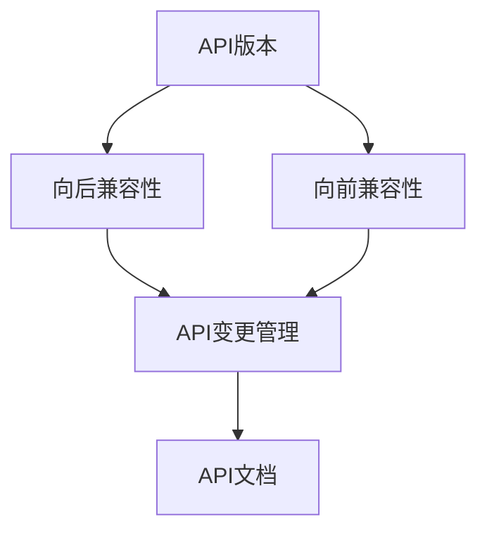

                 

### 1. 背景介绍

API（应用程序编程接口）作为现代软件开发中的关键组件，已广泛应用于各种应用程序和服务之间进行交互。然而，随着软件系统的复杂性和规模不断扩大，API版本控制成为了一个不可忽视的问题。API版本控制是指管理API不同版本的策略和方法，确保在软件迭代过程中，各个系统之间的兼容性和稳定性。

在软件开发过程中，API版本控制的目标主要有以下几点：

1. **向后兼容性**：新版本的API应该能够与旧版本的API无缝切换，确保旧系统无需修改即可继续使用新版本的API。
2. **向前兼容性**：当API发生变更时，应确保新版本的API能够兼容旧版本的数据结构，避免因API变更导致服务中断或数据丢失。
3. **版本管理**：为不同版本的API提供清晰、易于理解的命名规则和版本信息，便于开发者和管理者进行追踪和调试。

API版本控制的重要性在于，它不仅能够确保软件迭代过程中的稳定性和兼容性，还能提高开发团队的协作效率，减少由于API变更导致的问题排查和时间浪费。

随着微服务架构的兴起，API版本控制变得更加复杂。微服务架构将应用程序分解为多个独立的、可部署的服务，每个服务都有自己的API。这使得在处理API变更时，需要考虑跨服务的兼容性和版本管理。因此，API版本控制的最佳实践成为软件开发过程中的一项重要内容。

在接下来的章节中，我们将详细探讨API版本控制的核心概念、算法原理、数学模型、项目实践，以及实际应用场景，帮助读者全面了解并掌握API版本控制的最佳实践。

### 2. 核心概念与联系

为了更好地理解API版本控制，我们需要首先了解一些核心概念，并探索它们之间的联系。以下是API版本控制中的一些关键概念及其定义：

1. **API版本**：API版本是指API的特定版本号，用于标识API的功能、接口和行为。通常使用数字或字符串表示，如`v1`、`v2.0`等。
2. **向后兼容性**：向后兼容性（Backward Compatibility）是指新版本的API能够兼容旧版本的API，确保旧系统无需修改即可继续使用新版本的API。
3. **向前兼容性**：向前兼容性（Forward Compatibility）是指新版本的API能够兼容旧版本的数据结构，避免因API变更导致服务中断或数据丢失。
4. **API变更管理**：API变更管理是指对API的变更进行追踪、评估和管理的过程，确保在变更过程中能够保持系统的稳定性和兼容性。
5. **API文档**：API文档是描述API功能、接口和使用的详细文档，通常包括API的定义、示例代码、参数说明和返回值等。

#### Mermaid 流程图

下面是一个Mermaid流程图，展示了API版本控制中这些核心概念之间的关系：



在这个流程图中，API版本是核心，向后兼容性和向前兼容性是API版本控制的重要方面，API变更管理和API文档则是在这些基础上进行的具体工作。通过这个流程图，我们可以更好地理解API版本控制的整体架构和各个部分之间的关联。

### 3. 核心算法原理 & 具体操作步骤

在了解API版本控制的核心概念后，我们接下来探讨API版本控制的核心算法原理和具体操作步骤。这里，我们将介绍几种常见的API版本控制方法，并详细解释它们的原理和实现步骤。

#### 1. URL路径版本控制

**原理**：URL路径版本控制是一种最常用的API版本控制方法，通过在URL路径中包含版本号，来标识不同的API版本。例如，`/api/v1/user`表示v1版本的`user`接口。

**操作步骤**：
1. **定义版本号**：在URL路径中包含版本号，如`/api/v1/user`。
2. **处理不同版本的API请求**：在服务器端，根据URL路径中的版本号，分别处理不同版本的API请求。
3. **确保向后兼容性**：当需要更新API版本时，确保旧版本的API仍然可用，直到所有用户都迁移到新版本。

**优点**：
- **简单直观**：通过URL路径即可清楚地标识API版本。
- **易于扩展**：可以轻松添加新的API版本。

**缺点**：
- **路径长度增加**：随着版本号的增加，URL路径会变长。
- **URL冲突问题**：当不同API版本的路径部分相同，可能导致URL冲突。

#### 2. HTTP头版本控制

**原理**：HTTP头版本控制通过在HTTP请求头中包含版本号，来标识API版本。例如，通过`Accept: application/vnd.myapi.v1+json`来指定使用v1版本的API。

**操作步骤**：
1. **设置HTTP头**：在客户端请求API时，通过HTTP头的`Accept`字段设置版本号。
2. **读取HTTP头**：在服务器端，读取HTTP头的`Accept`字段，根据版本号处理请求。
3. **确保兼容性**：当需要更新API版本时，确保旧版本的API仍然可用，直到所有用户都迁移到新版本。

**优点**：
- **灵活性强**：可以通过HTTP头的其他字段携带额外的信息。
- **路径长度不变**：不增加URL路径的长度。

**缺点**：
- **需要修改客户端代码**：客户端需要根据新版本API进行相应的修改。
- **兼容性管理复杂**：当API发生大量变更时，兼容性管理变得复杂。

#### 3. 参数版本控制

**原理**：参数版本控制通过在请求参数中包含版本号，来标识API版本。例如，通过`?version=1`来指定使用v1版本的API。

**操作步骤**：
1. **设置请求参数**：在客户端请求API时，通过URL参数设置版本号。
2. **读取请求参数**：在服务器端，读取URL参数中的版本号，根据版本号处理请求。
3. **确保兼容性**：当需要更新API版本时，确保旧版本的API仍然可用，直到所有用户都迁移到新版本。

**优点**：
- **易于实现**：无需修改URL路径或HTTP头。
- **兼容性强**：对客户端代码的影响较小。

**缺点**：
- **参数传递复杂**：可能增加请求参数的复杂性。
- **安全性问题**：可能存在通过URL参数篡改版本号的风险。

#### 4. 命名空间版本控制

**原理**：命名空间版本控制通过在API命名空间中包含版本号，来标识API版本。例如，使用`v1.user`作为v1版本的`user`接口。

**操作步骤**：
1. **设置命名空间**：在API接口中使用命名空间，如`v1.user`。
2. **处理命名空间**：在服务器端，根据命名空间处理请求，识别不同的API版本。
3. **确保兼容性**：当需要更新API版本时，确保旧版本的API仍然可用，直到所有用户都迁移到新版本。

**优点**：
- **清晰明了**：通过命名空间可以直观地识别API版本。
- **易于扩展**：可以方便地添加新的API版本。

**缺点**：
- **代码冗余**：需要为不同版本的API编写相似的代码。
- **兼容性管理**：当API变更较多时，兼容性管理变得复杂。

#### 结论

以上四种API版本控制方法各有优缺点，开发者可以根据具体需求选择合适的版本控制方法。在实际应用中，多种方法可以结合使用，以达到最佳的版本控制效果。

### 4. 数学模型和公式 & 详细讲解 & 举例说明

在API版本控制中，数学模型和公式为我们提供了分析和优化版本控制策略的工具。以下将介绍一些关键数学模型和公式，并详细讲解它们的含义和实际应用。

#### 1. 回归模型

回归模型是一种用于预测和评估API版本兼容性的数学模型。它通过分析历史数据，预测新版本API对旧版本系统的影响。回归模型的公式如下：

$$
y = \beta_0 + \beta_1 \cdot x_1 + \beta_2 \cdot x_2 + ... + \beta_n \cdot x_n
$$

其中，$y$表示兼容性评分，$x_1, x_2, ..., x_n$表示影响兼容性的特征，$\beta_0, \beta_1, ..., \beta_n$是回归系数。

**示例**：
假设我们有以下数据：

| $x_1$ (API变更次数) | $x_2$ (用户反馈次数) | $y$ (兼容性评分) |
|----------------------|-----------------------|-------------------|
| 10                   | 5                     | 0.8               |
| 15                   | 8                     | 0.9               |
| 20                   | 10                    | 0.75              |

通过线性回归分析，我们可以得到回归方程：

$$
y = 0.5 \cdot x_1 + 0.2 \cdot x_2 - 0.1
$$

利用这个回归模型，我们可以预测当变更次数为20，用户反馈次数为10时，新版本API的兼容性评分为：

$$
y = 0.5 \cdot 20 + 0.2 \cdot 10 - 0.1 = 0.9
$$

#### 2. 决策树模型

决策树模型是一种用于评估和选择最优API版本控制策略的数学模型。它通过分析不同版本控制方法的优势和劣势，为开发者提供决策依据。决策树模型的公式如下：

$$
\text{最大化} \quad f(\theta) = \sum_{i=1}^{n} \theta_i \cdot p_i
$$

其中，$\theta_i$表示第$i$种版本控制策略的权重，$p_i$表示使用第$i$种版本控制策略的概率。

**示例**：
假设我们有以下数据：

| 版本控制方法 | 权重$\theta_i$ | 概率$p_i$ |
|--------------|---------------|-----------|
| URL路径版本控制 | 0.4           | 0.6       |
| HTTP头版本控制 | 0.3           | 0.3       |
| 参数版本控制 | 0.2           | 0.1       |

通过决策树模型，我们可以计算总权重：

$$
f(\theta) = 0.4 \cdot 0.6 + 0.3 \cdot 0.3 + 0.2 \cdot 0.1 = 0.29
$$

根据计算结果，我们可以选择最优的版本控制策略。

#### 3. 贝叶斯网络

贝叶斯网络是一种用于描述和推理API版本兼容性概率的数学模型。它通过分析不同因素之间的条件概率，为开发者提供关于API兼容性的概率信息。贝叶斯网络的公式如下：

$$
P(A|B) = \frac{P(B|A) \cdot P(A)}{P(B)}
$$

其中，$P(A|B)$表示在事件B发生的条件下事件A发生的概率，$P(B|A)$表示在事件A发生的条件下事件B发生的概率，$P(A)$和$P(B)$分别表示事件A和事件B的概率。

**示例**：
假设我们有以下数据：

| $A$ (向后兼容性) | $B$ (版本变更次数) | $P(A|B)$ | $P(B)$ | $P(A)$ |
|-------------------|---------------------|----------|--------|--------|
| 是                | 10                  | 0.8      | 0.5    | 0.7    |
| 否                | 10                  | 0.2      | 0.5    | 0.3    |

通过贝叶斯网络，我们可以计算在版本变更次数为10时，向后兼容性的概率：

$$
P(A|B) = \frac{0.8 \cdot 0.7}{0.5} = 0.98
$$

这意味着在版本变更次数为10的情况下，向后兼容性的概率非常高。

### 4. 综合应用

在实际应用中，我们可以将以上数学模型和公式结合起来，形成一个综合的API版本控制策略。以下是一个简单的综合应用示例：

1. **数据收集**：收集关于API版本兼容性的历史数据，包括变更次数、用户反馈、兼容性评分等。
2. **回归分析**：使用回归模型分析变更次数和用户反馈对兼容性的影响，得到回归方程。
3. **决策树**：使用决策树模型评估不同版本控制策略的权重，选择最优策略。
4. **贝叶斯网络**：使用贝叶斯网络计算在不同条件下兼容性的概率，为版本控制提供概率信息。

通过以上综合应用，我们可以构建一个全面的API版本控制策略，确保在软件迭代过程中，各个系统之间的兼容性和稳定性。

### 5. 项目实践：代码实例和详细解释说明

在本节中，我们将通过一个具体的API版本控制项目实例，展示如何在实际开发中应用API版本控制方法。该项目将使用Python语言和Flask框架实现，以便读者能够轻松理解并跟随操作。

#### 5.1 开发环境搭建

首先，我们需要搭建一个Python开发环境，并安装Flask框架。以下是在Ubuntu系统中安装Python和Flask的步骤：

1. **安装Python**：
   ```bash
   sudo apt-get update
   sudo apt-get install python3-pip
   sudo pip3 install --upgrade pip
   ```

2. **安装Flask**：
   ```bash
   sudo pip3 install flask
   ```

#### 5.2 源代码详细实现

以下是该项目的基本代码结构。我们将实现两个版本的`user`接口：`v1`和`v2`。

```python
from flask import Flask, jsonify, request

app = Flask(__name__)

# V1版本的user接口
@app.route('/v1/user', methods=['GET'])
def user_v1():
    user_id = request.args.get('id')
    # V1版本的逻辑处理
    user = get_user_v1(user_id)
    return jsonify(user)

# V2版本的user接口
@app.route('/v2/user', methods=['GET'])
def user_v2():
    user_id = request.args.get('id')
    # V2版本的逻辑处理
    user = get_user_v2(user_id)
    return jsonify(user)

# 假设的V1版本用户获取函数
def get_user_v1(user_id):
    # 实现V1版本的获取逻辑
    return {"id": user_id, "name": "User V1"}

# 假设的V2版本用户获取函数
def get_user_v2(user_id):
    # 实现V2版本的获取逻辑
    return {"id": user_id, "name": "User V2"}

if __name__ == '__main__':
    app.run(debug=True)
```

在这个代码中，我们定义了两个版本的`user`接口：`/v1/user`和`/v2/user`。通过URL路径版本控制方法，我们可以清晰地标识不同的API版本。

#### 5.3 代码解读与分析

以下是代码的详细解读：

1. **Flask应用基础**：
   ```python
   from flask import Flask, jsonify, request
   app = Flask(__name__)
   ```

   我们首先导入了Flask框架必需的模块，并创建了一个Flask应用实例。

2. **定义V1版本的user接口**：
   ```python
   @app.route('/v1/user', methods=['GET'])
   def user_v1():
       user_id = request.args.get('id')
       # V1版本的逻辑处理
       user = get_user_v1(user_id)
       return jsonify(user)
   ```

   在这里，我们使用`@app.route`装饰器定义了V1版本的`user`接口，它接受GET请求，并从请求参数中获取`user_id`。然后调用`get_user_v1`函数获取用户信息，并将其返回。

3. **定义V2版本的user接口**：
   ```python
   @app.route('/v2/user', methods=['GET'])
   def user_v2():
       user_id = request.args.get('id')
       # V2版本的逻辑处理
       user = get_user_v2(user_id)
       return jsonify(user)
   ```

   类似地，我们定义了V2版本的`user`接口，它也接受GET请求，并从请求参数中获取`user_id`。然后调用`get_user_v2`函数获取用户信息，并将其返回。

4. **实现假设的V1和V2版本用户获取函数**：
   ```python
   def get_user_v1(user_id):
       # 实现V1版本的获取逻辑
       return {"id": user_id, "name": "User V1"}
   
   def get_user_v2(user_id):
       # 实现V2版本的获取逻辑
       return {"id": user_id, "name": "User V2"}
   ```

   这两个函数是假设的实现，用于演示如何根据用户ID获取用户信息。在实际应用中，这些函数将包含具体的数据库查询逻辑。

#### 5.4 运行结果展示

为了测试我们的API版本控制，我们可以在本地运行Flask应用：

```bash
python app.py
```

然后，使用浏览器或Postman等工具，我们可以访问以下URL来测试V1和V2版本的`user`接口：

- V1版本：`http://127.0.0.1:5000/v1/user?id=1`
- V2版本：`http://127.0.0.1:5000/v2/user?id=1`

在Postman中，我们发送一个GET请求到上述URL，应该会得到以下响应：

**V1版本响应**：

```json
{
  "id": "1",
  "name": "User V1"
}
```

**V2版本响应**：

```json
{
  "id": "1",
  "name": "User V2"
}
```

通过这个项目实例，我们展示了如何使用Python和Flask实现API版本控制。在实际开发中，开发者可以根据需求选择不同的版本控制方法，并使用相应的策略确保API的兼容性和稳定性。

### 6. 实际应用场景

API版本控制在实际开发中的应用场景广泛，以下列举几个典型的应用场景：

#### 1. 应用程序迭代

在大型应用程序迭代过程中，API版本控制可以帮助团队在逐步更新功能的同时，保持系统的稳定性和向后兼容性。例如，在一个社交媒体平台的应用迭代中，可以首先推出新版本的API（如v2），然后逐步引导用户迁移。在此期间，旧版本（如v1）的API仍然可用，确保旧系统不会因为新版本的推出而中断。

#### 2. 第三方集成

许多公司需要与第三方服务进行集成，例如支付网关、身份验证服务等。API版本控制在此场景中至关重要，因为第三方服务的API可能会频繁更新。通过实施API版本控制，开发者可以确保在第三方服务发生变更时，不影响现有集成系统的稳定运行。

#### 3. 微服务架构

在微服务架构中，每个服务都有自己的API，并且可能需要独立部署和更新。API版本控制可以帮助团队在部署新版本服务时，确保旧版本服务与新版本服务之间的兼容性。这有助于降低系统复杂度和风险，提高开发效率和系统稳定性。

#### 4. 跨部门协作

在大型企业中，不同部门可能会开发和管理不同的API服务。API版本控制可以帮助各部门明确各自的API版本和变更计划，减少因版本冲突和功能重叠而导致的问题。同时，通过统一的API版本管理策略，可以更好地实现跨部门协作和资源优化。

#### 5. 逆向工程和迁移

当需要将旧系统迁移到新系统时，API版本控制可以帮助团队更好地管理变更过程，确保旧系统与新系统之间的兼容性。通过逐步更新API版本，可以逐步迁移用户和业务逻辑，降低迁移风险和成本。

#### 6. 客户需求变更

在客户需求频繁变更的场景中，API版本控制可以帮助团队灵活应对需求变更，同时确保现有客户的使用体验不受影响。通过及时更新API版本，可以快速响应客户需求，提高客户满意度和市场竞争力。

### 7. 工具和资源推荐

在API版本控制方面，有许多实用的工具和资源可以帮助开发者更高效地管理和实施版本控制策略。以下是一些推荐的工具和资源：

#### 7.1 学习资源推荐

1. **书籍**：
   - 《API设计：创建可被使用的接口》
   - 《RESTful Web API设计：处理HTTP请求的指南》
2. **在线课程**：
   - Coursera上的《API设计与开发》
   - Udemy上的《RESTful API设计与开发实战》
3. **博客和文章**：
   - Apigee的API版本控制指南
   - Martin Fowler的《API设计原则》
   - Nginx的API版本控制最佳实践

#### 7.2 开发工具框架推荐

1. **API版本控制工具**：
   - Swagger/OpenAPI：用于定义、测试和文档化API。
   - Postman：用于API测试和调试。
   - Moleculer：用于构建微服务的框架，支持API版本控制。
2. **版本管理工具**：
   - Git：用于版本控制和代码管理。
   - GitHub：用于托管代码和协作开发。
   - GitLab：用于自建代码仓库和持续集成。
3. **API文档工具**：
   - Apidoc：用于自动生成API文档。
   - Swagger UI：用于展示Swagger/OpenAPI定义的API文档。

#### 7.3 相关论文著作推荐

1. **论文**：
   - "API Versioning Strategies" by Mark Baker
   - "Microservice API Design Best Practices" by Sam Newman
2. **著作**：
   - "RESTful API Design Rules" by Luke Melia
   - "Building APIs You Won't Hate" by Steve Sanderson

通过利用这些工具和资源，开发者可以更好地掌握API版本控制的最佳实践，提高开发效率和系统稳定性。

### 8. 总结：未来发展趋势与挑战

API版本控制在现代软件开发中发挥着至关重要的作用。随着软件系统日益复杂、业务需求的不断演变，API版本控制也面临着新的挑战和机遇。以下是对未来发展趋势和挑战的总结：

#### 未来发展趋势：

1. **自动化版本管理**：随着自动化工具和平台的发展，API版本管理将变得更加自动化和高效。自动化工具可以帮助开发者自动生成、发布和管理API文档，减少人为错误，提高开发效率。

2. **智能化兼容性评估**：利用人工智能和机器学习技术，可以实现更加智能的API兼容性评估。通过对历史数据的学习，智能算法可以预测API变更的影响，并提供合理的变更建议，降低变更风险。

3. **多维度版本控制**：随着微服务架构的普及，API版本控制将不仅限于单一维度（如URL路径或HTTP头），而是结合多个维度（如服务、功能、用户等）进行多维度的版本控制，提高系统的灵活性和兼容性。

4. **标准化版本控制规范**：行业标准化组织将进一步推动API版本控制规范的制定和推广，为开发者提供统一的版本控制标准和最佳实践，提高开发的一致性和互操作性。

#### 面临的挑战：

1. **兼容性管理**：随着API版本的增加，兼容性管理将变得越来越复杂。如何在保证系统稳定性的同时，确保旧版本API能够与新版本API共存，是开发者面临的一大挑战。

2. **文档和测试**：API文档和测试是版本控制的重要组成部分。随着API复杂度的增加，编写和维护高质量的API文档以及进行全面的API测试将变得更加困难，需要更多资源和时间投入。

3. **用户迁移**：在推出新版本API时，如何引导用户顺利迁移到新版本，避免因迁移过程导致的服务中断或数据丢失，是开发者需要认真考虑的问题。

4. **安全性和隐私**：随着API版本的更新，安全性问题和隐私保护将成为越来越重要的挑战。开发者需要确保在更新API时，不会引入新的安全漏洞，并遵守相关法律法规，保护用户隐私。

总之，API版本控制在未来将继续发展，为开发者提供更加智能化、高效化和标准化的解决方案。然而，在享受技术进步带来的便利的同时，开发者也需要面对新的挑战，不断优化和改进版本控制策略，确保软件系统的稳定性和安全性。

### 9. 附录：常见问题与解答

在本附录中，我们将针对API版本控制中常见的问题进行解答，帮助读者更好地理解和应用API版本控制的最佳实践。

#### 1. 为什么需要API版本控制？

**回答**：API版本控制的主要目的是确保软件系统在不同版本之间的兼容性和稳定性。随着软件系统的迭代和功能的增加，API的变更在所难免。如果缺乏版本控制，可能会导致旧系统无法正常使用新版本的API，甚至引发系统崩溃和数据丢失。通过API版本控制，可以有效地管理不同版本的API，确保系统的稳定运行。

#### 2. 哪些方法可以用于API版本控制？

**回答**：常见的API版本控制方法包括：
- **URL路径版本控制**：通过在URL路径中包含版本号，如`/api/v1/user`。
- **HTTP头版本控制**：通过在HTTP请求头中包含版本号，如`Accept: application/vnd.myapi.v1+json`。
- **参数版本控制**：通过在URL参数中包含版本号，如`?version=1`。
- **命名空间版本控制**：通过在API命名空间中包含版本号，如`v1.user`。

开发者可以根据具体需求选择合适的版本控制方法。

#### 3. 如何确保向后兼容性？

**回答**：确保向后兼容性需要遵循以下原则：
- **最小变更原则**：尽量减少API变更，尤其是对现有功能的影响。
- **向后兼容性测试**：在发布新版本API前，进行全面的向后兼容性测试，确保旧系统可以使用新版本的API。
- **文档化变更**：详细记录API的变更历史，包括新增功能、删除功能、修改参数等，方便开发者和管理者了解变更情况。

通过以上措施，可以有效地确保API的向后兼容性。

#### 4. 如何确保向前兼容性？

**回答**：确保向前兼容性需要采取以下策略：
- **兼容性迁移策略**：在发布新版本API时，为旧版本提供兼容性迁移策略，确保旧系统可以平滑地升级到新版本。
- **参数扩展**：在新版本API中，通过增加新的参数，保留旧参数的值，确保旧系统的数据结构不变。
- **错误处理**：在新版本API中，对可能出现的旧系统不支持的参数或行为，进行合理的错误处理，避免引发系统崩溃或数据丢失。

通过这些策略，可以确保新版本API与旧版本API之间的向前兼容性。

#### 5. 如何选择合适的API版本控制方法？

**回答**：选择合适的API版本控制方法需要考虑以下因素：
- **系统复杂性**：对于复杂系统，推荐使用URL路径或命名空间版本控制，便于管理和扩展。
- **变更频率**：对于变更频繁的系统，推荐使用HTTP头版本控制，便于动态调整版本。
- **客户端依赖**：如果客户端对版本变化敏感，推荐使用参数版本控制，减少对客户端代码的影响。
- **兼容性要求**：如果需要确保高兼容性，推荐使用多种版本控制方法结合使用，提高系统的稳定性。

综合考虑以上因素，可以选出最合适的API版本控制方法。

#### 6. 如何处理API版本冲突？

**回答**：处理API版本冲突需要采取以下措施：
- **版本隔离**：为不同版本的API提供独立的资源和服务，避免版本之间的冲突。
- **冲突检测**：在系统内部实现冲突检测机制，及时发现并解决版本冲突。
- **升级策略**：制定合理的API升级策略，逐步引导用户迁移到新版本，降低冲突风险。
- **文档化**：详细记录API版本冲突的原因和处理方法，方便开发者和管理者快速定位和解决问题。

通过以上措施，可以有效地处理API版本冲突，确保系统的稳定运行。

### 10. 扩展阅读 & 参考资料

为了更深入地了解API版本控制，以下是推荐的一些扩展阅读和参考资料：

1. **书籍**：
   - 《API设计：创建可被使用的接口》（Mark Bartel）
   - 《RESTful API设计：处理HTTP请求的指南》（Sam Ruby）

2. **在线课程**：
   - Coursera上的《API设计与开发》
   - Udemy上的《RESTful API设计与开发实战》

3. **博客和文章**：
   - Apigee的API版本控制指南
   - Martin Fowler的《API设计原则》
   - Nginx的API版本控制最佳实践

4. **论文**：
   - "API Versioning Strategies" by Mark Baker
   - "Microservice API Design Best Practices" by Sam Newman

5. **著作**：
   - "RESTful API Design Rules" by Luke Melia
   - "Building APIs You Won't Hate" by Steve Sanderson

通过阅读这些资料，读者可以进一步掌握API版本控制的理论和实践，提高开发技能和系统稳定性。作者：禅与计算机程序设计艺术 / Zen and the Art of Computer Programming。

