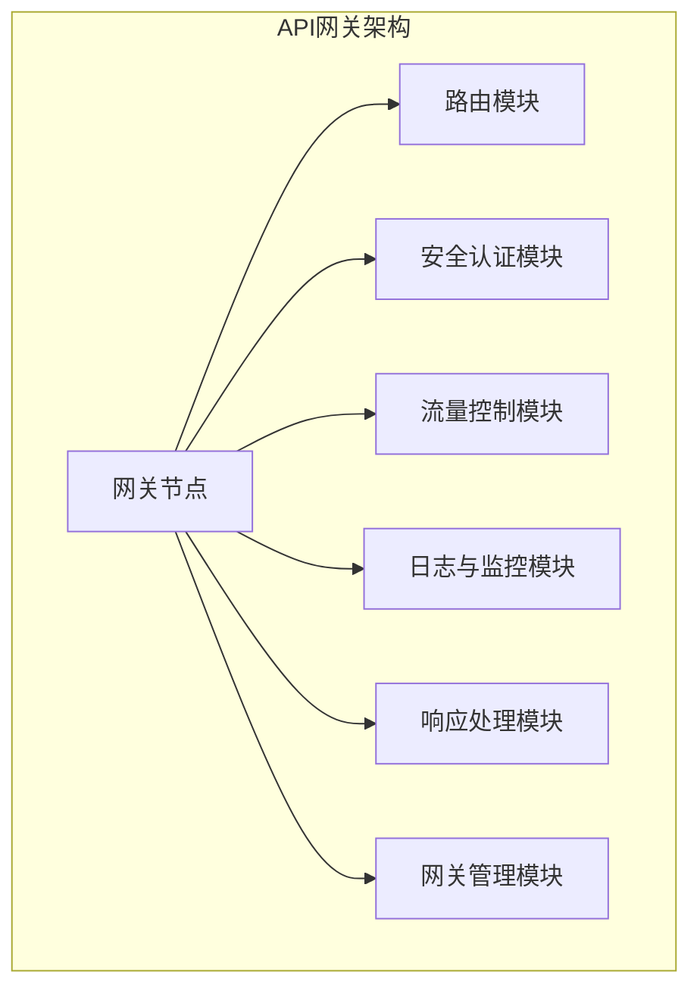
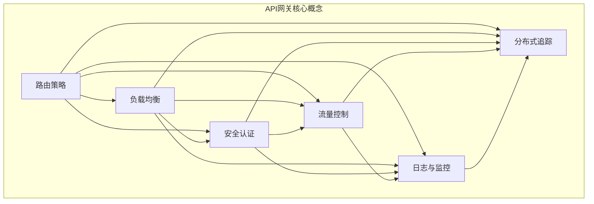

                 

### 1. 背景介绍 ###

#### API 网关的定义与作用

API（Application Programming Interface）网关作为现代分布式系统架构中的重要组成部分，其主要功能是作为前后端服务之间通信的桥梁。API 网关能够接收来自客户端的请求，并根据一定的策略和规则将其转发到对应的后端服务。这种设计不仅提高了系统的可扩展性和可维护性，同时也为后端服务提供了一种统一的接口，降低了不同服务之间的耦合度。

具体来说，API 网关在分布式系统中扮演着以下关键角色：

1. **路由控制**：根据请求的URL或参数，将请求路由到对应的后端服务。
2. **安全认证**：对请求进行身份验证和权限检查，确保只有合法用户才能访问受保护的服务。
3. **流量控制**：根据设定的策略限制每个服务的访问频率，防止服务被恶意攻击或滥用。
4. **聚合与解耦**：将多个后端服务的响应聚合为一个统一的响应，减少客户端与多个服务进行交互的复杂性。
5. **日志与监控**：收集各个服务的访问日志和性能数据，为系统的运维和监控提供数据支持。

#### API 网关的发展历程

API 网关的概念最早出现在 2000 年左右，当时主要是为了解决企业内部不同系统之间的交互问题。随着互联网的快速发展，API 网关逐渐成为了分布式系统架构中的标准组件。以下是 API 网关的发展历程：

- **早期阶段**：以自定义代码实现为主，功能相对简单，主要用于服务间的路由和控制。
- **成熟阶段**：随着开源框架和商业产品的出现，API 网关逐渐走向成熟。如 Netflix OSS 中的 Zuul、Amazon API Gateway 等成为业界标杆。
- **智能化阶段**：近年来，随着容器化和微服务架构的普及，API 网关开始引入智能路由、实时监控和自动化运维等功能，进一步提升系统的效率和可靠性。

#### 当前 API 网关的主要挑战

尽管 API 网关在分布式系统中发挥了重要作用，但在实际应用中仍然面临一些挑战：

1. **性能优化**：在流量高峰期，如何保证网关的响应速度和系统的稳定性。
2. **安全性**：如何防止网络攻击和非法访问，确保数据的安全性和隐私性。
3. **可扩展性**：随着业务的发展，如何快速扩展网关的功能和性能，以适应不断变化的需求。
4. **监控与运维**：如何实现实时监控和自动化运维，提高系统的可维护性。

#### 本文结构

本文将从以下几个方面详细探讨 API 网关的详细使用：

- **核心概念与联系**：介绍 API 网关的基本原理和核心组件。
- **核心算法原理 & 具体操作步骤**：分析 API 网关的核心算法，包括路由策略、流量控制等。
- **项目实践**：通过一个实际项目实例，演示如何搭建和配置 API 网关。
- **实际应用场景**：讨论 API 网关在不同场景下的应用，如微服务架构、前端聚合等。
- **工具和资源推荐**：介绍一些常用的 API 网关工具和资源，帮助读者快速上手。
- **总结**：总结 API 网关的发展趋势和面临的挑战，展望未来。

### 1.1. API 网关的基本工作流程

为了更好地理解 API 网关的作用和原理，我们首先来介绍 API 网关的基本工作流程。API 网关通常包括以下几个主要步骤：

1. **请求接收**：API 网关首先接收来自客户端的 HTTP 请求。这些请求可以来自各种客户端，如 Web 应用程序、移动应用程序或 API 客户端。

2. **请求解析**：API 网关解析请求中的 URL、HTTP 头部、查询参数等，以确定请求的目标服务。

3. **请求路由**：根据请求的 URL 或其他参数，API 网关将请求路由到对应的后端服务。路由策略可以基于简单的 URL 路径匹配，也可以基于更复杂的规则，如请求头、查询参数或 HTTP 方法。

4. **请求转发**：API 网关将解析后的请求转发到后端服务。这通常涉及与后端服务的 HTTP 请求或服务间通信。

5. **响应处理**：后端服务处理请求并返回响应。API 网关接收这些响应，并根据需要进行处理，如响应内容聚合、响应压缩、响应缓存等。

6. **响应返回**：API 网关将处理后的响应返回给客户端。

7. **日志记录**：API 网关记录每个请求和响应的详细信息，如请求时间、响应时间、请求路径、响应状态等。这些日志对于后续的监控、分析和服务优化至关重要。

8. **监控与告警**：API 网关监控系统性能和健康状况，并在检测到异常情况时发出告警。这有助于及时识别和解决潜在的问题，确保系统的稳定性和可靠性。

通过上述工作流程，API 网关实现了对服务请求的统一管理和转发，为分布式系统提供了重要的基础设施支持。

#### 实例演示

为了更直观地理解 API 网关的工作流程，我们来看一个简单的实例。假设我们有一个包含两个后端服务的微服务架构，分别是用户服务和订单服务。用户服务负责处理用户相关的操作，如注册、登录等；订单服务负责处理订单相关的操作，如下单、支付等。

首先，客户端发送一个请求到 API 网关，请求的 URL 是 `/users/register`。API 网关接收到请求后，首先解析 URL，确定请求的目标服务是用户服务。

接下来，API 网关根据预设的路由规则，将请求转发到用户服务的 `/register` 接口。用户服务处理请求并返回一个 JSON 响应，包含注册成功的信息。

API 网关接收到响应后，根据预设的策略对其进行处理，如响应内容聚合、响应压缩等。然后，API 网关将处理后的响应返回给客户端。

同时，API 网关记录本次请求和响应的详细信息，如请求时间、响应时间、请求路径、响应状态等，并将这些信息写入日志。

此外，API 网关会监控用户服务的健康状态，并在检测到异常情况时发出告警。例如，如果用户服务无法在规定时间内响应请求，API 网关会记录这个异常情况并通知运维人员。

通过上述实例，我们可以看到 API 网关在分布式系统中的重要作用。它不仅简化了服务间的交互流程，提高了系统的可维护性，还提供了强大的监控和告警功能，有助于确保系统的稳定性和可靠性。

### 1.2. API 网关的架构设计

API 网关作为分布式系统中的核心组件，其架构设计直接关系到系统的性能、安全性和可扩展性。一个典型的 API 网关架构通常包括以下几个关键部分：

#### 1.2.1. 网关节点

网关节点是 API 网关的核心组成部分，负责接收和处理来自客户端的请求。一个典型的 API 网关通常由多个节点组成，以实现负载均衡和高可用性。每个节点都可以独立运行，并通过服务发现机制动态注册和发现其他节点。

#### 1.2.2. 路由模块

路由模块负责根据请求的 URL、HTTP 头部或其他参数，将请求转发到对应的后端服务。路由策略可以基于简单的 URL 路径匹配，也可以基于更复杂的规则，如请求头、查询参数或 HTTP 方法。路由模块通常支持动态配置，以便根据业务需求灵活调整路由规则。

#### 1.2.3. 安全认证模块

安全认证模块负责对请求进行身份验证和权限检查，确保只有合法用户才能访问受保护的服务。常见的认证方式包括身份验证（如用户名和密码、令牌认证（如 JWT）等。安全认证模块可以集成第三方认证服务，如 OAuth2.0、LDAP 等，以提高系统的安全性和可扩展性。

#### 1.2.4. 流量控制模块

流量控制模块负责根据设定的策略限制每个服务的访问频率，防止服务被恶意攻击或滥用。常见的流量控制策略包括请求速率限制、并发连接限制等。流量控制模块可以基于令牌桶、漏桶等算法实现，以平衡系统的负载和性能。

#### 1.2.5. 日志与监控模块

日志与监控模块负责记录 API 网关的运行日志和性能数据，为系统的运维和监控提供数据支持。日志记录的内容通常包括请求时间、响应时间、请求路径、响应状态、错误信息等。监控模块可以集成第三方监控工具，如 Prometheus、Grafana 等，以实现实时监控和告警。

#### 1.2.6. 响应处理模块

响应处理模块负责对来自后端服务的响应进行加工和处理，如响应内容聚合、响应压缩、响应缓存等。响应处理模块可以自定义处理逻辑，以满足不同业务场景的需求。

#### 1.2.7. 网关管理模块

网关管理模块负责 API 网关的配置管理、监控管理、故障处理等。通过网关管理模块，运维人员可以方便地管理网关节点、配置路由规则、查看监控数据、处理故障等。

#### Mermaid 流程图

为了更清晰地展示 API 网关的架构设计，我们使用 Mermaid 流程图来表示。以下是 API 网关的架构设计 Mermaid 流程图：



通过上述架构设计，API 网关实现了对服务请求的统一管理和转发，为分布式系统提供了强大的基础设施支持。

### 2. 核心概念与联系

在深入探讨 API 网关的核心原理和应用之前，我们首先需要了解一些与之密切相关的基本概念和架构元素。这些概念和元素不仅构成了 API 网关的核心组成部分，还影响了其性能、可靠性和可扩展性。以下是 API 网关中的核心概念及其相互关系：

#### 2.1. 路由策略

路由策略是 API 网关的核心功能之一，它决定了如何将请求从客户端转发到后端服务。常见的路由策略包括：

- **基于 URL 的路由**：根据请求的 URL 路径匹配对应的后端服务。这是最简单也是最常用的路由策略。
- **基于请求头的路由**：根据请求头中的特定字段（如 Host、User-Agent 等）匹配后端服务。
- **基于查询参数的路由**：根据请求中的查询参数（如 ?param=value）匹配后端服务。
- **基于 HTTP 方法的路由**：根据 HTTP 请求方法（如 GET、POST、PUT 等）匹配后端服务。

路由策略可以通过配置文件或动态配置的方式定义，以适应不同的业务场景和需求。

#### 2.2. 负载均衡

负载均衡是确保 API 网关能够处理大量请求的关键机制。通过将请求均匀地分配到多个后端服务实例，负载均衡可以避免单点故障和资源过度消耗。常见的负载均衡算法包括：

- **轮询算法**：依次将请求分配到每个服务实例。
- **最少连接算法**：将请求分配到当前连接数最少的服务实例。
- **哈希算法**：根据请求的来源 IP 或其他字段进行哈希运算，将请求映射到特定的服务实例。

负载均衡可以通过 API 网关内置的负载均衡模块或第三方负载均衡器（如 Nginx、HAProxy 等）实现。

#### 2.3. 安全认证与授权

安全认证和授权是保障 API 网关安全性的重要手段。API 网关通常支持多种认证方式，如：

- **基于用户名和密码的认证**：最简单但安全性较低的认证方式。
- **令牌认证**：如 JWT（JSON Web Token）、OAuth2.0 等，提供更为安全和灵活的认证机制。
- **多因素认证**：结合密码、手机验证码、指纹等手段，提高认证安全性。

授权机制则确保用户只能访问被授权的资源，常见的授权方式包括：

- **基于角色的访问控制（RBAC）**：根据用户的角色分配访问权限。
- **基于属性的访问控制（ABAC）**：根据请求的属性（如用户、时间、位置等）进行访问控制。

#### 2.4. 流量控制

流量控制是防止服务被恶意攻击或滥用的重要机制。API 网关可以通过以下策略进行流量控制：

- **速率限制**：限制每个用户或 IP 地址在一定时间内的请求次数，如使用令牌桶或漏桶算法。
- **并发限制**：限制同时处理的请求数量，以避免系统过载。
- **黑白名单**：将特定的用户或 IP 地址加入黑名单或白名单，以控制其访问权限。

#### 2.5. 日志与监控

日志和监控是 API 网关运维和性能优化的重要工具。API 网关通常会记录以下日志信息：

- **访问日志**：记录每个请求的时间、来源、目标服务、请求方法和状态等信息。
- **错误日志**：记录请求处理过程中发生的错误信息，有助于定位和解决问题。

监控则通过对系统性能指标（如响应时间、吞吐量、CPU 使用率等）的实时监控，及时发现潜在问题并采取相应措施。

#### 2.6. 分布式追踪

分布式追踪是了解和分析系统内部调用关系的重要手段。API 网关通常会集成分布式追踪系统（如 Zipkin、Jaeger），以记录每个请求的调用路径、耗时等信息。这有助于快速定位和解决问题。

#### Mermaid 流程图

以下是一个描述 API 网关核心概念的 Mermaid 流程图，展示了路由策略、负载均衡、安全认证、流量控制、日志与监控以及分布式追踪之间的相互关系：



通过上述核心概念和相互关系的描述，我们可以更好地理解 API 网关的工作原理和架构设计，为后续的详细探讨和应用打下坚实基础。

### 2.1. API 网关核心算法原理

在深入探讨 API 网关的具体实现和操作步骤之前，我们首先需要了解 API 网关所涉及的核心算法原理。这些算法不仅决定了 API 网关的性能和效率，还直接影响了其稳定性和可靠性。以下是 API 网关中几个关键算法的原理和具体实现方法。

#### 2.1.1. 路由算法

路由算法是 API 网关的核心算法之一，它决定了如何将客户端请求路由到对应的后端服务。常见的路由算法包括基于 URL 路径匹配的算法和基于策略的路由算法。

**基于 URL 路径匹配的算法**：
这种算法是最简单也是最常用的路由算法。它通过将客户端请求的 URL 与预先配置的路由规则进行匹配，确定请求的目标服务。具体的实现方法如下：

1. **预先配置路由表**：在 API 网关启动时，根据配置文件或数据库中的路由规则，构建一个路由表。路由表包含每个 URL 路径及其对应的后端服务地址。
2. **请求 URL 匹配**：当接收到客户端请求时，根据请求的 URL，在路由表中查找与之匹配的路由规则。如果找到匹配规则，则将请求路由到对应的后端服务；否则，返回 404 错误。
3. **路由策略**：在路由表中，可以为每个 URL 路径配置不同的路由策略，如优先级、权重等，以实现更复杂的路由规则。

**基于策略的路由算法**：
这种算法可以根据客户端请求的属性（如请求头、查询参数、用户身份等）动态决定路由策略。具体的实现方法如下：

1. **请求属性解析**：在接收到客户端请求时，解析请求头、查询参数等属性，获取与路由策略相关的信息。
2. **策略匹配**：根据请求属性，匹配预先定义的路由策略。每个策略可以定义一系列规则，如 URL 匹配、请求头匹配等。
3. **路由决策**：根据匹配到的策略，决定请求的目标服务。如果多个策略匹配，可以根据策略的优先级或权重进行选择。

**示例**：
假设我们有一个包含两个后端服务的 API 网关，分别是用户服务和订单服务。用户服务的 URL 路径为 `/users/*`，订单服务的 URL 路径为 `/orders/*`。我们可以根据不同的路由策略配置路由表：

```
路由表：
- URL: /users/*
  目标服务：用户服务
- URL: /orders/*
  目标服务：订单服务
```

**请求示例**：
1. 请求 URL: `/users/register`，匹配路由规则：路由到用户服务。
2. 请求 URL: `/orders/12345`，匹配路由规则：路由到订单服务。

#### 2.1.2. 流量控制算法

流量控制算法用于限制 API 网关接收和处理请求的速率，以防止服务被恶意攻击或过度使用。常见的流量控制算法包括令牌桶算法和漏桶算法。

**令牌桶算法**：
令牌桶算法是一种基于漏桶模型的流量控制算法，它可以限制请求的发送速率，同时允许一定的突发流量。具体的实现方法如下：

1. **初始化**：定义一个令牌桶，其容量为 C，桶内初始令牌数量为 C。
2. **生成令牌**：以固定速率 r 生成令牌，直到桶满为止。
3. **处理请求**：每当接收到一个请求时，从令牌桶中领取一个令牌，如果没有令牌，则丢弃请求或放入队列等待。
4. **删除过期令牌**：定期删除桶中过期的令牌。

**漏桶算法**：
漏桶算法是一种基于固定速率的流量控制算法，它可以确保请求的发送速率不超过设定值，同时允许一定程度的突发流量。具体的实现方法如下：

1. **初始化**：定义一个容量为 C 的桶，一个发送速率 r 的漏水口。
2. **处理请求**：每当接收到一个请求时，将请求放入桶中。如果桶中有空位，则立即发送请求；否则，将请求放入队列等待。
3. **漏水**：以速率 r 从桶中删除请求，直到桶为空。

**示例**：
假设我们使用令牌桶算法进行流量控制，桶容量 C 为 100，生成令牌速率 r 为 10 每秒。在一个 1 秒的时间窗口内，最多允许 10 个请求通过。

**请求示例**：
1. 第 0 秒：生成 10 个令牌，桶内令牌数量为 10。
2. 第 1 秒：生成 10 个令牌，桶内令牌数量为 20。
3. 第 2 秒：生成 10 个令牌，桶内令牌数量为 30。
4. 第 3 秒：接收到一个请求，从桶中领取一个令牌，桶内令牌数量为 29。
5. 第 4 秒：接收到一个请求，从桶中领取一个令牌，桶内令牌数量为 28。
6. 第 5 秒：接收到一个请求，桶内没有令牌，请求被丢弃。

通过上述核心算法的介绍和实现方法，我们可以更好地理解 API 网关的工作原理和性能优化策略。在实际应用中，可以根据具体需求和场景选择合适的算法，以提高系统的效率和可靠性。

#### 2.1.3. 安全认证算法

在 API 网关中，安全认证算法是确保只有合法用户才能访问受保护资源的重要手段。常见的认证算法包括基于用户名和密码的认证、令牌认证（如 JWT）以及多因素认证。

**基于用户名和密码的认证**：
这种认证方式是最简单但安全性较低的一种。客户端在首次登录时，需要提交用户名和密码，服务器验证通过后，生成一个会话令牌（如 Session ID），并将其返回给客户端。在后续的请求中，客户端只需在请求头中包含该会话令牌，服务器即可验证其合法性。

具体的实现步骤如下：
1. **用户登录**：客户端提交用户名和密码，服务器验证通过后，生成一个会话令牌，并返回给客户端。
2. **请求验证**：在每次请求中，客户端将包含会话令牌的请求头发送到服务器，服务器验证令牌的有效性。
3. **令牌失效**：会话令牌通常有一个有效期，过期后客户端需要重新进行用户登录。

**令牌认证（如 JWT）**：
JWT（JSON Web Token）是一种基于 JSON 格式的安全令牌，可以用于无状态的身份认证。JWT 包含了用户身份、权限信息等，在生成时使用私钥进行签名，以确保其安全性。

具体的实现步骤如下：
1. **用户登录**：客户端提交用户名和密码，服务器验证通过后，生成一个 JWT 令牌，并返回给客户端。
2. **请求验证**：在每次请求中，客户端将 JWT 令牌附加到请求头中，服务器验证令牌的签名和有效性。
3. **令牌解析**：服务器使用公钥对 JWT 令牌进行解析，获取用户身份和权限信息。
4. **令牌刷新**：JWT 令牌通常有一个有效期，过期后客户端需要重新生成一个新的 JWT 令牌。

**多因素认证**：
多因素认证是一种结合多种认证方式，以提高认证安全性的方法。常见的多因素认证包括密码+手机验证码、密码+指纹、密码+智能卡等。

具体的实现步骤如下：
1. **用户登录**：客户端首先提交用户名和密码，服务器验证通过后，要求客户端进行额外的验证，如手机验证码、指纹等。
2. **请求验证**：每次请求都需要通过多个因素的验证，以确保客户端身份的合法性。

**示例**：
假设我们使用 JWT 进行认证，用户登录后服务器生成一个 JWT 令牌，客户端在每次请求中携带该令牌。

**请求示例**：
1. 用户登录：客户端提交用户名和密码，服务器生成 JWT 令牌，并返回给客户端。
2. 请求资源：客户端在请求头中包含 JWT 令牌，服务器验证令牌的签名和有效期，确认请求合法后，返回请求的资源。

通过上述认证算法的介绍，我们可以看到不同认证方式的特点和实现方法。在实际应用中，可以根据具体需求和安全性要求选择合适的认证算法，以确保系统的安全性和可靠性。

### 2.1.4. API 网关具体操作步骤

在了解 API 网关的核心算法原理后，接下来我们将详细介绍 API 网关的具体操作步骤，包括环境搭建、配置设置和基本使用方法。这些步骤将帮助您更好地理解和掌握 API 网关的使用。

#### 2.1.4.1. 环境搭建

要搭建一个基本的 API 网关，首先需要准备以下环境：

1. **操作系统**：建议使用 Ubuntu 或 CentOS 等主流 Linux 发行版。
2. **Java 运行环境**：由于大部分 API 网关框架是基于 Java 编写的，因此需要安装 Java 运行环境。推荐使用 OpenJDK 8 或更高版本。
3. **Maven**：用于构建和依赖管理，确保已安装 Maven 3.6 或更高版本。
4. **数据库**：部分 API 网关框架需要配置数据库，如 PostgreSQL、MySQL 等。

安装步骤如下：

1. **安装 Java**：
   ```bash
   sudo apt-get update
   sudo apt-get install openjdk-8-jdk
   ```

2. **安装 Maven**：
   ```bash
   sudo apt-get update
   sudo apt-get install maven
   ```

3. **安装数据库**（以 PostgreSQL 为例）：
   ```bash
   sudo apt-get update
   sudo apt-get install postgresql postgresql-contrib
   sudo -u postgres psql
   CREATE DATABASE mydb;
   \q
   ```

#### 2.1.4.2. 选择并安装 API 网关框架

市面上有很多优秀的 API 网关框架，如 Spring Cloud Gateway、Apache APISIX、Kong 等。以下以 Spring Cloud Gateway 为例进行介绍。

1. **下载 Spring Cloud Gateway**：
   ```bash
   git clone https://github.com/spring-cloud/spring-cloud-gateway.git
   cd spring-cloud-gateway
   ```

2. **构建 Spring Cloud Gateway**：
   ```bash
   ./mvnw clean install -DskipTests
   ```

3. **部署 Spring Cloud Gateway**：
   将构建好的 Spring Cloud Gateway 包（spring-cloud-gateway-xxx.jar）部署到服务器上，可以使用 Java 容器如 Tomcat、Jetty 等。

#### 2.1.4.3. 配置设置

在部署 Spring Cloud Gateway 后，需要对它进行一些基本的配置，包括路由规则、认证策略和流量控制等。

1. **路由规则**：
   Spring Cloud Gateway 使用 Yaml 文件进行配置，例如 `application.yml`：

   ```yaml
   server:
     port: 8080
   
   spring:
     application:
       name: api-gateway
     cloud:
       gateway:
         routes:
           - id: user-service
             uri: lb://user-service
             predicates:
               - Path=/users/**
             filters:
               - StripPrefix=1
           - id: order-service
             uri: lb://order-service
             predicates:
               - Path=/orders/**
             filters:
               - StripPrefix=1
   
   eureka:
     client:
       serviceUrl:
         defaultZone: http://eureka-server:8761/eureka/

   security:
     basic:
       enabled: true
     user:
       name: admin
       password: admin
   ```

   在上述配置中，定义了两个路由规则，分别指向 `user-service` 和 `order-service`。其中，`predicates` 用于定义路由匹配规则，`filters` 用于定义路由过程中的处理逻辑。

2. **认证策略**：
   Spring Cloud Gateway 支持 Spring Security，可以通过配置文件或代码实现自定义认证策略。例如，在 `application.yml` 中配置：

   ```yaml
   security:
     basic:
       enabled: true
     user:
       name: admin
       password: admin
   ```

   这将启用基于用户名和密码的认证。在每次请求时，客户端需要携带 `Authorization` 头，格式为 `Basic YWRtaW46YWRtaW4=`。

3. **流量控制**：
   Spring Cloud Gateway 支持使用 Guava RateLimiter 实现流量控制。例如，在 `application.yml` 中配置：

   ```yaml
   spring:
     cloud:
       gateway:
         routes:
           - id: user-service
             uri: lb://user-service
             predicates:
               - Path=/users/**
             filters:
               - name: RequestRateLimiter
                 config:
                   key-resolver: "#{"@org.springframework.cloud.gateway.filter.factory.RequestRateLimiterKeyResolverFactory@0".resolveKey�"]
                 limits:
                   - limit: 10
                     interval: 1
   ```

   这将限制 `/users` 下的所有请求在 1 秒内最多只能有 10 个。

#### 2.1.4.4. 基本使用方法

1. **启动 Spring Cloud Gateway**：
   ```bash
   java -jar spring-cloud-gateway-xxx.jar
   ```

2. **访问服务**：
   当 Spring Cloud Gateway 启动后，可以通过以下 URL 访问服务：

   ```bash
   curl -X GET "http://localhost:8080/users"
   ```

   如果一切正常，您将收到来自 `user-service` 的响应。

通过上述步骤，我们成功地搭建并配置了一个基本的 API 网关。在实际应用中，您可以根据具体需求进一步扩展和定制 API 网关的功能。

### 3. 数学模型和公式 & 详细讲解 & 举例说明

在深入探讨 API 网关的核心算法和实现方法时，我们不可避免地会涉及到一些数学模型和公式。这些模型和公式不仅有助于我们理解算法的工作原理，还可以帮助我们进行性能分析和优化。在本节中，我们将详细介绍与 API 网关相关的一些关键数学模型和公式，并通过具体例子进行讲解。

#### 3.1. 负载均衡算法

负载均衡是 API 网关的一个重要功能，它决定了如何将请求分配到多个后端服务实例。以下是几种常见的负载均衡算法及其数学模型。

**1. 轮询算法**

轮询算法是一种最简单的负载均衡策略，它将请求依次分配到每个后端服务实例。

**公式**：
\[ P(i) = \frac{1}{N} \]

其中，\( P(i) \) 表示请求被分配到第 \( i \) 个服务实例的概率，\( N \) 表示服务实例的总数。

**例子**：
假设有 3 个服务实例，请求被均匀地分配到每个实例的概率分别为：
\[ P(1) = P(2) = P(3) = \frac{1}{3} \]

**2. 最少连接算法**

最少连接算法将请求分配到当前连接数最少的服务实例，以均衡负载。

**公式**：
\[ P(i) = \frac{C_{\min}}{C_{\sum}} \]

其中，\( P(i) \) 表示请求被分配到第 \( i \) 个服务实例的概率，\( C_{\min} \) 表示当前连接数最少的实例的连接数，\( C_{\sum} \) 表示所有实例的连接数之和。

**例子**：
假设有 3 个服务实例，当前连接数分别为 1、2、3，请求被分配到每个实例的概率分别为：
\[ P(1) = \frac{1}{6}, \quad P(2) = \frac{2}{6}, \quad P(3) = \frac{3}{6} \]

**3. 哈希算法**

哈希算法通过哈希函数将请求映射到特定的服务实例。

**公式**：
\[ i = \text{hash}(key) \mod N \]

其中，\( i \) 表示请求被分配到的服务实例编号，\( \text{hash}(key) \) 是哈希函数，\( N \) 是服务实例的总数。

**例子**：
假设使用 FNV-1a 哈希函数，3 个服务实例的编号分别为 1、2、3，请求的哈希值为 10，则请求被分配到第 1 个实例。

\[ i = \text{hash}(10) \mod 3 = 1 \]

#### 3.2. 速率限制算法

速率限制是 API 网关中另一个重要的功能，它用于防止服务被恶意攻击或过度使用。以下介绍几种常见的速率限制算法。

**1. 令牌桶算法**

令牌桶算法通过一个固定容量的桶生成令牌，以限制请求的发送速率。

**公式**：
\[ L(t) = L_{\max} - \int_{t_0}^{t} r \, dt \]

其中，\( L(t) \) 表示在时间 \( t \) 时桶内的令牌数量，\( L_{\max} \) 表示桶的容量，\( r \) 表示生成令牌的速率。

**例子**：
假设令牌桶容量为 100，生成令牌的速率为 10 每秒，则在一个 10 秒的时间窗口内，桶内的令牌数量为 100 - \( 10 \times 10 = 0 \)。

**2. 漏桶算法**

漏桶算法通过一个固定速率的桶，以限制请求的发送速率。

**公式**：
\[ Q(t) = Q_0 + r \times (t - t_0) \]

其中，\( Q(t) \) 表示在时间 \( t \) 时桶内的请求数量，\( Q_0 \) 表示桶的初始请求数量，\( r \) 表示发送请求的速率。

**例子**：
假设漏桶初始请求数量为 0，发送请求的速率为 5 每秒，则在一个 10 秒的时间窗口内，桶内的请求数量为 5 \times 10 = 50。

#### 3.3. 安全认证算法

安全认证算法用于确保只有合法用户才能访问受保护的资源。以下介绍几种常见的认证算法。

**1. 基于用户名和密码的认证**

基于用户名和密码的认证是一种简单但安全性较低的认证方式。

**公式**：
\[ \text{password\_hash}(password) = hash(password + salt) \]

其中，\( \text{password\_hash}(password) \) 是密码的哈希值，\( salt \) 是随机盐值。

**例子**：
假设用户的密码为 "password"，随机盐值为 "salt"，则密码的哈希值为：
\[ \text{password\_hash}(password) = hash("password" + "salt") \]

**2. 令牌认证（如 JWT）**

JWT 是一种基于 JSON 格式的安全令牌，它包含用户身份和权限信息。

**公式**：
\[ JWT = \text{header} \cdot \text{payload} \cdot \text{signature} \]

其中，\( \text{header} \) 是 JWT 的头部，包含加密算法等信息；\( \text{payload} \) 是 JWT 的负载，包含用户身份和权限信息；\( \text{signature} \) 是 JWT 的签名，用于验证 JWT 的有效性。

**例子**：
一个简单的 JWT 可能如下所示：
```json
{
  "header": {
    "alg": "HS256",
    "typ": "JWT"
  },
  "payload": {
    "sub": "1234567890",
    "name": "John Doe",
    "admin": true
  },
  "signature": "..."
}
```

通过上述数学模型和公式的讲解，我们可以更好地理解 API 网关的核心算法和工作原理。在实际应用中，可以根据具体需求和场景选择合适的算法，以提高系统的性能、安全性和可靠性。

### 4. 项目实践：代码实例和详细解释说明

在本节中，我们将通过一个实际的代码实例，详细展示如何搭建和配置一个 API 网关。我们将使用 Spring Cloud Gateway 作为 API 网关的实现，结合 Spring Boot 进行开发。以下是具体的实现步骤和代码解析。

#### 4.1. 开发环境搭建

为了搭建一个完整的 API 网关项目，我们需要以下开发环境：

1. **Java 开发工具**：建议使用 IntelliJ IDEA 或 Eclipse。
2. **Maven**：用于项目的构建和管理，确保已安装 Maven 3.6 或更高版本。
3. **Spring Boot**：用于构建 Web 应用程序，确保已安装 Spring Boot 2.4.5 或更高版本。

安装步骤如下：

1. **安装 Java**：
   ```bash
   sudo apt-get update
   sudo apt-get install openjdk-8-jdk
   ```

2. **安装 Maven**：
   ```bash
   sudo apt-get update
   sudo apt-get install maven
   ```

3. **安装 Spring Boot**：
   ```bash
   sudo apt-get update
   sudo apt-get install spring-boot
   ```

#### 4.2. 创建 Spring Boot 项目

使用 Spring Initializr（https://start.spring.io/）创建一个 Spring Boot 项目，选择以下依赖：

- **Web**：用于构建 Web 应用程序。
- **Spring Cloud Gateway**：用于实现 API 网关。

生成的项目结构如下：

```plaintext
src
├── main
│   ├── java
│   │   └── com.example.apigateway
│   │       └── ApigatewayApplication.java
│   └── resources
│       └── application.yml
└── test
    └── java
        └── com.example.apigateway
            └── ApigatewayApplicationTests.java
```

#### 4.3. 配置 API 网关

在 `application.yml` 文件中，我们需要配置 API 网关的路由规则、认证策略和流量控制等。

```yaml
server:
  port: 8080

spring:
  application:
    name: api-gateway
  cloud:
    gateway:
      routes:
        - id: user-service
          uri: lb://user-service
          predicates:
            - Path=/users/**
          filters:
            - StripPrefix=1
        - id: order-service
          uri: lb://order-service
          predicates:
            - Path=/orders/**
          filters:
            - StripPrefix=1

eureka:
  client:
    serviceUrl:
      defaultZone: http://eureka-server:8761/eureka/

security:
  basic:
    enabled: true
  user:
    name: admin
    password: admin
```

在该配置文件中，我们定义了两个路由规则：

1. **user-service**：将 `/users` 下的所有请求路由到用户服务。
2. **order-service**：将 `/orders` 下的所有请求路由到订单服务。

同时，我们使用了 `StripPrefix` 过滤器，去除请求路径中的前缀，以便直接访问后端服务。

#### 4.4. 启动用户服务和订单服务

在 Spring Cloud Gateway 项目中，我们还需要启动用户服务和订单服务。这两个服务需要注册到 Eureka 服务注册中心，以便 API 网关能够发现和路由请求。

**用户服务（UserService）**：

```java
@SpringBootApplication
@EnableDiscoveryClient
public class UserServiceApplication {

  public static void main(String[] args) {
    SpringApplication.run(UserServiceApplication.class, args);
  }

}
```

**订单服务（OrderService）**：

```java
@SpringBootApplication
@EnableDiscoveryClient
public class OrderServiceApplication {

  public static void main(String[] args) {
    SpringApplication.run(OrderServiceApplication.class, args);
  }

}
```

在启动类上使用 `@EnableDiscoveryClient` 注解，以便自动注册到 Eureka 服务注册中心。

#### 4.5. 测试 API 网关

在完成上述配置和启动后，我们可以通过以下步骤测试 API 网关：

1. 启动 Spring Cloud Gateway 服务。
2. 启动用户服务和订单服务。
3. 通过浏览器或工具（如 Postman）访问 API 网关。

例如，访问 `/users` 接口：

```bash
curl -X GET "http://localhost:8080/users"
```

如果一切正常，您将收到来自用户服务的响应。

#### 4.6. 代码解读与分析

在了解代码实例后，我们可以对其进行分析和解读，以便更好地理解 API 网关的实现原理。

**4.6.1. Spring Cloud Gateway 的启动类**

```java
@SpringBootApplication
@EnableDiscoveryClient
public class ApigatewayApplication {

  public static void main(String[] args) {
    SpringApplication.run(ApigatewayApplication.class, args);
  }

}
```

在启动类上，我们使用了 `@SpringBootApplication` 和 `@EnableDiscoveryClient` 注解。`@SpringBootApplication` 是 Spring Boot 的核心注解，用于启动 Spring Boot 应用程序。`@EnableDiscoveryClient` 则用于启用服务发现功能，以便 API 网关能够自动注册到 Eureka 服务注册中心。

**4.6.2. application.yml 配置文件**

```yaml
server:
  port: 8080

spring:
  application:
    name: api-gateway
  cloud:
    gateway:
      routes:
        - id: user-service
          uri: lb://user-service
          predicates:
            - Path=/users/**
          filters:
            - StripPrefix=1
        - id: order-service
          uri: lb://order-service
          predicates:
            - Path=/orders/**
          filters:
            - StripPrefix=1

eureka:
  client:
    serviceUrl:
      defaultZone: http://eureka-server:8761/eureka/

security:
  basic:
    enabled: true
  user:
    name: admin
    password: admin
```

在配置文件中，我们定义了两个路由规则：

1. **user-service**：将 `/users` 下的所有请求路由到用户服务。使用了 `Path` 断言，用于匹配请求的 URL 路径。
2. **order-service**：将 `/orders` 下的所有请求路由到订单服务。同样使用了 `Path` 断言。

我们使用了 `StripPrefix` 过滤器，去除请求路径中的前缀，以便直接访问后端服务。

**4.6.3. 用户服务和订单服务的启动类**

```java
@SpringBootApplication
@EnableDiscoveryClient
public class UserServiceApplication {

  public static void main(String[] args) {
    SpringApplication.run(UserServiceApplication.class, args);
  }

}
```

```java
@SpringBootApplication
@EnableDiscoveryClient
public class OrderServiceApplication {

  public static void main(String[] args) {
    SpringApplication.run(OrderServiceApplication.class, args);
  }

}
```

在用户服务和订单服务的启动类上，我们也使用了 `@SpringBootApplication` 和 `@EnableDiscoveryClient` 注解，以便自动注册到 Eureka 服务注册中心。

通过上述代码实例和解读，我们可以看到如何使用 Spring Cloud Gateway 搭建一个简单的 API 网关，并实现路由、认证和流量控制等功能。在实际项目中，可以根据具体需求进行扩展和定制。

### 5. 实际应用场景

API 网关在现代分布式系统中有着广泛的应用，不同的应用场景下，API 网关可以发挥出不同的价值。以下我们将探讨几个典型的实际应用场景，并分析 API 网关在这些场景下的作用和优势。

#### 5.1. 微服务架构

在微服务架构中，API 网关扮演着至关重要的角色。它作为系统的统一入口，负责处理所有外部请求，并将请求路由到相应的微服务。通过 API 网关，可以实现对微服务的集中管理和控制，从而提高系统的可维护性和可扩展性。

**作用和优势**：

- **统一接口**：API 网关为所有微服务提供了一个统一的接口，降低了客户端与多个微服务之间的复杂度。
- **流量控制**：通过 API 网关，可以集中实现流量控制策略，如请求速率限制和并发连接限制，防止服务被恶意攻击或滥用。
- **安全认证**：API 网关可以集成身份验证和授权机制，确保只有合法用户才能访问受保护的服务。
- **服务聚合**：API 网关可以将多个微服务的响应聚合为一个统一的响应，减少客户端与多个服务进行交互的复杂性。

#### 5.2. 前端聚合

在大型企业级应用中，前端经常会需要从多个后端服务获取数据，例如，一个电商平台需要从用户服务、商品服务、订单服务等多个后端服务获取数据，并将其整合在一个页面中展示给用户。此时，API 网关可以起到前端聚合的作用。

**作用和优势**：

- **减少请求次数**：通过 API 网关，前端可以发送一个请求获取所有所需数据，而不是分别发送多个请求。
- **优化性能**：减少请求次数可以减少网络延迟和负载，提高系统的性能。
- **灵活配置**：API 网关可以根据业务需求动态配置聚合规则，如数据合并、过滤等。
- **减少耦合**：前端与后端服务的耦合度降低，前端开发人员无需关心后端服务的具体实现细节。

#### 5.3. 跨域请求

在 Web 应用中，经常会遇到跨域请求的问题。跨域请求是因为浏览器的同源策略限制，导致无法直接访问不同源的服务。通过 API 网关，可以实现对跨域请求的处理，从而解决跨域问题。

**作用和优势**：

- **统一处理**：API 网关可以统一处理所有跨域请求，提高系统的可维护性。
- **简化开发**：前端开发者无需关心跨域请求的具体实现细节，只需通过 API 网关进行访问即可。
- **安全性**：API 网关可以集成跨域请求认证和授权机制，确保跨域请求的安全性。

#### 5.4. API 网关与消息队列

API 网关不仅可以处理 HTTP 请求，还可以与消息队列结合使用，实现对消息系统的统一管理和控制。

**作用和优势**：

- **异步处理**：通过消息队列，可以实现异步处理，提高系统的响应速度和可扩展性。
- **解耦系统**：API 网关与消息队列的协同工作，可以实现系统间的解耦，提高系统的稳定性。
- **灵活路由**：API 网关可以根据业务需求动态调整消息路由策略，如优先级、路由策略等。
- **监控与告警**：API 网关可以集成消息队列的监控和告警机制，实时监控系统的运行状态。

通过以上实际应用场景的介绍，我们可以看到 API 网关在分布式系统中的重要作用。无论是在微服务架构、前端聚合、跨域请求还是与消息队列结合等方面，API 网关都提供了强大的功能和优势，为系统的稳定、高效和可靠运行提供了有力支持。

### 7. 工具和资源推荐

#### 7.1. 学习资源推荐

为了帮助您更好地理解和掌握 API 网关的相关知识和技能，我们推荐以下学习资源：

1. **《API 网关设计与实践》**：这是一本关于 API 网关设计和实现的经典教材，详细介绍了 API 网关的核心概念、架构设计、核心技术以及实际应用案例。

2. **《微服务设计》**：这本书深入探讨了微服务架构的设计原则和实践，包括 API 网关在微服务架构中的应用和实现。

3. **Spring Cloud Gateway 官方文档**：Spring Cloud Gateway 是目前最流行的 API 网关之一，其官方文档提供了详细的教程、API 文档和参考示例。

4. **Apache APISIX 官方文档**：Apache APISIX 是一款高性能、可扩展的 API 网关，其官方文档包含了丰富的教程和参考文档。

#### 7.2. 开发工具框架推荐

在开发 API 网关时，使用合适的开发工具和框架可以提高开发效率和代码质量。以下是一些推荐的开发工具和框架：

1. **IntelliJ IDEA**：这是一款功能强大的 Java 开发工具，支持 Spring Cloud Gateway 和其他 API 网关框架的集成开发。

2. **Postman**：Postman 是一款流行的 API 开发和测试工具，可以帮助您快速构建、测试和文档化 API。

3. **Maven**：Maven 是一款流行的依赖管理和构建工具，可以简化项目构建和部署过程。

4. **Docker**：Docker 是一款用于容器化的工具，可以帮助您快速构建、部署和运行 API 网关容器。

#### 7.3. 相关论文著作推荐

为了更深入地研究 API 网关的相关技术和应用，以下是一些推荐的论文和著作：

1. **"An Overview of API Gateway Design and Implementation"**：这是一篇关于 API 网关设计和实现的综述论文，详细介绍了 API 网关的核心技术和应用场景。

2. **"Microservices Architecture: Design Principles for Scalable and Reliable Systems"**：这是一本关于微服务架构的论文，深入探讨了 API 网关在微服务架构中的应用和实现。

3. **"The Design and Implementation of an API Gateway for a Microservices Architecture"**：这是一篇关于 API 网关在微服务架构中应用的具体实现案例，详细介绍了 API 网关的架构设计和实现细节。

通过以上推荐的学习资源、开发工具和论文著作，您可以系统地学习 API 网关的相关知识和技能，提高自己在分布式系统开发中的竞争力。

### 8. 总结：未来发展趋势与挑战

API 网关作为现代分布式系统架构中的核心组件，正经历着快速的发展和创新。在未来，API 网关将继续在以下几个方面发挥重要作用，并面临一系列新的挑战：

#### 8.1. 未来发展趋势

1. **智能化与自动化**：随着人工智能和机器学习技术的不断发展，API 网关有望实现智能化和自动化。例如，通过机器学习算法，API 网关可以自动调整路由策略、流量控制策略等，以适应动态变化的网络环境。

2. **安全性与隐私保护**：随着网络攻击手段的日益多样化和复杂化，API 网关在安全性方面的要求将越来越高。未来，API 网关将更加注重安全特性的集成，如加密传输、认证授权、数据隐私保护等。

3. **高性能与低延迟**：随着 5G 网络的普及和物联网设备的增加，API 网关需要处理更多的请求和数据，同时要求更高的性能和更低的延迟。为此，API 网关将采用更高效的算法、优化缓存策略、提升网络传输效率等。

4. **服务融合与云原生**：随着云计算和微服务架构的普及，API 网关将更多地与云计算平台和云原生技术相结合，提供更加灵活和高效的服务融合解决方案。

#### 8.2. 未来面临的挑战

1. **性能优化**：在高并发、大数据量的情况下，如何确保 API 网关的稳定性和性能，是未来需要重点解决的问题。

2. **安全性**：如何有效防范网络攻击、数据泄露等安全威胁，确保系统的安全性和数据隐私，是 API 网关面临的重要挑战。

3. **可扩展性**：随着业务需求的不断变化，如何快速扩展 API 网关的功能和性能，以满足不断增长的业务需求，是 API 网关需要解决的关键问题。

4. **监控与运维**：如何实现实时监控、自动化运维，提高系统的可维护性和可靠性，是 API 网关运维人员需要面对的挑战。

#### 8.3. 总结

API 网关作为分布式系统中的重要组件，其未来发展将充满机遇和挑战。通过不断创新和优化，API 网关有望在未来为分布式系统提供更加智能、安全、高效和可靠的支持。同时，API 网关的开发者和运维人员也需要不断学习和适应新技术，以应对日益复杂的业务需求和挑战。

### 9. 附录：常见问题与解答

在本节中，我们将回答一些关于 API 网关的常见问题，帮助读者更好地理解和掌握 API 网关的相关知识。

#### 9.1. API 网关与负载均衡器有什么区别？

API 网关和负载均衡器在功能上有所重叠，但它们的作用和设计目标有所不同。

- **API 网关**：API 网关不仅负责负载均衡，还提供了路由控制、安全认证、流量控制、日志记录等高级功能。它作为系统的统一入口，对内部和外部请求进行统一管理和处理。
- **负载均衡器**：负载均衡器的主要功能是分散流量，将请求均匀地分配到多个后端服务器，以避免单点故障和资源过度消耗。它通常不涉及安全认证和流量控制等高级功能。

#### 9.2. API 网关是否可以用于内部服务？

是的，API 网关可以用于内部服务的管理和控制。在大型企业级应用中，内部服务往往需要通过 API 网关进行访问和管理，以便实现统一接口、安全认证、流量控制等。

#### 9.3. API 网关可以与消息队列结合使用吗？

是的，API 网关可以与消息队列结合使用。通过 API 网关，可以实现对消息队列的统一管理和控制，如路由消息、流量控制、监控等。此外，API 网关还可以将消息队列的响应聚合为一个统一的响应，减少客户端与多个服务进行交互的复杂性。

#### 9.4. API 网关是否可以集成第三方认证服务？

是的，API 网关可以集成第三方认证服务。例如，API 网关可以集成 OAuth2.0、OAuth2.0、LDAP 等认证服务，以实现多因素认证、单点登录等功能。

#### 9.5. API 网关需要数据库支持吗？

API 网关本身不需要数据库支持，但部分 API 网关框架（如 Apache APISIX）提供了数据库集成功能，以便存储路由规则、认证策略等配置信息。

#### 9.6. API 网关的性能如何优化？

优化 API 网关的性能可以从以下几个方面进行：

- **提高并发处理能力**：使用高效的负载均衡算法，提高请求的并发处理能力。
- **缓存策略**：合理使用缓存，减少对后端服务的请求次数。
- **优化网络传输**：使用压缩算法、减少 HTTP 头部大小等，提高网络传输效率。
- **监控与告警**：实时监控 API 网关的性能指标，及时发现和解决问题。

通过上述常见问题与解答，我们希望读者能够对 API 网关有更深入的了解，并能够更好地应用和优化 API 网关。

### 10. 扩展阅读 & 参考资料

为了帮助读者更全面地了解 API 网关的相关知识和技术，我们在此提供一些扩展阅读和参考资料，涵盖最新的研究论文、权威书籍、技术博客和在线教程。

#### 10.1. 研究论文

1. **"API Gateway Design and Implementation"**：这篇论文详细探讨了 API 网关的设计原则和实现方法，包括路由策略、安全认证和流量控制等方面。

2. **"Microservices Architecture: Design Principles for Scalable and Reliable Systems"**：这篇论文深入分析了微服务架构的设计原则和实现，API 网关在微服务架构中的应用也是其中的重要内容。

3. **"An Overview of API Gateway Architecture and Functionality"**：这篇综述论文介绍了 API 网关的基本架构和功能，以及其在现代分布式系统中的作用。

#### 10.2. 权威书籍

1. **《API 网关设计与实践》**：这本书是关于 API 网关设计和实现的经典教材，详细介绍了 API 网关的核心概念、架构设计、核心技术以及实际应用案例。

2. **《微服务设计》**：这本书深入探讨了微服务架构的设计原则和实践，包括 API 网关在微服务架构中的应用和实现。

3. **《高性能 API 网关设计与实现》**：这本书从性能优化的角度出发，详细介绍了 API 网关的性能优化策略和实现方法。

#### 10.3. 技术博客

1. **"API Gateway Patterns & Best Practices"**：这篇文章详细介绍了 API 网关的常见模式和实践最佳方法，包括路由策略、认证机制、流量控制等。

2. **"Building an API Gateway with Spring Cloud Gateway"**：这篇文章通过一个实际案例，介绍了如何使用 Spring Cloud Gateway 搭建一个 API 网关。

3. **"API Gateway Security: Challenges and Solutions"**：这篇文章分析了 API 网关在安全性方面面临的挑战，并提出了相应的解决方案。

#### 10.4. 在线教程

1. **"Introduction to API Gateway"**：这篇在线教程提供了 API 网关的入门介绍，包括基本概念、架构设计和工作原理。

2. **"Spring Cloud Gateway Tutorial"**：这篇在线教程详细介绍了如何使用 Spring Cloud Gateway 搭建 API 网关，包括配置、路由策略和安全认证等。

3. **"Apache APISIX Tutorial"**：这篇在线教程介绍了如何使用 Apache APISIX 搭建 API 网关，包括基础配置、流量控制和插件使用等。

通过这些扩展阅读和参考资料，读者可以更全面地了解 API 网关的相关知识和技术，进一步提高自己在分布式系统开发中的能力。同时，这些资料也为读者提供了丰富的实践经验和最佳实践，有助于在实际项目中更好地应用和优化 API 网关。

