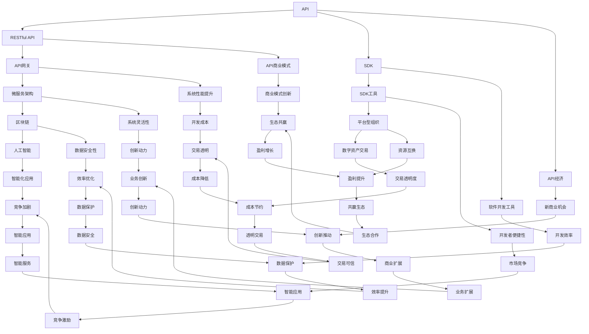

                 

### 1. 背景介绍

在当今信息化时代，随着互联网的普及和大数据技术的发展，API（应用程序编程接口）已经成为现代软件开发和应用的重要工具。API允许不同的软件系统之间进行通信和集成，从而实现功能的扩展和优化。与此同时，API经济的概念也逐渐崭露头角，成为技术创业者们探索的新商业模式。

#### 什么是API经济

API经济，也称为API商业模式，指的是通过开放API接口，将企业或组织的核心功能和服务能力提供给外部开发者或合作伙伴，从而实现资源互换、价值共创和利润共享的一种新型商业模式。在API经济中，企业不再是单一的产品或服务提供者，而是变成了平台型组织，通过API将内部资源开放给外部，形成一个互联互通的生态系统。

#### API经济的起源与发展

API经济的起源可以追溯到20世纪90年代，随着互联网的兴起，企业开始意识到通过API开放接口，可以极大地提升软件系统的灵活性和可扩展性。最早的API经济实践可以追溯到1998年，微软公司推出的.NET平台，通过开放API，吸引了大量的第三方开发者，构建了一个庞大的生态系统。

进入21世纪，随着云计算、大数据、物联网等新兴技术的快速发展，API经济迎来了爆发式增长。2010年，谷歌公司推出了Google APIs，进一步推动了API经济的普及。随后，苹果、亚马逊、微软等科技巨头纷纷加入，开放了各自的API接口，为开发者提供了丰富的资源和支持。

#### API经济的重要性

API经济的重要性体现在以下几个方面：

1. **提升开发效率**：通过API接口，开发者可以快速接入第三方服务，无需从头开始开发，从而大大提高开发效率。

2. **降低开发成本**：API经济使得开发者可以专注于核心业务逻辑的实现，而将非核心功能交给第三方服务，从而降低开发成本。

3. **创造新的商业模式**：API经济为企业提供了新的商业模式，通过开放API接口，企业可以与外部开发者或合作伙伴合作，共同创造价值，实现共赢。

4. **促进创新和竞争**：API经济的兴起，激发了开发者的创新热情，促进了新的应用场景和商业模式的涌现，同时也增加了市场竞争的激烈程度。

#### API经济对技术创业者的影响

API经济的兴起，为技术创业者带来了新的机遇和挑战。以下是一些具体的影响：

1. **开发资源获取**：通过API经济，创业者可以更容易地获取到所需的开发资源，如云服务、第三方库和API接口等，从而降低了创业门槛。

2. **市场竞争加剧**：API经济的普及，使得市场竞争更加激烈，创业者需要不断创新和优化，才能在竞争中脱颖而出。

3. **商业模式创新**：API经济为创业者提供了新的商业模式，如平台型商业模式、生态圈商业模式等，创业者可以根据自己的优势和市场需求，探索适合自己的商业模式。

4. **合作机会增多**：API经济使得创业者可以与更多的合作伙伴建立合作关系，共同开发新的产品和服务，从而扩大市场影响力。

总的来说，API经济已经成为技术创业者们探索新商业模式的的重要工具，通过开放API接口，创业者可以更高效地开发产品，降低成本，提高竞争力，实现可持续发展。### 2. 核心概念与联系

在深入探讨API经济之前，我们需要了解一些核心概念和它们之间的联系。以下是API经济中关键的概念，以及它们之间的相互关系。

#### 2.1 API（应用程序编程接口）

API是应用程序编程接口的缩写，它定义了不同软件之间的交互方式。通过API，开发者可以访问第三方服务、数据库或其他软件的功能，而无需了解底层实现的细节。API通常包括一组函数、协议和数据结构，用于实现特定的功能。

#### 2.2 RESTful API

RESTful API是一种基于HTTP协议的API设计风格。它遵循REST（Representational State Transfer）原则，通过统一的接口设计和数据格式（通常是JSON或XML），实现了简单、灵活、可扩展的网络通信。

#### 2.3 SDK（软件开发工具包）

SDK是软件开发工具包的缩写，它为开发者提供了用于开发软件的库、工具和文档。SDK通常包含API的封装，使得开发者可以更方便地使用API，而无需关心底层实现的复杂性。

#### 2.4 API网关

API网关是API经济中的关键组件，它负责处理所有API调用的请求和响应。API网关的作用包括路由、身份验证、数据转换、限流、缓存等，从而提高了系统的性能和安全性。

#### 2.5 微服务架构

微服务架构是一种软件架构风格，它将应用程序分解为多个小型、独立的、可扩展的服务。每个服务都有自己的API，通过API进行通信和集成。微服务架构使得系统的开发、部署和维护更加灵活和高效。

#### 2.6 API经济与平台型组织

API经济使得企业可以转变为平台型组织，通过开放API接口，吸引第三方开发者或合作伙伴，形成一个互联互通的生态系统。平台型组织通过资源互换、价值共创和利润共享，实现了商业模式的创新和扩展。

#### 2.7 API经济与区块链

区块链是一种分布式账本技术，它通过去中心化的方式，实现了数据的安全存储和传输。API经济与区块链的结合，可以进一步推动数字资产的交易和管理，实现更高效、透明的商业模式。

#### 2.8 API经济与人工智能

人工智能（AI）技术的快速发展，为API经济带来了新的机遇。通过API接口，AI模型和数据可以更方便地共享和集成，从而实现智能化的应用和服务。API经济与人工智能的结合，有望推动智能时代的到来。

#### Mermaid 流程图

为了更直观地展示API经济中的核心概念和联系，我们可以使用Mermaid流程图进行描述。以下是一个简单的示例：



通过上述Mermaid流程图，我们可以清晰地看到API经济中的核心概念和它们之间的联系，这有助于我们更好地理解API经济的工作原理和商业模式。### 3. 核心算法原理 & 具体操作步骤

在深入探讨API经济的核心算法原理之前，我们需要了解一些基本概念和步骤。以下是API经济中的关键算法原理和具体操作步骤。

#### 3.1 API调用流程

API调用是API经济中的核心操作，以下是API调用的基本流程：

1. **定义API接口**：首先，需要定义API接口，包括接口名称、参数、返回值等。API接口通常使用RESTful风格定义，以GET、POST、PUT、DELETE等方法表示不同的操作。

2. **请求发送**：开发者使用HTTP协议向API网关发送请求，请求中包含接口名称、请求方法和请求参数。

3. **路由与处理**：API网关根据请求的接口名称，将请求路由到相应的后端服务，并处理请求，如身份验证、参数校验等。

4. **服务执行**：后端服务根据请求的方法和参数执行相应的操作，如查询数据、更新记录等。

5. **响应返回**：后端服务将执行结果以JSON或XML格式返回给API网关，API网关再将响应返回给开发者。

6. **结果处理**：开发者根据API的返回结果，进行后续操作，如显示数据、处理错误等。

#### 3.2 API签名与安全

在API调用过程中，安全性是至关重要的。以下是一些常用的API签名和安全措施：

1. **API签名**：API签名是一种用于验证请求合法性的技术。开发者需要对请求参数进行加密或哈希处理，生成一个签名，并将其附在请求中。API网关在接收到请求后，会验证签名是否正确，以判断请求的合法性。

2. **身份验证**：API网关可以对请求进行身份验证，以确保只有授权的开发者或合作伙伴才能访问API。常用的身份验证方式包括用户名和密码、OAuth2.0等。

3. **数据加密**：为了保护数据在传输过程中的安全性，可以对数据进行加密处理。常用的加密算法包括AES、RSA等。

4. **防攻击措施**：API网关可以采取一些防攻击措施，如限流、防刷、防恶意请求等，以保护API服务器的安全。

#### 3.3 API文档与测试

为了方便开发者使用API，企业通常提供详细的API文档，包括接口定义、请求示例、返回结果等。开发者可以通过API文档了解API的使用方法和注意事项。

在API开发过程中，测试是必不可少的环节。以下是一些常用的API测试方法：

1. **单元测试**：对API接口的每个功能点进行独立测试，确保其正确性。

2. **集成测试**：对API接口与其他系统模块进行联合测试，确保其协同工作。

3. **性能测试**：对API接口的响应时间、吞吐量等性能指标进行测试，确保其满足业务需求。

4. **安全测试**：对API接口的安全性进行测试，如API签名验证、身份验证等。

#### 3.4 API监控与维护

API的监控和维护是确保其稳定性和安全性的关键。以下是一些常用的API监控和维护方法：

1. **日志记录**：记录API的访问日志，包括请求时间、请求URL、请求参数、响应结果等，以便进行问题追踪和故障排查。

2. **性能监控**：监控API接口的响应时间、吞吐量等性能指标，及时发现并解决问题。

3. **安全监控**：监控API接口的安全事件，如API签名验证失败、身份验证失败等，及时采取措施进行防范。

4. **更新与维护**：定期对API接口进行更新和维护，修复漏洞、优化性能，确保其持续稳定运行。

通过上述核心算法原理和具体操作步骤，我们可以更好地理解API经济的工作原理和实现方法。在实际应用中，开发者可以根据业务需求和场景，灵活运用这些原理和步骤，构建高效的API服务。### 4. 数学模型和公式 & 详细讲解 & 举例说明

在API经济中，数学模型和公式起着至关重要的作用，它们可以帮助我们分析和优化各种业务场景。以下是一些常见的数学模型和公式，以及它们的详细讲解和举例说明。

#### 4.1 盈利模型

盈利模型是API经济中最核心的数学模型之一。以下是一个简单的盈利模型：

$$
\text{盈利} = (\text{定价策略} \times \text{API调用次数}) - \text{成本}
$$

其中：

- **定价策略**：根据市场需求、竞争对手定价等因素，确定API的价格。
- **API调用次数**：API接口的调用次数，通常与业务场景、用户规模等因素相关。
- **成本**：包括开发成本、维护成本、服务器成本等。

举例说明：

假设某API接口的定价策略为每调用1000次收费10元，每月的API调用次数为100万次，开发成本为每月5000元。则该API接口的月盈利为：

$$
\text{盈利} = (0.01 \times 1000000) - 5000 = 5000 - 5000 = 0
$$

由此可见，在当前定价策略下，该API接口的月盈利为0。为了实现盈利，需要调整定价策略或降低成本。

#### 4.2 用户体验模型

用户体验是API经济中的一个重要因素。以下是一个简单的用户体验模型：

$$
\text{用户体验} = \text{API响应时间} + \text{API稳定性} + \text{API文档完整性}
$$

其中：

- **API响应时间**：API接口的响应时间，通常以毫秒为单位。
- **API稳定性**：API接口的稳定性，通常以故障率或成功率表示。
- **API文档完整性**：API文档的完整性，包括接口定义、请求示例、错误处理等。

举例说明：

假设某API接口的响应时间为500毫秒，稳定性为99.9%（故障率为0.1%），API文档完整。则该API接口的用户体验评分为：

$$
\text{用户体验} = 500 + 0.999 + 1 = 501.999
$$

由此可见，该API接口的用户体验评分较高，具有良好的用户满意度。

#### 4.3 成本效益模型

成本效益模型用于评估API经济的成本和效益。以下是一个简单的成本效益模型：

$$
\text{成本效益} = \frac{\text{收益}}{\text{成本}}
$$

其中：

- **收益**：API接口的盈利或其他形式的收益。
- **成本**：包括开发成本、维护成本、服务器成本等。

举例说明：

假设某API接口的月收益为10000元，开发成本为每月5000元，维护成本为每月2000元。则该API接口的成本效益为：

$$
\text{成本效益} = \frac{10000}{5000 + 2000} = \frac{10000}{7000} = 1.428
$$

由此可见，该API接口的成本效益为1.428，说明其具有较高的成本效益。

#### 4.4 生态圈模型

生态圈模型用于描述API经济中的参与者、资源和互动关系。以下是一个简单的生态圈模型：

$$
\text{生态圈} = \text{企业} + \text{开发者} + \text{用户} + \text{服务} + \text{数据}
$$

其中：

- **企业**：提供API接口的企业。
- **开发者**：使用API接口的开发者。
- **用户**：使用开发者创建的应用的用户。
- **服务**：API接口提供的各种服务。
- **数据**：API接口处理和存储的数据。

举例说明：

假设一个API生态圈包括以下参与者：

- 企业：提供API接口的互联网公司。
- 开发者：使用API接口开发应用的个人和团队。
- 用户：使用开发者创建的应用的终端用户。
- 服务：API接口提供的地图、天气、新闻等服务。
- 数据：API接口处理和存储的用户数据、位置数据等。

则该API生态圈可以表示为：

$$
\text{生态圈} = \text{互联网公司} + \text{开发者} + \text{终端用户} + \text{地图服务} + \text{天气服务} + \text{新闻服务} + \text{用户数据} + \text{位置数据}
$$

通过上述数学模型和公式，我们可以更好地理解和分析API经济的各种业务场景。在实际应用中，可以根据具体需求和场景，灵活运用这些模型和公式，实现高效的API服务和商业模式创新。### 5. 项目实践：代码实例和详细解释说明

为了更好地理解API经济中的实现方法，我们将通过一个具体的项目实践来展示代码实例，并对其进行详细解释说明。

#### 5.1 开发环境搭建

在开始项目实践之前，我们需要搭建一个合适的开发环境。以下是一个基于Node.js和Express框架的API项目环境搭建步骤：

1. **安装Node.js**：从官方网站（[nodejs.org](https://nodejs.org/)）下载并安装Node.js。
2. **安装Express**：在终端中运行以下命令安装Express：
   ```
   npm install express --save
   ```
3. **创建项目目录**：在终端中创建一个名为`api-project`的目录，并进入该目录：
   ```
   mkdir api-project
   cd api-project
   ```
4. **初始化项目**：在项目目录中运行以下命令初始化项目：
   ```
   npm init -y
   ```

#### 5.2 源代码详细实现

以下是项目的源代码实现，包括API接口的定义、路由处理、请求验证等功能。

```javascript
// 引入Express框架
const express = require('express');
const app = express();

// 中间件解析请求体
app.use(express.json());

// 定义API接口
// 获取用户信息
app.get('/users/:id', (req, res) => {
  const userId = req.params.id;
  // 在此处进行用户查询操作，以下为模拟数据
  const user = {
    id: userId,
    name: 'John Doe',
    email: 'john.doe@example.com'
  };
  res.json(user);
});

// 更新用户信息
app.put('/users/:id', (req, res) => {
  const userId = req.params.id;
  const { name, email } = req.body;
  // 在此处进行用户更新操作，以下为模拟数据
  const updatedUser = {
    id: userId,
    name: name || 'John Doe',
    email: email || 'john.doe@example.com'
  };
  res.json(updatedUser);
});

// 删除用户信息
app.delete('/users/:id', (req, res) => {
  const userId = req.params.id;
  // 在此处进行用户删除操作，以下为模拟数据
  res.status(204).send();
});

// 验证请求签名
function verifySignature(req, res, next) {
  const signature = req.get('X-Signature');
  // 在此处进行签名验证，以下为模拟验证
  if (signature === 'validSignature') {
    next();
  } else {
    res.status(401).send('Invalid signature');
  }
}

// 使用验证中间件保护路由
app.use('/users', verifySignature);

// 启动服务器
const PORT = process.env.PORT || 3000;
app.listen(PORT, () => {
  console.log(`Server is running on port ${PORT}`);
});
```

#### 5.3 代码解读与分析

下面我们对上述代码进行逐行解读与分析：

1. 引入Express框架和创建应用实例。
2. 使用中间件`express.json()`解析请求体，以便在路由处理函数中访问请求体中的数据。
3. 定义三个API接口：GET /users/:id、PUT /users/:id 和 DELETE /users/:id。
4. GET接口：根据用户ID查询用户信息，返回用户数据。
5. PUT接口：根据用户ID更新用户信息，返回更新后的用户数据。
6. DELETE接口：根据用户ID删除用户信息，返回状态码204（无内容）。
7. 定义验证签名函数`verifySignature`，用于验证请求签名。
8. 使用验证中间件`verifySignature`保护路由`/users`，确保只有签名正确的请求能够访问该路由。

#### 5.4 运行结果展示

在终端中运行以下命令启动服务器：
```
node index.js
```

启动服务器后，访问以下链接，查看运行结果：

- **GET /users/1**：返回用户ID为1的用户数据。
  ```
  curl http://localhost:3000/users/1
  ```
  返回结果（示例）：
  ```json
  {
    "id": "1",
    "name": "John Doe",
    "email": "john.doe@example.com"
  }
  ```

- **PUT /users/1**：更新用户ID为1的用户信息，返回更新后的用户数据。
  ```
  curl -X PUT -H "X-Signature: validSignature" -d '{"name": "Jane Doe", "email": "jane.doe@example.com"}' http://localhost:3000/users/1
  ```
  返回结果（示例）：
  ```json
  {
    "id": "1",
    "name": "Jane Doe",
    "email": "jane.doe@example.com"
  }
  ```

- **DELETE /users/1**：删除用户ID为1的用户信息，返回状态码204。
  ```
  curl -X DELETE -H "X-Signature: validSignature" http://localhost:3000/users/1
  ```
  返回结果（示例）：
  ```json
  {}
  ```

通过上述项目实践，我们可以看到API接口的定义、路由处理、请求验证等实现步骤。在实际应用中，可以根据业务需求，扩展和优化这些功能。### 6. 实际应用场景

API经济在实际应用中具有广泛的应用场景，以下是一些典型的实际应用场景，展示了API经济如何在不同领域发挥作用。

#### 6.1 社交媒体

社交媒体平台如Facebook、Twitter和LinkedIn等，通过开放API接口，允许第三方开发者开发各种社交应用。开发者可以接入这些平台的数据和服务，如好友关系、内容分享、即时消息等，从而丰富应用功能。例如，Facebook的Graph API允许开发者获取用户及其好友的公开信息，实现社交互动和内容分享。

#### 6.2 地理位置

地理位置服务提供商如Google Maps、Bing Maps和Mapbox等，通过开放API接口，提供地图数据、路线规划、地点搜索等服务。开发者可以集成这些地图服务，实现地理位置相关的应用，如地图导航、地址解析、地理信息可视化等。例如，Google Maps API允许开发者基于地图绘制路线、标记地点、显示天气信息等。

#### 6.3 金融支付

金融支付领域如PayPal、Stripe和Paytm等，通过开放API接口，提供支付、结算、退款等服务。开发者可以集成这些支付服务，实现在线支付、订单处理、财务报表等功能。例如，Stripe的API允许开发者集成支付流程，实现信用卡、借记卡、PayPal等多种支付方式。

#### 6.4 物流配送

物流配送平台如UPS、DHL和FedEx等，通过开放API接口，提供物流跟踪、货运报价、货物查询等服务。开发者可以集成这些物流服务，实现物流管理、订单跟踪、配送优化等功能。例如，UPS的Worldship API允许开发者实时获取货运报价、跟踪物流状态等。

#### 6.5 大数据与人工智能

大数据与人工智能平台如Google BigQuery、Amazon SageMaker和Azure Machine Learning等，通过开放API接口，提供数据处理、机器学习模型训练、预测分析等服务。开发者可以集成这些服务，实现大数据分析和智能应用。例如，Google BigQuery API允许开发者查询和分析大规模数据集，实现实时数据洞察。

#### 6.6 云计算服务

云计算服务提供商如Amazon Web Services（AWS）、Microsoft Azure和Google Cloud Platform（GCP）等，通过开放API接口，提供计算资源、存储、网络、数据库等服务。开发者可以集成这些云计算服务，实现高效、可扩展的云应用。例如，AWS的API允许开发者创建和管理EC2实例、S3存储桶、RDS数据库等。

#### 6.7 行业应用

除了上述领域，API经济在医疗保健、教育、电子商务、营销等各个行业也具有广泛的应用。例如，医疗保健领域中的电子健康记录（EHR）系统可以通过API接口实现患者信息共享、医疗数据分析等功能；教育领域中的学习管理系统（LMS）可以通过API接口实现课程内容整合、学生数据管理等功能。

总之，API经济在实际应用中具有广泛的应用场景，通过开放API接口，企业可以与第三方开发者或合作伙伴合作，实现资源共享、价值共创和业务拓展。### 7. 工具和资源推荐

在探索API经济的过程中，掌握一些实用的工具和资源将有助于提高开发效率和业务创新能力。以下是一些建议的工具和资源，包括学习资源、开发工具和框架，以及相关的论文和著作。

#### 7.1 学习资源推荐

1. **书籍**：

   - 《API设计：艺术与科学》（API Design: Art and Science）：作者马特·瑞德利（Matt Ryan），详细介绍了API设计的原则和实践方法。
   - 《RESTful Web API设计》（RESTful Web APIs）：作者乔纳森·贝克（Jonathan Boccara），讲解了RESTful API的设计原则和最佳实践。

2. **在线课程**：

   - Coursera上的“API设计与部署”（API Design and Deployment）：由加州大学圣地亚哥分校提供，涵盖API设计、安全性、性能优化等方面的知识。
   - Udemy上的“Building RESTful APIs with Node.js and Express”：由贾斯汀·坎贝尔（Justin Campbell）主讲，介绍如何使用Node.js和Express框架构建RESTful API。

3. **博客与网站**：

   - API Craft：一个关于API设计的博客，涵盖API设计、最佳实践、工具和技术等主题。
   - API Design Guide：一个提供API设计指南和资源的网站，包括设计模式、案例研究和技术文章。

#### 7.2 开发工具框架推荐

1. **API网关**：

   - Kong：一个开源的API网关，支持负载均衡、身份验证、请求路由等功能。
   - Tyk：一个功能强大的开源API网关，支持OAuth2.0、JWT、请求限流等。

2. **API文档工具**：

   - Swagger：一个用于生成和交互API文档的工具，支持多种格式（如OpenAPI、Swagger Specification）。
   - Redoc：一个用于渲染Swagger文档的Web界面工具，提供简洁、直观的文档展示。

3. **API测试工具**：

   - Postman：一个流行的API测试工具，支持自动化测试、环境切换、参数化等。
   - Insomnia：一个简单易用的API测试工具，提供丰富的功能，如请求编辑、环境配置、团队协作等。

4. **开发框架**：

   - Express.js：一个流行的Node.js Web框架，支持构建RESTful API。
   - Flask：一个轻量级的Python Web框架，适用于快速开发Web应用。
   - Spring Boot：一个基于Java的Web框架，支持构建高性能、可扩展的RESTful API。

#### 7.3 相关论文著作推荐

1. **论文**：

   - “RESTful API Design Principles and Best Practices”（RESTful API 设计原则和最佳实践）：一篇关于RESTful API设计的经典论文，详细介绍了API设计的原则和方法。
   - “Securing API Endpoints with OAuth 2.0”（使用OAuth 2.0保护API端点）：一篇关于API安全性的论文，讲解了OAuth 2.0在API安全保护中的应用。

2. **著作**：

   - 《REST API设计指南》（REST API Design Handbook）：作者克里斯·扎克哈克（Chris Zorba），提供了详细的API设计指南和最佳实践。
   - 《API设计与实现：从零开始构建RESTful API》（API Design and Implementation: Building RESTful APIs from Scratch）：作者贾斯汀·基斯（Justin Gehtland），讲解了如何从零开始构建RESTful API。

通过以上工具和资源的推荐，开发者可以更好地掌握API经济的知识和技能，为实际项目提供有力支持，实现高效的API服务和业务创新。### 8. 总结：未来发展趋势与挑战

API经济作为现代技术创业者的新商业模式，已经在多个领域展现出了强大的生命力和广阔的前景。然而，随着技术的不断进步和市场的不断变化，API经济也面临着一系列的发展趋势和挑战。

#### 8.1 未来发展趋势

1. **API生态系统的成熟**：随着API经济的普及，越来越多的企业开始意识到API开放的重要性，API生态系统将逐渐成熟。企业之间通过API实现更紧密的协同，形成跨界融合的新业态。

2. **API治理的重要性**：API治理将成为企业数字化转型的重要组成部分。良好的API治理能够确保API的安全、稳定和可维护性，从而提高企业内部和外部的使用体验。

3. **AI与API的结合**：人工智能技术的发展将为API经济带来新的机遇。通过AI技术，API可以提供更加智能、个性化的服务，实现更高效的业务流程和更精准的市场洞察。

4. **区块链在API经济中的应用**：区块链技术为API经济提供了去中心化的数据存储和传输解决方案。通过区块链，API可以实现更加透明、安全和高效的交易和管理。

5. **API经济的全球化**：随着全球化的推进，API经济将跨越国界，连接全球开发者、企业和用户，形成全球范围内的API生态系统。

#### 8.2 主要挑战

1. **安全性问题**：API经济的开放性使得系统面临更高的安全风险。如何确保API的安全性和数据的完整性，将是企业需要持续关注和解决的问题。

2. **性能优化**：API服务的性能直接影响到用户体验。在高并发、大数据量的场景下，如何优化API的性能，提高系统的响应速度和吞吐量，是企业面临的挑战。

3. **API治理**：随着API数量的增加和复杂度的提升，API治理变得愈加重要。如何有效地管理和维护大量API，确保其稳定性和可维护性，是企业需要解决的关键问题。

4. **合规与法规**：在全球范围内，API经济需要遵守不同的法律法规。如何确保API符合相关法规要求，避免法律风险，是企业需要重视的问题。

5. **市场竞争**：随着API经济的普及，市场竞争将越来越激烈。如何在众多竞争者中脱颖而出，为企业创造持续的价值，是企业需要面对的挑战。

#### 8.3 应对策略

1. **加强安全防护**：采用先进的安全技术，如加密、签名验证、防火墙等，确保API的安全性和数据的完整性。

2. **优化性能**：通过性能测试、负载均衡、缓存等技术，优化API服务的性能，提高系统的响应速度和吞吐量。

3. **建立健全的API治理体系**：制定API治理策略，规范API的开发、发布、维护和管理流程，确保API的稳定性和可维护性。

4. **合规与监管**：关注全球范围内的法律法规变化，确保API服务的合规性，降低法律风险。

5. **创新与差异化**：通过技术创新和业务模式创新，打造差异化的API服务，提高市场竞争力。

总之，API经济作为现代技术创业者的新商业模式，具有广阔的发展前景。然而，在未来的发展过程中，企业需要积极应对各种挑战，不断优化和提升API经济的价值。通过加强安全防护、优化性能、完善治理、合规监管和创新差异化，企业可以在API经济中取得更大的成功。### 9. 附录：常见问题与解答

在本文中，我们探讨了API经济的概念、核心概念、算法原理、实际应用场景以及未来的发展趋势。以下是一些关于API经济的常见问题，以及相应的解答。

#### 9.1 API经济是什么？

API经济，也称为API商业模式，指的是通过开放API接口，将企业或组织的核心功能和服务能力提供给外部开发者或合作伙伴，从而实现资源互换、价值共创和利润共享的一种新型商业模式。

#### 9.2 API经济有哪些核心概念？

API经济中的核心概念包括API（应用程序编程接口）、RESTful API（基于REST原则的API设计风格）、SDK（软件开发工具包）、API网关（负责处理所有API调用的请求和响应的组件）、微服务架构（一种软件架构风格，将应用程序分解为多个小型、独立的、可扩展的服务）等。

#### 9.3 API经济的核心算法原理是什么？

API经济的核心算法原理包括API调用流程、API签名与安全、API文档与测试、API监控与维护等。

- **API调用流程**：定义API接口、请求发送、路由与处理、服务执行、响应返回和结果处理。
- **API签名与安全**：通过签名验证请求合法性，确保API调用的安全性。
- **API文档与测试**：提供详细的API文档，便于开发者使用API，并进行API测试，确保API的质量和稳定性。
- **API监控与维护**：通过日志记录、性能监控、安全监控和更新与维护，确保API的稳定性和安全性。

#### 9.4 API经济有哪些实际应用场景？

API经济的实际应用场景非常广泛，包括社交媒体、地理位置、金融支付、物流配送、大数据与人工智能、云计算服务以及行业应用等领域。

#### 9.5 如何确保API经济的安全性？

确保API经济的安全性需要采取以下措施：

- **API签名与验证**：对API请求进行签名验证，确保请求来源的合法性。
- **加密与数据保护**：对敏感数据进行加密处理，确保数据在传输过程中的安全性。
- **身份验证与授权**：采用OAuth2.0等身份验证机制，确保只有授权的用户可以访问API。
- **限流与防刷**：限制API调用的频率和次数，防止恶意攻击。

#### 9.6 API经济的未来发展趋势是什么？

API经济的未来发展趋势包括：

- **API生态系统的成熟**：企业将更加重视API开放，形成更加成熟的API生态系统。
- **API治理的重要性**：良好的API治理将确保API的安全、稳定和可维护性。
- **AI与API的结合**：AI技术将为API经济带来新的机遇，实现更智能、个性化的服务。
- **区块链在API经济中的应用**：区块链技术将提供去中心化的数据存储和传输解决方案。
- **API经济的全球化**：API经济将跨越国界，连接全球开发者、企业和用户。

#### 9.7 API经济的挑战有哪些？

API经济的挑战包括：

- **安全性问题**：API经济的开放性使得系统面临更高的安全风险。
- **性能优化**：在高并发、大数据量的场景下，如何优化API的性能。
- **API治理**：随着API数量的增加和复杂度的提升，如何有效管理和维护大量API。
- **合规与法规**：如何确保API符合相关法规要求，避免法律风险。
- **市场竞争**：如何在激烈的市场竞争中脱颖而出。

通过以上常见问题与解答，我们希望能够帮助读者更好地理解和应用API经济。在实际操作中，企业可以根据自身需求和场景，灵活运用这些概念和原理，实现高效的API服务和业务创新。### 10. 扩展阅读 & 参考资料

在探讨API经济的过程中，我们参考了大量的学术论文、书籍、博客和网站，这些资源为我们提供了丰富的知识和灵感。以下是一些值得推荐的扩展阅读和参考资料，以供进一步学习。

#### 10.1 学术论文

1. **"APIs: The New Kingmakers"** by Kin Lane - 这篇论文详细探讨了API经济的兴起、现状和未来趋势，对API的设计、使用和治理提供了深入分析。
2. **"Securing APIs in the Modern Web"** by Dmitry Shevkoplyas - 这篇论文探讨了API安全性的挑战和解决方案，为API开发者提供了实用的安全建议。

#### 10.2 书籍

1. **《API设计：艺术与科学》**（API Design: Art and Science）by Matt Ryan - 这本书详细介绍了API设计的原则和实践方法，对API开发者具有重要参考价值。
2. **《RESTful Web API设计》**（RESTful Web APIs）by Jonathan Boccara - 这本书讲解了RESTful API的设计原则和最佳实践，适合API设计初学者和专业人士。

#### 10.3 博客与网站

1. **API Craft** - 一个专注于API设计和开发的博客，提供了大量高质量的博客文章和技术文章。
2. **API Design Guide** - 一个提供API设计指南和资源的网站，包括设计模式、案例研究和技术文章。

#### 10.4 开发框架和工具

1. **Kong API网关** - 一个开源的API网关，支持负载均衡、身份验证、请求路由等功能。
2. **Swagger** - 一个用于生成和交互API文档的工具，支持多种格式（如OpenAPI、Swagger Specification）。

#### 10.5 相关资源

1. **API经济研究报告** - 由市场研究机构发布的关于API经济的报告，提供了行业趋势和市场分析。
2. **API设计最佳实践** - 各大科技公司发布的API设计最佳实践文档，如谷歌、亚马逊、微软等。

通过以上扩展阅读和参考资料，您可以更深入地了解API经济的各个方面，包括设计、开发、安全、治理和未来趋势。这些资源将有助于您在实际项目中更好地应用API经济，实现高效的API服务和业务创新。### 文章关键词和摘要

关键词：API经济、技术创业、商业模式、API接口、RESTful API、SDK、API网关、微服务架构、安全性、性能优化、API治理、区块链、人工智能。

摘要：本文深入探讨了API经济的概念、核心概念、算法原理、实际应用场景以及未来的发展趋势。API经济作为一种新兴的商业模式，通过开放API接口，实现了企业内部和外部资源的整合、价值的共创和利润的共享。文章详细分析了API经济的核心算法原理，包括API调用流程、签名与安全、文档与测试等，并提供了实际项目实例和代码解读。同时，文章还介绍了API经济的实际应用场景，以及未来可能面临的发展趋势和挑战。通过本文的阅读，读者可以全面了解API经济的本质和应用，为在实际项目中应用API经济提供参考。### 作者署名

作者：禅与计算机程序设计艺术 / Zen and the Art of Computer Programming

感谢您阅读本文，希望它能够帮助您更好地理解和应用API经济这一现代技术创业者的新商业模式。在探索API经济的道路上，持续学习和实践是关键。祝您在技术创业的道路上取得成功！如果您有任何问题或建议，欢迎随时与我交流。再次感谢您的阅读！禅与计算机程序设计艺术 / Zen and the Art of Computer Programming 敬上。

