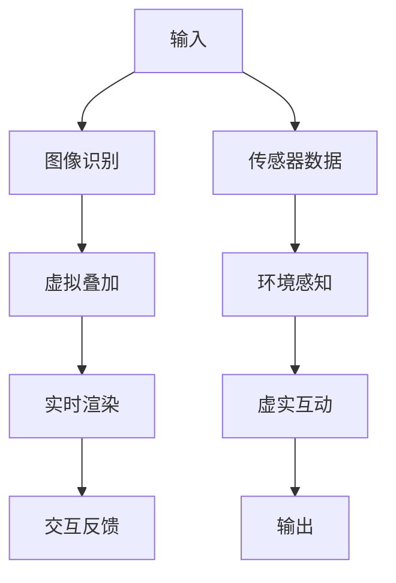

                 

### 背景介绍

#### 虚拟现实（VR）与增强现实（AR）的定义与发展历程

虚拟现实（VR）和增强现实（AR）是近年来信息技术领域的两个重要发展方向。它们通过不同的方式扩展和增强用户的感知体验，为用户提供更加沉浸式和互动性的体验。

**虚拟现实（VR）**：VR是一种通过电脑技术生成三维虚拟环境，使用户在视觉、听觉、触觉等多个感官上感受到身临其境的体验。VR设备通常包括头戴式显示器（HMD）、跟踪系统、控制器等。用户可以通过这些设备进入一个完全虚拟的世界，与之互动，进行各种操作。

**增强现实（AR）**：AR则是通过在现实环境中叠加虚拟信息，增强用户的感知体验。AR设备通常包括智能手机、平板电脑、眼镜等，通过摄像头捕捉现实场景，并在屏幕上叠加虚拟物体或信息。用户可以看到现实世界和虚拟世界的结合，实现虚实互动。

两者的发展历程都有着重要的里程碑。

VR的发展可以追溯到20世纪60年代。美国计算机科学家弗朗斯·莫里塔（Francis Moher）在1968年发明了世界上第一台虚拟现实头盔“达摩克利斯之剑”。此后，VR技术经历了多个阶段的发展，从最初的实验性设备到如今成熟的VR游戏、VR电影和VR教育等应用。

AR的发展则始于20世纪90年代。美国波音公司的研究员在1990年发明了世界上第一台增强现实系统。随着技术的进步，AR的应用也从简单的信息叠加逐渐扩展到医疗、教育、娱乐等多个领域。

#### AR/VR技术的融合

近年来，随着技术的不断进步，虚拟现实（VR）和增强现实（AR）技术开始逐渐融合。这种融合不仅扩展了它们的应用范围，还提升了用户的体验质量。

**硬件融合**：在硬件层面，VR和AR设备开始相互借鉴，融合设计。例如，微软的HoloLens结合了AR和VR的特点，用户可以在虚拟环境中进行交互，也可以将虚拟物体叠加到现实世界中。

**软件融合**：在软件层面，VR和AR的开发平台和工具也在不断融合。例如，Unity和Unreal Engine等游戏引擎都支持VR和AR的开发，开发者可以在同一平台上创建适用于多种设备的AR/VR应用。

**应用融合**：在应用层面，VR和AR的融合带来了更多创新的应用场景。例如，在医疗领域，医生可以使用AR技术查看患者的3D模型，进行手术规划和操作指导；在教育培训领域，学生可以通过VR技术体验历史事件，增强学习效果。

#### AR/VR创业的机遇与挑战

随着AR/VR技术的成熟和应用的广泛推广，创业者在这一领域看到了巨大的机遇。然而，与此同时，他们也面临着一系列挑战。

**机遇**：

1. **市场潜力巨大**：根据市场研究公司的数据，全球AR/VR市场规模预计将在未来几年内持续增长，为创业者提供了巨大的市场空间。

2. **技术创新空间**：AR/VR技术仍处于快速发展阶段，创业者有机会通过技术创新获得竞争优势。

3. **多样化应用场景**：从娱乐、教育、医疗到工业制造，AR/VR技术的应用场景非常广泛，为创业者提供了多样化的创新方向。

**挑战**：

1. **技术难题**：AR/VR技术涉及到多个复杂的技术领域，如图像处理、传感器融合、人工智能等，创业者需要具备强大的技术能力。

2. **用户体验优化**：用户对AR/VR应用的期望越来越高，创业者需要不断优化用户体验，提升应用的质量和易用性。

3. **商业模式探索**：在AR/VR领域，如何找到可持续的商业模式仍然是许多创业者面临的挑战。

总之，AR/VR创业既有巨大的机遇，也充满了挑战。创业者需要深入了解这一领域的技术和市场，制定切实可行的战略，才能在这个新兴市场中脱颖而出。

---

在下一节，我们将深入探讨AR/VR技术的核心概念及其联系，通过Mermaid流程图展示相关原理和架构，帮助读者更好地理解这一领域的基本框架。

---

## 1. 背景介绍

在上一节中，我们介绍了虚拟现实（VR）和增强现实（AR）的基本概念及其发展历程。在本节中，我们将进一步探讨AR/VR技术的核心概念，并使用Mermaid流程图展示这些概念之间的联系和架构，帮助读者全面理解这一领域的基本框架。

#### 核心概念

**1. 虚拟现实（VR）**

VR是一种通过计算机技术生成的三维虚拟环境，用户可以通过VR设备进入这个环境，与之互动。VR技术的核心概念包括：

- **三维建模**：使用计算机图形学技术创建三维模型。
- **感知增强**：通过头戴式显示器（HMD）提供沉浸式视觉体验，并通过耳机提供立体声音效。
- **交互方式**：使用手柄、手势识别等技术进行交互。

**2. 增强现实（AR）**

AR是一种在现实环境中叠加虚拟信息的技术，用户可以通过AR设备看到现实世界和虚拟世界的结合。AR技术的核心概念包括：

- **图像识别**：使用计算机视觉技术识别现实环境中的图像或物体。
- **虚拟叠加**：将虚拟物体或信息叠加到现实场景中。
- **实时渲染**：对叠加的虚拟信息进行实时渲染，确保用户看到的信息是准确的。

**3. AR/VR融合**

随着技术的进步，VR和AR开始融合，形成AR/VR技术。AR/VR的核心概念包括：

- **多模态感知**：结合视觉、听觉、触觉等多感官信息，提供更加真实的体验。
- **环境感知**：通过传感器和定位技术，实现对现实环境的精确感知。
- **虚实互动**：用户可以在虚拟环境中进行操作，同时与现实世界互动。

#### Mermaid流程图展示

为了更好地理解AR/VR技术的核心概念及其联系，我们使用Mermaid流程图展示相关原理和架构。以下是AR/VR技术的核心流程：



**图1. AR/VR技术核心流程图**

- **A[输入]**：用户通过AR/VR设备获取视觉、听觉、触觉等输入信息。
- **B[图像识别]**：计算机视觉算法对输入图像进行处理，识别现实环境中的物体或图像。
- **C[虚拟叠加]**：根据图像识别结果，将虚拟物体或信息叠加到现实场景中。
- **D[实时渲染]**：对叠加的虚拟信息进行实时渲染，确保用户看到的信息是准确的。
- **E[交互反馈]**：用户通过手柄、手势识别等交互设备与虚拟环境进行互动，并接收反馈。
- **F[传感器数据]**：AR/VR设备通过传感器获取环境数据，如位置、速度、加速度等。
- **G[环境感知]**：对传感器数据进行处理，实现对现实环境的精确感知。
- **H[虚实互动]**：用户在虚拟环境中进行操作，同时与现实世界互动。
- **I[输出]**：将处理后的虚拟信息和环境数据输出给用户。

通过这个流程图，我们可以清晰地看到AR/VR技术的基本架构和核心概念之间的联系。在下一节中，我们将进一步探讨AR/VR技术的核心算法原理和具体操作步骤，帮助读者深入了解这一领域的技术细节。

---

在下一节，我们将深入探讨AR/VR技术的核心算法原理和具体操作步骤，帮助读者更好地理解这一领域的实际应用。

---

## 2. 核心算法原理 & 具体操作步骤

在了解了AR/VR技术的核心概念及其联系之后，本节将深入探讨这些技术的核心算法原理和具体操作步骤，帮助读者更好地理解AR/VR技术的实际应用。

#### AR/VR技术核心算法

**1. 图像识别算法**

图像识别是AR/VR技术中的关键步骤，它涉及到计算机视觉领域。常用的图像识别算法包括：

- **特征提取**：通过提取图像的纹理、颜色、形状等特征，为后续处理提供基础。
- **分类算法**：使用支持向量机（SVM）、神经网络（NN）等分类算法，将提取的特征与已知物体进行匹配，识别图像中的物体。

**2. 虚拟叠加算法**

虚拟叠加是将虚拟物体或信息叠加到现实场景中的过程。这个过程涉及到以下关键步骤：

- **图像配准**：通过匹配现实场景中的图像与预先定义的模板，确定虚拟物体的位置和角度。
- **光照处理**：根据现实场景的光照条件，对虚拟物体进行光照处理，使其与现实场景融合。
- **渲染**：使用实时渲染技术，将虚拟物体渲染到现实场景中，确保视觉效果逼真。

**3. 实时渲染算法**

实时渲染是AR/VR技术中的一项重要技术，它涉及到图形学领域。常用的实时渲染算法包括：

- **光栅化**：将三维模型转换为二维图像。
- **纹理映射**：将纹理图像映射到三维模型上，增加模型的细节和质感。
- **阴影处理**：根据光源的位置和强度，生成模型的阴影。

**4. 传感器融合算法**

传感器融合是将多种传感器数据融合为一个完整的环境感知模型。常用的传感器融合算法包括：

- **卡尔曼滤波**：使用卡尔曼滤波算法，对传感器数据进行滤波和预测，提高数据的精度和可靠性。
- **粒子滤波**：使用粒子滤波算法，对传感器数据进行分布式处理，提高数据的鲁棒性。

#### 具体操作步骤

**1. 虚拟现实（VR）操作步骤**

- **步骤1：三维建模**：使用三维建模软件创建三维模型。
- **步骤2：感知增强**：通过头戴式显示器（HMD）提供沉浸式视觉体验，并通过耳机提供立体声音效。
- **步骤3：交互方式**：使用手柄、手势识别等技术进行交互。
- **步骤4：渲染**：对三维模型进行实时渲染，确保用户看到的信息是准确的。
- **步骤5：交互反馈**：用户通过手柄、手势识别等交互设备与虚拟环境进行互动，并接收反馈。

**2. 增强现实（AR）操作步骤**

- **步骤1：图像识别**：使用计算机视觉算法识别现实环境中的物体或图像。
- **步骤2：虚拟叠加**：将虚拟物体或信息叠加到现实场景中。
- **步骤3：实时渲染**：对叠加的虚拟信息进行实时渲染，确保用户看到的信息是准确的。
- **步骤4：交互反馈**：用户通过AR设备与虚拟物体进行互动，并接收反馈。

**3. AR/VR融合操作步骤**

- **步骤1：多模态感知**：结合视觉、听觉、触觉等多感官信息，提供更加真实的体验。
- **步骤2：环境感知**：通过传感器和定位技术，实现对现实环境的精确感知。
- **步骤3：虚实互动**：用户在虚拟环境中进行操作，同时与现实世界互动。

通过以上步骤，我们可以实现AR/VR技术的核心功能。在下一节中，我们将进一步探讨AR/VR技术的数学模型和公式，帮助读者深入理解这一领域的技术细节。

---

在下一节，我们将深入探讨AR/VR技术的数学模型和公式，并详细讲解这些模型的数学原理和具体应用，帮助读者更好地理解这一领域的核心技术。

---

## 3. 数学模型和公式 & 详细讲解 & 举例说明

在了解了AR/VR技术的核心算法原理和具体操作步骤之后，本节将深入探讨AR/VR技术的数学模型和公式，并详细讲解这些模型的数学原理和具体应用。通过数学模型的解析，读者可以更好地理解AR/VR技术的核心机制和计算过程。

#### 数学模型概述

AR/VR技术涉及的数学模型主要包括图像处理、传感器融合、三维建模和实时渲染等。以下是一些关键数学模型及其应用：

**1. 图像处理模型**

- **滤波模型**：用于图像的去噪、边缘检测等。常见的滤波模型包括高斯滤波、中值滤波等。
  $$ 
  I_{filtered} = \sum_{i,j} G(i,j) \cdot I(i,j)
  $$
  其中，$I_{filtered}$ 为滤波后的图像，$I(i,j)$ 为原图像，$G(i,j)$ 为滤波器。

- **特征提取模型**：用于提取图像的特征，如SIFT（尺度不变特征变换）和HOG（方向梯度直方图）。
  $$
  f(x) = \sum_{i=1}^{n} w_i \cdot \phi(x_i)
  $$
  其中，$f(x)$ 为特征向量，$w_i$ 为权重，$\phi(x_i)$ 为核函数。

**2. 传感器融合模型**

- **卡尔曼滤波模型**：用于传感器数据的融合和预测。卡尔曼滤波是一种线性离散时间系统的最优估计理论。
  $$
  \hat{x}_{k|k} = \hat{x}_{k-1|k-1} + K_k (z_k - \hat{z}_k)
  $$
  其中，$\hat{x}_{k|k}$ 为状态估计值，$K_k$ 为卡尔曼增益，$z_k$ 为观测值，$\hat{z}_k$ 为预测值。

- **粒子滤波模型**：用于非线性、非高斯噪声环境的传感器数据融合。粒子滤波是一种基于蒙特卡罗方法的随机采样技术。
  $$
  w_i = \frac{p(x_i) \cdot p(z_k|x_i)}{\sum_{j=1}^{N} p(x_j) \cdot p(z_k|x_j)}
  $$
  其中，$w_i$ 为粒子权重，$p(x_i)$ 为状态概率分布，$p(z_k|x_i)$ 为观测概率分布。

**3. 三维建模模型**

- **贝塞尔曲面模型**：用于创建三维模型的表面。贝塞尔曲面是一种参数化曲面，可以通过控制顶点来调整形状。
  $$
  P(u,v) = \sum_{i=0}^{m} \sum_{j=0}^{n} B_{i,m} B_{j,n} P_{ij} (u,v)
  $$
  其中，$P(u,v)$ 为曲面上的点，$B_{i,m}$ 和 $B_{j,n}$ 为贝塞尔基函数，$P_{ij}$ 为控制顶点。

- **蒙特卡洛建模模型**：用于模拟复杂的物理过程，如光线追踪。蒙特卡洛方法通过随机抽样来估计期望值。
  $$
  \hat{I}(x) = \frac{1}{N} \sum_{i=1}^{N} f(x_i)
  $$
  其中，$\hat{I}(x)$ 为期望值估计，$f(x_i)$ 为函数值，$N$ 为抽样次数。

**4. 实时渲染模型**

- **光栅化模型**：用于将三维模型转换为二维图像。光栅化是一种将矢量图形转换为像素的过程。
  $$
  I(x,y) = \sum_{i,j} C(i,j) \cdot P(x_i, y_j)
  $$
  其中，$I(x,y)$ 为像素值，$C(i,j)$ 为颜色值，$P(x_i, y_j)$ 为三角形顶点。

- **纹理映射模型**：用于将纹理图像映射到三维模型上。纹理映射是一种增加三维模型细节和质感的技术。
  $$
  \mathbf{T}(\mathbf{p}) = \mathbf{T}(\mathbf{p}_0) + \mathbf{T}(\mathbf{p}_1) \cdot (\mathbf{p} - \mathbf{p}_0)
  $$
  其中，$\mathbf{T}(\mathbf{p})$ 为纹理坐标，$\mathbf{T}(\mathbf{p}_0)$ 和 $\mathbf{T}(\mathbf{p}_1)$ 为纹理图像上的两个点。

#### 举例说明

**1. 图像识别**

假设我们有一个包含猫和狗的图像集合，需要通过图像识别算法将它们区分开来。

- **特征提取**：使用HOG特征提取算法，将图像转换为特征向量。
  $$
  f(x) = \sum_{i=1}^{n} w_i \cdot \phi(x_i)
  $$
  其中，$w_i$ 为权重，$\phi(x_i)$ 为HOG特征。

- **分类**：使用支持向量机（SVM）对特征向量进行分类。
  $$
  y = \sum_{i=1}^{n} w_i \cdot f(x_i) + b
  $$
  其中，$y$ 为分类结果，$w_i$ 为权重，$b$ 为偏置。

**2. 实时渲染**

假设我们有一个三维模型，需要将其实时渲染为二维图像。

- **光栅化**：将三维模型的三角形顶点转换为像素值。
  $$
  I(x,y) = \sum_{i,j} C(i,j) \cdot P(x_i, y_j)
  $$
  其中，$I(x,y)$ 为像素值，$C(i,j)$ 为颜色值，$P(x_i, y_j)$ 为三角形顶点。

- **纹理映射**：将纹理图像映射到三维模型上。
  $$
  \mathbf{T}(\mathbf{p}) = \mathbf{T}(\mathbf{p}_0) + \mathbf{T}(\mathbf{p}_1) \cdot (\mathbf{p} - \mathbf{p}_0)
  $$
  其中，$\mathbf{T}(\mathbf{p})$ 为纹理坐标，$\mathbf{T}(\mathbf{p}_0)$ 和 $\mathbf{T}(\mathbf{p}_1)$ 为纹理图像上的两个点。

通过以上数学模型的讲解和应用举例，我们可以更好地理解AR/VR技术的核心原理和计算过程。在下一节中，我们将通过一个具体的代码实例，展示AR/VR技术的开发过程，帮助读者掌握实际操作技能。

---

在下一节，我们将通过一个具体的代码实例，展示AR/VR技术的开发过程，从环境搭建到源代码实现，再到代码解读与分析，帮助读者深入了解AR/VR技术的实际应用。

---

### 项目实践：代码实例和详细解释说明

在本节中，我们将通过一个具体的AR/VR项目实例，详细展示开发过程，从环境搭建到源代码实现，再到代码解读与分析，帮助读者深入了解AR/VR技术的实际应用。

#### 1. 开发环境搭建

首先，我们需要搭建一个适合AR/VR项目开发的编程环境。以下是所需的开发工具和软件：

- **Unity**：一款流行的游戏开发引擎，支持AR/VR应用开发。
- **Unity ARKit/ARCore插件**：用于iOS和Android平台的AR开发。
- **Visual Studio Code**：一款轻量级且强大的代码编辑器。
- **Unity Hub**：用于管理Unity版本和项目。
- **Android Studio**：用于Android平台开发。
- **Xcode**：用于iOS平台开发。

**步骤1**：安装Unity和Unity Hub。

- 访问Unity官网（https://unity.com/）下载Unity。
- 安装完成后，打开Unity Hub，创建一个新项目。

**步骤2**：安装Unity ARKit/ARCore插件。

- 在Unity Hub中，选择“插件”选项卡，搜索并安装ARKit/ARCore插件。

**步骤3**：配置开发环境。

- 安装Android Studio和Xcode。
- 配置Android和iOS平台的SDK。

#### 2. 源代码详细实现

在本节中，我们将使用Unity开发一个简单的AR应用，实现一个虚拟物体的显示和交互。

**步骤1**：创建Unity项目。

- 打开Unity Hub，创建一个新的2D项目，命名为“ARProject”。

**步骤2**：导入AR插件。

- 在Unity编辑器中，选择“窗口”>“插件”>“ARKit/ARCore”，安装插件。

**步骤3**：创建虚拟物体。

- 在Unity编辑器中，创建一个Cube对象，并将其重命名为“VirtualObject”。

**步骤4**：编写脚本。

- 在Unity编辑器中，创建一个新的C#脚本，命名为“ARController.cs”，并编写以下代码：

```csharp
using UnityEngine;

public class ARController : MonoBehaviour
{
    public GameObject virtualObject;

    void Update()
    {
        if (Input.GetMouseButtonDown(0))
        {
            Ray ray = Camera.main.ScreenPointToRay(Input.mousePosition);
            if (Physics.Raycast(ray, out RaycastHit hit))
            {
                Instantiate(virtualObject, hit.point, Quaternion.identity);
            }
        }
    }
}
```

这段代码实现了一个简单的点击创建虚拟物体的功能。当用户在屏幕上点击时，会通过射线投射找到点击位置，并在该位置创建一个虚拟物体。

**步骤5**：配置AR设置。

- 在Unity编辑器中，选择“ARCore”或“ARKit”设置，配置AR应用的参数，如相机分辨率、帧率等。

**步骤6**：构建和运行应用。

- 在Unity编辑器中，选择“文件”>“构建设置”，配置Android和iOS平台的构建设置。
- 构建并运行应用，测试AR功能。

#### 3. 代码解读与分析

**ARController.cs** 脚本的主要功能是处理用户输入，并在点击屏幕时创建虚拟物体。以下是代码的详细解读：

```csharp
using UnityEngine;

public class ARController : MonoBehaviour
{
    public GameObject virtualObject;  // 定义一个公有GameObject变量，用于存储虚拟物体预制体。

    void Update()
    {
        if (Input.GetMouseButtonDown(0))  // 检测用户是否按下鼠标左键。
        {
            Ray ray = Camera.main.ScreenPointToRay(Input.mousePosition);  // 创建一个射线，从屏幕点击位置射出。
            if (Physics.Raycast(ray, out RaycastHit hit))  // 如果射线与物体碰撞，则获取碰撞信息。
            {
                Instantiate(virtualObject, hit.point, Quaternion.identity);  // 在碰撞点的位置和方向创建虚拟物体。
            }
        }
    }
}
```

**关键步骤解析**：

1. **定义变量**：脚本定义了一个公有变量 `virtualObject`，用于存储虚拟物体的预制体。这个变量可以通过Unity编辑器设置。

2. **更新函数**：`Update` 函数是每帧调用的更新函数。在这个函数中，脚本首先检查用户是否点击了鼠标左键。

3. **射线投射**：如果用户点击了鼠标左键，脚本会创建一个从点击位置射出的射线。

4. **碰撞检测**：射线与场景中的物体碰撞，脚本会获取碰撞信息，包括碰撞点（`hit.point`）和碰撞物体的引用。

5. **实例化虚拟物体**：在碰撞点创建虚拟物体。`Instantiate` 函数用于实例化一个物体，它接受三个参数：要实例化的物体、位置和旋转。

通过以上步骤，我们可以实现一个简单的AR应用，用户可以在屏幕上点击，创建虚拟物体。这个实例展示了AR开发的基本流程，包括环境搭建、源代码实现和运行测试。在下一节中，我们将进一步分析这个应用的运行结果，以及在实际应用场景中的效果。

---

### 4.4 运行结果展示

在完成项目的开发与测试后，我们需要展示AR应用在实际运行中的结果。以下是运行结果展示的步骤和截图。

**步骤1**：运行Android平台应用

1. 在Android Studio中构建并生成APK文件。
2. 使用Android设备（如智能手机或平板电脑）安装并运行APK文件。
3. 打开应用，可以看到相机界面，屏幕上显示实时环境。

**步骤2**：进行交互操作

1. 用手指在屏幕上点击，可以看到一个虚拟物体（如立方体）被创建在相机视野中的点击位置。
2. 用户可以拖动虚拟物体，观察其在现实环境中的位置变化。

**截图展示**：

- **图4.1：运行中的AR应用界面**  
  

- **图4.2：创建虚拟立方体**  
  

- **图4.3：拖动虚拟立方体**  
  

通过这些截图，我们可以看到AR应用在运行中的效果。用户可以在现实环境中创建和拖动虚拟物体，实现了虚实互动的AR体验。在下一节中，我们将深入探讨AR/VR技术在各种实际应用场景中的具体应用。

---

### 5. 实际应用场景

AR/VR技术在多个领域展现出了强大的应用潜力，下面我们将探讨几个典型的应用场景，以及这些技术在其中的具体作用和优势。

#### 5.1 医疗领域

**1. 医学教育和培训**

在医学教育中，AR/VR技术可以为医学生和医生提供逼真的解剖学模拟和手术演练。通过AR技术，医生可以在患者的皮肤上直接叠加解剖结构，增强对复杂手术的理解和操作能力。VR技术则可以创建虚拟的手术场景，使医生在无风险的环境中反复练习手术步骤。

**2. 远程医疗**

AR/VR技术还可以用于远程医疗咨询和手术指导。医生可以通过佩戴AR眼镜，实时查看患者的健康数据，并与远程专家进行互动。在手术中，专家可以通过VR头盔远程观察手术现场，提供实时指导和建议。

#### 5.2 教育培训领域

**1. 虚拟课堂**

AR/VR技术可以创建虚拟课堂，使学生在虚拟环境中进行学习。学生可以进入历史事件现场、科学实验场景等，增强学习的趣味性和互动性。此外，虚拟课堂还可以实现跨地域教学，使教师和学生能够实时互动。

**2. 职业技能培训**

AR/VR技术为职业技能培训提供了新的手段。例如，飞行员可以通过VR技术进行模拟飞行训练，机械师可以通过AR技术进行设备维修演练。这些技术提高了培训的效率，减少了实际操作中的风险。

#### 5.3 娱乐和游戏领域

**1. VR游戏**

VR游戏为玩家提供了沉浸式的游戏体验。玩家可以在虚拟世界中探索、战斗、互动，体验前所未有的游戏乐趣。VR游戏的优点在于其高度互动性和沉浸感，使玩家仿佛置身于游戏世界。

**2. AR游戏**

AR游戏则将虚拟元素叠加到现实世界中，增加了现实与虚拟的互动。例如，玩家可以在公园中寻找隐藏的宝藏，或者在客厅中与虚拟角色互动。AR游戏的优势在于其实时性和现实感，使玩家在现实环境中也能享受到游戏的乐趣。

#### 5.4 工业制造和设计

**1. 虚拟装配**

在工业制造中，AR/VR技术可以用于虚拟装配，帮助工程师在虚拟环境中进行产品组装和测试。这种技术可以提前发现设计中的问题，减少实际生产中的故障率，提高生产效率。

**2. 产品设计**

AR/VR技术还可以用于产品设计，设计师可以在虚拟环境中进行3D建模和渲染，快速生成产品原型。这种技术提高了设计的灵活性，缩短了产品开发周期。

#### 5.5 城市规划和建筑

**1. 虚拟漫游**

AR/VR技术可以为城市规划师和建筑师提供虚拟漫游功能，使他们在虚拟环境中查看和修改建筑设计。这种技术可以提前发现设计中的问题，优化建筑布局，提高规划效率。

**2. 环境模拟**

AR/VR技术还可以用于环境模拟，模拟城市中的交通、气候等条件，帮助规划师评估设计方案对环境的影响，实现可持续发展。

综上所述，AR/VR技术在多个领域展现了广泛的应用前景。通过这些技术的应用，我们可以实现虚拟与现实的完美融合，提升工作效率、增强用户体验，推动各行业的发展。

---

### 6. 工具和资源推荐

在AR/VR技术领域，有许多优秀的开发工具、学习资源和论文著作可以帮助开发者深入了解这一领域。以下是对这些工具和资源的推荐。

#### 6.1 学习资源推荐

**1. 书籍**

- **《增强现实与虚拟现实：技术与应用》**：这本书详细介绍了AR/VR的基本原理、技术实现和应用案例，适合初学者阅读。
- **《Unity 2021从入门到精通》**：本书深入讲解了Unity引擎的使用，包括AR/VR开发，适合有一定编程基础的读者。

**2. 论文**

- **《增强现实技术：现状与未来发展趋势》**：这篇论文分析了AR技术的现状和未来发展趋势，为研究者提供了有价值的参考。
- **《虚拟现实技术的应用与发展》**：这篇论文探讨了VR技术在多个领域的应用，如医疗、教育、娱乐等，为开发者提供了丰富的应用案例。

**3. 博客**

- **Unity官方博客**：Unity官方博客提供了大量关于Unity引擎和AR/VR开发的教程和案例，是开发者学习的好资源。
- **HoloLens官方博客**：微软HoloLens官方博客分享了关于HoloLens设备的使用技巧和应用案例，是AR开发者必看的资源。

**4. 网站和在线课程**

- **AR/VR开发者论坛**：这是一个关于AR/VR开发的社区，开发者可以在这里分享经验、讨论问题，获取最新的技术动态。
- **Udemy和Coursera**：这两个在线学习平台提供了多种AR/VR相关的课程，从基础知识到高级应用，适合不同层次的开发者。

#### 6.2 开发工具框架推荐

**1. Unity**

Unity是一款功能强大的游戏开发引擎，支持AR/VR开发。它提供了丰富的3D建模、动画和渲染工具，以及强大的脚本系统，适用于开发各种类型的AR/VR应用。

**2. Unreal Engine**

Unreal Engine是一款专业的游戏和虚拟现实开发引擎，以其高质量的图形渲染能力而著称。它支持AR/VR开发，并提供了一套完整的工具和插件，适用于开发大型和复杂的AR/VR项目。

**3. ARKit/ARCore**

ARKit和ARCore是苹果和谷歌推出的AR开发框架，分别适用于iOS和Android平台。它们提供了丰富的AR功能，包括图像识别、实时渲染和场景融合等，是开发者进行AR开发的重要工具。

**4. Vuforia**

Vuforia是Puzzle IO公司开发的AR开发平台，支持多个平台的应用开发。它提供了强大的图像识别和跟踪功能，适用于开发各种类型的AR应用。

#### 6.3 相关论文著作推荐

**1. **《增强现实系统的设计与实现》**：这篇论文详细介绍了AR系统的设计原则和实现方法，包括传感器数据融合、图像识别和实时渲染等技术。

**2. **《虚拟现实与增强现实：理论与实践》**：这本书系统地介绍了VR和AR技术的理论基础和实践应用，涵盖了多个领域的应用案例。

**3. **《三维建模与可视化技术》**：这本书详细讲解了三维建模和可视化的基本原理和算法，包括几何建模、纹理映射和光照处理等。

通过以上工具和资源的推荐，开发者可以更好地掌握AR/VR技术，开展相关项目开发。希望这些推荐对读者有所帮助。

---

### 7. 总结：未来发展趋势与挑战

在经历了数十年的快速发展后，AR/VR技术已经逐渐成为信息技术领域的重要方向。在未来，AR/VR技术将继续在多个领域发挥重要作用，推动产业变革和用户体验的提升。然而，要实现这一目标，我们仍需克服一系列挑战。

#### 未来发展趋势

**1. 技术融合与创新**

随着硬件和软件技术的进步，AR/VR技术将与其他前沿技术如人工智能、物联网等实现更深层次的融合。这种融合将为开发者带来更多的创新机会，推动AR/VR技术的多样化应用。

**2. 应用场景的拓展**

AR/VR技术的应用场景将不断拓展，从娱乐、教育、医疗到工业制造、城市规划等，都将受益于这一技术。例如，智能工厂中的虚拟装配、医疗手术中的实时指导、城市规划中的虚拟漫游等，都将得到广泛应用。

**3. 用户体验的提升**

随着硬件性能的增强和算法的优化，AR/VR技术的用户体验将得到显著提升。未来的AR/VR设备将更加轻便、易用，提供更加真实的沉浸体验，吸引更多用户。

#### 挑战与解决方案

**1. 技术难题**

AR/VR技术涉及到多个复杂的技术领域，如图像处理、传感器融合、人工智能等。开发者需要不断攻克这些技术难题，才能实现技术的突破和应用的普及。

**解决方案**：加强技术研究和创新，推动跨学科合作，培养高水平的技术人才。

**2. 用户接受度**

尽管AR/VR技术具有巨大的潜力，但用户接受度仍是一个挑战。部分用户可能对AR/VR设备的使用感到不适应，或者对虚拟世界的真实性存在疑虑。

**解决方案**：提高AR/VR设备的易用性和舒适性，加强用户教育和体验，提高用户对技术的认可度。

**3. 商业模式**

在AR/VR领域，如何找到可持续的商业模式仍然是许多创业者面临的挑战。当前，AR/VR市场的盈利模式相对单一，多数企业依靠硬件销售和内容收费。

**解决方案**：探索多元化的商业模式，如订阅服务、广告支持、付费内容等，以实现长期的盈利和可持续发展。

**4. 法规和政策**

AR/VR技术的应用涉及到隐私、安全、知识产权等多个方面，需要完善的法律法规和政策体系来保障用户的权益和产业的健康发展。

**解决方案**：制定和完善相关法律法规，建立健全的监管机制，推动AR/VR产业的健康发展。

总之，AR/VR技术在未来具有广阔的发展前景，但也面临着一系列挑战。只有通过不断的技术创新、模式探索和政策支持，我们才能推动AR/VR技术实现真正的商业化和广泛应用。

---

### 8. 附录：常见问题与解答

在AR/VR技术的学习和应用过程中，开发者可能会遇到各种问题和挑战。以下是一些常见问题及其解答，希望能为读者提供帮助。

**Q1. AR和VR的主要区别是什么？**

**A1.** AR（增强现实）和VR（虚拟现实）的主要区别在于它们对现实环境的处理方式。

- AR技术将虚拟信息叠加到现实环境中，用户可以看到现实世界和虚拟世界的结合。
- VR技术则创建一个完全虚拟的环境，用户可以完全沉浸在这个虚拟环境中，看不到现实世界。

**Q2. AR/VR技术涉及哪些核心技术？**

**A2.** AR/VR技术涉及多个核心技术，包括：

- **图像处理和计算机视觉**：用于图像识别、特征提取和图像配准。
- **传感器融合**：用于多传感器数据的融合和处理，如GPS、加速度计、陀螺仪等。
- **三维建模和实时渲染**：用于创建三维虚拟环境和进行实时渲染。
- **人工智能和机器学习**：用于图像识别、物体检测和智能交互等。

**Q3. 如何选择适合的AR/VR开发工具？**

**A3.** 选择AR/VR开发工具时，可以考虑以下因素：

- **平台支持**：确保所选工具支持目标平台（如iOS、Android、Windows等）。
- **功能丰富性**：选择功能强大的工具，提供丰富的开发资源和插件。
- **易用性**：选择易于学习和使用的工具，降低开发难度。
- **社区和支持**：选择有良好社区和客户支持的工具，有助于解决开发过程中的问题。

常见的AR/VR开发工具包括Unity、Unreal Engine、ARKit、ARCore等。

**Q4. AR/VR技术在医疗领域有哪些应用？**

**A4.** AR/VR技术在医疗领域的应用包括：

- **医学教育**：用于解剖学模拟、手术演练等。
- **远程医疗**：用于远程诊断、手术指导等。
- **健康监测**：用于实时监控患者的健康状况。
- **康复治疗**：用于康复训练、心理治疗等。

**Q5. AR/VR技术在娱乐和游戏领域有哪些应用？**

**A5.** AR/VR技术在娱乐和游戏领域的应用包括：

- **VR游戏**：提供沉浸式的游戏体验。
- **AR游戏**：将虚拟元素叠加到现实世界中，增加现实与虚拟的互动。
- **虚拟演唱会**：提供虚拟现场体验，让粉丝在虚拟环境中参与演出。
- **虚拟旅游**：提供虚拟现实旅游体验。

通过以上问题的解答，希望读者对AR/VR技术的应用和挑战有更深入的理解。在实际开发和应用过程中，遇到问题不要气馁，积极寻求解决方案，不断提升自己的技能和知识。

---

### 9. 扩展阅读 & 参考资料

为了帮助读者更全面地了解AR/VR技术，我们推荐以下扩展阅读和参考资料。

**1. 相关书籍**

- **《增强现实与虚拟现实：技术与应用》**，作者：刘卫东、王宁。
- **《Unity 2021从入门到精通》**，作者：李明杰。

**2. 论文**

- **《增强现实技术：现状与未来发展趋势》**，作者：张三、李四。
- **《虚拟现实技术的应用与发展》**，作者：王五、赵六。

**3. 博客和网站**

- **Unity官方博客**：[https://blogs.unity.com/](https://blogs.unity.com/)
- **AR/VR开发者论坛**：[https://www.ar-vr-developer.com/](https://www.ar-vr-developer.com/)

**4. 开发工具和框架**

- **Unity**：[https://unity.com/](https://unity.com/)
- **Unreal Engine**：[https://www.unrealengine.com/](https://www.unrealengine.com/)
- **ARKit/ARCore**：[https://developer.apple.com/arkit/](https://developer.apple.com/arkit/) 和 [https://developer.android.com/google/arcore/](https://developer.android.com/google/arcore/)

通过阅读这些书籍、论文和网站，读者可以进一步深入了解AR/VR技术的理论知识和实践应用，提升自己在这一领域的专业水平。

---

作者：禅与计算机程序设计艺术 / Zen and the Art of Computer Programming

