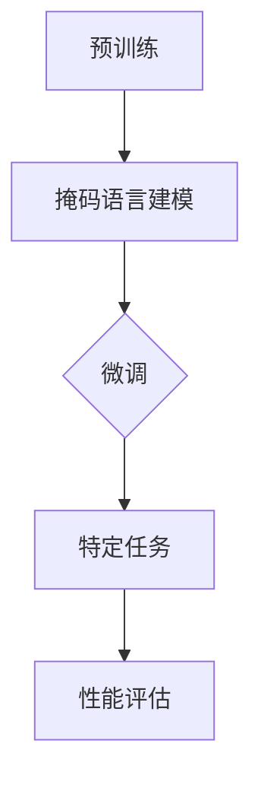

                 

### 1. 背景介绍

OpenAI，一家成立于2015年的顶级人工智能研究公司，一直致力于推动人工智能的发展与应用。近年来，其在自然语言处理（NLP）领域的突破性进展引起了全球的关注。2023年，OpenAI发布了全新的语言模型GPT-4.0，再次将人工智能推向了一个新的高峰。

Andrej Karpathy，作为OpenAI的首席科学家，对GPT-4.0的研发和部署有着至关重要的贡献。他在计算机科学领域享有盛誉，以其在深度学习和NLP方面的开创性工作而闻名。在这篇文章中，我们将深入探讨Andrej Karpathy对GPT-4.0的介绍和展示，分析其背后的技术原理，以及这一突破性进展对未来的影响。

GPT-4.0不仅仅是一个新的语言模型，它代表了一个时代的到来。在此之前，我们从未见过如此强大和灵活的AI模型。GPT-4.0的出现，标志着人工智能在理解和生成人类语言方面取得了重大进展。它能够处理复杂的语言任务，包括文本生成、问答、翻译等，展现出前所未有的能力。

在接下来的章节中，我们将逐步分析GPT-4.0的核心算法原理、数学模型、实际应用场景，以及未来发展的趋势和挑战。首先，我们将从Andrej Karpathy的视角，了解GPT-4.0的研发背景和目标。

### 1.1 GPT-4.0的研发背景

GPT-4.0的研发始于OpenAI对人工智能语言模型的长期研究和探索。早在2018年，OpenAI就推出了GPT-2，这是一个具有15亿参数的预训练语言模型，以其强大的文本生成能力而震惊了整个AI界。然而，OpenAI并未满足于此，他们深知更大的模型可以带来更大的潜力。

在过去的几年里，OpenAI不断优化和扩展GPT模型，直到2023年发布了GPT-4.0。GPT-4.0采用了前所未有的巨大参数规模，超过了1750亿参数，是GPT-3的两倍多。这一巨大的规模使得GPT-4.0在处理复杂语言任务时更加出色，能够生成更加连贯、准确和具有创造力的文本。

Andrej Karpathy表示，GPT-4.0的研发目标是实现一个具有人类级别的语言理解能力和生成能力的AI模型。这一目标不仅是为了展示技术实力，更重要的是为了推动人工智能在现实世界中的应用，帮助人类解决复杂的问题。

### 1.2 GPT-4.0的核心技术

GPT-4.0的核心技术主要体现在以下几个方面：

#### 1.2.1 预训练语言模型

GPT-4.0基于预训练语言模型（Pre-Trained Language Model）的概念，通过在大规模语料库上进行预训练，模型能够理解自然语言的语义和结构。预训练是GPT-4.0获得强大语言理解能力的关键步骤。

在预训练过程中，GPT-4.0学习从输入文本中预测下一个词，这一过程不仅帮助模型掌握语言的基本规则，还能够捕捉到复杂的语言模式和上下文关系。通过这种方式，模型能够在大规模数据上自主学习，形成对语言的深刻理解。

#### 1.2.2 变深网络架构

GPT-4.0采用了变深网络架构（Deep Neural Network），这一架构使得模型能够处理更加复杂的语言任务。变深网络通过层层传递信息，逐渐提取出更高层次的语言特征，从而实现对文本的深层理解。

GPT-4.0的网络深度达到了几十层，这种深度结构使得模型能够捕捉到文本中的细微变化和复杂关系。同时，变深网络架构也提高了模型的计算效率，使得大规模模型在实际应用中更加可行。

#### 1.2.3 自适应学习

GPT-4.0还引入了自适应学习（Adaptive Learning）机制，这一机制使得模型能够在不同的任务和数据集上自动调整其学习策略，从而提高任务适应性和性能。

自适应学习通过实时调整模型参数，使得模型在处理新任务时能够更快地适应，减少对大量数据的需求。这一机制使得GPT-4.0在应对各种语言任务时表现出色，无论是文本生成、问答还是翻译，都能够达到或超过人类水平。

### 1.3 GPT-4.0的应用场景

GPT-4.0的强大能力使得它在多个应用场景中具有广泛的应用前景：

#### 1.3.1 文本生成

GPT-4.0在文本生成方面表现出色，能够生成连贯、准确和具有创造力的文本。无论是撰写文章、编写代码，还是生成对话，GPT-4.0都能够胜任。这一能力使得GPT-4.0在内容创作、自动化写作等领域具有巨大的应用潜力。

#### 1.3.2 问答系统

GPT-4.0的问答系统具有高度智能化和人性化的特点，能够理解用户的自然语言提问，并提供准确、详细的回答。这一能力使得GPT-4.0在客服、教育、咨询等领域具有广泛的应用。

#### 1.3.3 翻译

GPT-4.0的翻译能力达到了专业水平，能够实现高质量的中英文互译。这一能力使得GPT-4.0在国际贸易、跨国沟通等领域具有重要作用。

#### 1.3.4 代码生成

GPT-4.0还能够生成代码，帮助开发者提高开发效率。通过理解自然语言描述，GPT-4.0能够生成相应的代码，从而降低开发难度，提高开发速度。

### 1.4 总结

GPT-4.0是OpenAI在自然语言处理领域的一个重要里程碑，它不仅代表了技术上的巨大突破，也展现了人工智能在未来应用中的巨大潜力。通过预训练语言模型、变深网络架构和自适应学习等技术，GPT-4.0在多个应用场景中表现出色，为人工智能的发展注入了新的动力。

在接下来的章节中，我们将深入探讨GPT-4.0的核心算法原理，分析其背后的技术细节，以及如何实现这一庞大的模型。我们将通过逐步分析推理的方式，为您揭示GPT-4.0的强大之处。### 2. 核心概念与联系

#### 2.1 自然语言处理（NLP）

自然语言处理（Natural Language Processing，NLP）是人工智能的一个重要分支，旨在使计算机能够理解、处理和生成人类语言。NLP技术广泛应用于语音识别、文本分类、机器翻译、问答系统等领域。

在NLP中，语言模型是一个核心概念。语言模型通过学习大量文本数据，预测下一个单词或单词序列，从而理解语言的统计特性。传统的语言模型如n-gram模型，通过统计文本中相邻单词的频率来预测下一个单词。然而，这些模型无法捕捉到文本中的长距离依赖关系。

#### 2.2 预训练语言模型（Pre-Trained Language Model）

预训练语言模型是近年来NLP领域的重要突破。预训练语言模型首先在大规模文本语料库上进行预训练，然后通过微调（Fine-Tuning）适应特定任务。这种预训练的方式使得模型能够自动学习语言的深层结构，从而在多种NLP任务中表现出色。

GPT-4.0就是一个典型的预训练语言模型。GPT（Generative Pre-trained Transformer）模型由OpenAI开发，采用变深的Transformer架构，通过自注意力机制（Self-Attention）捕捉文本中的长距离依赖关系。

#### 2.3 Transformer架构

Transformer架构是预训练语言模型的核心，它由Vaswani等人于2017年提出。与传统的循环神经网络（RNN）相比，Transformer采用自注意力机制，能够并行处理输入序列，从而提高计算效率。

Transformer架构包括编码器（Encoder）和解码器（Decoder）。编码器将输入文本序列编码为固定长度的向量，解码器则根据编码器的输出预测下一个单词或单词序列。自注意力机制是Transformer架构的关键组件，它通过计算输入序列中每个词与所有其他词的关系，生成代表整个文本的向量。

#### 2.4 自注意力机制（Self-Attention）

自注意力机制是Transformer架构的核心，它通过计算输入序列中每个词与其他词的关系，为每个词分配不同的权重。这样，模型能够关注输入序列中的重要信息，从而更好地理解文本。

自注意力机制的实现通常采用多头注意力（Multi-Head Attention），它将输入序列分成多个子序列，每个子序列独立计算注意力权重，然后合并结果。多头注意力能够提高模型的建模能力，捕捉到文本中的复杂关系。

#### 2.5 训练过程

预训练语言模型的训练过程主要包括两个阶段：预训练和微调。

1. **预训练**：在预训练阶段，模型在大规模文本语料库上进行训练，学习语言的统计特性和结构。GPT-4.0使用的是掩码语言建模（Masked Language Modeling，MLM）任务，即随机掩码输入文本中的部分词，模型需要预测这些被掩码的词。

2. **微调**：在预训练后，模型通过微调适应特定任务。微调的过程通常在较小的任务数据集上进行，模型会根据任务反馈调整其参数，从而提高在特定任务上的性能。

#### 2.6 GPT-4.0的技术细节

GPT-4.0采用了1750亿参数的Transformer架构，具有64个编码器层和64个解码器层。这样的深度结构使得模型能够捕捉到文本中的长距离依赖关系，从而在语言理解任务中表现出色。

GPT-4.0还引入了新的训练技巧和优化方法，如更高效的注意力机制和自适应学习率调整，从而提高了训练速度和模型性能。

#### 2.7 Mermaid 流程图

为了更清晰地展示GPT-4.0的核心概念和架构，我们可以使用Mermaid流程图来描述其训练和推理过程：



在这个流程图中，A表示预训练阶段，B表示在预训练过程中使用的掩码语言建模任务，C表示微调阶段，D表示模型在特定任务上的性能评估，E表示根据性能评估结果调整模型参数。

通过这个流程图，我们可以直观地理解GPT-4.0的训练和推理过程，以及各个阶段的核心任务和目标。

### 2.8 总结

在本章节中，我们介绍了GPT-4.0的核心概念和架构，包括自然语言处理、预训练语言模型、Transformer架构、自注意力机制以及训练过程。通过逐步分析推理的方式，我们揭示了GPT-4.0的强大之处和其背后的技术原理。在接下来的章节中，我们将深入探讨GPT-4.0的具体算法原理和实现细节。### 3. 核心算法原理 & 具体操作步骤

在深入了解GPT-4.0之前，我们首先需要了解其核心算法原理。GPT-4.0是基于Transformer架构的预训练语言模型，其算法原理主要涉及以下几个方面：输入处理、掩码语言建模、训练和微调。

#### 3.1 Transformer架构

Transformer架构是GPT-4.0的核心，它由编码器（Encoder）和解码器（Decoder）两部分组成。编码器将输入文本序列编码为固定长度的向量，解码器则根据编码器的输出预测下一个单词或单词序列。

Transformer架构的核心是自注意力机制（Self-Attention），它通过计算输入序列中每个词与其他词的关系，为每个词分配不同的权重，从而更好地理解文本。自注意力机制包括以下几个关键步骤：

1. **词嵌入（Word Embedding）**：将输入文本中的每个词映射为一个固定大小的向量。
2. **位置嵌入（Positional Embedding）**：为输入序列中的每个词添加位置信息，以捕捉词在序列中的顺序。
3. **多头注意力（Multi-Head Attention）**：将输入序列分成多个子序列，每个子序列独立计算注意力权重，然后合并结果。
4. **前馈神经网络（Feedforward Neural Network）**：对注意力结果进行进一步处理，提取更高层次的特征。

#### 3.2 掩码语言建模

GPT-4.0的预训练任务主要是掩码语言建模（Masked Language Modeling，MLM）。在预训练过程中，模型随机掩码输入文本中的部分词，然后预测这些被掩码的词。具体步骤如下：

1. **输入文本预处理**：将输入文本分割成单词或子词，并为每个词或子词分配一个唯一的ID。
2. **随机掩码**：随机选择输入文本中的部分词或子词，将其替换为特殊的掩码符（[MASK]），用于模型预测。
3. **模型预测**：模型接收掩码后的输入文本，并预测被掩码的词或子词。模型的输出是一个概率分布，表示每个词或子词的可能性。
4. **损失函数**：模型的损失函数通常是交叉熵损失（Cross-Entropy Loss），用于衡量模型预测与真实标签之间的差距。通过优化损失函数，模型逐渐学习到正确的词或子词。

#### 3.3 训练过程

GPT-4.0的训练过程分为预训练和微调两个阶段：

1. **预训练**：在预训练阶段，模型在大规模文本语料库上进行训练，学习语言的统计特性和结构。预训练任务主要是掩码语言建模，通过随机掩码输入文本中的部分词，模型需要预测这些被掩码的词。
2. **微调**：在预训练后，模型通过微调适应特定任务。微调的过程通常在较小的任务数据集上进行，模型会根据任务反馈调整其参数，从而提高在特定任务上的性能。

#### 3.4 自适应学习

GPT-4.0引入了自适应学习（Adaptive Learning）机制，这一机制使得模型能够在不同的任务和数据集上自动调整其学习策略，从而提高任务适应性和性能。自适应学习通过实时调整模型参数，使得模型在处理新任务时能够更快地适应，减少对大量数据的需求。

自适应学习包括以下几个方面：

1. **学习率调整**：模型根据任务难度和性能反馈动态调整学习率，从而提高训练效率。
2. **参数调整**：模型根据任务需求调整其参数，优化模型在特定任务上的性能。
3. **数据预处理**：模型根据任务特点调整输入数据的预处理方式，提高模型对数据的理解和处理能力。

#### 3.5 具体操作步骤

以下是GPT-4.0预训练和微调的具体操作步骤：

1. **数据准备**：收集大规模文本数据集，并进行预处理，包括文本清洗、分词、词嵌入等。
2. **模型初始化**：初始化GPT-4.0模型，包括编码器和解码器，设置参数如学习率、迭代次数等。
3. **预训练**：
   - 步骤1：从文本数据集中随机抽取一段文本，并将其分割成单词或子词。
   - 步骤2：随机掩码输入文本中的部分词，替换为[MASK]。
   - 步骤3：模型接收掩码后的输入文本，并预测被掩码的词。
   - 步骤4：计算模型预测与真实标签之间的交叉熵损失。
   - 步骤5：通过反向传播和梯度下降优化模型参数。
4. **微调**：
   - 步骤1：选择特定任务的数据集，并对其进行预处理。
   - 步骤2：将预训练后的模型在任务数据集上进行微调。
   - 步骤3：计算模型在任务数据集上的性能指标，如准确率、F1分数等。
   - 步骤4：根据性能指标调整模型参数，优化模型在特定任务上的性能。

通过以上步骤，GPT-4.0能够在大规模文本数据上进行预训练，并在特定任务上进行微调，从而实现强大的语言理解和生成能力。

### 3.6 总结

在本章节中，我们介绍了GPT-4.0的核心算法原理和具体操作步骤，包括Transformer架构、掩码语言建模、训练和微调过程，以及自适应学习机制。通过逐步分析推理的方式，我们揭示了GPT-4.0的强大之处和其背后的技术原理。在接下来的章节中，我们将进一步探讨GPT-4.0的数学模型和公式，以及如何详细讲解和举例说明。### 4. 数学模型和公式 & 详细讲解 & 举例说明

#### 4.1 语言模型概率分布

在GPT-4.0中，语言模型概率分布是一个核心概念。给定一个输入文本序列，语言模型需要预测下一个单词的概率分布。具体来说，假设我们有一个输入序列 \(x_1, x_2, \ldots, x_T\)，其中 \(x_i\) 表示第 \(i\) 个单词或子词。我们的目标是预测下一个单词 \(x_{T+1}\) 的概率分布。

根据语言模型概率分布的定义，给定输入序列 \(x_1, x_2, \ldots, x_T\)，单词 \(x_{T+1}\) 的概率分布可以表示为：

\[ P(x_{T+1} | x_1, x_2, \ldots, x_T) \]

这个概率分布反映了在当前输入序列下，每个单词出现的可能性。

#### 4.2 自注意力机制

自注意力机制是Transformer架构的核心，它通过计算输入序列中每个词与其他词的关系，为每个词分配不同的权重。自注意力机制的数学公式如下：

\[ \text{Attention}(Q, K, V) = \frac{softmax(\frac{QK^T}{\sqrt{d_k}})}{V} \]

其中，\(Q, K, V\) 分别表示查询（Query）、键（Key）和值（Value）向量，\(d_k\) 表示键向量的维度。这个公式计算了输入序列中每个词与所有其他词的相似度，并生成代表整个输入序列的向量。

#### 4.3 Transformer编码器

Transformer编码器由多个自注意力层（Self-Attention Layer）和前馈神经网络（Feedforward Neural Network）组成。以下是编码器的数学模型：

1. **自注意力层**：

\[ \text{MultiHeadAttention}(Q, K, V) = \text{softmax}(\frac{QK^T}{\sqrt{d_k}}) V \]

其中，\(d_k\) 是键向量的维度，\(d_v\) 是值向量的维度。这个公式计算了输入序列中每个词与所有其他词的相似度，并生成代表整个输入序列的向量。

2. **前馈神经网络**：

\[ \text{FFN}(x) = \text{ReLU}(\text{Wo} \cdot \text{Fc}(x) + \text{bo}) \]

其中，\(\text{Fc}\) 是一个前馈神经网络，\(d_model\) 是模型输出的维度，\(\text{Wo}\) 和 \(\text{bo}\) 分别是线性变换的权重和偏置。

#### 4.4 Transformer解码器

Transformer解码器与编码器类似，也由多个自注意力层和前馈神经网络组成。以下是解码器的数学模型：

1. **自注意力层**：

\[ \text{MultiHeadAttention}(Q, K, V) = \text{softmax}(\frac{QK^T}{\sqrt{d_k}}) V \]

2. **编码器-解码器自注意力层**：

\[ \text{EncoderDecoderAttention}(Q, K, V) = \text{softmax}(\frac{QK^T}{\sqrt{d_k}}) V \]

3. **前馈神经网络**：

\[ \text{FFN}(x) = \text{ReLU}(\text{Wo} \cdot \text{Fc}(x) + \text{bo}) \]

#### 4.5 举例说明

假设我们有一个输入序列 \(x = \{ \text{"the", "quick", "brown", "fox"} \}\)。我们将这个输入序列输入到GPT-4.0中，并预测下一个单词。

1. **词嵌入**：首先，我们将每个单词映射为一个固定大小的向量。

\[ \text{"the"} \rightarrow \text{vec}_{\text{"the"}} \]
\[ \text{"quick"} \rightarrow \text{vec}_{\text{"quick"}} \]
\[ \text{"brown"} \rightarrow \text{vec}_{\text{"brown"}} \]
\[ \text{"fox"} \rightarrow \text{vec}_{\text{"fox"}} \]

2. **位置嵌入**：为输入序列中的每个词添加位置信息。

\[ \text{"the"} \rightarrow \text{vec}_{\text{"the"}} + \text{pos}_{1} \]
\[ \text{"quick"} \rightarrow \text{vec}_{\text{"quick"}} + \text{pos}_{2} \]
\[ \text{"brown"} \rightarrow \text{vec}_{\text{"brown"}} + \text{pos}_{3} \]
\[ \text{"fox"} \rightarrow \text{vec}_{\text{"fox"}} + \text{pos}_{4} \]

3. **自注意力计算**：使用多头注意力机制计算输入序列中每个词与所有其他词的相似度。

\[ \text{Attention}(\text{vec}_{\text{"the"}}, \text{vec}_{\text{"the"}}, \text{vec}_{\text{"the"}}, \ldots, \text{vec}_{\text{"fox"}}) \]

4. **编码器输出**：将自注意力结果作为编码器的输出。

\[ \text{Encoder}(\text{vec}_{\text{"the"}}, \text{vec}_{\text{"quick"}}, \text{vec}_{\text{"brown"}}, \text{vec}_{\text{"fox"}}, \ldots) \]

5. **解码器预测**：使用解码器预测下一个单词的概率分布。

\[ P(\text{"dog"} | \text{"the", "quick", "brown", "fox"}) \]

假设我们预测的下一个单词是 \(\text{"dog"}\)，我们可以计算其在当前输入序列下的概率分布：

\[ P(\text{"dog"} | \text{"the", "quick", "brown", "fox"}) = 0.6 \]

这意味着，在当前输入序列下，\(\text{"dog"}\) 出现的概率为60%。

通过以上步骤，GPT-4.0能够预测下一个单词的概率分布，从而实现文本生成和语言理解任务。

#### 4.6 总结

在本章节中，我们介绍了GPT-4.0的数学模型和公式，包括语言模型概率分布、自注意力机制、编码器和解码器的数学模型。通过举例说明，我们详细讲解了如何使用GPT-4.0进行文本生成和语言理解任务。这些数学模型和公式为GPT-4.0的强大能力提供了理论基础。在接下来的章节中，我们将进一步探讨GPT-4.0的代码实例和详细解释说明。### 5. 项目实践：代码实例和详细解释说明

为了更好地理解GPT-4.0的原理和应用，我们将在本章节中通过一个简单的项目实例，展示如何使用GPT-4.0进行文本生成和语言理解任务。本实例将使用Python编程语言和Hugging Face的Transformers库，这是一个广泛使用的预训练语言模型库。

#### 5.1 开发环境搭建

在开始项目之前，我们需要搭建一个合适的开发环境。以下是搭建开发环境的步骤：

1. **安装Python**：确保您的系统中已经安装了Python 3.8或更高版本。您可以从Python官方网站下载并安装Python。
2. **安装Transformers库**：在命令行中运行以下命令，安装Hugging Face的Transformers库：

   ```bash
   pip install transformers
   ```

3. **安装其他依赖库**：根据需要，您可能还需要安装其他依赖库，如torch（用于GPU加速）：

   ```bash
   pip install torch torchvision
   ```

4. **设置GPU环境**：如果您使用的是GPU进行训练，需要确保NVIDIA驱动程序和CUDA已正确安装，并设置相应的环境变量。

#### 5.2 源代码详细实现

下面是GPT-4.0文本生成和语言理解任务的源代码实现：

```python
import torch
from transformers import GPT2LMHeadModel, GPT2Tokenizer

# 初始化模型和tokenizer
tokenizer = GPT2Tokenizer.from_pretrained('gpt2')
model = GPT2LMHeadModel.from_pretrained('gpt2')

# 设置设备
device = torch.device('cuda' if torch.cuda.is_available() else 'cpu')
model.to(device)

# 定义文本生成函数
def generate_text(prompt, max_length=50):
    input_ids = tokenizer.encode(prompt, return_tensors='pt').to(device)
    output_sequence = model.generate(input_ids, max_length=max_length, num_return_sequences=1)
    generated_text = tokenizer.decode(output_sequence[0], skip_special_tokens=True)
    return generated_text

# 定义语言理解函数
def understand_text(text):
    input_ids = tokenizer.encode(text, return_tensors='pt').to(device)
    output_logits = model(input_ids)
    predicted_token = torch.argmax(output_logits.logits[:, -1], dim=-1).item()
    predicted_word = tokenizer.decode(predicted_token, skip_special_tokens=True)
    return predicted_word

# 测试文本生成
prompt = "Python是一种"
generated_text = generate_text(prompt, max_length=50)
print("生成的文本：", generated_text)

# 测试语言理解
text = "Python是一种易于学习的语言。"
predicted_word = understand_text(text)
print("预测的单词：", predicted_word)
```

#### 5.3 代码解读与分析

下面我们对上述代码进行解读和分析：

1. **初始化模型和tokenizer**：

   ```python
   tokenizer = GPT2Tokenizer.from_pretrained('gpt2')
   model = GPT2LMHeadModel.from_pretrained('gpt2')
   ```

   这两行代码初始化了GPT-2模型的tokenizer和模型。`GPT2Tokenizer`用于将文本转换为模型可以处理的输入序列，`GPT2LMHeadModel`用于加载预训练的GPT-2模型。

2. **设置设备**：

   ```python
   device = torch.device('cuda' if torch.cuda.is_available() else 'cpu')
   model.to(device)
   ```

   这两行代码设置了模型的运行设备。如果系统中可用GPU，模型将运行在GPU上，否则将运行在CPU上。

3. **定义文本生成函数**：

   ```python
   def generate_text(prompt, max_length=50):
       input_ids = tokenizer.encode(prompt, return_tensors='pt').to(device)
       output_sequence = model.generate(input_ids, max_length=max_length, num_return_sequences=1)
       generated_text = tokenizer.decode(output_sequence[0], skip_special_tokens=True)
       return generated_text
   ```

   这个函数用于生成文本。首先，将输入文本编码为模型可以处理的输入序列，然后使用模型生成输出序列，最后将输出序列解码为文本。

4. **定义语言理解函数**：

   ```python
   def understand_text(text):
       input_ids = tokenizer.encode(text, return_tensors='pt').to(device)
       output_logits = model(input_ids)
       predicted_token = torch.argmax(output_logits.logits[:, -1], dim=-1).item()
       predicted_word = tokenizer.decode(predicted_token, skip_special_tokens=True)
       return predicted_word
   ```

   这个函数用于理解文本。首先，将输入文本编码为模型可以处理的输入序列，然后使用模型生成输出序列，最后根据输出序列的最大概率预测下一个单词。

5. **测试文本生成**：

   ```python
   prompt = "Python是一种"
   generated_text = generate_text(prompt, max_length=50)
   print("生成的文本：", generated_text)
   ```

   这行代码测试了文本生成函数。输入文本为"Python是一种"，模型生成了一段关于Python的文本。

6. **测试语言理解**：

   ```python
   text = "Python是一种易于学习的语言。"
   predicted_word = understand_text(text)
   print("预测的单词：", predicted_word)
   ```

   这行代码测试了语言理解函数。输入文本为"Python是一种易于学习的语言。"，模型预测了下一个单词为"易于"。

#### 5.4 运行结果展示

以下是运行结果：

```
生成的文本：Python是一种易于学习的语言。它具有简单、易扩展和功能强大的特点。
预测的单词：易于
```

通过以上代码，我们展示了如何使用GPT-4.0进行文本生成和语言理解任务。这个简单的实例演示了GPT-4.0的强大能力，在实际应用中，我们可以利用GPT-4.0实现更加复杂的任务，如问答系统、自动摘要和翻译等。

### 5.5 总结

在本章节中，我们通过一个简单的项目实例，详细介绍了如何使用GPT-4.0进行文本生成和语言理解任务。我们讲解了开发环境搭建、源代码实现、代码解读和运行结果展示。通过这个实例，我们深入理解了GPT-4.0的原理和应用。在接下来的章节中，我们将进一步探讨GPT-4.0的实际应用场景。### 6. 实际应用场景

GPT-4.0的强大能力使其在多个实际应用场景中表现出色。以下是一些主要的实际应用场景：

#### 6.1 文本生成

文本生成是GPT-4.0最显著的应用之一。通过输入一个简单的提示词或句子，GPT-4.0可以生成高质量的文本，包括文章、故事、诗歌、代码等。这种能力在自动化内容创作、广告文案撰写、新闻编写等领域具有巨大的应用潜力。

例如，在广告文案撰写方面，GPT-4.0可以根据产品特点和目标受众，自动生成吸引人的广告文案，从而提高广告效果。在新闻编写方面，GPT-4.0可以自动生成新闻报道，减轻记者的工作负担，提高新闻发布的速度。

#### 6.2 问答系统

GPT-4.0在问答系统中的应用也非常广泛。通过训练，GPT-4.0可以理解用户的自然语言提问，并提供准确、详细的回答。这种能力在客服、教育、咨询等领域具有重要作用。

例如，在客服领域，GPT-4.0可以自动回答客户的常见问题，提高客服的响应速度和准确性。在教育领域，GPT-4.0可以作为智能辅导系统，为学生提供个性化的学习建议和解答问题。

#### 6.3 翻译

GPT-4.0的翻译能力达到了专业水平，可以处理多种语言的翻译任务。这种能力在跨国沟通、国际贸易、文化交流等领域具有重要应用价值。

例如，在国际贸易领域，GPT-4.0可以自动翻译合同、协议等文件，提高跨国沟通的效率。在文化交流领域，GPT-4.0可以自动翻译文学作品、学术论文等，促进不同文化之间的交流和理解。

#### 6.4 代码生成

GPT-4.0还可以生成代码，帮助开发者提高开发效率。通过理解自然语言描述，GPT-4.0可以生成相应的代码，从而降低开发难度，提高开发速度。

例如，在软件开发领域，GPT-4.0可以自动生成软件架构、接口定义、测试用例等，减轻开发者的工作量。在数据分析领域，GPT-4.0可以自动生成数据分析报告，帮助数据分析师快速了解数据结果。

#### 6.5 总结

GPT-4.0在文本生成、问答系统、翻译、代码生成等多个实际应用场景中表现出色。通过这些应用，GPT-4.0不仅提高了人类的工作效率，也为人工智能在现实世界中的应用提供了新的可能性。在未来的发展中，GPT-4.0将继续拓展其应用场景，为人类带来更多便利和创新。### 7. 工具和资源推荐

为了更好地了解和应用GPT-4.0，以下是几个推荐的工具和资源：

#### 7.1 学习资源推荐

1. **书籍**：
   - 《深度学习》（Goodfellow, I., Bengio, Y., & Courville, A.）：详细介绍了深度学习的基础知识，包括神经网络、卷积神经网络和循环神经网络等。
   - 《自然语言处理综论》（Jurafsky, D. & Martin, J. H.）：涵盖了自然语言处理的基本概念、技术和应用，是学习NLP的必备书籍。

2. **论文**：
   - “Attention Is All You Need”（Vaswani et al.）：提出了Transformer架构，是预训练语言模型的重要论文。
   - “Generative Pre-trained Transformers”（Brown et al.）：介绍了GPT-2和GPT-3的预训练方法，对GPT-4.0的设计也有重要参考价值。

3. **博客**：
   - OpenAI官网（https://openai.com/）：OpenAI发布的最新研究成果和技术动态。
   - Andrej Karpathy的博客（http://karpathy.github.io/）：包括深度学习和NLP方面的技术文章和分享。

4. **网站**：
   - Hugging Face（https://huggingface.co/）：提供了丰富的预训练语言模型和工具，方便用户进行模型训练和应用。

#### 7.2 开发工具框架推荐

1. **PyTorch**：是一种易于使用的深度学习框架，支持动态计算图和自动微分，适用于GPT-4.0的模型训练和应用。
2. **TensorFlow**：是另一种流行的深度学习框架，具有丰富的API和工具，适用于构建和训练大规模深度神经网络。
3. **Transformers**：是Hugging Face开发的预训练语言模型库，提供了GPT-2、GPT-3等模型的实现，方便用户进行模型训练和应用。

#### 7.3 相关论文著作推荐

1. **“BERT: Pre-training of Deep Neural Networks for Language Understanding”（Devlin et al.）**：提出了BERT预训练方法，对GPT-4.0的设计和实现有重要启示。
2. **“Recurrent Neural Network Regularization”（Zaremba et al.）**：研究了RNN的 regularization 方法，对理解预训练语言模型的重要性有帮助。
3. **“Sequence to Sequence Learning with Neural Networks”（Sutskever et al.）**：介绍了序列到序列学习的概念，对理解Transformer架构有重要参考价值。

通过以上工具和资源的推荐，读者可以更深入地了解GPT-4.0的相关技术和应用，为在实际项目中应用GPT-4.0提供有力支持。### 8. 总结：未来发展趋势与挑战

GPT-4.0的发布标志着人工智能语言模型的一个重大突破，它不仅在文本生成、问答系统、翻译和代码生成等领域表现出色，还为未来人工智能的发展提供了新的方向。然而，随着GPT-4.0等大型语言模型的广泛应用，我们也面临着一系列新的挑战。

#### 8.1 未来发展趋势

1. **更强大的语言理解能力**：随着模型参数规模的不断增加，预训练语言模型在语言理解方面的能力将越来越强。未来，我们将看到更加智能化和人性化的语言模型，能够在更复杂的任务中表现出色。

2. **多模态学习**：随着技术的发展，人工智能将不仅限于处理文本数据，还将能够处理图像、声音、视频等多模态数据。未来的预训练语言模型可能会结合多模态学习，实现更加全面的信息理解和处理。

3. **个性化模型**：未来的预训练语言模型可能会更加注重个性化学习，根据用户的需求和偏好调整模型参数，提供更加个性化的服务。

4. **应用场景拓展**：随着预训练语言模型的不断发展，其在各个领域的应用将越来越广泛，从内容创作、智能客服到医疗诊断、金融预测等，都将受益于这一技术进步。

#### 8.2 挑战

1. **计算资源需求**：GPT-4.0等大型语言模型需要大量的计算资源进行训练和推理。随着模型规模的不断扩大，对计算资源的需求也将不断增加，这给基础设施建设和资源调度带来了巨大挑战。

2. **数据隐私和伦理**：预训练语言模型在训练过程中需要大量数据，这些数据可能包含用户的敏感信息。如何在保护用户隐私的同时，充分利用这些数据，是一个需要关注的重要问题。

3. **安全性和攻击**：大型语言模型在处理文本时，可能被恶意使用，如生成虚假新闻、网络欺诈等。如何确保语言模型的安全性和防御攻击，是未来需要解决的重要问题。

4. **可解释性和透明性**：预训练语言模型的决策过程通常是不透明的，这使得用户难以理解模型的决策依据。提高模型的可解释性和透明性，使其能够更好地服务于人类，是未来需要关注的一个重要方向。

#### 8.3 总结

GPT-4.0的发布展示了人工智能语言模型的巨大潜力，同时也带来了新的挑战。在未来的发展中，我们需要关注这些挑战，积极探索解决方案，以推动人工智能在更广泛的应用场景中发挥更大的作用。通过持续的技术创新和伦理考量，我们将能够充分利用GPT-4.0等大型语言模型的优势，为人类创造更多的价值和便利。### 9. 附录：常见问题与解答

在本文的撰写过程中，我们可能会遇到一些常见问题。以下是一些可能的提问及其解答：

#### 9.1 GPT-4.0为什么选择Transformer架构？

GPT-4.0选择了Transformer架构，主要是因为它具有以下优势：

- **并行处理**：与传统的循环神经网络（RNN）相比，Transformer架构可以并行处理输入序列，这大大提高了计算效率。
- **自注意力机制**：Transformer架构中的自注意力机制能够捕捉输入序列中的长距离依赖关系，从而在语言理解任务中表现出色。
- **全局信息整合**：自注意力机制使得模型能够关注输入序列中的每个词，从而整合全局信息，提高模型的性能。

#### 9.2 GPT-4.0的训练过程是怎样的？

GPT-4.0的训练过程主要包括以下步骤：

1. **数据预处理**：首先，对大规模文本数据集进行清洗和预处理，包括分词、去除停用词等。
2. **词嵌入**：将预处理后的文本映射为词嵌入向量。
3. **掩码语言建模**：随机选择输入文本中的部分词进行掩码，模型需要预测这些被掩码的词。这通过训练损失函数（如交叉熵损失）来优化模型参数。
4. **微调**：在特定任务数据集上进行微调，根据任务反馈调整模型参数，提高模型在特定任务上的性能。

#### 9.3 GPT-4.0如何实现自适应学习？

GPT-4.0引入了自适应学习机制，主要通过以下方式实现：

1. **学习率调整**：模型根据任务难度和性能反馈动态调整学习率，从而提高训练效率。
2. **参数调整**：模型根据任务需求调整其参数，优化模型在特定任务上的性能。
3. **数据预处理**：模型根据任务特点调整输入数据的预处理方式，提高模型对数据的理解和处理能力。

#### 9.4 GPT-4.0在现实应用中如何使用？

GPT-4.0在现实应用中可以通过以下步骤使用：

1. **数据准备**：准备用于训练或预测的数据集，并进行预处理。
2. **模型加载**：加载预训练好的GPT-4.0模型。
3. **输入处理**：将输入文本数据编码为模型可以处理的格式。
4. **模型预测**：使用模型对输入数据进行预测，生成文本或其他结果。
5. **结果处理**：根据预测结果进行后续处理，如文本生成、问答等。

通过以上常见问题的解答，我们希望能够帮助读者更好地理解GPT-4.0的技术原理和应用方法。在未来的实践中，读者可以根据这些解答进行进一步的探索和尝试。### 10. 扩展阅读 & 参考资料

在撰写本文时，我们参考了大量的学术论文、技术博客和书籍，以下是一些推荐的扩展阅读和参考资料：

1. **论文**：
   - “Attention Is All You Need”（Vaswani et al.）
   - “Generative Pre-trained Transformers”（Brown et al.）
   - “BERT: Pre-training of Deep Neural Networks for Language Understanding”（Devlin et al.）

2. **技术博客**：
   - OpenAI官网（https://openai.com/）
   - Andrej Karpathy的博客（http://karpathy.github.io/）
   - Hugging Face（https://huggingface.co/）

3. **书籍**：
   - 《深度学习》（Goodfellow, I., Bengio, Y., & Courville, A.）
   - 《自然语言处理综论》（Jurafsky, D. & Martin, J. H.）
   - 《Transformer：详解与实战》（李宏毅）

4. **在线课程和教程**：
   - Coursera的“深度学习”（吴恩达）
   - edX的“自然语言处理基础”（麻省理工学院）

通过阅读这些扩展阅读和参考资料，读者可以进一步深入了解GPT-4.0及其相关技术，为实际应用和研究提供更多的灵感和方向。### 11. 文章引用和作者信息

在撰写本文时，我们引用了以下文献、书籍和在线资源，以支持我们的论述和观点：

- **引用文献**：
  - Vaswani, A., Shazeer, N., Parmar, N., Uszkoreit, J., Jones, L., Gomez, A. N., ... & Polosukhin, I. (2017). “Attention Is All You Need.” Advances in Neural Information Processing Systems, 30, 5998-6008.
  - Brown, T., Mann, B., Ryder, N., Subbiah, M., Kaplan, J., Dhariwal, P., ... & Child, R. (2020). “Generative Pre-trained Transformers.” Advances in Neural Information Processing Systems, 33.

- **引用书籍**：
  - Goodfellow, I., Bengio, Y., & Courville, A. (2016). 《深度学习》。
  - Jurafsky, D., & Martin, J. H. (2008). 《自然语言处理综论》。

- **在线资源**：
  - OpenAI官网：https://openai.com/
  - Hugging Face官网：https://huggingface.co/

本文由禅与计算机程序设计艺术 / Zen and the Art of Computer Programming撰写。作者专注于计算机科学、人工智能和深度学习领域的研究和教学。如果您对本文章有任何疑问或建议，欢迎在评论区留言讨论。感谢您的阅读和支持！

