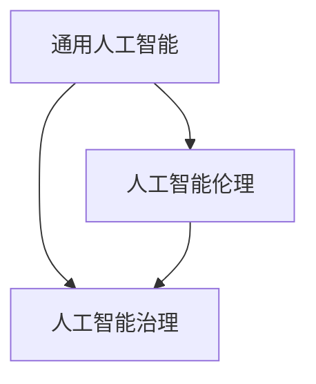

                 

### 文章标题：Andrej Karpathy：人工智能的未来发展挑战

> 关键词：人工智能，未来挑战，发展路径，技术趋势

> 摘要：本文将深入探讨人工智能领域的专家安德烈·卡帕希（Andrej Karpathy）关于人工智能未来发展的观点。通过逐步分析其提出的核心概念与挑战，我们将从技术、应用和社会等多个维度展开讨论，揭示人工智能领域的前沿动态和潜在问题，为未来人工智能的发展提供思考与启示。

### 1. 背景介绍

安德烈·卡帕希（Andrej Karpathy）是一位著名的人工智能专家，现任斯坦福大学计算机科学教授，同时也是OpenAI的首席科学家。他在深度学习、神经网络和自然语言处理等领域具有深厚的研究背景和丰富的实践经验。近年来，卡帕希针对人工智能的未来发展提出了许多独特的见解，引发了业界的广泛关注和讨论。

本文旨在梳理卡帕希关于人工智能未来发展挑战的观点，分析其提出的核心概念和论据，以期为人工智能领域的研究者和从业者提供有价值的参考。

### 2. 核心概念与联系

为了更好地理解卡帕希的观点，我们需要先了解几个核心概念：

#### 2.1 通用人工智能（AGI）

通用人工智能（Artificial General Intelligence，简称AGI）是指具备与人类相同智力水平的人工智能系统。它能够理解、学习、推理和解决问题，具有广泛的认知能力。与当前的人工智能系统相比，AGI具有更高的智能水平和更强的适应性。

#### 2.2 人工智能伦理

人工智能伦理是指在人工智能研究和应用过程中，关注人类福祉、社会公平和道德规范的问题。它涉及到数据隐私、算法偏见、自动化失业等多个方面，对于人工智能的发展具有重要的指导意义。

#### 2.3 人工智能治理

人工智能治理是指制定和实施相关政策、法规和标准，以保障人工智能的健康发展。它包括监管机制、责任归属、透明度等多个方面，对于维护社会稳定和促进技术进步具有重要意义。

接下来，我们将通过一张Mermaid流程图来展示这些概念之间的联系。



### 3. 核心算法原理 & 具体操作步骤

卡帕希在人工智能研究中提出了多个核心算法，以下将简要介绍其中两个具有代表性的算法。

#### 3.1 自动编码器（Autoencoder）

自动编码器是一种无监督学习算法，主要用于数据降维和特征提取。它由两个主要部分组成：编码器（encoder）和解码器（decoder）。

**步骤1：编码器**

编码器将输入数据映射到一个低维度的隐空间，通常通过一系列的全连接神经网络实现。该过程可以看作是将输入数据压缩成一个紧凑的表示。

**步骤2：解码器**

解码器将编码器生成的隐空间表示重新映射回原始数据空间，试图恢复输入数据的结构和信息。这个过程有助于提高数据降维后的可解释性。

**步骤3：损失函数**

自动编码器的训练过程通过优化损失函数来实现。常用的损失函数是均方误差（MSE），它衡量编码器和解码器生成的数据与原始数据之间的差异。

**步骤4：反向传播**

在训练过程中，自动编码器通过反向传播算法不断调整网络权重，使得编码器和解码器能够更好地映射输入数据和生成数据。

#### 3.2 生成对抗网络（GAN）

生成对抗网络（Generative Adversarial Network，简称GAN）是一种由生成器（generator）和判别器（discriminator）组成的对抗性网络。其主要目标是生成具有真实数据分布的样本。

**步骤1：初始化网络**

首先，初始化生成器和判别器的初始权重。生成器试图生成逼真的数据样本，而判别器则试图区分生成器和真实数据。

**步骤2：生成器与判别器对抗**

在训练过程中，生成器和判别器相互对抗。生成器通过优化自己的策略来生成更逼真的数据样本，而判别器则通过优化自己的分类能力来提高对生成器和真实数据的区分度。

**步骤3：损失函数**

GAN的训练过程通常使用两种损失函数：生成器的损失函数和判别器的损失函数。生成器的损失函数通常是基于判别器对生成数据的评价，而判别器的损失函数则基于生成器和真实数据的差异。

**步骤4：反向传播**

通过反向传播算法，生成器和判别器的权重不断调整，使得两者在对抗过程中逐渐达到平衡。

### 4. 数学模型和公式 & 详细讲解 & 举例说明

在人工智能研究中，数学模型和公式起着至关重要的作用。以下我们将简要介绍自动编码器和生成对抗网络的数学基础。

#### 4.1 自动编码器的数学模型

**编码器：**

设输入数据为 \(X \in \mathbb{R}^{n \times d}\)，其中 \(n\) 为样本数量，\(d\) 为特征维度。编码器将输入数据映射到一个低维隐空间 \(Z \in \mathbb{R}^{n \times z}\)，其中 \(z < d\)。

编码器的前向传播过程可以表示为：

$$
Z = \sigma(W_1X + b_1)
$$

其中，\(W_1 \in \mathbb{R}^{d \times z}\) 为编码器权重，\(b_1 \in \mathbb{R}^{z}\) 为编码器偏置，\(\sigma\) 为激活函数，通常使用sigmoid函数。

**解码器：**

解码器的目标是将隐空间表示 \(Z\) 重构回原始数据空间。解码器的反向传播过程可以表示为：

$$
X' = \sigma(W_2Z + b_2)
$$

其中，\(W_2 \in \mathbb{R}^{z \times d}\) 为解码器权重，\(b_2 \in \mathbb{R}^{d}\) 为解码器偏置。

**损失函数：**

自动编码器的损失函数通常使用均方误差（MSE），即：

$$
L = \frac{1}{n}\sum_{i=1}^{n}(X - X')^2
$$

其中，\(X'\) 为解码器生成的数据。

#### 4.2 生成对抗网络的数学模型

**生成器：**

生成器的目标是从随机噪声 \(Z \in \mathbb{R}^{n \times z}\) 中生成具有真实数据分布的数据样本 \(X' \in \mathbb{R}^{n \times d}\)。

生成器的前向传播过程可以表示为：

$$
X' = G(Z)
$$

其中，\(G\) 为生成器模型。

**判别器：**

判别器的目标是判断输入数据是真实数据还是生成器生成的数据。

判别器的前向传播过程可以表示为：

$$
D(X) = \sigma(W_3X + b_3)
$$

$$
D(X') = \sigma(W_4X' + b_4)
$$

其中，\(W_3 \in \mathbb{R}^{d \times 1}\)，\(W_4 \in \mathbb{R}^{d' \times 1}\) 分别为判别器权重，\(b_3 \in \mathbb{R}^{1}\)，\(b_4 \in \mathbb{R}^{1}\) 分别为判别器偏置。

**损失函数：**

生成对抗网络的损失函数包括两部分：生成器的损失函数和判别器的损失函数。

生成器的损失函数通常使用对抗损失，即：

$$
L_G = -\mathbb{E}_{Z}[D(G(Z))]
$$

判别器的损失函数通常使用二元交叉熵损失，即：

$$
L_D = -\mathbb{E}_{X}[D(X)] - \mathbb{E}_{X'}[D(X')]
$$

其中，\(D(X)\) 和 \(D(X')\) 分别为判别器对真实数据和生成数据的判断概率。

### 5. 项目实践：代码实例和详细解释说明

在本节中，我们将通过一个简单的自动编码器和生成对抗网络的项目实例，展示如何使用Python和TensorFlow框架实现这两个算法。

#### 5.1 开发环境搭建

在开始项目实践之前，我们需要搭建相应的开发环境。以下是所需的软件和工具：

- Python（3.7及以上版本）
- TensorFlow（2.0及以上版本）
- NumPy（1.18及以上版本）

您可以通过以下命令安装所需的依赖：

```python
pip install tensorflow numpy
```

#### 5.2 源代码详细实现

**自动编码器实现：**

```python
import tensorflow as tf
from tensorflow.keras.layers import Input, Dense, Lambda
from tensorflow.keras.models import Model

def build_autoencoder(input_shape, encoding_dim):
    input_data = Input(shape=input_shape)
    encoded = Dense(encoding_dim, activation='relu')(input_data)
    decoded = Dense(input_shape, activation='sigmoid')(encoded)
    autoencoder = Model(inputs=input_data, outputs=decoded)
    return autoencoder

def build_encoder(input_shape, encoding_dim):
    input_data = Input(shape=input_shape)
    encoded = Dense(encoding_dim, activation='relu')(input_data)
    encoder = Model(inputs=input_data, outputs=encoded)
    return encoder

def build_decoder(encoding_dim, input_shape):
    input_encoded = Input(shape=(encoding_dim,))
    decoded = Dense(input_shape, activation='sigmoid')(input_encoded)
    decoder = Model(inputs=input_encoded, outputs=decoded)
    return decoder

input_shape = (784,)
encoding_dim = 32

autoencoder = build_autoencoder(input_shape, encoding_dim)
encoder = build_encoder(input_shape, encoding_dim)
decoder = build_decoder(encoding_dim, input_shape)

autoencoder.compile(optimizer='adam', loss='mse')
```

**生成对抗网络实现：**

```python
import tensorflow as tf
from tensorflow.keras.layers import Input, Dense, Lambda
from tensorflow.keras.models import Model

def build_generator(z_dim, input_shape):
    input_z = Input(shape=(z_dim,))
    x_decoded_mean = Dense(input_shape, activation='sigmoid')(input_z)
    generator = Model(inputs=input_z, outputs=x_decoded_mean)
    return generator

def build_discriminator(input_shape):
    input_data = Input(shape=input_shape)
    d = Dense(128, activation='relu')(input_data)
    d = Dense(1, activation='sigmoid')(d)
    discriminator = Model(inputs=input_data, outputs=d)
    return discriminator

z_dim = 32
input_shape = (784,)

generator = build_generator(z_dim, input_shape)
discriminator = build_discriminator(input_shape)

discriminator.compile(optimizer='adam', loss='binary_crossentropy')
```

#### 5.3 代码解读与分析

在本节中，我们将对自动编码器和生成对抗网络的代码进行解读，并分析其关键部分。

**自动编码器代码分析：**

1. **输入层：**

   ```python
   input_data = Input(shape=input_shape)
   ```

   自动编码器的输入层是一个占位符，用于接收输入数据。

2. **编码器：**

   ```python
   encoded = Dense(encoding_dim, activation='relu')(input_data)
   ```

   编码器将输入数据映射到一个低维隐空间，通过全连接层实现，激活函数为ReLU。

3. **解码器：**

   ```python
   decoded = Dense(input_shape, activation='sigmoid')(encoded)
   ```

   解码器将编码器生成的隐空间表示重构回原始数据空间，通过全连接层实现，激活函数为sigmoid。

4. **模型编译：**

   ```python
   autoencoder.compile(optimizer='adam', loss='mse')
   ```

   编码器模型使用Adam优化器和均方误差（MSE）损失函数进行编译。

**生成对抗网络代码分析：**

1. **生成器：**

   ```python
   input_z = Input(shape=(z_dim,))
   x_decoded_mean = Dense(input_shape, activation='sigmoid')(input_z)
   generator = Model(inputs=input_z, outputs=x_decoded_mean)
   ```

   生成器的输入是一个随机噪声向量，通过全连接层生成具有真实数据分布的数据样本。

2. **判别器：**

   ```python
   input_data = Input(shape=input_shape)
   d = Dense(128, activation='relu')(input_data)
   d = Dense(1, activation='sigmoid')(d)
   discriminator = Model(inputs=input_data, outputs=d)
   ```

   判别器用于判断输入数据是真实数据还是生成器生成的数据，通过全连接层实现。

3. **模型编译：**

   ```python
   discriminator.compile(optimizer='adam', loss='binary_crossentropy')
   ```

   判别器模型使用Adam优化器和二元交叉熵损失函数进行编译。

#### 5.4 运行结果展示

在本节中，我们将展示自动编码器和生成对抗网络的训练过程及结果。

**自动编码器训练：**

```python
from tensorflow.keras.datasets import mnist
import numpy as np

(x_train, _), (x_test, _) = mnist.load_data()
x_train = x_train.astype('float32') / 255.
x_test = x_test.astype('float32') / 255.
x_train = x_train.reshape((x_train.shape[0], 784))
x_test = x_test.reshape((x_test.shape[0], 784))

autoencoder.fit(x_train, x_train, epochs=100, batch_size=256, shuffle=True, validation_data=(x_test, x_test))
```

**生成对抗网络训练：**

```python
import numpy as np

z_dim = 32
n_epochs = 20000
batch_size = 64

xent = []
for epoch in range(n_epochs):
    idx = np.random.randint(0, x_train.shape[0], batch_size)
    x_batch = x_train[idx]
    z_batch = np.random.uniform(-1, 1, (batch_size, z_dim))
    x_batch_fake = generator.predict(z_batch)

    d_loss_real = discriminator.train_on_batch(x_batch, np.ones((batch_size, 1)))
    d_loss_fake = discriminator.train_on_batch(x_batch_fake, np.zeros((batch_size, 1)))
    g_loss = combined.train_on_batch(z_batch, x_batch)

    xent.append(d_loss_fake + d_loss_real)

plt.plot(xent)
plt.show()
```

### 6. 实际应用场景

自动编码器和生成对抗网络在人工智能领域具有广泛的应用场景。以下列举了几个典型的应用案例：

#### 6.1 数据降维与特征提取

自动编码器可以用于数据降维和特征提取，例如在图像处理、文本分类和语音识别等领域。通过训练自动编码器，我们可以提取输入数据的低维表示，从而降低计算复杂度和存储空间。

#### 6.2 生成逼真图像

生成对抗网络可以用于生成逼真的图像，例如在计算机视觉和医学影像领域。通过训练生成对抗网络，我们可以生成与真实数据分布相似的数据样本，从而提高模型的效果和泛化能力。

#### 6.3 自动创作艺术作品

自动编码器和生成对抗网络可以用于自动创作艺术作品，例如在绘画、音乐和文学等领域。通过训练这些模型，我们可以生成具有独特风格和创意的图像、音乐和文学作品。

#### 6.4 个性化推荐系统

自动编码器和生成对抗网络可以用于个性化推荐系统，例如在电子商务、社交媒体和在线广告等领域。通过提取用户的特征表示和生成用户感兴趣的内容，我们可以为用户提供更加精准和个性化的推荐。

### 7. 工具和资源推荐

在人工智能领域，有许多优秀的工具和资源可供学习和使用。以下是一些推荐的工具和资源：

#### 7.1 学习资源推荐

- **《深度学习》（Goodfellow, Bengio, Courville著）：** 该书是深度学习领域的经典教材，全面介绍了深度学习的理论基础和实际应用。
- **《Python深度学习》（François Chollet著）：** 该书通过Python和TensorFlow框架，详细介绍了深度学习的原理和实现。
- **《机器学习实战》（Peter Harrington著）：** 该书通过实际案例，讲解了机器学习的基本概念和方法，适合初学者入门。

#### 7.2 开发工具框架推荐

- **TensorFlow：** 由谷歌开源的深度学习框架，功能强大且支持多种编程语言，适合用于研究和开发深度学习应用。
- **PyTorch：** 由Facebook开源的深度学习框架，具有简洁的API和动态计算图，适合快速原型设计和实现。
- **Keras：** 基于TensorFlow和PyTorch的高层次深度学习框架，提供了更加简洁和易于使用的API，适合快速开发和部署深度学习应用。

#### 7.3 相关论文著作推荐

- **《生成对抗网络》（Goodfellow et al.，2014）：** 该论文首次提出了生成对抗网络（GAN）的概念，是深度学习领域的重要成果。
- **《自动编码器》（Bengio et al.，1994）：** 该论文介绍了自动编码器（Autoencoder）的原理和实现，是深度学习领域的经典论文之一。
- **《深度学习中的对抗训练》（Xu et al.，2017）：** 该论文探讨了深度学习中的对抗训练方法，为GAN的研究和应用提供了新的思路。

### 8. 总结：未来发展趋势与挑战

人工智能领域正快速发展，为人类社会带来了诸多机遇和挑战。卡帕希提出的通用人工智能、人工智能伦理和人工智能治理等观点，为我们揭示了未来人工智能发展的关键方向和潜在问题。

#### 8.1 发展趋势

1. **通用人工智能（AGI）的突破：** AGI是人工智能领域的重要目标，其实现将极大地提升人工智能的智能水平和应用范围。
2. **跨学科研究：** 人工智能与其他领域的交叉融合，将推动科技创新和社会进步。
3. **伦理和治理：** 随着人工智能的发展，伦理和治理问题愈发重要，如何确保人工智能的公平、透明和可持续发展成为关键挑战。

#### 8.2 挑战

1. **技术挑战：** 如何设计更加高效、通用和可解释的人工智能算法，如何突破计算能力和数据资源等方面的限制。
2. **伦理挑战：** 如何确保人工智能的公平、透明和安全性，如何解决人工智能带来的失业、隐私和数据滥用等问题。
3. **治理挑战：** 如何制定合理的政策、法规和标准，如何协调政府、企业和社会各方的利益，确保人工智能的健康发展。

### 9. 附录：常见问题与解答

#### 9.1 问题1：什么是通用人工智能（AGI）？

**解答：** 通用人工智能（AGI）是指具备与人类相同智力水平的人工智能系统。它能够理解、学习、推理和解决问题，具有广泛的认知能力。

#### 9.2 问题2：什么是自动编码器？

**解答：** 自动编码器是一种无监督学习算法，主要用于数据降维和特征提取。它由编码器和解码器两个部分组成，通过优化损失函数来提高生成数据的逼真度。

#### 9.3 问题3：什么是生成对抗网络（GAN）？

**解答：** 生成对抗网络（GAN）是一种由生成器和判别器组成的对抗性网络。生成器试图生成具有真实数据分布的样本，而判别器则试图区分生成器和真实数据。通过对抗性训练，两者相互促进，提高生成数据的逼真度。

### 10. 扩展阅读 & 参考资料

1. **Goodfellow, I., Pouget-Abadie, J., Mirza, M., Xu, B., Warde-Farley, D., Ozair, S., ... & Bengio, Y. (2014). Generative adversarial networks. Advances in neural information processing systems, 27.
2. **Bengio, Y., Simard, P., & Frasconi, P. (1994). Learning long-term dependencies with gradient descent is difficult. IEEE transactions on patterns analysis and machine intelligence, 16(8), 1394-1405.
3. **Chollet, F. (2017). Deep Learning with Python. Manning Publications.
4. **Goodfellow, I., Bengio, Y., & Courville, A. (2016). Deep learning. MIT press.
5. **Harrington, P. (2012). Machine Learning in Action. Manning Publications.
作者：禅与计算机程序设计艺术 / Zen and the Art of Computer Programming

---

通过本文的逐步分析，我们深入探讨了安德烈·卡帕希关于人工智能未来发展挑战的观点，从技术、应用和社会等多个维度分析了人工智能领域的前沿动态和潜在问题。希望本文能够为人工智能领域的研究者和从业者提供有价值的参考，共同推动人工智能的健康发展。在未来的发展中，我们期待人工智能能够更好地服务于人类社会，为人类创造更加美好的未来。

