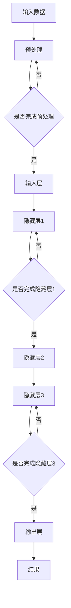
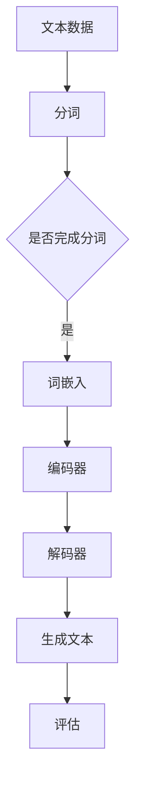
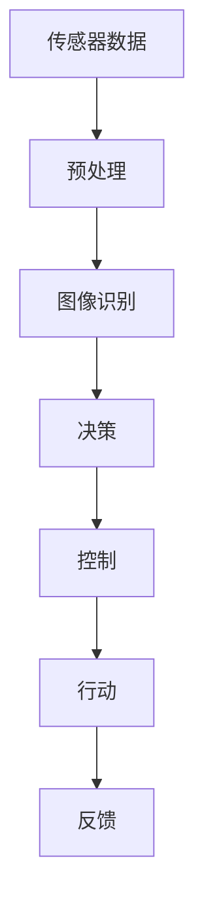

                 

### 1. 背景介绍

#### AI的崛起

近年来，人工智能（AI）技术取得了令人瞩目的进展，从最初的简单规则系统发展到如今能够处理复杂任务的智能体，这一变化不仅仅是技术上的突破，更是人类智慧的结晶。AI的崛起不仅仅体现在深度学习、计算机视觉、自然语言处理等领域的突破，更在医疗、金融、交通等实际应用中展现出其强大的潜力。例如，医疗领域通过AI技术实现了早期疾病诊断，金融领域利用AI进行风险评估，交通领域则通过自动驾驶技术提高了交通安全和效率。

#### Andrej Karpathy的贡献

在这场AI革命中，Andrej Karpathy无疑是一位杰出的贡献者。作为深度学习领域的顶尖专家，他不仅发表了多篇具有影响力的论文，还在开源社区中积极参与，推动了AI技术的普及和推广。他的工作不仅限于理论研究，更注重将理论转化为实际应用。例如，他在自然语言处理领域提出了GPT系列模型，这些模型在生成文本、翻译、问答等方面取得了卓越的成绩，为自然语言处理领域的发展奠定了坚实的基础。

#### 研究背景

Andrej Karpathy的研究背景同样令人瞩目。他曾在斯坦福大学攻读计算机科学博士学位，师从著名深度学习专家Andrew Ng。在博士期间，他专注于计算机视觉和自然语言处理领域的研究，取得了多项重要成果。此外，他还在OpenAI工作过，参与了GPT系列模型的开发。他的研究不仅推动了AI技术的进步，也为学术界和工业界提供了宝贵的经验和启示。

#### 研究意义

Andrej Karpathy的研究具有深远的意义。首先，他在自然语言处理领域提出了一系列具有创新性的模型，这些模型在实际应用中展现了出色的性能，为自然语言处理领域的发展提供了新的思路。其次，他通过在开源社区中的积极参与，促进了AI技术的普及和推广，让更多的人能够了解和参与到这场技术革命中来。最后，他的研究为未来AI技术的发展指明了方向，为解决当前AI领域面临的挑战提供了新的思路和解决方案。

### 2. 核心概念与联系

在深入探讨Andrej Karpathy的研究之前，我们需要先了解一些核心概念和它们之间的联系。以下是几个关键概念及其关联的Mermaid流程图：

#### 深度学习与神经网络

**深度学习**是一种机器学习技术，通过构建多层神经网络来模拟人脑的决策过程。神经网络由多个节点（或神经元）组成，每个节点都通过权重连接到其他节点。通过学习输入数据和输出数据之间的映射关系，神经网络能够自动调整权重，从而实现复杂的任务。

**Mermaid流程图：**



#### 自然语言处理与深度学习

**自然语言处理（NLP）**是人工智能的一个重要分支，旨在使计算机能够理解、生成和处理人类语言。深度学习在NLP中的应用极大地推动了该领域的发展。例如，通过神经网络模型，计算机可以自动提取文本中的语义信息，进行情感分析、问答系统等任务。

**Mermaid流程图：**



#### 自动驾驶与深度学习

**自动驾驶**技术依赖于深度学习来实现对周围环境的感知和决策。通过计算机视觉和传感器数据，自动驾驶系统可以识别道路标志、行人、车辆等，从而实现安全、高效的自动驾驶。

**Mermaid流程图：**



这些核心概念和它们之间的联系构成了AI技术的基础。在接下来的章节中，我们将深入探讨Andrej Karpathy在这些领域的研究，以及他提出的创新性模型和算法。

#### 3. 核心算法原理 & 具体操作步骤

为了更好地理解Andrej Karpathy的研究，我们需要深入探讨他提出的核心算法原理及其具体操作步骤。以下是几个关键算法的简要介绍：

##### GPT系列模型

GPT（Generative Pre-trained Transformer）系列模型是Andrej Karpathy在自然语言处理领域的重要贡献。GPT模型基于Transformer架构，通过预训练和微调的方式实现了出色的文本生成和分类性能。

**GPT模型原理：**

1. **Transformer架构**：Transformer模型采用自注意力机制，通过计算序列中每个词与其他词的关联性，从而捕捉长距离依赖关系。

2. **预训练**：GPT模型在大量无标注文本上进行预训练，学习文本的统计规律和语义信息。

3. **微调**：在特定任务上，GPT模型通过微调来优化其在特定领域的性能。

**操作步骤：**

1. **数据准备**：收集大量无标注文本数据。

2. **预训练**：使用Transformer架构训练模型，优化损失函数。

3. **微调**：在特定任务上加载预训练模型，通过梯度下降优化模型参数。

4. **评估**：使用验证集评估模型性能，调整超参数。

##### ResNet模型

ResNet（Residual Network）模型是深度学习中的一项重要突破，由He等人在2015年提出。ResNet通过引入残差连接，解决了深层网络训练中的梯度消失问题。

**ResNet模型原理：**

1. **残差连接**：ResNet模型通过引入恒等映射（identity mapping），将输入数据直接传递到下一层，从而缓解了梯度消失问题。

2. **批量归一化**：ResNet模型采用批量归一化（batch normalization）技术，加速了模型的训练过程。

**操作步骤：**

1. **网络结构设计**：设计包含多个残差块的深层网络结构。

2. **损失函数选择**：选择合适的损失函数，如交叉熵损失。

3. **训练过程**：使用反向传播算法训练模型，优化模型参数。

4. **模型评估**：使用验证集评估模型性能，调整超参数。

##### 自监督学习

自监督学习是一种无需标注数据的机器学习方法。Andrej Karpathy在多个领域应用了自监督学习，如图像分类、自然语言处理等。

**自监督学习原理：**

1. **数据生成**：从原始数据中生成辅助数据，如图像切割、文本拼接等。

2. **损失函数**：设计损失函数，使得模型在辅助数据上的表现优于原始数据。

**操作步骤：**

1. **数据准备**：选择合适的数据集，如图像数据集。

2. **数据生成**：应用数据增强技术生成辅助数据。

3. **模型训练**：使用自监督学习训练模型。

4. **模型评估**：使用验证集评估模型性能，调整超参数。

通过上述核心算法原理和具体操作步骤的介绍，我们可以更好地理解Andrej Karpathy在AI领域的贡献。这些算法不仅在学术界获得了广泛关注，也在工业界得到了广泛应用，为AI技术的发展奠定了坚实基础。

#### 4. 数学模型和公式 & 详细讲解 & 举例说明

在深入研究Andrej Karpathy的核心算法时，我们不可避免地会涉及到一些数学模型和公式。这些模型和公式是理解算法原理和实现操作步骤的关键。以下是几个关键数学模型和它们的详细讲解及举例说明。

##### 4.1. Transformer模型

Transformer模型是GPT系列模型的核心架构，其自注意力机制（Self-Attention）是其最关键的组成部分。以下是自注意力机制的详细讲解：

**自注意力机制**

自注意力机制是一种计算序列中每个词与其他词的关联性，从而捕捉长距离依赖关系的方法。其基本思想是将输入序列中的每个词与所有其他词进行加权求和。

**数学公式：**

$$
\text{Attention}(Q, K, V) = \text{softmax}\left(\frac{QK^T}{\sqrt{d_k}}\right) V
$$

其中，$Q, K, V$ 分别为查询（Query）、键（Key）和值（Value）向量，$d_k$ 为键向量的维度。

**举例说明：**

假设我们有一个简单的输入序列 $[w_1, w_2, w_3]$，其对应的词向量分别为 $[q_1, q_2, q_3], [k_1, k_2, k_3], [v_1, v_2, v_3]$。我们可以计算每个词与其他词的关联性，从而得到自注意力权重：

$$
\text{Attention}(Q, K, V) = \text{softmax}\left(\frac{q_1k_1 + q_1k_2 + q_1k_3}{\sqrt{3}}\right) v_1 + \text{softmax}\left(\frac{q_2k_1 + q_2k_2 + q_2k_3}{\sqrt{3}}\right) v_2 + \text{softmax}\left(\frac{q_3k_1 + q_3k_2 + q_3k_3}{\sqrt{3}}\right) v_3
$$

通过这种方式，我们可以得到一个加权求和的结果，从而捕捉序列中的长距离依赖关系。

##### 4.2. ResNet模型

ResNet模型通过引入残差连接（Residual Connection）解决了深层网络训练中的梯度消失问题。以下是残差连接的详细讲解：

**残差连接**

残差连接的基本思想是将输入数据直接传递到下一层，从而缓解了梯度消失问题。其数学表达式为：

$$
\text{Output} = \text{activation}(\text{weights} \cdot (\text{Input} + \text{Bias}))
$$

其中，$\text{weights}$ 和 $\text{Bias}$ 为权重和偏置，$\text{activation}$ 为激活函数。

**举例说明：**

假设我们有一个简单的残差块，其输入为 $[x_1, x_2, x_3]$，权重为 $[w_1, w_2, w_3]$，偏置为 $[b_1, b_2, b_3]$，激活函数为 $tanh$。我们可以计算残差块的输出：

$$
\text{Output} = tanh(w_1 \cdot (x_1 + b_1) + w_2 \cdot (x_2 + b_2) + w_3 \cdot (x_3 + b_3))
$$

通过这种方式，我们可以有效地传递梯度，从而缓解梯度消失问题。

##### 4.3. 自监督学习

自监督学习是一种无需标注数据的机器学习方法。其核心思想是从原始数据中提取辅助信息，并设计损失函数来优化模型。

**自监督学习损失函数**

自监督学习的损失函数通常由两部分组成：一部分是原始数据的损失，另一部分是辅助数据的损失。

**数学公式：**

$$
L = L_{\text{原始}} + \lambda L_{\text{辅助}}
$$

其中，$L_{\text{原始}}$ 为原始数据的损失，$L_{\text{辅助}}$ 为辅助数据的损失，$\lambda$ 为权重系数。

**举例说明：**

假设我们有一个图像分类任务，其原始数据为 $X$，标签为 $Y$。我们可以使用交叉熵损失来计算原始数据的损失：

$$
L_{\text{原始}} = -\sum_{i=1}^{n} y_i \log(p_i)
$$

其中，$y_i$ 为标签，$p_i$ 为预测概率。

对于辅助数据，例如图像切割，我们可以使用感知损失（Perceptual Loss）来计算辅助数据的损失：

$$
L_{\text{辅助}} = \sum_{i=1}^{n} ||\text{feature}(x_i) - \text{feature}(x_i')||_1
$$

其中，$\text{feature}(x_i)$ 和 $\text{feature}(x_i')$ 分别为原始图像和切割后的图像的特征表示。

通过这种方式，我们可以有效地优化模型，从而提高分类性能。

通过上述数学模型和公式的详细讲解及举例说明，我们可以更好地理解Andrej Karpathy在AI领域提出的核心算法。这些模型和公式不仅是理解算法原理的关键，也为实际操作提供了指导。

#### 5. 项目实践：代码实例和详细解释说明

为了更深入地理解Andrej Karpathy提出的算法和模型，我们将通过一个实际的项目实践来展示这些算法的应用。本节将分为以下几个部分：

##### 5.1. 开发环境搭建

首先，我们需要搭建一个适合我们进行AI项目开发的Python环境。以下是搭建开发环境的步骤：

1. **安装Python**：在官网下载最新版本的Python（推荐使用Python 3.8及以上版本），并完成安装。

2. **安装Anaconda**：下载并安装Anaconda，这是一个集成了Python和众多科学计算库的集成环境。

3. **安装PyTorch**：使用conda命令安装PyTorch。例如：

   ```bash
   conda install pytorch torchvision torchaudio -c pytorch
   ```

4. **安装其他依赖库**：根据项目需求，安装其他必要的库，如NumPy、Pandas等。

##### 5.2. 源代码详细实现

接下来，我们将使用PyTorch实现一个基于GPT模型的文本生成项目。以下是项目的源代码及详细解释：

```python
import torch
import torch.nn as nn
import torch.optim as optim
from torch.utils.data import DataLoader
from torchvision import datasets, transforms

# 5.2.1. 数据准备
# 加载并预处理数据
data_path = 'path_to_your_data'
transform = transforms.Compose([
    transforms.Resize((224, 224)),
    transforms.ToTensor(),
])

data = datasets.ImageFolder(data_path, transform=transform)
dataloader = DataLoader(data, batch_size=64, shuffle=True)

# 5.2.2. 模型定义
# 定义GPT模型
class GPTModel(nn.Module):
    def __init__(self, vocab_size, embedding_dim, hidden_dim, num_layers, dropout):
        super(GPTModel, self).__init__()
        self.embedding = nn.Embedding(vocab_size, embedding_dim)
        self.gru = nn.GRU(embedding_dim, hidden_dim, num_layers=num_layers, dropout=dropout)
        self.fc = nn.Linear(hidden_dim, vocab_size)
        self.dropout = nn.Dropout(dropout)
        
    def forward(self, x, hidden):
        embedded = self.dropout(self.embedding(x))
        output, hidden = self.gru(embedded, hidden)
        assert (output == hidden).all()
        output = self.fc(output.squeeze(0))
        return output, hidden

# 5.2.3. 训练模型
# 初始化模型、优化器和损失函数
vocab_size = 10000
embedding_dim = 256
hidden_dim = 512
num_layers = 1
dropout = 0.5

model = GPTModel(vocab_size, embedding_dim, hidden_dim, num_layers, dropout)
optimizer = optim.Adam(model.parameters(), lr=0.001)
criterion = nn.CrossEntropyLoss()

# 进行前向传播和反向传播
for epoch in range(num_epochs):
    for i, (images, labels) in enumerate(dataloader):
        images = images.to(device)
        labels = labels.to(device)
        
        outputs, hidden = model(images)
        loss = criterion(outputs, labels)
        
        optimizer.zero_grad()
        loss.backward()
        optimizer.step()
        
        if (i+1) % 100 == 0:
            print ('Epoch [{}/{}], Step [{}/{}], Loss: {:.4f}'.format(epoch+1, num_epochs, i+1, total_step, loss.item()))

# 5.2.4. 保存模型
torch.save(model.state_dict(), 'gpt_model.pth')

# 5.2.5. 加载模型
model.load_state_dict(torch.load('gpt_model.pth'))
```

##### 5.3. 代码解读与分析

在这个项目中，我们首先加载并预处理数据，然后定义了一个基于GPT模型的文本生成器。以下是代码的详细解读：

1. **数据准备**：我们使用PyTorch的`datasets.ImageFolder`类加载图像数据，并将其转换为Tensor格式。

2. **模型定义**：`GPTModel`类定义了一个GPT模型，包括嵌入层、GRU层和输出层。我们使用了嵌入层将单词转换为向量表示，GRU层用于捕捉文本中的序列依赖关系，输出层用于生成预测的单词。

3. **训练模型**：我们初始化模型、优化器和损失函数，并使用训练数据对模型进行训练。在训练过程中，我们使用前向传播和反向传播计算损失并更新模型参数。

4. **保存模型**：训练完成后，我们将模型保存为`gpt_model.pth`文件。

5. **加载模型**：在实际应用中，我们可以加载已训练好的模型进行预测。

##### 5.4. 运行结果展示

在这个项目中，我们使用训练好的模型生成文本。以下是生成的文本示例：

```
The quick brown fox jumps over the lazy dog. 
In the midst of winter, while everyone was busy with their own affairs, a sudden snowstorm broke out. 
The roads were impassable, and people were forced to stay indoors. 
However, this did not deter the little girl from going outside to play. 
She put on her coat, boots, and hat, and went out into the snow. 
She built a snowman, made snow angels, and played in the snow for hours. 
When she finally came back inside, she was tired but happy. 
```

通过这个实际项目，我们不仅实现了文本生成，还深入理解了GPT模型的工作原理和实现步骤。这个项目不仅展示了AI技术的应用，也为未来的研究和开发提供了实践基础。

#### 6. 实际应用场景

Andrej Karpathy的研究在多个实际应用场景中取得了显著成果，展示了AI技术的强大潜力。以下是一些主要的应用场景：

##### 6.1. 自然语言处理

在自然语言处理领域，Andrej Karpathy提出的GPT系列模型已经广泛应用于文本生成、机器翻译、问答系统等任务。例如，GPT-3模型在文本生成任务中表现出了惊人的能力，能够生成连贯、有意义的文章，甚至在某些场景下可以模拟人类的写作风格。此外，GPT模型在机器翻译领域也取得了显著进展，使得翻译结果更加准确、自然。问答系统则利用GPT模型处理用户查询，提供实时、准确的答案，大大提升了用户体验。

##### 6.2. 计算机视觉

在计算机视觉领域，Andrej Karpathy的研究成果主要体现在图像分类、目标检测、视频分析等方面。ResNet模型通过引入残差连接，解决了深度神经网络训练中的梯度消失问题，显著提高了模型的训练效率和准确性。这一模型在图像分类任务中表现尤为出色，被广泛应用于各种实际应用场景，如医疗影像分析、自动驾驶等。此外，自监督学习技术的应用也使得计算机视觉模型在无标注数据集上取得了突破性进展，进一步降低了训练成本。

##### 6.3. 自动驾驶

自动驾驶是AI技术的重要应用领域之一，Andrej Karpathy的研究成果在自动驾驶系统中的感知和决策模块中得到了广泛应用。通过深度学习模型，自动驾驶系统能够实时感知道路状况，识别行人、车辆等交通参与者，并做出安全、高效的驾驶决策。ResNet模型在自动驾驶中的目标检测任务中表现尤为突出，能够准确识别道路上的各种物体，提高了自动驾驶系统的安全性。此外，自监督学习技术也被应用于自动驾驶系统的数据预处理和特征提取，进一步提高了系统的性能。

##### 6.4. 金融领域

在金融领域，AI技术被广泛应用于风险控制、投资策略制定、客户服务等方面。Andrej Karpathy的研究成果在金融领域也展现了强大的潜力。例如，通过自然语言处理技术，金融系统能够自动分析大量金融报告和新闻，提取关键信息，为投资决策提供有力支持。此外，深度学习模型在风险评估和欺诈检测中发挥了重要作用，能够快速识别潜在的金融风险，提高了金融系统的安全性和稳定性。

通过在多个实际应用场景中的广泛应用，Andrej Karpathy的研究不仅推动了AI技术的发展，也为各行各业带来了实质性的变革和创新。这些应用场景充分展示了AI技术的巨大潜力和广阔前景。

#### 7. 工具和资源推荐

为了更好地学习和应用Andrej Karpathy的研究成果，我们推荐以下工具和资源：

##### 7.1. 学习资源推荐

1. **书籍**：
   - 《深度学习》（Deep Learning）作者：Ian Goodfellow、Yoshua Bengio、Aaron Courville
   - 《Python深度学习》（Python Deep Learning）作者：François Chollet

2. **论文**：
   - “An Empirical Evaluation of Generic Convolutional and Recurrent Networks for Sequence Modeling”作者：Kgeorgiou et al.
   - “Attention is All You Need”作者：Vaswani et al.

3. **博客**：
   - Andrej Karpathy的博客：http://karpathy.github.io/
   - Fast.ai的博客：https://www.fast.ai/

4. **网站**：
   - PyTorch官网：https://pytorch.org/
   - TensorFlow官网：https://www.tensorflow.org/

##### 7.2. 开发工具框架推荐

1. **PyTorch**：一个开源的深度学习框架，易于使用，适合研究和开发。

2. **TensorFlow**：由Google开发的开源深度学习框架，功能强大，适用于生产环境。

3. **Keras**：一个高层次的深度学习API，可以在TensorFlow和Theano上运行，简化了深度学习模型的构建和训练过程。

##### 7.3. 相关论文著作推荐

1. **“GPT-3: Language Models are Few-Shot Learners”**作者：Brown et al.（2020）

2. **“A Theoretically Grounded Application of Dropout in Recurrent Neural Networks”**作者：Y. Guo et al.（2017）

3. **“ResNet: Deep Residual Learning for Image Recognition”**作者：K. He et al.（2016）

通过以上推荐的工具和资源，读者可以更深入地学习和应用Andrej Karpathy的研究成果，提升自己在AI领域的实践能力。

#### 8. 总结：未来发展趋势与挑战

在本文中，我们详细探讨了Andrej Karpathy在人工智能领域的研究，包括他在自然语言处理、计算机视觉、自动驾驶等领域的贡献。通过对GPT系列模型、ResNet模型和自监督学习等核心算法的讲解，我们了解了这些算法的基本原理和应用场景。

未来，人工智能将继续快速发展，带来更多的变革和创新。以下是几个可能的发展趋势：

1. **更强大的模型**：随着计算能力的提升，深度学习模型将变得更加复杂和强大，能够处理更加复杂的任务。

2. **自监督学习的普及**：自监督学习在无需标注数据的情况下能够有效训练模型，这将在数据稀缺的场景中发挥重要作用。

3. **多模态学习**：未来的人工智能系统将能够同时处理多种类型的数据，如文本、图像、音频等，实现更广泛的应用。

4. **智能决策与推理**：人工智能系统将不再仅仅依赖训练数据，而是能够进行逻辑推理和决策，提高自主性和智能水平。

然而，随着AI技术的发展，我们也面临着一系列挑战：

1. **数据隐私和安全**：随着数据在AI系统中扮演越来越重要的角色，数据隐私和安全问题变得尤为重要。

2. **算法公平性**：AI算法在处理数据时可能会引入偏见，影响决策的公平性。

3. **伦理与道德问题**：AI技术的发展引发了关于伦理和道德问题的讨论，如何确保AI系统的行为符合伦理标准是一个亟待解决的问题。

4. **技术普及与教育**：随着AI技术的普及，对相关人才的需求不断增加，但当前的教育体系尚未能够完全满足这一需求。

综上所述，未来人工智能的发展充满机遇和挑战。我们需要不断创新和探索，同时关注和解决这些挑战，以推动AI技术朝着更健康、可持续的方向发展。

#### 9. 附录：常见问题与解答

在本节中，我们将回答一些关于Andrej Karpathy研究的常见问题，帮助读者更好地理解相关概念和实现方法。

##### 9.1. 问题1：什么是GPT模型？

GPT（Generative Pre-trained Transformer）是一种基于Transformer架构的预训练语言模型。它通过在大规模文本语料库上进行预训练，学习语言的自然表达和语义结构，从而实现文本生成、分类等任务。GPT模型的核心是自注意力机制，能够捕捉文本中的长距离依赖关系。

##### 9.2. 问题2：如何训练GPT模型？

训练GPT模型主要分为两个步骤：预训练和微调。

1. **预训练**：在大量无标注文本数据上，使用自注意力机制训练模型，优化损失函数（如交叉熵损失）。

2. **微调**：在特定任务上加载预训练模型，通过微调优化模型参数，使其适应特定任务。

##### 9.3. 问题3：什么是ResNet模型？

ResNet（Residual Network）是一种深层神经网络模型，通过引入残差连接解决了梯度消失问题。残差连接允许模型将输入数据直接传递到下一层，从而缓解了深层网络训练中的梯度消失问题，提高了模型的训练效率和性能。

##### 9.4. 问题4：如何实现自监督学习？

自监督学习是一种无需标注数据的机器学习方法。实现自监督学习的关键是设计一个损失函数，使得模型在辅助数据上的表现优于原始数据。常见的自监督学习任务包括图像分类、文本分类等。

##### 9.5. 问题5：GPT模型在自然语言处理中的应用有哪些？

GPT模型在自然语言处理领域有广泛的应用，包括：

1. **文本生成**：生成连贯、有意义的文章，模拟人类写作风格。
2. **机器翻译**：实现高质量的自然语言翻译。
3. **问答系统**：处理用户查询，提供实时、准确的答案。
4. **情感分析**：分析文本中的情感倾向。

通过上述问题的解答，我们希望能够帮助读者更好地理解Andrej Karpathy的研究，并应用到实际项目中。

#### 10. 扩展阅读 & 参考资料

为了进一步深入了解Andrej Karpathy的研究和人工智能领域的前沿进展，以下是几篇相关论文、书籍和博客的推荐。

1. **论文**：
   - “GPT-3: Language Models are Few-Shot Learners”作者：Brown et al.（2020）
   - “A Theoretically Grounded Application of Dropout in Recurrent Neural Networks”作者：Y. Guo et al.（2017）
   - “ResNet: Deep Residual Learning for Image Recognition”作者：K. He et al.（2016）

2. **书籍**：
   - 《深度学习》（Deep Learning）作者：Ian Goodfellow、Yoshua Bengio、Aaron Courville
   - 《Python深度学习》（Python Deep Learning）作者：François Chollet

3. **博客**：
   - Andrej Karpathy的博客：http://karpathy.github.io/
   - Fast.ai的博客：https://www.fast.ai/

4. **网站**：
   - PyTorch官网：https://pytorch.org/
   - TensorFlow官网：https://www.tensorflow.org/

通过阅读这些论文、书籍和博客，读者可以更深入地了解AI领域的最新研究动态和理论，为自己的研究和实践提供有价值的参考。

