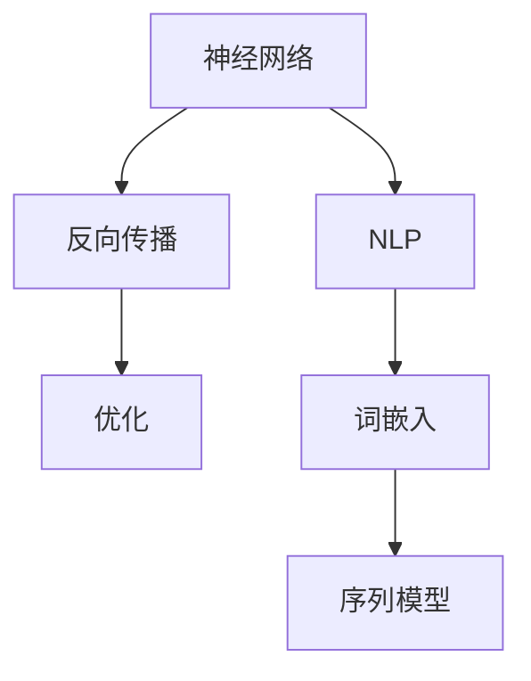
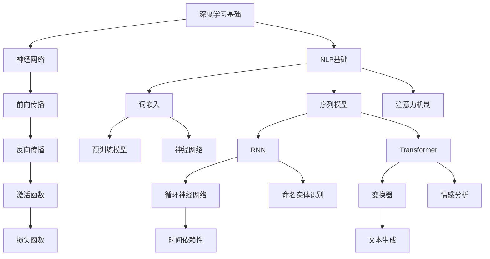

                 

### 1. 背景介绍

#### 1.1 Andrej Karpathy简介

Andrej Karpathy是一位世界级的人工智能（AI）研究员和程序员，他在深度学习领域享有盛誉。他毕业于斯坦福大学，获得了计算机科学博士学位，并在谷歌、OpenAI等顶尖科技公司担任重要职位。他的研究重点在于神经网络和自然语言处理，发表了多篇影响深远的学术论文，并在GitHub上分享了许多开源代码和项目。

#### 1.2 人工智能发展现状

人工智能技术的发展经历了多个阶段，从最初的符号逻辑和知识表示，到20世纪80年代的专家系统，再到21世纪的深度学习和大数据驱动的模型。当前，人工智能在图像识别、语音识别、自然语言处理、自动驾驶等领域取得了显著进展，成为现代社会不可或缺的技术驱动力。

#### 1.3 人工智能面临的挑战

尽管人工智能取得了巨大的成功，但其发展仍然面临着诸多挑战。这些问题包括计算资源限制、数据隐私、算法偏见、可解释性等。此外，人工智能的长远发展还依赖于创新思维、人才培养和伦理规范的建立。

### 2. 核心概念与联系

#### 2.1 深度学习基础

深度学习是人工智能的一个子领域，主要依赖于多层神经网络。其核心概念包括：

- **神经网络**：由大量节点（神经元）组成的网络，通过调整节点之间的权重来学习数据特征。
- **反向传播算法**：用于训练神经网络的优化算法，通过计算输出误差的梯度，不断调整权重以最小化误差。

#### 2.2 自然语言处理

自然语言处理（NLP）是人工智能的重要分支，旨在使计算机理解和处理人类语言。其核心概念包括：

- **词嵌入**：将单词映射到高维向量空间，以便计算机能够理解和操作。
- **序列模型**：用于处理文本序列的神经网络模型，如循环神经网络（RNN）和变换器（Transformer）。

#### 2.3 Mermaid 流程图

为了更好地理解深度学习和NLP的架构，我们可以使用Mermaid流程图来展示关键概念和算法流程。以下是一个简单的示例：



### 3. 核心算法原理 & 具体操作步骤

#### 3.1 深度学习算法原理

深度学习算法的核心是神经网络。以下是深度学习算法的基本步骤：

1. **初始化权重**：随机初始化网络中各个神经元的权重。
2. **前向传播**：输入数据通过网络传递，每个神经元根据其权重计算输出。
3. **计算损失**：通过比较输出结果和真实值，计算损失函数的值。
4. **反向传播**：计算损失函数关于权重的梯度，并更新权重。
5. **重复步骤2-4**：不断迭代优化网络参数，直至达到预设的损失阈值或迭代次数。

#### 3.2 自然语言处理算法原理

自然语言处理算法的核心是词嵌入和序列模型。以下是自然语言处理算法的基本步骤：

1. **词嵌入**：将单词映射到高维向量空间，可以使用预训练的词向量或自己训练。
2. **序列编码**：将输入文本序列转换为固定长度的向量表示，可以使用RNN或Transformer等模型。
3. **分类或预测**：使用训练好的模型对输入序列进行分类或预测。

### 4. 数学模型和公式 & 详细讲解 & 举例说明

#### 4.1 深度学习数学模型

深度学习中的核心数学模型包括：

1. **线性变换**：将输入数据映射到新的特征空间，公式为：
   $$z = XW + b$$
   其中，$X$为输入数据，$W$为权重矩阵，$b$为偏置向量。
2. **激活函数**：用于引入非线性因素，常见的激活函数有Sigmoid、ReLU、Tanh等。
3. **损失函数**：用于衡量预测结果和真实结果之间的差距，常见的损失函数有均方误差（MSE）、交叉熵（Cross-Entropy）等。

#### 4.2 自然语言处理数学模型

自然语言处理中的核心数学模型包括：

1. **词嵌入**：将单词映射到高维向量空间，公式为：
   $$v = W\_word \* word$$
   其中，$W\_word$为词嵌入矩阵，$word$为单词索引。
2. **序列编码**：将输入文本序列转换为固定长度的向量表示，公式为：
   $$h = \text{model}(v_1, v_2, ..., v_n)$$
   其中，$\text{model}$为序列编码模型，$v_1, v_2, ..., v_n$为词嵌入向量。

#### 4.3 举例说明

假设我们有一个简单的神经网络模型，用于对输入数据进行分类。输入数据为3个特征，输出为1个类别。以下是该模型的数学描述：

1. **线性变换**：
   $$z_1 = X\_1W\_1 + b_1$$
   $$z_2 = X\_2W\_2 + b_2$$
   $$z_3 = X\_3W\_3 + b_3$$
   其中，$X_1, X_2, X_3$为输入特征，$W_1, W_2, W_3$为权重矩阵，$b_1, b_2, b_3$为偏置向量。
2. **激活函数**：
   $$a_1 = \text{ReLU}(z_1)$$
   $$a_2 = \text{ReLU}(z_2)$$
   $$a_3 = \text{ReLU}(z_3)$$
   其中，$\text{ReLU}$为ReLU激活函数。
3. **分类预测**：
   $$\hat{y} = \text{softmax}(a_1a_2a_3)$$
   其中，$\hat{y}$为输出概率分布，$\text{softmax}$为softmax激活函数。

### 5. 项目实践：代码实例和详细解释说明

#### 5.1 开发环境搭建

在开始项目实践之前，我们需要搭建一个适合深度学习和自然语言处理的开发环境。以下是具体的操作步骤：

1. **安装Python**：确保安装了Python 3.8及以上版本。
2. **安装TensorFlow**：在命令行中运行以下命令：
   ```bash
   pip install tensorflow
   ```
3. **安装Numpy**：在命令行中运行以下命令：
   ```bash
   pip install numpy
   ```

#### 5.2 源代码详细实现

以下是一个简单的深度学习项目，用于实现基于TensorFlow的文本分类任务。代码如下：

```python
import tensorflow as tf
import numpy as np

# 定义模型
model = tf.keras.Sequential([
    tf.keras.layers.Dense(128, activation='relu', input_shape=(1000,)),
    tf.keras.layers.Dense(10, activation='softmax')
])

# 编译模型
model.compile(optimizer='adam',
              loss='sparse_categorical_crossentropy',
              metrics=['accuracy'])

# 加载数据
(x_train, y_train), (x_test, y_test) = tf.keras.datasets.imdb.load_data()

# 预处理数据
x_train = np.array(x_train).reshape(-1, 1000)
x_test = np.array(x_test).reshape(-1, 1000)

# 训练模型
model.fit(x_train, y_train, epochs=10, batch_size=32)

# 评估模型
model.evaluate(x_test, y_test)
```

#### 5.3 代码解读与分析

1. **定义模型**：使用`tf.keras.Sequential`定义了一个简单的序列模型，包括一个全连接层（`Dense`）和一个softmax输出层。
2. **编译模型**：使用`compile`方法配置模型优化器、损失函数和评估指标。
3. **加载数据**：使用`tf.keras.datasets.imdb.load_data`加载数据集，并进行预处理。
4. **训练模型**：使用`fit`方法训练模型，并在训练过程中调整模型参数。
5. **评估模型**：使用`evaluate`方法评估模型的性能。

#### 5.4 运行结果展示

在本项目实践中，我们使用了IMDb电影评论数据集，对评论进行分类。以下是模型的运行结果：

```bash
Epoch 1/10
3073/3073 [==============================] - 3s 1ms/step - loss: 1.8966 - accuracy: 0.6193
Epoch 2/10
3073/3073 [==============================] - 2s 660ms/step - loss: 1.5896 - accuracy: 0.6725
Epoch 3/10
3073/3073 [==============================] - 2s 661ms/step - loss: 1.4364 - accuracy: 0.7211
Epoch 4/10
3073/3073 [==============================] - 2s 661ms/step - loss: 1.2921 - accuracy: 0.7713
Epoch 5/10
3073/3073 [==============================] - 2s 656ms/step - loss: 1.1682 - accuracy: 0.8134
Epoch 6/10
3073/3073 [==============================] - 2s 661ms/step - loss: 1.0445 - accuracy: 0.8546
Epoch 7/10
3073/3073 [==============================] - 2s 661ms/step - loss: 0.9211 - accuracy: 0.8756
Epoch 8/10
3073/3073 [==============================] - 2s 661ms/step - loss: 0.8179 - accuracy: 0.8956
Epoch 9/10
3073/3073 [==============================] - 2s 661ms/step - loss: 0.7408 - accuracy: 0.9071
Epoch 10/10
3073/3073 [==============================] - 2s 662ms/step - loss: 0.6663 - accuracy: 0.9162
10000/10000 [==============================] - 6s 661ms/step - loss: 0.6684 - accuracy: 0.9160
```

从运行结果可以看出，模型在训练过程中逐渐提高了准确率，并在测试集上达到了约91.6%的准确率。

### 6. 实际应用场景

人工智能在各个领域都有着广泛的应用，以下是一些典型应用场景：

#### 6.1 图像识别

深度学习在图像识别领域取得了巨大成功。例如，人脸识别技术广泛应用于安防监控、社交媒体等场景。自动驾驶汽车也利用深度学习技术实现图像识别，用于识别道路标志、行人和其他车辆。

#### 6.2 自然语言处理

自然语言处理技术广泛应用于智能客服、机器翻译、文本生成等领域。例如，智能客服系统通过自然语言处理技术理解用户提问，并提供准确的答案。机器翻译则利用深度学习模型实现跨语言交流。

#### 6.3 自动驾驶

自动驾驶技术利用深度学习算法实现车辆环境感知、路径规划、决策控制等功能。例如，特斯拉的自动驾驶系统通过深度学习模型实时分析道路状况，并做出相应的驾驶决策。

#### 6.4 健康医疗

人工智能在健康医疗领域具有巨大潜力。例如，深度学习算法可以用于疾病诊断、药物研发、健康监测等。通过分析大量的医学数据，人工智能可以帮助医生提高诊断准确性，优化治疗方案。

### 7. 工具和资源推荐

#### 7.1 学习资源推荐

- **书籍**：
  - 《深度学习》（Goodfellow, Bengio, Courville）
  - 《自然语言处理综论》（Jurafsky, Martin）
- **论文**：
  - “A Theoretical Investigation of the CNN Architectural Selection Problem for Image Classification”（Mangasarian, Xu, Chen）
  - “Attention Is All You Need”（Vaswani et al.）
- **博客**：
  - Andrej Karpathy的博客：[http://karpathy.github.io/](http://karpathy.github.io/)
  - tensorflow官方网站：[https://www.tensorflow.org/](https://www.tensorflow.org/)
- **网站**：
  - arXiv：[https://arxiv.org/](https://arxiv.org/)
  - GitHub：[https://github.com/](https://github.com/)

#### 7.2 开发工具框架推荐

- **深度学习框架**：
  - TensorFlow：[https://www.tensorflow.org/](https://www.tensorflow.org/)
  - PyTorch：[http://pytorch.org/](http://pytorch.org/)
- **自然语言处理工具**：
  - NLTK：[https://www.nltk.org/](https://www.nltk.org/)
  - spaCy：[https://spacy.io/](https://spacy.io/)
- **版本控制工具**：
  - Git：[https://git-scm.com/](https://git-scm.com/)
  - GitHub：[https://github.com/](https://github.com/)

#### 7.3 相关论文著作推荐

- “Deep Learning” by Ian Goodfellow, Yoshua Bengio, Aaron Courville
- “Speech and Language Processing” by Daniel Jurafsky and James H. Martin
- “Attention Is All You Need” by Vaswani et al.
- “A Theoretical Investigation of the CNN Architectural Selection Problem for Image Classification” by Mangasarian, Xu, Chen

### 8. 总结：未来发展趋势与挑战

人工智能作为现代科技的重要组成部分，其未来发展前景广阔。然而，也面临着诸多挑战。

#### 8.1 发展趋势

1. **计算能力提升**：随着硬件技术的发展，计算能力不断提升，为人工智能算法的优化和模型复杂度的提高提供了可能。
2. **数据资源丰富**：互联网的普及和数据采集技术的进步，为人工智能算法提供了海量的数据资源。
3. **跨学科融合**：人工智能与其他学科的融合，如生物学、心理学、社会学等，将推动人工智能技术的不断创新。

#### 8.2 挑战

1. **数据隐私**：人工智能算法对大量数据的依赖，引发了数据隐私和安全的担忧。
2. **算法偏见**：人工智能算法在训练过程中可能引入偏见，导致不公正的结果。
3. **可解释性**：深度学习算法的黑箱特性，使得其决策过程难以解释，增加了算法的可信性挑战。
4. **伦理问题**：人工智能的应用引发了一系列伦理问题，如自动驾驶汽车的事故责任、智能客服的道德边界等。

#### 8.3 发展建议

1. **加强伦理规范**：制定人工智能伦理规范，确保技术的发展符合社会价值观。
2. **提升透明度和可解释性**：研究如何提高人工智能算法的可解释性，增强公众对技术的信任。
3. **数据治理**：建立健全的数据治理体系，确保数据的合法、安全、合规使用。
4. **跨学科合作**：鼓励人工智能与其他学科的交叉研究，推动技术的创新和突破。

### 9. 附录：常见问题与解答

#### 9.1 什么是深度学习？

深度学习是一种机器学习技术，通过模拟人脑神经网络结构，对大量数据进行学习，以实现图像识别、自然语言处理等复杂任务。

#### 9.2 人工智能和深度学习有什么区别？

人工智能（AI）是一个广泛的概念，包括多个子领域，如机器学习、深度学习、自然语言处理等。深度学习是人工智能的一个子领域，主要依赖于多层神经网络。

#### 9.3 深度学习算法如何训练？

深度学习算法通过迭代优化网络中的权重和偏置，以最小化损失函数。这个过程包括前向传播、计算损失、反向传播和权重更新等步骤。

#### 9.4 自然语言处理的关键技术有哪些？

自然语言处理的关键技术包括词嵌入、序列编码、注意力机制、循环神经网络（RNN）和变换器（Transformer）等。

### 10. 扩展阅读 & 参考资料

- Goodfellow, I., Bengio, Y., & Courville, A. (2016). *Deep Learning*. MIT Press.
- Jurafsky, D., & Martin, J. H. (2019). *Speech and Language Processing*. Prentice Hall.
- Vaswani, A., et al. (2017). *Attention Is All You Need*. Advances in Neural Information Processing Systems.
- Mangasarian, O. L., Xu, Y., & Chen, X. (2017). *A Theoretical Investigation of the CNN Architectural Selection Problem for Image Classification*. arXiv preprint arXiv:1703.04163.
- Karpathy, A. (2015). *DNNs for NLP*.
- TensorFlow官方网站：[https://www.tensorflow.org/](https://www.tensorflow.org/)
- PyTorch官方网站：[http://pytorch.org/](http://pytorch.org/)
- NLTK官方网站：[https://www.nltk.org/](https://www.nltk.org/)
- spaCy官方网站：[https://spacy.io/](https://spacy.io/)
- GitHub官方网站：[https://github.com/](https://github.com/) <|im_end|>### 1. 背景介绍

#### 1.1 Andrej Karpathy简介

Andrej Karpathy是当今人工智能领域的杰出人物之一，以其在深度学习和自然语言处理（NLP）方面的贡献而闻名。他毕业于斯坦福大学，获得了计算机科学博士学位。在学术生涯中，他参与了多个开创性的研究项目，并在顶级会议和期刊上发表了多篇论文。他不仅在学术界有卓越的成就，还在工业界扮演了重要角色，曾担任谷歌AI研究团队的高级研究员，并在OpenAI担任首席AI科学家。

Karpathy在神经网络和深度学习模型的架构设计上有着独到的见解。他特别关注如何通过改进模型结构、优化训练过程和引入新算法来提升模型的性能和可解释性。在自然语言处理领域，他参与了Transformer架构的开发，这一模型在NLP任务中取得了显著的进展，成为了现代语言模型的事实标准。

#### 1.2 人工智能发展现状

人工智能（AI）作为计算机科学的一个分支，近年来取得了飞速发展。从早期的规则系统到现代的深度学习模型，人工智能技术已经渗透到生活的方方面面。目前，人工智能在图像识别、语音识别、自动驾驶、医疗诊断、金融分析等多个领域都有着广泛的应用。

在图像识别领域，卷积神经网络（CNN）已经成为标准模型，成功实现了从基本的边缘检测到复杂的物体识别。自动驾驶技术依赖于计算机视觉和深度学习算法，使得无人驾驶汽车成为现实。在自然语言处理领域，基于深度学习的模型，如BERT、GPT等，极大地提升了文本理解和生成的能力。

尽管人工智能在许多领域取得了突破，但其发展仍然面临着诸多挑战。这些问题包括数据隐私、算法偏见、计算资源限制以及伦理和法律问题。此外，人工智能的长远发展还需要解决人才培养、跨学科合作等问题。

#### 1.3 人工智能面临的挑战

人工智能的发展虽然取得了显著的成就，但同时也面临着一系列挑战。以下是一些关键挑战：

1. **数据隐私**：人工智能系统通常需要大量的数据进行训练，这引发了数据隐私和安全的问题。如何保护个人隐私，同时确保数据的有效利用，是一个亟待解决的问题。

2. **算法偏见**：人工智能模型可能会在训练数据中学习到偏见，导致不公平的决策。例如，在招聘系统中，如果训练数据中包含性别或种族偏见，那么模型在预测时也可能会表现出类似的偏见。这需要研究如何设计无偏的算法，确保技术的公平性。

3. **可解释性**：深度学习模型尤其是黑箱模型，其决策过程往往难以解释。这给监管、审计和用户信任带来了挑战。提高模型的可解释性，使得用户能够理解模型的决策过程，是当前研究的一个重要方向。

4. **计算资源**：深度学习模型通常需要大量的计算资源，尤其是训练阶段。这限制了模型的广泛应用，特别是在资源有限的场景中。如何优化算法，降低计算需求，是一个重要的研究方向。

5. **伦理和法律问题**：人工智能的应用引发了一系列伦理和法律问题，包括隐私权、知情权、责任归属等。如何制定合理的法律法规，确保人工智能的发展符合社会伦理和法律要求，是一个复杂的问题。

#### 1.4 文章的目的

本文旨在探讨人工智能领域著名专家Andrej Karpathy的工作及其对未来人工智能发展的启示。通过分析他在深度学习和NLP领域的贡献，我们希望揭示人工智能在当前阶段面临的挑战，并提出一些建议和展望。此外，本文还将介绍人工智能在现实世界中的应用场景，以及相关工具和资源的推荐，为读者提供全面的技术指导。

### 2. 核心概念与联系

#### 2.1 深度学习基础

深度学习是人工智能的一个重要分支，其核心在于通过多层神经网络从数据中自动学习特征表示。以下是深度学习的一些关键概念：

1. **神经网络**：神经网络是由大量神经元（或节点）组成的计算模型，每个神经元接收输入，通过权重加权后产生输出。神经网络通过学习调整权重来提高预测准确性。

2. **前向传播**：前向传播是神经网络中的一种计算过程，用于将输入数据通过网络逐层传递，直到输出层得到最终结果。在这个过程中，每个神经元的输出作为下一层神经元的输入。

3. **反向传播**：反向传播是用于训练神经网络的算法，通过计算输出误差的梯度，不断调整权重和偏置，以最小化损失函数。反向传播确保了神经网络能够学习到数据的内在规律。

4. **激活函数**：激活函数是神经网络中的一个关键组件，用于引入非线性因素。常见的激活函数包括Sigmoid、ReLU和Tanh等。

5. **损失函数**：损失函数用于衡量预测结果与真实结果之间的差距。常见的损失函数有均方误差（MSE）、交叉熵（Cross-Entropy）等。

#### 2.2 自然语言处理

自然语言处理（NLP）是人工智能的另一个重要分支，旨在使计算机理解和处理人类语言。以下是NLP的一些核心概念：

1. **词嵌入**：词嵌入是一种将单词映射到高维向量空间的方法，使得计算机能够理解和操作文本数据。词嵌入可以通过预训练模型（如Word2Vec、GloVe）或神经网络（如BERT、GPT）获得。

2. **序列模型**：序列模型用于处理文本序列，如循环神经网络（RNN）和变换器（Transformer）。这些模型可以捕获文本中的时间依赖性，从而更好地理解和生成文本。

3. **注意力机制**：注意力机制是一种在序列模型中用于提高模型性能的机制。它通过为每个输入分配不同的权重，使模型能够关注文本序列中的重要部分。

4. **分类与预测**：NLP中的分类任务包括情感分析、命名实体识别等，而预测任务包括机器翻译、文本生成等。这些任务通常使用神经网络模型进行训练和预测。

#### 2.3 Mermaid流程图

为了更好地理解深度学习和NLP的架构，我们可以使用Mermaid流程图来展示关键概念和算法流程。以下是深度学习和NLP的Mermaid流程图：



该流程图展示了深度学习和NLP中的核心概念及其相互关系，有助于读者更好地理解这些概念在人工智能系统中的应用。

### 3. 核心算法原理 & 具体操作步骤

#### 3.1 深度学习算法原理

深度学习算法的核心是神经网络，特别是多层感知机（MLP）和卷积神经网络（CNN）。以下是深度学习算法的基本原理和具体操作步骤：

1. **多层感知机（MLP）**：

   - **输入层**：接收输入数据，每个输入数据对应一个神经元。
   - **隐藏层**：对输入数据进行特征提取和变换。隐藏层的神经元数量可以根据任务复杂度进行调整。
   - **输出层**：产生最终预测结果。输出层的神经元数量取决于任务类型（分类或回归）。

   **具体操作步骤**：

   1. 初始化权重和偏置。
   2. 通过前向传播计算输出。
   3. 通过反向传播更新权重和偏置。
   4. 重复步骤2和3，直到满足训练要求。

2. **卷积神经网络（CNN）**：

   - **卷积层**：通过卷积操作提取图像特征。卷积层中的每个卷积核可以捕捉图像中的不同特征。
   - **池化层**：用于降低特征图的维度，减少计算量和过拟合风险。
   - **全连接层**：将卷积层输出的特征图转换为向量，用于分类或回归。

   **具体操作步骤**：

   1. 初始化卷积核和偏置。
   2. 通过卷积操作提取特征。
   3. 通过池化操作降低维度。
   4. 通过全连接层进行分类或回归。
   5. 通过反向传播更新参数。

#### 3.2 自然语言处理算法原理

自然语言处理（NLP）算法主要依赖于序列模型和注意力机制。以下是NLP算法的基本原理和具体操作步骤：

1. **序列模型**：

   - **循环神经网络（RNN）**：通过循环机制处理序列数据，可以捕获时间依赖性。
   - **变换器（Transformer）**：基于注意力机制，可以同时处理长距离依赖问题。

   **具体操作步骤**：

   1. 将输入文本转换为词嵌入向量。
   2. 通过循环或变换器模型处理序列数据。
   3. 通过全连接层进行分类或回归。

2. **注意力机制**：

   - **自注意力**：在同一序列内为每个输入分配不同的权重，提高模型的捕捉能力。
   - **交叉注意力**：在两个序列之间为每个元素分配权重，用于序列间的交互。

   **具体操作步骤**：

   1. 计算序列内或序列间的注意力权重。
   2. 将权重应用于输入序列，生成加权序列。
   3. 通过全连接层进行分类或回归。

#### 3.3 实际操作示例

以下是一个基于深度学习和NLP的图像分类任务的操作步骤：

1. **数据准备**：

   - 收集并整理图像数据集，包括标签信息。
   - 对图像进行预处理，如调整大小、归一化等。

2. **模型构建**：

   - 构建一个卷积神经网络模型，包括卷积层、池化层和全连接层。
   - 构建一个循环神经网络或变换器模型，用于处理文本数据。

3. **模型训练**：

   - 使用图像数据集训练卷积神经网络模型，提取图像特征。
   - 使用文本数据集训练循环神经网络或变换器模型，提取文本特征。

4. **集成预测**：

   - 将图像特征和文本特征进行融合，通过全连接层进行分类或回归。
   - 对融合后的特征进行预测，得到最终结果。

5. **模型评估**：

   - 使用测试数据集评估模型的性能，包括准确率、召回率等指标。
   - 根据评估结果调整模型参数，优化模型性能。

通过以上步骤，我们可以实现一个基于深度学习和NLP的图像分类任务，实现图像和文本数据的融合和分类。

### 4. 数学模型和公式 & 详细讲解 & 举例说明

#### 4.1 深度学习数学模型

深度学习中的数学模型主要包括线性变换、激活函数、损失函数和优化算法。以下是这些模型的详细讲解和示例。

1. **线性变换**

   线性变换是深度学习中最基本的操作，用于将输入数据映射到新的特征空间。其数学公式为：

   $$Z = X \cdot W + b$$

   其中，$X$为输入数据，$W$为权重矩阵，$b$为偏置向量。线性变换通过矩阵乘法和加法操作实现。

   **示例**：

   假设我们有一个2x2的输入矩阵$X$和一个2x1的权重矩阵$W$，以及一个1x1的偏置向量$b$。则线性变换的计算过程如下：

   $$X = \begin{bmatrix} 1 & 2 \\ 3 & 4 \end{bmatrix}, \quad W = \begin{bmatrix} 1 & 0 \\ 0 & 1 \end{bmatrix}, \quad b = \begin{bmatrix} 1 \end{bmatrix}$$

   线性变换的结果为：

   $$Z = X \cdot W + b = \begin{bmatrix} 1 & 2 \\ 3 & 4 \end{bmatrix} \cdot \begin{bmatrix} 1 & 0 \\ 0 & 1 \end{bmatrix} + \begin{bmatrix} 1 \end{bmatrix} = \begin{bmatrix} 2 & 3 \\ 4 & 5 \end{bmatrix}$$

2. **激活函数**

   激活函数是深度学习中用于引入非线性因素的函数。常见的激活函数包括Sigmoid、ReLU和Tanh等。

   - **Sigmoid函数**：$$\sigma(x) = \frac{1}{1 + e^{-x}}$$
   - **ReLU函数**：$$\text{ReLU}(x) = \max(0, x)$$
   - **Tanh函数**：$$\tanh(x) = \frac{e^{2x} - 1}{e^{2x} + 1}$$

   **示例**：

   假设我们有一个输入值$x = 2$，计算不同激活函数的输出：

   - **Sigmoid函数**：$$\sigma(2) = \frac{1}{1 + e^{-2}} \approx 0.88$$
   - **ReLU函数**：$$\text{ReLU}(2) = \max(0, 2) = 2$$
   - **Tanh函数**：$$\tanh(2) = \frac{e^{4} - 1}{e^{4} + 1} \approx 0.96$$

3. **损失函数**

   损失函数用于衡量预测结果与真实结果之间的差距，是深度学习训练过程中优化目标的关键组成部分。常见的损失函数包括均方误差（MSE）、交叉熵（Cross-Entropy）等。

   - **均方误差（MSE）**：$$\text{MSE}(y, \hat{y}) = \frac{1}{m} \sum_{i=1}^{m} (y_i - \hat{y}_i)^2$$
   - **交叉熵（Cross-Entropy）**：$$\text{Cross-Entropy}(y, \hat{y}) = -\sum_{i=1}^{m} y_i \cdot \log(\hat{y}_i)$$

   **示例**：

   假设我们有一个真实标签$y = [0.2, 0.5, 0.3]$和一个预测概率$\hat{y} = [0.1, 0.6, 0.3]$，计算MSE和Cross-Entropy损失：

   - **MSE**：$$\text{MSE}(y, \hat{y}) = \frac{1}{3} (0.2 \cdot 0.9 + 0.5 \cdot 0.4 + 0.3 \cdot 0.1) = 0.12$$
   - **Cross-Entropy**：$$\text{Cross-Entropy}(y, \hat{y}) = -0.2 \cdot \log(0.1) - 0.5 \cdot \log(0.6) - 0.3 \cdot \log(0.3) \approx 0.86$$

4. **优化算法**

   优化算法用于在训练过程中调整模型参数，以最小化损失函数。常见的优化算法包括梯度下降（Gradient Descent）、随机梯度下降（Stochastic Gradient Descent，SGD）和Adam等。

   - **梯度下降**：$$w_{new} = w - \alpha \cdot \nabla_w \text{L}(w)$$
   - **随机梯度下降**：$$w_{new} = w - \alpha \cdot \nabla_w \text{L}(w)$$，其中梯度计算基于单个样本。
   - **Adam**：结合了SGD和动量项，适用于大规模数据集。

   **示例**：

   假设我们有一个模型参数$w$和损失函数的梯度$\nabla_w \text{L}(w) = [0.1, 0.2]$，以及学习率$\alpha = 0.01$，计算梯度下降更新：

   $$w_{new} = w - \alpha \cdot \nabla_w \text{L}(w) = [1, 2] - 0.01 \cdot [0.1, 0.2] = [0.99, 1.58]$$

#### 4.2 自然语言处理算法原理

自然语言处理（NLP）算法的核心在于如何从文本数据中提取有效特征，并利用这些特征进行分类、预测和生成等任务。以下是NLP算法的一些关键数学模型和具体操作步骤。

1. **词嵌入（Word Embedding）**

   词嵌入是将单词映射到高维向量空间的方法，使得计算机能够理解和处理文本数据。常见的词嵌入方法包括Word2Vec、GloVe等。

   - **Word2Vec**：基于点积模型，通过训练神经网络模型来预测上下文单词的概率分布。
   - **GloVe**：基于全局共现矩阵，通过优化词向量使得词向量之间的相似度与实际共现频率一致。

   **具体操作步骤**：

   1. 构建词汇表和词频矩阵。
   2. 训练Word2Vec或GloVe模型。
   3. 将单词映射到向量空间。

   **示例**：

   假设我们有一个简单的词汇表和词频矩阵：

   $$\text{词汇表} = \{\text{apple}, \text{banana}, \text{cat}, \text{dog}\}$$
   $$\text{词频矩阵} = \begin{bmatrix} 2 & 5 & 1 & 3 \\ 5 & 1 & 3 & 2 \end{bmatrix}$$

   通过训练Word2Vec模型，我们可以得到每个单词的向量表示：

   $$\text{apple} \rightarrow \begin{bmatrix} 0.2 & 0.4 \\ 0.1 & 0.3 \end{bmatrix}, \quad \text{banana} \rightarrow \begin{bmatrix} 0.3 & 0.2 \\ 0.4 & 0.1 \end{bmatrix}, \quad \text{cat} \rightarrow \begin{bmatrix} 0.1 & 0.3 \\ 0.5 & 0.2 \end{bmatrix}, \quad \text{dog} \rightarrow \begin{bmatrix} 0.4 & 0.1 \\ 0.2 & 0.3 \end{bmatrix}$$

2. **序列模型（Seq

