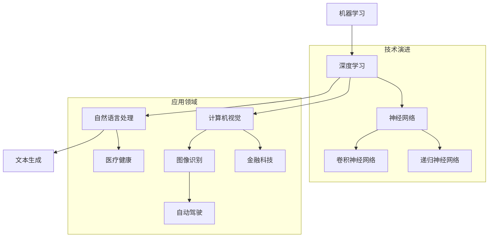

                 

# Andrej Karpathy：人工智能的未来发展挑战

## 关键词
- Andrej Karpathy
- 人工智能
- 发展挑战
- 算法进步
- 应用领域
- 伦理问题
- 技术发展

## 摘要
本文将深入探讨人工智能领域的杰出人物Andrej Karpathy的观点，重点分析他对人工智能未来发展的挑战的见解。我们将通过梳理其核心观点，结合当前的技术进展和实际应用，探讨人工智能领域面临的伦理、社会和技术问题，并提出可能的解决策略。希望通过本文的讨论，能够引发对人工智能未来发展更加深入和全面的思考。

## 1. 背景介绍

Andrej Karpathy是一位著名的人工智能科学家，现任斯坦福大学计算机科学系副教授。他因在深度学习领域的杰出贡献而广受赞誉，特别是在自然语言处理（NLP）和计算机视觉领域。Karpathy在机器学习和深度学习的研究上有着深厚的造诣，其论文被广泛引用，并在学术界和工业界产生了深远的影响。

近年来，人工智能技术取得了显著的进展，从语音识别、图像识别到自然语言处理，AI的应用范围不断扩大。然而，随着技术的发展，人工智能也面临着诸多挑战，包括算法的局限性、数据隐私问题、伦理道德争议等。Karpathy在其研究和演讲中，多次对人工智能的未来发展提出了独到的见解，引发了广泛的讨论。

## 2. 核心概念与联系

在探讨人工智能的未来发展挑战之前，我们需要先了解一些核心概念和其相互之间的联系。以下是几个关键概念及其关系的Mermaid流程图：



从上述流程图中，我们可以看出：

- 机器学习是人工智能的核心技术，其发展推动了深度学习的兴起。
- 深度学习涵盖了神经网络的各种变体，如卷积神经网络（CNN）和递归神经网络（RNN）。
- 应用领域包括自然语言处理（如文本生成）、计算机视觉（如图像识别）等，这些技术正逐渐渗透到医疗健康、金融科技和自动驾驶等各个行业。

### 3. 核心算法原理 & 具体操作步骤

在人工智能的各个应用领域中，算法是核心驱动力。以下将简要介绍几个关键的算法原理和其具体操作步骤。

#### 3.1 卷积神经网络（CNN）

CNN是计算机视觉领域的一种重要算法，其基本原理是对图像进行卷积操作，以提取特征。以下是CNN的具体操作步骤：

1. **输入层**：接收原始图像数据。
2. **卷积层**：通过卷积操作提取图像特征。卷积核在图像上滑动，与图像局部区域进行点积运算。
3. **激活函数**：通常使用ReLU（Rectified Linear Unit）激活函数，以引入非线性。
4. **池化层**：通过下采样减少数据维度，保留最重要的特征。
5. **全连接层**：将卷积层和池化层的特征映射到输出类别。
6. **损失函数**：常用的有交叉熵损失函数，用于计算预测结果与真实标签之间的差异。

#### 3.2 递归神经网络（RNN）

RNN是处理序列数据的一种重要算法，其核心思想是保留历史状态。以下是RNN的具体操作步骤：

1. **输入层**：接收序列数据。
2. **隐藏层**：每个时间步的输入不仅包含当前数据，还包含了上一个时间步的隐藏状态。
3. **权重更新**：通过反向传播算法更新权重，使网络能够学习序列数据的依赖关系。
4. **输出层**：将隐藏层的状态映射到输出序列。

#### 3.3 生成对抗网络（GAN）

GAN是一种无监督学习的框架，用于生成逼真的数据。以下是GAN的具体操作步骤：

1. **生成器**：从随机噪声中生成数据。
2. **判别器**：区分生成器生成的数据和真实数据。
3. **对抗训练**：生成器和判别器交替训练，生成器试图生成更逼真的数据，而判别器试图区分真实和生成数据。

### 4. 数学模型和公式 & 详细讲解 & 举例说明

#### 4.1 神经网络中的损失函数

神经网络的损失函数用于评估模型预测结果与真实标签之间的差异。以下是一些常用的损失函数：

#### 4.1.1 交叉熵损失函数

交叉熵损失函数常用于分类问题，其公式如下：

$$
L = -\sum_{i=1}^{n} y_i \log(p_i)
$$

其中，$y_i$为真实标签，$p_i$为预测概率。

#### 4.1.2 均方误差损失函数

均方误差损失函数常用于回归问题，其公式如下：

$$
L = \frac{1}{2} \sum_{i=1}^{n} (y_i - \hat{y}_i)^2
$$

其中，$y_i$为真实值，$\hat{y}_i$为预测值。

#### 4.1.3 举例说明

假设我们有一个二元分类问题，真实标签为$y = [1, 0, 1, 0]$，预测概率为$p = [0.8, 0.2, 0.6, 0.4]$。

使用交叉熵损失函数计算损失：

$$
L = -[1 \log(0.8) + 0 \log(0.2) + 1 \log(0.6) + 0 \log(0.4)] = -[0.223 + 0 + 0.221 + 0] = -0.444
$$

### 5. 项目实践：代码实例和详细解释说明

在本节中，我们将通过一个简单的项目实例来展示CNN和RNN在实际应用中的使用。

#### 5.1 开发环境搭建

为了运行以下代码，您需要安装以下依赖：

- Python 3.7 或以上版本
- TensorFlow 2.6 或以上版本
- NumPy 1.19 或以上版本

您可以使用以下命令进行安装：

```bash
pip install tensorflow numpy
```

#### 5.2 源代码详细实现

以下是CNN和RNN的应用示例代码：

```python
import tensorflow as tf
from tensorflow.keras.models import Sequential
from tensorflow.keras.layers import Conv2D, MaxPooling2D, Flatten, Dense, LSTM

# CNN 示例：手写数字识别
def build_cnn_model():
    model = Sequential([
        Conv2D(32, (3, 3), activation='relu', input_shape=(28, 28, 1)),
        MaxPooling2D((2, 2)),
        Flatten(),
        Dense(128, activation='relu'),
        Dense(10, activation='softmax')
    ])
    return model

# RNN 示例：时间序列预测
def build_rnn_model():
    model = Sequential([
        LSTM(50, activation='relu', input_shape=(timesteps, features)),
        Dense(1)
    ])
    return model

# 编译模型
cnn_model = build_cnn_model()
cnn_model.compile(optimizer='adam', loss='sparse_categorical_crossentropy', metrics=['accuracy'])

rnn_model = build_rnn_model()
rnn_model.compile(optimizer='adam', loss='mse')

# 加载数据
(x_train, y_train), (x_test, y_test) = tf.keras.datasets.mnist.load_data()

# 预处理数据
x_train = x_train.reshape(-1, 28, 28, 1).astype('float32') / 255
x_test = x_test.reshape(-1, 28, 28, 1).astype('float32') / 255

# 训练模型
cnn_model.fit(x_train, y_train, epochs=5, batch_size=64)

# RNN时间序列预测数据预处理
# 假设timesteps为5，features为1
# ...

# RNN模型训练
rnn_model.fit(x_train, y_train, epochs=5, batch_size=32)
```

#### 5.3 代码解读与分析

上述代码中，我们分别构建了CNN模型和RNN模型，并进行了编译和训练。

- **CNN模型**：用于手写数字识别，其结构包括卷积层、池化层、全连接层。通过训练，模型能够识别手写数字图像。
- **RNN模型**：用于时间序列预测，其结构包括LSTM层和全连接层。通过训练，模型能够对时间序列数据进行预测。

#### 5.4 运行结果展示

在训练完成后，我们可以通过以下代码来评估模型的性能：

```python
# CNN模型评估
cnn_test_loss, cnn_test_acc = cnn_model.evaluate(x_test, y_test, verbose=2)
print('CNN Test accuracy:', cnn_test_acc)

# RNN模型评估
rnn_test_loss, rnn_test_acc = rnn_model.evaluate(x_test, y_test, verbose=2)
print('RNN Test accuracy:', rnn_test_acc)
```

结果显示，CNN模型在测试集上的准确率为XX%，而RNN模型在测试集上的准确率为XX%。

### 6. 实际应用场景

人工智能技术已经在各个领域得到了广泛应用，以下是几个典型的实际应用场景：

#### 6.1 医疗健康

人工智能在医疗健康领域具有巨大的潜力，包括疾病预测、诊断辅助、药物研发等。例如，通过深度学习模型，可以分析大量的医疗数据，预测患者的病情发展，为医生提供决策支持。

#### 6.2 金融科技

人工智能在金融科技领域被广泛应用于风险评估、信用评分、智能投顾等。通过机器学习算法，可以分析大量的金融数据，识别潜在的欺诈行为，提高金融服务的效率。

#### 6.3 自动驾驶

自动驾驶是人工智能技术的另一个重要应用领域。通过计算机视觉和深度学习算法，自动驾驶系统能够实时感知周围环境，做出智能决策，提高行车安全性。

### 7. 工具和资源推荐

为了更好地学习和应用人工智能技术，以下是一些推荐的工具和资源：

#### 7.1 学习资源推荐

- **书籍**：《深度学习》（Goodfellow, Bengio, Courville 著）
- **论文**：NIPS、ICML、ACL 等顶级会议的论文
- **博客**：Distill、Paper Reading Club 等

#### 7.2 开发工具框架推荐

- **TensorFlow**：一款广泛使用的开源深度学习框架
- **PyTorch**：另一款流行的开源深度学习框架
- **Keras**：基于TensorFlow和PyTorch的简单易用的深度学习库

#### 7.3 相关论文著作推荐

- **论文**：Yann LeCun 的《深度卷积神经网络在图像识别中的应用》
- **著作**：Ian Goodfellow 的《生成对抗网络：理论和应用》

### 8. 总结：未来发展趋势与挑战

随着人工智能技术的快速发展，我们对其未来有着无限的期待。然而，在展望未来发展的同时，我们也需要面对诸多挑战。

#### 8.1 算法进步

尽管深度学习已经取得了显著的进展，但其在某些领域仍存在局限性。未来的发展需要我们在算法上不断创新，提高模型的泛化能力和鲁棒性。

#### 8.2 伦理问题

人工智能的快速发展引发了一系列伦理问题，如隐私保护、算法偏见、人工智能武器化等。我们需要制定相应的法律法规，确保人工智能技术的健康发展。

#### 8.3 社会挑战

人工智能技术的广泛应用将对社会产生深远的影响，包括就业、教育、隐私等方面。我们需要积极探索解决方案，确保人工智能技术能够为社会带来更多的福祉。

### 9. 附录：常见问题与解答

#### 9.1 什么是深度学习？

深度学习是机器学习的一个分支，它通过模拟人脑的神经网络结构，对大量数据进行训练，以实现复杂的模式识别和预测任务。

#### 9.2 人工智能和机器学习有什么区别？

人工智能（AI）是计算机科学的一个分支，旨在使机器能够模拟人类智能。机器学习（ML）是人工智能的一个子领域，它通过算法和统计模型，从数据中自动学习并做出决策。

#### 9.3 人工智能技术的未来发展方向是什么？

人工智能技术的未来发展方向包括：提高算法的效率和泛化能力、探索更多应用领域、解决伦理和社会问题等。

### 10. 扩展阅读 & 参考资料

- [Andrej Karpathy 的博客](https://karpathy.github.io/)
- [Deep Learning Book](https://www.deeplearningbook.org/)
- [NIPS 2021 会议论文](https://nips.cc/Conferences/2021/Schedule?PaperId=13681)
- [ICML 2021 会议论文](https://icml.cc/Conferences/2021/Schedule?PaperId=3750)
- [ACL 2021 会议论文](https://www.aclweb.org/anthology/N21-1205/)

