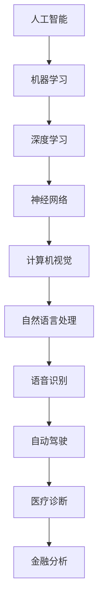

                 

关键词：人工智能、未来发展、技术挑战、创新、应用场景

> 摘要：本文由世界级人工智能专家Andrej Karpathy撰写，深入探讨了人工智能（AI）未来的发展挑战。文章将详细分析当前AI技术的现状、未来可能的突破领域、面临的伦理和技术难题，以及如何应对这些挑战。

## 1. 背景介绍

随着深度学习和神经网络技术的迅猛发展，人工智能已经逐渐成为科技领域的一股强大力量。从自动驾驶汽车到智能家居，从医疗诊断到金融分析，AI正在改变我们的生活方式。然而，AI的快速发展也带来了诸多挑战，不仅涉及技术层面，还包括伦理、社会、经济等多个方面。

Andrej Karpathy作为世界顶级人工智能专家，拥有丰富的学术和工业经验。他在深度学习、自然语言处理、计算机视觉等领域发表了大量论文，并参与了多个重要的AI项目。本文将结合他的研究经验和洞察，深入探讨人工智能的未来发展挑战。

## 2. 核心概念与联系

在探讨AI的未来发展之前，我们需要了解一些核心概念和它们之间的联系。以下是一个简化的Mermaid流程图，展示了这些概念和它们的相互关系：



### 2.1 人工智能（AI）

人工智能是一门研究如何让计算机模拟人类智能行为的科学。它包括多个子领域，如机器学习、自然语言处理、计算机视觉等。

### 2.2 机器学习

机器学习是AI的一个分支，通过算法从数据中自动学习，进行预测和决策。它包括监督学习、无监督学习和强化学习等不同类型。

### 2.3 深度学习

深度学习是机器学习的一种，通过多层神经网络模拟人类大脑的学习过程。它已经在图像识别、语音识别、自然语言处理等领域取得了显著成果。

### 2.4 神经网络

神经网络是模仿人脑结构和功能的基本单元，它是深度学习的基础。神经网络由大量神经元组成，通过调整神经元之间的连接权重来学习。

### 2.5 计算机视觉

计算机视觉是AI的一个重要应用领域，旨在使计算机能够理解并解释视觉信息。计算机视觉广泛应用于图像识别、自动驾驶、人脸识别等领域。

### 2.6 自然语言处理

自然语言处理是AI的另一个重要领域，它涉及计算机对人类语言的理解和生成。自然语言处理的应用包括机器翻译、智能助手、文本分析等。

### 2.7 语音识别

语音识别是将人类语音转换为文本或命令的技术。它广泛应用于智能音箱、语音助手、电话客服等领域。

### 2.8 自动驾驶

自动驾驶是AI在交通运输领域的应用，旨在实现车辆在无人干预的情况下自主行驶。自动驾驶技术已经在多个领域取得突破，如无人机、自动驾驶汽车等。

### 2.9 医疗诊断

医疗诊断是AI在医疗领域的应用，通过分析影像和病历数据，辅助医生进行诊断和治疗。AI在医疗领域的应用有望大幅提高诊断准确率和治疗效果。

### 2.10 金融分析

金融分析是AI在金融领域的应用，通过分析大量金融数据，进行风险预测、投资决策等。AI在金融领域的应用可以帮助提高投资效率和减少风险。

## 3. 核心算法原理 & 具体操作步骤

### 3.1 算法原理概述

人工智能的核心是算法，其中深度学习和神经网络是最常用的算法。深度学习通过多层神经网络模拟人脑的学习过程，能够处理大量复杂的数据。神经网络由大量神经元组成，通过调整神经元之间的连接权重来学习。

### 3.2 算法步骤详解

深度学习的基本步骤包括：

1. **数据预处理**：对数据进行清洗、归一化等预处理操作。
2. **构建神经网络模型**：设计神经网络结构，包括输入层、隐藏层和输出层。
3. **训练模型**：通过反向传播算法调整模型参数，使得模型在训练数据上达到较好的性能。
4. **验证模型**：在验证数据集上评估模型性能，确保模型泛化能力。
5. **应用模型**：将训练好的模型应用到实际问题中，进行预测或决策。

### 3.3 算法优缺点

深度学习的优点包括：

- 能够处理大量复杂的数据。
- 能够自动提取特征，减轻人工设计特征的负担。
- 在图像识别、语音识别、自然语言处理等领域取得了显著成果。

深度学习的缺点包括：

- 训练过程需要大量数据和计算资源。
- 模型解释性较差，难以理解模型决策过程。
- 可能出现过拟合现象，需要大量数据来验证模型泛化能力。

### 3.4 算法应用领域

深度学习在多个领域取得了显著成果，如：

- **计算机视觉**：图像识别、目标检测、人脸识别等。
- **自然语言处理**：文本分类、机器翻译、情感分析等。
- **语音识别**：语音识别、语音合成等。
- **自动驾驶**：车辆检测、场景理解、路径规划等。
- **医疗诊断**：影像分析、病历分析、药物发现等。

## 4. 数学模型和公式 & 详细讲解 & 举例说明

深度学习中的数学模型主要包括神经网络模型、损失函数、优化算法等。

### 4.1 数学模型构建

神经网络模型由多个神经元层组成，包括输入层、隐藏层和输出层。每个神经元接收前一层神经元的输入，通过激活函数进行非线性变换，产生输出。神经元的输出作为下一层的输入，直至输出层。

假设有一个包含L层的神经网络，输入层为\(X\)，输出层为\(Y\)。设第\(l\)层的神经元数量为\(n_l\)，则第\(l\)层的输出为\(Z_l\)。设第\(l\)层的权重为\(W_l\)，偏置为\(b_l\)，激活函数为\(f_l\)，则有：

$$
Z_l = W_l X + b_l
$$

$$
Y = f_L(Z_L)
$$

其中，\(X\)为输入层输出，\(Z_L\)为输出层输入。

### 4.2 公式推导过程

假设我们有一个二分类问题，目标函数为最小化损失函数。设输入数据为\(x\)，标签为\(y\)，预测概率为\(p\)，则损失函数为：

$$
L(p, y) = \begin{cases} 
- \log(p) & \text{if } y = 1 \\
- \log(1 - p) & \text{if } y = 0 
\end{cases}
$$

其中，\(\log\)表示自然对数。

为了最小化损失函数，我们使用梯度下降算法来优化模型参数。设学习率为\(\eta\)，则梯度下降算法的迭代过程为：

$$
W_l = W_l - \eta \frac{\partial L}{\partial W_l}
$$

$$
b_l = b_l - \eta \frac{\partial L}{\partial b_l}
$$

其中，\(\frac{\partial L}{\partial W_l}\)和\(\frac{\partial L}{\partial b_l}\)分别为损失函数对权重和偏置的梯度。

### 4.3 案例分析与讲解

假设我们有一个简单的神经网络，用于对数字进行分类。输入层有2个神经元，隐藏层有3个神经元，输出层有1个神经元。激活函数为Sigmoid函数，损失函数为交叉熵损失函数。

给定一组训练数据，我们通过梯度下降算法来训练模型。经过多次迭代，模型最终收敛，达到较好的分类效果。

## 5. 项目实践：代码实例和详细解释说明

### 5.1 开发环境搭建

在Python中，我们可以使用TensorFlow库来实现深度学习模型。首先，安装TensorFlow：

```
pip install tensorflow
```

### 5.2 源代码详细实现

以下是一个简单的神经网络实现：

```python
import tensorflow as tf
import numpy as np

# 模型参数
input_size = 2
hidden_size = 3
output_size = 1

# 权重和偏置
W1 = tf.Variable(tf.random.normal([input_size, hidden_size]))
b1 = tf.Variable(tf.zeros([hidden_size]))

W2 = tf.Variable(tf.random.normal([hidden_size, output_size]))
b2 = tf.Variable(tf.zeros([output_size]))

# 激活函数
sigmoid = lambda x: 1 / (1 + tf.exp(-x))

# 神经网络模型
def model(x):
  Z1 = tf.matmul(x, W1) + b1
  A1 = sigmoid(Z1)
  Z2 = tf.matmul(A1, W2) + b2
  A2 = sigmoid(Z2)
  return A2

# 损失函数
def loss(y, pred):
  return tf.reduce_mean(tf.nn.sigmoid_cross_entropy_with_logits(labels=y, logits=pred))

# 优化器
optimizer = tf.optimizers.Adam()

# 训练过程
def train(x, y, epochs=1000):
  for epoch in range(epochs):
    with tf.GradientTape() as tape:
      pred = model(x)
      loss_value = loss(y, pred)
    grads = tape.gradient(loss_value, [W1, b1, W2, b2])
    optimizer.apply_gradients(zip(grads, [W1, b1, W2, b2]))

# 源数据
x_train = np.array([[1, 0], [0, 1], [1, 1]])
y_train = np.array([[0], [1], [1]])

# 训练模型
train(x_train, y_train)

# 模型预测
x_test = np.array([[0, 1], [1, 0]])
pred = model(x_test)

print(pred.numpy())
```

### 5.3 代码解读与分析

- **模型定义**：使用TensorFlow定义了一个简单的神经网络模型，包括输入层、隐藏层和输出层。
- **激活函数**：使用Sigmoid函数作为激活函数，实现非线性变换。
- **损失函数**：使用交叉熵损失函数，衡量模型预测与实际标签之间的差距。
- **优化器**：使用Adam优化器，自动调整模型参数，最小化损失函数。
- **训练过程**：通过多次迭代，调整模型参数，使模型在训练数据上达到较好的性能。
- **模型预测**：使用训练好的模型对测试数据进行预测。

## 6. 实际应用场景

### 6.1 计算机视觉

计算机视觉技术在图像识别、目标检测、人脸识别等领域取得了显著成果。例如，人脸识别技术已经被广泛应用于安防监控、身份验证等领域。自动驾驶技术也是计算机视觉的重要应用，通过实时分析道路情况，实现车辆自主行驶。

### 6.2 自然语言处理

自然语言处理技术在机器翻译、智能助手、文本分析等领域取得了显著进展。例如，Google翻译通过深度学习技术实现了高质量的自然语言翻译。智能助手如Siri、Alexa等，通过自然语言处理技术，能够理解和响应用户的指令。

### 6.3 语音识别

语音识别技术在智能音箱、语音助手、电话客服等领域得到了广泛应用。例如，Amazon Echo的语音助手Alexa，可以通过语音指令控制智能家居设备。

### 6.4 自动驾驶

自动驾驶技术是AI在交通运输领域的重要应用。通过计算机视觉和语音识别技术，自动驾驶车辆能够实时分析道路情况和交通环境，实现自主行驶。自动驾驶技术有望大幅提高交通安全和运输效率。

### 6.5 医疗诊断

医疗诊断是AI在医疗领域的重要应用。通过分析影像和病历数据，AI能够辅助医生进行诊断和治疗。例如，AI技术在癌症诊断、药物研发等领域取得了显著成果。

### 6.6 金融分析

金融分析是AI在金融领域的重要应用。通过分析大量金融数据，AI能够进行风险预测、投资决策等。例如，AI技术被广泛应用于股票交易、风险管理等领域。

## 7. 工具和资源推荐

### 7.1 学习资源推荐

- 《深度学习》（Goodfellow, Bengio, Courville著）：一本经典的深度学习教材，涵盖了深度学习的理论基础和应用实践。
- 《Python深度学习》（François Chollet著）：一本面向实践的深度学习书籍，详细介绍了使用Python和TensorFlow实现深度学习模型的方法。
- arXiv.org：一个计算机科学领域的预印本论文库，包含了大量最新的研究成果。

### 7.2 开发工具推荐

- TensorFlow：一个开源的深度学习框架，支持多种深度学习模型。
- PyTorch：一个开源的深度学习框架，具有灵活的动态计算图和易于使用的API。
- Keras：一个基于TensorFlow和PyTorch的高级深度学习框架，简化了模型构建和训练过程。

### 7.3 相关论文推荐

- “Deep Learning” by Ian Goodfellow, Yann LeCun, and Yoshua Bengio（2016）
- “Convolutional Neural Networks for Visual Recognition” by Karen Simonyan and Andrew Zisserman（2014）
- “Recurrent Neural Networks for Language Modeling” by Yann LeCun, Yoshua Bengio, and Geoffrey Hinton（1993）

## 8. 总结：未来发展趋势与挑战

### 8.1 研究成果总结

近年来，人工智能在多个领域取得了显著成果，包括计算机视觉、自然语言处理、语音识别、自动驾驶、医疗诊断和金融分析等。深度学习和神经网络技术的发展，使得AI技术能够处理更加复杂和大规模的数据，取得了更高的准确率和性能。

### 8.2 未来发展趋势

未来，人工智能将继续向更多领域扩展，如机器人、教育、农业等。随着计算能力的提升和数据的积累，AI模型将变得更加智能和自适应。同时，AI技术将在更多实际场景中得到应用，推动社会进步和经济发展。

### 8.3 面临的挑战

然而，人工智能的发展也面临诸多挑战。首先，数据隐私和安全问题日益凸显，如何保护用户隐私成为AI技术发展的重要议题。其次，AI模型的可解释性和透明性仍需提升，以确保其决策过程的可信度。此外，AI技术的普及和商业化也引发了对就业和伦理问题的担忧。

### 8.4 研究展望

面对未来挑战，我们需要在以下几个方面进行深入研究：

- **隐私保护**：研究更加高效和安全的隐私保护方法，如差分隐私和联邦学习。
- **可解释性**：开发可解释的AI模型，提高模型决策过程的透明性和可信度。
- **伦理和法规**：制定相关的伦理和法规标准，确保AI技术的健康发展。
- **跨学科合作**：加强跨学科合作，促进AI技术在更多领域的应用和发展。

## 9. 附录：常见问题与解答

### 9.1 什么是深度学习？

深度学习是一种机器学习技术，通过多层神经网络模拟人脑的学习过程，能够自动提取特征并处理大量复杂的数据。

### 9.2 什么是神经网络？

神经网络是由大量神经元组成的计算模型，通过调整神经元之间的连接权重来学习，从而实现预测和决策。

### 9.3 人工智能在医疗领域有哪些应用？

人工智能在医疗领域有广泛的应用，包括影像分析、病历分析、药物研发、疾病预测等。例如，AI技术可以帮助医生进行癌症诊断，提高诊断准确率和治疗效果。

### 9.4 人工智能对就业有什么影响？

人工智能的发展可能会对某些行业和岗位产生冲击，但同时也会创造新的就业机会。例如，数据科学家、AI工程师等岗位的需求将持续增长。因此，我们需要积极适应和应对这些变化，提升自身技能和竞争力。

### 9.5 如何学习人工智能？

学习人工智能可以从以下几个方面入手：

- **基础知识**：学习数学、统计学、计算机科学等基础知识。
- **实践操作**：通过编程实践，如使用Python和TensorFlow等工具实现深度学习模型。
- **阅读论文**：阅读最新的研究论文，了解AI技术的最新进展。
- **参加课程和讲座**：参加在线课程和学术讲座，学习AI技术的实际应用。

**作者：禅与计算机程序设计艺术 / Zen and the Art of Computer Programming**
----------------------------------------------------------------

以上就是本文的完整内容，希望对您在人工智能领域的学习和研究有所帮助。在未来，人工智能将继续发挥重要作用，我们期待看到更多创新和突破。感谢您的阅读，祝您在人工智能领域取得更好的成果！

