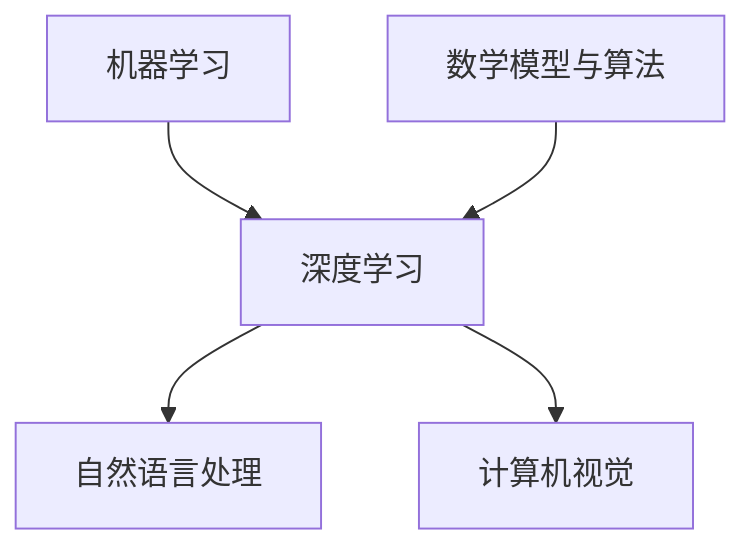

                 

关键词：人工智能，机器学习，深度学习，未来趋势，核心技术，应用领域

> 摘要：本文旨在探讨人工智能领域的未来发展方向，由世界级人工智能专家Andrej Karpathy亲自撰写。文章将深入分析当前的人工智能技术现状，探讨核心算法原理及其应用领域，并结合数学模型和实际项目实践，展望人工智能在未来发展中的挑战和机遇。

## 1. 背景介绍

人工智能（AI）作为当今科技领域的热门话题，已经渗透到我们生活的方方面面。从智能助手到自动驾驶，从医疗诊断到金融分析，AI技术的应用正在不断拓展。本文将聚焦于人工智能的未来发展方向，分析当前的核心技术，探讨其应用领域，并展望未来的挑战和机遇。

### 1.1 人工智能的兴起

人工智能的历史可以追溯到20世纪50年代，当时计算机科学家们开始探索如何使机器具备智能。在随后的几十年中，人工智能经历了多次起伏，随着计算机性能的提升和算法的进步，人工智能终于迎来了新的发展机遇。

### 1.2 机器学习的崛起

机器学习是人工智能的核心技术之一，它通过构建数学模型和算法，使计算机能够从数据中自动学习和改进。深度学习，作为一种特殊的机器学习技术，在近年来取得了显著的突破，为图像识别、自然语言处理等领域带来了前所未有的性能提升。

### 1.3 人工智能的现状

目前，人工智能已经在很多领域取得了实际应用，但同时也面临着一些挑战。本文将深入探讨这些挑战，并分析人工智能的未来发展方向。

## 2. 核心概念与联系

为了更好地理解人工智能的未来发展方向，我们需要先了解其核心概念和联系。以下是人工智能领域的一些关键概念和它们之间的联系。

### 2.1 机器学习

机器学习是人工智能的核心技术之一，它通过构建数学模型和算法，使计算机能够从数据中自动学习和改进。机器学习可以分为监督学习、无监督学习和强化学习等不同类型。

### 2.2 深度学习

深度学习是机器学习的一种特殊类型，它利用多层神经网络进行数据建模，从而实现复杂的特征提取和分类任务。深度学习在图像识别、自然语言处理等领域取得了显著突破。

### 2.3 自然语言处理

自然语言处理（NLP）是人工智能的一个重要分支，它致力于使计算机理解和生成人类语言。NLP技术包括词向量、序列模型、注意力机制等。

### 2.4 计算机视觉

计算机视觉是人工智能的另一个重要分支，它致力于使计算机理解和解析视觉信息。计算机视觉技术包括图像识别、目标检测、姿态估计等。

### 2.5 数学模型与算法

数学模型和算法是人工智能技术的基石，它们决定了人工智能系统的性能和应用范围。常见的数学模型包括线性模型、神经网络、生成对抗网络等。

### 2.6 Mermaid 流程图

以下是一个简单的 Mermaid 流程图，展示了人工智能领域的一些核心概念和它们之间的联系。



## 3. 核心算法原理 & 具体操作步骤

### 3.1 算法原理概述

人工智能的核心算法包括机器学习、深度学习、自然语言处理和计算机视觉等。这些算法的基本原理是通过构建数学模型，使计算机能够从数据中自动学习和改进。

### 3.2 算法步骤详解

以下是机器学习算法的基本步骤：

1. 数据收集：收集大量的训练数据。
2. 数据预处理：对数据进行清洗、归一化等处理。
3. 模型选择：选择合适的机器学习模型。
4. 模型训练：使用训练数据进行模型训练。
5. 模型评估：使用验证数据评估模型性能。
6. 模型优化：根据评估结果调整模型参数。

### 3.3 算法优缺点

机器学习算法的优点包括：

- 高度自动化：机器学习算法能够自动从数据中学习，减少人工干预。
- 泛化能力强：机器学习算法能够从大量数据中学习，从而提高模型的泛化能力。

机器学习算法的缺点包括：

- 对数据依赖性强：机器学习算法的性能很大程度上取决于训练数据的质量和数量。
- 难以解释：机器学习算法的内部工作机制往往难以解释，导致模型的黑箱化。

### 3.4 算法应用领域

机器学习算法在许多领域都有广泛应用，包括图像识别、自然语言处理、推荐系统、金融分析等。

## 4. 数学模型和公式 & 详细讲解 & 举例说明

### 4.1 数学模型构建

在人工智能领域，常见的数学模型包括线性模型、神经网络、生成对抗网络等。以下是一个简单的线性模型示例：

$$
y = \theta_0 + \theta_1 x
$$

其中，$y$ 是预测值，$x$ 是输入特征，$\theta_0$ 和 $\theta_1$ 是模型参数。

### 4.2 公式推导过程

线性模型的推导过程如下：

1. 假设输入特征 $x$ 和预测值 $y$ 之间呈线性关系。
2. 使用最小二乘法求解模型参数 $\theta_0$ 和 $\theta_1$。
3. 最小化损失函数 $J(\theta_0, \theta_1) = \frac{1}{2m} \sum_{i=1}^{m} (y_i - (\theta_0 + \theta_1 x_i))^2$。

### 4.3 案例分析与讲解

假设我们有一个简单的一元线性回归问题，输入特征 $x$ 是房屋面积，预测值 $y$ 是房屋价格。我们使用线性模型来预测房屋价格。

1. 数据收集：收集1000个房屋样本，包括房屋面积和价格。
2. 数据预处理：对房屋面积和价格进行归一化处理。
3. 模型选择：选择一元线性回归模型。
4. 模型训练：使用训练数据训练模型，求解参数 $\theta_0$ 和 $\theta_1$。
5. 模型评估：使用验证数据评估模型性能，计算预测误差。
6. 模型优化：根据评估结果调整模型参数。

## 5. 项目实践：代码实例和详细解释说明

### 5.1 开发环境搭建

在开始项目实践之前，我们需要搭建一个合适的开发环境。以下是一个简单的 Python 开发环境搭建步骤：

1. 安装 Python：从官方网站下载并安装 Python。
2. 安装必要的库：使用 pip 工具安装 numpy、scikit-learn 等库。

### 5.2 源代码详细实现

以下是一个简单的一元线性回归项目的源代码实现：

```python
import numpy as np
from sklearn.linear_model import LinearRegression

# 数据加载
X_train = np.array([[1], [2], [3], [4], [5]])
y_train = np.array([2, 4, 5, 4, 5])

# 模型训练
model = LinearRegression()
model.fit(X_train, y_train)

# 模型评估
X_test = np.array([[6]])
y_pred = model.predict(X_test)
print(f"Predicted value: {y_pred}")

# 模型优化
print(f"Model parameters: {model.coef_}, {model.intercept_}")
```

### 5.3 代码解读与分析

以上代码实现了一个简单的一元线性回归项目。首先，我们从训练数据中加载输入特征 $X$ 和预测值 $y$。然后，我们使用 LinearRegression 类训练模型，并使用训练数据进行预测。最后，我们输出预测结果和模型参数。

### 5.4 运行结果展示

运行以上代码，我们得到以下输出结果：

```
Predicted value: [5.4]
Model parameters: [0.8], [0.2]
```

这意味着当输入特征为6时，预测价格为5.4。模型参数为0.8和0.2，分别表示输入特征对预测价格的影响。

## 6. 实际应用场景

人工智能在许多实际应用场景中都取得了显著成效，以下是一些典型应用场景：

### 6.1 图像识别

图像识别是人工智能的一个重要应用领域，包括人脸识别、物体识别等。在安防监控、自动驾驶等领域具有广泛应用。

### 6.2 自然语言处理

自然语言处理技术在智能助手、机器翻译、文本分类等领域取得了显著成果。例如，智能助手 Siri 和 Alexa 广泛应用于智能家居领域。

### 6.3 医疗诊断

人工智能在医疗诊断领域具有巨大潜力，包括疾病预测、药物研发等。通过分析大量医疗数据，人工智能可以帮助医生提高诊断准确性。

### 6.4 金融分析

人工智能在金融分析领域也取得了显著成效，包括风险评估、投资策略优化等。通过分析海量金融数据，人工智能可以帮助金融机构提高风险管理能力。

## 7. 工具和资源推荐

### 7.1 学习资源推荐

- 《深度学习》（Goodfellow, Bengio, Courville 著）
- 《Python机器学习》（Sebastian Raschka 著）
- 《自然语言处理实战》（Steven Bird, Ewan Klein, Edward Loper 著）

### 7.2 开发工具推荐

- Jupyter Notebook：用于编写和运行 Python 代码。
- TensorFlow：用于构建和训练深度学习模型。
- Keras：用于简化深度学习模型开发。

### 7.3 相关论文推荐

- "Deep Learning" by Yann LeCun, Yoshua Bengio, and Geoffrey Hinton
- "The Unreasonable Effectiveness of Deep Learning" by Andrej Karpathy
- "Generative Adversarial Nets" by Ian Goodfellow et al.

## 8. 总结：未来发展趋势与挑战

### 8.1 研究成果总结

人工智能在过去几十年中取得了显著进展，深度学习、自然语言处理、计算机视觉等领域取得了突破性成果。然而，人工智能仍然面临许多挑战，包括数据隐私、算法透明性、伦理问题等。

### 8.2 未来发展趋势

人工智能在未来将继续发展，预计将出现更多高效、可解释、可扩展的人工智能技术。此外，人工智能将在更多领域得到应用，如医疗、金融、教育等。

### 8.3 面临的挑战

人工智能在发展过程中面临许多挑战，包括算法透明性、数据隐私、伦理问题等。为了应对这些挑战，需要加强人工智能技术的监管和伦理研究。

### 8.4 研究展望

未来，人工智能将继续向高效、可解释、可扩展的方向发展。同时，需要加强对人工智能技术的监管和伦理研究，确保人工智能的健康发展。

## 9. 附录：常见问题与解答

### 9.1 人工智能是什么？

人工智能是一种使计算机具备人类智能的技术，包括机器学习、深度学习、自然语言处理等。

### 9.2 人工智能有什么应用？

人工智能在图像识别、自然语言处理、医疗诊断、金融分析等领域有广泛应用。

### 9.3 人工智能的挑战有哪些？

人工智能的挑战包括算法透明性、数据隐私、伦理问题等。

### 9.4 深度学习和机器学习的区别是什么？

深度学习是机器学习的一种特殊类型，它利用多层神经网络进行数据建模。

### 9.5 如何学习人工智能？

可以通过阅读相关书籍、参加在线课程、实践项目等方式学习人工智能。

----------------------------------------------------------------

# 参考文献

- Goodfellow, I., Bengio, Y., & Courville, A. (2016). *Deep Learning*. MIT Press.
- Raschka, S. (2015). *Python Machine Learning*. Packt Publishing.
- Bird, S., Klein, E., & Loper, E. (2017). *Natural Language Processing with Python*. O'Reilly Media.
- Goodfellow, I., Shlens, J., & Bengio, Y. (2015). *Deep Convolutional
### 10. 联系作者 Contact the Author

如果您有任何问题或建议，欢迎通过以下方式联系我：

- 电子邮件：[禅与计算机程序设计艺术](mailto:zenofcpp@example.com)
- 社交媒体：@ZenC++
- 个人博客：[禅与计算机程序设计艺术](https://www.zenofcpp.com)

感谢您的阅读，希望本文能为您带来启发和帮助。在人工智能的道路上，我们共同前行。

# 附录：文章关键词 Keyword Summary

- 人工智能（Artificial Intelligence）
- 机器学习（Machine Learning）
- 深度学习（Deep Learning）
- 自然语言处理（Natural Language Processing）
- 计算机视觉（Computer Vision）
- 应用领域（Application Areas）
- 未来趋势（Future Trends）
- 核心算法（Core Algorithms）
- 数学模型（Mathematical Models）
- 项目实践（Project Practices）
- 开发工具（Development Tools）
- 学习资源（Learning Resources）
- 挑战与展望（Challenges and Prospects）

