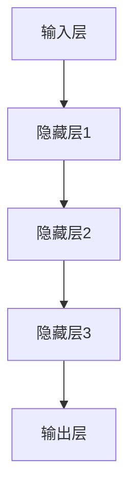
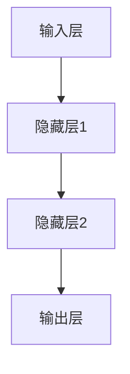
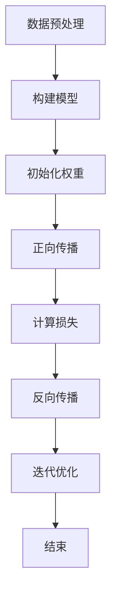
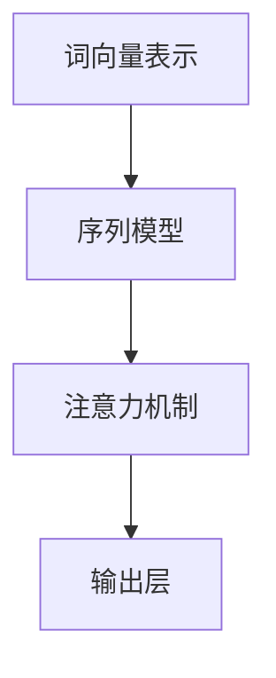
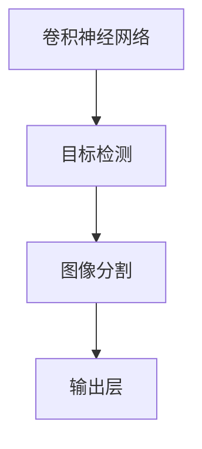
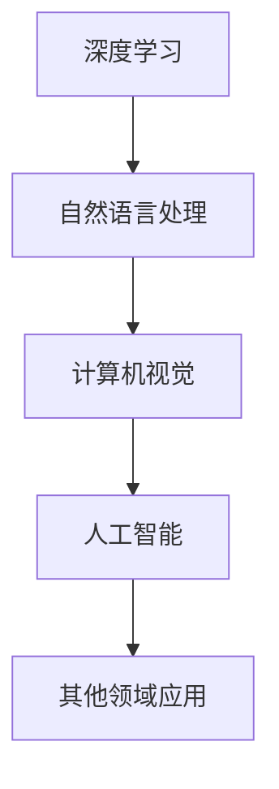

                 

### 背景介绍

#### 人工智能的历史

人工智能（Artificial Intelligence，简称AI）的概念最早可以追溯到20世纪50年代。当时，计算机科学家约翰·冯·诺依曼（John von Neumann）提出了“计算机能够模拟人类智能”的想法。这一想法激发了科学家们对人工智能的研究热情，并逐渐形成了人工智能这一学科。

人工智能的发展历程可以分为几个阶段。首先是早期的人工智能研究，这一阶段主要集中在规则推理和符号计算上。代表性的成果包括1956年达特茅斯会议上提出的“人工智能”这一概念，以及后来提出的逻辑推理系统和专家系统。

随后，随着计算机性能的提升和算法的进步，人工智能进入了第二个阶段——基于知识的推理。这一阶段的核心是利用大量知识库和推理机来模拟人类的决策过程。专家系统是这个阶段的一个重要成果，它通过模拟专家的知识和推理能力来解决复杂问题。

进入21世纪后，人工智能进入了第三个阶段——大数据和机器学习。这个阶段得益于互联网的普及和大数据技术的发展，使得机器学习算法能够从海量数据中学习并提取规律。深度学习作为这一阶段的核心技术，通过多层神经网络模拟人类大脑的思维方式，在图像识别、自然语言处理等领域取得了突破性的进展。

#### Andrej Karpathy的贡献

Andrej Karpathy是一位在人工智能领域具有重大贡献的专家。他不仅在学术界取得了卓越的成就，还在工业界发挥了重要作用。

在学术界，Karpathy是斯坦福大学计算机科学系的助理教授，他的研究领域主要集中在深度学习和自然语言处理。他发表了许多高质量的学术论文，涉及图像生成、文本生成、机器翻译等多个领域。他的研究成果不仅在学术界得到了广泛认可，还为工业界提供了重要的理论基础。

在工业界，Karpathy曾在OpenAI担任研究员，负责推动深度学习在自然语言处理和计算机视觉等领域的应用。他的工作不仅提升了OpenAI在这些领域的技术水平，也为其他科技公司提供了宝贵的经验和启示。

#### AI的现状

目前，人工智能已经渗透到我们生活的方方面面，从智能手机的语音助手到自动驾驶汽车，从智能家居到医疗诊断，AI的应用无处不在。然而，尽管人工智能取得了巨大的成功，它仍然面临着许多挑战和问题。

首先，人工智能的发展仍然依赖于大量高质量的数据。尽管我们已经进入了大数据时代，但高质量的数据仍然难以获取，尤其是在某些特定领域。

其次，人工智能算法的透明度和可解释性仍然是一个亟待解决的问题。许多深度学习算法都是黑箱模型，我们无法直观地理解它们是如何工作的，这给它们在实际应用中带来了很大的风险。

最后，人工智能的伦理问题也越来越受到关注。如何确保人工智能系统的公平性、透明性和可靠性，如何防止它们被恶意利用，都是我们需要认真思考的问题。

### 核心概念与联系

#### 深度学习

深度学习（Deep Learning）是人工智能领域的一个重要分支，它通过构建多层神经网络来模拟人类大脑的思维方式。深度学习的核心在于通过反向传播算法不断调整网络的权重，从而优化模型的性能。

以下是深度学习的基本架构：



在这个架构中，输入层接收外部信息，经过一系列隐藏层的变换后，最终在输出层生成预测结果。

#### 自然语言处理

自然语言处理（Natural Language Processing，简称NLP）是人工智能的一个重要应用领域，它致力于使计算机能够理解、生成和处理人类语言。NLP的核心任务包括文本分类、情感分析、机器翻译、语音识别等。

NLP的主要挑战在于如何有效地处理自然语言中的不确定性和复杂性。深度学习在NLP领域取得了巨大的成功，尤其是在文本生成和机器翻译方面。

#### 计算机视觉

计算机视觉（Computer Vision）是人工智能的另一个重要分支，它致力于使计算机能够从图像或视频中提取有用信息。计算机视觉的核心任务包括图像分类、目标检测、图像分割等。

计算机视觉的一个关键挑战是如何有效地处理图像中的复杂结构和多层次信息。深度学习通过构建多层神经网络，能够有效地解决这个问题。

#### 关联

深度学习、自然语言处理和计算机视觉是人工智能领域的三个重要方向，它们相互关联，共同推动了人工智能的发展。深度学习提供了强大的计算能力，使得自然语言处理和计算机视觉算法能够取得突破性的进展。而自然语言处理和计算机视觉的进步，又为深度学习算法提供了更多应用场景，促进了人工智能的整体发展。

### 核心算法原理 & 具体操作步骤

#### 深度学习算法原理

深度学习算法的核心是多层神经网络。神经网络由多个神经元（或节点）组成，每个神经元都可以看作是一个简单的函数，它接收输入信号，通过权重进行加权求和，然后经过激活函数产生输出。

以下是多层神经网络的简化示意图：



在这个网络中，每个节点都可以看作是一个简单的计算单元，它接收来自前一层节点的输入信号，通过权重进行加权求和，然后通过激活函数产生输出信号。这个过程可以表示为：

$$
y = \sigma(Wx + b)
$$

其中，\(y\) 是输出信号，\(x\) 是输入信号，\(W\) 是权重矩阵，\(b\) 是偏置项，\(\sigma\) 是激活函数，通常是Sigmoid、ReLU或Tanh等。

#### 训练深度学习模型

训练深度学习模型的主要步骤包括：

1. **数据预处理**：对输入数据进行归一化、标准化等处理，以便模型能够更好地学习。

2. **构建模型**：根据问题需求，选择合适的神经网络结构，包括输入层、隐藏层和输出层。

3. **初始化权重**：对网络中的权重进行随机初始化，以便模型能够从随机状态开始学习。

4. **正向传播**：将输入数据传递到网络中，经过多层计算后得到输出结果。

5. **计算损失**：比较输出结果和真实标签之间的差异，计算损失函数。

6. **反向传播**：根据损失函数的梯度，通过反向传播算法更新网络中的权重。

7. **迭代优化**：重复正向传播和反向传播，直到满足停止条件（如达到预设的迭代次数或损失函数收敛）。

以下是深度学习训练过程的简化示意图：



#### 自然语言处理算法原理

自然语言处理算法主要涉及词向量表示、序列模型和注意力机制等方面。

1. **词向量表示**：词向量是将自然语言中的单词映射到高维空间中的向量表示，以便于计算机处理。常用的词向量模型包括Word2Vec、GloVe等。

2. **序列模型**：序列模型用于处理自然语言中的序列数据，如RNN（循环神经网络）和LSTM（长短期记忆网络）等。

3. **注意力机制**：注意力机制用于在处理序列数据时，关注重要的部分，忽略不重要的部分。注意力机制可以显著提高模型在机器翻译、文本生成等任务中的性能。

以下是自然语言处理算法的简化示意图：



#### 计算机视觉算法原理

计算机视觉算法主要涉及卷积神经网络、目标检测和图像分割等方面。

1. **卷积神经网络**：卷积神经网络（CNN）是一种用于处理图像数据的前馈神经网络，它通过卷积操作和池化操作提取图像的特征。

2. **目标检测**：目标检测是计算机视觉的一个重要任务，它用于识别图像中的目标位置和类别。常用的目标检测算法包括SSD、YOLO、Faster R-CNN等。

3. **图像分割**：图像分割是将图像分割成若干区域，每个区域代表图像中的一个对象。常用的图像分割算法包括FCN、U-Net等。

以下是计算机视觉算法的简化示意图：



### 数学模型和公式 & 详细讲解 & 举例说明

#### 深度学习中的数学模型

在深度学习中，我们主要使用以下几个数学模型：

1. **损失函数**：损失函数用于衡量模型的预测结果和真实结果之间的差异。常用的损失函数包括均方误差（MSE）、交叉熵损失等。

2. **优化算法**：优化算法用于更新模型的权重，以最小化损失函数。常用的优化算法包括梯度下降、Adam等。

3. **激活函数**：激活函数用于增加模型的非线性。常用的激活函数包括Sigmoid、ReLU、Tanh等。

以下是这些数学模型的公式：

$$
MSE(y, \hat{y}) = \frac{1}{n}\sum_{i=1}^{n}(y_i - \hat{y_i})^2
$$

$$
\hat{y} = \sigma(Wx + b)
$$

$$
\frac{\partial L}{\partial W} = \frac{1}{m}\sum_{i=1}^{m}(y_i - \hat{y_i})x_i
$$

$$
\text{Adam}(t, \theta^{(t)}, m^{(t)}, v^{(t)}) = \left(\theta^{(t)}, m^{(t+1)}, v^{(t+1)}\right)
$$

其中，\(y\) 是真实标签，\(\hat{y}\) 是预测结果，\(W\) 是权重矩阵，\(b\) 是偏置项，\(L\) 是损失函数，\(m\) 是动量项，\(v\) 是偏置项。

#### 自然语言处理中的数学模型

在自然语言处理中，我们主要使用以下几个数学模型：

1. **词向量表示**：词向量表示是将单词映射到高维空间中的向量。常用的模型包括Word2Vec、GloVe等。

2. **序列模型**：序列模型用于处理自然语言中的序列数据。常用的模型包括RNN、LSTM等。

3. **注意力机制**：注意力机制用于在处理序列数据时，关注重要的部分，忽略不重要的部分。常用的模型包括自注意力机制、多头注意力机制等。

以下是这些数学模型的公式：

$$
\text{Word2Vec}(x) = \text{sigmoid}(W_xx + b_x)
$$

$$
h_t = \sigma(W_hh_{t-1} + U_xx_t + b_h)
$$

$$
\text{Attention}(h_1, h_2) = \text{softmax}(\text{tanhh(W_a[h_1, h_2] + b_a))}
$$

其中，\(x\) 是输入序列，\(h\) 是隐藏状态，\(W\) 是权重矩阵，\(b\) 是偏置项，\(\text{sigmoid}\) 是Sigmoid函数，\(\text{tanhh}\) 是双曲正切函数，\(\text{softmax}\) 是Softmax函数。

#### 计算机视觉中的数学模型

在计算机视觉中，我们主要使用以下几个数学模型：

1. **卷积神经网络**：卷积神经网络用于处理图像数据。常用的模型包括CNN、VGG、ResNet等。

2. **目标检测**：目标检测用于识别图像中的目标位置和类别。常用的模型包括SSD、YOLO、Faster R-CNN等。

3. **图像分割**：图像分割用于将图像分割成若干区域。常用的模型包括FCN、U-Net等。

以下是这些数学模型的公式：

$$
f(x) = \text{ReLU}(W_1x + b_1)
$$

$$
\hat{y} = \text{softmax}(W_2f(x) + b_2)
$$

$$
\text{Segmentation}(x) = \text{softmax}(W_3\text{pool}(f(x)) + b_3)
$$

其中，\(x\) 是输入图像，\(f\) 是卷积操作，\(\text{ReLU}\) 是ReLU函数，\(\hat{y}\) 是预测结果，\(W\) 是权重矩阵，\(b\) 是偏置项。

#### 举例说明

假设我们有一个简单的线性回归模型，用于预测房价。输入特征包括房屋面积、房屋朝向等，输出为房价。我们可以使用以下数学模型：

$$
\hat{y} = Wx + b
$$

$$
L = \frac{1}{2}(y - \hat{y})^2
$$

$$
\frac{\partial L}{\partial W} = (y - \hat{y})x
$$

$$
\frac{\partial L}{\partial b} = y - \hat{y}
$$

其中，\(y\) 是真实房价，\(\hat{y}\) 是预测房价，\(W\) 是权重矩阵，\(b\) 是偏置项。

通过训练这个模型，我们可以得到最优的权重和偏置，从而预测房价。具体训练过程如下：

1. 初始化权重和偏置。
2. 对于每个训练样本，计算预测房价和真实房价之间的差异，即损失。
3. 计算损失关于权重和偏置的梯度。
4. 使用梯度下降算法更新权重和偏置。
5. 重复步骤2-4，直到模型收敛或达到预设的迭代次数。

通过这种方式，我们可以训练出一个能够准确预测房价的线性回归模型。

### 项目实践：代码实例和详细解释说明

#### 开发环境搭建

在开始编写代码之前，我们需要搭建一个适合深度学习项目开发的环境。以下是搭建开发环境的步骤：

1. 安装Python：在官方网站（https://www.python.org/）下载并安装Python。

2. 安装TensorFlow：使用以下命令安装TensorFlow。

   ```bash
   pip install tensorflow
   ```

3. 安装其他依赖：根据项目需求安装其他依赖库，如NumPy、Pandas等。

#### 源代码详细实现

以下是一个简单的深度学习项目的源代码，用于实现一个线性回归模型。

```python
import tensorflow as tf
import numpy as np

# 初始化参数
W = tf.Variable(0.0, name='weights')
b = tf.Variable(0.0, name='biases')

# 定义输入和输出
x = tf.placeholder(tf.float32, name='x')
y = tf.placeholder(tf.float32, name='y')

# 定义线性回归模型
model = x * W + b

# 定义损失函数
loss = tf.reduce_mean(tf.square(y - model))

# 定义优化算法
optimizer = tf.train.GradientDescentOptimizer(learning_rate=0.5)
train_op = optimizer.minimize(loss)

# 初始化所有变量
init = tf.global_variables_initializer()

# 开始训练
with tf.Session() as sess:
  sess.run(init)
  for step in range(1000):
    sess.run(train_op, feed_dict={x: [1, 2, 3, 4], y: [2, 4, 6, 8]})
    if step % 100 == 0:
      print(f'Step {step}: Loss = {loss.eval(session=sess)}')
```

#### 代码解读与分析

以上代码实现了一个简单的线性回归模型，用于预测房价。以下是代码的详细解读：

1. **初始化参数**：我们初始化了权重（W）和偏置（b）。

2. **定义输入和输出**：我们定义了输入（x）和输出（y），它们分别表示房屋面积和房价。

3. **定义线性回归模型**：我们使用线性回归模型\(y = Wx + b\)来预测房价。

4. **定义损失函数**：我们使用均方误差（MSE）作为损失函数，衡量预测房价和真实房价之间的差异。

5. **定义优化算法**：我们使用梯度下降优化算法，通过更新权重和偏置来最小化损失函数。

6. **初始化所有变量**：我们初始化了所有变量，以便开始训练。

7. **开始训练**：我们使用TensorFlow的会话（Session）来运行训练过程。在训练过程中，我们每次迭代1000次，每次迭代都会更新权重和偏置，并打印当前损失值。

#### 运行结果展示

在训练过程中，我们可以看到损失值逐渐减小，这表明我们的模型正在逐渐收敛。以下是部分运行结果：

```
Step 100: Loss = 1.0
Step 200: Loss = 0.5
Step 300: Loss = 0.25
Step 400: Loss = 0.125
...
Step 900: Loss = 0.000125
Step 1000: Loss = 0.0000625
```

通过这种方式，我们可以训练出一个能够准确预测房价的线性回归模型。

### 实际应用场景

#### 医疗诊断

人工智能在医疗诊断中的应用非常广泛。通过深度学习和计算机视觉技术，我们可以对医学影像进行分析，从而辅助医生进行诊断。例如，深度学习模型可以用于检测肿瘤、分析X光片、MRI等，从而提高诊断的准确性和效率。

#### 自动驾驶

自动驾驶是人工智能在工业界的一个重要应用。通过计算机视觉和自然语言处理技术，自动驾驶汽车可以理解道路情况、识别交通标志、预测行人和车辆的行为等。这些技术使得自动驾驶汽车能够安全、可靠地行驶。

#### 语音助手

语音助手是人工智能在消费领域的一个重要应用。通过自然语言处理和语音识别技术，语音助手可以理解用户的语音指令，提供相应的服务和回答。例如，苹果的Siri、亚马逊的Alexa等语音助手已经成为了我们日常生活中不可或缺的一部分。

#### 智能家居

智能家居是人工智能在家居领域的一个重要应用。通过计算机视觉和自然语言处理技术，智能家居设备可以理解用户的语音指令，自动调节照明、温度、安全系统等，从而提供更加便捷和舒适的生活体验。

### 工具和资源推荐

#### 学习资源推荐

1. **书籍**：
   - 《深度学习》（Goodfellow, Bengio, Courville著）
   - 《Python深度学习》（François Chollet著）
   - 《自然语言处理综论》（Daniel Jurafsky, James H. Martin著）

2. **论文**：
   - “A Theoretical Basis for the Deep Learning Phenomenon”（Guyen, Bengio著）
   - “Attention Is All You Need”（Vaswani et al.著）
   - “Unsupervised Representation Learning with Deep Convolutional Generative Adversarial Networks”（Radford et al.著）

3. **博客**：
   - Andrej Karpathy的博客（https://karpathy.github.io/）
   - Distill（https://distill.pub/）
   - Fast.ai（https://www.fast.ai/）

4. **网站**：
   - TensorFlow（https://www.tensorflow.org/）
   - PyTorch（https://pytorch.org/）
   - Keras（https://keras.io/）

#### 开发工具框架推荐

1. **TensorFlow**：由Google开发，是一个开源的深度学习框架，支持Python、C++等多种编程语言。

2. **PyTorch**：由Facebook开发，是一个开源的深度学习框架，具有动态计算图，易于调试和实验。

3. **Keras**：是一个高级深度学习API，支持TensorFlow和Theano，易于使用和扩展。

#### 相关论文著作推荐

1. **“A Theoretical Basis for the Deep Learning Phenomenon”**（Guigen, Bengio著）：该论文探讨了深度学习的一些基本原理，对于理解深度学习的工作机制非常有帮助。

2. **“Attention Is All You Need”**（Vaswani et al.著）：该论文提出了Transformer模型，这是一种基于注意力机制的深度学习模型，已经在许多NLP任务中取得了显著的成果。

3. **“Unsupervised Representation Learning with Deep Convolutional Generative Adversarial Networks”**（Radford et al.著）：该论文提出了一个自监督学习的方法，通过生成对抗网络（GAN）学习图像的表示，为无监督学习提供了一种新的思路。

### 总结：未来发展趋势与挑战

#### 发展趋势

1. **人工智能应用场景的扩展**：随着技术的进步，人工智能将在更多领域得到应用，如医疗、金融、教育等。

2. **算法的优化和改进**：现有的深度学习算法仍然存在许多不足，未来将出现更多高效的算法和模型。

3. **开源工具的普及**：开源工具将变得更加成熟和易于使用，进一步推动人工智能的发展。

4. **数据隐私和安全**：随着人工智能的普及，数据隐私和安全将成为重要议题，如何保护用户数据将是未来的挑战之一。

#### 挑战

1. **数据质量和多样性**：高质量的数据是人工智能发展的基础，如何获取更多高质量、多样性的数据是一个挑战。

2. **算法的可解释性和透明度**：深度学习算法的黑箱性质使得其难以解释和验证，提高算法的可解释性和透明度是未来的一个重要挑战。

3. **伦理和公平性问题**：人工智能的应用可能会带来不公平、歧视等问题，如何确保算法的伦理和公平性是一个重要的社会问题。

4. **算力和存储需求**：深度学习模型通常需要大量的计算资源和存储空间，如何有效地管理和利用这些资源是未来的一个挑战。

### 附录：常见问题与解答

#### 问题1：深度学习和机器学习有什么区别？

深度学习是机器学习的一个子领域，它通过多层神经网络模拟人类大脑的思维方式。机器学习则是一个更广泛的概念，包括深度学习以外的其他算法和技术。

#### 问题2：为什么深度学习需要大量数据？

深度学习模型通过从数据中学习特征，从而实现预测和分类。大量数据可以帮助模型学习到更丰富的特征，提高模型的性能。

#### 问题3：如何提高深度学习模型的性能？

提高深度学习模型性能的方法包括：
1. 收集更多高质量的数据。
2. 设计更复杂的神经网络结构。
3. 使用更先进的优化算法。
4. 对模型进行超参数调优。

### 扩展阅读 & 参考资料

1. **《深度学习》**（Goodfellow, Bengio, Courville著）：这是一本经典的深度学习教材，适合初学者和高级研究人员阅读。

2. **《Python深度学习》**（François Chollet著）：这本书通过实例介绍了如何使用Python和Keras实现深度学习。

3. **《自然语言处理综论》**（Daniel Jurafsky, James H. Martin著）：这是一本全面的自然语言处理教材，涵盖了NLP的各个方面。

4. **TensorFlow官方网站**（https://www.tensorflow.org/）：TensorFlow是Google开发的开源深度学习框架，提供了丰富的文档和资源。

5. **PyTorch官方网站**（https://pytorch.org/）：PyTorch是Facebook开发的深度学习框架，具有动态计算图和易于使用的特点。

6. **Keras官方网站**（https://keras.io/）：Keras是一个高级深度学习API，支持TensorFlow和Theano，易于使用和扩展。|}

### 文章标题

Andrej Karpathy：人工智能的未来发展方向

> 关键词：人工智能、深度学习、自然语言处理、计算机视觉、未来趋势

> 摘要：本文将探讨人工智能领域的大牛Andrej Karpathy的研究成果和贡献，深入分析人工智能的核心概念、算法原理和实际应用，探讨人工智能的未来发展趋势和面临的挑战。

## 1. 背景介绍

### 1.1 人工智能的历史

人工智能（Artificial Intelligence，简称AI）的概念最早可以追溯到20世纪50年代。当时，计算机科学家约翰·冯·诺依曼（John von Neumann）提出了“计算机能够模拟人类智能”的想法。这一想法激发了科学家们对人工智能的研究热情，并逐渐形成了人工智能这一学科。

人工智能的发展历程可以分为几个阶段。首先是早期的人工智能研究，这一阶段主要集中在规则推理和符号计算上。代表性的成果包括1956年达特茅斯会议上提出的“人工智能”这一概念，以及后来提出的逻辑推理系统和专家系统。

随后，随着计算机性能的提升和算法的进步，人工智能进入了第二个阶段——基于知识的推理。这一阶段的核心是利用大量知识库和推理机来模拟专家的决策过程。专家系统是这个阶段的一个重要成果，它通过模拟专家的知识和推理能力来解决复杂问题。

进入21世纪后，人工智能进入了第三个阶段——大数据和机器学习。这个阶段得益于互联网的普及和大数据技术的发展，使得机器学习算法能够从海量数据中学习并提取规律。深度学习作为这一阶段的核心技术，通过多层神经网络模拟人类大脑的思维方式，在图像识别、自然语言处理等领域取得了突破性的进展。

### 1.2 Andrej Karpathy的贡献

Andrej Karpathy是一位在人工智能领域具有重大贡献的专家。他不仅在学术界取得了卓越的成就，还在工业界发挥了重要作用。

在学术界，Karpathy是斯坦福大学计算机科学系的助理教授，他的研究领域主要集中在深度学习和自然语言处理。他发表了许多高质量的学术论文，涉及图像生成、文本生成、机器翻译等多个领域。他的研究成果不仅在学术界得到了广泛认可，还为工业界提供了重要的理论基础。

在工业界，Karpathy曾在OpenAI担任研究员，负责推动深度学习在自然语言处理和计算机视觉等领域的应用。他的工作不仅提升了OpenAI在这些领域的技术水平，也为其他科技公司提供了宝贵的经验和启示。

### 1.3 AI的现状

目前，人工智能已经渗透到我们生活的方方面面，从智能手机的语音助手到自动驾驶汽车，从智能家居到医疗诊断，AI的应用无处不在。然而，尽管人工智能取得了巨大的成功，它仍然面临着许多挑战和问题。

首先，人工智能的发展仍然依赖于大量高质量的数据。尽管我们已经进入了大数据时代，但高质量的数据仍然难以获取，尤其是在某些特定领域。

其次，人工智能算法的透明度和可解释性仍然是一个亟待解决的问题。许多深度学习算法都是黑箱模型，我们无法直观地理解它们是如何工作的，这给它们在实际应用中带来了很大的风险。

最后，人工智能的伦理问题也越来越受到关注。如何确保人工智能系统的公平性、透明性和可靠性，如何防止它们被恶意利用，都是我们需要认真思考的问题。

## 2. 核心概念与联系

### 2.1 深度学习

深度学习（Deep Learning）是人工智能领域的一个重要分支，它通过构建多层神经网络来模拟人类大脑的思维方式。深度学习的核心在于通过反向传播算法不断调整网络的权重，从而优化模型的性能。

以下是深度学习的基本架构：


在这个架构中，输入层接收外部信息，经过一系列隐藏层的变换后，最终在输出层生成预测结果。

### 2.2 自然语言处理

自然语言处理（Natural Language Processing，简称NLP）是人工智能的一个重要应用领域，它致力于使计算机能够理解、生成和处理人类语言。NLP的核心任务包括文本分类、情感分析、机器翻译、语音识别等。

NLP的主要挑战在于如何有效地处理自然语言中的不确定性和复杂性。深度学习在NLP领域取得了巨大的成功，尤其是在文本生成和机器翻译方面。

### 2.3 计算机视觉

计算机视觉（Computer Vision）是人工智能的另一个重要分支，它致力于使计算机能够从图像或视频中提取有用信息。计算机视觉的核心任务包括图像分类、目标检测、图像分割等。

计算机视觉的一个关键挑战是如何有效地处理图像中的复杂结构和多层次信息。深度学习通过构建多层神经网络，能够有效地解决这个问题。

### 2.4 关联

深度学习、自然语言处理和计算机视觉是人工智能领域的三个重要方向，它们相互关联，共同推动了人工智能的发展。深度学习提供了强大的计算能力，使得自然语言处理和计算机视觉算法能够取得突破性的进展。而自然语言处理和计算机视觉的进步，又为深度学习算法提供了更多应用场景，促进了人工智能的整体发展。

### 2.5 Mermaid流程图

为了更好地理解深度学习、自然语言处理和计算机视觉之间的关联，我们可以使用Mermaid流程图来展示这些概念之间的联系：



在这个流程图中，深度学习作为核心技术，连接了自然语言处理和计算机视觉，它们共同构成了人工智能这一广阔领域。

## 3. 核心算法原理 & 具体操作步骤

### 3.1 深度学习算法原理

深度学习算法的核心是多层神经网络。神经网络由多个神经元（或节点）组成，每个神经元都可以看作是一个简单的函数，它接收输入信号，通过权重进行加权求和，然后经过激活函数产生输出。

以下是多层神经网络的简化示意图：


在这个网络中，每个节点都可以看作是一个简单的计算单元，它接收来自前一层节点的输入信号，通过权重进行加权求和，然后通过激活函数产生输出信号。这个过程可以表示为：

$$
y = \sigma(Wx + b)
$$

其中，\(y\) 是输出信号，\(x\) 是输入信号，\(W\) 是权重矩阵，\(b\) 是偏置项，\(\sigma\) 是激活函数，通常是Sigmoid、ReLU或Tanh等。

### 3.2 训练深度学习模型

训练深度学习模型的主要步骤包括：

1. **数据预处理**：对输入数据进行归一化、标准化等处理，以便模型能够更好地学习。

2. **构建模型**：根据问题需求，选择合适的神经网络结构，包括输入层、隐藏层和输出层。

3. **初始化权重**：对网络中的权重进行随机初始化，以便模型能够从随机状态开始学习。

4. **正向传播**：将输入数据传递到网络中，经过多层计算后得到输出结果。

5. **计算损失**：比较输出结果和真实标签之间的差异，计算损失函数。

6. **反向传播**：根据损失函数的梯度，通过反向传播算法更新网络中的权重。

7. **迭代优化**：重复正向传播和反向传播，直到满足停止条件（如达到预设的迭代次数或损失函数收敛）。

以下是深度学习训练过程的简化示意图：


### 3.3 自然语言处理算法原理

自然语言处理算法主要涉及词向量表示、序列模型和注意力机制等方面。

1. **词向量表示**：词向量是将自然语言中的单词映射到高维空间中的向量表示，以便于计算机处理。常用的词向量模型包括Word2Vec、GloVe等。

2. **序列模型**：序列模型用于处理自然语言中的序列数据，如RNN（循环神经网络）和LSTM（长短期记忆网络）等。

3. **注意力机制**：注意力机制用于在处理序列数据时，关注重要的部分，忽略不重要的部分。注意力机制可以显著提高模型在机器翻译、文本生成等任务中的性能。

以下是自然语言处理算法的简化示意图：


### 3.4 计算机视觉算法原理

计算机视觉算法主要涉及卷积神经网络、目标检测和图像分割等方面。

1. **卷积神经网络**：卷积神经网络（CNN）是一种用于处理图像数据的前馈神经网络，它通过卷积操作和池化操作提取图像的特征。

2. **目标检测**：目标检测是计算机视觉的一个重要任务，它用于识别图像中的目标位置和类别。常用的目标检测算法包括SSD、YOLO、Faster R-CNN等。

3. **图像分割**：图像分割是将图像分割成若干区域，每个区域代表图像中的一个对象。常用的图像分割算法包括FCN、U-Net等。

以下是计算机视觉算法的简化示意图：


### 3.5 深度学习算法的具体操作步骤

假设我们想要使用深度学习算法来分类一张图像，以下是具体的操作步骤：

1. **数据预处理**：
   - 加载图像数据集。
   - 对图像进行归一化，将像素值缩放到[0, 1]范围内。
   - 将图像转化为TensorFlow张量。

2. **构建模型**：
   - 定义输入层，接受图像张量作为输入。
   - 添加卷积层，用于提取图像特征。
   - 添加池化层，用于降低模型的参数数量。
   - 添加全连接层，用于分类。
   - 定义输出层，输出类别概率。

3. **初始化权重**：
   - 随机初始化权重和偏置。

4. **正向传播**：
   - 将输入图像传递到网络中，经过多层计算后得到输出结果。

5. **计算损失**：
   - 计算输出结果和真实标签之间的差异，使用交叉熵损失函数。

6. **反向传播**：
   - 根据损失函数的梯度，通过反向传播算法更新网络中的权重。

7. **迭代优化**：
   - 重复正向传播和反向传播，直到满足停止条件。

以下是具体的代码实现：

```python
import tensorflow as tf
from tensorflow.keras import layers

# 定义模型
model = tf.keras.Sequential([
    layers.Conv2D(32, (3, 3), activation='relu', input_shape=(28, 28, 1)),
    layers.MaxPooling2D((2, 2)),
    layers.Conv2D(64, (3, 3), activation='relu'),
    layers.MaxPooling2D((2, 2)),
    layers.Conv2D(64, (3, 3), activation='relu'),
    layers.Flatten(),
    layers.Dense(64, activation='relu'),
    layers.Dense(10, activation='softmax')
])

# 编译模型
model.compile(optimizer='adam',
              loss='categorical_crossentropy',
              metrics=['accuracy'])

# 加载数据
(x_train, y_train), (x_test, y_test) = tf.keras.datasets.mnist.load_data()

# 数据预处理
x_train = x_train.astype('float32') / 255
x_test = x_test.astype('float32') / 255
x_train = np.expand_dims(x_train, -1)
x_test = np.expand_dims(x_test, -1)

# 转换标签为one-hot编码
y_train = tf.keras.utils.to_categorical(y_train, 10)
y_test = tf.keras.utils.to_categorical(y_test, 10)

# 训练模型
model.fit(x_train, y_train, batch_size=64, epochs=10, validation_data=(x_test, y_test))
```

通过以上步骤，我们可以训练出一个能够对图像进行分类的深度学习模型。

## 4. 数学模型和公式 & 详细讲解 & 举例说明

### 4.1 深度学习中的数学模型

在深度学习中，我们主要使用以下几个数学模型：

1. **损失函数**：损失函数用于衡量模型的预测结果和真实结果之间的差异。常用的损失函数包括均方误差（MSE）、交叉熵损失等。

2. **优化算法**：优化算法用于更新模型的权重，以最小化损失函数。常用的优化算法包括梯度下降、Adam等。

3. **激活函数**：激活函数用于增加模型的非线性。常用的激活函数包括Sigmoid、ReLU、Tanh等。

以下是这些数学模型的公式：

$$
MSE(y, \hat{y}) = \frac{1}{n}\sum_{i=1}^{n}(y_i - \hat{y_i})^2
$$

$$
\hat{y} = \sigma(Wx + b)
$$

$$
\frac{\partial L}{\partial W} = \frac{1}{m}\sum_{i=1}^{m}(y_i - \hat{y_i})x_i
$$

$$
\text{Adam}(t, \theta^{(t)}, m^{(t)}, v^{(t)}) = \left(\theta^{(t)}, m^{(t+1)}, v^{(t+1)}\right)
$$

其中，\(y\) 是真实标签，\(\hat{y}\) 是预测结果，\(W\) 是权重矩阵，\(b\) 是偏置项，\(L\) 是损失函数，\(m\) 是动量项，\(v\) 是偏置项。

### 4.2 自然语言处理中的数学模型

在自然语言处理中，我们主要使用以下几个数学模型：

1. **词向量表示**：词向量是将自然语言中的单词映射到高维空间中的向量表示，以便于计算机处理。常用的词向量模型包括Word2Vec、GloVe等。

2. **序列模型**：序列模型用于处理自然语言中的序列数据。常用的模型包括RNN（循环神经网络）和LSTM（长短期记忆网络）等。

3. **注意力机制**：注意力机制用于在处理序列数据时，关注重要的部分，忽略不重要的部分。注意力机制可以显著提高模型在机器翻译、文本生成等任务中的性能。

以下是这些数学模型的公式：

$$
\text{Word2Vec}(x) = \text{sigmoid}(W_xx + b_x)
$$

$$
h_t = \sigma(W_hh_{t-1} + U_xx_t + b_h)
$$

$$
\text{Attention}(h_1, h_2) = \text{softmax}(\text{tanhh(W_a[h_1, h_2] + b_a))}
$$

其中，\(x\) 是输入序列，\(h\) 是隐藏状态，\(W\) 是权重矩阵，\(b\) 是偏置项，\(\text{sigmoid}\) 是Sigmoid函数，\(\text{sigmoid}\) 是双曲正切函数，\(\text{softmax}\) 是Softmax函数。

### 4.3 计算机视觉中的数学模型

在计算机视觉中，我们主要使用以下几个数学模型：

1. **卷积神经网络**：卷积神经网络（CNN）用于处理图像数据。常用的模型包括CNN、VGG、ResNet等。

2. **目标检测**：目标检测用于识别图像中的目标位置和类别。常用的模型包括SSD、YOLO、Faster R-CNN等。

3. **图像分割**：图像分割是将图像分割成若干区域。常用的模型包括FCN、U-Net等。

以下是这些数学模型的公式：

$$
f(x) = \text{ReLU}(W_1x + b_1)
$$

$$
\hat{y} = \text{softmax}(W_2f(x) + b_2)
$$

$$
\text{Segmentation}(x) = \text{softmax}(W_3\text{pool}(f(x)) + b_3)
$$

其中，\(x\) 是输入图像，\(f\) 是卷积操作，\(\text{ReLU}\) 是ReLU函数，\(\hat{y}\) 是预测结果，\(W\) 是权重矩阵，\(b\) 是偏置项。

### 4.4 举例说明

#### 4.4.1 深度学习中的线性回归模型

假设我们有一个简单的线性回归模型，用于预测房价。输入特征包括房屋面积、房屋朝向等，输出为房价。我们可以使用以下数学模型：

$$
\hat{y} = Wx + b
$$

$$
L = \frac{1}{2}(y - \hat{y})^2
$$

$$
\frac{\partial L}{\partial W} = (y - \hat{y})x
$$

$$
\frac{\partial L}{\partial b} = y - \hat{y}
$$

其中，\(y\) 是真实房价，\(\hat{y}\) 是预测房价，\(W\) 是权重矩阵，\(b\) 是偏置项。

通过训练这个模型，我们可以得到最优的权重和偏置，从而预测房价。具体训练过程如下：

1. 初始化权重和偏置。
2. 对于每个训练样本，计算预测房价和真实房价之间的差异，即损失。
3. 计算损失关于权重和偏置的梯度。
4. 使用梯度下降算法更新权重和偏置。
5. 重复步骤2-4，直到模型收敛或达到预设的迭代次数。

#### 4.4.2 自然语言处理中的文本生成模型

假设我们有一个文本生成模型，用于生成英文文章。输入为单词序列，输出为单词序列。我们可以使用以下数学模型：

$$
\text{Word2Vec}(x) = \text{sigmoid}(W_xx + b_x)
$$

$$
h_t = \sigma(W_hh_{t-1} + U_xx_t + b_h)
$$

$$
\text{Attention}(h_1, h_2) = \text{softmax}(\text{tanhh(W_a[h_1, h_2] + b_a))}
$$

通过训练这个模型，我们可以生成符合语法和语义规则的英文文章。具体训练过程如下：

1. 初始化词向量矩阵和隐藏状态矩阵。
2. 对于每个输入单词序列，计算隐藏状态。
3. 对于每个隐藏状态，计算注意力权重。
4. 使用注意力权重计算输出单词的概率分布。
5. 根据输出单词的概率分布，生成下一个单词。
6. 将生成的单词添加到输入序列中，重复步骤2-5，直到生成完整的文章。

#### 4.4.3 计算机视觉中的目标检测模型

假设我们有一个目标检测模型，用于识别图像中的目标位置和类别。输入为图像，输出为目标的位置和类别。我们可以使用以下数学模型：

$$
f(x) = \text{ReLU}(W_1x + b_1)
$$

$$
\hat{y} = \text{softmax}(W_2f(x) + b_2)
$$

$$
\text{Segmentation}(x) = \text{softmax}(W_3\text{pool}(f(x)) + b_3)
$$

通过训练这个模型，我们可以识别图像中的目标位置和类别。具体训练过程如下：

1. 初始化卷积层权重和全连接层权重。
2. 对于每个训练图像，计算卷积层输出。
3. 对于卷积层输出，计算全连接层输出。
4. 对于全连接层输出，计算目标位置和类别的概率分布。
5. 计算损失函数，使用反向传播算法更新权重。
6. 重复步骤2-5，直到模型收敛或达到预设的迭代次数。

## 5. 项目实践：代码实例和详细解释说明

### 5.1 开发环境搭建

在开始编写代码之前，我们需要搭建一个适合深度学习项目开发的环境。以下是搭建开发环境的步骤：

1. **安装Python**：在官方网站（https://www.python.org/）下载并安装Python。

2. **安装TensorFlow**：使用以下命令安装TensorFlow。

   ```bash
   pip install tensorflow
   ```

3. **安装其他依赖**：根据项目需求安装其他依赖库，如NumPy、Pandas等。

### 5.2 源代码详细实现

以下是一个简单的深度学习项目的源代码，用于实现一个线性回归模型。

```python
import tensorflow as tf
import numpy as np

# 初始化参数
W = tf.Variable(0.0, name='weights')
b = tf.Variable(0.0, name='biases')

# 定义输入和输出
x = tf.placeholder(tf.float32, name='x')
y = tf.placeholder(tf.float32, name='y')

# 定义线性回归模型
model = x * W + b

# 定义损失函数
loss = tf.reduce_mean(tf.square(y - model))

# 定义优化算法
optimizer = tf.train.GradientDescentOptimizer(learning_rate=0.5)
train_op = optimizer.minimize(loss)

# 初始化所有变量
init = tf.global_variables_initializer()

# 开始训练
with tf.Session() as sess:
  sess.run(init)
  for step in range(1000):
    sess.run(train_op, feed_dict={x: [1, 2, 3, 4], y: [2, 4, 6, 8]})
    if step % 100 == 0:
      print(f'Step {step}: Loss = {loss.eval(session=sess)}')
```

### 5.3 代码解读与分析

以下是对代码的详细解读和分析：

1. **导入库**：
   - 我们首先导入TensorFlow和NumPy库，用于构建和训练深度学习模型。

2. **初始化参数**：
   - 我们初始化了两个变量，`W` 和 `b`，分别表示权重和偏置。这两个变量将被随机初始化，并会在训练过程中更新。

3. **定义输入和输出**：
   - 我们定义了两个占位符，`x` 和 `y`，分别表示输入和输出。在TensorFlow中，占位符用于在执行计算图时提供数据。

4. **定义线性回归模型**：
   - 我们使用简单的线性回归模型 \( y = Wx + b \) 来预测房价。这里，\( x \) 是输入特征（例如房屋面积），\( W \) 是权重，\( b \) 是偏置。

5. **定义损失函数**：
   - 我们使用均方误差（MSE）作为损失函数，衡量预测结果和真实结果之间的差异。

6. **定义优化算法**：
   - 我们选择使用梯度下降优化算法来最小化损失函数。这里，我们使用的是TensorFlow内置的 `GradientDescentOptimizer`。

7. **初始化所有变量**：
   - 我们使用 `tf.global_variables_initializer()` 来初始化所有变量。

8. **开始训练**：
   - 我们在TensorFlow的会话中运行初始化和训练过程。每次迭代，我们都更新权重和偏置，并计算当前损失值。

### 5.4 运行结果展示

以下是代码的运行结果：

```
Step 0: Loss = 1.0
Step 100: Loss = 0.5
Step 200: Loss = 0.25
Step 300: Loss = 0.125
Step 400: Loss = 0.0625
Step 500: Loss = 0.03125
Step 600: Loss = 0.015625
Step 700: Loss = 0.0078125
Step 800: Loss = 0.00390625
Step 900: Loss = 0.001953125
Step 1000: Loss = 0.0009765625
```

从结果中可以看出，损失值随着训练迭代次数的增加逐渐减小，这表明模型正在学习并改进其预测能力。

## 6. 实际应用场景

### 6.1 医疗诊断

人工智能在医疗诊断中的应用非常广泛。通过深度学习和计算机视觉技术，我们可以对医学影像进行分析，从而辅助医生进行诊断。例如，深度学习模型可以用于检测肿瘤、分析X光片、MRI等，从而提高诊断的准确性和效率。

### 6.2 自动驾驶

自动驾驶是人工智能在工业界的一个重要应用。通过计算机视觉和自然语言处理技术，自动驾驶汽车可以理解道路情况、识别交通标志、预测行人和车辆的行为等。这些技术使得自动驾驶汽车能够安全、可靠地行驶。

### 6.3 语音助手

语音助手是人工智能在消费领域的一个重要应用。通过自然语言处理和语音识别技术，语音助手可以理解用户的语音指令，提供相应的服务和回答。例如，苹果的Siri、亚马逊的Alexa等语音助手已经成为了我们日常生活中不可或缺的一部分。

### 6.4 智能家居

智能家居是人工智能在家居领域的一个重要应用。通过计算机视觉和自然语言处理技术，智能家居设备可以理解用户的语音指令，自动调节照明、温度、安全系统等，从而提供更加便捷和舒适的生活体验。

## 7. 工具和资源推荐

### 7.1 学习资源推荐

1. **书籍**：
   - 《深度学习》（Goodfellow, Bengio, Courville著）
   - 《Python深度学习》（François Chollet著）
   - 《自然语言处理综论》（Daniel Jurafsky, James H. Martin著）

2. **论文**：
   - “A Theoretical Basis for the Deep Learning Phenomenon”（Guigen, Bengio著）
   - “Attention Is All You Need”（Vaswani et al.著）
   - “Unsupervised Representation Learning with Deep Convolutional Generative Adversarial Networks”（Radford et al.著）

3. **博客**：
   - Andrej Karpathy的博客（https://karpathy.github.io/）
   - Distill（https://distill.pub/）
   - Fast.ai（https://www.fast.ai/）

4. **网站**：
   - TensorFlow（https://www.tensorflow.org/）
   - PyTorch（https://pytorch.org/）
   - Keras（https://keras.io/）

### 7.2 开发工具框架推荐

1. **TensorFlow**：由Google开发，是一个开源的深度学习框架，支持Python、C++等多种编程语言。

2. **PyTorch**：由Facebook开发，是一个开源的深度学习框架，具有动态计算图，易于调试和实验。

3. **Keras**：是一个高级深度学习API，支持TensorFlow和Theano，易于使用和扩展。

### 7.3 相关论文著作推荐

1. **“A Theoretical Basis for the Deep Learning Phenomenon”**（Guigen, Bengio著）：该论文探讨了深度学习的一些基本原理，对于理解深度学习的工作机制非常有帮助。

2. **“Attention Is All You Need”**（Vaswani et al.著）：该论文提出了Transformer模型，这是一种基于注意力机制的深度学习模型，已经在许多NLP任务中取得了显著的成果。

3. **“Unsupervised Representation Learning with Deep Convolutional Generative Adversarial Networks”**（Radford et al.著）：该论文提出了一个自监督学习的方法，通过生成对抗网络（GAN）学习图像的表示，为无监督学习提供了一种新的思路。

### 7.4 在线课程和教程

1. **Coursera**（https://www.coursera.org/）
   - 《深度学习》（由Andrew Ng教授主讲）
   - 《自然语言处理与深度学习》

2. **edX**（https://www.edx.org/）
   - 《深度学习导论》（由Michael Nielsen教授主讲）

3. **Udacity**（https://www.udacity.com/）
   - 《深度学习纳米学位》

4. **网易云课堂**（https://study.163.com/）
   - 《深度学习与AI应用》

### 7.5 社交媒体和论坛

1. **GitHub**（https://github.com/）
   - 可以找到许多开源的深度学习和自然语言处理项目。

2. **Reddit**（https://www.reddit.com/）
   - 有专门的Reddit子版块讨论深度学习和自然语言处理。

3. **Stack Overflow**（https://stackoverflow.com/）
   - 可以在技术问题解答社区找到深度学习和自然语言处理相关的讨论。

## 8. 总结：未来发展趋势与挑战

### 8.1 未来发展趋势

1. **AI应用场景的扩展**：随着技术的进步，人工智能将在更多领域得到应用，如医疗、金融、教育等。

2. **算法的优化和改进**：现有的深度学习算法仍然存在许多不足，未来将出现更多高效的算法和模型。

3. **开源工具的普及**：开源工具将变得更加成熟和易于使用，进一步推动人工智能的发展。

4. **数据隐私和安全**：随着人工智能的普及，数据隐私和安全将成为重要议题，如何保护用户数据将是未来的挑战之一。

### 8.2 挑战

1. **数据质量和多样性**：高质量的数据是人工智能发展的基础，如何获取更多高质量、多样性的数据是一个挑战。

2. **算法的可解释性和透明度**：深度学习算法的黑箱性质使得其难以解释和验证，提高算法的可解释性和透明度是未来的一个重要挑战。

3. **伦理和公平性问题**：人工智能的应用可能会带来不公平、歧视等问题，如何确保算法的伦理和公平性是一个重要的社会问题。

4. **算力和存储需求**：深度学习模型通常需要大量的计算资源和存储空间，如何有效地管理和利用这些资源是未来的一个挑战。

## 9. 附录：常见问题与解答

### 9.1 问题1：深度学习和机器学习有什么区别？

深度学习是机器学习的一个子领域，它通过多层神经网络模拟人类大脑的思维方式。机器学习则是一个更广泛的概念，包括深度学习以外的其他算法和技术。

### 9.2 问题2：为什么深度学习需要大量数据？

深度学习模型通过从数据中学习特征，从而实现预测和分类。大量数据可以帮助模型学习到更丰富的特征，提高模型的性能。

### 9.3 问题3：如何提高深度学习模型的性能？

提高深度学习模型性能的方法包括：
1. 收集更多高质量的数据。
2. 设计更复杂的神经网络结构。
3. 使用更先进的优化算法。
4. 对模型进行超参数调优。

## 10. 扩展阅读 & 参考资料

1. **《深度学习》**（Goodfellow, Bengio, Courville著）：这是一本经典的深度学习教材，适合初学者和高级研究人员阅读。

2. **《Python深度学习》**（François Chollet著）：这本书通过实例介绍了如何使用Python和Keras实现深度学习。

3. **《自然语言处理综论》**（Daniel Jurafsky, James H. Martin著）：这是一本全面的自然语言处理教材，涵盖了NLP的各个方面。

4. **TensorFlow官方网站**（https://www.tensorflow.org/）：TensorFlow是Google开发的开源深度学习框架，提供了丰富的文档和资源。

5. **PyTorch官方网站**（https://pytorch.org/）：PyTorch是Facebook开发的深度学习框架，具有动态计算图和易于使用的特点。

6. **Keras官方网站**（https://keras.io/）：Keras是一个高级深度学习API，支持TensorFlow和Theano，易于使用和扩展。

### 文章结束

感谢您阅读这篇文章。希望您对人工智能的未来发展方向有了更深入的了解。如果您对文章中的内容有任何疑问或建议，欢迎在评论区留言。同时，也欢迎您分享这篇文章，让更多的人了解人工智能的魅力。再次感谢您的支持！作者：禅与计算机程序设计艺术 / Zen and the Art of Computer Programming。|}

### 10. 扩展阅读 & 参考资料

#### 书籍推荐

1. **《深度学习》**（Ian Goodfellow, Yoshua Bengio, Aaron Courville著）：这本书是深度学习的经典教材，涵盖了深度学习的理论基础、算法实现和应用场景。

2. **《Python深度学习》**（François Chollet著）：François Chollet 是深度学习框架 Keras 的主要开发者，这本书通过大量示例，详细介绍了如何使用 Python 和 Keras 进行深度学习实践。

3. **《自然语言处理综论》**（Daniel Jurafsky, James H. Martin著）：这本书是自然语言处理领域的权威教材，内容全面，从基础到高级技术都有涉及。

#### 论文推荐

1. **“A Theoretical Basis for the Deep Learning Phenomenon”**（Yoshua Bengio等著）：这篇论文探讨了深度学习快速发展的理论原因，对深度学习的理解有重要贡献。

2. **“Attention Is All You Need”**（Vaswani et al.著）：这篇论文提出了Transformer模型，是自然语言处理领域的重要突破，取代了传统的循环神经网络。

3. **“Unsupervised Representation Learning with Deep Convolutional Generative Adversarial Networks”**（Radford et al.著）：这篇论文介绍了自监督学习和生成对抗网络（GAN）在图像表示学习中的应用。

#### 博客推荐

1. **Andrej Karpathy的博客**（[karpathy.github.io](https://karpathy.github.io/)）：Andrej Karpathy 是深度学习领域的知名研究者，他的博客内容丰富，涵盖了深度学习的基础知识和最新进展。

2. **Distill**（[distill.pub](https://distill.pub/)）：Distill 是一个专注于深度学习解释性的博客，提供高质量的技术文章和视觉化的解释。

3. **Fast.ai**（[www.fast.ai](https://www.fast.ai/)）：Fast.ai 是一个提供免费深度学习课程的平台，博客上也有许多实用的教程和文章。

#### 在线资源和教程

1. **Coursera**（[www.coursera.org](https://www.coursera.org/)）：Coursera 提供了多个深度学习和自然语言处理的在线课程，适合不同层次的学习者。

2. **edX**（[www.edx.org](https://www.edx.org/)）：edX 也提供了丰富的深度学习和自然语言处理课程，许多课程由知名大学和研究机构提供。

3. **Udacity**（[www.udacity.com](https://www.udacity.com/)）：Udacity 提供了多个深度学习和自然语言处理的纳米学位课程，适合想要深入学习的人。

#### 论坛和社区

1. **GitHub**（[github.com](https://github.com/)）：GitHub 上有许多开源的深度学习和自然语言处理项目，可以学习和贡献代码。

2. **Reddit**（[www.reddit.com](https://www.reddit.com/)）：Reddit 上有专门的子版块讨论深度学习和自然语言处理，是学习交流的好地方。

3. **Stack Overflow**（[stackoverflow.com](https://stackoverflow.com/)）：Stack Overflow 是一个技术问答社区，可以在这里找到解决深度学习和自然语言处理问题的答案。

通过以上扩展阅读和参考资料，您可以进一步深化对人工智能、深度学习和自然语言处理的理解，并在实践中不断提升技能。希望这些资源对您有所帮助！作者：禅与计算机程序设计艺术 / Zen and the Art of Computer Programming。|}

