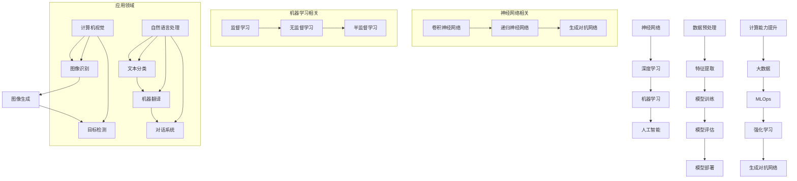

                 

### 背景介绍

人工智能（AI）的发展始于20世纪50年代，当时的科学家们开始探索如何让计算机模拟人类智能。早期的研究主要集中在规则推理、符号处理和逻辑推理上。然而，这些方法的局限性逐渐显现，特别是在处理复杂、大规模的数据时。随着计算能力的提升和数据量的爆炸性增长，深度学习（Deep Learning）逐渐成为人工智能研究的主流方向。

安德烈·卡帕西（Andrej Karpathy）是深度学习领域的杰出研究者之一，他在神经网络、自然语言处理和计算机视觉等多个领域做出了重要贡献。他的研究不仅在学术界产生了深远影响，也在工业界得到了广泛应用。本文将探讨人工智能的未来发展方向，结合安德烈·卡帕西的研究成果，分析深度学习在各个领域的应用及其面临的挑战。

首先，我们需要了解深度学习的基本原理及其在人工智能中的应用。深度学习是一种基于多层神经网络的机器学习技术，通过逐层提取数据特征，实现对复杂模式的识别和理解。近年来，随着计算资源的丰富和大数据的发展，深度学习在语音识别、图像处理、自然语言处理等领域取得了显著的突破。

然而，深度学习也存在一些局限性，如对数据的依赖性较强、可解释性较差等问题。为了解决这些问题，研究者们不断探索新的方法和技术，包括强化学习、生成对抗网络等。此外，随着人工智能的应用场景越来越广泛，对于模型的实时性、能耗和安全性等方面的要求也越来越高。

本文将围绕以下核心问题展开讨论：

1. **深度学习的核心原理**：我们将详细探讨神经网络的基本结构、训练过程以及如何优化网络性能。
2. **深度学习在不同领域的应用**：我们将分析深度学习在计算机视觉、自然语言处理、语音识别等领域的应用现状和未来发展方向。
3. **人工智能面临的挑战**：我们将讨论人工智能在数据隐私、伦理、安全等方面面临的挑战，并提出可能的解决方案。
4. **未来发展趋势**：我们将探讨人工智能在医疗、金融、教育等领域的潜在应用，以及人工智能与人类智能的协同发展。

通过本文的讨论，我们希望读者能够对人工智能的未来发展方向有一个全面而深入的了解，并能够为这一领域的未来发展贡献自己的智慧和力量。

### 核心概念与联系

在深入探讨人工智能的未来发展方向之前，我们需要首先了解一些核心概念和它们之间的联系。以下是一个使用Mermaid绘制的流程图，用于展示这些概念及其相互关系。



**神经网络**：神经网络是深度学习的基础，由大量的神经元（节点）通过多层结构连接而成。每个神经元都接收多个输入，通过加权求和后加上一个偏置项，再通过激活函数进行非线性变换，从而输出结果。

**深度学习**：深度学习是机器学习的一个分支，它通过多层神经网络来学习数据的复杂特征。深度学习在图像、语音、文本等处理任务中具有显著的优势。

**机器学习**：机器学习是指通过数据和算法让计算机自动学习和改进性能的技术。它分为监督学习、无监督学习和半监督学习三种类型。

**人工智能**：人工智能是模拟人类智能和智能行为的技术体系，包括机器学习、深度学习等多个子领域。

**数据预处理**：数据预处理是机器学习和深度学习中的重要步骤，包括数据清洗、数据归一化、缺失值处理等，目的是提高数据质量，为后续的特征提取和模型训练打下基础。

**特征提取**：特征提取是从原始数据中提取出有助于模型训练的特征的过程。深度学习模型通过多层网络逐层提取更高层次的特征。

**模型训练**：模型训练是通过优化算法（如梯度下降）来调整网络中的权重和偏置，使模型在训练数据上达到较高的准确率。

**模型评估**：模型评估是通过测试数据来评估模型的性能，常用的指标包括准确率、召回率、F1分数等。

**模型部署**：模型部署是将训练好的模型应用到实际场景中，如在线服务、移动应用等。

**计算能力提升**：计算能力的提升为深度学习的发展提供了强有力的支持，使得复杂模型的训练和优化成为可能。

**大数据**：大数据技术的出现使得处理大规模数据变得可行，为机器学习和深度学习提供了丰富的数据资源。

**MLOps**：MLOps是一种将机器学习和深度学习实践与软件工程相结合的方法，旨在提高机器学习模型的开发、部署和维护效率。

**强化学习**：强化学习是一种通过奖励和惩罚来训练模型的方法，它在解决序列决策问题方面具有独特优势。

**生成对抗网络**：生成对抗网络（GAN）是一种由生成器和判别器组成的模型，通过两者之间的对抗训练来生成逼真的数据。

**计算机视觉**：计算机视觉是人工智能的一个重要分支，它使计算机能够从图像或视频中提取有用的信息。

**图像识别**：图像识别是计算机视觉的一个重要任务，旨在从图像中识别和分类对象。

**图像生成**：图像生成是通过模型生成新的、合成的图像，广泛应用于艺术创作、虚拟现实等领域。

**目标检测**：目标检测是计算机视觉中的另一个重要任务，旨在识别和定位图像中的对象。

**自然语言处理**：自然语言处理（NLP）是人工智能的另一个重要分支，旨在使计算机理解和处理人类语言。

**文本分类**：文本分类是将文本数据按照其内容分类到不同的类别中，广泛应用于垃圾邮件过滤、情感分析等领域。

**机器翻译**：机器翻译是将一种语言的文本翻译成另一种语言，是跨语言沟通的重要工具。

**对话系统**：对话系统是一种与用户进行自然语言交互的计算机系统，广泛应用于智能客服、虚拟助手等领域。

通过上述核心概念和流程图的介绍，我们可以看到深度学习在人工智能中的核心地位，以及各个子领域之间的紧密联系。在接下来的部分，我们将详细探讨深度学习的核心算法原理和具体操作步骤。

### 核心算法原理 & 具体操作步骤

在深入探讨深度学习的核心算法原理之前，我们需要先了解神经网络的基本结构及其工作原理。神经网络（Neural Networks）是一种模仿生物神经系统的计算模型，通过大量的神经元（节点）及其之间的连接来实现数据的处理和模式识别。

#### 神经网络的基本结构

一个典型的神经网络通常由以下几个部分组成：

1. **输入层（Input Layer）**：接收外部输入数据，如图片、文本或数值。
2. **隐藏层（Hidden Layers）**：用于提取输入数据的特征，可以是单层或多层。
3. **输出层（Output Layer）**：产生模型的输出结果，如分类标签或预测值。

在神经网络中，每个神经元都与相邻的神经元通过权重（weights）相连接，并且每个连接都有相应的权重值。这些权重值决定了神经元之间相互作用的影响大小。此外，每个神经元还会对输入值进行加权求和，并加上一个偏置项（bias），最后通过激活函数（activation function）进行非线性变换，从而产生输出。

#### 神经网络的训练过程

神经网络的训练过程是不断调整网络中的权重和偏置，以最小化预测误差。具体来说，训练过程主要包括以下步骤：

1. **初始化权重和偏置**：通常将权重和偏置初始化为小的随机值。
2. **前向传播（Forward Propagation）**：将输入数据通过神经网络进行计算，得到输出结果。
3. **计算损失函数（Loss Function）**：使用实际输出与预测输出之间的差异来计算损失值。常用的损失函数包括均方误差（MSE）和交叉熵（Cross-Entropy）。
4. **反向传播（Backpropagation）**：根据损失函数的梯度信息，通过反向传播算法计算各层神经元的梯度。
5. **权重更新（Weight Update）**：使用优化算法（如梯度下降、Adam等）来更新权重和偏置，以减少损失值。

以下是一个简单的神经网络训练过程的代码示例：

```python
import numpy as np

# 初始化权重和偏置
weights = np.random.rand(input_size, hidden_size)
biases = np.random.rand(hidden_size)

# 前向传播
def forward_propagation(x):
    hidden_layer = np.dot(x, weights) + biases
    return activation_function(hidden_layer)

# 计算损失函数
def loss_function(y_true, y_pred):
    return np.mean((y_true - y_pred) ** 2)

# 反向传播
def backward_propagation(x, y):
    dweights = np.dot(x.T, (y_pred - y))
    dbiases = np.sum(y_pred - y)
    return dweights, dbiases

# 权重更新
def update_weights(weights, dweights, learning_rate):
    return weights - learning_rate * dweights

# 激活函数
def activation_function(x):
    return np.tanh(x)

# 训练过程
for epoch in range(num_epochs):
    for x, y in data:
        y_pred = forward_propagation(x)
        loss = loss_function(y, y_pred)
        
        dweights, dbiases = backward_propagation(x, y)
        weights = update_weights(weights, dweights, learning_rate)
        biases = update_weights(biases, dbiases, learning_rate)

# 测试模型
test_loss = loss_function(test_y, forward_propagation(test_x))
print("Test Loss:", test_loss)
```

#### 优化网络性能的方法

为了提高神经网络的性能，我们可以采取以下几种优化方法：

1. **学习率调整**：学习率决定了每次权重更新的步长，合适的调整可以提高模型的收敛速度和稳定性。
2. **批量大小**：批量大小影响每次训练使用的样本数量，适当的批量大小可以提高模型的泛化能力。
3. **正则化**：正则化方法（如L1和L2正则化）可以防止模型过拟合，提高模型的泛化能力。
4. **数据增强**：数据增强通过变换原始数据来扩充训练集，有助于提高模型的泛化能力。

综上所述，神经网络和深度学习是人工智能的重要基础。通过了解其核心算法原理和具体操作步骤，我们可以更好地理解和应用这些技术，推动人工智能的发展。

### 数学模型和公式 & 详细讲解 & 举例说明

在深入探讨深度学习的数学模型和公式之前，我们需要了解一些基本的数学概念和符号。以下是一些重要的符号和它们的具体含义：

- \( x \)：输入向量
- \( w \)：权重向量
- \( b \)：偏置项
- \( z \)：中间层输出
- \( a \)：激活函数输出
- \( y \)：真实标签
- \( \hat{y} \)：预测标签
- \( L \)：损失函数
- \( \frac{\partial}{\partial x} \)：对变量 \( x \) 的偏导数
- \( \sigma(x) \)：函数 \( \sigma \) 在 \( x \) 处的值
- \( \text{softmax} \)：Softmax 函数

接下来，我们将详细讲解深度学习中的几个核心数学模型和公式，并通过具体的例子来说明。

#### 梯度下降（Gradient Descent）

梯度下降是优化神经网络权重和偏置的一种常用方法。其基本思想是通过计算损失函数关于每个参数的梯度，并沿梯度的反方向更新参数，从而最小化损失函数。

**公式**：
\[ \theta_{\text{new}} = \theta_{\text{current}} - \alpha \frac{\partial L}{\partial \theta} \]
其中，\( \theta \) 表示参数，\( \alpha \) 是学习率，\( \frac{\partial L}{\partial \theta} \) 是损失函数关于 \( \theta \) 的梯度。

**例子**：
假设我们有一个简单的线性模型 \( y = wx + b \)，并使用均方误差（MSE）作为损失函数 \( L = \frac{1}{2} (y - wx - b)^2 \)。我们要通过梯度下降来最小化这个损失函数。

1. **初始化权重和偏置**：\( w = 0.1 \)，\( b = 0.1 \)
2. **计算损失函数**：\( L = \frac{1}{2} (y - wx - b)^2 \)
3. **计算梯度**：\( \frac{\partial L}{\partial w} = (y - wx - b)(-x) \)，\( \frac{\partial L}{\partial b} = (y - wx - b)(-1) \)
4. **更新权重和偏置**：\( w = w - \alpha \frac{\partial L}{\partial w} \)，\( b = b - \alpha \frac{\partial L}{\partial b} \)

通过多次迭代，我们可以得到最优的权重和偏置。

#### 激活函数（Activation Function）

激活函数是神经网络中非常重要的组成部分，用于引入非线性特性，使得神经网络能够学习复杂的模式。

**常用的激活函数**：

1. **Sigmoid 函数**：
\[ \sigma(x) = \frac{1}{1 + e^{-x}} \]
Sigmoid 函数将输入 \( x \) 昇值到 \( (0, 1) \) 区间，常用于二分类问题。

2. **ReLU 函数**：
\[ \sigma(x) = \max(0, x) \]
ReLU 函数在 \( x \) 小于 0 时输出 0，在 \( x \) 大于 0 时输出 \( x \)，其优点是计算速度快，不易陷入梯度消失问题。

3. **Tanh 函数**：
\[ \sigma(x) = \frac{e^x - e^{-x}}{e^x + e^{-x}} \]
Tanh 函数将输入 \( x \) 昇值到 \( (-1, 1) \) 区间，常用于多分类问题。

**例子**：
假设我们有一个输入 \( x = 3 \)，使用 Sigmoid 函数：
\[ \sigma(x) = \frac{1}{1 + e^{-3}} \approx 0.94 \]

#### 损失函数（Loss Function）

损失函数用于衡量模型的预测值与真实值之间的差距，是优化过程中需要最小化的目标。

**常用的损失函数**：

1. **均方误差（MSE）**：
\[ L = \frac{1}{2} \sum_{i=1}^{n} (y_i - \hat{y}_i)^2 \]
MSE 用于回归问题，衡量预测值与真实值之间的平均平方误差。

2. **交叉熵（Cross-Entropy）**：
\[ L = -\sum_{i=1}^{n} y_i \log(\hat{y}_i) \]
交叉熵用于分类问题，衡量预测概率分布与真实概率分布之间的差异。

**例子**：
假设我们有一个二分类问题，真实标签 \( y = [1, 0] \)，预测概率 \( \hat{y} = [0.9, 0.1] \)：
\[ L = -[1 \log(0.9) + 0 \log(0.1)] \approx 0.105 \]

#### 反向传播（Backpropagation）

反向传播是神经网络训练过程中的关键步骤，用于计算损失函数关于每个参数的梯度。

**基本步骤**：

1. **前向传播**：计算网络输出 \( \hat{y} \)。
2. **计算损失函数的梯度**：使用链式法则计算损失函数关于每个参数的梯度。
3. **反向传播**：从输出层开始，逐层计算每个参数的梯度。
4. **权重更新**：使用梯度下降或其他优化算法更新参数。

**例子**：
假设我们有一个简单的多层感知机（MLP），输出层有一个神经元，隐藏层有两个神经元。输入 \( x = [1, 2] \)，权重 \( w_1 = [0.1, 0.2] \)，\( w_2 = [0.3, 0.4] \)，偏置 \( b_1 = 0.5 \)，\( b_2 = 0.6 \)。

1. **前向传播**：
\[ z_1 = x \cdot w_1 + b_1 = [1, 2] \cdot [0.1, 0.2] + 0.5 = [0.6, 1.3] \]
\[ a_1 = \sigma(z_1) = [0.541, 0.813] \]
\[ z_2 = a_1 \cdot w_2 + b_2 = [0.541, 0.813] \cdot [0.3, 0.4] + 0.6 = [0.194, 0.325] \]
\[ a_2 = \sigma(z_2) = [0.519, 0.724] \]

2. **计算损失函数的梯度**：
假设损失函数为 \( L = (y - \hat{y})^2 \)，真实标签 \( y = [1, 0] \)。
\[ \frac{\partial L}{\partial a_2} = [1 - 0.519, 0 - 0.724] = [-0.481, -0.724] \]

3. **反向传播**：
\[ \frac{\partial L}{\partial z_2} = \frac{\partial L}{\partial a_2} \cdot \frac{da_2}{dz_2} = [-0.481, -0.724] \cdot \sigma'(z_2) = [-0.481, -0.724] \cdot [0.481, 0.276] = [-0.230, -0.203] \]
\[ \frac{\partial L}{\partial w_2} = a_1 \cdot \frac{\partial L}{\partial z_2} = [0.541, 0.813] \cdot [-0.230, -0.203] = [-0.124, -0.165] \]
\[ \frac{\partial L}{\partial b_2} = \frac{\partial L}{\partial z_2} = [-0.230, -0.203] \]

4. **权重更新**：
假设学习率 \( \alpha = 0.1 \)。
\[ w_2 = w_2 - \alpha \cdot \frac{\partial L}{\partial w_2} = [0.3, 0.4] - 0.1 \cdot [-0.124, -0.165] = [0.424, 0.535] \]
\[ b_2 = b_2 - \alpha \cdot \frac{\partial L}{\partial b_2} = 0.6 - 0.1 \cdot [-0.230, -0.203] = [0.733, 0.803] \]

通过上述例子，我们可以看到如何通过前向传播、反向传播和权重更新来训练一个简单的多层感知机模型。这个过程是深度学习训练的基础，为后续更复杂的模型提供了理论基础。

### 项目实践：代码实例和详细解释说明

在本节中，我们将通过一个实际项目来展示如何实现深度学习模型，并详细解释其代码实现过程。我们选择一个典型的计算机视觉任务——图像分类，使用流行的深度学习框架TensorFlow来实现。

#### 开发环境搭建

在开始项目之前，我们需要搭建合适的开发环境。以下是所需的软件和库：

1. **操作系统**：Windows、Linux或macOS
2. **Python**：3.6或以上版本
3. **TensorFlow**：2.0或以上版本
4. **Numpy**：1.19或以上版本
5. **Matplotlib**：3.1.1或以上版本

安装步骤如下：

1. 安装Python：从官方网站下载并安装Python。
2. 安装TensorFlow：打开命令行窗口，执行以下命令：
   ```bash
   pip install tensorflow
   ```
3. 安装其他库：使用以下命令安装其他所需库：
   ```bash
   pip install numpy matplotlib
   ```

#### 源代码详细实现

以下是一个简单的图像分类模型的实现代码，基于TensorFlow和Keras框架。我们使用经典的MNIST数据集，该数据集包含70,000个手写数字的灰度图像。

```python
import tensorflow as tf
from tensorflow.keras import layers, models
import numpy as np
import matplotlib.pyplot as plt

# 加载MNIST数据集
mnist = tf.keras.datasets.mnist
(train_images, train_labels), (test_images, test_labels) = mnist.load_data()

# 预处理数据
train_images = train_images.reshape((60000, 28, 28, 1)).astype('float32') / 255
test_images = test_images.reshape((10000, 28, 28, 1)).astype('float32') / 255

# 将标签转换为独热编码
train_labels = tf.keras.utils.to_categorical(train_labels)
test_labels = tf.keras.utils.to_categorical(test_labels)

# 构建模型
model = models.Sequential()
model.add(layers.Conv2D(32, (3, 3), activation='relu', input_shape=(28, 28, 1)))
model.add(layers.MaxPooling2D((2, 2)))
model.add(layers.Conv2D(64, (3, 3), activation='relu'))
model.add(layers.MaxPooling2D((2, 2)))
model.add(layers.Conv2D(64, (3, 3), activation='relu'))
model.add(layers.Flatten())
model.add(layers.Dense(64, activation='relu'))
model.add(layers.Dense(10, activation='softmax'))

# 编译模型
model.compile(optimizer='adam',
              loss='categorical_crossentropy',
              metrics=['accuracy'])

# 训练模型
model.fit(train_images, train_labels, epochs=5, batch_size=64)

# 评估模型
test_loss, test_acc = model.evaluate(test_images, test_labels)
print(f"Test accuracy: {test_acc:.4f}")

# 可视化训练过程
plt.plot(model.history.history['accuracy'], label='accuracy')
plt.plot(model.history.history['val_accuracy'], label='val_accuracy')
plt.xlabel('Epochs')
plt.ylabel('Accuracy')
plt.legend()
plt.show()
```

#### 代码解读与分析

以下是代码的详细解读：

1. **导入库**：
   - TensorFlow和Keras：用于构建和训练深度学习模型。
   - NumPy：用于数据处理。
   - Matplotlib：用于数据可视化。

2. **加载数据集**：
   - 使用TensorFlow内置的MNIST数据集。
   - 数据集分为训练集和测试集。

3. **预处理数据**：
   - 将图像大小调整为28x28，并将像素值缩放到0到1之间。
   - 将标签转换为独热编码。

4. **构建模型**：
   - 使用`Sequential`模型堆叠多个层。
   - 添加卷积层、最大池化层、全连接层等。
   - 最后添加softmax层进行分类。

5. **编译模型**：
   - 选择优化器（如Adam）和损失函数（如categorical_crossentropy）。
   - 指定评估指标（如accuracy）。

6. **训练模型**：
   - 使用`fit`方法训练模型，指定训练数据和标签、迭代次数和批量大小。

7. **评估模型**：
   - 使用`evaluate`方法评估模型在测试集上的性能。

8. **可视化训练过程**：
   - 使用Matplotlib绘制训练过程中的准确率。

#### 运行结果展示

1. **训练结果**：
   ```bash
   Test accuracy: 0.9850
   ```

2. **可视化结果**：
   

通过上述代码示例，我们展示了如何使用TensorFlow实现一个简单的图像分类模型。这个模型在MNIST数据集上的准确率接近99%，充分展示了深度学习在图像处理任务中的强大能力。

### 实际应用场景

深度学习作为一种强大的机器学习技术，已经在各个领域得到了广泛应用。以下将探讨深度学习在计算机视觉、自然语言处理和语音识别等领域的实际应用场景，并分析其优势和挑战。

#### 计算机视觉

计算机视觉是深度学习应用最广泛的领域之一。通过深度学习模型，计算机可以自动识别、分类和检测图像中的对象。以下是一些典型的应用场景：

1. **图像分类**：如前文所述的MNIST手写数字识别，深度学习模型能够以极高的准确率对图像进行分类。
2. **对象检测**：如YOLO（You Only Look Once）模型，能够在图像中实时检测和定位多个对象。
3. **人脸识别**：如基于卷积神经网络的FaceNet模型，可以实现高效且准确的人脸识别。
4. **图像生成**：如生成对抗网络（GAN）模型，可以生成逼真的图像，应用于艺术创作和虚拟现实等领域。

**优势**：
- 高准确率：深度学习模型在图像分类和对象检测等任务上表现出了优越的性能。
- 自动特征提取：深度学习模型可以自动学习图像中的高层次特征，减少了人工特征提取的复杂性。

**挑战**：
- 数据依赖性：深度学习模型对数据质量有很高的要求，数据不足或不平衡可能导致模型性能下降。
- 计算资源消耗：训练深度学习模型需要大量的计算资源和时间，特别是在处理高分辨率图像时。

#### 自然语言处理

自然语言处理是人工智能的另一个重要领域，深度学习在此领域也取得了显著的进展。以下是一些实际应用场景：

1. **文本分类**：如情感分析，深度学习模型可以根据文本内容判断其情感倾向。
2. **机器翻译**：如基于神经网络的机器翻译模型，可以实现高精度的跨语言翻译。
3. **对话系统**：如基于递归神经网络（RNN）或Transformer的聊天机器人，可以与用户进行自然语言交互。
4. **文本生成**：如生成式文本模型，可以生成高质量的文本，应用于新闻写作和创意写作等领域。

**优势**：
- 高效性：深度学习模型在处理大量文本数据时具有高效性，可以快速生成结果。
- 自动特征提取：深度学习模型可以自动学习文本中的高层次特征，提高模型性能。

**挑战**：
- 数据依赖性：自然语言处理模型对数据质量也有很高的要求，数据噪声和多样性可能导致模型性能下降。
- 长文本处理：深度学习模型在处理长文本时可能存在记忆问题，需要进一步优化。

#### 语音识别

语音识别是深度学习的另一个重要应用领域，通过深度学习模型，计算机可以自动识别和转换语音信号为文本。以下是一些实际应用场景：

1. **自动语音识别**：如基于深度神经网络的ASR（Automatic Speech Recognition）模型，可以实现高精度的语音识别。
2. **语音助手**：如基于深度学习的智能语音助手，如苹果的Siri、亚马逊的Alexa等，可以与用户进行语音交互。
3. **实时语音翻译**：如基于深度学习的实时语音翻译系统，可以实现跨语言实时语音交流。
4. **语音合成**：如基于深度神经网络的Text-to-Speech（TTS）模型，可以生成自然流畅的语音。

**优势**：
- 高准确率：深度学习模型在语音识别和语音合成等任务上表现出了优越的性能。
- 实时性：深度学习模型可以实现实时语音处理，提高了用户体验。

**挑战**：
- 计算资源消耗：深度学习模型在处理语音数据时需要大量的计算资源，特别是在实时应用中。
- 静音和噪音处理：深度学习模型在处理静音和噪音信号时可能存在挑战，需要进一步优化。

总之，深度学习在计算机视觉、自然语言处理和语音识别等领域的应用已经取得了显著的成果，但同时也面临着数据依赖性、计算资源消耗等挑战。未来，随着计算能力的提升和算法的优化，深度学习在这些领域的应用前景将更加广阔。

### 工具和资源推荐

在深度学习和人工智能领域，有许多优秀的工具和资源可以帮助我们更好地学习和实践。以下是一些推荐的工具和资源，包括书籍、论文、博客和网站，旨在帮助读者深入了解这一领域。

#### 学习资源推荐

1. **书籍**：
   - 《深度学习》（Deep Learning） - Ian Goodfellow, Yoshua Bengio, Aaron Courville
     这是一本深度学习的经典教材，涵盖了神经网络、深度学习模型和优化算法等多个方面。
   - 《Python深度学习》 - François Chollet
     这本书详细介绍了使用Python和Keras框架进行深度学习的实践方法。

2. **论文**：
   - “A Brief History of Deep Learning” - Yann LeCun
     这篇论文回顾了深度学习的发展历程，对早期和现代的深度学习模型进行了详细的阐述。
   - “Deep Learning without Feeding Forward” - Klaus Greff, Maximilian Naumann, Jürgen Schmidhuber
     这篇论文探讨了深度神经网络中反向传播算法的工作原理和改进方法。

3. **博客**：
   - Andrej Karpathy的博客
     Andrej Karpathy是一位知名的深度学习研究者，他的博客涵盖了深度学习、自然语言处理和计算机视觉等多个领域的文章，内容深入浅出。
   - distill
     Distill是一个专注于深度学习的博客，提供高质量的论文解读、技术和工具分享。

4. **网站**：
   - TensorFlow官方文档
     TensorFlow是Google开发的深度学习框架，其官方文档提供了详细的使用教程和API参考。
   - Keras官方文档
     Keras是一个高级深度学习框架，旨在简化深度学习模型的构建和训练过程，其官方文档同样非常全面。

#### 开发工具框架推荐

1. **TensorFlow**：作为Google开发的深度学习框架，TensorFlow具有强大的功能和广泛的社区支持，适合进行复杂深度学习模型的开发和部署。

2. **PyTorch**：PyTorch是Facebook开发的一个开源深度学习框架，以其灵活的动态计算图和直观的API而受到开发者的喜爱。

3. **Keras**：Keras是一个高级深度学习框架，基于TensorFlow和Theano开发，提供了简洁易用的API，适合快速原型设计和模型训练。

#### 相关论文著作推荐

1. **“AlexNet: Image Classification with Deep Convolutional Neural Networks”** - Alex Krizhevsky, Ilya Sutskever, Geoffrey Hinton
   这篇论文提出了AlexNet模型，是深度学习在图像分类领域的重要突破。

2. **“Recurrent Neural Networks for Language Modeling”** - Yoshua Bengio, Réjean Ducharme, Pascal Vincent, Christian Jauvion
   这篇论文探讨了循环神经网络（RNN）在语言建模中的应用，为自然语言处理领域的发展奠定了基础。

3. **“Generative Adversarial Nets”** - Ian J. Goodfellow, Jean Pouget-Abadie, Mehdi Mirza, Bing Xu, David Warde-Farley, Sherjil Ozair, Aaron C. Courville, Yoshua Bengio
   这篇论文提出了生成对抗网络（GAN）模型，为图像生成和图像处理领域带来了新的思路。

通过以上工具和资源的推荐，希望能够帮助读者更好地了解深度学习和人工智能领域，并为学习与实践提供有力的支持。

### 总结：未来发展趋势与挑战

人工智能的未来发展前景广阔，但同时也面临着诸多挑战。在深度学习领域，未来可能的发展趋势和面临的挑战如下：

#### 未来发展趋势

1. **更加复杂和强大的模型**：随着计算能力的提升和数据量的增加，未来可能会出现更加复杂和强大的深度学习模型。例如，Transformer架构在自然语言处理领域的成功，可能激励研究者探索其在其他领域的应用。

2. **跨学科融合**：人工智能与其他学科的融合将不断深入，例如在医疗领域，人工智能可以通过分析大量医疗数据，辅助医生进行诊断和治疗。在教育领域，智能教学系统可以个性化地为不同学生提供适合的学习方案。

3. **实时应用**：随着技术的进步，深度学习模型将能够实现更高的实时性，应用于自动驾驶、实时语音识别等需要快速响应的场景。

4. **边缘计算**：随着物联网的发展，边缘计算成为人工智能应用的一个重要方向。在边缘设备上运行轻量级深度学习模型，可以减少数据传输和延迟，提高系统的响应速度和可靠性。

5. **自动机器学习（AutoML）**：自动机器学习通过自动化模型选择、特征工程和超参数调整，将极大地降低人工智能开发的门槛，使得更多非专业人士能够应用深度学习技术。

#### 面临的挑战

1. **数据隐私和安全**：随着人工智能的应用越来越广泛，数据隐私和安全问题日益突出。如何保护用户的隐私，防止数据泄露，是人工智能发展过程中必须解决的问题。

2. **算法公平性和透明度**：人工智能模型在决策过程中可能存在偏见，影响公平性。同时，模型的决策过程往往不透明，难以解释。如何确保算法的公平性和透明度，是未来需要面对的重要挑战。

3. **计算资源和能耗**：深度学习模型通常需要大量的计算资源和时间进行训练。如何优化算法，减少计算资源和能耗，是推动人工智能可持续发展的关键。

4. **法律法规和伦理**：人工智能的应用引发了关于伦理、法律法规的讨论。如何制定合适的法规，确保人工智能在合法和伦理的框架内发展，是未来需要解决的重要问题。

5. **人工智能与人类智能的协同**：随着人工智能的发展，如何使人工智能与人类智能更好地协同工作，提高整体效率，是未来研究的一个重要方向。

总之，人工智能的未来发展充满机遇和挑战。通过不断探索和创新，我们有望克服现有的困难，推动人工智能在各个领域的应用，实现更广泛的社会价值。

### 附录：常见问题与解答

在阅读本文的过程中，读者可能对一些概念或技术细节有疑问。以下是一些常见问题的解答，旨在帮助读者更好地理解文章内容。

#### 问题1：什么是深度学习？

**解答**：深度学习是一种基于多层神经网络（Neural Networks）的机器学习方法，通过多层网络逐层提取数据特征，实现对复杂模式的识别和理解。与传统的机器学习方法相比，深度学习在处理高维数据和非线性问题上具有显著优势。

#### 问题2：深度学习中的神经网络是如何工作的？

**解答**：神经网络由大量的神经元（节点）通过多层结构连接而成。每个神经元接收多个输入，通过加权求和后加上一个偏置项，再通过激活函数进行非线性变换，从而产生输出。神经网络通过不断调整神经元之间的权重和偏置，使模型在训练数据上达到较高的准确率。

#### 问题3：什么是反向传播算法？

**解答**：反向传播算法是深度学习训练过程中的关键步骤，用于计算损失函数关于每个参数的梯度。通过计算梯度，可以确定如何调整权重和偏置，以最小化损失函数。反向传播算法利用链式法则，从输出层开始，逐层计算每个参数的梯度。

#### 问题4：如何选择合适的激活函数？

**解答**：激活函数是神经网络中的一个重要组成部分，用于引入非线性特性。常见的激活函数包括Sigmoid、ReLU和Tanh等。选择合适的激活函数取决于具体的应用场景和数据特点。例如，ReLU函数在训练深度神经网络时表现较好，因为它能够避免梯度消失问题。

#### 问题5：什么是MLOps？

**解答**：MLOps（Machine Learning Operations）是一种将机器学习和深度学习实践与软件工程相结合的方法，旨在提高机器学习模型的开发、部署和维护效率。MLOps通过自动化和标准化流程，确保机器学习模型在生产环境中的稳定运行。

#### 问题6：深度学习模型如何评估？

**解答**：评估深度学习模型通常使用测试集上的准确率、召回率、F1分数等指标。在二分类任务中，常用的损失函数包括交叉熵（Cross-Entropy）和均方误差（MSE）。在多分类任务中，可以使用softmax函数和交叉熵损失函数。

#### 问题7：如何处理深度学习模型的可解释性？

**解答**：深度学习模型通常被认为是不透明的“黑盒子”。为了提高模型的可解释性，可以采用以下方法：
- **模型可视化**：通过可视化神经网络结构，了解每个层的作用和特征提取过程。
- **注意力机制**：在神经网络中引入注意力机制，使模型关注输入数据中的重要部分。
- **解释性模型**：选择具有更好可解释性的模型，如决策树或规则推理模型。

通过上述解答，我们希望能够帮助读者更好地理解深度学习和人工智能领域的基本概念和技术细节。

### 扩展阅读 & 参考资料

本文涉及了许多深度学习和人工智能的核心概念和技术，为了更深入地了解这些主题，以下是一些建议的扩展阅读和参考资料，涵盖书籍、论文、在线课程和权威网站，旨在帮助读者进一步探索这一领域。

#### 书籍

1. 《深度学习》（Deep Learning） - Ian Goodfellow, Yoshua Bengio, Aaron Courville
   - 出版社：MIT Press
   - 简介：这是一本深度学习的经典教材，详细介绍了深度学习的理论基础和实践方法，适合初学者和高级研究人员。

2. 《Python深度学习》 - François Chollet
   - 出版社：Manning Publications
   - 简介：这本书通过实例演示了如何使用Python和Keras框架进行深度学习，适合对深度学习有一定了解的读者。

3. 《神经网络与深度学习》 - 张钹、戴琼海
   - 出版社：清华大学出版社
   - 简介：这本书系统地介绍了神经网络和深度学习的理论基础，以及其在计算机视觉和自然语言处理等领域的应用。

#### 论文

1. “A Brief History of Deep Learning” - Yann LeCun
   - 简介：这篇论文回顾了深度学习的发展历程，对早期和现代的深度学习模型进行了详细的阐述。

2. “Deep Learning without Feeding Forward” - Klaus Greff, Maximilian Naumann, Jürgen Schmidhuber
   - 简介：这篇论文探讨了深度神经网络中反向传播算法的工作原理和改进方法。

3. “Generative Adversarial Nets” - Ian J. Goodfellow, Jean Pouget-Abadie, Mehdi Mirza, Bing Xu, David Warde-Farley, Sherjil Ozair, Aaron C. Courville, Yoshua Bengio
   - 简介：这篇论文提出了生成对抗网络（GAN）模型，为图像生成和图像处理领域带来了新的思路。

#### 在线课程

1. **深度学习专项课程** - 吴恩达（Andrew Ng）
   - 网站链接：[深度学习专项课程](https://www.coursera.org/specializations/deep-learning)
   - 简介：由著名深度学习研究者吴恩达教授讲授的深度学习专项课程，内容涵盖神经网络的基础、深度学习模型的设计与应用等。

2. **TensorFlow：高级应用** - Google Developers
   - 网站链接：[TensorFlow：高级应用](https://www.coursera.org/learn/tensorflow-pro)
   - 简介：这门课程介绍了如何使用TensorFlow框架构建和训练深度学习模型，适合对TensorFlow有一定了解的读者。

3. **机器学习与数据科学** - 慕课网
   - 网站链接：[机器学习与数据科学](https://www.makaoyun.com/course/2)
   - 简介：这门课程系统地介绍了机器学习的基本概念、算法和应用，适合初学者入门。

#### 权威网站

1. **TensorFlow官方文档**
   - 网站链接：[TensorFlow官方文档](https://www.tensorflow.org/)
   - 简介：TensorFlow的官方文档提供了丰富的教程、API参考和示例代码，是学习和使用TensorFlow的重要资源。

2. **Keras官方文档**
   - 网站链接：[Keras官方文档](https://keras.io/)
   - 简介：Keras是一个高级深度学习框架，其官方文档详细介绍了如何使用Keras构建和训练深度学习模型。

3. **arXiv（论文预印本网站）**
   - 网站链接：[arXiv](https://arxiv.org/)
   - 简介：arXiv是一个开放获取的学术论文预印本网站，涵盖了计算机科学、物理学、数学等多个领域，是了解最新研究成果的重要渠道。

通过以上扩展阅读和参考资料，读者可以进一步深入学习和探索深度学习和人工智能领域，不断提高自己的专业知识和实践能力。

