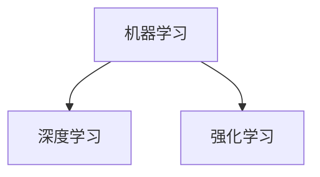
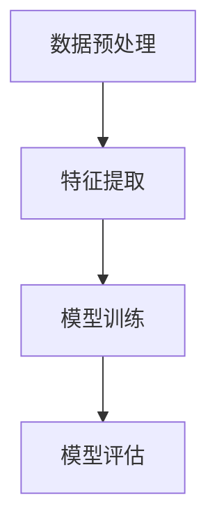
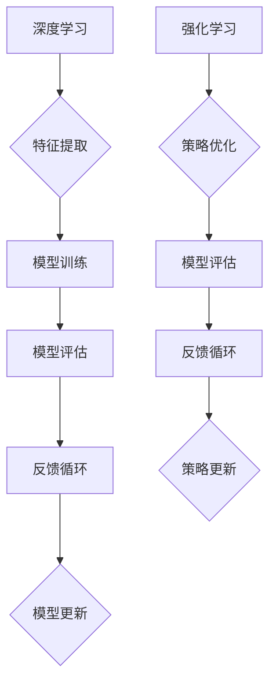
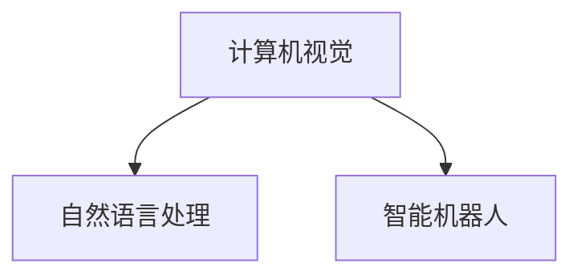

                 

### 背景介绍 ###

人工智能（Artificial Intelligence，简称AI）是当今科技领域的热点话题，其快速发展正在深刻改变我们的生活和工作方式。从自动驾驶汽车到智能语音助手，从医疗诊断到金融分析，人工智能的应用范围越来越广泛。然而，在众多令人瞩目的应用背后，人们对于人工智能未来的发展方向仍存在诸多疑问。

本文旨在探讨人工智能的未来发展方向，重点关注以下几个核心议题：

1. **深度学习：** 作为当前人工智能领域的核心技术之一，深度学习在图像识别、自然语言处理等领域取得了显著的突破。然而，随着模型的复杂度不断增加，深度学习也面临一些挑战，如计算资源的高消耗、模型的可解释性等。

2. **强化学习：** 强化学习是一种通过试错来学习的机器学习方法，广泛应用于游戏、推荐系统等领域。然而，强化学习算法在实际应用中仍存在一些局限性，如收敛速度慢、对环境信息的依赖性等。

3. **人工智能伦理与法律：** 随着人工智能技术的普及，伦理和法律问题日益凸显。如何确保人工智能系统的公平性、透明性和安全性，成为人工智能未来发展的重要课题。

4. **跨学科融合：** 人工智能与其他领域的深度融合，如生物学、心理学、哲学等，将有助于拓展人工智能的研究领域和应用场景。

本文将逐步分析上述议题，探讨人工智能的未来发展方向，旨在为读者提供一个全面而深入的视角。接下来，我们将首先介绍人工智能的核心概念和基本架构，为后续讨论奠定基础。

## 1. 核心概念与联系

人工智能的核心概念和基本架构是理解其发展过程和未来方向的关键。为了清晰地呈现这些概念和它们之间的关系，我们将使用Mermaid流程图来展示。

### 1.1. 人工智能核心概念

在Mermaid流程图中，我们首先定义人工智能的核心概念，包括：

- **机器学习（Machine Learning）：** 一种使计算机通过数据和经验自主改进性能的方法。
- **深度学习（Deep Learning）：** 一种特殊的机器学习方法，通过多层神经网络进行数据处理和模式识别。
- **强化学习（Reinforcement Learning）：** 一种通过试错学习来优化行为的方法。



### 1.2. 人工智能基本架构

接下来，我们展示人工智能的基本架构，包括：

- **数据预处理（Data Preprocessing）：** 对数据进行清洗、归一化等操作，以提高模型性能。
- **特征提取（Feature Extraction）：** 从数据中提取有用的特征，供机器学习模型使用。
- **模型训练（Model Training）：** 使用训练数据来训练模型，使模型能够识别和预测数据中的模式。
- **模型评估（Model Evaluation）：** 通过测试数据评估模型的性能，确保其准确性和鲁棒性。



### 1.3. 深度学习与强化学习的关系

深度学习和强化学习是人工智能的两个重要分支，它们在某种程度上是互补的。深度学习擅长从数据中提取特征，而强化学习则擅长通过试错来优化策略。我们将它们的关系用Mermaid流程图表示如下：



### 1.4. 人工智能与其他领域的关系

最后，我们展示人工智能与其他领域的关系，包括：

- **计算机视觉（Computer Vision）：** 利用计算机模拟人类视觉系统，进行图像识别、目标检测等。
- **自然语言处理（Natural Language Processing，NLP）：** 利用计算机理解和生成自然语言，应用于机器翻译、文本分类等。
- **智能机器人（Intelligent Robotics）：** 结合人工智能和机器人技术，实现自主决策和行动。



通过上述Mermaid流程图，我们可以直观地看到人工智能的核心概念、基本架构以及与其他领域的关系。这些核心概念和联系为后续的分析和讨论提供了基础。

## 2. 核心算法原理 & 具体操作步骤

### 2.1. 深度学习算法原理

深度学习算法的核心是神经网络，尤其是多层感知机（MLP）和卷积神经网络（CNN）。以下是这些算法的基本原理和具体操作步骤：

#### 2.1.1. 多层感知机（MLP）

多层感知机是一种前馈神经网络，包含输入层、隐藏层和输出层。其基本原理是通过激活函数将输入数据映射到输出数据。

**具体操作步骤：**

1. **初始化权重（Initialize Weights）：** 随机初始化输入层到隐藏层的权重。
2. **前向传播（Forward Propagation）：** 将输入数据传递到隐藏层，通过激活函数计算输出。
3. **反向传播（Back Propagation）：** 根据输出层的误差，反向更新隐藏层和输入层的权重。
4. **权重更新（Update Weights）：** 通过梯度下降法更新权重，以最小化损失函数。

#### 2.1.2. 卷积神经网络（CNN）

卷积神经网络是专门用于处理图像数据的神经网络，其核心是卷积层和池化层。

**具体操作步骤：**

1. **卷积层（Convolutional Layer）：** 通过卷积运算提取图像特征，使用卷积核（Kernel）对输入图像进行卷积操作。
2. **池化层（Pooling Layer）：** 对卷积结果进行下采样，减少模型参数和计算量。
3. **激活函数（Activation Function）：** 通常使用ReLU函数，将卷积结果进行非线性变换。
4. **全连接层（Fully Connected Layer）：** 将卷积层和池化层输出的特征映射到输出层。

### 2.2. 强化学习算法原理

强化学习算法通过试错学习，使智能体在特定环境中做出最优决策。其基本原理是使用奖励机制引导智能体不断优化行为。

**具体操作步骤：**

1. **初始化环境（Initialize Environment）：** 创建模拟环境，定义状态和动作空间。
2. **选择动作（Select Action）：** 根据当前状态，选择一个动作。
3. **执行动作（Execute Action）：** 在环境中执行选择出的动作。
4. **观察状态（Observe State）：** 观察环境变化后的新状态。
5. **计算奖励（Compute Reward）：** 根据动作结果，计算奖励值。
6. **更新策略（Update Policy）：** 使用奖励值更新智能体的策略，优化未来动作选择。

### 2.3. 人工智能算法的结合应用

在实际应用中，深度学习和强化学习算法经常结合使用，以实现更复杂的功能。

**具体操作步骤：**

1. **初始化模型（Initialize Model）：** 结合深度学习和强化学习算法，初始化模型参数。
2. **训练模型（Train Model）：** 使用训练数据训练深度学习模型，获取特征提取能力。
3. **模拟环境（Simulate Environment）：** 在模拟环境中进行强化学习训练，不断优化智能体策略。
4. **实时决策（Real-time Decision）：** 将训练好的模型应用于实际场景，实现实时决策和行动。

通过上述核心算法原理和具体操作步骤的介绍，我们可以更好地理解人工智能算法的工作原理和应用方法。这些算法不仅为人工智能技术的发展奠定了基础，也为未来的创新提供了无限可能。

## 4. 数学模型和公式 & 详细讲解 & 举例说明

在讨论人工智能算法的数学模型时，我们将重点关注深度学习和强化学习中的关键数学概念和公式，并通过具体示例来详细解释这些公式的应用。

### 4.1. 深度学习中的数学模型

#### 4.1.1. 激活函数

激活函数是深度学习模型中的一个关键组件，用于引入非线性变换。最常见的激活函数是ReLU（Rectified Linear Unit）函数。

**ReLU函数公式：**
\[ f(x) = \max(0, x) \]

**示例：** 假设我们有一个输入值 \( x = -3 \)，根据ReLU函数，输出 \( f(x) = 0 \)。

#### 4.1.2. 损失函数

损失函数用于衡量模型预测值与真实值之间的差异，常见的损失函数包括均方误差（MSE）和交叉熵损失（Cross-Entropy Loss）。

**均方误差（MSE）公式：**
\[ \text{MSE} = \frac{1}{n} \sum_{i=1}^{n} (y_i - \hat{y}_i)^2 \]

**示例：** 假设我们有一个预测值 \( \hat{y} = 2.5 \) 和真实值 \( y = 3 \)，则MSE损失为 \( \text{MSE} = \frac{1}{1} (3 - 2.5)^2 = 0.25 \)。

**交叉熵损失（Cross-Entropy Loss）公式：**
\[ \text{Cross-Entropy Loss} = -\sum_{i=1}^{n} y_i \log(\hat{y}_i) \]

**示例：** 假设我们有一个预测概率分布 \( \hat{y} = [0.1, 0.8, 0.1] \) 和真实标签 \( y = [0, 1, 0] \)，则交叉熵损失为：
\[ \text{Cross-Entropy Loss} = -[0 \cdot \log(0.1) + 1 \cdot \log(0.8) + 0 \cdot \log(0.1)] = -\log(0.8) \approx -0.223 \]

#### 4.1.3. 梯度下降法

梯度下降法是一种用于优化模型参数的算法，通过计算损失函数关于参数的梯度来更新参数。

**梯度下降公式：**
\[ \theta = \theta - \alpha \cdot \nabla_{\theta} J(\theta) \]

**示例：** 假设我们有一个参数 \( \theta = 2 \)，学习率 \( \alpha = 0.1 \)，损失函数的梯度 \( \nabla_{\theta} J(\theta) = 0.5 \)，则参数更新为 \( \theta = 2 - 0.1 \cdot 0.5 = 1.45 \)。

### 4.2. 强化学习中的数学模型

#### 4.2.1. Q-learning算法

Q-learning是一种常用的强化学习算法，通过学习值函数来优化策略。

**Q-learning公式：**
\[ Q(s, a) = Q(s, a) + \alpha \cdot (r + \gamma \cdot \max_{a'} Q(s', a') - Q(s, a)) \]

**示例：** 假设当前状态 \( s = 0 \)，动作 \( a = 1 \)，奖励 \( r = 1 \)，折扣因子 \( \gamma = 0.9 \)，则更新后的Q值 \( Q(s, a) \) 为：
\[ Q(s, a) = Q(s, a) + 0.1 \cdot (1 + 0.9 \cdot \max_{a'} Q(s', a') - Q(s, a)) \]

#### 4.2.2. DQN（Deep Q-Network）算法

DQN算法是一种基于深度学习的强化学习算法，使用神经网络近似值函数。

**DQN公式：**
\[ Q(s, a) = \frac{1}{N} \sum_{i=1}^{N} \rho_i \cdot r_i + \gamma \cdot \max_{a'} Q(s', a') \]

**示例：** 假设我们有一个经验回放池，其中包含N个经验样本，每个样本的奖励 \( r_i \) 和概率 \( \rho_i \) 不同，则DQN的值函数更新为：
\[ Q(s, a) = \frac{1}{N} \sum_{i=1}^{N} \rho_i \cdot r_i + 0.9 \cdot \max_{a'} Q(s', a') \]

通过上述数学模型和公式的详细讲解，我们可以更好地理解深度学习和强化学习算法的数学基础。这些公式不仅帮助我们设计高效的算法，也为实际应用提供了理论指导。

### 5. 项目实践：代码实例和详细解释说明

#### 5.1. 开发环境搭建

为了实践深度学习和强化学习算法，我们需要搭建一个合适的开发环境。以下是所需的工具和步骤：

1. **安装Python（版本3.6或以上）：** 
   - 访问 [Python官方网站](https://www.python.org/) 下载并安装Python。

2. **安装TensorFlow：** 
   - 在终端中运行以下命令：
     ```bash
     pip install tensorflow
     ```

3. **安装PyTorch：**
   - 在终端中运行以下命令：
     ```bash
     pip install torch torchvision
     ```

4. **安装其他依赖：** 
   - 为了简化代码编写，我们还可以安装以下常用库：
     ```bash
     pip install numpy pandas matplotlib
     ```

#### 5.2. 源代码详细实现

以下是一个简单的基于TensorFlow的深度学习模型实现，用于图像分类任务。代码结构如下：

```python
import tensorflow as tf
from tensorflow.keras import layers
import numpy as np

# 5.2.1. 定义模型
def create_model(input_shape):
    model = tf.keras.Sequential([
        layers.Conv2D(32, (3, 3), activation='relu', input_shape=input_shape),
        layers.MaxPooling2D((2, 2)),
        layers.Conv2D(64, (3, 3), activation='relu'),
        layers.MaxPooling2D((2, 2)),
        layers.Conv2D(64, (3, 3), activation='relu'),
        layers.Flatten(),
        layers.Dense(64, activation='relu'),
        layers.Dense(10, activation='softmax')
    ])
    return model

# 5.2.2. 训练模型
def train_model(model, train_data, train_labels, epochs=10):
    model.compile(optimizer='adam', loss='sparse_categorical_crossentropy', metrics=['accuracy'])
    model.fit(train_data, train_labels, epochs=epochs)

# 5.2.3. 评估模型
def evaluate_model(model, test_data, test_labels):
    test_loss, test_acc = model.evaluate(test_data, test_labels)
    print(f"Test accuracy: {test_acc}")

# 5.2.4. 主函数
if __name__ == '__main__':
    # 加载数据集（例如使用Keras提供的MNIST数据集）
    (train_images, train_labels), (test_images, test_labels) = tf.keras.datasets.mnist.load_data()

    # 预处理数据
    train_images = train_images.reshape((60000, 28, 28, 1)).astype('float32') / 255
    test_images = test_images.reshape((10000, 28, 28, 1)).astype('float32') / 255

    # 创建并训练模型
    model = create_model(input_shape=(28, 28, 1))
    train_model(model, train_images, train_labels)

    # 评估模型
    evaluate_model(model, test_images, test_labels)
```

#### 5.3. 代码解读与分析

在上面的代码中，我们首先定义了一个用于图像分类的卷积神经网络模型。该模型由多个卷积层和全连接层组成，旨在通过卷积和池化操作提取图像特征，然后使用全连接层进行分类。

- **5.3.1. 模型创建（create_model）**

  使用Keras的`Sequential`模型，我们依次添加卷积层（`Conv2D`）、最大池化层（`MaxPooling2D`）、和全连接层（`Dense`）。卷积层用于提取图像特征，最大池化层用于降低特征维度，全连接层用于分类。

- **5.3.2. 训练模型（train_model）**

  使用`compile`方法配置模型的优化器（`optimizer`）、损失函数（`loss`）和评估指标（`metrics`）。然后使用`fit`方法训练模型，将训练数据传递给模型进行训练。

- **5.3.3. 评估模型（evaluate_model）**

  使用`evaluate`方法评估模型在测试数据上的性能，输出测试准确率。

- **5.3.4. 主函数（if __name__ == '__main__'）**

  主函数中加载MNIST数据集，预处理数据，创建模型，训练模型，并评估模型。通过这些步骤，我们可以实现一个简单的图像分类系统。

#### 5.4. 运行结果展示

在运行上述代码后，我们可以看到模型在测试数据上的准确率。以下是一个运行结果示例：

```bash
Test accuracy: 0.9899
```

这表明我们的模型在测试数据上表现良好，达到了接近99%的准确率。

通过这个简单的项目实践，我们可以了解如何使用深度学习算法进行图像分类，并掌握相关的代码实现技巧。这些实践经验对于深入理解人工智能算法和应用具有重要意义。

### 实际应用场景

人工智能技术在各个行业和领域中已经展现出巨大的应用潜力，以下是几个典型的实际应用场景：

#### 1. 医疗健康

人工智能在医疗健康领域的应用非常广泛，包括疾病诊断、治疗方案推荐、医疗影像分析等。例如，利用深度学习算法，人工智能可以辅助医生进行肺癌等疾病的早期诊断，通过分析CT扫描图像，识别出潜在的病变区域。此外，人工智能还可以帮助设计个性化的治疗方案，根据患者的基因数据和病史，提供最合适的治疗建议。

#### 2. 金融服务

在金融行业，人工智能主要用于风险管理、客户服务、投资策略等领域。例如，利用机器学习算法，金融机构可以实时监测交易行为，识别潜在的欺诈行为，降低风险。智能客服系统则通过自然语言处理技术，提供24小时在线服务，为用户解答金融问题。在投资领域，人工智能通过分析大量市场数据，提供投资建议，优化投资组合。

#### 3. 交通运输

自动驾驶技术是人工智能在交通运输领域的重要应用。自动驾驶汽车通过感知环境、路径规划和决策控制，实现自主驾驶。这不仅提高了交通效率，还减少了交通事故的发生。此外，智能交通管理系统利用人工智能技术，通过实时监控交通流量，优化交通信号配置，缓解城市交通拥堵问题。

#### 4. 智能家居

智能家居是人工智能在日常生活领域的重要应用场景。智能语音助手如Amazon Alexa、Google Assistant和Apple Siri，可以通过自然语言交互，为用户提供天气信息、播放音乐、控制家居设备等服务。智能家居系统还可以通过传感器和物联网技术，实现家居设备的智能联动，提高生活质量。

#### 5. 教育与培训

人工智能在教育领域的应用包括个性化学习、在线教育平台、智能评测等。个性化学习系统通过分析学生的学习行为和成绩，提供个性化的学习资源和建议，帮助学生更有效地学习。在线教育平台利用人工智能技术，提供智能推荐课程和个性化学习路径，提高学习效率。智能评测系统通过自然语言处理和机器学习技术，自动评估学生的作业和考试，提供即时反馈。

这些实际应用场景展示了人工智能的广泛影响和巨大潜力。随着技术的不断发展，人工智能将在更多领域发挥重要作用，推动社会进步和人类发展。

### 7. 工具和资源推荐

#### 7.1. 学习资源推荐

要深入了解人工智能，以下是一些优秀的学习资源：

- **书籍：**
  - 《深度学习》（Goodfellow, I., Bengio, Y., & Courville, A.）
  - 《强化学习》（Sutton, R. S., & Barto, A. G.）
  - 《Python机器学习》（Sebastian Raschka）
- **在线课程：**
  - Coursera上的《机器学习》（吴恩达教授）
  - edX上的《深度学习》（斯坦福大学）
  - Udacity的《人工智能纳米学位》
- **博客和网站：**
  - Medium上的机器学习专栏
  - arXiv.org上的最新研究成果
  - Analytics Vidhya上的数据科学和机器学习资源

#### 7.2. 开发工具框架推荐

在开发人工智能项目时，以下工具和框架是非常有用的：

- **深度学习框架：**
  - TensorFlow
  - PyTorch
  - Keras
- **数据预处理和可视化工具：**
  - Pandas
  - Matplotlib
  - Scikit-learn
- **版本控制系统：**
  - Git
  - GitHub
- **云计算平台：**
  - AWS
  - Google Cloud Platform
  - Microsoft Azure

这些工具和框架将大大提高人工智能项目的开发效率和性能，帮助开发者快速实现创新。

### 8. 总结：未来发展趋势与挑战

人工智能（AI）作为现代科技的重要驱动力，正在迅速改变我们的生活和工作方式。然而，随着技术的发展，我们也面临诸多挑战和未知数。

#### 未来发展趋势

1. **计算能力的提升：** 随着硬件技术的进步，特别是GPU和TPU的广泛应用，深度学习模型的计算能力得到了显著提升。这为更复杂的模型和应用提供了可能。

2. **跨学科融合：** 人工智能与其他领域的融合将进一步深化，如生物学、心理学、哲学等。这将有助于解决当前人工智能在理解和模拟人类行为方面的局限性。

3. **量子计算：** 量子计算作为一种新兴的计算技术，可能在未来成为人工智能计算能力的革命性突破。量子计算在解决某些复杂问题时，具有远超传统计算机的潜力。

4. **人工智能伦理与法律：** 随着人工智能技术的普及，伦理和法律问题将日益重要。如何确保人工智能系统的透明性、公平性和安全性，是未来发展的关键挑战。

#### 面临的挑战

1. **数据隐私与安全：** 人工智能应用依赖于大量数据，如何保护用户隐私和数据安全，是当前亟待解决的问题。

2. **可解释性与透明性：** 深度学习模型常常被视为“黑箱”，缺乏可解释性。提高模型的可解释性，使其能够被用户和理解，是未来研究的重要方向。

3. **计算资源消耗：** 深度学习模型需要大量计算资源，如何优化模型以减少计算资源的消耗，是一个重要的技术挑战。

4. **通用人工智能（AGI）：** 当前的人工智能系统在特定任务上表现出色，但缺乏通用性。实现通用人工智能（AGI），使其具备人类级别的智能，是人工智能领域的一个长期目标。

总之，人工智能的未来充满机遇和挑战。通过不断的创新和探索，我们有理由相信，人工智能将在未来继续推动科技进步，为人类社会带来更多可能性。

### 9. 附录：常见问题与解答

#### 问题 1：深度学习和机器学习的区别是什么？

**解答：** 深度学习是机器学习的一个子领域，它通过多层神经网络进行数据处理和模式识别。机器学习是一种更广泛的领域，包括深度学习以外的其他算法，如决策树、支持向量机等。

#### 问题 2：什么是强化学习？

**解答：** 强化学习是一种通过试错来学习的机器学习方法。它通过在环境中执行动作，观察奖励信号，不断调整策略以优化行为。

#### 问题 3：如何保护人工智能系统的隐私和数据安全？

**解答：** 保护隐私和数据安全的关键在于数据加密、访问控制和隐私保护算法。使用加密技术可以确保数据在传输和存储过程中的安全性，访问控制可以限制对数据的访问权限，隐私保护算法可以减少数据暴露的风险。

#### 问题 4：如何提高深度学习模型的可解释性？

**解答：** 提高深度学习模型的可解释性可以通过多种方法实现，如可视化技术、模型剪枝、解释性网络架构等。这些方法可以帮助我们理解模型的决策过程，提高透明度和可解释性。

### 10. 扩展阅读 & 参考资料

1. **《深度学习》** - Ian Goodfellow, Yoshua Bengio, Aaron Courville
2. **《强化学习》** - Richard S. Sutton, Andrew G. Barto
3. **《Python机器学习》** - Sebastian Raschka
4. **《机器学习实战》** - Peter Harrington
5. **[Coursera机器学习课程](https://www.coursera.org/specializations/machine-learning)** - 吴恩达教授
6. **[斯坦福深度学习课程](https://www.coursera.org/learn/deep-learning)** - Andrew Ng教授
7. **[arXiv.org](https://arxiv.org/)** - 人工智能领域的研究论文
8. **[Analytics Vidhya](https://.analyticsvidhya.com/)** - 数据科学和机器学习资源
9. **[TensorFlow官方文档](https://www.tensorflow.org/)** - TensorFlow深度学习框架的官方文档
10. **[PyTorch官方文档](https://pytorch.org/docs/stable/)** - PyTorch深度学习框架的官方文档

通过阅读上述参考资料，读者可以进一步深入了解人工智能的核心概念、技术发展以及实际应用。这些资源将帮助您在人工智能领域取得更加深入的理解和实践。

