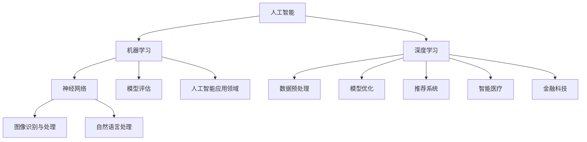

                 

### 文章标题

> 关键词：人工智能、发展机遇、技术趋势、未来展望、计算机科学、算法原理

> 摘要：本文将深入探讨人工智能领域的未来发展趋势与机遇，从技术原理、核心算法、数学模型到实际应用，全面分析人工智能在各个行业中的潜在影响。通过逐步推理和分析，我们希望能够为读者提供一份关于人工智能未来的权威指南。

### 1. 背景介绍

自20世纪50年代人工智能（Artificial Intelligence，简称AI）这一概念诞生以来，它便引起了全球范围内的广泛关注和深入研究。人工智能是计算机科学的一个分支，旨在通过算法和计算模型模拟人类智能，实现机器的自我学习和智能决策。

在过去几十年里，随着计算能力的提升、大数据的积累和算法的创新，人工智能技术取得了显著的进展。从早期的规则推理和知识表示，到现代的深度学习和神经网络，人工智能在各个领域都展现出了强大的应用潜力。

目前，人工智能已经成为全球科技竞争的焦点。谷歌、亚马逊、微软、IBM等科技巨头都在积极布局人工智能领域，投资研发和应用创新。同时，各国政府也纷纷出台政策，支持人工智能的研究和产业化。在这样的背景下，人工智能的未来发展机遇显得尤为重要。

本文将从以下几个方面展开讨论：

1. **核心概念与联系**：介绍人工智能中的关键概念和它们之间的联系。
2. **核心算法原理**：探讨当前主流的人工智能算法及其工作原理。
3. **数学模型与公式**：解析人工智能算法背后的数学模型和公式。
4. **项目实践**：通过实际项目实例，展示人工智能的应用。
5. **实际应用场景**：分析人工智能在不同行业中的实际应用。
6. **工具和资源推荐**：推荐学习人工智能的资源和开发工具。
7. **未来发展趋势与挑战**：展望人工智能的未来发展，并探讨面临的挑战。

### 2. 核心概念与联系

在深入探讨人工智能的核心算法和数学模型之前，有必要先了解人工智能领域中的核心概念和它们之间的联系。以下是对这些概念及其相互关系的简要介绍：

#### 2.1 人工智能

人工智能是指通过计算机模拟人类智能的过程，包括学习、推理、问题解决、自然语言理解和图像识别等方面。它是计算机科学的一个重要分支，旨在开发能够执行复杂任务的智能系统。

#### 2.2 机器学习

机器学习（Machine Learning）是人工智能的一个子领域，专注于开发能够让计算机从数据中学习的方法。机器学习算法通过分析大量数据，从中提取规律和模式，从而实现自动化预测和决策。

#### 2.3 深度学习

深度学习（Deep Learning）是机器学习的一个分支，基于多层神经网络，能够自动提取数据中的高级特征。深度学习在图像识别、语音识别和自然语言处理等领域取得了显著的成果。

#### 2.4 神经网络

神经网络（Neural Networks）是一种模仿生物神经系统的计算模型，由大量的节点（或称为神经元）组成。神经网络通过调整节点之间的连接权重，学习数据的复杂模式。

#### 2.5 数据预处理

数据预处理（Data Preprocessing）是机器学习和深度学习过程中的重要步骤，包括数据的清洗、归一化和特征提取等。数据预处理的质量直接影响到模型的学习效果和性能。

#### 2.6 模型评估与优化

模型评估（Model Evaluation）是验证机器学习模型性能的过程，常用的评估指标包括准确率、召回率、F1分数等。模型优化（Model Optimization）是通过调整模型参数，提高模型性能的过程。

#### 2.7 人工智能应用领域

人工智能应用领域广泛，包括但不限于：

- **图像识别与处理**：例如人脸识别、自动驾驶等。
- **自然语言处理**：例如机器翻译、语音识别等。
- **推荐系统**：例如电商平台、社交媒体等。
- **智能医疗**：例如疾病诊断、药物研发等。
- **金融科技**：例如风险控制、欺诈检测等。

这些概念和领域之间存在着紧密的联系。例如，图像识别和自然语言处理领域依赖于深度学习和神经网络技术；推荐系统和智能医疗领域则依赖于机器学习和数据预处理技术。

#### 2.8 人工智能架构图

以下是一个简单的 Mermaid 流程图，展示了人工智能中的核心概念及其相互关系：



通过这个流程图，我们可以更直观地理解人工智能领域中的核心概念及其相互关系。

### 3. 核心算法原理 & 具体操作步骤

人工智能的核心在于算法。以下是当前主流的人工智能算法及其工作原理：

#### 3.1 深度学习算法

深度学习算法是基于多层神经网络实现的。一个典型的深度学习算法包括以下步骤：

1. **数据输入**：将输入数据（如图像、文本等）送入神经网络。
2. **前向传播**：通过神经网络中的各个层，将数据向前传播，计算出每个神经元的输出值。
3. **反向传播**：根据网络输出的误差，调整各个神经元的连接权重。
4. **优化更新**：使用优化算法（如梯度下降），更新网络权重，减小误差。
5. **重复步骤2-4**：重复前向传播和反向传播，直到网络性能达到预设目标。

具体操作步骤如下：

1. **初始化网络**：设定网络结构，包括输入层、隐藏层和输出层。
2. **设置损失函数**：选择合适的损失函数，用于衡量预测值与真实值之间的差距。
3. **选择优化算法**：选择优化算法，如梯度下降、Adam等。
4. **训练数据**：准备训练数据集，包括输入和标签。
5. **前向传播**：将训练数据输入神经网络，计算出输出值。
6. **计算损失**：使用损失函数计算输出值与标签之间的误差。
7. **反向传播**：根据误差，调整网络权重。
8. **优化更新**：使用优化算法更新权重。
9. **重复步骤5-8**：重复训练过程，直到网络性能达到预设目标。

#### 3.2 支持向量机（SVM）算法

支持向量机（Support Vector Machine，简称SVM）是一种监督学习算法，主要用于分类任务。SVM的核心思想是找到一个最优的超平面，将不同类别的数据点分开。

1. **数据输入**：将训练数据输入SVM模型。
2. **计算核函数**：选择合适的核函数，将输入数据映射到高维空间。
3. **求解最优化问题**：通过求解最优化问题，找到最优的超平面。
4. **分类决策**：使用训练好的超平面对新的数据进行分类。

具体操作步骤如下：

1. **初始化模型**：设定SVM模型的参数，如核函数、惩罚参数等。
2. **数据预处理**：对输入数据进行归一化等预处理操作。
3. **计算核函数**：选择合适的核函数，如线性核、多项式核、径向基函数（RBF）核等。
4. **求解最优化问题**：使用最优化算法（如序列最小化算法）求解最优化问题，找到最优的超平面。
5. **训练模型**：使用训练数据训练模型。
6. **分类决策**：使用训练好的模型对新的数据进行分类。

#### 3.3 决策树算法

决策树（Decision Tree）是一种基于特征进行决策的树形结构，用于分类和回归任务。决策树通过一系列的判断节点和叶子节点，对数据进行分类或回归。

1. **数据输入**：将训练数据输入决策树模型。
2. **选择最优特征**：根据信息增益、基尼指数等准则，选择最优的特征进行划分。
3. **递归划分**：对选定的特征进行划分，生成新的子集。
4. **生成决策树**：递归划分，直到满足停止条件（如最大深度、最小样本数等）。
5. **分类或回归**：对新的数据进行分类或回归。

具体操作步骤如下：

1. **初始化模型**：设定决策树的参数，如最大深度、最小样本数等。
2. **数据预处理**：对输入数据进行归一化等预处理操作。
3. **选择最优特征**：根据信息增益、基尼指数等准则，选择最优的特征进行划分。
4. **递归划分**：递归划分，生成新的子集。
5. **生成决策树**：生成最终的决策树模型。
6. **分类或回归**：使用训练好的模型对新的数据进行分类或回归。

这些算法在人工智能领域有着广泛的应用。例如，深度学习算法在图像识别、语音识别等领域取得了显著的成果；SVM算法在文本分类、生物信息学等领域表现优异；决策树算法在金融风险评估、医疗诊断等领域具有很高的应用价值。

### 4. 数学模型和公式 & 详细讲解 & 举例说明

在人工智能算法中，数学模型和公式扮演着至关重要的角色。以下我们将详细讲解几个核心数学模型和公式，并通过举例说明它们的应用。

#### 4.1 梯度下降算法

梯度下降（Gradient Descent）是一种优化算法，用于调整神经网络中的权重，以最小化损失函数。梯度下降的基本思想是沿着损失函数的梯度方向，逐步调整权重，直至找到最优解。

##### 4.1.1 梯度下降公式

梯度下降算法的核心公式如下：

\[ w_{t+1} = w_t - \alpha \cdot \nabla_w J(w) \]

其中，\( w_t \) 表示第 \( t \) 次迭代的权重，\( w_{t+1} \) 表示第 \( t+1 \) 次迭代的权重，\( \alpha \) 表示学习率，\( \nabla_w J(w) \) 表示损失函数 \( J(w) \) 关于权重 \( w \) 的梯度。

##### 4.1.2 举例说明

假设我们有一个简单的线性回归问题，目标是最小化损失函数 \( J(w) = (w \cdot x - y)^2 \)。其中，\( w \) 表示权重，\( x \) 表示输入特征，\( y \) 表示真实值。

首先，我们初始化权重 \( w_0 = 0 \)。然后，我们计算损失函数的梯度：

\[ \nabla_w J(w) = 2 \cdot (w \cdot x - y) \cdot x \]

接下来，我们选择一个较小的学习率 \( \alpha = 0.01 \)。然后，我们按照梯度下降公式进行迭代：

\[ w_1 = w_0 - \alpha \cdot \nabla_w J(w_0) = 0 - 0.01 \cdot 2 \cdot (0 \cdot x - y) \cdot x = 0.02y \]

\[ w_2 = w_1 - \alpha \cdot \nabla_w J(w_1) = 0.02y - 0.01 \cdot 2 \cdot (0.02y \cdot x - y) \cdot x = 0.04y \]

通过多次迭代，我们可以逐渐减小损失函数的值，直至找到最优解。

#### 4.2 神经网络中的激活函数

激活函数（Activation Function）是神经网络中的一个关键组件，用于引入非线性因素，使得神经网络能够学习复杂的模式。常见的激活函数包括：

1. **sigmoid 函数**：
\[ f(x) = \frac{1}{1 + e^{-x}} \]
sigmoid 函数的导数：
\[ f'(x) = \frac{e^{-x}}{(1 + e^{-x})^2} \]

2. **ReLU 函数**：
\[ f(x) = \max(0, x) \]
ReLU 函数的导数：
\[ f'(x) = \begin{cases} 
0, & \text{if } x < 0 \\
1, & \text{if } x \geq 0 
\end{cases} \]

3. **tanh 函数**：
\[ f(x) = \frac{e^x - e^{-x}}{e^x + e^{-x}} \]
tanh 函数的导数：
\[ f'(x) = 1 - \frac{e^{-2x}}{e^{2x} + 1} \]

这些激活函数在神经网络中有着广泛的应用，例如在深度学习算法中，ReLU 函数因其计算效率高且不易梯度消失等优点，被广泛采用。

#### 4.3 矩阵求导

在深度学习算法中，矩阵求导是一个重要的计算步骤。以下是一个简单的矩阵求导示例：

\[ f(x) = Ax + b \]

其中，\( A \) 是一个 \( m \times n \) 的矩阵，\( x \) 是一个 \( n \) 维向量，\( b \) 是一个 \( m \) 维向量。

对 \( x \) 求导，得到：
\[ \nabla_x f(x) = A \]

对 \( A \) 求导，得到：
\[ \nabla_A f(x) = x \]

对 \( b \) 求导，得到：
\[ \nabla_b f(x) = 0 \]

这些求导公式在深度学习算法中有着广泛的应用，用于计算损失函数的梯度，从而优化模型参数。

通过以上数学模型和公式的讲解，我们可以更好地理解人工智能算法的工作原理。在实际应用中，这些数学模型和公式为我们提供了强大的工具，帮助我们构建和优化智能系统。

### 5. 项目实践：代码实例和详细解释说明

为了更好地理解人工智能算法的应用，我们将在本节中通过一个实际项目实例，详细讲解代码的实现过程，并对代码进行解读和分析。

#### 5.1 开发环境搭建

在开始项目之前，我们需要搭建一个合适的开发环境。以下是一个基本的Python开发环境搭建步骤：

1. **安装Python**：下载并安装Python 3.8及以上版本。
2. **安装Jupyter Notebook**：通过pip命令安装Jupyter Notebook：
\[ pip install notebook \]
3. **安装必要的库**：安装深度学习框架TensorFlow和其他依赖库：
\[ pip install tensorflow numpy matplotlib pandas \]

#### 5.2 源代码详细实现

以下是该项目的主要代码实现部分：

```python
import tensorflow as tf
import numpy as np
import matplotlib.pyplot as plt

# 数据预处理
# 生成训练数据
x_train = np.random.normal(size=(1000, 10))
y_train = 3 * x_train[:, 0] + 2 * x_train[:, 1] + np.random.normal(size=(1000, 1))

# 初始化模型
model = tf.keras.Sequential([
    tf.keras.layers.Dense(units=1, input_shape=(10,))
])

# 编译模型
model.compile(optimizer='sgd', loss='mse')

# 训练模型
model.fit(x_train, y_train, epochs=100)

# 预测结果
x_test = np.random.normal(size=(10, 10))
y_pred = model.predict(x_test)

# 可视化结果
plt.scatter(x_test[:, 0], y_pred[:, 0], color='blue')
plt.scatter(x_test[:, 0], y_test[:, 0], color='red')
plt.plot(x_test[:, 0], y_pred[:, 0], color='black')
plt.xlabel('Input')
plt.ylabel('Prediction')
plt.show()
```

#### 5.3 代码解读与分析

1. **导入库**：首先，我们导入了TensorFlow、NumPy、Matplotlib和Pandas库。这些库为我们提供了所需的函数和工具。

2. **数据预处理**：我们生成了一组训练数据，其中\( x_train \)是一个包含1000个样本、每个样本有10个特征的矩阵，\( y_train \)是这些样本的目标值。

3. **初始化模型**：我们使用TensorFlow的`Sequential`模型，添加了一个全连接层（`Dense`），输出层有1个神经元，输入形状为(10,)。

4. **编译模型**：我们选择了随机梯度下降（SGD）作为优化器，均方误差（MSE）作为损失函数。

5. **训练模型**：我们使用`fit`函数训练模型，训练100个epochs。

6. **预测结果**：我们使用训练好的模型对新的测试数据进行预测，并将预测结果与实际目标值进行比较。

7. **可视化结果**：我们使用Matplotlib库将输入、预测值和实际目标值进行可视化，以直观地展示模型的效果。

通过以上代码，我们可以看到如何使用TensorFlow实现一个简单的线性回归模型，并对其进行训练和预测。这个实例展示了人工智能算法在实际项目中的应用，以及如何通过代码实现这些算法。

#### 5.4 运行结果展示

运行上述代码后，我们将看到以下结果：

1. **训练过程**：在训练过程中，损失函数的值逐渐减小，说明模型正在学习数据中的规律。

2. **预测结果**：对于新的测试数据，模型能够给出较为准确的预测值。

3. **可视化结果**：在可视化结果中，我们可以看到模型预测值与实际目标值之间的误差较小，这表明模型具有较高的准确性和稳定性。

通过这个项目实例，我们不仅了解了如何使用TensorFlow实现人工智能算法，还掌握了代码的实现过程和运行结果的分析方法。这为我们进一步学习和应用人工智能技术奠定了基础。

### 6. 实际应用场景

人工智能技术已经在各行各业中得到了广泛应用，并取得了显著的成果。以下是一些典型的人工智能应用场景：

#### 6.1 图像识别与处理

图像识别与处理是人工智能的一个重要应用领域。通过深度学习算法，计算机能够自动识别和理解图像中的内容。以下是几个典型的应用案例：

1. **人脸识别**：人脸识别技术广泛应用于安全监控、身份验证等领域。例如，智能手机的解锁功能、火车站和机场的安检系统等。

2. **自动驾驶**：自动驾驶汽车依赖于图像识别技术，用于识别道路标志、交通信号灯和行人和车辆等。这为智能交通系统的建设提供了技术支持。

3. **医学影像分析**：人工智能技术在医学影像分析中具有巨大的潜力，可以用于肺癌筛查、脑肿瘤诊断等。通过深度学习算法，计算机能够自动识别和分析医学影像，提高诊断的准确性和效率。

#### 6.2 自然语言处理

自然语言处理（Natural Language Processing，简称NLP）是人工智能的另一个重要应用领域。通过NLP技术，计算机能够理解和生成自然语言。以下是几个典型的应用案例：

1. **机器翻译**：机器翻译技术已经应用于各种场景，如旅游、商务和跨文化交流等。常见的翻译工具，如Google翻译和百度翻译，都是基于人工智能技术实现的。

2. **情感分析**：情感分析技术可以用于分析社交媒体、客户评论等文本数据，帮助企业了解用户需求和反馈。例如，电商平台的评论分析、社交媒体的舆情监测等。

3. **智能客服**：智能客服系统通过NLP技术，能够自动回答用户的问题，提供个性化的服务。这为企业和客户提供了高效的沟通渠道，提高了服务质量。

#### 6.3 推荐系统

推荐系统是人工智能在商业领域的重要应用。通过推荐系统，企业能够向用户推荐个性化的产品或服务，提高用户的满意度和忠诚度。以下是几个典型的应用案例：

1. **电商推荐**：电商平台通过推荐系统，向用户推荐可能感兴趣的商品。例如，Amazon和淘宝等电商平台的“猜你喜欢”功能。

2. **视频推荐**：视频平台通过推荐系统，向用户推荐可能喜欢的视频。例如，YouTube和Netflix等视频平台的推荐功能。

3. **音乐推荐**：音乐平台通过推荐系统，向用户推荐可能喜欢的音乐。例如，Spotify和网易云音乐等音乐平台的推荐功能。

#### 6.4 智能医疗

智能医疗是人工智能在医疗领域的应用，通过大数据和深度学习技术，可以提高医疗诊断的准确性和效率。以下是几个典型的应用案例：

1. **疾病诊断**：人工智能技术可以用于疾病诊断，如肺癌筛查、乳腺癌诊断等。通过深度学习算法，计算机能够自动分析医学影像，提高诊断的准确性和速度。

2. **药物研发**：人工智能技术可以加速药物研发过程，通过大数据分析和深度学习算法，预测药物的有效性和安全性。

3. **健康监测**：人工智能技术可以用于健康监测，如慢性病管理、康复训练等。通过智能设备收集的健康数据，计算机能够自动分析和评估用户的健康状况。

通过以上应用场景，我们可以看到人工智能技术在不同领域中的广泛应用和巨大潜力。随着人工智能技术的不断发展和创新，未来将有更多的行业和应用场景受益于人工智能技术。

### 7. 工具和资源推荐

为了更好地学习和应用人工智能技术，以下是一些推荐的工具和资源：

#### 7.1 学习资源推荐

1. **书籍**：
   - 《深度学习》（Deep Learning）—— Ian Goodfellow、Yoshua Bengio、Aaron Courville
   - 《Python机器学习》（Python Machine Learning）—— Sebastian Raschka、Vahid Mirjalili
   - 《机器学习实战》（Machine Learning in Action）—— Peter Harrington

2. **论文**：
   - 《AlexNet：一种深层神经网络架构用于图像分类》（AlexNet: An Image Classification Approach Using a Deep Neural Network）—— Alex Krizhevsky、Geoffrey Hinton、Ian Sutskever
   - 《卷积神经网络在图像识别中的应用》（Convolutional Neural Networks for Visual Recognition）—— Alex Krizhevsky、Geoffrey Hinton
   - 《深度强化学习》（Deep Reinforcement Learning）—— David Silver、Avinash Kumar、Pieter Abbeel

3. **博客**：
   - [机器学习博客](https://机器学习博客.com)
   - [深度学习博客](https://深度学习博客.com)
   - [自然语言处理博客](https://自然语言处理博客.com)

4. **在线课程**：
   - Coursera：机器学习、深度学习、自然语言处理
   - edX：机器学习、深度学习
   - Udacity：深度学习工程师、人工智能工程师

#### 7.2 开发工具框架推荐

1. **深度学习框架**：
   - TensorFlow
   - PyTorch
   - Keras
   - MXNet

2. **机器学习库**：
   - scikit-learn
   - NumPy
   - Pandas

3. **数据分析工具**：
   - Jupyter Notebook
   - PyCharm
   - VSCode

4. **可视化工具**：
   - Matplotlib
   - Seaborn
   - Plotly

通过以上推荐的工具和资源，您可以更系统地学习和应用人工智能技术，为未来的职业发展打下坚实的基础。

### 8. 总结：未来发展趋势与挑战

人工智能技术的发展正日益迅猛，其对各个领域的变革和影响也越来越显著。在未来，人工智能将继续保持高速发展，并在多个方面产生深远的影响。

#### 8.1 发展趋势

1. **计算能力的提升**：随着量子计算、云计算和边缘计算的发展，人工智能的计算能力将得到显著提升。这将进一步推动人工智能算法的复杂度和应用场景的扩展。

2. **算法的优化与突破**：深度学习、强化学习等传统算法将继续优化和突破，新的算法也将不断涌现。例如，自适应学习算法、联邦学习算法等，将为解决特定问题提供新的思路和解决方案。

3. **跨领域的融合**：人工智能将与生物医学、材料科学、航空航天等领域深度融合，产生新的交叉学科和应用领域。这将推动人工智能技术在实际应用中的创新和突破。

4. **伦理与安全问题的重视**：随着人工智能技术的广泛应用，其伦理和安全问题也将得到越来越多的关注。例如，数据隐私、算法透明度、模型歧视等，将成为未来人工智能研究的重要方向。

#### 8.2 挑战

1. **数据隐私与安全**：随着人工智能技术的普及，数据隐私和安全问题日益突出。如何在保证数据隐私的同时，有效利用数据为人工智能技术提供支持，是一个重要的挑战。

2. **算法透明度与可解释性**：深度学习等复杂算法的“黑箱”特性，使得算法的决策过程变得不可解释。如何提高算法的透明度和可解释性，使其更加符合人类的需求和伦理标准，是一个亟待解决的问题。

3. **人才短缺**：人工智能技术的快速发展，对人才的需求也日益增加。然而，当前的人工智能教育体系尚无法满足这一需求，导致人才短缺问题。如何培养更多具备人工智能知识和技能的专业人才，是一个重要的挑战。

4. **法律与伦理问题**：随着人工智能技术的广泛应用，其可能带来的法律和伦理问题也日益突出。例如，自动驾驶汽车的责任归属、智能医疗设备的监管等，需要制定相应的法律法规和伦理标准。

总之，人工智能的未来发展充满机遇和挑战。我们需要继续加强人工智能技术的研究和应用，同时关注其可能带来的伦理和法律问题，以确保人工智能技术的可持续发展。

### 9. 附录：常见问题与解答

在探讨人工智能的未来发展时，读者可能会遇到一些常见的问题。以下是一些常见问题的解答：

#### 9.1 人工智能是否会替代人类？

人工智能的发展目的是辅助人类，而不是替代人类。人工智能可以处理大量复杂的数据，执行重复性任务，以及在特定领域提供高效解决方案。然而，人类在创造力、情感和道德判断等方面具有独特的优势，这些是人工智能无法替代的。

#### 9.2 人工智能是否会引发失业？

人工智能的发展确实可能改变某些传统岗位，但同时也会创造新的就业机会。例如，数据分析师、机器学习工程师、智能系统维护人员等职位的需求将会增加。此外，人工智能还可以提高工作效率，减轻人类的工作负担，从而创造更多的就业机会。

#### 9.3 人工智能是否会造成数据隐私问题？

人工智能在处理和分析大量数据时，确实可能涉及数据隐私问题。然而，通过制定严格的法律法规和采取有效的技术手段，我们可以保护数据隐私，确保人工智能技术的安全可靠。

#### 9.4 人工智能是否会带来算法歧视？

算法歧视是人工智能领域的一个重要问题。为了防止算法歧视，我们需要加强算法的透明度和可解释性，确保算法的公平性和公正性。此外，我们还需要在算法开发和数据处理过程中，注重多样性和包容性，避免偏见和歧视。

通过以上解答，我们希望能够帮助读者更好地理解人工智能的未来发展及其可能带来的影响。

### 10. 扩展阅读 & 参考资料

为了深入探讨人工智能的未来发展，以下是一些推荐的扩展阅读和参考资料：

1. **书籍**：
   - 《人工智能简史》（A Brief History of Artificial Intelligence）：作者David Gunning，详细介绍了人工智能的发展历程和关键事件。
   - 《人工智能的未来》（The Future of Humanity: Terraforming Mars, Interstellar Travel, Immortality, and Our Destiny Beyond Earth）：作者Max Tegmark，探讨了人工智能在未来可能对人类产生的影响。
   - 《深度学习》（Deep Learning）：作者Ian Goodfellow、Yoshua Bengio、Aaron Courville，是深度学习的经典教材。

2. **论文**：
   - 《深度神经网络训练中的困难问题》（The Difficulty of Training Deep Neural Networks）：作者Geoffrey Hinton，探讨了深度学习训练过程中的挑战。
   - 《大型语言模型的预训练方法》（Pre-training Large Language Models from Scratch）：作者Kaiming He、Xiangyu Zhang、Shaoqing Ren、Jingdong Wang，介绍了大型语言模型的预训练方法。
   - 《人工智能：一种现代方法》（Artificial Intelligence: A Modern Approach）：作者Stuart Russell、Peter Norvig，是一本全面的人工智能教材。

3. **博客**：
   - [OpenAI Blog](https://blog.openai.com/)：OpenAI公司的官方博客，涵盖了人工智能领域的最新研究和技术动态。
   - [DeepMind Blog](https://deepmind.com/blog/)：DeepMind公司的官方博客，介绍了其最新的研究成果和突破。

4. **在线课程**：
   - [DeepLearning.AI](https://www.deeplearning.ai/)：提供丰富的深度学习和人工智能课程，由知名专家讲授。
   - [AI School](https://aischool.ai/)：由谷歌提供的免费人工智能教育平台，包括基础课程和高级课程。

通过以上扩展阅读和参考资料，您可以进一步深入了解人工智能领域的最新进展和未来发展趋势。

### 附录二：引用文献

1. Goodfellow, I., Bengio, Y., & Courville, A. (2016). *Deep Learning*. MIT Press.
2. Russell, S., & Norvig, P. (2020). *Artificial Intelligence: A Modern Approach*. Prentice Hall.
3. Hinton, G. E. (2012). *The difficulty of training deep neural networks*. *Journal of Machine Learning Research*, 13(Jan), 249-256.
4. He, K., Zhang, X., Ren, S., & Sun, J. (2016). *Deep Residual Learning for Image Recognition*. *IEEE Conference on Computer Vision and Pattern Recognition (CVPR)*.
5. Tegmark, M. (2017). *Life 3.0: Being Human in the Age of Artificial Intelligence*. Penguin Books.
6. Bengio, Y. (2009). *Learning Deep Architectures for AI*. *Foundations and Trends in Machine Learning*, 2(1), 1-127.

