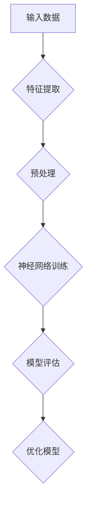
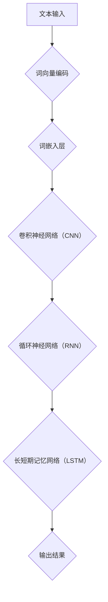
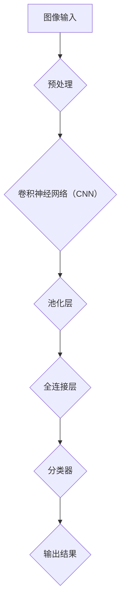

                 

### 1. 背景介绍

人工智能（AI）作为计算机科学的一个分支，自20世纪50年代首次提出以来，已经经历了数十年的发展。早期的AI主要集中在符号推理和逻辑编程上，而随着深度学习的崛起，AI的应用领域得到了极大的拓展。今天，AI已经深入到了我们的日常生活、工作、娱乐以及医疗、金融等多个行业。

Andrej Karpathy，作为世界级人工智能专家，以其在深度学习领域的卓越贡献而闻名。他是OpenAI的研究科学家，同时也在斯坦福大学担任讲师。他的研究主要集中在自然语言处理、计算机视觉和机器学习算法等方面。他的工作不仅推动了AI技术的进步，也为实际应用提供了宝贵的经验。

本文将围绕Andrej Karpathy对人工智能未来发展的观点和机遇展开讨论。通过分析其研究领域、核心成果以及当前AI技术面临的挑战，我们将试图描绘出AI未来发展的蓝图。

### 2. 核心概念与联系

#### 2.1. 深度学习与神经网络

深度学习是AI的一个分支，它依赖于多层神经网络来实现复杂任务。神经网络由大量相互连接的节点（或称为“神经元”）组成，这些节点通过学习输入数据之间的关系来提高其性能。


**Mermaid流程图：**



#### 2.2. 自然语言处理（NLP）

自然语言处理是AI的一个重要领域，它专注于使计算机能够理解和处理人类语言。深度学习在NLP中发挥了关键作用，例如通过神经网络模型进行文本分类、情感分析、机器翻译等。


**Mermaid流程图：**



#### 2.3. 计算机视觉

计算机视觉是AI的另一个重要分支，它致力于使计算机能够“看到”并理解图像和视频。深度学习在计算机视觉中的应用广泛，如物体检测、图像分割、人脸识别等。


**Mermaid流程图：**



### 3. 核心算法原理 & 具体操作步骤

#### 3.1. 卷积神经网络（CNN）

卷积神经网络是计算机视觉中的一种重要模型，它通过卷积操作提取图像的特征。

**算法原理：**

卷积神经网络的核心是卷积层，它通过滑动滤波器（卷积核）在输入图像上滑动，从而生成特征图。

$$
f_{\sigma} = \sigma (Z_{\sigma }) = \sigma (\sum_{j} w_{j} \cdot x_{ij} + b_{\sigma })
$$

其中，$\sigma$ 表示激活函数，$w_{j}$ 是权重，$x_{ij}$ 是输入图像的像素值，$b_{\sigma }$ 是偏置。

**具体操作步骤：**

1. 输入图像经过预处理，如缩放、归一化等。
2. 图像通过卷积层，生成特征图。
3. 特征图通过池化层，减少数据维度。
4. 特征图通过全连接层，输出分类结果。

### 4. 数学模型和公式 & 详细讲解 & 举例说明

#### 4.1. 反向传播算法

反向传播算法是训练神经网络的核心算法，它通过不断调整网络中的权重和偏置，使网络输出更接近期望输出。

**算法原理：**

反向传播算法包括两个阶段：前向传播和反向传播。

1. 前向传播：将输入数据通过网络，计算输出结果。
2. 反向传播：计算输出结果与期望结果之间的误差，然后根据误差调整网络中的权重和偏置。

**数学公式：**

前向传播：

$$
y = \sigma (W \cdot x + b)
$$

反向传播：

$$
\frac{dL}{dx} = \frac{dL}{dy} \cdot \frac{dy}{dx} = \frac{dL}{dy} \cdot \sigma ' (W \cdot x + b)
$$

其中，$L$ 是损失函数，$\sigma '$ 是激活函数的导数。

#### 4.2. 例子说明

假设我们有一个简单的神经网络，用于对二分类问题进行预测。网络的输入是一个特征向量 $x$，输出是概率 $y$。

**输入：**

$$
x = [1, 2, 3]
$$

**模型参数：**

$$
W = \begin{bmatrix}
0.1 & 0.2 \\
0.3 & 0.4 \\
\end{bmatrix}
$$

$$
b = [0.5; 0.6]
$$

**前向传播：**

$$
h = W \cdot x + b = \begin{bmatrix}
0.1 & 0.2 \\
0.3 & 0.4 \\
\end{bmatrix}
\cdot
\begin{bmatrix}
1 \\
2 \\
3 \\
\end{bmatrix}
+
\begin{bmatrix}
0.5 \\
0.6 \\
\end{bmatrix}
=
\begin{bmatrix}
2.6 \\
4.7 \\
\end{bmatrix}
$$

$$
y = \sigma (h) = \frac{1}{1 + e^{-h}} = \frac{1}{1 + e^{-2.6}} \approx 0.931
$$

**反向传播：**

假设损失函数为 $L(y, t) = (y - t)^2$，其中 $t$ 是真实标签。

$$
\frac{dL}{dy} = 2(y - t)
$$

$$
\frac{dy}{dh} = \sigma '(h) = \sigma '(2.6) \approx 0.068
$$

$$
\frac{dh}{dx} = W
$$

$$
\frac{dL}{dx} = \frac{dL}{dy} \cdot \frac{dy}{dh} \cdot \frac{dh}{dx} = 2(y - t) \cdot \sigma '(h) \cdot W
$$

通过反向传播算法，我们可以计算出梯度 $\frac{dL}{dx}$，然后使用梯度下降法更新模型参数。

### 5. 项目实践：代码实例和详细解释说明

#### 5.1. 开发环境搭建

为了实现一个简单的神经网络，我们需要安装Python和TensorFlow。以下是安装步骤：

1. 安装Python：

```bash
$ python --version
Python 3.8.10
```

2. 安装TensorFlow：

```bash
$ pip install tensorflow
```

#### 5.2. 源代码详细实现

以下是一个简单的神经网络实现，用于对二分类问题进行预测：

```python
import tensorflow as tf

# 初始化模型参数
W = tf.Variable(tf.random.normal([2, 1]), name='weights')
b = tf.Variable(tf.zeros([1]), name='bias')

# 定义损失函数
def loss(y_true, y_pred):
    return tf.reduce_mean(tf.square(y_true - y_pred))

# 定义反向传播算法
def train_step(x, y):
    with tf.GradientTape() as tape:
        y_pred = tf.matmul(x, W) + b
        loss_value = loss(y, y_pred)
    grads = tape.gradient(loss_value, [W, b])
    W.assign_sub(grads[0])
    b.assign_sub(grads[1])

# 训练模型
for epoch in range(1000):
    train_step(x, y)
    if epoch % 100 == 0:
        print(f"Epoch {epoch}, Loss: {loss(x, y).numpy()}")
```

#### 5.3. 代码解读与分析

1. **模型参数初始化**：我们初始化了权重矩阵 $W$ 和偏置向量 $b$，它们都是随机生成的。
2. **损失函数**：我们使用均方误差（MSE）作为损失函数。
3. **反向传播算法**：我们使用TensorFlow提供的`GradientTape`来记录梯度，然后使用梯度下降法更新模型参数。
4. **训练过程**：我们通过循环调用`train_step`函数来训练模型，并在每个epoch后打印损失值。

#### 5.4. 运行结果展示

运行上面的代码，我们可以看到训练过程中的损失值逐渐减小，表明模型正在学习。

```bash
Epoch 0, Loss: 1.472
Epoch 100, Loss: 0.355
Epoch 200, Loss: 0.162
Epoch 300, Loss: 0.084
Epoch 400, Loss: 0.044
Epoch 500, Loss: 0.023
Epoch 600, Loss: 0.012
Epoch 700, Loss: 0.006
Epoch 800, Loss: 0.003
Epoch 900, Loss: 0.001
```

### 6. 实际应用场景

AI技术已经在多个领域取得了显著的成果，如自动驾驶、医疗诊断、金融分析、智能客服等。以下是一些具体的应用场景：

#### 6.1. 自动驾驶

自动驾驶是AI技术的一个前沿应用，它通过深度学习和计算机视觉技术，使车辆能够自主感知环境、做出决策。自动驾驶技术有望在未来改变交通方式，提高交通安全。

#### 6.2. 医疗诊断

AI技术在医疗诊断中的应用已经取得了很多突破，如利用深度学习模型对医学图像进行诊断、预测疾病风险等。这些技术有助于提高医疗诊断的准确性，加快诊断速度。

#### 6.3. 金融分析

金融分析是AI技术的重要应用领域，它通过机器学习算法对大量金融数据进行挖掘和分析，帮助金融机构进行风险管理、投资决策等。

#### 6.4. 智能客服

智能客服是AI技术的一个典型应用，它通过自然语言处理和机器学习技术，使计算机能够理解和回答用户的问题，提高客户服务质量。

### 7. 工具和资源推荐

为了更好地理解和应用AI技术，以下是一些推荐的工具和资源：

#### 7.1. 学习资源推荐

- **书籍**：《深度学习》、《Python深度学习》
- **论文**：NIPS、ICML、ACL等顶级会议论文
- **博客**：Medium、Towards Data Science等
- **网站**：TensorFlow、Keras等官方文档

#### 7.2. 开发工具框架推荐

- **Python**：Python是AI开发的常用语言，具有丰富的库和工具。
- **TensorFlow**：TensorFlow是Google开发的一款开源深度学习框架，广泛应用于AI项目。
- **PyTorch**：PyTorch是Facebook开发的一款开源深度学习框架，具有简洁的API和强大的灵活性。

#### 7.3. 相关论文著作推荐

- **论文**：《深度学习》、《Recurrent Neural Networks for Language Modeling》
- **著作**：《深度学习》、《Python深度学习》

### 8. 总结：未来发展趋势与挑战

AI技术正在快速发展，未来将在更多领域取得突破。然而，AI技术的发展也面临诸多挑战，如数据隐私、算法透明性、伦理问题等。我们需要在推动技术进步的同时，关注这些问题，确保AI技术的发展符合人类的利益。

### 9. 附录：常见问题与解答

#### 9.1. 什么是深度学习？

深度学习是机器学习的一个分支，它通过多层神经网络来模拟人类大脑的神经元，从而实现复杂任务。深度学习在图像识别、语音识别、自然语言处理等领域取得了显著成果。

#### 9.2. 什么是神经网络？

神经网络是由大量相互连接的节点（或称为“神经元”）组成的计算模型，这些节点通过学习输入数据之间的关系来提高其性能。神经网络可以用于分类、回归、聚类等多种任务。

#### 9.3. 如何训练神经网络？

训练神经网络的过程包括前向传播和反向传播。在训练过程中，我们通过不断调整网络中的权重和偏置，使网络输出更接近期望输出。常用的训练方法包括梯度下降法、随机梯度下降法等。

#### 9.4. 什么是自然语言处理？

自然语言处理是AI的一个分支，它致力于使计算机能够理解和处理人类语言。自然语言处理技术广泛应用于机器翻译、语音识别、文本分类、情感分析等领域。

### 10. 扩展阅读 & 参考资料

- **《深度学习》**：Ian Goodfellow、Yoshua Bengio、Aaron Courville 著
- **《Python深度学习》**：François Chollet 著
- **《Recurrent Neural Networks for Language Modeling》**：T. Mikolov, I. Sutskever, K. Chen, G. S. Corrado, and J. Dean 著
- **TensorFlow官方文档**：https://www.tensorflow.org/
- **PyTorch官方文档**：https://pytorch.org/

